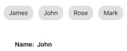

# Getting started with the Syncfusion chips

This section explains the steps required to create chips and arrange them in a layout for performing action. This section covers only the minimal features that you needed to know to get started with the chips.

## Adding Chips reference

You can add Chips reference using one of the following methods:

**Method 1: Adding Chips reference from nuget.org**

Syncfusion Xamarin components are available in [nuget.org](https://www.nuget.org/). To add Chips to your project, open the NuGet package manager in Visual Studio, search for [Syncfusion.Xamarin.Buttons](https://www.nuget.org/packages/Syncfusion.Xamarin.Buttons), and then install it.

N> 
* Install the same version of Chips NuGet in all the projects.
* In addition, you need to install the [Syncfusion.Xamarin.Buttons.WPF]() package for Xamarin.Forms WPF platform only.

**Method 2: Adding Chips reference from toolbox**

Syncfusion also provides Xamarin Toolbox. Using this toolbox, you can drag the Chips control to the XAML page. It will automatically install the required NuGet packages and add the namespace to the page. To install Syncfusion Xamarin Toolbox, refer to [Toolbox](https://help.syncfusion.com/xamarin/utility#toolbox).

**Method 3: Adding Chips assemblies manually from the installed location**

If you prefer to manually reference the assemblies instead referencing from NuGet, add the following assemblies in respective projects.

Location: {Installed location}/{version}/Xamarin/lib

<table>
<tr>
<td>PCL</td>
<td>Syncfusion.Buttons.XForms.dll Syncfusion.Core.XForms.dll Syncfusion.Licensing.dll </td>
</tr>
<tr>
<td>Android</td>
<td>Syncfusion.Buttons.XForms.dll Syncfusion.Buttons.XForms.Android.dll Syncfusion.Core.XForms.dll
 Syncfusion.Core.XForms.Android.dll Syncfusion.Licensing.dll </td>
</tr>
<tr>
<td>iOS</td>
<td>Syncfusion.Buttons.XForms.dll Syncfusion.Buttons.XForms.iOS.dll Syncfusion.Core.XForms.dll Syncfusion.Core.XForms.iOS.dll Syncfusion.Licensing.dll </td>
</tr>
<tr>
<td>UWP</td>
<td>Syncfusion.Buttons.XForms.dll Syncfusion.Buttons.XForms.UWP.dll Syncfusion.Core.XForms.dll Syncfusion.Core.XForms.UWP.dll Syncfusion.Licensing.dll </td>
</tr>
<tr>
<td>WPF</td>
<td>Syncfusion.Buttons.XForms.dll Syncfusion.Buttons.XForms.WPF.dll Syncfusion.Core.XForms.dll Syncfusion.Core.XForms.WPF.dll Syncfusion.Licensing.dll </td>
</tr>
</table>

N> To know more about obtaining our components, refer to these links for [Mac](https://help.syncfusion.com/xamarin/introduction/download-and-installation/mac/) and [Windows](https://help.syncfusion.com/xamarin/introduction/download-and-installation/windows/).

I> Starting with v16.2.0.x, if you reference Syncfusion assemblies from the trial setup or from the NuGet feed, you also have to include a license key in your projects. Please refer to [Syncfusion license key](https://help.syncfusion.com/common/essential-studio/licensing/license-key/) to know about registering Syncfusion license key in your Xamarin application to use our components.

## Launching an application on each platform with chips

To use the chips control inside an application, each platform application requires some additional configurations. The configurations vary from platform to platform and are discussed in the following sections:

### iOS

N> If you are adding the references from toolbox, this step is not needed.

#### For SfChip

To launch the [SfChip](https://help.syncfusion.com/cr/xamarin/Syncfusion.XForms.Buttons.SfChip.html) in iOS, call the `SfChipRenderer.Init()` method in the FinishedLaunching overridden method of the AppDelegate class after the Xamarin.Forms framework has been initialized and before the LoadApplication method is called as demonstrated in the following code sample:



public override bool FinishedLaunching(UIApplication app, NSDictionary options) 
{ 
	… 
	global::Xamarin.Forms.Forms.Init();

	Syncfusion.XForms.iOS.Buttons.SfChipRenderer.Init();

	LoadApplication(new App()); 
	…
}
	


#### For SfChipGroup

To launch the [SfChipGroup](https://help.syncfusion.com/cr/xamarin/Syncfusion.XForms.Buttons.SfChipGroup.html) in iOS, call the `SfChipGroupRenderer.Init()` method in the FinishedLaunching overridden method of the AppDelegate class after the Xamarin.Forms framework has been initialized and before the LoadApplication method is called as demonstrated in the following code sample:



public override bool FinishedLaunching(UIApplication app, NSDictionary options) 
{ 
	… 
	global::Xamarin.Forms.Forms.Init();

	Syncfusion.XForms.iOS.Buttons.SfChipGroupRenderer.Init();

	LoadApplication(new App()); 
	…
}
	


### Universal Windows Platform (UWP)

#### For SfChip

To deploy the [SfChip](https://help.syncfusion.com/cr/xamarin/Syncfusion.XForms.Buttons.SfChip.html) in `Release` mode, you need to initialize the SfChip assemblies in the App.xaml.cs file in the UWP project as shown in the following code sample.



	// In App.xaml.cs 

using Syncfusion.XForms.UWP.Buttons;

using Syncfusion.XForms.UWP.Border;

protected override void OnLaunched(LaunchActivatedEventArgs e)
{ 
	… 
	if (rootFrame == null) 
	{ 
		List<Assembly> assembliesToInclude = new List<Assembly>();
        assembliesToInclude.Add(typeof(SfButtonRenderer).GetTypeInfo().Assembly);
	    assembliesToInclude.Add(typeof(SfChipRenderer).GetTypeInfo().Assembly); 
		assembliesToInclude.Add(typeof(SfBorderRenderer).GetTypeInfo().Assembly);
		Xamarin.Forms.Forms.Init(e, assembliesToInclude); 
	} 
	… 
}
	


#### For SfChipGroup

To deploy the [SfChipGroup](https://help.syncfusion.com/cr/xamarin/Syncfusion.XForms.Buttons.SfChipGroup.html) in `Release` mode, you need to initialize the SfChipGroup assemblies in the App.xaml.cs file in the UWP project as shown in the following code sample.



	// In App.xaml.cs 

using Syncfusion.XForms.UWP.Buttons;

using Syncfusion.XForms.UWP.Border;

protected override void OnLaunched(LaunchActivatedEventArgs e)
{ 
	… 
	if (rootFrame == null) 
	{ 
		List<Assembly> assembliesToInclude = new List<Assembly>();
    	assembliesToInclude.Add(typeof(SfButtonRenderer).GetTypeInfo().Assembly);
		assembliesToInclude.Add(typeof(SfChipGroupRenderer).GetTypeInfo().Assembly);
		assembliesToInclude.Add(typeof(SfBorderRenderer).GetTypeInfo().Assembly); 
		Xamarin.Forms.Forms.Init(e, assembliesToInclude); 
	} 
	… 
}
	


### Windows Presentation Foundation (WPF)

To launch the chip group and chip in WPF, call the SfChipGroupRenderer.Init() and SfChipRenderer.Init() methods in the MainWindow constructor of the MainWindow class after the Xamarin.Forms framework has been initialized and before the LoadApplication method is called as demonstrated in the following code sample.

 

public partial class MainWindow : FormsApplicationPage
{
     public MainWindow()
     {
		InitializeComponent();
		 
		Forms.Init();
		 
		Syncfusion.XForms.WPF.Border.SfBorderRenderer.Init();
		//For chip group 
		Syncfusion.XForms.WPF.Buttons.SfChipGroupRenderer.Init();
		// For chip 
		Syncfusion.XForms.WPF.Buttons.SfChipRenderer.Init();
		 
		LoadApplication(new App());
     }
}



### Android

The Android platform does not require any additional configuration to render the chips control.

## Initialize chips

Import the [SfChipGroup](https://help.syncfusion.com/cr/xamarin/Syncfusion.XForms.Buttons.html) namespace in respective page.





xmlns:buttons="clr-namespace:Syncfusion.XForms.Buttons;assembly=Syncfusion.Buttons.XForms"
	




using Syncfusion.XForms.Buttons;





Then initialize an empty SfChipGroup as shown in the following code:





<ContentPage
    xmlns="http://xamarin.com/schemas/2014/forms"
    xmlns:buttons="clr-namespace:Syncfusion.XForms.Buttons;assembly=Syncfusion.Buttons.XForms"
    xmlns:x="http://schemas.microsoft.com/winfx/2009/xaml"
    xmlns:local="clr-namespace:Chips"
    x:Class="Chips.GettingStarted">
	<ContentPage.Content>
		<Grid>
			<buttons:SfChipGroup/>
		</Grid>
	</ContentPage.Content>
</ContentPage>

	




using Syncfusion.XForms.Buttons;
using Xamarin.Forms;

namespace Chips
{
	public partial class GettingStarted: ContentPage
	{
		public GettingStarted()
		{
			InitializeComponent();
			Grid grid = new Grid();
			grid.Children.Add(new SfChipGroup());
			this.Content = grid;
		}
	}
}





## Set layout for the control

Any layout can be used to arrange the chips in the chips control using `ChipLayout` property.The chips control creates chip for each object and arranges chips in a StackLayout with horizontal orientation. Any layout can be used to arrange the chips in the chips control.In the following example, the `FlexLayout` has been used. 





<ContentPage
	xmlns="http://xamarin.com/schemas/2014/forms"
	xmlns:buttons="clr-namespace:Syncfusion.XForms.Buttons;assembly=Syncfusion.Buttons.XForms"
	xmlns:x="http://schemas.microsoft.com/winfx/2009/xaml"
	xmlns:local="clr-namespace:Chips"
	x:Class="Chips.GettingStarted">
	<ContentPage.Content>
		<Grid>
			<buttons:SfChipGroup>
				<buttons:SfChipGroup.ChipLayout>
					<FlexLayout 
						HorizontalOptions="Start" 
						VerticalOptions="Center" 
						Direction="Row" 
						Wrap="Wrap"
						JustifyContent="Start"
						AlignContent="Start" 
						AlignItems="Start"/>
				</buttons:SfChipGroup.ChipLayout>
			</buttons:SfChipGroup> 
		</Grid>
	</ContentPage.Content>
</ContentPage >
	




using Syncfusion.XForms.Buttons;
using Xamarin.Forms;

namespace Chips
{
	public partial class GettingStarted: ContentPage
	{
		public GettingStarted()
		{
			InitializeComponent();
			Grid grid = new Grid();
			SfChipGroup chipGroup = new SfChipGroup();
			grid.Children.Add(chipGroup);
			FlexLayout layout = new FlexLayout()
			{
				Direction = FlexDirection.Row,
				Wrap = FlexWrap.Wrap,
				HorizontalOptions = LayoutOptions.Start,
				VerticalOptions = LayoutOptions.Center,
				AlignContent = FlexAlignContent.Start,
				JustifyContent = FlexJustify.Start,
				AlignItems = FlexAlignItems.Start,
			};
			chipGroup.ChipLayout = layout;
			this.Content = grid;
		}
	}
}





## Populating business objects

Now, define a simple data model of person with the name and image properties. Create a view model class and initialize a collection of persons as shown in the following code sample.



namespace Chips
{
	//Model class for chips
	public class Person
	{
		public string Name
		{
			get;
			set;
		}
	}
}





using System.Collections.ObjectModel;
using System.ComponentModel;
namespace Chips
{
	//View model class for chips
	public class ViewModel : INotifyPropertyChanged
	{
		private ObservableCollection<Person> employees;
		public ObservableCollection<Person> Employees
		{
			get
			{
				return employees;
			}
			set
			{
				Employees = value;
				OnPropertyChanged("Employees");
			}
		}

		public ViewModel()
		{
			employees = new ObservableCollection<Person>();
			employees.Add(new Person() { Name = "John" });
			employees.Add(new Person() { Name = "James" });
			employees.Add(new Person() { Name = "Linda" });
			employees.Add(new Person() { Name = "Rose" });
			employees.Add(new Person() { Name = "Mark" });
		}

		public event PropertyChangedEventHandler PropertyChanged;

		public void OnPropertyChanged(string property)
		{
			if (PropertyChanged != null)
			{
				PropertyChanged(this, new PropertyChangedEventArgs(property));
			}
		}
	}
}



Create an instance of ViewModel class,and then set it as the `BindingContext`. Bind the `ItemsSource` property with a collection, and then set the `DisplayMemberPath` property:





<ContentPage
	xmlns="http://xamarin.com/schemas/2014/forms"
	xmlns:buttons="clr-namespace:Syncfusion.XForms.Buttons;assembly=Syncfusion.Buttons.XForms"
	xmlns:x="http://schemas.microsoft.com/winfx/2009/xaml"
	xmlns:local="clr-namespace:Chips"
	x:Class="Chips.GettingStarted">
	<ContentPage.BindingContext>
		<local:ViewModel x:Name="viewModel"/>
	</ContentPage.BindingContext>
	<ContentPage.Content>
		<Grid>
			<buttons:SfChipGroup 
				ItemsSource="{Binding Employees}" 
				ChipPadding="8,8,0,0" 
				DisplayMemberPath="Name">
				<buttons:SfChipGroup.ChipLayout>
					<FlexLayout 
						HorizontalOptions="Start" 
						VerticalOptions="Center" 
						Direction="Row" 
						Wrap="Wrap"
						JustifyContent="Start"
						AlignContent="Start" 
						AlignItems="Start"/>
				</buttons:SfChipGroup.ChipLayout>
			</buttons:SfChipGroup>  
		</Grid>
	</ContentPage.Content>
</ContentPage>




using Syncfusion.XForms.Buttons;
using System.Collections.ObjectModel;
using System.ComponentModel;
namespace Chips
{
	public partial class GettingStarted: ContentPage
	{
		public GettingStarted()
		{
			InitializeComponent();
			Grid grid = new Grid();
			SfChipGroup chipGroup = new SfChipGroup();
			grid.Children.Add(chipGroup);
			FlexLayout layout = new FlexLayout()
			{
				Direction = FlexDirection.Row,
				Wrap = FlexWrap.Wrap,
				HorizontalOptions = LayoutOptions.Start,
				VerticalOptions = LayoutOptions.Center,
				AlignContent = FlexAlignContent.Start,
				JustifyContent = FlexJustify.Start,
				AlignItems = FlexAlignItems.Start,
			};
			chipGroup.ChipLayout = layout;
			this.BindingContext = new ViewModel();
			chipGroup.SetBinding(SfChipGroup.ItemsSourceProperty, "Employees");
			chipGroup.DisplayMemberPath = "Name";
			chipGroup.ChipPadding = new Thickness(8, 8, 0, 0);
			this.Content = grid;
		}
	}
}





## Set types of chip group
The functionality of chips control differ based on its [Type](https://help.syncfusion.com/xamarin/chips/types) property.
By default type of chips control have Input type. Input chip types have close button, using it chip can be can removed dynamically from children and the layout. 

The following code example uses the `Action` type. In Action type, `Command` property of SfChipGroup is executed when any chip in the group is tapped. Here the Employee name of corresponding chip is set as label text when the Command is executed.





<ContentPage
	xmlns="http://xamarin.com/schemas/2014/forms"
	xmlns:buttons="clr-namespace:Syncfusion.XForms.Buttons;assembly=Syncfusion.Buttons.XForms"
	xmlns:x="http://schemas.microsoft.com/winfx/2009/xaml"
	xmlns:local="clr-namespace:Chips"
	x:Class="Chips.GettingStarted">
	<ContentPage.BindingContext>
		<local:ViewModel/>
	</ContentPage.BindingContext>
	<ContentPage.Content>
		<StackLayout>
			<buttons:SfChipGroup
				Command="{Binding ActionCommand}" 
				ItemsSource="{Binding Employees}"
				Type="Action">
			</buttons:SfChipGroup>
			<StackLayout Orientation="Horizontal">
			<Label 
				Text="Name:" 
				FontAttributes="Bold" 
				FontSize="14" />
			<Label 
				Text="{Binding Result}"
				FontAttributes="Bold" 
				FontSize="14" />
			</StackLayout>
		</StackLayout>  
	</ContentPage.Content>
</ContentPage>





using System;
using System.Collections.Generic;
using System.Collections.ObjectModel;
using System.ComponentModel;
using System.Windows.Input;
using Xamarin.Forms;

namespace Chips
{
	public class ViewModel :INotifyPropertyChanged
	{
		private ICommand actionCommand;

		private ObservableCollection<Person> employees;

		private string result;

		public ICommand ActionCommand
		{
			get
			{
				return actionCommand;
			}
			set
			{
				actionCommand = value;
			}
		}

		public ObservableCollection<Person> Employees
		{
			get
			{
				return employees;
			}
			set
			{
				Employees = value;
				OnPropertyChanged("Employees");
			}
		}

		public string Result
		{
			get
			{
				return result;
			}
			set
			{
				result = value;
				OnPropertyChanged("Result");
			}
		}

		public ViewModel()
		{
			ActionCommand = new Command(HandleAction);
			employees = new ObservableCollection<Person>();
			employees.Add(new Person() { Name = "John" });
			employees.Add(new Person() { Name = "James" });
			employees.Add(new Person() { Name = "Linda" });
			employees.Add(new Person() { Name = "Rose" });
			employees.Add(new Person() { Name = "Mark" });
		}

		public event PropertyChangedEventHandler PropertyChanged;

		public void OnPropertyChanged(string property)
		{
			if (PropertyChanged != null)
			{
				PropertyChanged(this, new PropertyChangedEventArgs(property));
			}
		}

		private void HandleAction(object obj)
		{
			Result = (obj as Person).Name.ToString();
		}
	}
}





You can find the complete getting started sample from this [link.](http://www.syncfusion.com/downloads/support/directtrac/general/ze/GettingStarted1258894659.zip)

## See also

[How to select a multiple chips from the Xamarin ChipGroup [SfChipGroup]](https://www.syncfusion.com/kb/11155/how-to-select-a-multiple-chips-from-the-xamarin-chipgroup-sfchipgroup)

[How to display each chip in different colors in the Xamarin.Forms ChipGroup](https://www.syncfusion.com/kb/10940/how-to-display-each-chip-in-different-colors-in-the-xamarin-forms-chipgroup)
