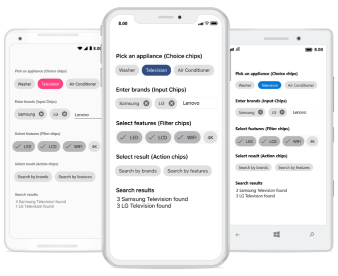

# Overview

The chips control for Xamarin.Forms presents information in an interactive and customizable layout. It also arranges multiple chips in a user-preferred layout and groups them to make selections. 

## Key Features

* Supports using StackLayout, FlexLayout, Grid, AbsoluteLayout, and RelativeLayout as the a layout for adding and arranging chips.
* Provides options to choose from the four different types Input, Choice, Filter and Action chips each has different behavior as a group. 
* Allows you make single and multiple selections in the Choice and Filter chips, respectively.
* Provides a way to add a view at the end of the group using the Input type chips.
* Provides command support for the a group of chips and individual chips are provided in Action chips.
* Provides user-friendly customization support and various options to customize the corner radius, border color, border thickness, text color, background color, close button color, selection indicator color, etc.

