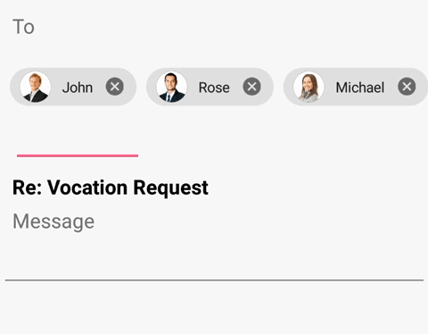
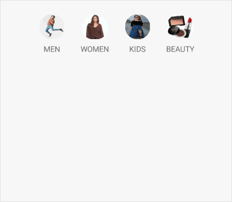
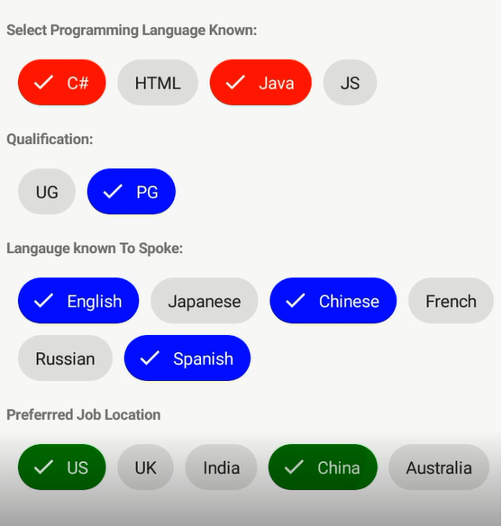

# Chips Types in Xamarin Chips

The functionality of chips control differs based on the [`Type`](https://help.syncfusion.com/cr/xamarin/Syncfusion.XForms.Buttons.SfChipGroup.html#Syncfusion_XForms_Buttons_SfChipGroup_Type) property. No operation can be performed in a chip group unless the [`Type`](https://help.syncfusion.com/cr/xamarin/Syncfusion.XForms.Buttons.SfChipGroup.html#Syncfusion_XForms_Buttons_SfChipGroup_Type) property is set. The chips control provides four different types, and each has its own functionality. Default value of [`Type`](https://help.syncfusion.com/cr/xamarin/Syncfusion.XForms.Buttons.SfChipGroup.html#Syncfusion_XForms_Buttons_SfChipGroup_Type) is [`Input`](https://help.syncfusion.com/cr/xamarin/Syncfusion.XForms.Buttons.SfChipsType.html#Syncfusion_XForms_Buttons_SfChipsType_Input). The types are,

* [`Input`](https://help.syncfusion.com/cr/xamarin/Syncfusion.XForms.Buttons.SfChipsType.html#Syncfusion_XForms_Buttons_SfChipsType_Input)
* [`Choice`](https://help.syncfusion.com/cr/xamarin/Syncfusion.XForms.Buttons.SfChipsType.html#Syncfusion_XForms_Buttons_SfChipsType_Choice)
* [`Filter`](https://help.syncfusion.com/cr/xamarin/Syncfusion.XForms.Buttons.SfChipsType.html#Syncfusion_XForms_Buttons_SfChipsType_Filter)
* [`Action`](https://help.syncfusion.com/cr/xamarin/Syncfusion.XForms.Buttons.SfChipsType.html#Syncfusion_XForms_Buttons_SfChipsType_Action)

N> Chips are arranged in [ChipLayout](https://help.syncfusion.com/cr/xamarin/Syncfusion.XForms.Buttons.SfChipGroup.html#Syncfusion_XForms_Buttons_SfChipGroup_ChipLayout), which is a type of [layout](https://docs.microsoft.com/en-us/xamarin/xamarin-forms/user-interface/controls/layouts#layouts-with-multiple-children). StackLayout with horizontal orientation is a default type of [ChipLayout](https://help.syncfusion.com/cr/xamarin/Syncfusion.XForms.Buttons.SfChipGroup.html#Syncfusion_XForms_Buttons_SfChipGroup_ChipLayout).

## Input

Arranges the chips in a layout and enables the close button for each chip. Using the close button, a chip can be removed from children and layout as well. Additionally, it has support to add an option [`InputView`](https://help.syncfusion.com/xamarin/chips/customization#inputview) at the end of the layout, from which users can obtain the chip text for creating a chip at run time.

N> The [`InputView`](https://help.syncfusion.com/xamarin/chips/customization#inputview) is supported only in [`Input`](https://help.syncfusion.com/cr/xamarin/Syncfusion.XForms.Buttons.SfChipsType.html#Syncfusion_XForms_Buttons_SfChipsType_Input) type.

The following code illustrates how to get an input type chip.


<buttons:SfChipGroup 
		VerticalOptions="Center" 
		x:Name="inputChipGroup" ChipImageWidth="35" 
		ItemsSource="{Binding InputItems,Mode=TwoWay}"
		DisplayMemberPath="PersonName" 
		ImageMemberPath="PersonImage" 
		ShowIcon="True"
		Type="Input" 
		ChipPadding="8,8,0,0">
		<buttons:SfChipGroup.InputView>
			<Entry x:Name="entry"
			VerticalOptions="Center" HeightRequest="40"
			FontSize="15" 
			WidthRequest="110" 
			Completed="Entry_Completed"
			Margin="10,10,0,0">
			</Entry>
		</buttons:SfChipGroup.InputView>
		<buttons:SfChipGroup.ChipLayout>
			<FlexLayout 
			HorizontalOptions="Start" 
			VerticalOptions="Center" 
			Direction="Row" 
			Wrap="Wrap" 
			JustifyContent="Start" 
			AlignContent="Start" 
			AlignItems="Start"/>
	</buttons:SfChipGroup.ChipLayout>
</buttons:SfChipGroup>
	




[MainPage.cs]
...
private void Entry_Completed(object sender, EventArgs e)
{
	var viewModel = this.BindingContext as ViewModel;
	var image = random.Next(1,20);
	var name = (sender as InputView).Text;
	viewModel.InputItems.Add(new Model() {PersonName=name, PersonImage=Images[image]});
	entry.Text = "";
}
..

[ViewModel]

public class ViewModel
{
	public ViewModel()
	{
		InputItems = new ObservableCollection<Model>();
		InputItems.Add(new Model() { PersonName = "John", PersonImage = ImageSource.FromResource("ChipType_Sample.Image21.png") });
		InputItems.Add(new Model() {PersonName="Rose", PersonImage = ImageSource.FromResource("ChipType_Sample.Image22.png") });
		InputItems.Add(new Model() {PersonName="Michael", PersonImage = ImageSource.FromResource("ChipType_Sample.Image23.png") });

	}
	public ObservableCollection<Model> InputItems
	{
		get;set;
	}
}

[Model]

public class Model:INotifyPropertyChanged
{
	private string personName;
	public string PersonName
	{
		get { return personName; }
		set { personName = value; OnPropertyChanged("PersonName"); }
	}

	private ImageSource personImage;
	public ImageSource PersonImage
	{
		get { return personImage; }
		set { personImage = value; OnPropertyChanged("PersonImage"); }
	}
	
	public event PropertyChangedEventHandler PropertyChanged;
	protected void OnPropertyChanged(string propertyName)
	{
		if (PropertyChanged != null)
		{
			PropertyChanged(this, new PropertyChangedEventArgs(propertyName));
		}
	}
}



Download the complete sample [here](https://github.com/SyncfusionExamples/How-to-create-input-typed-chip-example-in-Xamarin.Forms).

## Choice

Allows users to select a single chip from a group of items. Selecting a chip will automatically deselect the previously selected chips. The selected chip color can be customized using the [`SelectedChipBackgroundColor`](https://help.syncfusion.com/xamarin/chips/customization#selectedchipbackgroundcolor) and [`SelectedChipTextColor`](https://help.syncfusion.com/xamarin/chips/customization#selectedchiptextcolor) properties. The `SelectedItem` property holds the instance of recently selected chip.

This selection changes are notified by using [SelectionChanging](https://help.syncfusion.com/xamarin/chips/events#selectionchanging-event) and [SelectionChanged](https://help.syncfusion.com/xamarin/chips/events#selectionchanged-event) events.

You can customize the chip view using [ItemTemplate](https://help.syncfusion.com/cr/xamarin/Syncfusion.XForms.Buttons.SfChipGroup.html#Syncfusion_XForms_Buttons_SfChipGroup_ItemTemplate) of [`SfChipGroup`](https://help.syncfusion.com/cr/xamarin/Syncfusion.XForms.Buttons.SfChipGroup.html).

The following code illustrates how to get choice typed ChipGroup.


<buttons:SfChipGroup 
	VerticalOptions="Center" 
	ChipImageWidth="40" x:Name="choiceType"
	ItemsSource="{Binding ChoiceItems,Mode=TwoWay}" 
	ChipBackgroundColor="Transparent" 
	SelectedChipBackgroundColor="Transparent" 
	Type="Choice" 
	ChipPadding="8,8,0,0">
	<buttons:SfChipGroup.ItemTemplate>
		<DataTemplate>
			<StackLayout>
				<border:SfBorder CornerRadius="20" WidthRequest="40" HeightRequest="40" BorderColor="Transparent" >
					<Image Source="{Binding PersonImage}" Aspect="Fill" VerticalOptions="Center" HorizontalOptions="Center"/>
				</border:SfBorder>
				<Label Text="{ Binding PersonName}" VerticalOptions="Center" HorizontalOptions="Center"/>
			</StackLayout>
		</DataTemplate>
	</buttons:SfChipGroup.ItemTemplate>
	<buttons:SfChipGroup.ChipLayout>
		<FlexLayout 
						HorizontalOptions="Start" 
						VerticalOptions="Center" 
						Direction="Row" 
						Wrap="Wrap" 
						JustifyContent="Start" 
						AlignContent="Start" 
						AlignItems="Start"/>
	</buttons:SfChipGroup.ChipLayout>
</buttons:SfChipGroup>




[Model]
public class Model : INotifyPropertyChanged
{
	private string personName;
	public string PersonName
	{
		get { return personName; }
		set { personName = value; OnPropertyChanged("PersonName"); }
	}

	private ImageSource personImage;
	public ImageSource PersonImage
	{
		get { return personImage; }
		set { personImage = value; OnPropertyChanged("PersonImage"); }
	}

	private ObservableCollection<ImageSource> categoryImage;
	public ObservableCollection<ImageSource> CategoryImage
	{
		get { return categoryImage; }
		set { categoryImage = value;

			PropertyChanged?.Invoke(this,new PropertyChangedEventArgs("CategoryImage"));
		}
	}

	public event PropertyChangedEventHandler PropertyChanged;
	protected void OnPropertyChanged(string propertyName)
	{
		if (PropertyChanged != null)
		{
			PropertyChanged(this, new PropertyChangedEventArgs(propertyName));
		}
	}
}

[ViewModel]

public class ViewModel
{
	public ViewModel()
	{
		ChoiceItems = new ObservableCollection<Model>()
		{
			new Model()
			{
				PersonName = "MEN",
				PersonImage = ImageSource.FromResource("ChipType_Sample.Mens.Image2.jpg"),
				CategoryImage = new ObservableCollection<ImageSource>()
				{
					ImageSource.FromResource("ChipType_Sample.Mens.Image1.jpg"),
					ImageSource.FromResource("ChipType_Sample.Mens.Image2.jpg"),
					ImageSource.FromResource("ChipType_Sample.Mens.Image3.jpg"),
					ImageSource.FromResource("ChipType_Sample.Mens.Image4.jpg")
				}
			},
			new Model()
			{
				PersonName = "WOMEN",
				PersonImage = ImageSource.FromResource("ChipType_Sample.Girls.Image2.png"),
				CategoryImage = new ObservableCollection<ImageSource>()
				{
					ImageSource.FromResource("ChipType_Sample.Girls.Image1.png"),
					ImageSource.FromResource("ChipType_Sample.Girls.Image2.png"),
					ImageSource.FromResource("ChipType_Sample.Girls.Image3.png"),
					ImageSource.FromResource("ChipType_Sample.Girls.Image4.png"),
					ImageSource.FromResource("ChipType_Sample.Girls.Image5.png")
				}
			},
			new Model()
			{
				PersonName = "KIDS",
				PersonImage = ImageSource.FromResource("ChipType_Sample.Kids.download.jpg"),
				CategoryImage=new ObservableCollection<ImageSource>
				{
					ImageSource.FromResource("ChipType_Sample.Kids.Kid1.jpg"),
					ImageSource.FromResource("ChipType_Sample.Kids.Kid2.jpg"),
					ImageSource.FromResource("ChipType_Sample.Kids.Kid3.jpg"),
					ImageSource.FromResource("ChipType_Sample.Kids.Kid4.jpg"),
					ImageSource.FromResource("ChipType_Sample.Kids.Kid5.jpg"),
					ImageSource.FromResource("ChipType_Sample.Kids.Kid6.jpg")
				}
			},
			new Model()
			{
				PersonName = "BEAUTY",
				PersonImage = ImageSource.FromResource("ChipType_Sample.Makeup.4.jpg"),
				CategoryImage=new ObservableCollection<ImageSource>()
				{
					ImageSource.FromResource("ChipType_Sample.Makeup.1.jpg"),
					ImageSource.FromResource("ChipType_Sample.Makeup.2.jpg"),
					ImageSource.FromResource("ChipType_Sample.Makeup.3.jpg"),
					ImageSource.FromResource("ChipType_Sample.Makeup.4.jpg")
				}
			}
		};
	}
	
	public ObservableCollection<Model> ChoiceItems
	{
		get; set;
	}
}



Download the complete sample [here](https://github.com/SyncfusionExamples/How-to-create-choice-typed-chip-in-Xamarin.Forms).

### ChoiceMode

The [`ChoiceMode`](https://help.syncfusion.com/cr/xamarin/Syncfusion.XForms.Buttons.SfChipGroup.html#Syncfusion_XForms_Buttons_SfChipGroup_ChoiceMode) property allows user to set the selection mode for Choice type [`SfChipGroup`](https://help.syncfusion.com/cr/xamarin/Syncfusion.XForms.Buttons.SfChipGroup.html). The default value of [`ChoiceMode`](https://help.syncfusion.com/cr/xamarin/Syncfusion.XForms.Buttons.SfChipGroup.html#Syncfusion_XForms_Buttons_SfChipGroup_ChoiceMode) property is [`Single`](https://help.syncfusion.com/cr/xamarin/Syncfusion.XForms.Buttons.ChoiceMode.html#Syncfusion_XForms_Buttons_ChoiceMode_Single). The [`ChoiceMode`](https://help.syncfusion.com/cr/xamarin/Syncfusion.XForms.Buttons.SfChipGroup.html#Syncfusion_XForms_Buttons_SfChipGroup_ChoiceMode) supports the following types of selection mode:

[`Single`](https://help.syncfusion.com/cr/xamarin/Syncfusion.XForms.Buttons.ChoiceMode.html#Syncfusion_XForms_Buttons_ChoiceMode_Single) - At least, one item must be in selected state and the selected item cannot be deselected, if [`ChoiceMode`](https://help.syncfusion.com/cr/xamarin/Syncfusion.XForms.Buttons.SfChipGroup.html#Syncfusion_XForms_Buttons_SfChipGroup_ChoiceMode) is Single.

[`SingleOrNone`](https://help.syncfusion.com/cr/xamarin/Syncfusion.XForms.Buttons.ChoiceMode.html#Syncfusion_XForms_Buttons_ChoiceMode_SingleOrNone) - Unlike [`Single`](https://help.syncfusion.com/cr/xamarin/Syncfusion.XForms.Buttons.ChoiceMode.html#Syncfusion_XForms_Buttons_ChoiceMode_Single), it is possible to deselect the selected item and keep all the items in deselected state.





<ContentPage
    xmlns="http://xamarin.com/schemas/2014/forms"
    xmlns:buttons="clr-namespace:Syncfusion.XForms.Buttons;assembly=Syncfusion.Buttons.XForms"
    xmlns:x="http://schemas.microsoft.com/winfx/2009/xaml"
    xmlns:local="clr-namespace:Chips"
    x:Class="Chips.GettingStarted">
	<ContentPage.Content>
		<buttons:SfChipGroup Type="Choice" ChoiceMode="SingleOrNone">
			<buttons:SfChipGroup.Items>
				<buttons:SfChip Text="Extra Small"/>
				<buttons:SfChip Text="Small"/>
				<buttons:SfChip Text="Medium"/>
				<buttons:SfChip Text="Large"/>
				<buttons:SfChip Text="Extra Large"/>
			</buttons:SfChipGroup.Items>
		</buttons:SfChipGroup>
	</ContentPage.Content>
</ContentPage>





using Syncfusion.XForms.Buttons;
using Xamarin.Forms;

namespace Chips
{
	public partial class GettingStarted: ContentPage
	{
		public GettingStarted()
		{
			InitializeComponent();
			Grid grid = new Grid();
			var chipGroup = new SfChipGroup(){Type = SfChipsType.Choice, ChoiceMode = ChoiceMode.SingleOrNone};
			grid.Children.Add(chipGroup);
			chipGroup.Items.Add(new SfChip(){Text="Extra Small"});
			chipGroup.Items.Add(new SfChip(){Text="Small"});
			chipGroup.Items.Add(new SfChip(){Text="Medium"});
			chipGroup.Items.Add(new SfChip(){Text="Large"});
			chipGroup.Items.Add(new SfChip(){Text="Extra Large"});
			this.Content = grid;
		}
	}
}





## Filter

Allows users to select more than one chip in a group of chips. The selected chips are indicated by selection indicator in this type. The selection indicator can be customized using the [`SelectionIndicatorColor`](https://help.syncfusion.com/xamarin/chips/customization#selectionindicatorcolor-1)property. Use the [`SelectedItems`](https://help.syncfusion.com/cr/xamarin/Syncfusion.XForms.Buttons.SfChipGroup.html#Syncfusion_XForms_Buttons_SfChipGroup_SelectedItems) property to get the list of selected chips.

This selection changes are notified by using [SelectionChanging](https://help.syncfusion.com/xamarin/chips/events#selectionchanging-event) and [SelectionChanged](https://help.syncfusion.com/xamarin/chips/events#selectionchanged-event) events.

The following code illustrates how to get filter typed ChipGroup.

<buttons:SfChipGroup 
	Type="Filter"   
	ItemsSource="{Binding Languages}"
	SelectedChipBackgroundColor="Red"
	ChipPadding="8,8,0,0" 
	SelectionIndicatorColor="White"
	DisplayMemberPath="Name">
	<buttons:SfChipGroup.ChipLayout>
		<FlexLayout 
			HorizontalOptions="Start" 
			VerticalOptions="Center" 
			Direction="Row" 
			Wrap="Wrap"
			JustifyContent="Start"
			AlignContent="Start" 
			AlignItems="Start"/>
	</buttons:SfChipGroup.ChipLayout>
</buttons:SfChipGroup>


[ViewModel]
public class ViewModel : INotifyPropertyChanged
{
	private ObservableCollection<Language> languages;

	...

	public event PropertyChangedEventHandler PropertyChanged;

	public ObservableCollection<Language> Languages
	{
		get
		{
			return languages;
		}
		set
		{
			languages = value;
			PropertyChanged?.Invoke(this, new PropertyChangedEventArgs("Languages"));
		}
	}
	
	...

	public ViewModel()
	{
		Languages = new ObservableCollection<Language>();
		Languages.Add(new Language() { Name = "C#" });
		Languages.Add(new Language() { Name = "HTML" });
		Languages.Add(new Language() { Name = "Java" });
		Languages.Add(new Language() { Name = "JS" });
      ...
	}
}

[Language Model]

public class Language
{
	public string Name { get; set; }
}



Download the complete sample [here](https://github.com/SyncfusionExamples/How-to-create-filter-typed-chip-in-Xamarin.Forms).

## Action

Action type of [`SfChipGroup`](https://help.syncfusion.com/cr/xamarin/Syncfusion.XForms.Buttons.SfChipGroup.html), executes the [`Command`](https://help.syncfusion.com/xamarin/chips/customization#command) when clicking the chip in [`SfChipGroup`](https://help.syncfusion.com/cr/xamarin/Syncfusion.XForms.Buttons.SfChipGroup.html). On its [`Command`](https://help.syncfusion.com/xamarin/chips/customization#command) action, you can do our desired action.

The [`Command`](https://help.syncfusion.com/xamarin/chips/customization#command) will execute only for action typed [`SfChipGroup`](https://help.syncfusion.com/cr/xamarin/Syncfusion.XForms.Buttons.SfChipGroup.html).

The following code illustrates how to get action typed ChipGroup.


<buttons:SfChipGroup 
		VerticalOptions="Center" 
		ChipImageWidth="60" 
		ItemsSource="{Binding InputItems,Mode=TwoWay}" 
		DisplayMemberPath="PersonName" 
		ImageMemberPath="PersonImage"
		ShowIcon="True"
		Type="Action" Command="{Binding ActionCommand}" 
		ChipPadding="8,8,0,0">
	<buttons:SfChipGroup.ChipLayout>
		<FlexLayout 
				HorizontalOptions="Start" 
				VerticalOptions="Center" 
				Direction="Row" 
				Wrap="Wrap" 
				JustifyContent="Start" 
				AlignContent="Start" 
				AlignItems="Start"/>
	</buttons:SfChipGroup.ChipLayout>
</buttons:SfChipGroup>



[Model]
public class Model:INotifyPropertyChanged
{
	private string personName;
	public string PersonName
	{
		get { return personName; }
		set { personName = value; OnPropertyChanged("PersonName"); }
	}

	private ImageSource personImage;
	public ImageSource PersonImage
	{
		get { return personImage; }
		set { personImage = value; OnPropertyChanged("PersonImage"); }
	}

	private string personMailId;

	public string PersonMailId
	{
		get { return personMailId; }
		set { personMailId = value; OnPropertyChanged("PersonMailId"); }
	}

	...
}

[ViewModel]
public class ViewModel:INotifyPropertyChanged
{
	...
	public event PropertyChangedEventHandler PropertyChanged;
	...
	public ObservableCollection<Model> InputItems
	{
		get; set;
	}

	public Command ActionCommand { get; set; }

	private void ShowPopup(Object obj)
	{
	    //to your desired action
	}

	public ViewModel()
	{
		InputItems = new ObservableCollection<Model>();
		InputItems.Add(new Model() { PersonName = "John", PersonImage = ImageSource.FromResource("ChipType_Sample.Image1.png"), PersonMailId = "john@emil.com" });
		InputItems.Add(new Model() { PersonName = "Rose", PersonImage = ImageSource.FromResource("ChipType_Sample.Image2.png"), PersonMailId = "rose@emil.com" });
		ActionCommand = new Command(ShowPopup);
	}
}



Download the complete sample [here](https://github.com/SyncfusionExamples/How-to-create-action-typed-chip-in-Xamarin.Forms).

## See also

[How to remove the indicator icon from Xamarin.Forms chip group (SfChipGroup)](https://support.syncfusion.com/kb/article/9826/how-to-remove-the-indicator-icon-from-xamarin-forms-chip-group-sfchipgroup?isInternalRefresh=False)

[How to restrict chip selection in Xamarin](https://support.syncfusion.com/kb/article/9678/how-to-restrict-chip-selection-in-xamarin?isInternalRefresh=False)

[How to select a multiple chips from the Xamarin ChipGroup [SfChipGroup]](https://support.syncfusion.com/kb/article/9657/how-to-select-a-multiple-chips-from-the-xamarin-chipgroup-sfchipgroup?isInternalRefresh=False)

