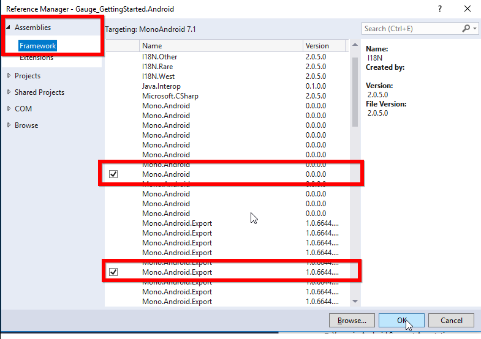

---

layout: post
title: Syncfusion SfCircularGauge control for Xamarin.Forms
description:  A quick tour to initial users about the Syncfusion CircularGauge control for the Xamarin.Forms Platform
platform: xamarin
control: SfCircularGauge
documentation: ug

---

# Getting Started with SfCircularGauge

This section explains the steps required to configure the [`SfCircularGauge`](https://help.syncfusion.com/cr/xamarin/Syncfusion.SfGauge.XForms.SfCircularGauge.html), and also explains the steps required to add basic elements to [`SfCircularGauge`](https://help.syncfusion.com/cr/xamarin/Syncfusion.SfGauge.XForms.SfCircularGauge.html) through various APIs available within it.

To get start quickly with Xamarin Circular Gauge control, you can check on this video:

<iframe id='XamarinGaugeVideoTutorial' src='https://www.youtube.com/embed/Rjd9NxDFoWo'></iframe>

## Adding SfCircularGauge reference

You can add SfCircularGauge reference using one of the following methods:

**Method 1: Adding SfCircularGauge reference from nuget.org**

Syncfusion Xamarin components are available in [nuget.org](https://www.nuget.org/). To add SfCircularGauge to your project, open the NuGet package manager in Visual Studio, search for [Syncfusion.Xamarin.SfGauge](https://www.nuget.org/packages/Syncfusion.Xamarin.SfGauge), and then install it.

N> Install the same version of SfCircularGauge NuGet in all the projects.

**Method 2: Adding SfCircularGauge reference from toolbox**

Syncfusion also provides Xamarin Toolbox. Using this toolbox, you can drag the SfCircularGauge control to the XAML page. It will automatically install the required NuGet packages and add the namespace to the page. To install Syncfusion Xamarin Toolbox, refer to [Toolbox](https://help.syncfusion.com/xamarin/utility#toolbox).

**Method 3: Adding SfCircularGauge assemblies manually from the installed location**

If you prefer to manually reference the assemblies instead referencing from NuGet, add the following assemblies in respective projects.

Location: {Installed location}/{version}/Xamarin/lib

<table>
<tr>
<td>PCL</td>
<td>Syncfusion.SfGauge.XForms.dll Syncfusion.Core.XForms.dll Syncfusion.Licensing.dll </td>
</tr>
<tr>
<td>Android</td>
<td>Syncfusion.SfGauge.Android.dll Syncfusion.SfGauge.XForms.Android.dll Syncfusion.SfGauge.XForms.dll Syncfusion.Core.XForms.dll Syncfusion.Core.XForms.Android.dll Syncfusion.Licensing.dll </td>
</tr>
<tr>
<td>iOS</td>
<td>Syncfusion.SfGauge.iOS.dll Syncfusion.SfGauge.XForms.iOS.dll Syncfusion.SfGauge.XForms.dll Syncfusion.Core.XForms.dll Syncfusion.Core.XForms.iOS.dll Syncfusion.Licensing.dll </td>
</tr>
<tr>
<td>UWP</td>
<td>Syncfusion.SfGauge.UWP.dll Syncfusion.SfGauge.XForms.UWP.dll Syncfusion.SfGauge.XForms.dll Syncfusion.Core.XForms.dll Syncfusion.Core.XForms.UWP.dll Syncfusion.Licensing.dll </td>
</tr>
</table>

N> To know more about obtaining our components, refer to these links for [Mac](https://help.syncfusion.com/xamarin/introduction/download-and-installation/mac/) and [Windows](https://help.syncfusion.com/xamarin/introduction/download-and-installation/windows/).

I> Starting with v16.2.0.x, if you reference Syncfusion assemblies from the trial setup or from the NuGet feed, you also have to include a license key in your projects. Please refer to [Syncfusion license key](https://help.syncfusion.com/common/essential-studio/licensing/license-key/) to know about registering Syncfusion license key in your Xamarin application to use our components.

## Launching an application on each platform with SfCircularGauge.

To use the SfCircularGauge control inside an application, each platform requires some additional configurations. The configurations vary from platform to platform and is discussed in the following sections:

N> If you are adding the references from toolbox, this step is not needed.

### iOS

To launch the SfCircularGauge in iOS, call the `SfGaugeRenderer.Init()` in the `FinishedLaunching` overridden method of the AppDelegate class after the Xamarin.Forms Framework has been initialized and before the LoadApplication is called, as demonstrated in the following code example.


public override bool FinishedLaunching(UIApplication app, NSDictionary options)
{
    …
    global::Xamarin.Forms.Forms.Init ();
    Syncfusion.SfGauge.XForms.iOS.SfGaugeRenderer.Init();
    LoadApplication (new App ());
    …
}
 

### Universal Windows Platform (UWP)

You need to initialize the circular gauge view assemblies in App.xaml.cs in UWP project as demonstrated in the following code samples. This is required to deploy the application with circular gauge in Release mode in UWP platform.


// In App.xaml.cs

protected override void OnLaunched(LaunchActivatedEventArgs e)
    {
        …
    	    rootFrame.NavigationFailed += OnNavigationFailed;
    
        // Add `using System.Reflection;`
        List<Assembly> assembliesToInclude = new List<Assembly>();
    
        // Now, add all the assemblies your app uses                 
        assembliesToInclude.Add(typeof(Syncfusion.SfGauge.XForms.UWP.SfGaugeRenderer).GetTypeInfo().Assembly);
		
        // Replaces Xamarin.Forms.Forms.Init(e);        
        Xamarin.Forms.Forms.Init(e, assembliesToInclude);	
        …     
    }



### Android

The Android platform does not require any additional configuration to render the circular gauge.

## Reference Mono.Android.Export

1. In the Solution Explorer in the Android project, right-click on References and choose Add Reference.

2. In the Add Reference window, select the Assemblies tab and choose the Framework.

3. In the Framework tab, ensure Mono.Android and Mono.Android.Export  is checked and click ok.

### Adding namespace for the assemblies




 
     xmlns:gauge="clr-namespace:Syncfusion.SfGauge.XForms;assembly=Syncfusion.SfGauge.XForms"





    using Syncfusion.SfGauge.XForms;





## Initialize gauge 

You can initialize the [`SfCircularGauge`](https://help.syncfusion.com/cr/xamarin/Syncfusion.SfGauge.XForms.SfCircularGauge.html) control with a required optimal name by using the included namespace.




 
     <gauge:SfCircularGauge/> 





    SfCircularGauge circularGauge = new SfCircularGauge ();
    this.Content = circularGauge;





## Adding header

You can assign a unique header to [`SfCircularGauge`](https://help.syncfusion.com/cr/xamarin/Syncfusion.SfGauge.XForms.SfCircularGauge.html) by using the [`Header`](https://help.syncfusion.com/cr/xamarin/Syncfusion.SfGauge.XForms.SfCircularGauge.html#Syncfusion_SfGauge_XForms_SfCircularGauge_Headers) property and position it by using the [`Position`](https://help.syncfusion.com/cr/xamarin/Syncfusion.SfGauge.XForms.Header.html#Syncfusion_SfGauge_XForms_Header_Position) property as you want.





    <gauge:SfCircularGauge>

         <gauge:SfCircularGauge.Headers>
             <gauge:Header Text="Speedometer" ForegroundColor="Black" TextSize="20" />
         </gauge:SfCircularGauge.Headers>
    
    </gauge:SfCircularGauge>
	




    SfCircularGauge circularGauge = new SfCircularGauge(); 
    Header header = new Header();
    header.Text = "Speedometer";
    header.ForegroundColor = Color.Black;
    header.TextSize = 20;
    circularGauge.Headers.Add(header);  
	




## Configuring scales

You can configure the [`Scale`](https://help.syncfusion.com/cr/xamarin/Syncfusion.SfGauge.XForms.Scale.html) elements by using following APIs, which are available in [`SfCircularGauge`](https://help.syncfusion.com/cr/xamarin/Syncfusion.SfGauge.XForms.SfCircularGauge.html):

* `StartAngle`
* `SweepAngle`
* `StartValue`
* `EndValue`
* `Interval`
* `RimThickness`
* `RimColor`





    <gauge:SfCircularGauge>
    
        <gauge:SfCircularGauge.Scales>
           <gauge:Scale />
        </gauge:SfCircularGauge.Scales>	
          
    </gauge:SfCircularGauge>
	




    ObservableCollection<Scale> scales = new ObservableCollection<Scale>();
    Scale scale = new Scale();
    scales.Add(scale);
    circularGauge.Scales = scales;  
	




## Adding ranges

You can add ranges to [`SfCircularGauge`](https://help.syncfusion.com/cr/xamarin/Syncfusion.SfGauge.XForms.SfCircularGauge.html) by creating ranges collection using the [`Range`](https://help.syncfusion.com/cr/xamarin/Syncfusion.SfGauge.XForms.Range.html) property.



  
          
    <gauge:SfCircularGauge>
     <gauge:SfCircularGauge.Scales>
      <gauge:Scale>
         <gauge:Scale.Ranges>
             <gauge:Range StartValue="0" EndValue="40"/>
         </gauge:Scale.Ranges>
          </gauge:Scale>
     </gauge:SfCircularGauge.Scales>
     
    </gauge:SfCircularGauge>
	




    ObservableCollection<Scale> scales = new ObservableCollection<Scale>();
    Scale scale = new Scale();
    Range range = new Range();
    range.StartValue = 0;
    range.EndValue = 40;
    scale.Ranges.Add(range);
    scales.Add(scale);
    circularGauge.Scales = scales;  
	




## Adding a needle pointer

Create a [`Needle Pointer`](https://help.syncfusion.com/cr/xamarin/Syncfusion.SfGauge.XForms.NeedlePointer.html), and associate it with a scale that is to be displayed the current value.





    <gauge:SfCircularGauge>
     <gauge:SfCircularGauge.Scales>
      <gauge:Scale>
        <gauge:Scale.Pointers>      
            <gauge:NeedlePointer  Value="60" />  
        </gauge:Scale.Pointers> 
      </gauge:Scale>
    </gauge:SfCircularGauge.Scales>
    </gauge:SfCircularGauge>
	




    ObservableCollection<Scale> scales = new ObservableCollection<Scale>();
    Scale scale = new Scale();
    NeedlePointer needlePointer = new NeedlePointer();
    needlePointer.Value = 60;
    scale.Pointers.Add(needlePointer);
    scales.Add(scale);
    circularGauge.Scales = scales;  
	




## Adding a range pointer

[`Range Pointer`](https://help.syncfusion.com/cr/xamarin/Syncfusion.SfGauge.XForms.RangePointer.html) provides an alternative way to indicate the current value.



 

    <gauge:SfCircularGauge>
    <gauge:SfCircularGauge.Scales>
      <gauge:Scale>
         <gauge:Scale.Pointers>
             <gauge:RangePointer Value="60" />
         </gauge:Scale.Pointers>
      </gauge:Scale>
      </gauge:SfCircularGauge.Scales>
     </gauge:SfCircularGauge>
	 


    

    ObservableCollection<Scale> scales = new ObservableCollection<Scale>();
    Scale scale = new Scale();
    RangePointer rangePointer = new RangePointer();
    rangePointer.Value = 60;
    scale.Pointers.Add(rangePointer);
    scales.Add(scale);
    circularGauge.Scales = scales;
	

       


## Adding a marker pointer

[`Marker Pointer`](https://help.syncfusion.com/cr/xamarin/Syncfusion.SfGauge.XForms.MarkerPointer.html) points the current value in scale.



 

    <gauge:SfCircularGauge>
      <gauge:SfCircularGauge.Scales>
       <gauge:Scale>
         <gauge:Scale.Pointers>
             <gauge:MarkerPointer Value="70" />
         </gauge:Scale.Pointers>
	   </gauge:Scale>
      </gauge:SfCircularGauge.Scales>
     </gauge:SfCircularGauge>
	 


  
   
    ObservableCollection<Scale> scales = new ObservableCollection<Scale>();
    Scale scale=new Scale();
    MarkerPointer markerPointer = new MarkerPointer();
    markerPointer.Value = 70;
    scale.Pointers.Add(markerPointer);
    scales.Add(scale);
	circularGauge.Scales = scales;
	

       


The following code example gives you the complete code of above configurations.



 

    <?xml version="1.0" encoding="utf-8" ?>
    <ContentPage xmlns="http://xamarin.com/schemas/2014/forms"
             xmlns:x="http://schemas.microsoft.com/winfx/2009/xaml"
             xmlns:gauge="clr-namespace:Syncfusion.SfGauge.XForms;assembly=Syncfusion.SfGauge.XForms"      
             xmlns:local="clr-namespace:CircularGauge;assembly=CircularGauge"
             x:Class="CircularGauge.UGSample">

        <gauge:SfCircularGauge VerticalOptions="FillAndExpand" HorizontalOptions="FillAndExpand" Margin="10">

            <gauge:SfCircularGauge.Headers>
                <gauge:Header Text="Speedometer" ForegroundColor="Black" TextSize="20" />
            </gauge:SfCircularGauge.Headers>
            
            <gauge:SfCircularGauge.Scales>
                
                  <gauge:Scale>
                    
                    <gauge:Scale.Ranges>
                        <gauge:Range StartValue="0" EndValue="40"/>
                    </gauge:Scale.Ranges>
                    
                    <gauge:Scale.Pointers>
                        <gauge:NeedlePointer  Value="60" />
                        <gauge:RangePointer Value="60" />
                        <gauge:MarkerPointer Value="70" />
                    </gauge:Scale.Pointers>
                    
                   </gauge:Scale>
                
                  </gauge:SfCircularGauge.Scales>

              </gauge:SfCircularGauge>

     </ContentPage>
	 


  
   
using Syncfusion.SfGauge.XForms;

namespace CircularGauge
{
    public partial class UGSample : ContentPage
    {

        public UGSample()
        {
            InitializeComponent();

            //Initializing circular gauge 
            SfCircularGauge circularGauge = new SfCircularGauge();
            circularGauge.Margin = 10;
            
            //Adding header 
            Header header = new Header();
            header.Text = "Speedometer";
            header.ForegroundColor = Color.Black;
            header.TextSize = 20;
            circularGauge.Headers.Add(header);

             //Initializing scales for circular gauge
            ObservableCollection<Scale> scales = new ObservableCollection<Scale>();
            Scale scale = new Scale();
            scales.Add(scale);

             //Adding range
            Range range = new Range();
            range.StartValue = 0;
            range.EndValue = 40;
            scale.Ranges.Add(range);

           //Adding needle pointer
            NeedlePointer needlePointer = new NeedlePointer();
            needlePointer.Value = 60;
            scale.Pointers.Add(needlePointer);

           //Adding range pointer
            RangePointer rangePointer = new RangePointer();
            rangePointer.Value = 60;
            scale.Pointers.Add(rangePointer);
            
             //Adding marker pointer
            MarkerPointer markerPointer = new MarkerPointer();
            markerPointer.Value = 70;
            scale.Pointers.Add(markerPointer);
           

            scales.Add(scale);
            circularGauge.Scales = scales;

            this.Content = circularGauge;
        }
    }
}
	

       


The following circular gauge is created as a result of the above codes.
 

You can find the complete getting started sample from this [`link`](http://www.syncfusion.com/downloads/support/directtrac/general/ze/Gauge-GettingStarted-768663630).

## See also

[How to achieve doughnut chart requirement in circular gauge](https://www.syncfusion.com/kb/8295/how-to-achieve-doughnut-chart-requirement-in-circulargauge)

[How to customize a circular gauge control as a time line gauge](https://www.syncfusion.com/kb/8294/how-to-customize-a-circular-gauge-control-as-a-timeline-gauge)
	
[How to make circular gauge to work in UWP in release mode when .NET Native tool chain is enabled](https://www.syncfusion.com/kb/8272/how-to-make-syncfusion-xamarin-forms-sfcirculargauge-to-work-in-uwp-in-release-mode-when)

[How to resolve circular gauge not rendering issue in iOS and UWP](https://www.syncfusion.com/kb/8271/how-to-resolve-sfcirculargauge-not-rendering-issue-in-ios-and-uwp)

[How to resolve circular gauge not rendering issue in Xamarin.Forms for iOS](https://www.syncfusion.com/kb/7992/how-to-resolve-sfgauge-not-rendering-issue-in-xamarin-forms-for-ios)

[How to use a circular gauge control as a quarter gauge](https://www.syncfusion.com/kb/7873/how-to-use-a-circular-gauge-control-as-a-quarter-gauge)

[How to use a circular gauge control as a circular progress bar](https://www.syncfusion.com/kb/6620/how-to-use-a-circular-gauge-control-as-a-circular-progress-bar)

[How to design a fuel meter using circular gauge](https://www.syncfusion.com/kb/6617/how-to-design-a-fuel-meter-using-circular-gauge)

[How to create circular gauge with a graphical image as the background](https://www.syncfusion.com/kb/4958/how-to-create-sfcirculargauge-with-a-graphical-image-as-the-background)

[How can you use data binding in gauge with the MVVM pattern](syncfusion.com/kb/4138/how-can-you-use-data-binding-in-gauge-with-the-mvvm-pattern)
