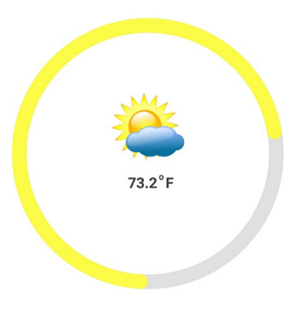
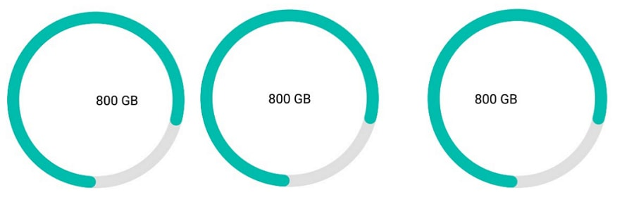

---

layout: post
title: Annotations in Syncfusion SfCircularGauge for Xamarin.Forms
description: This section explains the steps required to set annotations in Syncfusion Circular Gauge control for Xamarin.Forms
platform: xamarin
control: SfCircularGauge
documentation: ug

---

# Annotations in SfCircularGauge

[`SfCircularGauge`](https://help.syncfusion.com/cr/xamarin/Syncfusion.SfGauge.XForms.SfCircularGauge.html) supports [`Annotations`](https://help.syncfusion.com/cr/xamarin/Syncfusion.SfGauge.XForms.SfCircularGauge.html#Syncfusion_SfGauge_XForms_SfCircularGauge_Annotations), which allows you to mark the specific area of interest in circular gauge. You can place custom views as annotations. The text and images also can be added by using [`Annotations`](https://help.syncfusion.com/cr/xamarin/Syncfusion.SfGauge.XForms.SfCircularGauge.html#Syncfusion_SfGauge_XForms_SfCircularGauge_Annotations) property.

##  Setting view annotation

When the annotation allows you to place custom elements, a gauge can be initialized to the element, and this can be used to place the annotation in another gauge. The Following properties are used to customize the `Annotations`:

* [`Angle`](https://help.syncfusion.com/cr/xamarin/Syncfusion.SfGauge.XForms.GaugeAnnotation.html#Syncfusion_SfGauge_XForms_GaugeAnnotation_Angle): Used to place the `View` at the given `Angle`. 
* [`Offset`](https://help.syncfusion.com/cr/xamarin/Syncfusion.SfGauge.XForms.GaugeAnnotation.html#Syncfusion_SfGauge_XForms_GaugeAnnotation_Offset): Used to move the `View` from the center to edge of the circular gauge. The value should be range from 0 to 1.

The following code is used to create the `Annotations`.




  
    
    <gauge:SfCircularGauge HeightRequest="80" WidthRequest="80">
	  
            <gauge:SfCircularGauge.Annotations>		
                <gauge:GaugeAnnotation Angle="90" Offset="0.5">
                    <gauge:GaugeAnnotation.View>
                        <gauge:SfCircularGauge HeightRequest="80" WidthRequest="80">
                            <gauge:SfCircularGauge.Annotations>
                                <gauge:GaugeAnnotation Angle="270" Offset="0.5">
                                    <gauge:GaugeAnnotation.View>
                                        <Label Text="10s" FontSize="12" HeightRequest="20" WidthRequest="35" TextColor="Black"
                                                          HorizontalTextAlignment="Center" VerticalTextAlignment="Center"/>
                                    </gauge:GaugeAnnotation.View>
                                </gauge:GaugeAnnotation>
                            </gauge:SfCircularGauge.Annotations>
							
                            <gauge:SfCircularGauge.Scales>
                                <gauge:Scale StartAngle="270" SweepAngle="360" ShowLabels="False" StartValue="0" EndValue="60" Interval="5"
                                             RimColor="#EDEEEF">
											 
                                    <gauge:Scale.MajorTickSettings>
                                        <gauge:TickSettings Color="Black" StartOffset="1" EndOffset="0.85" Thickness="2"/>
                                    </gauge:Scale.MajorTickSettings>
									
                                    <gauge:Scale.MinorTickSettings>
                                        <gauge:TickSettings Color="Black" StartOffset="1" EndOffset="0.90" Thickness="0.5"/>
                                    </gauge:Scale.MinorTickSettings>
									
                                    <gauge:Scale.Ranges>
                                        <gauge:Range StartValue="0" EndValue="30" Color="Gray" InnerStartOffset="0.925"
                                                     OuterStartOffset="1" InnerEndOffset="0.925" OuterEndOffset="1"/>
                                    </gauge:Scale.Ranges>
									
                                    <gauge:Scale.Pointers>
                                        <gauge:NeedlePointer Type="Triangle" KnobRadius="4" Thickness="3" EnableAnimation="False"
                                                             Color="Black" KnobColor="Black"/>
                                    </gauge:Scale.Pointers>
									
                                </gauge:Scale>
                            </gauge:SfCircularGauge.Scales>
							
                        </gauge:SfCircularGauge>
						
                    </gauge:GaugeAnnotation.View>
                </gauge:GaugeAnnotation>

               
                    <gauge:GaugeAnnotation Angle="0" Offset="0.5">
                        <gauge:GaugeAnnotation.View>
                            <Label x:Name="LabelAnnotation1" Text="4:55PM" FontSize="14" HeightRequest="25" WidthRequest="75" TextColor="Black"
                                            HorizontalTextAlignment="Center" VerticalTextAlignment="Center"/>
                        </gauge:GaugeAnnotation.View>
                    </gauge:GaugeAnnotation>
               
                    <gauge:GaugeAnnotation Angle="180" Offset="0.5">
                        <gauge:GaugeAnnotation.View>
                            <gauge:SfCircularGauge HeightRequest="80" WidthRequest="80">
                            <gauge:SfCircularGauge.Annotations>
                                <gauge:GaugeAnnotation Angle="270" Offset="0.5">
                                    <gauge:GaugeAnnotation.View>
                                        <Label x:Name="LabelAnnotation3" Text="55M" FontSize="12" HeightRequest="20" WidthRequest="35" TextColor="Black"
                                               HorizontalTextAlignment="Center" VerticalTextAlignment="Center"/>
                                    </gauge:GaugeAnnotation.View>
                                </gauge:GaugeAnnotation>

                            </gauge:SfCircularGauge.Annotations>
                            <gauge:SfCircularGauge.Scales>
                                    <gauge:Scale StartAngle="270" SweepAngle="360" ShowLabels="False" StartValue="0" EndValue="60" Interval="5"
                                             RimColor="#EDEEEF">
											 
                                        <gauge:Scale.MajorTickSettings>
                                            <gauge:TickSettings Color="Black" StartOffset="1" EndOffset="0.85" Thickness="2"/>
                                        </gauge:Scale.MajorTickSettings>
										
                                        <gauge:Scale.MinorTickSettings>
                                            <gauge:TickSettings Color="Black" StartOffset="1" EndOffset="0.90" Thickness="0.5"/>
                                        </gauge:Scale.MinorTickSettings>
										
                                        <gauge:Scale.Ranges>
                                            <gauge:Range StartValue="0" EndValue="30" Color="Gray" InnerStartOffset="0.925"
                                                     OuterStartOffset="1" InnerEndOffset="0.925" OuterEndOffset="1"/>
                                        </gauge:Scale.Ranges>
										
                                        <gauge:Scale.Pointers>
                                            <gauge:NeedlePointer Type="Triangle" KnobRadius="4" Thickness="3" EnableAnimation="False"
                                                             Color="Black" KnobColor="Black"/>
                                        </gauge:Scale.Pointers>
										
                                    </gauge:Scale>
                                </gauge:SfCircularGauge.Scales>
								
                            </gauge:SfCircularGauge>
							
                        </gauge:GaugeAnnotation.View>
                    </gauge:GaugeAnnotation>
             
            </gauge:SfCircularGauge.Annotations>

            <gauge:SfCircularGauge.Scales>
                <gauge:Scale StartAngle="270" SweepAngle="360" ShowLabels="False" StartValue="0" EndValue="12" Interval="1"
                             RimColor="#EDEEEF" MinorTicksPerInterval="4" LabelColor="Gray" LabelOffset="0.8"
                             ScaleEndOffset="0.925" LabelFontSize="14" ShowFirstLabel="False">
							 
                    <gauge:Scale.MajorTickSettings>
                        <gauge:TickSettings Color="Black" StartOffset="1" EndOffset="0.9" Thickness="3"/>
                    </gauge:Scale.MajorTickSettings>
					
                    <gauge:Scale.MinorTickSettings>
                        <gauge:TickSettings Color="Black" StartOffset="1" EndOffset="0.95" Thickness="1"/>
                    </gauge:Scale.MinorTickSettings>
					
                    <gauge:Scale.Ranges>
                        <gauge:Range StartValue="0" EndValue="3" Color="Gray" InnerStartOffset="0.925"
                                                     OuterStartOffset="1" InnerEndOffset="0.925" OuterEndOffset="1"/>
                    </gauge:Scale.Ranges>
					
                    <gauge:Scale.Pointers>
                        <gauge:NeedlePointer KnobRadius="6" Thickness="3.5" EnableAnimation="False"
                                                       KnobStrokeWidth="5" TailLengthFactor="0.20" TailColor="Black" KnobStrokeColor="Black"  Color="Black" KnobColor="White" LengthFactor="0.75"/>
                        <gauge:NeedlePointer KnobRadius="6" Type="Triangle" Thickness="5" EnableAnimation="False"
                                                          Color="Black" KnobColor="White" LengthFactor="0.4"/>
                        <gauge:NeedlePointer KnobRadius="6" Type="Triangle" Thickness="5" EnableAnimation="False"
                                                          Color="Black" KnobColor="White" LengthFactor="0.65"/>

                    </gauge:Scale.Pointers>
					
                </gauge:Scale>
            </gauge:SfCircularGauge.Scales>

    </gauge:SfCircularGauge>
	




    Label LabelAnnotation1 = new Label();
    LabelAnnotation1.Text = "4:55PM";
    LabelAnnotation1.FontSize = 14;
    LabelAnnotation1.HeightRequest = 25;
    LabelAnnotation1.WidthRequest = 75;
    LabelAnnotation1.TextColor = Color.Black;
    LabelAnnotation1.HorizontalTextAlignment = TextAlignment.Center;
    LabelAnnotation1.VerticalTextAlignment = TextAlignment.Center;
	
	Label LabelAnnotation2 = new Label();
    LabelAnnotation2.Text = "10s";
    LabelAnnotation2.FontSize = 12;
    LabelAnnotation2.HeightRequest = 20;
    LabelAnnotation2.WidthRequest = 35;
    LabelAnnotation2.TextColor = Color.Black;
    LabelAnnotation2.HorizontalTextAlignment = TextAlignment.Center;
    LabelAnnotation2.VerticalTextAlignment = TextAlignment.Center;
	
	Label LabelAnnotation3 = new Label();
    LabelAnnotation3.Text = "55M";
    LabelAnnotation3.FontSize = 12;
    LabelAnnotation3.HeightRequest = 20;
    LabelAnnotation3.WidthRequest = 35;
    LabelAnnotation3.TextColor = Color.Black;
    LabelAnnotation3.HorizontalTextAlignment = TextAlignment.Center;
    LabelAnnotation3.VerticalTextAlignment = TextAlignment.Center;
	
	SfCircularGauge Annotation1 = new SfCircularGauge();
	
	Annotation1.HeightRequest = Device.OnPlatform(70, 80, 100);
    Annotation1.WidthRequest = Device.OnPlatform(70, 80, 100);

    CircularGaugeAnnotationCollection annotations = new CircularGaugeAnnotationCollection();
			
	GaugeAnnotation gaugeAnnotation = new GaugeAnnotation();
    gaugeAnnotation.View = LabelAnnotation2;
    gaugeAnnotation.Angle = 270;
    gaugeAnnotation.Offset = .5;
    annotations.Add(gaugeAnnotation);
    Annotation1.Annotations = annotations;
			
	ObservableCollection<Scale> scales = new ObservableCollection<Scale>();
    Scale scale = new Scale();
    scale.StartAngle = 270;
    scale.SweepAngle = 360;
    scale.ShowLabels = false;
    scale.StartValue = 0;
    scale.EndValue = 60;
    scale.Interval = 5;
    scale.RimColor = Color.FromRgb(237, 238, 239);
    scale.MajorTickSettings.Color = Color.Black;
    scale.MajorTickSettings.StartOffset = 1;
    scale.MajorTickSettings.EndOffset = .85;
    scale.MajorTickSettings.Thickness = 2;
    scale.MinorTickSettings.Color = Color.Black;
    scale.MinorTickSettings.StartOffset = 1;
    scale.MinorTickSettings.EndOffset = .90;
    scale.MinorTickSettings.Thickness = 0.5;

    ObservableCollection<Range> ranges = new ObservableCollection<Range>();
    Range range = new Range();
    range.StartValue = 0;
    range.EndValue = 30;
    range.Color = Color.Gray;
    range.InnerStartOffset = 0.925;
    range.OuterStartOffset = 1;
    range.InnerEndOffset = 0.925;
    range.OuterEndOffset = 1;
    ranges.Add(range);
    scale.Ranges = ranges;

    ObservableCollection<Pointer> pointers = new ObservableCollection<Pointer>();
    NeedlePointer needlePointer = new NeedlePointer();
    needlePointer.Type = PointerType.Triangle;
    needlePointer.KnobRadius = 4;
    needlePointer.Thickness = 3;
    needlePointer.EnableAnimation = false;
    needlePointer.KnobColor = Color.Black;
    needlePointer.Color = Color.Black;
    pointers.Add(needlePointer);
    scale.Pointers = pointers;

    scales.Add(scale);
    Annotation1.Scales = scales;
			
	Annotation1.Parent = this;
			 
	SfCircularGauge Annotation2 = new SfCircularGauge();

    Annotation2.HeightRequest = Device.OnPlatform(70, 80, 100);
    Annotation2.WidthRequest = Device.OnPlatform(70, 80, 100);

    CircularGaugeAnnotationCollection annotations1 = new CircularGaugeAnnotationCollection();
    GaugeAnnotation gaugeAnnotation1 = new GaugeAnnotation();
    gaugeAnnotation1.View = LabelAnnotation3;
    gaugeAnnotation1.Angle = 270;
    gaugeAnnotation1.Offset = .5;
    annotations1.Add(gaugeAnnotation1);
    Annotation2.Annotations = annotations1;

    ObservableCollection<Scale> scales1 = new ObservableCollection<Scale>();
    Scale scale1 = new Scale();
    scale1.StartAngle = 270;
    scale1.SweepAngle = 360;
    scale1.StartValue = 0;
    scale1.EndValue = 60;
    scale1.Interval = 5;
    scale1.ShowLabels = false;
    scale1.RimColor = Color.FromRgb(237, 238, 239);
    scale1.MajorTickSettings.Color = Color.Black;
    scale1.MajorTickSettings.StartOffset = 1;
    scale1.MajorTickSettings.EndOffset = 0.85;
    scale1.MajorTickSettings.Thickness = 2;
    scale1.MinorTickSettings.Color = Color.Black;
    scale1.MinorTickSettings.StartOffset = 1;
    scale1.MinorTickSettings.EndOffset = 0.90;
    scale1.MinorTickSettings.Thickness = 0.5;

    ObservableCollection<Range> ranges1 = new ObservableCollection<Range>();
    Range range1 = new Range();
    range1.StartValue = 0;
    range1.EndValue = 30;
    range1.Color = Color.Gray;
    range1.InnerStartOffset = 0.925;
    range1.OuterStartOffset = 1;
    range1.InnerEndOffset = 0.925;
    range1.OuterEndOffset = 1;
    ranges1.Add(range1);
    scale1.Ranges = ranges1;

    ObservableCollection<Pointer> pointers1 = new ObservableCollection<Pointer>();
    NeedlePointer needlePointer1 = new NeedlePointer();
    needlePointer1.Type = PointerType.Triangle;
    needlePointer1.KnobRadius = 4;
    needlePointer1.Thickness = 3;
    needlePointer1.EnableAnimation = false;
    needlePointer1.KnobColor = Color.Black;
    needlePointer1.Color = Color.Black;
    pointers1.Add(needlePointer1);
    scale1.Pointers = pointers1;

    scales1.Add(scale1);
    Annotation2.Scales = scales1;

    Annotation2.Parent = this;

    SfCircularGauge gauge = new SfCircularGauge();          
    CircularGaugeAnnotationCollection annotations3 = new CircularGaugeAnnotationCollection();

    GaugeAnnotation gaugeAnnotation2 = new GaugeAnnotation();
    gaugeAnnotation2.View = Annotation1;
    gaugeAnnotation2.Angle = 90;
    gaugeAnnotation2.Offset = Device.OnPlatform(.5, .5, .6);
    annotations3.Add(gaugeAnnotation2);

    GaugeAnnotation gaugeAnnotation3 = new GaugeAnnotation();
    gaugeAnnotation3.View = LabelAnnotation1;
    gaugeAnnotation3.Angle = 00;
    gaugeAnnotation3.Offset = .5;
    annotations3.Add(gaugeAnnotation3);

    GaugeAnnotation gaugeAnnotation4 = new GaugeAnnotation();
    gaugeAnnotation4.View = Annotation2;
    gaugeAnnotation4.Angle = 180;
    gaugeAnnotation4.Offset = Device.OnPlatform(.5, .5, .6);
    annotations3.Add(gaugeAnnotation4);
    gauge.Annotations = annotations3;

    ObservableCollection<Scale> scales2 = new ObservableCollection<Scale>();
    Scale scale2 = new Scale();
    scale2.StartValue = 0;
    scale2.EndValue = 12;
    scale2.Interval = 1;
    scale2.MinorTicksPerInterval = 4;
    scale2.RimColor = Color.FromRgb(237, 238, 239);
    scale2.LabelColor = Color.Gray;
    scale2.LabelOffset = Device.OnPlatform(.8, .8, .875);
    scale2.ScaleEndOffset = .925;
    scale2.StartAngle = 270;
    scale2.SweepAngle = 360;
    scale2.LabelFontSize = 14;
    scale2.ShowFirstLabel = false;
    scale2.MinorTickSettings.Color = Color.Black;
    scale2.MinorTickSettings.StartOffset = 1;
    scale2.MinorTickSettings.EndOffset = 0.95;
    scale2.MinorTickSettings.Thickness = 1;
    scale2.MajorTickSettings.Color = Color.Black;
    scale2.MajorTickSettings.StartOffset = 1;
    scale2.MajorTickSettings.EndOffset = 0.9;
    scale2.MajorTickSettings.Thickness = 3;

    ObservableCollection<Range> ranges2 = new ObservableCollection<Range>();
    Range range2 = new Range();
    range2.StartValue = 0;
    range2.EndValue = 3;
    range2.Color = Color.Gray;
    range2.InnerStartOffset = 0.925;
    range2.OuterStartOffset = 1;
    range2.InnerEndOffset = 0.925;
    range2.OuterEndOffset = 1;
    ranges2.Add(range2);
    scale2.Ranges = ranges2;

    ObservableCollection<Pointer> pointers2 = new ObservableCollection<Pointer>();
    NeedlePointer needlePointer2 = new NeedlePointer();
    needlePointer2.EnableAnimation = false;
    needlePointer2.KnobRadius = 6;
    needlePointer2.LengthFactor = .75;
    needlePointer2.KnobColor = Color.White;
    needlePointer2.Color = Color.Black;
    needlePointer2.Thickness = 3.5;
    needlePointer2.KnobStrokeColor = Color.Black;
    needlePointer2.KnobStrokeWidth = 5;
    needlePointer2.TailLengthFactor = 0.20;
    needlePointer2.TailColor = Color.Black;
    pointers2.Add(needlePointer2);

    NeedlePointer needlePointer3 = new NeedlePointer();
    needlePointer3.EnableAnimation = false;
    needlePointer3.KnobRadius = 6;
    needlePointer3.LengthFactor = .4;
    needlePointer3.KnobColor = Color.White;
    needlePointer3.Color = Color.Black;
    needlePointer3.Thickness = 5;
    needlePointer3.Type = PointerType.Triangle;
    pointers2.Add(needlePointer3);

    NeedlePointer needlePointer4 = new NeedlePointer();
    needlePointer4.EnableAnimation = false;
    needlePointer4.KnobRadius = 6;
    needlePointer4.LengthFactor = .65;
    needlePointer4.KnobColor = Color.White;
    needlePointer4.Color = Color.Black;
    needlePointer4.Thickness = 5;
    needlePointer4.Type = PointerType.Triangle;
    pointers2.Add(needlePointer4);

    scale2.Pointers = pointers2;

    scales2.Add(scale2);
    gauge.Scales = scales2;
    
    




##  Setting image annotation

Annotations provide options to add any image over the gauge control with respect to its offset position. You can add multiple images in single control.





    <gauge:SfCircularGauge HeightRequest="500" WidthRequest="500" BackgroundColor="White" Margin="20">
        
        <gauge:SfCircularGauge.Annotations>
            <gauge:GaugeAnnotation Angle="270" Offset="0.2">
                <gauge:GaugeAnnotation.View>
                    <Image Source="weather.jpg" HeightRequest="100" WidthRequest="100"/>
                </gauge:GaugeAnnotation.View>
            </gauge:GaugeAnnotation>
        </gauge:SfCircularGauge.Annotations>

        <gauge:SfCircularGauge.Headers>
            <gauge:Header Text="73.2" Position="0.48, 0.6" ForegroundColor="#424242" FontAttributes="Bold" TextSize="20"/>
            <gauge:Header Text="o" Position="0.55,0.58" ForegroundColor="#424242" FontAttributes="Bold" TextSize="12"/>
            <gauge:Header Text="F" Position="0.58,0.6" ForegroundColor="#424242" FontAttributes="Bold" TextSize="20"/>
        </gauge:SfCircularGauge.Headers>

        <gauge:SfCircularGauge.Scales>
            <gauge:Scale  ShowLabels="False" ShowTicks="False" RimThickness="20" RadiusFactor="1" RimColor="#e0e0e0"
                          StartAngle="90" SweepAngle="360" StartValue="0" EndValue="100" Interval="10">

                <gauge:Scale.Pointers>
                    <gauge:RangePointer Value="73.2" Offset="1" Thickness="20" RangeCap="Both" Color="#FCFB48"/>
                </gauge:Scale.Pointers>

            </gauge:Scale>
        </gauge:SfCircularGauge.Scales>

    </gauge:SfCircularGauge>





            SfCircularGauge gauge = new SfCircularGauge();
            gauge.HeightRequest = 500;
            gauge.WidthRequest = 500;
            gauge.Margin = new Thickness(20);
            gauge.BackgroundColor = Color.White;

            ObservableCollection<Scale> scales = new ObservableCollection<Syncfusion.SfGauge.XForms.Scale>();
            Scale scale = new Syncfusion.SfGauge.XForms.Scale();
            scale.ShowLabels = false;
            scale.ShowTicks = false;
            scale.RimThickness = 20;
            scale.RadiusFactor = 1;
            scale.RimColor = Color.FromHex("#e0e0e0");
            scale.StartAngle = 90;
            scale.SweepAngle = 360;
            scale.StartValue = 0;
            scale.EndValue = 100;
            scale.Interval = 10;

            RangePointer pointer = new RangePointer();
            pointer.Value = 73.2;
            pointer.Offset = 1;
            pointer.Thickness = 20;
            pointer.RangeCap = RangeCap.Both;
            pointer.Color = Color.FromRgb(252, 251, 72);
            scale.Pointers.Add(pointer);
            scales.Add(scale);

            Header header = new Header();
            header.Text = "73.2";
            header.Position = new Point(0.48, 0.6);
            header.ForegroundColor = Color.FromHex("#424242");
            header.FontAttributes = FontAttributes.Bold;
            header.TextSize = 20;
            gauge.Headers.Add(header);

            Header header1 = new Header();
            header1.Text = "o";
            header1.Position = new Point(0.55, 0.58);
            header1.ForegroundColor = Color.FromHex("#424242");
            header1.FontAttributes = FontAttributes.Bold;
            header1.TextSize = 12;
            gauge.Headers.Add(header1);

            Header header2 = new Header();
            header2.Text = "F";
            header2.Position = new Point(0.58, 0.6);
            header2.ForegroundColor = Color.FromHex("#424242");
            header2.FontAttributes = FontAttributes.Bold;
            header2.TextSize = 20;
            gauge.Headers.Add(header2);

            GaugeAnnotation annotation = new GaugeAnnotation();
            Image image = new Image();
            image.Source = "weather.jpg";
            image.HeightRequest = 100;
            image.WidthRequest = 100;
            annotation.View = image;
            annotation.Angle = 270;
            annotation.Offset = 0.2;
            gauge.Annotations.Add(annotation);
            gauge.Scales = scales;





##  Setting text annotation

You can add any text over the gauge control to enhance the readability. You can add multiple text instances in single control.  





    <gauge:SfCircularGauge HeightRequest="500" WidthRequest="500">
      
        <gauge:SfCircularGauge.Headers>
            <gauge:Header Text="13M" Position="0.5, 0.5" ForegroundColor="#0682F6" FontAttributes="Bold" TextSize="20"/>
        </gauge:SfCircularGauge.Headers>

        <gauge:SfCircularGauge.Scales>
            <gauge:Scale  ShowLabels="False" ShowTicks="False" ShowRim="False"
                          StartAngle="160" SweepAngle="270" StartValue="0" EndValue="15" >

                <gauge:Scale.Pointers>
                    <gauge:RangePointer Value="13" Offset="0.8" Thickness="30" RangeCap="Start" Color="#0682F6"/>
                    <gauge:MarkerPointer MarkerShape="Image" ImageSource="shot.jpg" MarkerWidth="60" MarkerHeight="60"
                                          Value="0" Offset="0.8"/>
                    <gauge:MarkerPointer MarkerShape="Circle" MarkerWidth="40" MarkerHeight="40" Color="#9e9e9e"
                                         Value="13" Offset="0.8"/>
                </gauge:Scale.Pointers>

            </gauge:Scale>

            <gauge:Scale  ShowLabels="False" ShowTicks="False" ShowRim="False"
                          StartAngle="0" SweepAngle="360"  >
            </gauge:Scale>

        </gauge:SfCircularGauge.Scales>
        

    </gauge:SfCircularGauge>





            SfCircularGauge gauge = new SfCircularGauge();
            gauge.HeightRequest = 500;
            gauge.WidthRequest = 500;

            ObservableCollection<Scale> scales = new ObservableCollection<Syncfusion.SfGauge.XForms.Scale>();

            Scale scale = new Syncfusion.SfGauge.XForms.Scale();
            scale.StartAngle = 160;
            scale.SweepAngle = 270;
            scale.StartValue = 0;
            scale.EndValue = 15;
            scale.ShowLabels = false;
            scale.ShowRim = false;
            scale.ShowTicks = false;
            RangePointer range = new RangePointer();
            range.Color = Color.FromHex("#0682F6");
            range.Offset = 0.8;
            range.Value = 13;
            range.RangeCap = RangeCap.Start;
            range.Thickness = 30;
            scale.Pointers.Add(range);

            Scale scale1 = new Syncfusion.SfGauge.XForms.Scale();
            scale1.StartAngle = 0;
            scale1.SweepAngle = 360;
            scale1.RimColor = Color.FromHex("#e0e0e0");
            scale1.RadiusFactor = 0.8;
            scale1.RimThickness = 30;
            scale1.ShowTicks = false;
            scale1.ShowRim = false;
            scale1.ShowLabels = false;
            scales.Add(scale1);

            Header header = new Header();
            header.FontAttributes = FontAttributes.Bold;
            header.TextSize = 20;
            header.Text = "13M";
            header.Position = new Point(0.5, 0.5);
            header.ForegroundColor = Color.FromHex("#0682F6");
            gauge.Headers.Add(header);

            MarkerPointer pointer1 = new MarkerPointer();
            pointer1.MarkerShape = MarkerShape.Image;
            pointer1.ImageSource = "shot.jpg";
            pointer1.MarkerWidth = 60;
            pointer1.MarkerHeight = 60;
            pointer1.Value = 0;
            pointer1.Offset = 0.8;
            scale.Pointers.Add(pointer1);

            MarkerPointer pointer2 = new MarkerPointer();
            pointer2.MarkerShape = MarkerShape.Circle;
            pointer2.MarkerWidth = 40;
            pointer2.MarkerHeight = 40;
            pointer2.Color = Color.FromHex("#9e9e9e");
            pointer2.Value = 13;
            pointer2.Offset = 0.8;
            scale.Pointers.Add(pointer2);
            scales.Add(scale);
            gauge.Scales = scales;





## Set margin to annotation

You can adjust annotation by specifying the [`ViewMargin`](https://help.syncfusion.com/cr/xamarin/Syncfusion.SfGauge.XForms.GaugeAnnotation.html#Syncfusion_SfGauge_XForms_GaugeAnnotation_ViewMargin) property in pixel, which adjusts annotation elements from their current position.





<gauge:SfCircularGauge>
        <gauge:SfCircularGauge.Annotations>
            <gauge:GaugeAnnotation  ViewMargin="10,50">
                <gauge:GaugeAnnotation.View>
                    <Label Text="800 GB" TextColor="Black" FontSize="25"/>
                </gauge:GaugeAnnotation.View>
            </gauge:GaugeAnnotation>
        </gauge:SfCircularGauge.Annotations>
        <gauge:SfCircularGauge.Scales>
            <gauge:Scale  ShowLabels="False" ShowTicks="False" RimThickness="25" RadiusFactor="1" RimColor="#e0e0e0"
                          StartAngle="90" SweepAngle="360" StartValue="0" EndValue="100" Interval="10">
                <gauge:Scale.Pointers>
                    <gauge:RangePointer Value="80" Offset="1" Thickness="25" RangeCap="Both" Color="#01bdae"/>
                </gauge:Scale.Pointers>
            </gauge:Scale>
        </gauge:SfCircularGauge.Scales>
</gauge:SfCircularGauge>





SfCircularGauge gauge = new SfCircularGauge();
ObservableCollection<Scale> scales = new ObservableCollection<Scale>();
Scale scale = new Scale();
scale.ShowLabels = false;
scale.ShowTicks = false;
scale.RimThickness = 25;
scale.RadiusFactor = 1;
scale.RimColor = Color.FromHex("#e0e0e0");
scale.StartAngle = 90;
scale.SweepAngle = 360;
scale.StartValue = 0;
scale.EndValue = 100;
scale.Interval = 10;

RangePointer pointer = new RangePointer();
pointer.Value = 80;
pointer.Offset = 1;
pointer.Thickness = 25;
pointer.RangeCap = RangeCap.Both;
pointer.Color = Color.FromHex("#01bdae");
scale.Pointers.Add(pointer);
scales.Add(scale);

GaugeAnnotation annotation = new GaugeAnnotation();
annotation.ViewMargin = new Point(10, 50);
Label label = new Label();
label.Text = "800 GB";
label.FontSize = 25;
label.TextColor = Color.Black;
annotation.View = label;
gauge.Annotations.Add(annotation);
gauge.Scales = scales;
Content = gauge;





## Alignment of annotation

You can align annotations to the `Start`, `Center` and `End` using the [`HorizontalAlignment`](https://help.syncfusion.com/cr/xamarin/Syncfusion.SfGauge.XForms.GaugeAnnotation.html#Syncfusion_SfGauge_XForms_GaugeAnnotation_HorizontalAlignment) and [`VerticalAlignment`](https://help.syncfusion.com/cr/xamarin/Syncfusion.SfGauge.XForms.GaugeAnnotation.html#Syncfusion_SfGauge_XForms_GaugeAnnotation_VerticalAlignment) properties.

### Setting horizontal alignment





<gauge:SfCircularGauge>
        <gauge:SfCircularGauge.Annotations>
            <gauge:GaugeAnnotation  HorizontalAlignment="Start">
                <gauge:GaugeAnnotation.View>
                    <Label Text="800 GB" TextColor="Black" FontSize="25"/>
                </gauge:GaugeAnnotation.View>
            </gauge:GaugeAnnotation>
        </gauge:SfCircularGauge.Annotations>
        <gauge:SfCircularGauge.Scales>
            <gauge:Scale  ShowLabels="False" ShowTicks="False" RimThickness="25" RadiusFactor="1"                       RimColor="#e0e0e0"StartAngle="90" SweepAngle="360" StartValue="0"                             EndValue="100" Interval="10">
                <gauge:Scale.Pointers>
                    <gauge:RangePointer Value="80" Offset="1" Thickness="25" RangeCap="Both" Color="#01bdae"/>
                </gauge:Scale.Pointers>
            </gauge:Scale>
        </gauge:SfCircularGauge.Scales>
</gauge:SfCircularGauge>





SfCircularGauge gauge = new SfCircularGauge();
ObservableCollection<Scale> scales = new ObservableCollection<Scale>();
Scale scale = new Scale();
scale.ShowLabels = false;
scale.ShowTicks = false;
scale.RimThickness = 25;
scale.RadiusFactor = 1;
scale.RimColor = Color.FromHex("#e0e0e0");
scale.StartAngle = 90;
scale.SweepAngle = 360;
scale.StartValue = 0;
scale.EndValue = 100;
scale.Interval = 10;

RangePointer pointer = new RangePointer();
pointer.Value = 80;
pointer.Offset = 1;
pointer.Thickness = 25;
pointer.RangeCap = RangeCap.Both;
pointer.Color = Color.FromHex("#01bdae");
scale.Pointers.Add(pointer);
scales.Add(scale);

GaugeAnnotation annotation = new GaugeAnnotation();
annotation.HorizontalAlignment = ViewAlignment.Start;
Label label = new Label();
label.Text = "800 GB";
label.FontSize = 25;
label.TextColor = Color.Black;
annotation.View = label;
gauge.Annotations.Add(annotation);
gauge.Scales = scales;
Content = gauge;





### Setting vertical alignment





<gauge:SfCircularGauge  BackgroundColor="White" Margin="20">
        <gauge:SfCircularGauge.Annotations>
            <gauge:GaugeAnnotation  VerticalAlignment="Start">
                <gauge:GaugeAnnotation.View>
                    <Label Text="800 GB" TextColor="Black" FontSize="25"/>
                </gauge:GaugeAnnotation.View>
            </gauge:GaugeAnnotation>
        </gauge:SfCircularGauge.Annotations>
        <gauge:SfCircularGauge.Scales>
            <gauge:Scale  ShowLabels="False" ShowTicks="False" RimThickness="25" RadiusFactor="1" RimColor="#e0e0e0"
                          StartAngle="90" SweepAngle="360" StartValue="0" EndValue="100" Interval="10">
                <gauge:Scale.Pointers>
                    <gauge:RangePointer Value="80" Offset="1" Thickness="25" RangeCap="Both" Color="#01bdae"/>
                </gauge:Scale.Pointers>
            </gauge:Scale>
        </gauge:SfCircularGauge.Scales>
</gauge:SfCircularGauge>





SfCircularGauge gauge = new SfCircularGauge();
ObservableCollection<Scale> scales = new ObservableCollection<Scale>();
Scale scale = new Scale();
scale.ShowLabels = false;
scale.ShowTicks = false;
scale.RimThickness = 25;
scale.RadiusFactor = 1;
scale.RimColor = Color.FromHex("#e0e0e0");
scale.StartAngle = 90;
scale.SweepAngle = 360;
scale.StartValue = 0;
scale.EndValue = 100;
scale.Interval = 10;

RangePointer pointer = new RangePointer();
pointer.Value = 80;
pointer.Offset = 1;
pointer.Thickness = 25;
pointer.RangeCap = RangeCap.Both;
pointer.Color = Color.FromHex("#01bdae");
scale.Pointers.Add(pointer);
scales.Add(scale);

GaugeAnnotation annotation = new GaugeAnnotation();
annotation.VerticalAlignment = ViewAlignment.Start;
Label label = new Label();
label.Text = "800 GB";
label.FontSize = 25;
label.TextColor = Color.Black;
annotation.View = label;
gauge.Annotations.Add(annotation);
gauge.Scales = scales;
Content = gauge;





