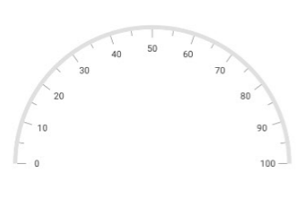

---

layout: post
title: Customizations in Syncfusion SfCircularGauge control for Xamarin.Forms
description: This section explains the steps required to customize the Syncfusion Circular Gauge control for Xamarin.Forms
platform: xamarin
control: SfCircularGauge
documentation: ug

---

# How to change the gauge size and alignment

## Changing the gauge size

The [`CircularCoefficient`](https://help.syncfusion.com/cr/xamarin/Syncfusion.SfGauge.XForms.SfCircularGauge.html#Syncfusion_SfGauge_XForms_SfCircularGauge_CircularCoefficient) property is used to change the diameter of the gauge.
It ranges from 0 to 1, and the default value is 1.





<gauge:SfCircularGauge CircularCoefficient="0.7">
    <gauge:SfCircularGauge.Headers>
            <gauge:Header Text="Speedometer" ForegroundColor="Black" />
    </gauge:SfCircularGauge.Headers>
    <gauge:SfCircularGauge.Scales>
        <gauge:Scale>
            <gauge:Scale.Ranges>
                <gauge:Range StartValue="0" EndValue="50" />
            </gauge:Scale.Ranges>
            <gauge:Scale.Pointers>
                <gauge:NeedlePointer  Value="70" />
                <gauge:RangePointer RangeStart="15" Value="85" />
                <gauge:MarkerPointer Value="70" MarkerShape = "Triangle"/>
            </gauge:Scale.Pointers>
        </gauge:Scale>
    </gauge:SfCircularGauge.Scales>
</gauge:SfCircularGauge>





SfCircularGauge sfCircularGauge = new SfCircularGauge();
sfCircularGauge.CircularCoefficient = 0.7f;
Header header = new Header();
header.Text = "Speedometer";
header.ForegroundColor = Color.Black;
sfCircularGauge.Headers.Add(header);
ObservableCollection<Scale> scales = new ObservableCollection<Scale>();
Scale scale = new Scale();
NeedlePointer needlePointer = new NeedlePointer();
needlePointer.Value = 70;
scale.Pointers.Add(needlePointer);
scales.Add(scale);
RangePointer rangePointer = new RangePointer();
rangePointer.RangeStart = 15;
rangePointer.Value = 85;
scale.Pointers.Add(rangePointer);
MarkerPointer markerPointer = new MarkerPointer();
markerPointer.Value = 70;
markerPointer.MarkerShape = MarkerShape.Triangle;
scale.Pointers.Add(markerPointer);
Range range = new Range();
range.StartValue = 0;
range.EndValue = 50;
scale.Ranges.Add(range);
sfCircularGauge.Scales = scales;
Content = sfCircularGauge;





## Gauge alignment

The [`IsCenterAligned`](https://help.syncfusion.com/cr/xamarin/Syncfusion.SfGauge.XForms.SfCircularGauge.html#Syncfusion_SfGauge_XForms_SfCircularGauge_IsCenterAligned) property is used to align the gauge to the center. In semi-circular gauge, bottom space will be removed using the [`IsCenterAligned`](https://help.syncfusion.com/cr/xamarin/Syncfusion.SfGauge.XForms.SfCircularGauge.html#Syncfusion_SfGauge_XForms_SfCircularGauge_IsCenterAligned) property.





<gauge:SfCircularGauge IsCenterAligned="True">
    <gauge:SfCircularGauge.Scales>
         <gauge:Scale StartAngle="180" SweepAngle="180"/>
    </gauge:SfCircularGauge.Scales>
</gauge:SfCircularGauge>





SfCircularGauge sfCircularGauge = new SfCircularGauge();
sfCircularGauge.IsCenterAligned = true;
ObservableCollection<Scale> scales = new ObservableCollection<Scale>();
Scale scale = new Scale();
scale.StartAngle = 180;
scale.SweepAngle = 180;
scales.Add(scale);
sfCircularGauge.Scales = scales;
Content = sfCircularGauge;





