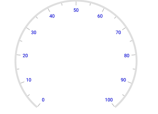
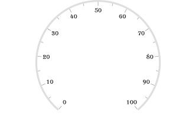
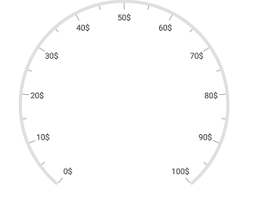
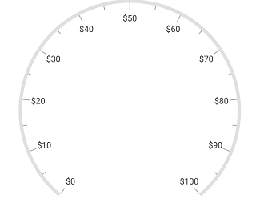
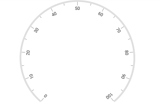

---

layout: post
title: Labels in Syncfusion SfCircularGauge control for Xamarin.Forms
description:  Learn how to set labels and customize the labels in Syncfusion CircularGauge control for Xamarin.Forms
platform: xamarin
control: SfCircularGauge
documentation: ug

---

# Labels in SfCircularGauge

The [`Scale`](https://help.syncfusion.com/cr/xamarin/Syncfusion.SfGauge.XForms.Scale.html) labels associate a numeric value with major scale tick marks.

## Label color customization

The label color can be changed using the [`LabelColor`](https://help.syncfusion.com/cr/xamarin/Syncfusion.SfGauge.XForms.Scale.html#Syncfusion_SfGauge_XForms_Scale_LabelColor) property.





     <gauge:SfCircularGauge>

         <gauge:SfCircularGauge.Scales>

             <gauge:Scale LabelColor= "Blue"/ >

         </gauge:SfCircularGauge.Scales>	
     
     </gauge:SfCircularGauge>
              





    SfCircularGauge circularGauge = new SfCircularGauge();
    ObservableCollection<Scale> scales = new ObservableCollection<Scale>();
    Scale scale = new Scale();
    scale.LabelColor = Color.Blue;
    scales.Add(scale);
    circularGauge.Scales = scales;  
    




## Label font customization

The label font can be customized by using the [`LabelFontSize`](https://help.syncfusion.com/cr/xamarin/Syncfusion.SfGauge.XForms.Scale.html#Syncfusion_SfGauge_XForms_Scale_LabelFontSize), [`FontAttribute`](https://help.syncfusion.com/cr/xamarin/Syncfusion.SfGauge.XForms.Scale.html#Syncfusion_SfGauge_XForms_Scale_FontAttributes), and [`FontFamily`](https://help.syncfusion.com/cr/xamarin/Syncfusion.SfGauge.XForms.Scale.html#Syncfusion_SfGauge_XForms_Scale_FontFamily) properties. 





     <gauge:SfCircularGauge>

         <gauge:SfCircularGauge.Scales>

             <gauge:Scale FontAttributes = "Bold" LabelFontSize = "20" >
                    <gauge:Scale.FontFamily>
                        <OnPlatform x:TypeArguments = "x:String" iOS = "Chalkduster" Android = "algerian.ttf" WinPhone="Chiller" />
                    </gauge:Scale.FontFamily>
             </gauge:Scale>

         </gauge:SfCircularGauge.Scales>	
     
     </gauge:SfCircularGauge>
              





    SfCircularGauge circularGauge = new SfCircularGauge();
    ObservableCollection<Scale> scales = new ObservableCollection<Scale>();
    Scale scale = new Scale();
    scale.FontAttributes = FontAttributes.Bold;
    scale.FontFamily = Device.RuntimePlatform == Device.iOS ? "Chalkduster" :     Device.RuntimePlatform == Device.Android ? "algerian.ttf" : "Chiller";
    scale.LabelFontSize = 20;
    scales.Add(scale);
    circularGauge.Scales = scales;  
    




## Setting position for labels

The labels can be positioned far away from the ticks by using the [`LabelOffset`](https://help.syncfusion.com/cr/xamarin/Syncfusion.SfGauge.XForms.Scale.html#Syncfusion_SfGauge_XForms_Scale_LabelOffset) property.





     <gauge:SfCircularGauge>
         <gauge:SfCircularGauge.Scales>

            <gauge:Scale LabelOffset = "0.4"/>

         </gauge:SfCircularGauge.Scales>	
     </gauge:SfCircularGauge>
              





    SfCircularGauge circularGauge = new SfCircularGauge();
    ObservableCollection<Scale> scales = new ObservableCollection<Scale>();
    Scale scale = new Scale();
    scale.LabelOffset = 0.4;
    scales.Add(scale);
    circularGauge.Scales = scales;  
    




## Setting number of decimal digits for labels

The [`NumberOfDecimalDigits`](https://help.syncfusion.com/cr/xamarin/Syncfusion.SfGauge.XForms.Scale.html#Syncfusion_SfGauge_XForms_Scale_NumberOfDecimalDigits) property is used to set the number of decimal digits to be displayed in the scale labels.





     <gauge:SfCircularGauge>
         <gauge:SfCircularGauge.Scales>

            <gauge:Scale NumberOfDecimalDigits = "3"/>

         </gauge:SfCircularGauge.Scales>	
     
     </gauge:SfCircularGauge>
              





    SfCircularGauge circularGauge = new SfCircularGauge();
    ObservableCollection<Scale> scales = new ObservableCollection<Scale>();
    Scale scale = new Scale();
    scale.NumberOfDecimalDigits = 3; 
    scales.Add(scale);
    circularGauge.Scales = scales;  
    




## Setting postfix and prefix for labels

You can postfix/prefix values to the scale labels by using the [`LabelPostfix`](https://help.syncfusion.com/cr/xamarin/Syncfusion.SfGauge.XForms.Scale.html#Syncfusion_SfGauge_XForms_Scale_LabelPostfix) and [`LabelPrefix`](https://help.syncfusion.com/cr/xamarin/Syncfusion.SfGauge.XForms.Scale.html#Syncfusion_SfGauge_XForms_Scale_LabelPrefix) properties, respectively.

### Label postfix

`LabelPostfix` property allows you to postfix the values to the scale labels.





     <gauge:SfCircularGauge>
         <gauge:SfCircularGauge.Scales>

            <gauge:Scale LabelPostfix = "$" />

         </gauge:SfCircularGauge.Scales>	
     </gauge:SfCircularGauge>
              





    SfCircularGauge circularGauge = new SfCircularGauge();
    ObservableCollection<Scale> scales = new ObservableCollection<Scale>();
    Scale scale = new Scale();
    scale.LabelPostfix = "$"; 
    scales.Add(scale);
    circularGauge.Scales = scales;  
    




### Label prefix

`LabelPrefix` property allows you to prefix the values to the scale labels.





     <gauge:SfCircularGauge>
         <gauge:SfCircularGauge.Scales>

            <gauge:Scale LabelPrefix = "$" />

         </gauge:SfCircularGauge.Scales>	
     </gauge:SfCircularGauge>
              





    SfCircularGauge circularGauge = new SfCircularGauge();
    ObservableCollection<Scale> scales = new ObservableCollection<Scale>();
    Scale scale = new Scale();
    scale.LabelPrefix = "$"; 
    scales.Add(scale);
    circularGauge.Scales = scales;  
    




## Edge label customization

You can customize the edge label by using the [`ShowFirstLabel`](https://help.syncfusion.com/cr/xamarin/Syncfusion.SfGauge.XForms.Scale.html#Syncfusion_SfGauge_XForms_Scale_ShowFirstLabel) and [`ShowLastLabel`](https://help.syncfusion.com/cr/xamarin/Syncfusion.SfGauge.XForms.Scale.html#Syncfusion_SfGauge_XForms_Scale_ShowLastLabel) properties, which are Boolean properties. The [`ShowFirstLabel`](https://help.syncfusion.com/cr/xamarin/Syncfusion.SfGauge.XForms.Scale.html#Syncfusion_SfGauge_XForms_Scale_ShowFirstLabel) property is used to enable or disable first label, and the [`ShowLastLabel`](https://help.syncfusion.com/cr/xamarin/Syncfusion.SfGauge.XForms.Scale.html#Syncfusion_SfGauge_XForms_Scale_ShowLastLabel) property is used to enable or disable the last label in circular gauge.





     <gauge:SfCircularGauge>
         <gauge:SfCircularGauge.Scales>

           <gauge:Scale ShowFirstLabel = "False" StartValue = "0" EndValue = "12" Interval ="1" MinorTicksPerInterval = "5" StartAngle = "270" SweepAngle = "360" />
		   
         </gauge:SfCircularGauge.Scales>	
     </gauge:SfCircularGauge>
              





    SfCircularGauge circularGauge = new SfCircularGauge();
    ObservableCollection<Scale> scales = new ObservableCollection<Scale>();
    Scale scale = new Scale();
    scale.StartValue = 0;	
    scale.Interval = 1;			
    scale.MinorTicksPerInterval = 5;			
    scale.EndValue = 12;			
    scale.StartAngle = 270;			
    scale.SweepAngle = 360;			
    scale.ShowFirstLabel = false;
    scales.Add(scale);
    circularGauge.Scales = scales;  
    




## Show labels

The [`ShowLabels`](https://help.syncfusion.com/cr/xamarin/Syncfusion.SfGauge.XForms.Scale.html#Syncfusion_SfGauge_XForms_Scale_ShowLabels) property is a Boolean property, which is used to enable or disable the labels in circular gauge.





     <gauge:SfCircularGauge>
         <gauge:SfCircularGauge.Scales>

          <gauge:Scale ShowLabels = "False"/>
		   
         </gauge:SfCircularGauge.Scales>	
     </gauge:SfCircularGauge>
              





    SfCircularGauge circularGauge = new SfCircularGauge();
    ObservableCollection<Scale> scales = new ObservableCollection<Scale>();
    Scale scale = new Scale();
    scale.ShowLabels = false;
    scales.Add(scale);
    circularGauge.Scales = scales;  
    




## Setting auto angle for label

Scale labels can be rotated automatically based on the current angle. To enable or disable the auto angle, use the [`EnableAutoAngle`](https://help.syncfusion.com/cr/xamarin/Syncfusion.SfGauge.XForms.Scale.html#Syncfusion_SfGauge_XForms_Scale_EnableAutoAngle) property.





     <gauge:SfCircularGauge>

         <gauge:SfCircularGauge.Scales>

          <gauge:Scale EnableAutoAngle = "True"/>
		   
         </gauge:SfCircularGauge.Scales>	
     </gauge:SfCircularGauge>
              




    SfCircularGauge circularGauge = new SfCircularGauge();
    ObservableCollection<Scale> scales = new ObservableCollection<Scale>();
    Scale scale = new Scale();
    scale.EnableAutoAngle = true;
    scales.Add(scale);
    circularGauge.Scales = scales;  
    




## Custom labels for circular gauge

Circular scale also supports custom label format using the [`CustomLabels`](https://help.syncfusion.com/cr/xamarin/Syncfusion.SfGauge.XForms.Scale.html#Syncfusion_SfGauge_XForms_Scale_CustomLabels) property. 
You can give labels in an array that you want to place in scale.





Namespace:

xmlns:sys="clr-namespace:System;assembly=mscorlib"
...

<gauge:SfCircularGauge>
    <gauge:SfCircularGauge.Scales>
        <gauge:Scale>       
            <gauge:Scale.CustomLabels>
                <x:Array Type="{x:Type x:Double}">
                    <sys:Double>0</sys:Double>
                    <sys:Double>23</sys:Double>
                    <sys:Double>45</sys:Double>
                    <sys:Double>67</sys:Double>
                    <sys:Double>85</sys:Double>
                    <sys:Double>100</sys:Double>
                </x:Array>
            </gauge:Scale.CustomLabels>
        </gauge:Scale>
    </gauge:SfCircularGauge.Scales> 
</gauge:SfCircularGauge>





SfCircularGauge circularGauge = new SfCircularGauge();
ObservableCollection<Scale> scales = new ObservableCollection<Scale>();
Scale scale = new Scale();
scale.CustomLabels = new double[] { 0, 23, 45, 67, 85, 100 };
scales.Add(scale);
circularGauge.Scales = scales;
Content = circularGauge;  
    




## See Also

[How to show labels and ticks outside the rim in Xamarin.Forms Radial Gauge](https://www.syncfusion.com/kb/11283/how-to-show-labels-and-ticks-outside-the-rim-in-xamarin-forms-radial-gauge)
