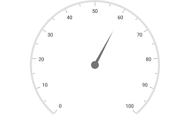
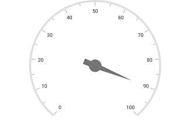
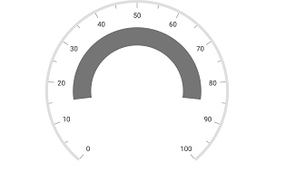
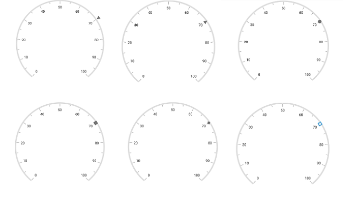
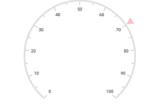
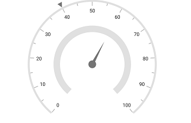

---

layout: post
title: Pointers in Syncfusion SfCircularGauge control for Xamarin.Forms
description: This section explains the steps required to add and customize pointers in Syncfusion Circular Gauge control for Xamarin.Forms
platform: xamarin
control: SfCircularGauge
documentation: ug

---

# Pointers in SfCircularGauge

You can add multiple pointers to the gauge to point multiple values on the same scale. It is used to show low and high values at the same time. The value of the pointer is set by using the [`Value`](https://help.syncfusion.com/cr/xamarin/Syncfusion.SfGauge.XForms.Pointer.html#Syncfusion_SfGauge_XForms_Pointer_Value) property.

## Needle pointer

[`Needle Pointer`](https://help.syncfusion.com/cr/xamarin/Syncfusion.SfGauge.XForms.NeedlePointer.html) contains three parts, namely needle, knob, and tail and that can be placed on a gauge to mark the values.





     <gauge:SfCircularGauge>
   
         <gauge:SfCircularGauge.Scales>

             <gauge:Scale>

                <gauge:Scale.Pointers>
                     <gauge:NeedlePointer  Value="70" />                     
                </gauge:Scale.Pointers>
				
		     </gauge:Scale>

         </gauge:SfCircularGauge.Scales>	
   
     </gauge:SfCircularGauge>





    SfCircularGauge circularGauge = new SfCircularGauge();
    ObservableCollection<Scale> scales = new ObservableCollection<Scale>();
    Scale scale = new Scale();
    NeedlePointer needlePointer = new NeedlePointer();
    needlePointer.Value = 70;
    scale.Pointers.Add(needlePointer);
    scales.Add(scale);
    circularGauge.Scales = scales;  





### Setting needle pointer type

The appearance of the needle pointer can be customized by using the [`Type`](https://help.syncfusion.com/cr/xamarin/Syncfusion.SfGauge.XForms.NeedlePointer.html#Syncfusion_SfGauge_XForms_NeedlePointer_Type) property. The default value of this property is [`BarPointer`](https://help.syncfusion.com/cr/xamarin/Syncfusion.SfGauge.XForms.BarPointer.html). This is an enum property, and it has the following options:

1. Bar
2. Triangle

### Setting bar pointer type





     <gauge:SfCircularGauge>
  
         <gauge:SfCircularGauge.Scales>

             <gauge:Scale>

                <gauge:Scale.Pointers>
                     <gauge:NeedlePointer  Value="60" Type="Bar"/>                    
                 </gauge:Scale.Pointers>
		 
		     </gauge:Scale>

         </gauge:SfCircularGauge.Scales>	
  
     </gauge:SfCircularGauge>





    SfCircularGauge circularGauge = new SfCircularGauge();
    ObservableCollection<Scale> scales = new ObservableCollection<Scale>();
    Scale scale = new Scale();
    NeedlePointer needlePointer = new NeedlePointer();
    needlePointer.Value = 60;
	needlePointer.Type = PointerType.Bar;
    scale.Pointers.Add(needlePointer);
    scales.Add(scale);
    circularGauge.Scales = scales;  





### Setting needle pointer type





     <gauge:SfCircularGauge>
  
         <gauge:SfCircularGauge.Scales>

             <gauge:Scale>

                 <gauge:Scale.Pointers>
                     <gauge:NeedlePointer  Value="60" Type="Triangle"/>                    
                 </gauge:Scale.Pointers>
		 
		     </gauge:Scale>

         </gauge:SfCircularGauge.Scales>	
  
     </gauge:SfCircularGauge>





    SfCircularGauge circularGauge = new SfCircularGauge();
    ObservableCollection<Scale> scales = new ObservableCollection<Scale>();
    Scale scale = new Scale();
    NeedlePointer needlePointer = new NeedlePointer();
    needlePointer.Value = 60;
	needlePointer.Type = PointerType.Triangle;
    scale.Pointers.Add(needlePointer);
    scales.Add(scale);
    circularGauge.Scales = scales;  





### Needle pointer customization

The length of the needle is controlled by using the [`LengthFactor`](https://help.syncfusion.com/cr/xamarin/Syncfusion.SfGauge.XForms.NeedlePointer.html#Syncfusion_SfGauge_XForms_NeedlePointer_LengthFactor) property. The [`LengthFactor`](https://help.syncfusion.com/cr/xamarin/Syncfusion.SfGauge.XForms.NeedlePointer.html#Syncfusion_SfGauge_XForms_NeedlePointer_LengthFactor) property’s minimum and maximum bounds are 0 and 1. The needle’s UI is customized by using the [`Color`](https://help.syncfusion.com/cr/xamarin/Syncfusion.SfGauge.XForms.Pointer.html#Syncfusion_SfGauge_XForms_Pointer_Color) and [`Thickness`](https://help.syncfusion.com/cr/xamarin/Syncfusion.SfGauge.XForms.NeedlePointer.html#Syncfusion_SfGauge_XForms_NeedlePointer_Thickness) properties.





     <gauge:SfCircularGauge>
   
         <gauge:SfCircularGauge.Scales>

             <gauge:Scale>

                 <gauge:Scale.Pointers>
                     <gauge:NeedlePointer  Value="60" Color="DeepSkyBlue"  LengthFactor="0.7" Thickness="7"/>                   
                 </gauge:Scale.Pointers>
		 
		  </gauge:Scale>

         </gauge:SfCircularGauge.Scales>	
  
     </gauge:SfCircularGauge>





    SfCircularGauge circularGauge = new SfCircularGauge();
    ObservableCollection<Scale> scales = new ObservableCollection<Scale>();
    Scale scale = new Scale();
    NeedlePointer needlePointer = new NeedlePointer();
    needlePointer.Value = 60;
    needlePointer.Color = Color.DeepSkyBlue;
    needlePointer.Thickness = 7;      
    needlePointer.LengthFactor = 0.7;
    scale.Pointers.Add(needlePointer);
    scales.Add(scale);
    circularGauge.Scales = scales;  





### Knob customization

Knob of the needle pointer can be customized by using the [`KnobColor`](https://help.syncfusion.com/cr/xamarin/Syncfusion.SfGauge.XForms.NeedlePointer.html#Syncfusion_SfGauge_XForms_NeedlePointer_KnobColor), [`KnobRadius`](https://help.syncfusion.com/cr/xamarin/Syncfusion.SfGauge.XForms.NeedlePointer.html#Syncfusion_SfGauge_XForms_NeedlePointer_KnobRadius), [`KnobRadiusFactor`](https://help.syncfusion.com/cr/xamarin/Syncfusion.SfGauge.XForms.NeedlePointer.html#Syncfusion_SfGauge_XForms_NeedlePointer_KnobRadiusFactor), [`KnobStrokeColor`](https://help.syncfusion.com/cr/xamarin/Syncfusion.SfGauge.XForms.NeedlePointer.html#Syncfusion_SfGauge_XForms_NeedlePointer_KnobStrokeColor), and [`KnobStrokeWidth`](https://help.syncfusion.com/cr/xamarin/Syncfusion.SfGauge.XForms.NeedlePointer.html#Syncfusion_SfGauge_XForms_NeedlePointer_KnobStrokeWidth) properties. You can set the radius of knob to pixel and percentage values by using the [`KnobRadius`](https://help.syncfusion.com/cr/xamarin/Syncfusion.SfGauge.XForms.NeedlePointer.html#Syncfusion_SfGauge_XForms_NeedlePointer_KnobRadius) and [`KnobRadiusFactor`](https://help.syncfusion.com/cr/xamarin/Syncfusion.SfGauge.XForms.NeedlePointer.html#Syncfusion_SfGauge_XForms_NeedlePointer_KnobRadiusFactor) properties.





     <gauge:SfCircularGauge>
    
         <gauge:SfCircularGauge.Scales>

             <gauge:Scale>

                 <gauge:Scale.Pointers>
                     <gauge:NeedlePointer  Value="10" KnobRadius="15" KnobStrokeColor="#007DD1"
                                            KnobStrokeWidth="8" KnobColor="White" KnobRadiusFactor="0.1"/>                
                 </gauge:Scale.Pointers>
		 
		  </gauge:Scale>

         </gauge:SfCircularGauge.Scales>	
           
  
     </gauge:SfCircularGauge>





    SfCircularGauge circularGauge = new SfCircularGauge();
    ObservableCollection<Scale> scales = new ObservableCollection<Scale>();
    Scale scale = new Scale();
    NeedlePointer needlePointer = new NeedlePointer();
    needlePointer.Value = 10;
    needlePointer.KnobRadius = 15;
    needlePointer.KnobStrokeColor = Color.FromHex("#007DD1");
    needlePointer.KnobColor = Color.White;
    needlePointer.KnobStrokeWidth = 8;
    needlePointer.KnobRadiusFactor = 0.1;
    scale.Pointers.Add(needlePointer);
    scales.Add(scale);
    circularGauge.Scales = scales;  





### Setting tail for needle pointer

Tail of the needle pointer can be customized by using the [`TailColor`](https://help.syncfusion.com/cr/xamarin/Syncfusion.SfGauge.XForms.NeedlePointer.html#Syncfusion_SfGauge_XForms_NeedlePointer_TailColor), [`TailLengthFactor`](https://help.syncfusion.com/cr/xamarin/Syncfusion.SfGauge.XForms.NeedlePointer.html#Syncfusion_SfGauge_XForms_NeedlePointer_TailLengthFactor), [`TailStrokeColor`](https://help.syncfusion.com/cr/xamarin/Syncfusion.SfGauge.XForms.NeedlePointer.html#Syncfusion_SfGauge_XForms_NeedlePointer_TailStrokeColor), and [`TailStrokeWidth`](https://help.syncfusion.com/cr/xamarin/Syncfusion.SfGauge.XForms.NeedlePointer.html#Syncfusion_SfGauge_XForms_NeedlePointer_TailStrokeWidth) properties.





     <gauge:SfCircularGauge>
         <gauge:SfCircularGauge.Scales>

             <gauge:Scale>

                 <gauge:Scale.Pointers>
                      <gauge:NeedlePointer  Value="90" KnobRadius = "15" TailColor="#757575" TailLengthFactor="0.2" TailStrokeWidth="1" TailStrokeColor="#757575" />              
                 </gauge:Scale.Pointers>
		 
		     </gauge:Scale>

         </gauge:SfCircularGauge.Scales>	
 
     </gauge:SfCircularGauge>





    SfCircularGauge circularGauge = new SfCircularGauge();
    ObservableCollection<Scale> scales = new ObservableCollection<Scale>();
    Scale scale = new Scale();
    NeedlePointer needlePointer = new NeedlePointer();
    needlePointer.Value = 90;
	needlePointer.KnobRadius = 15;
    needlePointer.TailColor = Color.FromHex("#757575");
    needlePointer.TailLengthFactor = 0.2;
    needlePointer.TailStrokeWidth = 1;
    needlePointer.TailStrokeColor = Color.FromHex("#757575");
    scale.Pointers.Add(needlePointer);
    scales.Add(scale);
    circularGauge.Scales = scales;  





## Range pointer

A range pointer is an accenting line or shaded background range that can be placed on a gauge to mark the values. The [`RangeStart`](https://help.syncfusion.com/cr/xamarin/Syncfusion.SfGauge.XForms.RangePointer.html#Syncfusion_SfGauge_XForms_RangePointer_RangeStart) property allows you to set the starting value of the range pointer.





     <gauge:SfCircularGauge>
         <gauge:SfCircularGauge.Scales>

             <gauge:Scale>

                 <gauge:Scale.Pointers>
                     <gauge:RangePointer RangeStart="15" Value="85" />               
                 </gauge:Scale.Pointers>
		 
		      </gauge:Scale>

         </gauge:SfCircularGauge.Scales>	
  
     </gauge:SfCircularGauge>





    SfCircularGauge circularGauge = new SfCircularGauge();
    ObservableCollection<Scale> scales = new ObservableCollection<Scale>();
    Scale scale = new Scale();
    RangePointer rangePointer = new RangePointer();
    rangePointer.RangeStart = 15;
    rangePointer.Value = 85;
    scale.Pointers.Add(rangePointer);
    scales.Add(scale);
    circularGauge.Scales = scales;  





### Range pointer customization

The range pointer’s UI is customized by using the [`Color`](https://help.syncfusion.com/cr/xamarin/Syncfusion.SfGauge.XForms.Pointer.html#Syncfusion_SfGauge_XForms_Pointer_Color) and [`Thickness`](https://help.syncfusion.com/cr/xamarin/Syncfusion.SfGauge.XForms.RangePointer.html#Syncfusion_SfGauge_XForms_RangePointer_Thickness) properties. First, you should set the [`Offset`](https://help.syncfusion.com/cr/xamarin/Syncfusion.SfGauge.XForms.RangePointer.html#Syncfusion_SfGauge_XForms_RangePointer_Offset) property for range pointer, and then increase the thickness of the range pointer.





     <gauge:SfCircularGauge>
    
         <gauge:SfCircularGauge.Scales>

             <gauge:Scale>

                 <gauge:Scale.Pointers>
                     <gauge:RangePointer Value="60"  Color="DarkCyan"  Thickness="30" Offset="0.7"/>                
                 </gauge:Scale.Pointers>
		 
		  </gauge:Scale>

         </gauge:SfCircularGauge.Scales>	
  
     </gauge:SfCircularGauge>





    SfCircularGauge circularGauge = new SfCircularGauge();
    ObservableCollection<Scale> scales = new ObservableCollection<Scale>();
    Scale scale = new Scale();
    RangePointer rangePointer = new RangePointer();
    rangePointer.Value = 60;
    rangePointer.Color = Color.DarkCyan;
    rangePointer.Thickness = 30;
    rangePointer.Offset = 0.7;
    scale.Pointers.Add(rangePointer);
    scales.Add(scale);
    circularGauge.Scales = scales;  





### Setting position for range pointer

The [`RangePointer`](https://help.syncfusion.com/cr/xamarin/Syncfusion.SfGauge.XForms.RangePointer.html) in the scale can be placed inside or outside of the scale by using the following two ways:

1. The [`Offset`](https://help.syncfusion.com/cr/xamarin/Syncfusion.SfGauge.XForms.RangePointer.html#Syncfusion_SfGauge_XForms_RangePointer_Offset) property.
2. The [`StartOffset`](https://help.syncfusion.com/cr/xamarin/Syncfusion.SfGauge.XForms.RangePointer.html#Syncfusion_SfGauge_XForms_RangePointer_StartOffset) and [`EndOffset`](https://help.syncfusion.com/cr/xamarin/Syncfusion.SfGauge.XForms.RangePointer.html#Syncfusion_SfGauge_XForms_RangePointer_EndOffset) properties.

#### Setting offset for range pointer





     <gauge:SfCircularGauge>
    
         <gauge:SfCircularGauge.Scales>

             <gauge:Scale>

                 <gauge:Scale.Pointers>
                      <gauge:RangePointer Value="100"  Offset="0.3" Thickness = "30"/>                 
                 </gauge:Scale.Pointers>
		 
		     </gauge:Scale>

         </gauge:SfCircularGauge.Scales>	
   
     </gauge:SfCircularGauge>





    SfCircularGauge circularGauge = new SfCircularGauge();
    ObservableCollection<Scale> scales = new ObservableCollection<Scale>();
    Scale scale = new Scale();
    RangePointer rangePointer = new RangePointer();
    rangePointer.Value = 100;
    rangePointer.Offset = 0.3;
	rangePointer.Thickness = 30;
    scale.Pointers.Add(rangePointer);
    scales.Add(scale);
    circularGauge.Scales = scales;  





#### Setting start and end offset for range pointer





     <gauge:SfCircularGauge>
    
         <gauge:SfCircularGauge.Scales>

             <gauge:Scale>

                 <gauge:Scale.Pointers>
                     <gauge:RangePointer RangeStart="15" Value="85" StartOffset="0.5" EndOffset="0.7"/>                 
                 </gauge:Scale.Pointers>
		 
		  </gauge:Scale>

         </gauge:SfCircularGauge.Scales>	
           
     </gauge:SfCircularGauge>





    SfCircularGauge circularGauge = new SfCircularGauge();
    ObservableCollection<Scale> scales = new ObservableCollection<Scale>();
    Scale scale = new Scale();
    RangePointer rangePointer = new RangePointer();
    rangePointer.RangeStart = 15;
    rangePointer.Value = 85;
    rangePointer.StartOffset = 0.5;
    rangePointer.EndOffset = 0.7;
    scale.Pointers.Add(rangePointer);
    scales.Add(scale);
    circularGauge.Scales = scales;  





### Setting range cap for range pointer

The [`RangeCap`](https://help.syncfusion.com/cr/xamarin/Syncfusion.SfGauge.XForms.RangePointer.html#Syncfusion_SfGauge_XForms_RangePointer_RangeCap) property provides options to position the range cap of the [`RangePointer`](https://help.syncfusion.com/cr/xamarin/Syncfusion.SfGauge.XForms.RangePointer.html), which contains the start, end, both, and none options. The [`RangeCap`](https://help.syncfusion.com/cr/xamarin/Syncfusion.SfGauge.XForms.RangePointer.html#Syncfusion_SfGauge_XForms_RangePointer_RangeCap) property is an enum property.





     <gauge:SfCircularGauge>
   
         <gauge:SfCircularGauge.Scales>

             <gauge:Scale LabelOffset ="0.75" ScaleStartOffset = "0.9" ScaleEndOffset ="1">

              <gauge:Scale.MajorTickSettings>
                        <gauge:TickSetting Offset = "0.9"/>
                    </gauge:Scale.MajorTickSettings>
                    
                    <gauge:Scale.MinorTickSettings>
                        <gauge:TickSetting Offset = "0.9"/>
                    </gauge:Scale.MinorTickSettings>

                 <gauge:Scale.Pointers>
                      <gauge:RangePointer RangeStart="20" Value="80"  RangeCap="End" StartOffset="0.9" EndOffset ="1" />                  
                 </gauge:Scale.Pointers>
		 
		     </gauge:Scale>

         </gauge:SfCircularGauge.Scales>	
           
     </gauge:SfCircularGauge>





    SfCircularGauge circularGauge = new SfCircularGauge();
    ObservableCollection<Scale> scales = new ObservableCollection<Scale>();
    Scale scale = new Scale();
    scale.MajorTickSettings.Offset = 0.9;
    scale.MinorTickSettings.Offset = 0.9;
    scale.LabelOffset = 0.75;
    scale.ScaleStartOffset = 0.9;
    scale.ScaleEndOffset = 1;
    RangePointer rangePointer = new RangePointer();
    rangePointer.RangeStart = 20;
    rangePointer.StartOffset = 0.9;
    rangePointer.EndOffset = 1;
    rangePointer.Value = 80;
    rangePointer.RangeCap = RangeCap.End;
    scale.Pointers.Add(rangePointer);
    scales.Add(scale);
    circularGauge.Scales = scales;  





## Marker pointer

The different types of marker shapes are used to mark the pointer values in a scale. You can change the marker shape by using the [`MarkerShape`](https://help.syncfusion.com/cr/xamarin/Syncfusion.SfGauge.XForms.MarkerPointer.html#Syncfusion_SfGauge_XForms_MarkerPointer_MarkerShape) property. Gauge supports the following types of marker shapes:

* Circle
* Rectangle
* Triangle
* Inverted triangle
* Diamond
* Image

The image is used to denote the pointer value instead of rendering the marker shape. It can be achieved by setting the [`MarkerShape`](https://help.syncfusion.com/cr/xamarin/Syncfusion.SfGauge.XForms.MarkerPointer.html#Syncfusion_SfGauge_XForms_MarkerPointer_MarkerShape) to `Image`, and assigning the image path to [`ImageSource`](https://help.syncfusion.com/cr/xamarin/Syncfusion.SfGauge.XForms.MarkerPointer.html#Syncfusion_SfGauge_XForms_MarkerPointer_ImageSource) in pointer.





     <gauge:SfCircularGauge>
    
         <gauge:SfCircularGauge.Scales>

             <gauge:Scale>

                 <gauge:Scale.Pointers>
                     <gauge:MarkerPointer Value="70" MarkerShape = "Triangle"/>                  
                 </gauge:Scale.Pointers>
		 
		  </gauge:Scale>

         </gauge:SfCircularGauge.Scales>	
    
     </gauge:SfCircularGauge>





    SfCircularGauge circularGauge = new SfCircularGauge();
    ObservableCollection<Scale> scales = new ObservableCollection<Scale>();
    Scale scale = new Scale();
    MarkerPointer markerPointer = new MarkerPointer();
    markerPointer.Value = 70;
	markerPointer.MarkerShape = MarkerShape.Triangle;
    scale.Pointers.Add(markerPointer);
    scales.Add(scale);
    circularGauge.Scales = scales;  





### Setting image marker shape





     <gauge:SfCircularGauge>
    
         <gauge:SfCircularGauge.Scales>

             <gauge:Scale>

                 <gauge:Scale.Pointers>
                    <gauge:MarkerPointer Value="40" MarkerShape = "Image" ImageSource = "icon.png"/>           
                 </gauge:Scale.Pointers>
		 
		     </gauge:Scale>

         </gauge:SfCircularGauge.Scales>	
           
     </gauge:SfCircularGauge>





    SfCircularGauge circularGauge = new SfCircularGauge();
    ObservableCollection<Scale> scales = new ObservableCollection<Scale>();
    Scale scale = new Scale();
    ObservableCollection<Pointer> pointers = new ObservableCollection<Pointer>();
    MarkerPointer markerPointer = new MarkerPointer();
    markerPointer.Value = 40; 
    markerPointer.MarkerShape = MarkerShape.Image;
    markerPointer.ImageSource = "icon.png";	
    pointers.Add(markerPointer);
    scale.Pointers = pointers; 
    scales.Add(scale);

    circularGauge.Scales = scales;  





### Marker pointer customization

The marker can be customized in terms of color, width, and height by using the [`Color`](https://help.syncfusion.com/cr/xamarin/Syncfusion.SfGauge.XForms.Pointer.html#Syncfusion_SfGauge_XForms_Pointer_Color), [`MarkerWidth`](https://help.syncfusion.com/cr/xamarin/Syncfusion.SfGauge.XForms.MarkerPointer.html#Syncfusion_SfGauge_XForms_MarkerPointer_MarkerWidth), and [`MarkerHeight`](https://help.syncfusion.com/cr/xamarin/Syncfusion.SfGauge.XForms.MarkerPointer.html#Syncfusion_SfGauge_XForms_MarkerPointer_MarkerHeight) properties in pointer. First, you should set the [`Offset`](https://help.syncfusion.com/cr/xamarin/Syncfusion.SfGauge.XForms.MarkerPointer.html#Syncfusion_SfGauge_XForms_MarkerPointer_Offset) property for marker pointer, then increase the height and width of the marker pointer.





     <gauge:SfCircularGauge>
    
         <gauge:SfCircularGauge.Scales>

             <gauge:Scale>

                <gauge:Scale.Pointers>
                     <gauge:MarkerPointer Value="70" Color="Pink" MarkerHeight="20" MarkerWidth="20" Offset="1"/>                  
                 </gauge:Scale.Pointers>
		 
		    </gauge:Scale>

         </gauge:SfCircularGauge.Scales>	

     </gauge:SfCircularGauge>





    SfCircularGauge circularGauge = new SfCircularGauge();
    ObservableCollection<Scale> scales = new ObservableCollection<Scale>();
    Scale scale = new Scale();
    MarkerPointer markerPointer = new MarkerPointer();
    markerPointer.Value = 70;
    markerPointer.Color = Color.Pink;
    markerPointer.MarkerHeight = 20;
    markerPointer.MarkerWidth = 20;
    markerPointer.Offset = 1;
    scale.Pointers.Add(markerPointer);
    scales.Add(scale);
    circularGauge.Scales = scales;  





## Setting multiple pointers

In addition to the default pointer, you can add n number of pointers to a scale by using the [`Pointers`](https://help.syncfusion.com/cr/xamarin/Syncfusion.SfGauge.XForms.Pointer.html) property.





     <gauge:SfCircularGauge>
    
         <gauge:SfCircularGauge.Scales>

             <gauge:Scale>

                <gauge:Scale.Pointers>
                    <gauge:MarkerPointer  Value="60" />              
                </gauge:Scale.Pointers>
				
		     </gauge:Scale>
		 
		     <gauge:Scale ShowTicks ="False" ShowLabels ="False" ScaleStartOffset ="0.5" ScaleEndOffset = "0.6">

                 <gauge:Scale.Pointers>           
                    <gauge:NeedlePointer Value="40" LengthFactor = "0.3"/>                  
                  </gauge:Scale.Pointers>
				  
		    </gauge:Scale>

         </gauge:SfCircularGauge.Scales>	
  
     </gauge:SfCircularGauge>





    SfCircularGauge circularGauge = new SfCircularGauge();
    ObservableCollection<Scale> scales = new ObservableCollection<Scale>();
    Scale scale = new Scale();
    ObservableCollection<Pointer> pointers = new ObservableCollection<Pointer>();
    MarkerPointer markerPointer = new MarkerPointer();
    markerPointer.Value = 40;      
    pointers.Add(markerPointer);
	
	Scale scale1 = new Scale();
    scale1.ShowLabels = false;
    scale1.ShowTicks = false;
    scale1.ScaleStartOffset = 0.5;
    scale1.ScaleEndOffset = 0.6;
			
    NeedlePointer needlePointer = new NeedlePointer();
    needlePointer.Value = 60;
    needlePointer.LengthFactor = 0.3;
    pointers.Add(needlePointer);
	
	scale1.Pointers = pointers;
   
    scale.Pointers = pointers; 
    scales.Add(scale);
	scales.Add(scale1);
    circularGauge.Scales = scales;  





## Setting animation for pointer

The [`EnableAnimation`](https://help.syncfusion.com/cr/xamarin/Syncfusion.SfGauge.XForms.Pointer.html#Syncfusion_SfGauge_XForms_Pointer_EnableAnimation) property is a Boolean property that enables or disables the animation of the pointers in circular gauge.





     <gauge:SfCircularGauge>
     
         <gauge:SfCircularGauge.Scales>

                <gauge:Scale   RimColor="LightGray" RimThickness="30" RadiusFactor="1" ShowTicks="False"
                               StartValue="0" EndValue="100" Interval="10" LabelOffset="0.75" LabelColor="#424242"
                              LabelFontSize ="15" >

                 <gauge:Scale.Pointers>
				 
                      <gauge:RangePointer Color="Orange" Thickness="30" Offset="1" EnableAnimation="True"
                                            AnimationDuration="5" Value="80" />
											
                        <gauge:NeedlePointer Thickness="7" LengthFactor="0.55" Color="LightGray"
                                             KnobColor="White" TailColor="LightGray" TailLengthFactor="0.2"
                                             Type="Triangle"  KnobRadius="12" Value="80"
                                             AnimationDuration="5" TailStrokeWidth="2" TailStrokeColor="LightGray"
                                             KnobStrokeColor="LightGray" KnobStrokeWidth="8"/>			
											 
                 </gauge:Scale.Pointers>
		 
		    </gauge:Scale>

         </gauge:SfCircularGauge.Scales>	
   
     </gauge:SfCircularGauge>





    SfCircularGauge circularGauge = new SfCircularGauge();
    ObservableCollection<Scale> scales = new ObservableCollection<Syncfusion.SfGauge.XForms.Scale>();
    Scale scale = new Syncfusion.SfGauge.XForms.Scale();
    scale.RimColor = Color.LightGray;
    scale.RimThickness = 30;
    scale.RadiusFactor = 1;
    scale.ShowTicks = false;
    scale.StartValue = 0;
    scale.EndValue = 100;
    scale.Interval = 10;
    scale.LabelOffset = 0.75;
    scale.LabelColor = Color.FromHex("#424242");
    scale.LabelFontSize = 15;

    RangePointer pointer1 = new RangePointer();
    pointer1.Color = Color.Orange;
    pointer1.Thickness = 30;
    pointer1.Offset = 1;
    pointer1.EnableAnimation = true;
    pointer1.AnimationDuration = 5;
    pointer1.Value = 80;
    scale.Pointers.Add(pointer1);

    NeedlePointer pointer2 = new NeedlePointer();
    pointer2.Thickness = 7;
    pointer2.LengthFactor = 0.55;
    pointer2.Color = Color.LightGray;
    pointer2.KnobColor = Color.White;
    pointer2.TailColor = Color.LightGray;
    pointer2.TailLengthFactor = 0.2;
    pointer2.Type = PointerType.Triangle;
    pointer2.KnobRadius = 15;
    pointer2.KnobRadius = 12;
    pointer2.Value = 80;
    pointer2.AnimationDuration = 5;
    pointer2.TailStrokeWidth = 2;
    pointer2.TailStrokeColor = Color.LightGray;
    pointer2.KnobStrokeColor = Color.LightGray;
    pointer2.KnobStrokeWidth = 8;
    scale.Pointers.Add(pointer2);
    circularGauge.Scales.Add(scale);





## Setting pointer drag

MarkerPointer and NeedlePointer can be touched and dragged over the scale value by setting the [`EnableDragging`](https://help.syncfusion.com/cr/xamarin/Syncfusion.SfGauge.XForms.MarkerPointer.html#Syncfusion_SfGauge_XForms_MarkerPointer_EnableDragging) property as true. Pointers can be moved to the respective touch position.





     <gauge:SfCircularGauge>
    
         <gauge:SfCircularGauge.Scales>

              <gauge:Scale   RimColor="DeepSkyBlue" RimThickness="20" RadiusFactor="1" ShowTicks="False"
                               StartValue="0" EndValue="100" Interval="10" LabelOffset="0.75" LabelColor="#424242"
                              LabelFontSize ="15">

                 <gauge:Scale.Pointers>
                    <gauge:MarkerPointer MarkerShape="InvertedTriangle" MarkerHeight="18" MarkerWidth="18"
                                             Value="30" EnableAnimation="False" EnableDragging="True"/>				 
                 </gauge:Scale.Pointers>
		 
		    </gauge:Scale>

         </gauge:SfCircularGauge.Scales>	
  
     </gauge:SfCircularGauge>





           SfCircularGauge circularGauge = new SfCircularGauge(this);
            
            CircularScale scale = new CircularScale();
            scale.RimColor = Color.DeepSkyBlue;
            scale.RimWidth = 20;
            scale.RadiusFactor = 1;
            scale.ShowTicks = false;
            scale.StartValue = 0;
            scale.EndValue = 100;
            scale.Interval = 10;
            scale.LabelOffset = 0.75;
            scale.LabelColor = Color.ParseColor("#424242");
            scale.LabelTextSize = 15;

            MarkerPointer pointer1 = new MarkerPointer();
            pointer1.MarkerShape = Com.Syncfusion.Gauges.SfCircularGauge.Enums.MarkerShape.InvertedTriangle;
            pointer1.Color = Color.DarkBlue;
            pointer1.MarkerHeight = 18;
            pointer1.MarkerWidth = 18;
            pointer1.Value = 30;
            pointer1.EnableAnimation = false;
            pointer1.EnableDragging = true;
            scale.CircularPointers.Add(pointer1);

            circularGauge.CircularScales.Add(scale);





N> By default, the pointer drag was disabled.

## Event

### Pointer position changed event

The [`PointerPositionChanged`](https://help.syncfusion.com/cr/xamarin/Syncfusion.SfGauge.XForms.SfCircularGauge.html#Syncfusion_SfGauge_XForms_SfCircularGauge_PointerPositionChanged) event occurs when the pointer position was changed. The PointerPositionChangedArgs argument contains the following information:

* [`Pointer`](https://help.syncfusion.com/cr/xamarin/Syncfusion.SfGauge.XForms.Pointer.html) - Gets the dragged pointer.
* [`Scale`](https://help.syncfusion.com/cr/xamarin/Syncfusion.SfGauge.XForms.Scale.html) - Gets the dragged pointer scale.
* [`rangeStartValue'](https://help.syncfusion.com/cr/xamarin/Syncfusion.SfGauge.XForms.Range.html#Syncfusion_SfGauge_XForms_Range_StartValue) - Gets or sets the start value of the range. It customizes the start value ranges.
* ['pointerValue'](https://help.syncfusion.com/cr/xamarin/Syncfusion.SfGauge.XForms.Pointer.html#Syncfusion_SfGauge_XForms_Pointer_Value) - Gets or sets the value of the pointer. It customizes the value for pointer.
* rangeStartPosition - Gets or sets the range start position.
* pointerValuePosition - Gets or sets the pointer value position.

### Value change started event

Called when the user starts updating a new value of the pointer by initiating the dragging. While dragging the pointer, other events ([`ValueChanging`](https://help.syncfusion.com/cr/xamarin/Syncfusion.SfGauge.XForms.Pointer.html#Syncfusion_SfGauge_XForms_Pointer_ValueChanging), [`ValueChanged`](https://help.syncfusion.com/cr/xamarin/Syncfusion.SfGauge.XForms.Pointer.html#Syncfusion_SfGauge_XForms_Pointer_ValueChanged), and [`ValueChangeCompleted`](https://help.syncfusion.com/cr/xamarin/Syncfusion.SfGauge.XForms.Pointer.html#Syncfusion_SfGauge_XForms_Pointer_ValueChangeCompleted)) will be followed after this event.

The [`ValueChangeStarted`](https://help.syncfusion.com/cr/xamarin/Syncfusion.SfGauge.XForms.Pointer.html#Syncfusion_SfGauge_XForms_Pointer_ValueChangeStarted) event contains the following argument.

* `Value` : This value will be the last value the pointer had before the changes began.





     <gauge:SfCircularGauge>
                <gauge:SfCircularGauge.Scales>
                    <gauge:Scale RimColor="DeepSkyBlue" RimThickness="20" RadiusFactor="1" ShowTicks="False"
                                 StartValue="0" EndValue="100" Interval="10" LabelOffset="0.75" LabelColor="#424242"
                                 LabelFontSize ="15">

                        <gauge:Scale.Pointers>
                            <gauge:MarkerPointer MarkerShape="InvertedTriangle" MarkerHeight="18" MarkerWidth="18"
                                                 Value="30" EnableAnimation="False" EnableDragging="True"
                                                 ValueChangeStarted="MarkerPointer_ValueChangeStarted"/>
                        </gauge:Scale.Pointers>

                    </gauge:Scale>
                </gauge:SfCircularGauge.Scales>
            </gauge:SfCircularGauge>





        private void MarkerPointer_ValueChangeStarted(object sender, Syncfusion.SfGauge.XForms.PointerValueChangedEventArgs e)
        {

        }





### Value changing event

Called during a drag when the user is updating before a new value for the pointer by dragging

The [`ValueChanging`](https://help.syncfusion.com/cr/xamarin/Syncfusion.SfGauge.XForms.Pointer.html#Syncfusion_SfGauge_XForms_Pointer_ValueChanging) event contains the following argument.

* `NewValue` : Gets the new pointer value, which is updated while dragging.
* `OldValue` : Gets the old value of the pointer, which is updated by pointer dragging.
* `Cancel` : Used to restrict the updating pointer value and cancel dragging.





                        <gauge:Scale.Pointers>
                            <gauge:MarkerPointer MarkerShape="InvertedTriangle" MarkerHeight="18" MarkerWidth="18"
                                                 Value="30" EnableAnimation="False" EnableDragging="True"
                                                 ValueChanging="MarkerPointer_ValueChanging"/>
                        </gauge:Scale.Pointers>





        private void MarkerPointer_ValueChanging(object sender, Syncfusion.SfGauge.XForms.PointerValueChangingEventArgs e)
        {

        }





### Value changed event

Called during a drag when the user is updating a new value for the pointer by dragging.

The [`ValueChanged`](https://help.syncfusion.com/cr/xamarin/Syncfusion.SfGauge.XForms.Pointer.html#Syncfusion_SfGauge_XForms_Pointer_ValueChanged) event contains the following argument.

* `Value` : Gets the updated value of the pointer.





       <gauge:Scale.Pointers>
                            <gauge:MarkerPointer MarkerShape="InvertedTriangle" MarkerHeight="18" MarkerWidth="18"
                                                 Value="30" EnableAnimation="False" EnableDragging="True"
                                                 ValueChanged="MarkerPointer_ValueChanged"/>
                        </gauge:Scale.Pointers>





        private void MarkerPointer_ValueChanged(object sender, Syncfusion.SfGauge.XForms.PointerValueChangedEventArgs e)
        {

        }





### Value change completed event

Called after a new value has been updated by terminating the dragging of the pointer. While dragging the pointer, other events (ValueChangeStarted, ValueChanging, and ValueChanged) will be called prior to the `ValueChangeCompleted` event.

This event will notify the completion of dragging with a new value being updated.

The [`ValueChangeCompleted`](https://help.syncfusion.com/cr/xamarin/Syncfusion.SfGauge.XForms.Pointer.html#Syncfusion_SfGauge_XForms_Pointer_ValueChangeCompleted) event contains the following argument.

* `Value` : Gets the updated value of the pointer.





            <gauge:Scale.Pointers>
                            <gauge:MarkerPointer MarkerShape="InvertedTriangle" MarkerHeight="18" MarkerWidth="18"
                                                 Value="30" EnableAnimation="False" EnableDragging="True"
                                                 ValueChangeCompleted="MarkerPointer_ValueChangeCompleted"/>
                        </gauge:Scale.Pointers>





        private void MarkerPointer_ValueChangeCompleted(object sender, Syncfusion.SfGauge.XForms.PointerValueChangedEventArgs e)
        {

        }





## See also

[How to set RangeCap to RangePointer in Xamarin.Forms SfCircularGauge](https://www.syncfusion.com/kb/10580/how-to-set-rangecap-to-rangepointer-in-xamarin-forms-sfcirculargauge)

[How to design a compass that always points to a specific place in Xamarin.Forms circular gauge](https://www.syncfusion.com/kb/11426/how-to-design-a-compass-that-always-points-to-a-specific-place-in-xamarin-forms-circular)

[How to show the direction by latitude and longitude values in SfCircularGauge using direction compass](https://www.syncfusion.com/kb/10606/how-to-show-the-direction-by-latitude-and-longitude-values-in-sfcirculargauge-using)

[How to animate circular gauge pointer when switching between tabs](https://www.syncfusion.com/kb/9022/how-to-animate-circular-gauge-pointer-when-switching-between-tabs)

[How to enable dragging support for pointer](https://www.syncfusion.com/kb/8292/how-to-enable-dragging-support-for-pointer)

[Rounded corner support for RangePointer](https://www.syncfusion.com/kb/8291/rounded-corner-support-for-rangepointer)