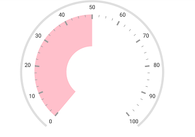

---

layout: post
title: Ranges in Syncfusion SfCircularGauge control for Xamarin.Forms
description: This section explains the steps required to add and customize ranges in Syncfusion Circular Gauge control for Xamarin.Forms
platform: xamarin
control: SfCircularGauge
documentation: ug

---

# Ranges in SfCircularGauge

Range is a visual element, which begins and ends at specified values within a scale.

## Setting start and end values for range

Start and end values of ranges are set by using the [`StartValue`](https://help.syncfusion.com/cr/xamarin/Syncfusion.SfGauge.XForms.Range.html#Syncfusion_SfGauge_XForms_Range_StartValue) and [`EndValue`](https://help.syncfusion.com/cr/xamarin/Syncfusion.SfGauge.XForms.Range.html#Syncfusion_SfGauge_XForms_Range_EndValue) properties. 




  
    <gauge:SfCircularGauge>

        <gauge:SfCircularGauge.Scales>

            <gauge:Scale>

                <gauge:Scale.Ranges>
                    <gauge:Range StartValue="0" EndValue="50" />
                </gauge:Scale.Ranges>
                
            </gauge:Scale>

        </gauge:SfCircularGauge.Scales>

    </gauge:SfCircularGauge>





    SfCircularGauge circularGauge = new SfCircularGauge();
    ObservableCollection<Scale> scales = new ObservableCollection<Scale>();
    Scale scale = new Scale();
    Range range = new Range();
    range.StartValue = 0;
    range.EndValue = 50;
    scale.Ranges.Add(range);
    scales.Add(scale);
    circularGauge.Scales = scales;  





## Range customization

An UI of a range is customized by using the [`Color`](https://help.syncfusion.com/cr/xamarin/Syncfusion.SfGauge.XForms.Range.html#Syncfusion_SfGauge_XForms_Range_Color) and [`Thickness`](https://help.syncfusion.com/cr/xamarin/Syncfusion.SfGauge.XForms.Range.html#Syncfusion_SfGauge_XForms_Range_Thickness) properties. First, you should set the [`Offset`](https://help.syncfusion.com/cr/xamarin/Syncfusion.SfGauge.XForms.Range.html#Syncfusion_SfGauge_XForms_Range_Offset) property for range, then increase the thickness of the range.




  
     <gauge:SfCircularGauge>

        <gauge:SfCircularGauge.Scales>

            <gauge:Scale   RimThickness="10" RimColor="#E0E0E0" LabelColor="#424242" 
                       LabelOffset="0.9"  MinorTicksPerInterval="3">

                <gauge:Scale.MajorTickSettings>
                    <gauge:TickSettings Thickness="3" Length="10" Offset="0.8"/>
                </gauge:Scale.MajorTickSettings>

                <gauge:Scale.MinorTickSettings>
                    <gauge:TickSettings Length="5" Offset="0.8"/>
                </gauge:Scale.MinorTickSettings>

                <gauge:Scale.Ranges>
                    <gauge:Range StartValue="0" EndValue="50" Thickness="70"  Offset="0.8"  Color = "Pink"/>
                </gauge:Scale.Ranges>

            </gauge:Scale>

        </gauge:SfCircularGauge.Scales>

    </gauge:SfCircularGauge>





    SfCircularGauge circularGauge = new SfCircularGauge();
    ObservableCollection<Scale> scales = new ObservableCollection<Scale>();
    Scale scale = new Scale();
	scale.RimThickness = 10;
    scale.RimColor = Color.FromHex("#E0E0E0");
    scale.LabelColor = Color.FromHex("#424242");
    scale.MajorTickSettings.Thickness = 3;
    scale.LabelOffset = 0.9;
    scale.MinorTickSettings.Length = 5;
    scale.MajorTickSettings.Length = 10;
    scale.MajorTickSettings.Offset = 0.8;
    scale.MinorTickSettings.Offset = 0.8;
     scale.MinorTicksPerInterval = 3;
    Range range = new Range();
    range.StartValue = 0;
    range.EndValue = 50;
	range.Thickness = 70;
    range.Offset = 0.8; 
    range.Color = Color.Pink;
    scale.Ranges.Add(range);
    scales.Add(scale);
    circularGauge.Scales = scales;  





## Setting position for range

The range can be placed inside the scale, outside the scale, or on the scale by using the following two ways:

1.The [`Offset`](https://help.syncfusion.com/cr/xamarin/Syncfusion.SfGauge.XForms.Range.html#Syncfusion_SfGauge_XForms_Range_Offset) property with the [`Thickness`](https://help.syncfusion.com/cr/xamarin/Syncfusion.SfGauge.XForms.Range.html#Syncfusion_SfGauge_XForms_Range_Thickness) property.




  
    <gauge:SfCircularGauge>

        <gauge:SfCircularGauge.Scales>

            <gauge:Scale>

                <gauge:Scale.Ranges>
                    <gauge:Range StartValue = "0" EndValue = "100" Offset = "0.3" Thickness = "20"/>
                </gauge:Scale.Ranges>

            </gauge:Scale>

        </gauge:SfCircularGauge.Scales>

    </gauge:SfCircularGauge>





    SfCircularGauge circularGauge = new SfCircularGauge();
    ObservableCollection<Scale> scales = new ObservableCollection<Scale>();
    Scale scale = new Scale();
    Range range = new Range();
    range.StartValue = 0;
    range.EndValue = 100;
    range.Offset = 0.3; 
	range.Thickness = 20;
    scale.Ranges.Add(range);
    scales.Add(scale);
    circularGauge.Scales = scales;  





2.The [`InnerStartOffset`](https://help.syncfusion.com/cr/xamarin/Syncfusion.SfGauge.XForms.Range.html#Syncfusion_SfGauge_XForms_Range_InnerStartOffset), [`InnerEndOffset`](https://help.syncfusion.com/cr/xamarin/Syncfusion.SfGauge.XForms.Range.html#Syncfusion_SfGauge_XForms_Range_InnerEndOffset), [`OuterStartOffset`](https://help.syncfusion.com/cr/xamarin/Syncfusion.SfGauge.XForms.Range.html#Syncfusion_SfGauge_XForms_Range_OuterStartOffset), and [`OuterEndOffset`](https://help.syncfusion.com/cr/xamarin/Syncfusion.SfGauge.XForms.Range.html#Syncfusion_SfGauge_XForms_Range_OuterEndOffset) properties.




  
    <gauge:SfCircularGauge>

        <gauge:SfCircularGauge.Scales>

            <gauge:Scale>

                <gauge:Scale.Ranges>
                    <gauge:Range StartValue="10" EndValue="80" InnerStartOffset = "0.83" InnerEndOffset = "0.6" OuterStartOffset = "0.85" OuterEndOffset =" 0.8"/>
                </gauge:Scale.Ranges>

            </gauge:Scale>

        </gauge:SfCircularGauge.Scales>

    </gauge:SfCircularGauge>





    SfCircularGauge circularGauge = new SfCircularGauge();
    ObservableCollection<Scale> scales = new ObservableCollection<Scale>();
    Scale scale = new Scale();
    Range range = new Range();
    range.StartValue = 10;
    range.EndValue = 80;
    range.InnerStartOffset = 0.83;
    range.InnerEndOffset = 0.6;
    range.OuterStartOffset = 0.85;
    range.OuterEndOffset = 0.8;
    scale.Ranges.Add(range);
    scales.Add(scale);
    circularGauge.Scales = scales;  





## Setting range color for labels

You can set range colors to labels using the [`UseRangeColorForLabels`](https://help.syncfusion.com/cr/xamarin/Syncfusion.SfGauge.XForms.Scale.html#Syncfusion_SfGauge_XForms_Scale_UseRangeColorForLabels) property.




  
    <gauge:SfCircularGauge>

        <gauge:SfCircularGauge.Scales>

            <gauge:Scale UseRangeColorForLabels="True">

                <gauge:Scale.Ranges>
                    <gauge:Range StartValue = "0" EndValue = "100"  Thickness = "20" />
                </gauge:Scale.Ranges>
                
            </gauge:Scale>

        </gauge:SfCircularGauge.Scales>

    </gauge:SfCircularGauge>





SfCircularGauge circularGauge = new SfCircularGauge();
ObservableCollection<Scale> scales = new ObservableCollection<Scale>();
Scale scale = new Scale();
scale.UseRangeColorForLabels = true;
Range range = new Range();
range.StartValue = 0;
range.EndValue = 100;
range.Thickness = 20;
scale.Ranges.Add(range);
scales.Add(scale);
circularGauge.Scales = scales;
this.Content = circularGauge;





## Setting multiple ranges

In addition to the default range, you can add n number of ranges to a scale by using the [`Ranges`](https://help.syncfusion.com/cr/xamarin/Syncfusion.SfGauge.XForms.Scale.html#Syncfusion_SfGauge_XForms_Scale_Ranges) property.




  
    <gauge:SfCircularGauge>
   
	    <gauge:SfCircularGauge.Headers>
                <gauge:Header Text="Poor" Position="0.1,0.55" TextSize="20" ForegroundColor="#F03E3E" FontAttributes = "Bold"/>
				<gauge:Header Text="Good" Position="0.87,0.55" TextSize="20" ForegroundColor="#27beb7" FontAttributes = "Bold"/>
            </gauge:SfCircularGauge.Headers>
			
         <gauge:SfCircularGauge.Scales>

             <gauge:Scale  StartValue = "0" EndValue = "100" StartAngle = "180" SweepAngle = "180" Interval = "10"
			                ShowLabels = "False" ShowTicks = "False" ShowRim = "False" RimThickness = "40" 
							RadiusFactor = "0.9" RimColor = "#e0e0e0">	
							
                    <gauge:Scale.Pointers>
                        <gauge:NeedlePointer  Value="70" KnobRadius="0" KnobStrokeColor = "#0682F6" KnobStrokeWidth = "6"
                                    Color="OrangeRed" KnobColor="White" LengthFactor="0.66" Type="Triangle" Thickness = "10"/>
                        </gauge:Scale.Pointers>   
					  <gauge:Scale.Ranges>
                        <gauge:Range StartValue = "0" EndValue = "35" Color = "#F03E3E" Thickness = "40" Offset = "0.9" />
						<gauge:Range StartValue = "35" EndValue = "75" Color = "#FFDD00" Thickness = "40" Offset = "0.9" />
						<gauge:Range StartValue = "75" EndValue = "100" Color = "#27beb7" Thickness = "40" Offset = "0.9" />
                    </gauge:Scale.Ranges>

 
	          </gauge:Scale>

         </gauge:SfCircularGauge.Scales>	
		 
   
     </gauge:SfCircularGauge>





    SfCircularGauge circularGauge = new SfCircularGauge();
    ObservableCollection<Scale> scales = new ObservableCollection<Syncfusion.SfGauge.XForms.Scale>();
    Scale scale = new Syncfusion.SfGauge.XForms.Scale();
    scale.StartValue = 0;
    scale.EndValue = 100;
    scale.StartAngle = 180;
    scale.SweepAngle = 180;
    scale.Interval = 10;
    scale.ShowLabels = false;
    scale.ShowTicks = false;
    scale.ShowRim = false;
    scale.RimThickness = 40;
    scale.RadiusFactor = 0.9;
    scale.RimColor = Color.FromHex("#e0e0e0");

    Header header1 = new Header();
    header1.Text = "Poor";
    header1.TextSize = 20;
    header1.Position = new Point(0.1, 0.55);
    header1.ForegroundColor = Color.FromHex("#F03E3E");
    header1.FontAttributes = FontAttributes.Bold;
    circularGauge.Headers.Add(header1);

    Header header2 = new Header();
    header2.Text = "Good";
    header2.TextSize = 20;
    header2.Position = new Point(0.87, 0.55);
    header2.ForegroundColor = Color.FromHex("#27beb7");
    header2.FontAttributes = FontAttributes.Bold;
    circularGauge.Headers.Add(header2);

     //Poor
    Range range = new Range();
    range.StartValue = 0;
	range.EndValue = 35;
    range.Offset = 0.9;
    range.Thickness = 40;
    range.Color = Color.FromHex("#F03E3E");
    scale.Ranges.Add(range);       

	//Average
    Range range1 = new Range();
	range1.StartValue = 35;
    range1.EndValue = 75;
    range1.Offset = 0.9;
    range1.Thickness = 40;
    range1.Color = Color.FromHex("#FFDD00");
    scale.Ranges.Add(range1);       

    //Good
    Range range2 = new Range();
    range2.StartValue = 75;
	range2.EndValue = 100;
    range2.Offset = 0.9;
    range2.Thickness = 40;
    range2.Color = Color.FromHex("#27beb7");
    scale.Ranges.Add(range2);

    NeedlePointer pointer = new NeedlePointer();
    pointer.Thickness = 10;
    pointer.LengthFactor = 0.66;
    pointer.Color = Color.OrangeRed;
    pointer.KnobColor = Color.White;
    pointer.Type = PointerType.Triangle;
    pointer.KnobRadius = 0;
    pointer.Value = 70;
    pointer.KnobStrokeColor = Color.FromHex("#0682F6");
    pointer.KnobStrokeWidth = 6;
    scale.Pointers.Add(pointer); 
    scales.Add(scale);
    circularGauge.Scales = scales;			





## Setting gradient color for range

You can give smooth color transition to range by specifying the different colors based on range value.




  
    <gauge:SfCircularGauge>
     
         <gauge:SfCircularGauge.Scales>

             <gauge:Scale  LabelFontSize = "16" ShowRim = "False" 
                          LabelOffset = "0.95" StartValue = "0" EndValue = "100" Interval = "10" RimThickness="28" MinorTicksPerInterval ="4" >		
						  
						  <gauge:Scale.MajorTickSettings>
                 <gauge:TickSettings Thickness="1" EndOffset="0.83" StartOffset="0.75" Length="8" />
             </gauge:Scale.MajorTickSettings>
			 
			 <gauge:Scale.MinorTickSettings>
                 <gauge:TickSettings  Thickness="0.7"  EndOffset="0.79" StartOffset="0.75"/>
             </gauge:Scale.MinorTickSettings>
						  
                     <gauge:Scale.Ranges>
                        <gauge:Range StartValue = "0" EndValue = "100" Thickness = "30" Offset = "0.6">
						  <gauge:Range.GradientStops>
                                <gauge:GaugeGradientStop Value="0" Color="#30B32D"/>
                                <gauge:GaugeGradientStop Value="50" Color="#FFDD00"/>
								<gauge:GaugeGradientStop Value="80" Color="#F03E3E"/>
                            </gauge:Range.GradientStops>
                        </gauge:Range>
						
                    </gauge:Scale.Ranges>
 
	          </gauge:Scale>

         </gauge:SfCircularGauge.Scales>	
	
     </gauge:SfCircularGauge>





    SfCircularGauge circularGauge = new SfCircularGauge();
    ObservableCollection<Scale> scales = new ObservableCollection<Syncfusion.SfGauge.XForms.Scale>();
    Scale scale = new Syncfusion.SfGauge.XForms.Scale();          
    scale.StartValue = 0;
    scale.EndValue = 100;
    scale.Interval = 10;
    scale.LabelFontSize = 16;          
    scale.LabelOffset = 0.95;           
    scale.RimThickness = 28;        
    scale.ShowRim = false;
    scale.MinorTicksPerInterval = 4;

    TickSettings major = new TickSettings();
    major.Thickness = 1;
    major.EndOffset = 0.83;
    major.StartOffset = 0.75;
    major.Length = 8;
    scale.MajorTickSettings = major;

    TickSettings minor = new TickSettings();
    minor.Thickness = 0.7;
    minor.EndOffset = 0.79;
    minor.StartOffset = 0.75;
    scale.MinorTickSettings = minor;
    scales.Add(scale);
    circularGauge.Scales = scales;

    Range range = new Range();
    range.Offset = 0.6;
    range.Thickness = 30;
    range.StartValue = 0;
    range.EndValue = 100;
    scale.Ranges.Add(range);

    ObservableCollection<GaugeGradientStop> gradientColor1 = new ObservableCollection<GaugeGradientStop>();

    GaugeGradientStop gaugeGradientStop = new GaugeGradientStop();
    gaugeGradientStop.Value = 0;
    gaugeGradientStop.Color = Color.FromHex("#30B32D");
    gradientColor1.Add(gaugeGradientStop);
	
    GaugeGradientStop gaugeGradientStop1 = new GaugeGradientStop();
    gaugeGradientStop1.Value = 50;
    gaugeGradientStop1.Color = Color.FromHex("#FFDD00");
    gradientColor1.Add(gaugeGradientStop1);
	
    GaugeGradientStop gaugeGradientStop2 = new GaugeGradientStop();
    gaugeGradientStop2.Value = 80;
    gaugeGradientStop2.Color = Color.FromHex("#F03E3E");
    gradientColor1.Add(gaugeGradientStop2);

    range.GradientStops = gradientColor1;
	
    circularGauge.Scales = scales;





## See Also

[How to apply gradient color for ranges in Xamarin.Forms SfCircularGauge](https://www.syncfusion.com/kb/10505/how-to-apply-gradient-color-for-ranges-in-xamarin-forms-sfcirculargauge)

[How to bind range collection to scale in Xamarin.Forms SfCircularGauge](https://www.syncfusion.com/kb/10506/how-to-bind-range-collection-to-scale-in-xamarin-forms-sfcirculargauge)