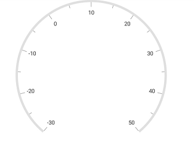
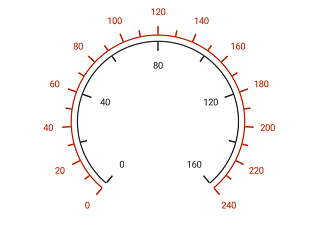
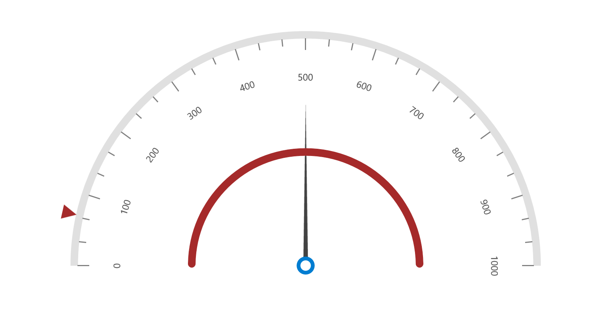

---

layout: post
title: Scales in Syncfusion SfCircularGauge control for Xamarin.Forms
description: This section explains the steps required to add and customize scales in Syncfusion Circular Gauge control for Xamarin.Forms
platform: xamarin
control: SfCircularGauge
documentation: ug

---

# Scales in SfCircularGauge

The scales contain a collection of [`Scale`](https://help.syncfusion.com/cr/xamarin/Syncfusion.SfGauge.XForms.Scale.html) elements, which integrates labels, tick marks, and a rim to customize the basic look and feel of the circular gauge.

## Scale

[`Scale`](https://help.syncfusion.com/cr/xamarin/Syncfusion.SfGauge.XForms.Scale.html) contains the sub elements such as rim, ticks, labels, ranges, and pointers. It defines the radius, start angle, sweep direction, sweep angle, overall minimum and maximum values, frequency of labels, and tick marks. It will have multiple ranges.

A range is a visual element, which begins and ends at specified values within a [`Scale`](https://help.syncfusion.com/cr/xamarin/Syncfusion.SfGauge.XForms.Scale.html). It will have one or more pointers to point out the values in scale.





    <gauge:SfCircularGauge>
   
    <gauge:SfCircularGauge.Scales>
         <gauge:Scale/>
    </gauge:SfCircularGauge.Scales>
	
	</gauge:SfCircularGauge>





    SfCircularGauge circularGauge = new SfCircularGauge();
    ObservableCollection<Scale> scales = new ObservableCollection<Scale>();
    Scale scale = new Scale();
    scales.Add(scale);
    circularGauge.Scales = scales;  





## Setting the start and end values for scale

The [`StartValue`](https://help.syncfusion.com/cr/xamarin/Syncfusion.SfGauge.XForms.Scale.html#Syncfusion_SfGauge_XForms_Scale_StartValue) and [`EndValue`](https://help.syncfusion.com/cr/xamarin/Syncfusion.SfGauge.XForms.Scale.html#Syncfusion_SfGauge_XForms_Scale_EndValue) properties allow, you to set the start and end values for scale.





    <gauge:SfCircularGauge>
    
    <gauge:SfCircularGauge.Scales>
         <gauge:Scale StartValue="-30" EndValue="50"/>
    </gauge:SfCircularGauge.Scales>
	
	
	</gauge:SfCircularGauge>





    SfCircularGauge circularGauge = new SfCircularGauge();
    ObservableCollection<Scale> scales = new ObservableCollection<Scale>();
    Scale scale = new Scale();
	scale.StartValue = -30;
    scale.EndValue = 50;
    scales.Add(scale);
    circularGauge.Scales = scales;  





## Setting the start and sweep angles for scale

The [`StartAngle`](https://help.syncfusion.com/cr/xamarin/Syncfusion.SfGauge.XForms.Scale.html#Syncfusion_SfGauge_XForms_Scale_StartAngle) and [`SweepAngle`](https://help.syncfusion.com/cr/xamarin/Syncfusion.SfGauge.XForms.Scale.html#Syncfusion_SfGauge_XForms_Scale_SweepAngle) properties allow, you to set the start and end angles for scale.





    <gauge:SfCircularGauge>
   
    <gauge:SfCircularGauge.Scales>
         <gauge:Scale StartAngle="185" SweepAngle="270"/>
    </gauge:SfCircularGauge.Scales>
	
	</gauge:SfCircularGauge>





    SfCircularGauge circularGauge = new SfCircularGauge();
    ObservableCollection<Scale> scales = new ObservableCollection<Scale>();
    Scale scale = new Scale();
	scale.StartAngle = 185;
    scale.SweepAngle = 270;
    scales.Add(scale);
    circularGauge.Scales = scales;  





## Setting an interval for scale

The [`Interval`](https://help.syncfusion.com/cr/xamarin/Syncfusion.SfGauge.XForms.Scale.html#Syncfusion_SfGauge_XForms_Scale_Interval) property allows you to set the interval for scale.





    <gauge:SfCircularGauge>
     
    <gauge:SfCircularGauge.Scales>
         <gauge:Scale StartValue = "0" EndValue = "500" Interval ="100" />
    </gauge:SfCircularGauge.Scales>
	
	
	</gauge:SfCircularGauge>





    SfCircularGauge circularGauge = new SfCircularGauge();
    ObservableCollection<Scale> scales = new ObservableCollection<Scale>();
    Scale scale = new Scale();
	scale.StartValue = 0;
    scale.EndValue = 500;
    scale.Interval = 100;
    scales.Add(scale);
    circularGauge.Scales = scales;  





## Setting an auto interval for scale

By default, the interval value is calculated by 10. By the [`EnableAutoInterval`](https://help.syncfusion.com/cr/xamarin/Syncfusion.SfGauge.XForms.Scale.html#Syncfusion_SfGauge_XForms_Scale_EnableAutoInterval) property you can set an auto interval based on the start and end values.





    <gauge:SfCircularGauge>
   
    <gauge:SfCircularGauge.Scales>
         <gauge:Scale StartValue="0" EndValue="500"  EnableAutoInterval = "True"/>
    </gauge:SfCircularGauge.Scales>
	
	
	</gauge:SfCircularGauge>





    SfCircularGauge circularGauge = new SfCircularGauge();
    ObservableCollection<Scale> scales = new ObservableCollection<Scale>();
    Scale scale = new Scale();
	scale.StartValue = 0;
    scale.EndValue = 500;
    scale.EnableAutoInterval = true;
    scales.Add(scale);
    circularGauge.Scales = scales;  





## Setting a scale direction for scale

The [`Direction`](https://help.syncfusion.com/cr/xamarin/Syncfusion.SfGauge.XForms.Scale.html#Syncfusion_SfGauge_XForms_Scale_Direction) property allows you to render the gauge scale in either clockwise or counterclockwise direction.





    <gauge:SfCircularGauge>
    
    <gauge:SfCircularGauge.Scales>
        <gauge:Scale Direction="AntiClockwise"/>
    </gauge:SfCircularGauge.Scales>
	
	
	</gauge:SfCircularGauge>





    SfCircularGauge circularGauge = new SfCircularGauge();
    ObservableCollection<Scale> scales = new ObservableCollection<Scale>();
    Scale scale = new Scale();
	scale.Direction = ScaleDirection.AntiClockwise;
    scales.Add(scale);
    circularGauge.Scales = scales;  





## Setting the maximum labels

The [`MaximumLabels`](https://help.syncfusion.com/cr/xamarin/Syncfusion.SfGauge.XForms.Scale.html#Syncfusion_SfGauge_XForms_Scale_MaximumLabels) property, defines the count of the scale labels in 100 pixels. By default, the count of maximum labels for 100 pixels is 3.





<gauge:SfCircularGauge>
    <gauge:SfCircularGauge.Scales>
        <gauge:Scale EndValue="200" MaximumLabels="4" MinorTicksPerInterval="1" />
    </gauge:SfCircularGauge.Scales>
</gauge:SfCircularGauge>





SfCircularGauge sfCircularGauge = new SfCircularGauge();
ObservableCollection<Scale> scales = new ObservableCollection<Scale>();
Scale scale = new Scale();
scale.EndValue = 200;
scale.MaximumLabels = 4;
scale.MinorTicksPerInterval = 1;
scales.Add(scale);
sfCircularGauge.Scales = scales;
Content = sfCircularGauge;





## Setting the multiple scales for scale

It helps you to add multiple scales to the same circular gauge. You can customize all the scales in a [`Scales`](https://help.syncfusion.com/cr/xamarin/Syncfusion.SfGauge.XForms.SfCircularGauge.html#Syncfusion_SfGauge_XForms_SfCircularGauge_Scales) collection.





    <gauge:SfCircularGauge>

            <gauge:SfCircularGauge.Scales>
                <gauge:Scale x:Name="scale1" 
                   StartValue="0" EndValue="240" Interval="20" MinorTicksPerInterval="1" RimColor="#C62E0A"
                   LabelOffset="0.88" LabelColor="#C62E0A" ScaleStartOffset="0.7" ScaleEndOffset="0.69">

                    <gauge:Scale.MajorTickSettings>
                        <gauge:TickSettings StartOffset="0.7" EndOffset="0.77" Thickness="2" Color="#C62E0A"/>
                    </gauge:Scale.MajorTickSettings>

                    <gauge:Scale.MinorTickSettings>
                        <gauge:TickSettings StartOffset="0.7" EndOffset="0.75" Thickness="2" Color="#C62E0A"/>
                    </gauge:Scale.MinorTickSettings>

                </gauge:Scale>

                <gauge:Scale x:Name="scale2" 
                       StartValue="0" EndValue="160" Interval="40" MinorTicksPerInterval="1"  RimColor="#333333"
                       LabelOffset="0.45" LabelColor="#333333" ScaleStartOffset="0.65" ScaleEndOffset="0.64">

                    <gauge:Scale.MajorTickSettings>
                        <gauge:TickSettings StartOffset="0.64" EndOffset="0.57" Thickness="2" Color="#333333"/>
                    </gauge:Scale.MajorTickSettings>

                    <gauge:Scale.MinorTickSettings>
                        <gauge:TickSettings StartOffset="0.64" EndOffset="0.59" Thickness="2" Color="#333333"/>
                    </gauge:Scale.MinorTickSettings>

                </gauge:Scale>
            </gauge:SfCircularGauge.Scales>

    </gauge:SfCircularGauge>
    





    SfCircularGauge circularGauge = new SfCircularGauge();
    ObservableCollection<Scale> scales = new ObservableCollection<Scale>();
    Scale scale = new Scale();
    scale.StartValue = 0;
    scale.EndValue = 240;
    scale.Interval = 20;
    scale.MinorTicksPerInterval = 1;
    scale.RimColor = Color.FromHex("#C62E0A");
    scale.LabelOffset = 0.88;
    scale.LabelColor = Color.FromHex("#C62E0A");
    scale.ScaleStartOffset = 0.7;
    scale.ScaleEndOffset = 0.69;

    TickSettings majorTicks = new TickSettings();
    majorTicks.StartOffset = 0.7;
    majorTicks.EndOffset = 0.77;
    majorTicks.Thickness = 2;
    majorTicks.Color = Color.FromHex("#C62E0A");
    scale.MajorTickSettings = majorTicks;

    TickSettings minorTicks = new TickSettings();
    minorTicks.StartOffset = 0.7;
    minorTicks.EndOffset = 0.75;
    minorTicks.Thickness = 2;
    minorTicks.Color = Color.FromHex("#C62E0A");
    scale.MinorTickSettings = minorTicks;                              
	scales.Add(scale);

    Scale circularScale = new Scale();
    circularScale.StartValue = 0;
    circularScale.EndValue = 160;
    circularScale.Interval = 40;
    circularScale.MinorTicksPerInterval = 1;
    circularScale.RimColor = Color.FromHex("#333333");
    circularScale.LabelOffset = 0.45;
    circularScale.LabelColor = Color.FromHex("#333333");
    circularScale.ScaleStartOffset = 0.65;
    circularScale.ScaleEndOffset = 0.64;

    TickSettings majorTick = new TickSettings();
    majorTick.StartOffset = 0.64;
    majorTick.EndOffset = 0.57;
    majorTick.Thickness = 2;
    majorTick.Color = Color.FromHex("#333333");
    circularScale.MajorTickSettings = majorTick;
	
    TickSettings minorTick = new TickSettings();
    minorTick.StartOffset = 0.64;
    minorTick.EndOffset = 0.59;
    minorTick.Thickness = 2;
    minorTick.Color = Color.FromHex("#333333");
    circularScale.MinorTickSettings = minorTick;
	
    scales.Add(circularScale);
    circularGauge.Scales = scales;

	

    


## Events

You can change the default label by hooking the [`LabelCreated`](https://help.syncfusion.com/cr/xamarin/Syncfusion.SfGauge.XForms.Scale.html) event. Based on your requirements, the labels can be changed using the `LabelContent` property of `LabelCreatedEventArgs`.





<gauge:SfCircularGauge>
    <gauge:SfCircularGauge.Scales>
        <gauge:Scale x:Name="scale" StartAngle="270" StartValue="0" EndValue="16" Interval="2" 
                     SweepAngle="360" MinorTicksPerInterval="1" ShowLastLabel="False" 
                     LabelCreated="scale_LabelCreated" />
    </gauge:SfCircularGauge.Scales>
</gauge:SfCircularGauge>





    private void scale_LabelCreated(object sender, LabelCreatedEventArgs args)
        {
            switch ((string)args.LabelContent)
            {

                case "0":
                    args.LabelContent = "N";
                    break;
                case "2":
                    args.LabelContent = "NE";
                    break;
                case "4":
                    args.LabelContent = "E";
                    break;
                case "6":
                    args.LabelContent = "SE";
                    break;
                case "8":
                    args.LabelContent = "S";
                    break;
                case "10":
                    args.LabelContent = "SW";
                    break;
                case "12":
                    args.LabelContent = "W";
                    break;
                case "14":
                    args.LabelContent = "NW";
                    break;
            }
        }





## Calculate a radius and center based on angle

This feature is used to automatically adjust the radius and center of a circular gauge based on the `StartAngle` and `SweepAngle` properties by enabling the `IsCenterAligned` property of gauge.

N> Default value of the IsCenterAligned property is false. 





          <gauge:SfCircularGauge IsCenterAligned="True" >
            <gauge:SfCircularGauge.Scales>
                <gauge:Scale
                    LabelFontSize="40"
                    EnableAutoAngle="True" 
                    StartAngle="180" 
                    SweepAngle="180" 
                    StartValue="0" 
                    EndValue="1000"
                    Interval="500" 
                    EnableAutoInterval="True"
                    RimThickness="15"                  
                    MinorTicksPerInterval="2">
                    <gauge:Scale.Pointers>
                        <gauge:MarkerPointer MarkerShape="InvertedTriangle" Value="300" Color="Brown" MarkerHeight="30" MarkerWidth="30" Offset="1" />
                        <gauge:RangePointer RangeCap="Both"  Value="1000"  Color="Brown" Thickness="15" Offset="0.5"/>
                        <gauge:NeedlePointer Value="500" Color="#424242" Type="Triangle" LengthFactor="0.7" Thickness="10"   KnobRadius="15" KnobStrokeColor="#007DD1" KnobStrokeWidth="8" KnobColor="White" KnobRadiusFactor="0.1"/>
                    </gauge:Scale.Pointers>
                </gauge:Scale>
            </gauge:SfCircularGauge.Scales>
        </gauge:SfCircularGauge>





            SfCircularGauge circularGauge = new SfCircularGauge();
            circularGauge.IsCenterAligned = true;
            ObservableCollection<Scale> scales = new ObservableCollection<Scale>();
            Scale scale = new Scale();
            scale.LabelFontSize =40;
            scale.EnableAutoAngle = true;
            scale.StartAngle = 180;
            scale.SweepAngle = 180;
            scale.StartValue = 0;
            scale.EndValue = 1000;
            scale.Interval = 500;
            scale.EnableAutoInterval = true;
            scale.RimThickness = 15;
            scale.MinorTicksPerInterval = 2;
            NeedlePointer needlePointer = new NeedlePointer();
            needlePointer.Value = 500;
            needlePointer.Color = Color.FromRgb(66, 66, 66);
            needlePointer.Type = PointerType.Triangle;
            needlePointer.LengthFactor = 0.7;
            needlePointer.Thickness = 10;
            needlePointer.KnobRadius = 15;
            needlePointer.KnobStrokeColor = Color.FromHex("#007DD1");
            needlePointer.KnobStrokeWidth = 8;
            needlePointer.KnobColor = Color.White;
            needlePointer.KnobRadiusFactor = 0.1;
            scale.Pointers.Add(needlePointer);
            MarkerPointer markerPointer = new MarkerPointer();
            markerPointer.MarkerShape = MarkerShape.InvertedTriangle;
            markerPointer.Value = 300;
            markerPointer.Color = Color.Brown;
            markerPointer.MarkerHeight = 30;
            markerPointer.MarkerWidth = 30;
            markerPointer.Offset = 1;
            scale.Pointers.Add(markerPointer);
            RangePointer rangePointer = new RangePointer();
            rangePointer.RangeCap = RangeCap.Both;
            rangePointer.Value = 1000;
            rangePointer.Color = Color.Brown;
            rangePointer.Thickness = 15;
            rangePointer.Offset = 0.5;
            scale.Pointers.Add(rangePointer);
            scales.Add(scale);
            circularGauge.Scales = scales;
			




## See also

[How to design a compass that always points to a specific place in SfCircularGauge](https://www.syncfusion.com/kb/11426/how-to-design-a-compass-that-always-points-to-a-specific-place-in-xamarin-forms-circular)

[How to show the direction by latitude and longitude values in SfCircularGauge using direction compass](https://www.syncfusion.com/kb/10606/how-to-show-the-direction-by-latitude-and-longitude-values-in-sfcirculargauge-using)

[How to bind scale collection to SfCircularGauge](https://www.syncfusion.com/kb/10578/how-to-bind-scale-collection-to-sfcirculargauge)

[How to set start and sweep angles for scale](https://www.syncfusion.com/kb/10567/how-to-set-start-and-sweep-angles-for-scale)

[How to bind range collection to scale in Xamarin.Forms SfCircularGauge](https://www.syncfusion.com/kb/10506/how-to-bind-range-collection-to-scale-in-xamarin-forms-sfcirculargauge)

[How to customize rim position for Scale](https://www.syncfusion.com/kb/8296/how-to-customize-rim-position-for-scale)

[How to achieve doughnut chart requirement in SfCircularGauge](https://www.syncfusion.com/kb/8295/how-to-achieve-doughnut-chart-requirement-in-circulargauge)

[How to customize a circular gauge control as a time line gauge](https://www.syncfusion.com/kb/8294/how-to-customize-a-circular-gauge-control-as-a-timeline-gauge)

[How to use a circular gauge control as a quarter gauge](https://www.syncfusion.com/kb/7873/how-to-use-a-circular-gauge-control-as-a-quarter-gauge)

[How to use a circular gauge control as a circular progress bar](https://www.syncfusion.com/kb/6620/how-to-use-a-circular-gauge-control-as-a-circular-progress-bar)

[How to design a fuel meter using SfCircularGauge](https://www.syncfusion.com/kb/6617/how-to-design-a-fuel-meter-using-circular-gauge)

[How to create SfCircularGauge with a graphical image as the background](https://www.syncfusion.com/kb/4958/how-to-create-sfcirculargauge-with-a-graphical-image-as-the-background)