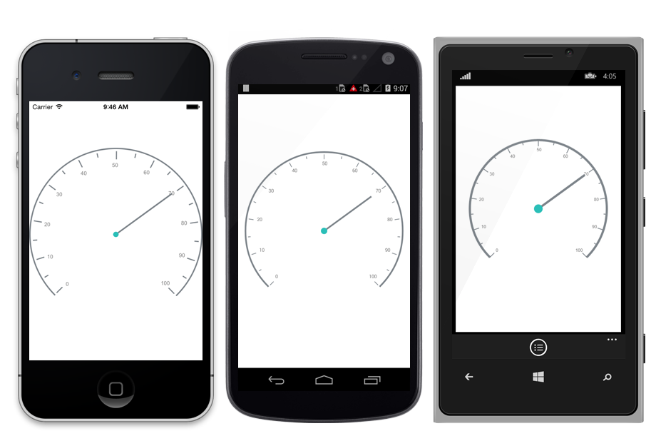

---

layout: post
title: Syncfusion SfCircularGauge control for Xamarin.Forms
description:  A quick tour to initial users on Syncfusion SfCircularGauge control for Xamarin.Forms Platform
platform: xamarin
control: SfCircularGauge
documentation: ug

---

# Getting Started

This section explains the steps required to configure the [`SfCircularGauge`](https://help.syncfusion.com/cr/cref_files/xamarin/Syncfusion.SfGauge.XForms~Syncfusion.SfGauge.XForms.SfCircularGauge.html), and also explains the steps required to add basic elements to [`SfCircularGauge`](https://help.syncfusion.com/cr/cref_files/xamarin/Syncfusion.SfGauge.XForms~Syncfusion.SfGauge.XForms.SfCircularGauge.html) through various APIs available within it.

## Adding circular gauge reference

Syncfusion Xamarin components are available in [nuget.org](https://www.nuget.org/). To add SfCircularGauge to your project, open the NuGet package manager in Visual Studio, and search for [Syncfusion.Xamarin.SfGauge](https://www.nuget.org/packages/Syncfusion.Xamarin.SfGauge), and then install it. 

To know more about obtaining our components, refer to these links: [Mac](https://help.syncfusion.com/xamarin/introduction/download-and-installation/mac) and [Windows](https://help.syncfusion.com/xamarin/introduction/download-and-installation/windows). Also, if you prefer to manually refer the assemblies instead of NuGet, refer to this [link](https://help.syncfusion.com/xamarin/introduction/control-dependencies#sfcirculargauge) to know about the dependent assemblies for circular gauge.

I> After adding the reference, an additional step is required for iOS and UWP projects. You should create an instance of the `SfGaugeRenderer` in iOS and UWP projects as shown in this [KB article.](https://www.syncfusion.com/kb/8271)

I> For UWP alone, one more additional step is required if the project is built-in release mode with .NET Native tool chain enabled. You can refer to this [KB article](https://www.syncfusion.com/kb/8272) for more details.

## Reference Mono.Android.Export

1. In the Solution Explorer in the Android project, right-click on References and choose Add Reference.

2. In the Add Reference window, select the Assemblies tab and choose the Framework.

3. In the Framework tab, ensure Mono.Android and Mono.Android.Export  is checked and click ok.

### Adding namespace for the assemblies




 
     xmlns:gauge="clr-namespace:Syncfusion.SfGauge.XForms;assembly=Syncfusion.SfGauge.XForms"





    using Syncfusion.SfGauge.XForms;





## Initialize gauge 

You can initialize the [`SfCircularGauge`](https://help.syncfusion.com/cr/cref_files/xamarin/Syncfusion.SfGauge.XForms~Syncfusion.SfGauge.XForms.SfCircularGauge.html) control with a required optimal name by using the included namespace.




 
     <gauge:SfCircularGauge/> 





    SfCircularGauge circularGauge = new SfCircularGauge ();
    this.Content = circularGauge;





## Adding header

You can assign a unique header to [`SfCircularGauge`](https://help.syncfusion.com/cr/cref_files/xamarin/Syncfusion.SfGauge.XForms~Syncfusion.SfGauge.XForms.SfCircularGauge.html) by using the [`Header`](https://help.syncfusion.com/cr/cref_files/xamarin/Syncfusion.SfGauge.XForms~Syncfusion.SfGauge.XForms.SfCircularGauge~Headers.html) property and position it by using the [`Position`](https://help.syncfusion.com/cr/cref_files/xamarin/Syncfusion.SfGauge.XForms~Syncfusion.SfGauge.XForms.Header~Position.html) property as you want.





    <gauge:SfCircularGauge>

         <gauge:SfCircularGauge.Headers>
             <gauge:Header Text="Speedometer" ForegroundColor="Black" TextSize="20" />
         </gauge:SfCircularGauge.Headers>
    
    </gauge:SfCircularGauge>
	




    SfCircularGauge circularGauge = new SfCircularGauge(); 
    Header header = new Header();
    header.Text = "Speedometer";
    header.ForegroundColor = Color.Black;
    header.TextSize = 20;
    circularGauge.Headers.Add(header);  
	




## Configuring scales

You can configure the [`Scale`](https://help.syncfusion.com/cr/cref_files/xamarin/Syncfusion.SfGauge.XForms~Syncfusion.SfGauge.XForms.Scale.html) elements by using following APIs, which are available in [`SfCircularGauge`](https://help.syncfusion.com/cr/cref_files/xamarin/Syncfusion.SfGauge.XForms~Syncfusion.SfGauge.XForms.SfCircularGauge.html):

* `StartAngle`
* `SweepAngle`
* `StartValue`
* `EndValue`
* `Interval`
* `RimThickness`
* `RimColor`





    <gauge:SfCircularGauge>
    
        <gauge:SfCircularGauge.Scales>
           <gauge:Scale />
        </gauge:SfCircularGauge.Scales>	
          
    </gauge:SfCircularGauge>
	




    ObservableCollection<Scale> scales = new ObservableCollection<Scale>();
    Scale scale = new Scale();
    scales.Add(scale);
    circularGauge.Scales = scales;  
	




## Adding ranges

You can add ranges to [`SfCircularGauge`](https://help.syncfusion.com/cr/cref_files/xamarin/Syncfusion.SfGauge.XForms~Syncfusion.SfGauge.XForms.SfCircularGauge.html) by creating ranges collection using the [`Range`](https://help.syncfusion.com/cr/cref_files/xamarin/Syncfusion.SfGauge.XForms~Syncfusion.SfGauge.XForms.Range.html) property.



  
          
    <gauge:SfCircularGauge>
     <gauge:SfCircularGauge.Scales>
      <gauge:Scale>
         <gauge:Scale.Ranges>
             <gauge:Range StartValue="0" EndValue="40"/>
         </gauge:Scale.Ranges>
          </gauge:Scale>
     </gauge:SfCircularGauge.Scales>
     
    </gauge:SfCircularGauge>
	




    ObservableCollection<Scale> scales = new ObservableCollection<Scale>();
    Scale scale = new Scale();
    Range range = new Range();
    range.StartValue = 0;
    range.EndValue = 40;
    scale.Ranges.Add(range);
    scales.Add(scale);
    circularGauge.Scales = scales;  
	




## Adding a needle pointer

Create a [`Needle Pointer`](https://help.syncfusion.com/cr/cref_files/xamarin/Syncfusion.SfGauge.XForms~Syncfusion.SfGauge.XForms.NeedlePointer.html), and associate it with a scale that is to be displayed the current value.





    <gauge:SfCircularGauge>
     <gauge:SfCircularGauge.Scales>
      <gauge:Scale>
        <gauge:Scale.Pointers>      
            <gauge:NeedlePointer  Value="60" />  
        </gauge:Scale.Pointers> 
      </gauge:Scale>
    </gauge:SfCircularGauge.Scales>
    </gauge:SfCircularGauge>
	




    ObservableCollection<Scale> scales = new ObservableCollection<Scale>();
    Scale scale = new Scale();
    NeedlePointer needlePointer = new NeedlePointer();
    needlePointer.Value = 60;
    scale.Pointers.Add(needlePointer);
    scales.Add(scale);
    circularGauge.Scales = scales;  
	




## Adding a range pointer

[`Range Pointer`](https://help.syncfusion.com/cr/cref_files/xamarin/Syncfusion.SfGauge.XForms~Syncfusion.SfGauge.XForms.RangePointer.html) provides an alternative way to indicate the current value.



 

    <gauge:SfCircularGauge>
    <gauge:SfCircularGauge.Scales>
      <gauge:Scale>
         <gauge:Scale.Pointers>
             <gauge:RangePointer Value="60" />
         </gauge:Scale.Pointers>
      </gauge:Scale>
      </gauge:SfCircularGauge.Scales>
     </gauge:SfCircularGauge>
	 


    

    ObservableCollection<Scale> scales = new ObservableCollection<Scale>();
    Scale scale = new Scale();
    RangePointer rangePointer = new RangePointer();
    rangePointer.Value = 60;
    scale.Pointers.Add(rangePointer);
    scales.Add(scale);
    circularGauge.Scales = scales;
	

       


## Adding a marker pointer

[`Marker Pointer`](https://help.syncfusion.com/cr/cref_files/xamarin/Syncfusion.SfGauge.XForms~Syncfusion.SfGauge.XForms.MarkerPointer.html) points the current value in scale.



 

    <gauge:SfCircularGauge>
      <gauge:SfCircularGauge.Scales>
       <gauge:Scale>
         <gauge:Scale.Pointers>
             <gauge:MarkerPointer Value="70" />
         </gauge:Scale.Pointers>
	   </gauge:Scale>
      </gauge:SfCircularGauge.Scales>
     </gauge:SfCircularGauge>
	 


  
   
    ObservableCollection<Scale> scales = new ObservableCollection<Scale>();
    Scale scale=new Scale();
    MarkerPointer markerPointer = new MarkerPointer();
    markerPointer.Value = 70;
    scale.Pointers.Add(markerPointer);
    scales.Add(scale);
	circularGauge.Scales = scales;
	

       


The following code example gives you the complete code of above configurations.



 

    <?xml version="1.0" encoding="utf-8" ?>
    <ContentPage xmlns="http://xamarin.com/schemas/2014/forms"
             xmlns:x="http://schemas.microsoft.com/winfx/2009/xaml"
             xmlns:gauge="clr-namespace:Syncfusion.SfGauge.XForms;assembly=Syncfusion.SfGauge.XForms"      
             xmlns:local="clr-namespace:CircularGauge;assembly=CircularGauge"
             x:Class="CircularGauge.UGSample">

        <gauge:SfCircularGauge VerticalOptions="FillAndExpand" HorizontalOptions="FillAndExpand" Margin="10">

            <gauge:SfCircularGauge.Headers>
                <gauge:Header Text="Speedometer" ForegroundColor="Black" TextSize="20" />
            </gauge:SfCircularGauge.Headers>
            
            <gauge:SfCircularGauge.Scales>
                
                  <gauge:Scale>
                    
                    <gauge:Scale.Ranges>
                        <gauge:Range StartValue="0" EndValue="40"/>
                    </gauge:Scale.Ranges>
                    
                    <gauge:Scale.Pointers>
                        <gauge:NeedlePointer  Value="60" />
                        <gauge:RangePointer Value="60" />
                        <gauge:MarkerPointer Value="70" />
                    </gauge:Scale.Pointers>
                    
                   </gauge:Scale>
                
                  </gauge:SfCircularGauge.Scales>

              </gauge:SfCircularGauge>

     </ContentPage>
	 


  
   
using Syncfusion.SfGauge.XForms;

namespace CircularGauge
{
    public partial class UGSample : ContentPage
    {

        public UGSample()
        {
            InitializeComponent();

            //Initializing circular gauge 
            SfCircularGauge circularGauge = new SfCircularGauge();
            circularGauge.Margin = 10;
            
            //Adding header 
            Header header = new Header();
            header.Text = "Speedometer";
            header.ForegroundColor = Color.Black;
            header.TextSize = 20;
            circularGauge.Headers.Add(header);

             //Initializing scales for circular gauge
            ObservableCollection<Scale> scales = new ObservableCollection<Scale>();
            Scale scale = new Scale();
            scales.Add(scale);

             //Adding range
            Range range = new Range();
            range.StartValue = 0;
            range.EndValue = 40;
            scale.Ranges.Add(range);

           //Adding needle pointer
            NeedlePointer needlePointer = new NeedlePointer();
            needlePointer.Value = 60;
            scale.Pointers.Add(needlePointer);

           //Adding range pointer
            RangePointer rangePointer = new RangePointer();
            rangePointer.Value = 60;
            scale.Pointers.Add(rangePointer);
            
             //Adding marker pointer
            MarkerPointer markerPointer = new MarkerPointer();
            markerPointer.Value = 70;
            scale.Pointers.Add(markerPointer);
           

            scales.Add(scale);
            circularGauge.Scales = scales;

            this.Content = circularGauge;
        }
    }
}
	

       


The following circular gauge is created as a result of the above codes.
 

You can find the complete getting started sample from this [`link`](http://www.syncfusion.com/downloads/support/directtrac/general/ze/Gauge-GettingStarted-768663630).