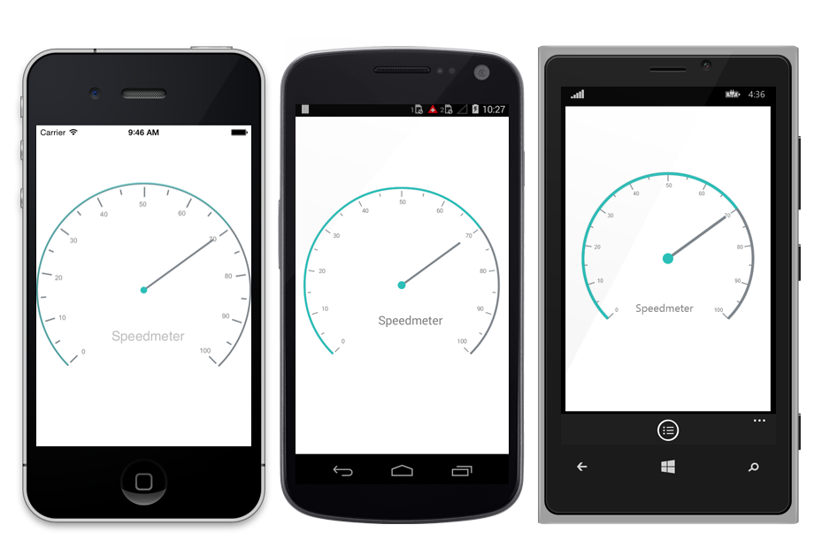

---

layout: post
title: Overview of Syncfusion SfCircularGauge control for Xamarin.Forms
description: Overview of SfCircularGauge control
platform: xamarin
control: SfCircularGauge
documentation: ug

---

# Overview

Essential Gauge for Xamarin.Forms lets you visualize the numeric values over a circular scale. The appearance of the gauge is fully customized to integrate your applications without fault.

## Key features

A [`SfCircularGauge`](https://help.syncfusion.com/cr/cref_files/xamarin/sfgauge/Syncfusion.SfGauge.XForms~Syncfusion.SfGauge.XForms.SfCircularGauge.html) is composed of a Scales. It will be an integrated UI part of the SfCircularGauge.

[`SfCircularGauge`](https://help.syncfusion.com/cr/cref_files/xamarin/sfgauge/Syncfusion.SfGauge.XForms~Syncfusion.SfGauge.XForms.SfCircularGauge.html) is a composite UI element with following subparts:

1. Scales
2. Ranges
3. Pointers
4. Headers
5. Annotations

The Circular Gauge control is highly customizable control with a variety of simple APIs to modify the basic look and feel of the [`SfCircularGauge`](https://help.syncfusion.com/cr/cref_files/xamarin/sfgauge/Syncfusion.SfGauge.XForms~Syncfusion.SfGauge.XForms.SfCircularGauge.html). You can position the ranges, ticks, labels, and range pointers as needed.

* **Scales** - The circular gauge scale contains labels, tick marks, and a rim to specify the basic look and feel of the circular gauge. It defines the start angle, sweep direction, sweep angle, overall minimum and maximum values, the frequency of labels, and tick marks.
* **Ranges** - A range is a visual element, which depicts the start and end values of inner divisions within the scale’s range. Each scale is capable of displaying one or more ranges, and each range can depict different zones or regions of same metrics, such as high, low, and average temperatures.
* **Pointers** - A pointer is an element that points out a value of the bound property on a scale. A circular scale will have one or more pointers that can be used to measure different values. Each pointer has a value property, which informs the user of the current value visually.
* **Headers** - The Header can be used to set a unique header for the circular gauge. The user can add text as the header in a circular gauge.
* **Annotations** - Annotation allows you to mark the specific area of interest in circular gauge. Custom view can be placed, and text and images also can be added by using Annotations.

