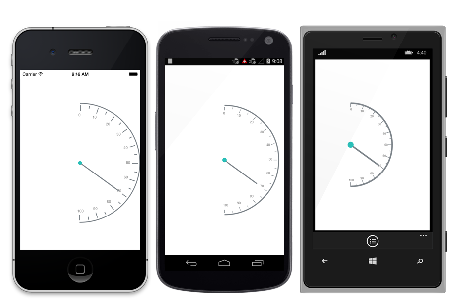

---
layout: post
title: Accessing Gauge Types in Syncfusion SfCircularGauge control for Xamarin.Forms Platform
description: Learn how to set types in SfCircularGauge control
platform: Xamarin.Forms
control: SfCircularGauge
documentation: ug
---

# GAUGE TYPE

SfCircularGauge type is determined by positioning the control towards particular direction. GaugeType is an enum property that provides the option to select type of the SfCircularGauge type, which contains following options.

* Default,
* East,
* West,
* North,
* South,
* NorthEast,
* NorthWest,
* SouthEast,
* SouthWest

<table>
<tr>
<td>
SfCircularGauge circulargauge = new SfCircularGauge();



    SfCircularGauge circulargauge = new SfCircularGauge();
    Circulargauge.GaugeType=GaugeType.East;
    this.content=circulargauge;



