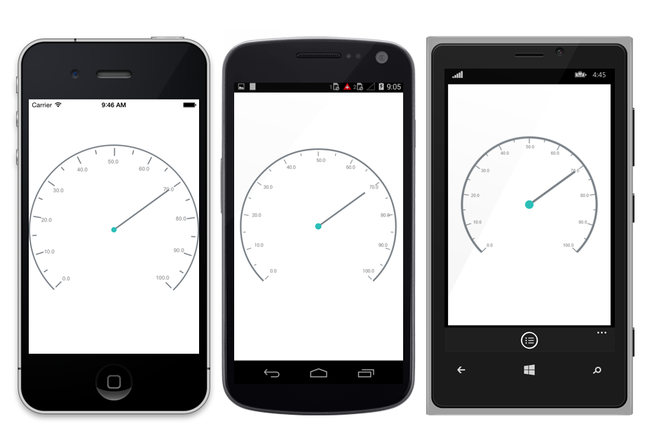
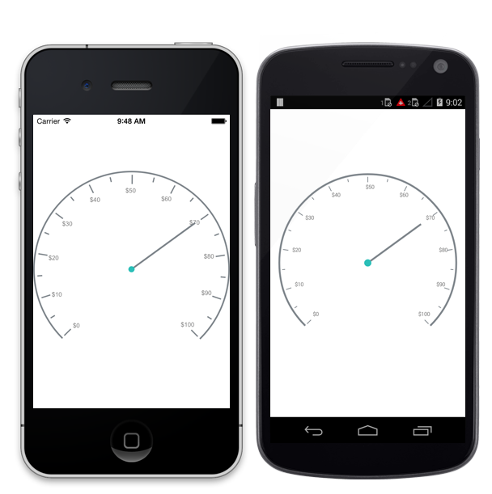

---

layout: post
title: Labels in Syncfusion SfCircularGauge control for Xamarin.Forms
description:  Learn how to set labels in Syncfusion SfCircularGauge control
platform: Xamarin.Forms
control: SfCircularGauge
documentation: ug

---

# LABELS

Scale labels associate a numeric value with major scale tick marks.

## Label Customization

The label color can be changed using the `LabelColor` property. The labels can be positioned far away from the ticks by using the `LabelOffset` property.The size of the Labels can be changed by using the `LabelFontSize` property.



    SfCircularGauge circulargauge = new SfCircularGauge();
    Scale scale=new Scale();
    scale.LabelColor = Color.Gray;
    scale.LabelOffset = 0.1;
    scale.LabelFontSize=10;
    circulargauge.Scales = scale;
    this.content=circulargauge;
    


## Number of Decimal Digits

The `NumberOfDecimalDigits` property is used to set the number of decimal digits to be displayed in the scale labels.



    SfCircularGauge circulargauge = new SfCircularGauge();
    Scale scale=new Scale();
    Scale.NumberOfDecimalDigits=1;
    circulargauge.Scales = scale;
    this.content=circulargauge;
    


## Label Postfix and Prefix

You can set the postfix/Prefix values to the scale labels using `LabelPostfix` and `LabelPrefix` Properties respectively.

### LabelPostfix

This property allows you to set the postfix values to the scale labels.



    SfCircularGauge circulargauge = new SfCircularGauge();
    Scale scale=new Scale();
    Scale.LabelPostfix=”%”;
    circulargauge.Scales = scale;
    this.content=circulargauge;
    


### LabelPrefix
This property allows you to set the postfix values to the scale labels.



    SfCircularGauge circulargauge = new SfCircularGauge();
    Scale scale=new Scale();
    Scale.LabelPrefix=”$”;
    circulargauge.Scales = scale;
    this.content=circulargauge;
    


