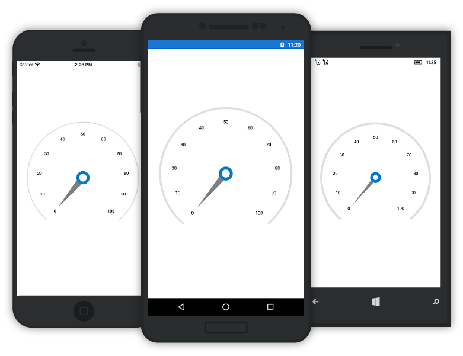
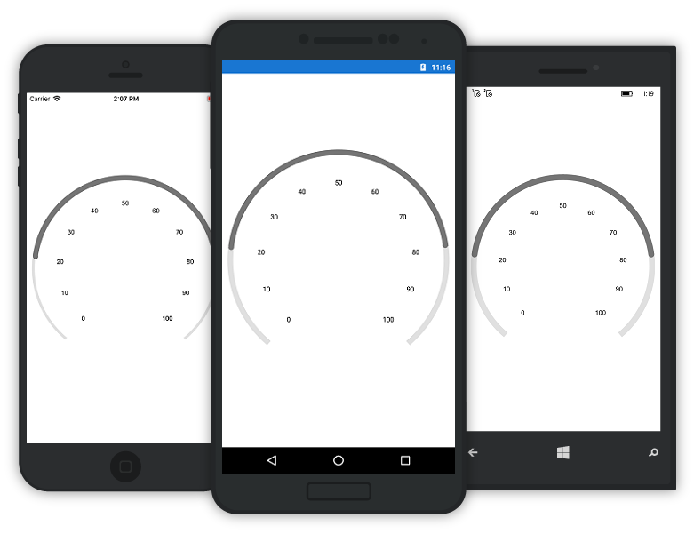
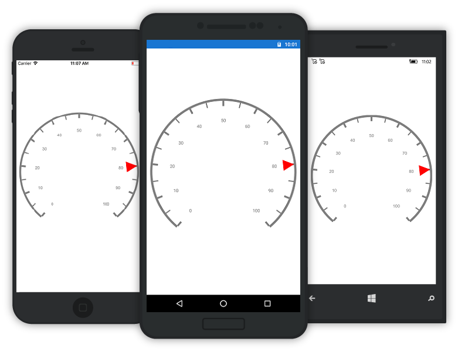
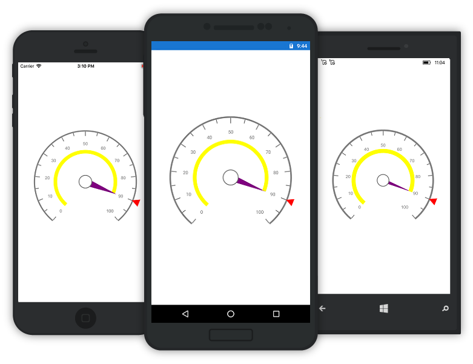

---

layout: post
title: Pointers in Syncfusion SfCircularGauge control for Xamarin.Forms
description: Learn how to set pointers in Syncfusion SfCircularGauge control 
platform: xamarin
control: SfCircularGauge
documentation: ug

---

# POINTERS

You can add multiple pointers to the gauge to point at multiple values on the same scale. This can be useful for showing a low and a high value at the same time. The value of the pointer is set using the Value property. There are two types of pointers. You can choose a pointer using the `PointerType` property. 

## Needle Pointer

A needle pointer contains two parts, the needle and the knob that can be placed on a gauge to mark values. The needle length is controlled by the `LengthFactor` property. The LengthFactor property’s minimum and maximum bounds are 0 and 1. The needle’s UI is customized by the `Color` and `Thickness` properties. The user can modify the Knob’s size by changing the `KnobRadius` property.

### NeedlePointerType

`NeedlePointer` appearance can be customized by using the Type property the default value of this property is `Bar`.





    <gauge:SfCircularGauge.Scales>
      <gauge:Scale>
        <gauge:Scale.Pointers>       
          <gauge:NeedlePointer Value="60" KnobRadius="20" Color="Gray" 
                 Thickness="5" KnobColor="#2bbfb8"  LengthFactor="0.8"/>         
         </gauge:Scale.Pointers>
        </gauge:Scale>
      </gauge:SfCircularGauge.Scales>





    SfCircularGauge circular = new SfCircularGauge();
    ObservableCollection<Scale> scales = new ObservableCollection<Scale>();
    Scale scale=new Scale();
    List<Pointer> pointers = new List<Pointer>();
    NeedlePointer needlePointer = new NeedlePointer();
    needlePointer.Value = 60;
    needlePointer.Color = Color.Gray;
    needlePointer.KnobRadius = 10;
    needlePointer.KnobColor = Color.FromHex("#2bbfb8");
    needlePointer.Thickness = 5;
    needlePointer.LengthFactor = 0.8;
    needlePointer.Type = PointerType.Bar;
    pointers.Add(needlePointer);
    scale.Pointers = pointers;
    circularGauge.Scales = scales;
    this.Content=circular;





### Knob Customization

Knob of `NeedlePointer` can be customized by using `KnobColor`, `KnobRadius`, `KnobRadiusFactor`, `KnobStrokeColor`, and `KnobStrokeWidth` properties. You can set the radius of knob as pixel value by using `KnobRadius` property, and as percentage value by using `KnobRadiusFactor` property.





    <gauge:SfCircularGauge.Scales>
      <gauge:Scale>
        <gauge:Scale.Pointers>       
          <gauge:NeedlePointer Value="90" KnobColor="White" KnobRadius="15" KnobStrokeColor="#007DD1" KnobStrokeWidth="8" />         
         </gauge:Scale.Pointers>
        </gauge:Scale>
      </gauge:SfCircularGauge.Scales>





    SfCircularGauge circular = new SfCircularGauge();
    ObservableCollection<Scale> scales = new ObservableCollection<Scale>();
    Scale scale=new Scale();
    List<Pointer> pointers = new List<Pointer>();
    NeedlePointer needlePointer = new NeedlePointer();
    needlePointer.Value = 60;
    needlePointer.Color = Color.Gray;
    needlePointer.KnobRadius = 15;
    needlePointer.KnobStrokeColor  = Color.FromHex("#007DD1");
    needlePointer.KnobStrokeWidth  = 8;
    pointers.Add(needlePointer);
    scale.Pointers = pointers;
    circularGauge.Scales = scales;
    this.Content=circular;





### Tail Support

Tail of `NeedlePointer` can be customized by using `TailColor`, `TailLengthFactor`, `TailStrokeColor`, and `TailStrokeWidth` properties.





    <gauge:SfCircularGauge.Scales>
      <gauge:Scale>
        <gauge:Scale.Pointers>       
          <gauge:NeedlePointer Value="90" TailColor="#757575" TailLengthFactor="0.2" TailStrokeWidth="1" TailStrokeColor="#757575" />         
         </gauge:Scale.Pointers>
        </gauge:Scale>
      </gauge:SfCircularGauge.Scales>





    SfCircularGauge circular = new SfCircularGauge();
    ObservableCollection<Scale> scales = new ObservableCollection<Scale>();
    Scale scale=new Scale();
    List<Pointer> pointers = new List<Pointer>();
    NeedlePointer needlePointer = new NeedlePointer();
    needlePointer.Value = 60;
    needlePointer.TailColor = Color.FromHex("#757575");
    needlePointer.TailLengthFactor = 0.2;
    needlePointer.TailStrokeWidth = 1;
    needlePointer.TailStrokeColor = Color.FromHex("#757575");
    pointers.Add(needlePointer);
    scale.Pointers = pointers;
    circularGauge.Scales = scales;
    this.Content=circular;





## Range Pointer

A range pointer is an accenting line or shaded background range that can be placed on a gauge to mark values. The range pointer’s UI is customized by the `Color` and `Thickness` properties.

### RangePointerPosition

The `RangePointer` in the scale can be placed inside the scale or outside the scale by setting `Offset` property.




    
    <gauge:SfCircularGauge.Scales>
      <gauge:Scale>
        <gauge:Scale.Pointers> 
         <gauge:RangePointer  Value="60"  Color="#2bbfb8"  Thickness="20"/>
        </gauge:Scale.Pointers>
     </gauge:Scale>
    </gauge:SfCircularGauge.Scales>

 



    SfCircularGauge circular = new SfCircularGauge();
    ObservableCollection<Scale> scales = new ObservableCollection<Scale>();
    Scale scale=new Scale();
    List<Pointer> pointers = new List<Pointer>();
    RangePointer rangePointer = new RangePointer();
    rangePointer.Value = 70;
    rangePointer.Color = Color.FromHex("#2bbfb8");
    rangePointer.Thickness = 10;
    rangePointer.Offset=0.3F;
    pointers.Add(rangePointer);
    scale.Pointers = pointers;
    circular.Scales = scales;
    this.Content=circularGauge;





### Range Cap

`RangeCap` is an enum property that provides the position options for range cap of the `RangePointer`, which contains Start, End, Both, and None options.




    
    <gauge:SfCircularGauge.Scales>
      <gauge:Scale>
        <gauge:Scale.Pointers> 
         <gauge:RangePointer Value="80" RangeCap="Both"/>
        </gauge:Scale.Pointers>
     </gauge:Scale>
    </gauge:SfCircularGauge.Scales>

 



    SfCircularGauge circular = new SfCircularGauge();
    ObservableCollection<Scale> scales = new ObservableCollection<Scale>();
    Scale scale=new Scale();
    List<Pointer> pointers = new List<Pointer>();
    RangePointer rangePointer = new RangePointer();
    rangePointer.Value = 70;
    RangeCap = RangeCap.Both;
    pointers.Add(rangePointer);
    scale.Pointers = pointers;
    circular.Scales = scales;
    this.Content=circularGauge;





## Marker Pointer

Different types of marker shape can be used to mark the pointer value in scale. You can change the marker shape by using `MarkerShape` property in pointer. Gauge supports the following types of  marker shape:-

* Circle
* Rectangle
* Triangle
* InvertedTriangle
* Diamond
* Image

The image can be used instead of rendering marker shape to denote the pointer value. It can be achieved by setting `MarkerShape` to Image, and assigning image path to `ImageSource` in pointer.




    
    <gauge:SfCircularGauge.Scales>
      <gauge:Scale>
       <gauge:Scale.Pointers> 
	    <gauge:MarkerPointer Value="80" MarkerShape="Triangle" Color="Green" />
      </gauge:Scale.Pointers>
     </gauge:Scale>
    </gauge:SfCircularGauge.Scales>

 



    SfCircularGauge circular = new SfCircularGauge();
    ObservableCollection<Scale> scales = new ObservableCollection<Scale>();
    Scale scale=new Scale();
    List<Pointer> pointers = new List<Pointer>();
    MarkerPointer markerPointer = new MarkerPointer();
    markerPointer.Value = 70;
    markerPointer.Color = Color.Green;
    markerPointer.MarkerShape = MarkerShape.Triangle;
    pointers.Add(markerPointer);
    scale.Pointers = pointers;
    circular.Scales = scales;
    this.Content=circularGauge;





### Marker Pointer Customization

The marker can be customized in terms of color, width, and height by using `Color`, `MarkerWidth`, and `MarkerHeight` property in pointer.




    
    <gauge:SfCircularGauge.Scales>
      <gauge:Scale>
       <gauge:Scale.Pointers> 
	    <gauge:MarkerPointer Value="80" MarkerShape="Triangle" MarkerHeight="30" MarkerWidth="30"/>
      </gauge:Scale.Pointers>
     </gauge:Scale>
    </gauge:SfCircularGauge.Scales>

 



    SfCircularGauge circular = new SfCircularGauge();
    ObservableCollection<Scale> scales = new ObservableCollection<Scale>();
    Scale scale=new Scale();
    List<Pointer> pointers = new List<Pointer>();
    MarkerPointer markerPointer = new MarkerPointer();
    markerPointer.Value = 70;
    markerPointer.Color = Color.Red;
    markerPointer.MarkerShape = MarkerShape.Triangle;
	MarkerHeight = 30,
    MarkerWidth = 30
    pointers.Add(markerPointer);
    scale.Pointers = pointers;
    circular.Scales = scales;
    this.Content=circularGauge;





### Multiple Pointers

In addition to the default pointer, you can add n number of pointers to a scale by using `Pointers` property.




    
    <gauge:SfCircularGauge.Scales>
      <gauge:Scale>
       <gauge:Scale.Pointers> 
	    <gauge:MarkerPointer Value="90" MarkerShape="InvertedTriangle" Color="Red" Offset="0.79" />
		<gauge:NeedlePointer Value="90"  Color="Purple" LengthFactor="0.5" KnobColor="White" KnobStrokeColor="#757575" KnobStrokeWidth="2" Thickness ="10" Type="Triangle"/>
	    <gauge:RangePointer Value="90" Color="Yellow" Offset="0.5" Thickness ="10"/>
      </gauge:Scale.Pointers>
     </gauge:Scale>
    </gauge:SfCircularGauge.Scales>

 



    SfCircularGauge circular = new SfCircularGauge();
    ObservableCollection<Scale> scales = new ObservableCollection<Scale>();
    Scale scale=new Scale();
    List<Pointer> pointers = new List<Pointer>();
    MarkerPointer markerPointer = new MarkerPointer();
    markerPointer.Value = 90;
    markerPointer.Color = Color.Red;
    markerPointer.MarkerShape = MarkerShape.InvertedTriangle;
	offset = 0.79;
    NeedlePointer needlePointer = new NeedlePointer();
	needlePointer.Value = 80;
	needlePointer.Color = Color.Purple;
	needlePointer.LengthFactor = 0.5;
	needlePointer.KnobColor = Color.White;
	needlePointer.KnobStrokeColor = Color.FromHex("#757575");
	needlePointer.KnobStrokeWidth = 2;
	needlePointer.Thickness = 10;
	needlePointer.Type = PointerType.Triangle;
	RangePointer rangePointer = new RangePointer();
	rangePointer.Value = 80;
	rangePointer.Color = Color.Yellow;
	rangePointer.Offset = 0.5;
	rangePointer.Thickness = 10;
    pointers.Add(markerPointer);
    scale.Pointers = pointers;
    circular.Scales = scales;
    this.Content=circularGauge;





### Pointer Animation

 EnableAnimation property is a Boolean property that enables or disables the animation of the pointers in circularGauge.





   <gauge:SfCircularGauge.Scales>
      <gauge:Scale>
        <gauge:Scale.Pointers> 
         <gauge:NeedlePointer  Value="60"  Color="#2bbfb8"  Thickness="20" EnableAnimation = "true" />
        </gauge:Scale.Pointers>
     </gauge:Scale>
    </gauge:SfCircularGauge.Scales>





    NeedlePointer needlePointer = new NeedlePointer();
    needlePointer.EnableAnimation = true;
    pointers.Add(needlePointer);





### Pointer Drag

Pointers can be dragged over the scale value. This can be achieved by clicking and dragging the pointer. To enable or disable the pointer drag, use `EnableDragging` property.





   <gauge:SfCircularGauge.Scales>
      <gauge:Scale>
        <gauge:Scale.Pointers> 
         <gauge:NeedlePointer  Value="60"  " Color="#757575" KnobColor="#757575" Type="Triangle" EnableDragging = "true" />
        </gauge:Scale.Pointers>
     </gauge:Scale>
    </gauge:SfCircularGauge.Scales>





    NeedlePointer needlePointer = new NeedlePointer();
	needlePointer.Value = 90;
	needlePointer.Color = Color.FromHex("#757575");
	needlePointer.KnobColor = Color.FromHex("#757575");
	needlePointer.Type = PointerType.Triangle;
    needlePointer.EnableDragging = true;
    pointers.Add(needlePointer);



