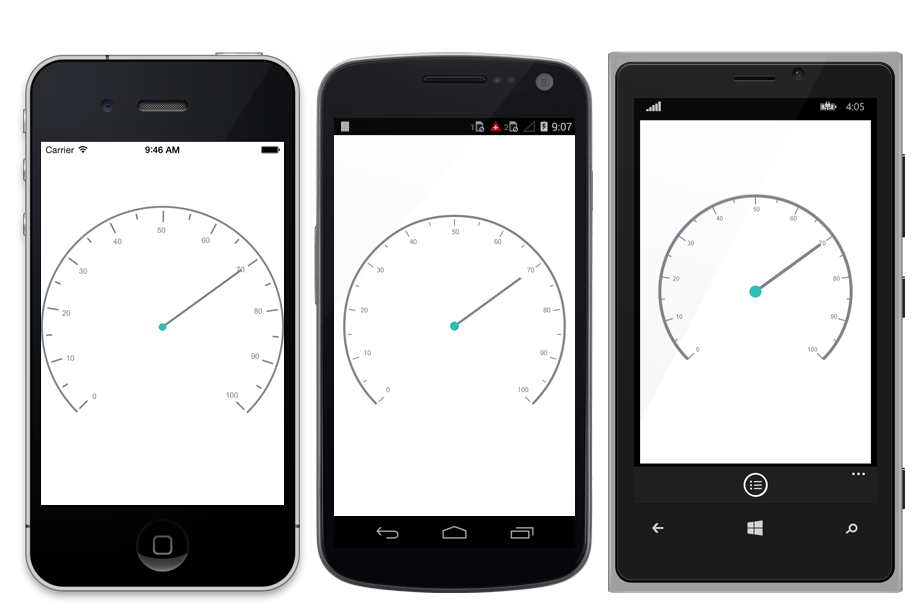
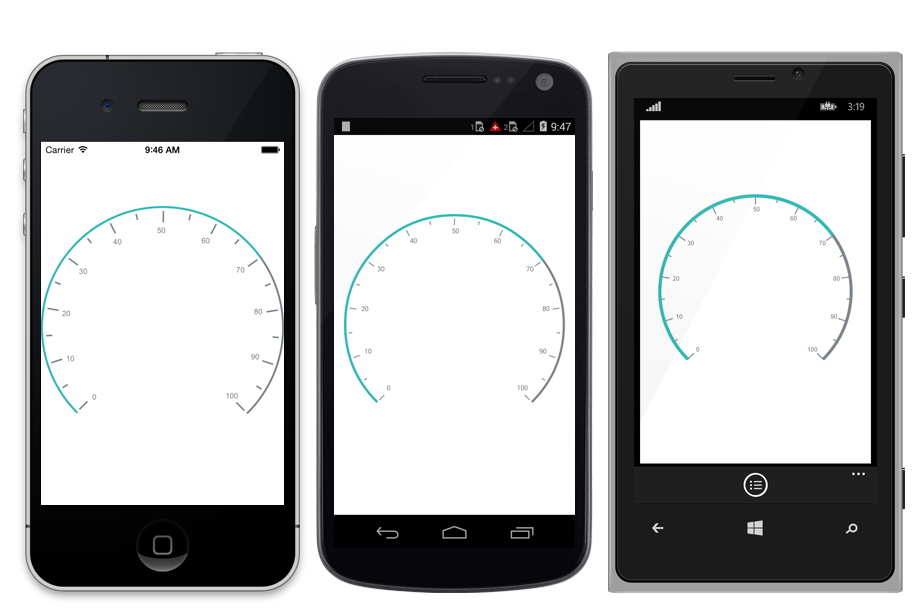

---

layout: post
title: Pointers in Syncfusion SfCircularGauge control for Xamarin.Forms
description: Learn how to set pointers in Syncfusion SfCircularGauge control 
platform: xamarin
control: SfCircularGauge
documentation: ug

---

# POINTERS

You can add multiple pointers to the gauge to point at multiple values on the same scale. This can be useful for showing a low and a high value at the same time. The value of the pointer is set using the Value property. There are two types of pointers. You can choose a pointer using the `PointerType` property. 

## Needle Pointer

A needle pointer contains two parts, the needle and the knob that can be placed on a gauge to mark values. The needle length is controlled by the `LengthFactor` property. The LengthFactor property’s minimum and maximum bounds are 0 and 1. The needle’s UI is customized by the `Color` and `Thickness` properties. The user can modify the Knob’s size by changing the `KnobRadius` property.

### NeedlePointerType

`NeedlePointer` appearance can be customized by using the Type property the default value of this property is `Bar`.

% tabs %}



    <gauge:SfCircularGauge.Scales>
      <gauge:Scale>
        <gauge:Scale.Pointers>       
          <gauge:NeedlePointer Value="60" KnobRadius="20" Color="Gray" 
                 Thickness="5" KnobColor="#2bbfb8"  LengthFactor="0.8"/>         
         </gauge:Scale.Pointers>
        </gauge:Scale>
      </gauge:SfCircularGauge.Scales>





    SfCircularGauge circulargauge = new SfCircularGauge();
    ObservableCollection<Scale> scales = new ObservableCollection<Scale>();
    Scale scale=new Scale();
    List<Pointer> pointers = new List<Pointer>();
    NeedlePointer needlePointer = new NeedlePointer();
    needlePointer.Value = 60;
    needlePointer.Color = Color.Gray;
    needlePointer.KnobRadius = 10;
    needlePointer.KnobColor = Color.FromHex("#2bbfb8");
    needlePointer.Thickness = 5;
    needlePointer.LengthFactor = 0.8;
    needlePointer.Type = PointerType.Bar;
    pointers.Add(needlePointer);
    scale.Pointers = pointers;
    circularGauge.Scales = scales;
    this.Content=circularGauge;





## Range Pointer

A range pointer is an accenting line or shaded background range that can be placed on a gauge to mark values. The range pointer’s UI is customized by the `Color` and `Thickness` properties.

### RangePointerPosition

The `RangePointer` in the scale can be placed inside the scale or outside the scale by setting `Offset` property.




    
    <gauge:SfCircularGauge.Scales>
      <gauge:Scale>
        <gauge:Scale.Pointers> 
         <gauge:RangePointer  Value="60"  Color="#2bbfb8"  Thickness="20"/>
        </gauge:Scale.Pointers>
     </gauge:Scale>
    </gauge:SfCircularGauge.Scales>

 



    SfCircularGauge circulargauge = new SfCircularGauge();
    ObservableCollection<Scale> scales = new ObservableCollection<Scale>();
    Scale scale=new Scale();
    List<Pointer> pointers = new List<Pointer>();
    RangePointer rangePointer = new RangePointer();
    rangePointer.Value = 70;
    rangePointer.Color = Color.FromHex("#2bbfb8");
    rangePointer.Thickness = 10;
    rangePointer.Offset=0.3F;
    pointers.Add(rangePointer);
    scale.Pointers = pointers;
    circularGauge.Scales = scales;
    this.Content=circularGauge;





### Pointer Animation

 EnableAnimation property is a Boolean property that enables or disables the animation of the pointers in circularGauge.





   <gauge:SfCircularGauge.Scales>
      <gauge:Scale>
        <gauge:Scale.Pointers> 
         <gauge:RangePointer  Value="60"  Color="#2bbfb8"  Thickness="20" EnableAnimation = "true" />
        </gauge:Scale.Pointers>
     </gauge:Scale>
    </gauge:SfCircularGauge.Scales>
</linear:LinearScale>





    RangePointer rangePointer = new RangePointer();
    rangePointer.EnableAnimation = true;
    pointers.Add(rangePointer);





