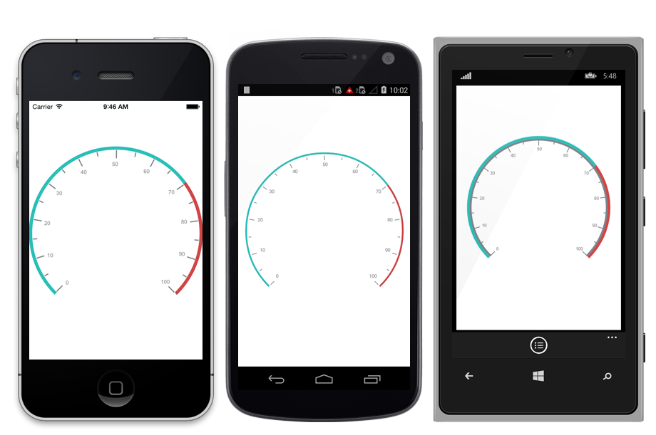
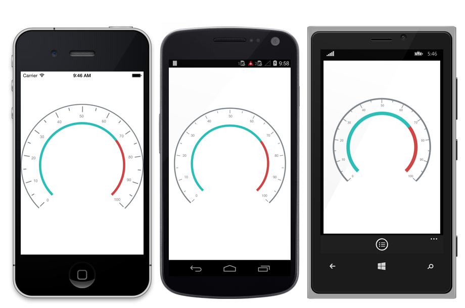

---

layout: post
title: Ranges in Syncfusion SfCircularGauge control for Xamarin.Forms
description: Learn how to set ranges in Syncfusion SfCircularGauge control
platform: xamarin
control: SfCircularGauge
documentation: ug

---

# RANGES

A range is a visual element which begins and ends at specified values within a scale.

## Ranges Customization

`Ranges` start and end values are set by the `StartValue` and `EndValue` properties of the range. A range’s UI is customized by the `Color` and `Thickness` properties.



    SfCircularGauge circulargauge = new SfCircularGauge();
    Scale scale=new Scale();
    Range range1 = new Range();
    range1.StartValue = 0; 
    range1.EndValue = 70;
    range1.Color = Color.FromHex("#d14646");
    range1.Thickness = 10;
    scale.Ranges.Add(range1);
    Range range2 = new Range();
    range2.StartValue = 70;
    range2.EndValue = 100;
    range2.Color = Color.FromHex("#444444");
    range2.Thickness = 10;
    scale.Ranges.Add(range2);
    circularGauge.Scales = scale;
    this.Content = circulargauge;
    


## Range Offset

The range can be placed inside the scale, outside the scale, or on the scale by setting `Offset` property.



    SfCircularGauge circulargauge = new SfCircularGauge();
    Scale scale=new Scale();
    Range range1 = new Range();
    range1.StartValue = 0;
    range1.EndValue = 60; 
    range1.Color = Color.FromHex ("#d14646");
    range1.Thickness = 10;
    range1.Offset=0.3;
    scale.Ranges.Add(range1);
    Range range2 = new Range(); 
    range2.StartValue = 60;
    range2.EndValue = 100;
    range2.Color = Color.FromHex("#444444");
    range2.Thickness = 10;
    range2.Offset=0.3;
    scale.Ranges.Add(range2);
    circularGauge.Scales = scale; 
    this.Content= circulargauge;
    


