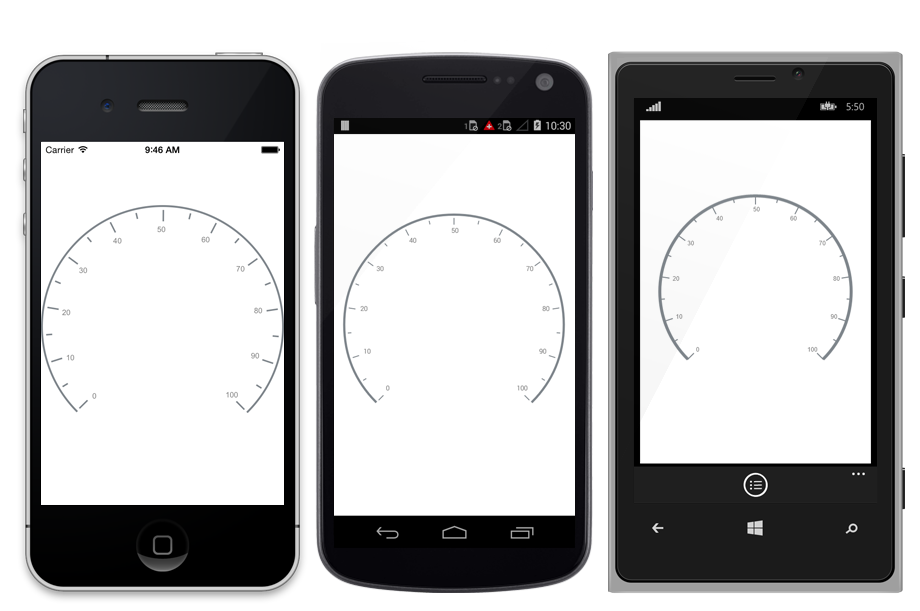

---

layout: post
title: Rim in Syncfusion SfCircularGauge control for Xamarin.Forms
description: Learn how to access rim in Syncfusion SfCircularGauge control for Xamarin.Forms Platform
platform: xamarin
control: SfCircularGauge
documentation: ug

---

# Rim

Scale determines the structure of a circular gauge by using the circular rim. By setting the [`StartAngle`](https://help.syncfusion.com/cr/cref_files/xamarin/sfgauge/Syncfusion.SfGauge.XForms~Syncfusion.SfGauge.XForms.Scale~StartAngle.html) and [`SweepAngle`](https://help.syncfusion.com/cr/cref_files/xamarin/sfgauge/Syncfusion.SfGauge.XForms~Syncfusion.SfGauge.XForms.Scale~SweepAngle.html) properties, you can change the shape of the circular gauge into a full circular gauge, half circular gauge, or quarter circular gauge.

The [`StartValue`](https://help.syncfusion.com/cr/cref_files/xamarin/sfgauge/Syncfusion.SfGauge.XForms~Syncfusion.SfGauge.XForms.Scale~StartValue.html) and [`EndValue`](https://help.syncfusion.com/cr/cref_files/xamarin/sfgauge/Syncfusion.SfGauge.XForms~Syncfusion.SfGauge.XForms.Scale~EndValue.html) properties will determine the overall range of the circular rim.





     <gauge:SfCircularGauge>
    
        <gauge:SfCircularGauge.Scales>
             <gauge:Scale StartAngle="270" SweepAngle="360" StartValue="0" EndValue="360" Interval="20" MinorTicksPerInterval="0" ShowFirstLabel="False"/>
         </gauge:SfCircularGauge.Scales>	
   
     </gauge:SfCircularGauge>





    SfCircularGauge circularGauge = new SfCircularGauge();
    ObservableCollection<Scale> scales = new ObservableCollection<Scale>();
    Scale scale = new Scale();
    scale.StartAngle = 270;
    scale.SweepAngle = 360;
    scale.StartValue = 0;
    scale.EndValue = 360;
    scale.Interval = 20;
    scale.MinorTicksPerInterval = 0;
    scale.ShowFirstLabel = false;
    scales.Add(scale);
    circularGauge.Scales = scales;  





## Rim customization

The color and thickness of rim can be set by using the [`RimColor`](https://help.syncfusion.com/cr/cref_files/xamarin/sfgauge/Syncfusion.SfGauge.XForms~Syncfusion.SfGauge.XForms.Scale~RimColor.html) and [`RimThickness`](https://help.syncfusion.com/cr/cref_files/xamarin/sfgauge/Syncfusion.SfGauge.XForms~Syncfusion.SfGauge.XForms.Scale~RimThickness.html) properties. To increase the [`RimThickness`](https://help.syncfusion.com/cr/cref_files/xamarin/sfgauge/Syncfusion.SfGauge.XForms~Syncfusion.SfGauge.XForms.Scale~RimThickness.html), set the [`RadiusFactor`](https://help.syncfusion.com/cr/cref_files/xamarin/sfgauge/Syncfusion.SfGauge.XForms~Syncfusion.SfGauge.XForms.Scale~RadiusFactor.html).





     <gauge:SfCircularGauge>
     
        <gauge:SfCircularGauge.Scales>
             <gauge:Scale RadiusFactor="1" RimThickness="40" RimColor="SkyBlue" LabelOffset = "0.6">
			 
                 <gauge:Scale.MajorTickSettings>
                        <gauge:TickSettings Offset = “0.75”/>
                 </gauge:Scale.MajorTickSettings>
					
                 <gauge:Scale.MinorTickSettings>
                        <gauge:TickSettings Offset = “0.75”/>
                 </gauge:Scale.MinorTickSettings>
					
					</gauge:Scale>

         </gauge:SfCircularGauge.Scales>	
    
     </gauge:SfCircularGauge>





    SfCircularGauge circularGauge = new SfCircularGauge();
    ObservableCollection<Scale> scales = new ObservableCollection<Scale>();
    Scale scale = new Scale();
    scale.RadiusFactor = 1;
    scale.RimThickness = 40;
    scale.LabelOffset = 0.6;
    scale.MajorTickSettings.Offset = 0.75;
    scale.MinorTickSettings.Offset = 0.75;
    scale.RimColor = Color.SkyBlue;
    scales.Add(scale);
    circularGauge.Scales = scales;  





## Setting position for rim

You can customize the position of [`Scales`](https://help.syncfusion.com/cr/cref_files/xamarin/sfgauge/Syncfusion.SfGauge.XForms~Syncfusion.SfGauge.XForms.SfCircularGauge~Scales.html) in the following two ways:
1. [`RadiusFactor`](https://help.syncfusion.com/cr/cref_files/xamarin/sfgauge/Syncfusion.SfGauge.XForms~Syncfusion.SfGauge.XForms.Scale~RadiusFactor.html) with the [`RimThickness`](https://help.syncfusion.com/cr/cref_files/xamarin/sfgauge/Syncfusion.SfGauge.XForms~Syncfusion.SfGauge.XForms.Scale~RimThickness.html) property.
2. The [`ScaleStartOffset`](https://help.syncfusion.com/cr/cref_files/xamarin/sfgauge/Syncfusion.SfGauge.XForms~Syncfusion.SfGauge.XForms.Scale~ScaleStartOffset.html) and [`ScaleEndOffset`](https://help.syncfusion.com/cr/cref_files/xamarin/sfgauge/Syncfusion.SfGauge.XForms~Syncfusion.SfGauge.XForms.Scale~ScaleEndOffset.html) properties.

### Setting radius factor for rim





     <gauge:SfCircularGauge>
    
        <gauge:SfCircularGauge.Scales>
		
             <gauge:Scale RadiusFactor = "0.7" RimThickness = "30">
					
			</gauge:Scale>

         </gauge:SfCircularGauge.Scales>	
    
     </gauge:SfCircularGauge>





    SfCircularGauge circularGauge = new SfCircularGauge();
    ObservableCollection<Scale> scales = new ObservableCollection<Scale>();
    Scale scale = new Scale();
    scale.RadiusFactor = 0.7;
    scale.RimThickness = 30;
    scales.Add(scale);
    circularGauge.Scales = scales;  





### Setting scale start and end offsets for rim





     <gauge:SfCircularGauge>
    
        <gauge:SfCircularGauge.Scales>
		
             <gauge:Scale ScaleStartOffset="0.6" ScaleEndOffset = "0.7">
					
			</gauge:Scale>

         </gauge:SfCircularGauge.Scales>	
    
     </gauge:SfCircularGauge>





    SfCircularGauge circularGauge = new SfCircularGauge();
    ObservableCollection<Scale> scales = new ObservableCollection<Scale>();
    Scale scale = new Scale();
    scale.ScaleStartOffset = 0.6;
    scale.ScaleEndOffset = 0.7;
    scales.Add(scale);
    circularGauge.Scales = scales;  





## Show rim

The [`ShowRim`](https://help.syncfusion.com/cr/cref_files/xamarin/sfgauge/Syncfusion.SfGauge.XForms~Syncfusion.SfGauge.XForms.Scale~ShowRim.html) property is a Boolean property, which is used to enable or disable the rim in circular gauge.





        <gauge:SfCircularGauge>
		
          <gauge:SfCircularGauge.Scales>
	  	    <gauge:Scale ShowRim = "False">
                    </gauge:Scale>
	      </gauge:SfCircularGauge.Scales>	

	    </gauge:SfCircularGauge>	 





            SfCircularGauge circularGauge = new SfCircularGauge();       
            ObservableCollection<Scale> scales = new ObservableCollection<Scale>();
            Scale scale = new Scale();                
            scale.ShowRim = false;
            scales.Add(scale);
            circularGauge.Scales = scales;
    




