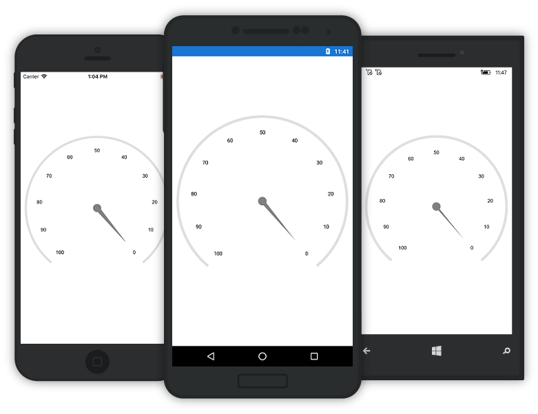
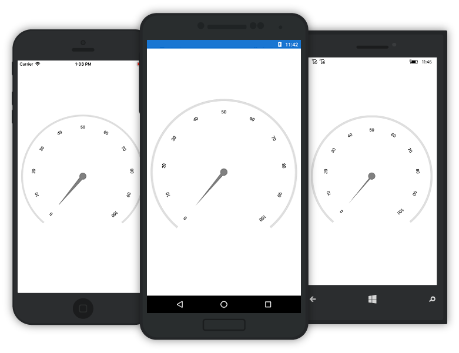
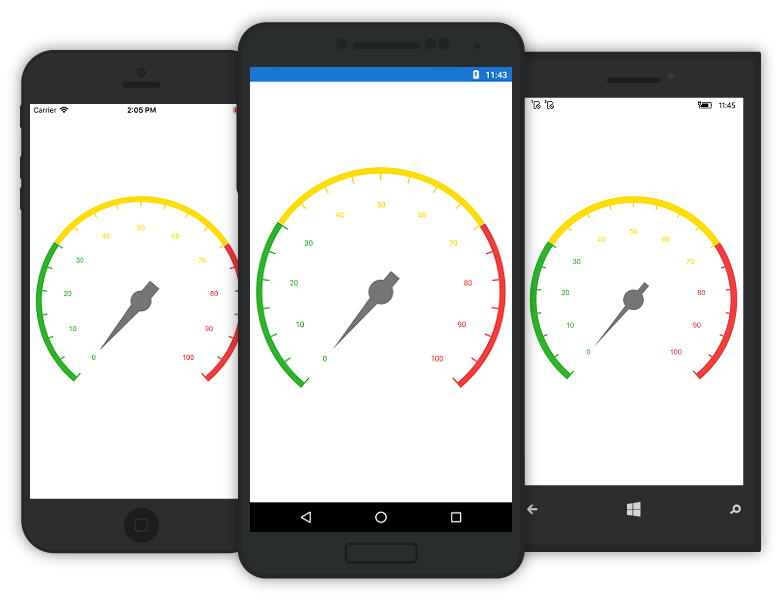

---

layout: post
title: Scales in Syncfusion SfCircularGauge control for Xamarin.Forms
description:  Learn how to set scales in Syncfusion SfCircularGauge control
platform: xamarin
control: SfCircularGauge
documentation: ug

---

# SCALES

The Scales contains a Collection of CircularScale which integrates labels, tick marks, and a rim to customize the basic look and feel of the `SfCircularGauge`.

## Scale

CircularScale contains sub elements such as Rim, Ticks, and Labels, Range, Pointers. It defines the Radius, start angle, sweep direction and sweep angle, overall minimum and maximum values, and frequency of labels and tick marks. It can have multiple ranges. 

A range is a visual element which begins and ends at specified values within a `scale`. It can have one or more pointers to point out the values in the scale.





    <gauge:SfCircularGauge.Scales>
         <gauge:Scale NumberOfDecimalDigits="4" StartAngle="135" StartValue="0" EndValue="100" Interval="10" SweepAngle="270"
                   RimThickness="20" RimColor="Gray" MinorTicksPerInterval="0">
         </gauge:Scale>
    </gauge:SfCircularGauge.Scales>





    ObservableCollection<Scale> scales = new ObservableCollection<Scale>();
    Scale scale = new Scale();
    scale.StartValue = 0; 
    scale.EndValue = 100;
    scale.Interval = 10;
    scale.StartAngle = 135;
    scale.SweepAngle = 270;
    scale.RimThickness =  20;
    scale.RimColor = Color.Gray;
    scale.MinorTicksPerInterval = 0;
    scales.Add(scale);
    circular.Scales = scales;  
    this.Content= circular;





## Multiple Scale

It helps to be able to add multiple scales to the same circular gauge, and also it helps to customize all the scales in a Scales collection.





    <gauge:SfCircularGauge.Scales>
        <gauge:Scale  x:Name="scale1" MinorTicksPerInterval="1" LabelColor="White">
            <gauge:Scale.MajorTickSettings>
                <gauge:TickSettings Color="White"/>
            </gauge:Scale.MajorTickSettings>
			<gauge:Scale.MinorTickSettings>
                <gauge:TickSettings Color="White" />
            </gauge:Scale.MinorTickSettings>
			<gauge:Scale.Ranges>
                <gauge:Range StartValue="0" EndValue="60" Offset="1" Color="Gray" Thickness="11" />
                <gauge:Range StartValue="60" EndValue="100" Offset="1" Color="Red" Thickness="11" />
            </gauge:Scale.Ranges>
            <gauge:Scale.Pointers>
                <gauge:MarkerPointer x:Name="pointer1" Value="30"  Color="Green" Offset="0.8"  MarkerShape="InvertedTriangle" EnableAnimation="False"/>
            </gauge:Scale.Pointers>
        </gauge:Scale>

        <gauge:Scale  x:Name="scale2" MinorTicksPerInterval="1"  ScaleStartOffset="0.5" ScaleEndOffset="0.55" LabelOffset="0.35" LabelColor="White">
            <gauge:Scale.MajorTickSettings>
                <gauge:TickSettings StartOffset="0.5" EndOffset="0.45" Thickness="4" Color="White"/>
            </gauge:Scale.MajorTickSettings>
            <gauge:Scale.MinorTickSettings>
                <gauge:TickSettings StartOffset="0.5" EndOffset="0.45" Thickness="2" Color="White" />
            </gauge:Scale.MinorTickSettings>                    
            <gauge:Scale.Ranges>
                <gauge:Range StartValue="0" EndValue="60"  Color="Gray" Offset="0.55" Thickness="11"  />
                <gauge:Range StartValue="60" EndValue="100" Color="Red" Offset="0.55"  Thickness="11"/>
            </gauge:Scale.Ranges>
            <gauge:Scale.Pointers>
                <gauge:NeedlePointer x:Name="pointer2" Value="30"  Color="Green"  EnableAnimation="False" LengthFactor="0.5"/>
            </gauge:Scale.Pointers>
        </gauge:Scale>
    </gauge:SfCircularGauge.Scales>       





    ObservableCollection<Scale> scales = new ObservableCollection<Scale>();
    Scale scale = new Scale();
    scale.MinorTicksPerInterval = 1;
	scale.LabelColor = Color.White;
	scale.MinorTickSettings.Color = Color.White;
	scale.MajorTickSettings.Color = Color.White;
	
	Range range = new Range();
	range.StartValue = 0;
	range.EndValue = 60;
	range.Offset = 1;
	range.Color = Color.Gray;
	range.Thickness = 11;
	scale.Ranges.Add(range);
	
	Range rangeLayer = new Range();
	rangeLayer.StartValue = 60;
	rangeLayer.EndValue = 100;
	rangeLayer.Offset = 1;
	rangeLayer.Color = Color.Red;
	rangeLayer.Thickness = 11;
	scale.Ranges.Add(rangeLayer);
	
	ObservableCollection<Pointer> pointers = new ObservableCollection<Pointer>();
	MarkerPointer markerPointer = new MarkerPointer();
	markerPointer.Value = 30;
	markerPointer.Color = Color.Green;
	markerPointer.Offset = 0.8;
	markerPointer.MarkerShape = MarkerShape.InvertedTriangle;
	markerPointer.EnableAnimation = false;
	scale.Pointers.Add(markerPointer);
	circular.Pointers = pointers;
    scales.Add(scale);
	
	Scale circularScale = new Scale();
    circularScale.MinorTicksPerInterval = 1;
	circularScale.ScaleStartOffset = 0.5;
	circularScale.ScaleEndOffset = 0.55;
	circularScale.LabelOffset = 0.35;
	circularScale.LabelColor = Color.White;
	scale.MinorTickSettings.StartOffset = 0.5;
	scale.MajorTickSettings.StartOffset = 0.5;
	scale.MinorTickSettings.EndOffset = 0.45;
	scale.MajorTickSettings.EndOffset = 0.45;
	scale.MinorTickSettings.Thickness = 2;
	scale.MajorTickSettings.Thickness = 4;
	scale.MinorTickSettings.Color = Color.White;
	scale.MajorTickSettings.Color = Color.White;
	
	Range circularRange = new Range();
	circularRange.StartValue = 0;
	circularRange.EndValue = 60;
	circularRange.Offset = 0.55;
	circularRange.Color = Color.Gray;
	circularRange.Thickness = 11;
	circularScale.Ranges.Add(range);
	
	Range circularRangeLayer = new Range();
	circularRangeLayer.StartValue = 60;
	circularRangeLayer.EndValue = 100;
	circularRangeLayer.Offset = 0.55;
	circularRangeLayer.Color = Color.Red;
	circularRangeLayer.Thickness = 11;
	circularScale.Ranges.Add(circularRangeLayer);
	
	ObservableCollection<Pointer> circularPointers = new ObservableCollection<Pointer>();
	NeedlePointer needlePointer = new NeedlePointer();
	needlePointer.Value = 30;
	needlePointer.Color = Color.Green;
	needlePointer.EnableAnimation = false;
	needlePointer.LengthFactor = 0.5;
	circularScale.Pointers.Add(needlePointer);
	circular.Pointers = circularPointers;
    scales.Add(circularScale);
    circular.Scales = scales;  
    this.Content= circular;
	

    


## ShowTicks

ShowTicks property is Boolean property that enables or disables the Tick feature of the SfCircularGauge.





    <gauge:SfCircularGauge.Scales>
         <gauge:Scale ShowTicks="False"/>
    </gauge:SfCircularGauge.Scales>





    ObservableCollection<Scale> scales = new ObservableCollection<Scale>();
    Scale scale = new Scale();
    scale.ShowTicks = False;
    scales.Add(scale);
    circular.Scales = scales;  
    this.Content= circular;
	

    


### Scale Direction

`Direction` property enables you to render the gauge scale either in `ClockWise` or in `AntiClockWise` direction.





    <gauge:SfCircularGauge.Scales>
         <gauge:Scale Direction="AntiClockwise">
    </gauge:SfCircularGauge.Scales>





    ObservableCollection<Scale> scales = new ObservableCollection<Scale>();
    Scale scale = new Scale();
    scale.Direction = ScaleDirection.AntiClockwise;
	scale.Direction = ScaleDirection.Clockwise;
    scales.Add(scale);
    circular.Scales = scales;  
    this.Content= circular;
	

    


### Auto Angle

Scale labels can be rotated automatically based on the current angle. To enable or disable the Auto Angle, you can use `EnableAutoAngle` property.





    <gauge:SfCircularGauge.Scales>
            <gauge:Scale EnableAutoAngle="True">
    </gauge:SfCircularGauge.Scales>





    ObservableCollection<Scale> scales = new ObservableCollection<Scale>();
    Scale scale = new Scale();
    scale.EnableAutoAngle = true;
    scales.Add(scale);
    circular.Scales = scales;  
    this.Content= circular;
	

    


### Range color for Labels and Ticks

You can set the range color to scale labels and ticks by enabling `UseRangeColorForLabels` property.





    <gauge:SfCircularGauge.Scales>
               <gauge:Scale UseRangeColorForLabels="True">
    </gauge:SfCircularGauge.Scales>





    ObservableCollection<Scale> scales = new ObservableCollection<Scale>();
    Scale scale = new Scale();
    scale.UseRangeColorForLabels = true;
    scales.Add(scale);
    circular.Scales = scales;  
    this.Content= circular;
	

    


### LabelCreated

This event is triggered when the scale label is created. The argument contains the following information.

* `LabelCreated` - used to get or set the scale label content.

