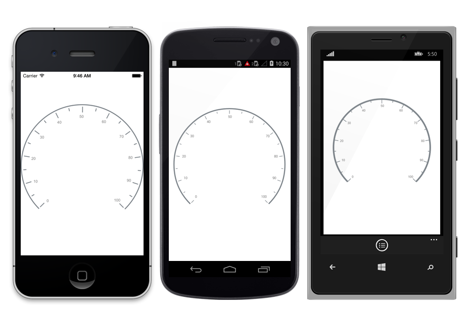
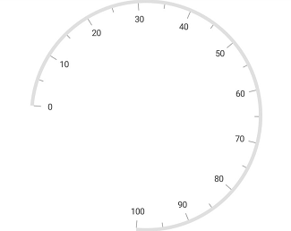
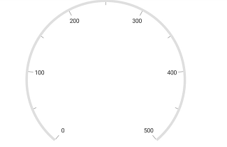
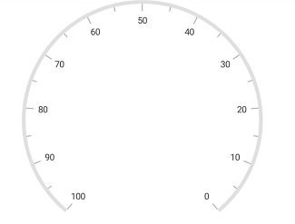
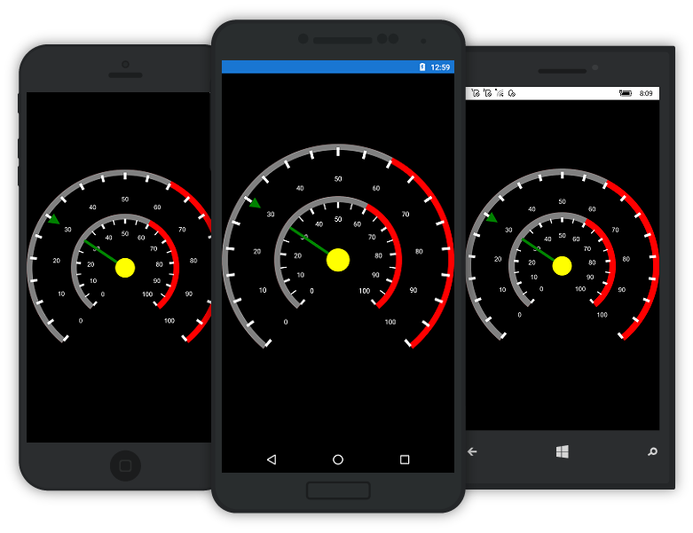

---

layout: post
title: Scales in Syncfusion SfCircularGauge control for Xamarin.Forms
description:  Learn how to set scales in Syncfusion SfCircularGauge control
platform: xamarin
control: SfCircularGauge
documentation: ug

---

# Scales

Scales contain a collection of [`Scale`](https://help.syncfusion.com/cr/cref_files/xamarin/Syncfusion.SfGauge.XForms~Syncfusion.SfGauge.XForms.Scale.html) elements, which integrates labels, tick marks, and a rim to customize the basic look and feel of the circular gauge.

## Scale

[`Scale`](https://help.syncfusion.com/cr/cref_files/xamarin/Syncfusion.SfGauge.XForms~Syncfusion.SfGauge.XForms.Scale.html) contains the sub elements such as rim, ticks, labels, ranges, and pointers. It defines the radius, start angle, sweep direction, sweep angle, overall minimum and maximum values, frequency of labels, and tick marks. It will have multiple ranges.

A range is a visual element, which begins and ends at specified values within a [`Scale`](https://help.syncfusion.com/cr/cref_files/xamarin/Syncfusion.SfGauge.XForms~Syncfusion.SfGauge.XForms.Scale.html). It will have one or more pointers to point out the values in scale.





    <gauge:SfCircularGauge>
   
    <gauge:SfCircularGauge.Scales>
         <gauge:Scale/>
    </gauge:SfCircularGauge.Scales>
	
	</gauge:SfCircularGauge>





    SfCircularGauge circularGauge = new SfCircularGauge();
    ObservableCollection<Scale> scales = new ObservableCollection<Scale>();
    Scale scale = new Scale();
    scales.Add(scale);
    circularGauge.Scales = scales;  





## Setting start and end values for scale

The [`StartValue`](https://help.syncfusion.com/cr/cref_files/xamarin/Syncfusion.SfGauge.XForms~Syncfusion.SfGauge.XForms.Scale~StartValue.html) and [`EndValue`](https://help.syncfusion.com/cr/cref_files/xamarin/Syncfusion.SfGauge.XForms~Syncfusion.SfGauge.XForms.Scale~EndValue.html) properties allow  you to set the start and end values for scale.





    <gauge:SfCircularGauge>
    
    <gauge:SfCircularGauge.Scales>
         <gauge:Scale StartValue="-30" EndValue="50"/>
    </gauge:SfCircularGauge.Scales>
	
	
	</gauge:SfCircularGauge>





    SfCircularGauge circularGauge = new SfCircularGauge();
    ObservableCollection<Scale> scales = new ObservableCollection<Scale>();
    Scale scale = new Scale();
	scale.StartValue = -30;
    scale.EndValue = 50;
    scales.Add(scale);
    circularGauge.Scales = scales;  





## Setting start and sweep angles for scale

The [`StartAngle`](https://help.syncfusion.com/cr/cref_files/xamarin/Syncfusion.SfGauge.XForms~Syncfusion.SfGauge.XForms.Scale~StartAngle.html) and [`SweepAngle`](https://help.syncfusion.com/cr/cref_files/xamarin/Syncfusion.SfGauge.XForms~Syncfusion.SfGauge.XForms.Scale~SweepAngle.html) properties allow you to set the start and end angles for scale.





    <gauge:SfCircularGauge>
   
    <gauge:SfCircularGauge.Scales>
         <gauge:Scale StartAngle="185" SweepAngle="270"/>
    </gauge:SfCircularGauge.Scales>
	
	</gauge:SfCircularGauge>





    SfCircularGauge circularGauge = new SfCircularGauge();
    ObservableCollection<Scale> scales = new ObservableCollection<Scale>();
    Scale scale = new Scale();
	scale.StartAngle = 185;
    scale.SweepAngle = 270;
    scales.Add(scale);
    circularGauge.Scales = scales;  





## Setting interval for scale

The [`Interval`](https://help.syncfusion.com/cr/cref_files/xamarin/Syncfusion.SfGauge.XForms~Syncfusion.SfGauge.XForms.Scale~Interval.html) property allows you to set the interval for scale.





    <gauge:SfCircularGauge>
     
    <gauge:SfCircularGauge.Scales>
         <gauge:Scale StartValue = "0" EndValue = "500" Interval ="100" />
    </gauge:SfCircularGauge.Scales>
	
	
	</gauge:SfCircularGauge>





    SfCircularGauge circularGauge = new SfCircularGauge();
    ObservableCollection<Scale> scales = new ObservableCollection<Scale>();
    Scale scale = new Scale();
	scale.StartValue = 0;
    scale.EndValue = 500;
    scale.Interval = 100;
    scales.Add(scale);
    circularGauge.Scales = scales;  





## Setting auto interval for scale

By default, the interval value is calculated by 10. By using the [`EnableAutoInterval`](https://help.syncfusion.com/cr/cref_files/xamarin/Syncfusion.SfGauge.XForms~Syncfusion.SfGauge.XForms.Scale~EnableAutoInterval.html) property, you can set auto interval based on the start and end values.





    <gauge:SfCircularGauge>
   
    <gauge:SfCircularGauge.Scales>
         <gauge:Scale StartValue="0" EndValue="500"  EnableAutoInterval = "True"/>
    </gauge:SfCircularGauge.Scales>
	
	
	</gauge:SfCircularGauge>





    SfCircularGauge circularGauge = new SfCircularGauge();
    ObservableCollection<Scale> scales = new ObservableCollection<Scale>();
    Scale scale = new Scale();
	scale.StartValue = 0;
    scale.EndValue = 500;
    scale.EnableAutoInterval = true;
    scales.Add(scale);
    circularGauge.Scales = scales;  





## Setting scale direction for scale

The [`Direction`](https://help.syncfusion.com/cr/cref_files/xamarin/Syncfusion.SfGauge.XForms~Syncfusion.SfGauge.XForms.Scale~Direction.html) property allows you to render the gauge scale in either clockwise or counterclockwise direction.





    <gauge:SfCircularGauge>
    
    <gauge:SfCircularGauge.Scales>
        <gauge:Scale Direction="AntiClockwise"/>
    </gauge:SfCircularGauge.Scales>
	
	
	</gauge:SfCircularGauge>





    SfCircularGauge circularGauge = new SfCircularGauge();
    ObservableCollection<Scale> scales = new ObservableCollection<Scale>();
    Scale scale = new Scale();
	scale.Direction = ScaleDirection.AntiClockwise;
    scales.Add(scale);
    circularGauge.Scales = scales;  





## Setting multiple scales for scale

It helps you to add multiple scales to the same circular gauge. You can customize all the scales in a [`Scales`](https://help.syncfusion.com/cr/cref_files/xamarin/Syncfusion.SfGauge.XForms~Syncfusion.SfGauge.XForms.SfCircularGauge~Scales.html) collection.





    <gauge:SfCircularGauge>

            <gauge:SfCircularGauge.Scales>
                <gauge:Scale x:Name="scale1" 
                   StartValue="0" EndValue="240" Interval="20" MinorTicksPerInterval="1" RimColor="#C62E0A"
                   LabelOffset="0.88" LabelColor="#C62E0A" ScaleStartOffset="0.7" ScaleEndOffset="0.69">

                    <gauge:Scale.MajorTickSettings>
                        <gauge:TickSettings StartOffset="0.7" EndOffset="0.77" Thickness="2" Color="#C62E0A"/>
                    </gauge:Scale.MajorTickSettings>

                    <gauge:Scale.MinorTickSettings>
                        <gauge:TickSettings StartOffset="0.7" EndOffset="0.75" Thickness="2" Color="#C62E0A"/>
                    </gauge:Scale.MinorTickSettings>

                </gauge:Scale>

                <gauge:Scale x:Name="scale2" 
                       StartValue="0" EndValue="160" Interval="40" MinorTicksPerInterval="1"  RimColor="#333333"
                       LabelOffset="0.45" LabelColor="#333333" ScaleStartOffset="0.65" ScaleEndOffset="0.64">

                    <gauge:Scale.MajorTickSettings>
                        <gauge:TickSettings StartOffset="0.64" EndOffset="0.57" Thickness="2" Color="#333333"/>
                    </gauge:Scale.MajorTickSettings>

                    <gauge:Scale.MinorTickSettings>
                        <gauge:TickSettings StartOffset="0.64" EndOffset="0.59" Thickness="2" Color="#333333"/>
                    </gauge:Scale.MinorTickSettings>

                </gauge:Scale>
            </gauge:SfCircularGauge.Scales>

    </gauge:SfCircularGauge>
    





    SfCircularGauge circularGauge = new SfCircularGauge();
    ObservableCollection<Scale> scales = new ObservableCollection<Scale>();
    Scale scale = new Scale();
    scale.StartValue = 0;
    scale.EndValue = 240;
    scale.Interval = 20;
    scale.MinorTicksPerInterval = 1;
    scale.RimColor = Color.FromHex("#C62E0A");
    scale.LabelOffset = 0.88;
    scale.LabelColor = Color.FromHex("#C62E0A");
    scale.ScaleStartOffset = 0.7;
    scale.ScaleEndOffset = 0.69;

    TickSettings majorTicks = new TickSettings();
    majorTicks.StartOffset = 0.7;
    majorTicks.EndOffset = 0.77;
    majorTicks.Thickness = 2;
    majorTicks.Color = Color.FromHex("#C62E0A");
    scale.MajorTickSettings = majorTicks;

    TickSettings minorTicks = new TickSettings();
    minorTicks.StartOffset = 0.7;
    minorTicks.EndOffset = 0.75;
    minorTicks.Thickness = 2;
    minorTicks.Color = Color.FromHex("#C62E0A");
    scale.MinorTickSettings = minorTicks;                              
	scales.Add(scale);

    Scale circularScale = new Scale();
    circularScale.StartValue = 0;
    circularScale.EndValue = 160;
    circularScale.Interval = 40;
    circularScale.MinorTicksPerInterval = 1;
    circularScale.RimColor = Color.FromHex("#333333");
    circularScale.LabelOffset = 0.45;
    circularScale.LabelColor = Color.FromHex("#333333");
    circularScale.ScaleStartOffset = 0.65;
    circularScale.ScaleEndOffset = 0.64;

    TickSettings majorTick = new TickSettings();
    majorTick.StartOffset = 0.64;
    majorTick.EndOffset = 0.57;
    majorTick.Thickness = 2;
    majorTick.Color = Color.FromHex("#333333");
    circularScale.MajorTickSettings = majorTick;
	
    TickSettings minorTick = new TickSettings();
    minorTick.StartOffset = 0.64;
    minorTick.EndOffset = 0.59;
    minorTick.Thickness = 2;
    minorTick.Color = Color.FromHex("#333333");
    circularScale.MinorTickSettings = minorTick;
	
    scales.Add(circularScale);
    circularGauge.Scales = scales;

	

    


