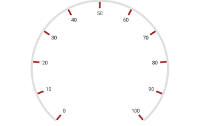
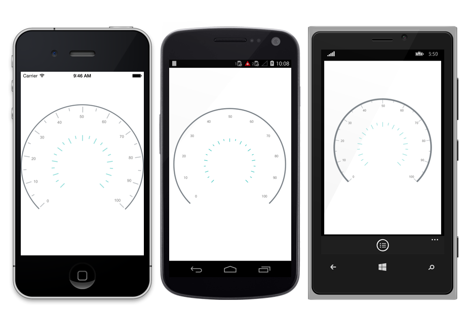

---

layout: post
title: Tick Setting in Syncfusion SfCircularGauge control for Xamarin.Forms
description:  Learn how to set ticks in Syncfusion SfCircularGauge control
platform: xamarin
control: SfCircularGauge
documentation: ug

---

# Tick Setting

The `TickSettings` property helps you to identify the gauge’s data value by marking the gauge scale in regular increments.

## Show ticks for scale

The [`ShowTicks`](https://help.syncfusion.com/cr/cref_files/xamarin/Syncfusion.SfGauge.XForms~Syncfusion.SfGauge.XForms.Scale~ShowTicks.html) property allows you to enable or disable the ticks of circular gauge.





    <gauge:SfCircularGauge>
  
    <gauge:SfCircularGauge.Scales>
         <gauge:Scale  ShowTicks=”False”/>
    </gauge:SfCircularGauge.Scales>

	</gauge:SfCircularGauge>





    SfCircularGauge circularGauge = new SfCircularGauge();
    ObservableCollection<Scale> scales = new ObservableCollection<Scale>();
    Scale scale = new Scale();
	scale.ShowTicks = false;
    scales.Add(scale);
    circularGauge.Scales = scales;  





## Ticks customization 

The [`Interval`](https://help.syncfusion.com/cr/cref_files/xamarin/Syncfusion.SfGauge.XForms~Syncfusion.SfGauge.XForms.Scale~Interval.html) property is used to calculate the tick counts for a scale. Similar to ticks, minor ticks are calculated by using the [`MinorTicksPerInterval`](https://help.syncfusion.com/cr/cref_files/xamarin/Syncfusion.SfGauge.XForms~Syncfusion.SfGauge.XForms.Scale~MinorTicksPerInterval.html) property.

Color and thickness of the tick are set by using the [`Color`](https://help.syncfusion.com/cr/cref_files/xamarin/Syncfusion.SfGauge.XForms~Syncfusion.SfGauge.XForms.TickSettings~Color.html) and [`Thickness`](https://help.syncfusion.com/cr/cref_files/xamarin/Syncfusion.SfGauge.XForms~Syncfusion.SfGauge.XForms.TickSettings~Thickness.html) UI properties. You can also customize the length of the ticks by using the  [`Length`](https://help.syncfusion.com/cr/cref_files/xamarin/Syncfusion.SfGauge.XForms~Syncfusion.SfGauge.XForms.TickSettings~Length.html) property. First, you should set the `Offset` property for ticks, then increase the length of the ticks.

## Customize major ticks for scale





     <gauge:SfCircularGauge>
    
        <gauge:SfCircularGauge.Scales>
		
             <gauge:Scale/>
			 
			 <gauge:Scale.MajorTickSettings>
                 <gauge:TickSettings Color ="Brown" Thickness=”4" Length="15" Offset=”0.97”/>
             </gauge:Scale.MajorTickSettings>

        </gauge:SfCircularGauge.Scales>
	
	 </gauge:SfCircularGauge>





    SfCircularGauge circularGauge = new SfCircularGauge();
    ObservableCollection<Scale> scales = new ObservableCollection<Scale>();
    Scale scale = new Scale();
    TickSettings majorTicks = new TickSettings();
    majorTicks.Length = 15;
    majorTicks.Color = Color.Brown;
    majorTicks.Thickness = 4;
    majorTicks.Offset = 0.97;
    scale.MajorTickSettings = majorTicks;
    scales.Add(scale);
    circularGauge.Scales = scales;  
  




## Customize minor ticks for scale





     <gauge:SfCircularGauge>
     
        <gauge:SfCircularGauge.Scales>
		
             <gauge:Scale/>
			 
			 <gauge:Scale.MinorTickSettings>
                 <gauge:TickSettings Color ="SkyBlue" Thickness="4" Length="4" Offset = “0.97” />
             </gauge:Scale.MinorTickSettings>

        </gauge:SfCircularGauge.Scales>
	
	 </gauge:SfCircularGauge>





    SfCircularGauge circularGauge = new SfCircularGauge();
    ObservableCollection<Scale> scales = new ObservableCollection<Scale>();
    Scale scale = new Scale();
    TickSettings minorTicks = new TickSettings();
    minorTicks.Length = 4;
    minorTicks.Color = Color.SkyBlue;
    minorTicks.Thickness = 4;
    minorTicks.Offset = 0.97;
    scale.MinorTickSettings = minorTicks; 
   
    scales.Add(scale);
    circularGauge.Scales = scales;  
  




## Setting position for ticks

The major and minor ticks can be positioned far away from the rim by using the following two ways:

1.`Offset` property. 
2.`StartOffset` and `EndOffset` properties.

### Setting offset for scale





     <gauge:SfCircularGauge>
      
        <gauge:SfCircularGauge.Scales>
		
             <gauge:Scale/>
			 
			 <gauge:Scale.MajorTickSettings>
                 <gauge:TickSettings Offset = “0.5”/>
             </gauge:Scale.MajorTickSettings>
			 
			 <gauge:Scale.MinorTickSettings>
                 <gauge:TickSettings Offset = “0.5”/>
             </gauge:Scale.MinorTickSettings>

        </gauge:SfCircularGauge.Scales>

	 </gauge:SfCircularGauge>





    SfCircularGauge circularGauge = new SfCircularGauge();
    ObservableCollection<Scale> scales = new ObservableCollection<Scale>();
    Scale scale = new Scale();
	TickSettings majorTicks = new TickSettings();
    majorTicks.Offset = 0.5;
    scale.MajorTickSettings = majorTicks;
    TickSettings minorTicks = new TickSettings();
    minorTicks.Offset = 0.5;
    scale.MinorTickSettings = minorTicks; 
   
    scales.Add(scale);
    circularGauge.Scales = scales;  
  




### Setting scale start and end offset for scale





     <gauge:SfCircularGauge>
    

        <gauge:SfCircularGauge.Scales>
		
             <gauge:Scale/>
			 
			 <gauge:Scale.MajorTickSettings>
                <gauge:TickSettings StartOffset = “0.3” EndOffset =”0.4”/>
             </gauge:Scale.MajorTickSettings>
			 
			 <gauge:Scale.MinorTickSettings>
                 <gauge:TickSettings StartOffset = “0.3” EndOffset =”0.35”/>
             </gauge:Scale.MinorTickSettings>

        </gauge:SfCircularGauge.Scales>
	
	 </gauge:SfCircularGauge>





    SfCircularGauge circularGauge = new SfCircularGauge();
    ObservableCollection<Scale> scales = new ObservableCollection<Scale>();
    Scale scale = new Scale();
	TickSettings majorTicks = new TickSettings();
    majorTicks.StartOffset = 0.3;
    majorTicks.EndOffset = 0.4;
    scale.MajorTickSettings = majorTicks;
    TickSettings minorTicks = new TickSettings();
    minorTicks.StartOffset = 0.3;
    minorTicks.EndOffset = 0.35;
    scale.MinorTickSettings = minorTicks; 
   
    scales.Add(scale);
    circularGauge.Scales = scales;  
  




