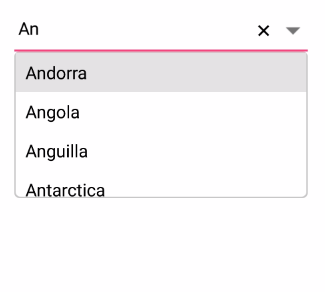
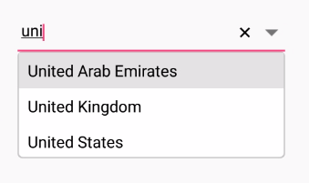
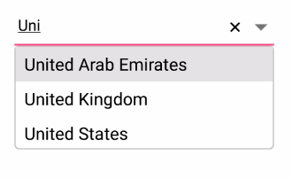
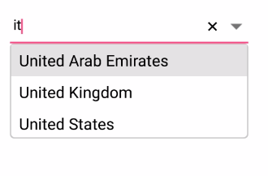
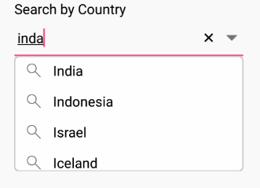
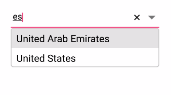
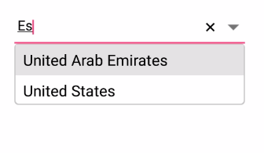
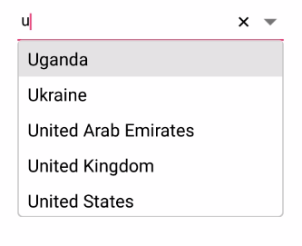
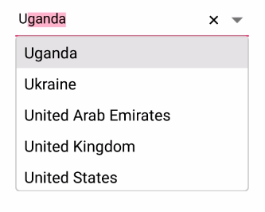

# Filtering 
The combo box enables the filer option for filtering the suggestions in the drop-down. 

	



<StackLayout VerticalOptions="Start" HorizontalOptions="Start" Padding="30"> 
    <combobox:SfComboBox HeightRequest="40" x:Name="comboBox" IsEditableMode="true" AllowFiltering="true" MaximumDropDownHeight="150">
        <combobox:SfComboBox.DataSource>
            <ListCollection:List x:TypeArguments="x:String">
                <x:String> Afghanistan </x:String>
                <x:String> Albania </x:String>
                <x:String> Algeria</x:String>
                <x:String> American Samoa </x:String>
                <x:String> Andorra </x:String>
                <x:String> Angola </x:String>
                <x:String> Anguilla</x:String>
                <x:String> Antarctica </x:String>
                <x:String> Antigua and Barbuda </x:String>
                <x:String> Argentina </x:String>
            </ListCollection:List>
        </combobox:SfComboBox.DataSource>
    </combobox:SfComboBox>               
</StackLayout>


	

	
StackLayout layout = new StackLayout() 
{ 
    VerticalOptions = LayoutOptions.Start, 
    HorizontalOptions = LayoutOptions.Start, 
    Padding = new Thickness(30) 
};	

List<String> countryNames = new List<String>();
countryNames.Add("Afghanistan"); 
countryNames.Add("Albania");
countryNames.Add("Algeria");
countryNames.Add("American Samoa");
countryNames.Add("Andorra");
countryNames.Add("Angola");
countryNames.Add("Anguilla");
countryNames.Add("Antarctica");
countryNames.Add("Antigua and Barbuda");
countryNames.Add("Argentina");

SfComboBox comboBox = new SfComboBox();
comboBox.HeightRequest = 40;
comboBox.DataSource = countryNames; 
comboBox.IsEditableMode = true;
comboBox.AllowFiltering = true;

layout.Children.Add(comboBox); 
Content = layout;
	 




## Filtering types

The string comparison for filtering suggestions can be changed using the `SuggestionMode` property. The default filtering type is “StartsWith”, and it is case insensitive. The available filtering modes are,

* StartsWith

* StartsWithCaseSensitive

* Contains

* ContainsWithCaseSensitive

* Equals

* EqualsWithCaseSensitive

* EndsWith

* EndsWithCaseSensitive

* Custom

### Filtering words that starts with input text

Displays all the matches that start with the typed characters in control. This strategy is case in-sensitive.
	
	



<StackLayout VerticalOptions="Start" HorizontalOptions="Start" Padding="30">
	<combobox:SfComboBox HeightRequest="40" x:Name="comboBox" IsEditableMode="true" AllowFiltering="true" SuggestionMode="StartsWith">
        <combobox:SfComboBox.DataSource>
            <ListCollection:List x:TypeArguments="x:String">
                <x:String> Uganda </x:String>
                <x:String> Ukraine </x:String>
                <x:String> UUnited Arab Emirates</x:String>
                <x:String> United Kingdom</x:String>
                <x:String> United States </x:String>
            </ListCollection:List>
        </combobox:SfComboBox.DataSource>
    </combobox:SfComboBox>              
</StackLayout>


	

	
StackLayout layout = new StackLayout() 
{ 
    VerticalOptions = LayoutOptions.Start, 
    HorizontalOptions = LayoutOptions.Start, 
    Padding = new Thickness(30) 
};	    

List<String> countryNames = new List<String>();
countryNames.Add("Uganda");
countryNames.Add("Ukraine");
countryNames.Add("United Arab Emirates");
countryNames.Add("United Kingdom");
countryNames.Add("United States");

SfComboBox comboBox = new SfComboBox();
comboBox.HeightRequest = 40;
comboBox.DataSource = countryNames;
comboBox.IsEditableMode = true;
comboBox.AllowFiltering = true;
comboBox.SuggestionMode = SuggestionMode.StartsWith;
layout.Children.Add(comboBox); 
Content = layout;
	 




#### Filtering words that starts with input text - case sensitive

Displays all the matches that start with the typed characters in control. This strategy is case sensitive.





<StackLayout VerticalOptions="Start" HorizontalOptions="Start" Padding="30">
    <comboBox:SfComboBox HeightRequest="40" x:Name="comboBox" IsEditableMode="true" AllowFiltering="true" SuggestionMode="StartsWithCaseSensitive">
        <combobox:SfComboBox.DataSource>
            <ListCollection:List x:TypeArguments="x:String">
                <x:String> Uganda </x:String>
                <x:String> Ukraine </x:String>
                <x:String> United Arab Emirates</x:String>
                <x:String> United Kingdom</x:String>
                <x:String> United States </x:String>
            </ListCollection:List>
        </combobox:SfComboBox.DataSource>
    </combobox:SfComboBox>           
</StackLayout>





StackLayout layout = new StackLayout() 
{ 
    VerticalOptions = LayoutOptions.Start, 
    HorizontalOptions = LayoutOptions.Start, 
    Padding = new Thickness(30) 
};

List<String> countryNames = new List<String>();
countryNames.Add("Uganda");
countryNames.Add("Ukraine");
countryNames.Add("United Arab Emirates");
countryNames.Add("United Kingdom");
countryNames.Add("United States");

SfComboBox comboBox = new SfComboBox();
comboBox.HeightRequest = 40;
comboBox.DataSource = countryNames;
comboBox.IsEditableMode = true;
comboBox.AllowFiltering = true;
comboBox.SuggestionMode = SuggestionMode.StartsWithCaseSensitive;
layout.Children.Add(comboBox); 
Content = layout;





### Filtering words that contain input text

Displays all the matches that contain the typed characters in control. This strategy is case in-sensitive.
	




<StackLayout VerticalOptions="Start" HorizontalOptions="Start" Padding="30">
    <combobox:SfComboBox HeightRequest="40" x:Name="comboBox" IsEditableMode="true" AllowFiltering="true" SuggestionMode="Contains">
        <combobox:SfComboBox.DataSource>
            <ListCollection:List x:TypeArguments="x:String">
                <x:String> Uganda </x:String>
                <x:String> Ukraine </x:String>
                <x:String> United Arab Emirates</x:String>
                <x:String> United Kingdom</x:String>
                <x:String> United States </x:String>
                <x:String> Italy </x:String>
            </ListCollection:List>
        </combobox:SfComboBox.DataSource>
    </combobox:SfComboBox>                            
</StackLayout>





StackLayout layout = new StackLayout() 
{ 
    VerticalOptions = LayoutOptions.Start, 
    HorizontalOptions = LayoutOptions.Start, 
    Padding = new Thickness(30) 
};

List<String> countryNames = new List<String>();
countryNames.Add("Uganda");
countryNames.Add("Ukraine");
countryNames.Add("United Arab Emirates");
countryNames.Add("United Kingdom");
countryNames.Add("United States");
countryNames.Add("Italy");

SfComboBox comboBox = new SfComboBox();
comboBox.HeightRequest = 40;
comboBox.DataSource = countryNames;
comboBox.IsEditableMode = true;
comboBox.AllowFiltering = true;
comboBox.SuggestionMode = SuggestionMode.Contains;
layout.Children.Add(comboBox); 
Content = layout;
	 




#### Filtering words that contain input text - case sensitive

Displays all the matches that contains the typed characters in control. This strategy is case sensitive.





<StackLayout VerticalOptions="Start" HorizontalOptions="Start" Padding="30">
    <combobox:SfComboBox HeightRequest="40" x:Name="comboBox" IsEditableMode="true" AllowFiltering="true" SuggestionMode="ContainsWithCaseSensitive">
        <combobox:SfComboBox.DataSource>
            <ListCollection:List x:TypeArguments="x:String">
                <x:String> Uganda </x:String>
                <x:String> Ukraine </x:String>
                <x:String> United Arab Emirates </x:String>
                <x:String> United Kingdom </x:String>
                <x:String> United States </x:String>
                <x:String> Italy </x:String>
            </ListCollection:List>
        </combobox:SfComboBox.DataSource>
    </combobox:SfComboBox>                            
</StackLayout>





StackLayout layout = new StackLayout() 
{ 
    VerticalOptions = LayoutOptions.Start, 
    HorizontalOptions = LayoutOptions.Start, 
    Padding = new Thickness(30) 
};

List<String> countryNames = new List<String>();
countryNames.Add("Uganda");
countryNames.Add("Ukraine");
countryNames.Add("United Arab Emirates");
countryNames.Add("United Kingdom");
countryNames.Add("United States");
countryNames.Add("Italy");

SfComboBox comboBox = new SfComboBox();
comboBox.HeightRequest = 40;
comboBox.DataSource = countryNames;
comboBox.IsEditableMode = true;
comboBox.AllowFiltering = true;
comboBox.SuggestionMode = SuggestionMode.ContainsWithCaseSensitive;
layout.Children.Add(comboBox); 
Content = layout;





### Filtering words that equals the input text

Displays all the words that completely match with the typed characters in control. This strategy is case in-sensitive.
	




<StackLayout VerticalOptions="Start" HorizontalOptions="Start" Padding="30">
    <combobox:SfCpomboBox HeightRequest="40" x:Name="comboBox" IsEditableMode="true" AllowFiltering="true" SuggestionMode="Equals">
        <combobox:SfComboBox.DataSource>
            <ListCollection:List x:TypeArguments="x:String">
                <x:String> Uganda </x:String>
                <x:String> Ukraine </x:String>
                <x:String> United Arab Emirates </x:String>
                <x:String> United Kingdom </x:String>
                <x:String> United States </x:String>
            </ListCollection:List>
        </combobox:SfComboBox.DataSource>
    </combobox:SfComboBox>        
</StackLayout>




	
StackLayout layout = new StackLayout() 
{ 
    VerticalOptions = LayoutOptions.Start, 
    HorizontalOptions = LayoutOptions.Start, 
    Padding = new Thickness(30) 
};

List<String> countryNames = new List<String>();
countryNames.Add("Uganda");
countryNames.Add("Ukraine");
countryNames.Add("United Arab Emirates");
countryNames.Add("United Kingdom");
countryNames.Add("United States");
countryNames.Add("Italy");

SfComboBox comboBox = new SfComboBox();
comboBox.HeightRequest = 40;
comboBox.DataSource = countryNames;
comboBox.IsEditableMode = true;
comboBox.AllowFiltering = true;
comboBox.SuggestionMode = SuggestionMode.Equals;
layout.Children.Add(comboBox); 
Content = layout;





#### Filtering words that equals input text - case sensitive

Displays all the words that completely match with the typed characters in control. This strategy is case sensitive.
	




<StackLayout VerticalOptions="Start" HorizontalOptions="Start" Padding="30">
    <combobox:SfComboBox HeightRequest="40" x:Name="comboBox" IsEditableMode="true" AllowFiltering="true" SuggestionMode="EqualsWithCaseSensitive">
        <combobox:SfComboBox.DataSource>
            <ListCollection:List x:TypeArguments="x:String">
                <x:String> Uganda </x:String>
                <x:String> Ukraine </x:String>
                <x:String> United Arab Emirates </x:String>
                <x:String> United Kingdom </x:String>
                <x:String> United States </x:String>
            </ListCollection:List>
        </combobox:SfComboBox.DataSource>
    </combobox:SfComboBox>             
</StackLayout>





StackLayout layout = new StackLayout() 
{ 
    VerticalOptions = LayoutOptions.Start, 
    HorizontalOptions = LayoutOptions.Start, 
    Padding = new Thickness(30) 
};

List<String> countryNames = new List<String>();
countryNames.Add("Uganda");
countryNames.Add("Ukraine");
countryNames.Add("United Arab Emirates");
countryNames.Add("United Kingdom");
countryNames.Add("United States");

SfComboBox comboBox = new SfComboBox();
comboBox.HeightRequest = 40;
comboBox.DataSource = countryNames;
comboBox.IsEditableMode = true;
comboBox.AllowFiltering = true;
comboBox.SuggestionMode = SuggestionMode.EqualsWithCaseSensitive;
layout.Children.Add(comboBox); 
Content = layout;





### Custom

Filters items in the suggestion list based on a custom search by user. This helps to apply our typo toleration functionality to the control.





<StackLayout VerticalOptions="Start" HorizontalOptions="Start" Padding="30">
    <combobox:SfComboBox HeightRequest="40" DropDownTextSize="20" x:Name="comboBox" IsEditableMode="true" AllowFiltering="true" ComboBoxMode="Suggest" MaximumDropDownHeight="200" SuggestionMode="Custom">
        <combobox:SfComboBox.DataSource>
            <ListCollection:List x:TypeArguments="x:String">
                <x:String> Albania </x:String>
                <x:String> Algeria </x:String>
                <x:String> American Samoa </x:String>
                <x:String> Andorra </x:String>
                <x:String> Anguilla </x:String>
            </ListCollection:List>
        </combobox:SfComboBox.DataSource>
    </combobox:SfComboBox>
</StackLayout>





    public ComboBoxPage()
    {
        InitializeComponent();
        StackLayout layout = new StackLayout() 
        { 
	        VerticalOptions = LayoutOptions.Start, 
	        HorizontalOptions = LayoutOptions.Start, 
	        Padding = new Thickness(30) 
        };	
        List<string> list = new List<string>();
        list.Add("Albania");
        list.Add("Algeria");
        list.Add("American Samoa");
        list.Add("Andorra");
        list.Add("Angola");
        list.Add("Anguilla");
        comboBox.ComboBoxSource = list;
        comboBox.IsEditableMode = true;
        comboBox.AllowFiltering = true;
        comboBox.Filter = ContainingSpaceFilter;

        layout.Children.Add(comboBox); 
        Content = layout;
    }
    public bool ContainingSpaceFilter(string search, object item)
    {
        string text = item.ToString().ToLower();
        if (item != null)
        {
            try
            {
                var split = search.Split(' ');
                foreach (var results in split)
                {
                    if (!text.Contains(results.ToLower()))
                    {
                        return true;
                    }
                    else
                        return false;
                }
                return true;
            }
            catch (Exception)
            {
                return (text.Contains(search));
            }
        }
        else
            return false;
    }

	

    

### Filtering words that end with input text

Displays all the matches that end with the typed characters in control. This strategy is case in-sensitive.


	


<StackLayout VerticalOptions="Start" HorizontalOptions="Start" Padding="30">
    <combobox:SfComboBox HeightRequest="40" WidthRequest="180" x:Name="comboBox" IsEditableMode="true" AllowFiltering="true" SuggestionMode="EndsWith">
        <combobox:SfComboBox.DataSource>
            <ListCollection:List x:TypeArguments="x:String">
                <x:String> Uganda </x:String>
                <x:String> Ukraine </x:String>
                <x:String> United Arab Emirates </x:String>
                <x:String> United Kingdom </x:String>
                <x:String> United States </x:String>
            </ListCollection:List>
        </combobox:SfComboBox.DataSource>
    </combobox:SfComboBox>                            
</StackLayout>





StackLayout layout = new StackLayout() 
{ 
    VerticalOptions = LayoutOptions.Start, 
    HorizontalOptions = LayoutOptions.Start, 
    Padding = new Thickness(30) 
};

List<String> countryNames = new List<String>();
countryNames.Add("Uganda");
countryNames.Add("Ukraine");
countryNames.Add("United Arab Emirates");
countryNames.Add("United Kingdom");
countryNames.Add("United States");

SfComboBox comboBox = new SfComboBox();
comboBox.HeightRequest = 40;
comboBox.DataSource = countryNames;
comboBox.IsEditableMode = true;
comboBox.AllowFiltering = true;
comboBox.SuggestionMode = SuggestionMode.EndsWith;
layout.Children.Add(comboBox); 
Content = layout;





#### Filtering words that end with input text - case sensitive 

Displays all the matches that ends with the typed characters in control. This strategy is case sensitive.
	




<StackLayout VerticalOptions="Start" HorizontalOptions="Start" Padding="30">
    <combobox:SfComboBox HeightRequest="40" x:Name="comboBox" IsEditableMode="true" AllowFiltering="true"  SuggestionMode="EndsWithCaseSensitive">
        <combobox:SfComboBox.DataSource>
            <ListCollection:List x:TypeArguments="x:String">
                <x:String> Uganda </x:String>
                <x:String> Ukraine </x:String>
                <x:String> United Arab Emirates </x:String>
                <x:String> United Kingdom </x:String>
                <x:String> United States </x:String>
            </ListCollection:List>
        </combobox:SfComboBox.DataSource>
    </combobox:SfComboBox>           
</StackLayout>





StackLayout layout = new StackLayout() 
{ 
    VerticalOptions = LayoutOptions.Start, 
    HorizontalOptions = LayoutOptions.Start, 
    Padding = new Thickness(30) 
};

List<String> countryNames = new List<String>();
countryNames.Add("Uganda");
countryNames.Add("Ukraine");
countryNames.Add("United Arab Emirates");
countryNames.Add("United Kingdom");
countryNames.Add("United States");

SfComboBox comboBox = new SfComboBox();
comboBox.HeightRequest = 40;
comboBox.DataSource = countryNames;
comboBox.IsEditableMode = true;
comboBox.AllowFiltering = true;
comboBox.SuggestionMode = SuggestionMode.EndsWithCaseSensitive;
layout.Children.Add(comboBox); 
Content = layout;





## ComboBox modes

The combo box provides three different ways to display the filtered suggestions. They are 

* Suggest - Displays suggestions in drop-down list

* Append - Appends the first suggestion to text

* SuggestAppend - Both suggests and appends.

The `ComboBoxMode` property is used to choose the suggestion display mode in SfComboBox control. The default value is Suggest.

## Suggesting choices in List

The filtered suggestions are displayed in a drop-down list. User can pick an item from the list.





<StackLayout VerticalOptions="Start" HorizontalOptions="Start" Padding="30">
    <combobox:SfComboBox HeightRequest="40" x:Name="comboBox" IsEditableMode="true" AllowFiltering="true"  ComboBoxMode="Suggest">
        <combobox:SfComboBox.DataSource>
            <ListCollection:List x:TypeArguments="x:String">
                <x:String> Uganda </x:String>
                <x:String> Ukraine </x:String>
                <x:String> United Arab Emirates </x:String>
                <x:String> United Kingdom </x:String>
                <x:String> United States </x:String>
            </ListCollection:List>
        </combobox:SfComboBox.DataSource>
    </combobox:SfComboBox>                      
</StackLayout> 
		  




StackLayout layout = new StackLayout() 
{ 
    VerticalOptions = LayoutOptions.Start, 
    HorizontalOptions = LayoutOptions.Start, 
    Padding = new Thickness(30) 
};	    
List<String> countryNames = new List<String>();
countryNames.Add("Uganda");
countryNames.Add("Ukraine");
countryNames.Add("United Arab Emirates");
countryNames.Add("United Kingdom");
countryNames.Add("United States");

SfComboBox comboBox = new SfComboBox();
comboBox.HeightRequest = 40;
comboBox.DataSource = countryNames;
comboBox.IsEditableMode = true;
comboBox.AllowFiltering = true;
comboBox.ComboBoxMode = ComboBoxMode.Suggest;
layout.Children.Add(comboBox); 
Content = layout;
	 




## Appending suggestions to text

The first item in filtered suggestions is appended to SfComboBox text. In this mode, drop down remains closed.





<StackLayout VerticalOptions="Start" HorizontalOptions="Start" Padding="30">
    <combobox:SfComboBox HeightRequest="40" x:Name="comboBox" IsEditableMode="true" AllowFiltering="true"  ComboBoxMode="Append">
        <combobox:SfComboBox.DataSource>
            <ListCollection:List x:TypeArguments="x:String">
                <x:String> Uganda </x:String>
                <x:String> Ukraine </x:String>
                <x:String> United Arab Emirates </x:String>
                <x:String> United Kingdom </x:String>
                <x:String> United States </x:String>
            </ListCollection:List>
        </combobox:SfComboBox.DataSource>
    </combobox:SfComboBox>                       
</StackLayout> 
		  




StackLayout layout = new StackLayout() 
{ 
    VerticalOptions = LayoutOptions.Start, 
    HorizontalOptions = LayoutOptions.Start, 
    Padding = new Thickness(30) 
};

List<String> countryNames = new List<String>();
countryNames.Add("Uganda");
countryNames.Add("Ukraine");
countryNames.Add("United Arab Emirates");
countryNames.Add("United Kingdom");
countryNames.Add("United States");

SfComboBox comboBox = new SfComboBox();
comboBox.HeightRequest = 40;
comboBox.DataSource = countryNames;
comboBox.IsEditableMode = true;
comboBox.AllowFiltering = true;
comboBox.ComboBoxMode = ComboBoxMode.Append;
layout.Children.Add(comboBox); 
Content = layout;
	 




## Suggesting choices and appending suggestions to text

The text is appended to the first matched item in the suggestions collection, and filtered suggestions are displayed in a drop-down list. Users can pick an item from a list directly or use up and down keys for browsing the list.
	
	



<StackLayout VerticalOptions="Start" HorizontalOptions="Start" Padding="30">
    <combobox:SfComboBox HeightRequest="40" x:Name="comboBox" IsEditableMode="true" AllowFiltering="true"  ComboBoxMode="SuggestAppend">
        <combobox:SfComboBox.DataSource>
            <ListCollection:List x:TypeArguments="x:String">
                <x:String> Uganda </x:String>
                <x:String> Ukraine </x:String>
                <x:String> United Arab Emirates </x:String>
                <x:String> United Kingdom </x:String>
                <x:String> United States </x:String>
            </ListCollection:List>
        </combobox:SfComboBox.DataSource>
    </combobox:SfComboBox>                
</StackLayout> 
		  

	


StackLayout layout = new StackLayout() 
{ 
    VerticalOptions = LayoutOptions.Start, 
    HorizontalOptions = LayoutOptions.Start, 
    Padding = new Thickness(30) 
};

List<String> countryNames = new List<String>();
countryNames.Add("Uganda");
countryNames.Add("Ukraine");
countryNames.Add("United Arab Emirates");
countryNames.Add("United Kingdom");
countryNames.Add("United States");

SfComboBox comboBox = new SfComboBox();
comboBox.HeightRequest = 40;
comboBox.DataSource = countryNames;
comboBox.IsEditableMode = true;
comboBox.AllowFiltering = true;
comboBox.ComboBoxMode = ComboBoxMode.SuggestAppend;
layout.Children.Add(comboBox); 
Content = layout;





