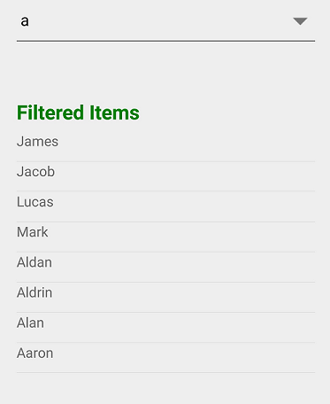

# Dealing with suggestion box

Suggestion box is a drop-down list box, which displays the filtered suggestions inside a popup. This section explains the properties that deals with the drop-down list in SfComboBox control.

## Suggestion box placement mode

Suggestion Box can be placed either at the top or bottom using the `SuggestionBoxPlacement` property. By default, it is placed at the bottom.





<StackLayout VerticalOptions="Center" HorizontalOptions="Center" Padding="30">
    <combobox:SfComboBox HeightRequest="40" SuggestionBoxPlacement="Top" x:Name="comboBox">
        <combobox:SfComboBox.ComboBoxSource>
            <ListCollection:List x:TypeArguments="x:String">
                <x:String> Uganda </x:String>
                <x:String> Ukraine </x:String>
                <x:String> United Arab Emirates </x:String>
                <x:String> United Kingdom </x:String>
                <x:String> United States </x:String>
            </ListCollection:List>
        </combobox:SfComboBox.ComboBoxSource>
    </combobox:SfComboBox>                   
</StackLayout>





StackLayout layout = new StackLayout() 
{ 
    VerticalOptions = LayoutOptions.Start, 
    HorizontalOptions = LayoutOptions.Start, 
    Padding = new Thickness(30) 
};	
List<String> countryNames = new List<String>();
countryNames.Add("Uganda");
countryNames.Add("Ukraine");
countryNames.Add("United Arab Emirates");
countryNames.Add("United Kingdom");
countryNames.Add("United States");

SfComboBox comboBox = new SfComboBox();
comboBox.HeightRequest = 40;
comboBox.ComboBoxSource = countryNames;
comboBox.SuggestionBoxPlacement = SuggestionBoxPlacement.Top;
layout.Children.Add(comboBox); 
Content = layout;





## Maximum suggestion box height

The maximum height of the suggestion box in the SfComboBox control can be varied using the `MaximumDropDownHeight` property.





<StackLayout VerticalOptions="Start" HorizontalOptions="Start" Padding="30">
    <combobox:SfComboBox HeightRequest="40" x:Name="comboBox" MaximumDropDownHeight="100">
        <combobox:SfComboBox.ComboBoxSource>
            <ListCollection:List x:TypeArguments="x:String">
                <x:String> Great Britain </x:String>
                <x:String> Uganda </x:String>
                <x:String> Ukraine </x:String>
                <x:String> Canada </x:String>
                <x:String> United Arab Emirates </x:String>
                <x:String> France </x:String>
                <x:String> United Kingdom </x:String>
                <x:String> China </x:String>
                <x:String> United States </x:String>
                <x:String> Japan </x:String>
            </ListCollection:List>
        </combobox:SfComboBox.ComboBoxSource>
    </combobox:SfComboBox>                           
</StackLayout> 





StackLayout layout = new StackLayout() 
{ 
    VerticalOptions = LayoutOptions.Start, 
    HorizontalOptions = LayoutOptions.Start, 
    Padding = new Thickness(30) 
};

List<String> countryNames = new List<String>();
countryNames.Add("Great Britain");
countryNames.Add("Uganda");
countryNames.Add("Ukraine");
countryNames.Add("Canada");
countryNames.Add("United Arab Emirates");
countryNames.Add("France");
countryNames.Add("United Kingdom");
countryNames.Add("China");
countryNames.Add("United States");
countryNames.Add("Japan");

SfComboBox comboBox = new SfComboBox();
comboBox.HeightRequest = 40;
comboBox.ComboBoxSource = countryNames;
comboBox.MaximumDropDownHeight = 100;
layout.Children.Add(comboBox); 
Content = layout;





## Opening suggestion box on focus

Suggestion box can be shown whenever the control receives focus using the `ShowSuggestionsOnFocus` property. Suggestion list is the complete list of data source.





<StackLayout VerticalOptions="Start" HorizontalOptions="Start" Padding="30">
    <combobox:SfComboBox HeightRequest="40" x:Name="comboBox" ShowSuggestionsOnFocus="true">
        <combobox:SfComboBox.ComboBoxSource>
            <ListCollection:List x:TypeArguments="x:String">
                <x:String> Great Britain </x:String>
                <x:String> Canada </x:String>
                <x:String> France </x:String>
                <x:String> China </x:String>
                <x:String> Japan </x:String>
            </ListCollection:List>
        </combobox:SfComboBox.ComboBoxSource>
    </combobox:SfComboBox>                                       
</StackLayout> 





StackLayout layout = new StackLayout() 
{ 
    VerticalOptions = LayoutOptions.Start, 
    HorizontalOptions = LayoutOptions.Start, 
    Padding = new Thickness(30) 
};	
List<String> countryNames = new List<String>();
countryNames.Add("Great Britain");
countryNames.Add("Canada");
countryNames.Add("France");
countryNames.Add("China");
countryNames.Add("Japan");

SfComboBox comboBox = new SfComboBox();
comboBox.HeightRequest = 40;
comboBox.ComboBoxSource = countryNames;
comboBox.ShowSuggestionsOnFocus = true;
comboBox.IsEditableMode = true;
comboBox.SelectionChanged += (sender, e) => 
{
	DisplayAlert("Selection Changed", "Selected Value: " + comboBox.SelectedValue.ToString(), "OK"); 
};

layout.Children.Add(comboBox); 
Content = layout;





## Delay opening suggestion box

The `PopupDelay` property is used to delay the suggestion box opening process. It gets milliseconds as input in integer data type.
In this example, a time duration of 3 seconds is set to popup delay.





<StackLayout VerticalOptions="StartAndExpand" HorizontalOptions="StartAndExpand" Padding="30">
    <combobox:SfComboBox HeightRequest="40" x:Name="comboBox" PopupDelay="3000">
        <combobox:SfComboBox.ComboBoxSource>
            <ListCollection:List x:TypeArguments="x:String">
                <x:String> Uganda </x:String>
                <x:String> Ukraine </x:String>
                <x:String> United Arab Emirates </x:String>
                <x:String> United Kingdom </x:String>
                <x:String> United States </x:String>
            </ListCollection:List>
        </combobox:SfComboBox.ComboBoxSource>
    </combobox:SfComboBox>                                            
</StackLayout> 





StackLayout layout = new StackLayout() 
{ 
    VerticalOptions = LayoutOptions.Start, 
    HorizontalOptions = LayoutOptions.Start, 
    Padding = new Thickness(30) 
};	
List<String> countryNames = new List<String>();
countryNames.Add("Uganda");
countryNames.Add("Ukraine");
countryNames.Add("United Arab Emirates");
countryNames.Add("United Kingdom");
countryNames.Add("United States");

SfComboBox comboBox = new SfComboBox();
comboBox.HeightRequest = 40;
comboBox.ComboBoxSource = countryNames;
comboBox.PopupDelay = 3000;

layout.Children.Add(comboBox); 
Content = layout;





## Delay before searching algorithm starts

The `SearchDelay` property is used to delay the searching algorithm process. It gets milliseconds as input in integer data type.

In this example, a time duration of 3 seconds is set to search delay.





    <StackLayout VerticalOptions="StartAndExpand" HorizontalOptions="StartAndExpand" Padding="30">
    <combobox:SfComboBox HeightRequest="40" x:Name="comboBox" SearchDelay="3000">
        <combobox:SfComboBox.ComboBoxSource>
            <ListCollection:List x:TypeArguments="x:String">
                <x:String> Uganda </x:String>
                <x:String> Ukraine </x:String>
                <x:String> United Arab Emirates </x:String>
                <x:String> United Kingdom </x:String>
                <x:String> United States </x:String>
            </ListCollection:List>
        </combobox:SfComboBox.ComboBoxSource>
    </combobox:SfComboBox>                                            
</StackLayout> 





    StackLayout layout = new StackLayout() 
    { 
        VerticalOptions = LayoutOptions.Start, 
        HorizontalOptions = LayoutOptions.Start, 
        Padding = new Thickness(30) 
    };	
    List<String> countryNames = new List<String>();
    countryNames.Add("Uganda");
    countryNames.Add("Ukraine");
    countryNames.Add("United Arab Emirates");
    countryNames.Add("United Kingdom");
    countryNames.Add("United States");
    
    SfComboBox comboBox = new SfComboBox();
    comboBox.HeightRequest = 40;
    comboBox.ComboBoxSource = countryNames;
    comboBox.SearchDelay = 3000;
    
    layout.Children.Add(comboBox); 
    Content = layout;





## Avoid opening suggestion box

To avoid the drop down open, you can set the `SuggestionBoxPlacement` API to None.





<StackLayout VerticalOptions="StartAndExpand" HorizontalOptions="StartAndExpand" Padding="30">
    <combobox:SfComboBox HeightRequest="40" x:Name="comboBox" SuggestionBoxPlacement="None">
        <combobox:SfComboBox.ComboBoxSource>
            <ListCollection:List x:TypeArguments="x:String">
                <x:String> Uganda </x:String>
                <x:String> Ukraine </x:String>
                <x:String> United Arab Emirates </x:String>
                <x:String> United Kingdom </x:String>
                <x:String> United States </x:String>
            </ListCollection:List>
        </combobox:SfComboBox.ComboBoxSource>
    </combobox:SfComboBox>                             
</StackLayout> 





StackLayout layout = new StackLayout() 
{ 
    VerticalOptions = LayoutOptions.Start, 
    HorizontalOptions = LayoutOptions.Start, 
    Padding = new Thickness(30) 
};	

List<String> countryNames = new List<String>();
countryNames.Add("Uganda");
countryNames.Add("Ukraine");
countryNames.Add("United Arab Emirates");
countryNames.Add("United Kingdom");
countryNames.Add("United States");

SfComboBox comboBox = new SfComboBox();
comboBox.HeightRequest = 40;
comboBox.SuggestionBoxPlacement = SuggestionBoxPlacement.None;
comboBox.ComboBoxSource = countryNames;
layout.Children.Add(comboBox); 
Content = layout;





## Retrieve the filter suggestion items

There are two ways to get the filtered suggestion items from SfComboBox. 
You can use the [`FilteredItems`](https://help.syncfusion.com/cr/xamarin/Syncfusion.XForms.ComboBox.SfComboBox.html#Syncfusion_XForms_ComboBox_SfComboBox_FilteredItems) API in SfComboBox to access filtered suggestions items. You can get the filtered items when [`IsEditableMode`](https://help.syncfusion.com/cr/xamarin/Syncfusion.XForms.ComboBox.SfComboBox.html#Syncfusion_XForms_ComboBox_SfComboBox_IsEditableMode) is true and [`AllowFiltering`](https://help.syncfusion.com/cr/xamarin/Syncfusion.XForms.ComboBox.SfComboBox.html#Syncfusion_XForms_ComboBox_SfComboBox_AllowFiltering) is true.





<?xml version="1.0" encoding="utf-8" ?>
<ContentPage xmlns="http://xamarin.com/schemas/2014/forms"
             xmlns:x="http://schemas.microsoft.com/winfx/2009/xaml"
             xmlns:local="clr-namespace:SfComboBox_Sample"
             xmlns:d="http://xamarin.com/schemas/2014/forms/design"
             xmlns:mc="http://schemas.openxmlformats.org/markup-compatibility/2006"
             mc:Ignorable="d"
             xmlns:combobox="clr-namespace:Syncfusion.XForms.ComboBox;assembly=Syncfusion.SfComboBox.XForms"
             x:Class="SfComboBox_Sample.MainPage">
    <ContentPage.BindingContext>
        <local:EmployeeViewModel/>
    </ContentPage.BindingContext>
    <StackLayout VerticalOptions="StartAndExpand" 
                 HorizontalOptions="StartAndExpand" 
                 Padding="30">
        <combobox:SfComboBox HeightRequest="40" 
                             x:Name="comboBox" 
                             IsEditableMode="True" 
                             AllowFiltering="True" 
                             SuggestionMode="Contains"
                             SuggestionBoxPlacement="None"
                             DisplayMemberPath="Name"
                             DataSource="{Binding EmployeeCollection}"
                             FilteredItems="{Binding Items,Mode=TwoWay}"/>
        <StackLayout Orientation="Vertical" Margin="0,50,0,0">
            <Label Text="Filtered Items" 
               FontSize="20" 
               FontAttributes="Bold" 
               TextColor="Green"/>
            <ListView 
            x:Name="MainListView" 
            ItemsSource="{Binding Items}"
            RowHeight="30">
                <ListView.ItemTemplate>
                    <DataTemplate>
                        <ViewCell>
                            <StackLayout Orientation="Horizontal">
                                <Label Text="{Binding Name}" />
                            </StackLayout>
                        </ViewCell>
                    </DataTemplate>
                </ListView.ItemTemplate>
            </ListView>
        </StackLayout>
    </StackLayout>
</ContentPage>





using Syncfusion.XForms.ComboBox;
using System;
using System.Collections.Generic;
using System.Collections.ObjectModel;
using System.ComponentModel;
using System.Runtime.CompilerServices;
using Xamarin.Forms;

namespace SfComboBox_Sample
{
    public partial class MainPage : ContentPage
    {
        public MainPage()
        {
            InitializeComponent();
            EmployeeViewModel viewModel = new EmployeeViewModel();
            this.BindingContext = viewModel;
            StackLayout stackLayout = new StackLayout()
            {
                VerticalOptions = LayoutOptions.Start,
                HorizontalOptions = LayoutOptions.Start,
                Padding = new Thickness(30)
            };

            SfComboBox comboBox = new SfComboBox()
            {
                HeightRequest = 40,
                WidthRequest = 100,
                IsEditableMode = true,
                AllowFiltering = true,
                DisplayMemberPath = "Name",
                SuggestionBoxPlacement = SuggestionBoxPlacement.None,
                SuggestionMode = SuggestionMode.Contains,
                DataSource = viewModel.EmployeeCollection
            };

            Binding filteredItemsBinding  = new Binding();
            filteredItemsBinding .Source = viewModel;
            filteredItemsBinding .Path = "Items";
            filteredItemsBinding .Mode = BindingMode.TwoWay;
            comboBox.SetBinding(SfComboBox.FilteredItemsProperty, filteredItemsBinding);
            StackLayout stack = new StackLayout()
            {
                Orientation = StackOrientation.Vertical,
                Margin = new Thickness(0, 50, 0, 0)
            };

            Label filteredItemsLabel  = new Label()
            {
                Text = "Filtered Items",
                FontSize = 20,
                FontAttributes = FontAttributes.Bold,
                TextColor = Color.Green
            };

            ListView MainListView = new ListView()
            {
                RowHeight = 30
            };

            Binding itemSource_binding  = new Binding();
            itemSource_binding.Source = viewModel;
            itemSource_binding.Path = "Items";
            MainListView.SetBinding(ListView.ItemsSourceProperty, itemSource_binding);

            DataTemplate itemTemplate = new DataTemplate(() =>
            {
                StackLayout layout = new StackLayout()
                {
                    Orientation = StackOrientation.Horizontal
                };

                Label nameLabel = new Label();
                nameLabel.SetBinding(Label.TextProperty, "Name");
                layout.Children.Add(nameLabel);

                return new ViewCell { View = layout };
            });

            MainListView.ItemTemplate = itemTemplate;

            stack.Children.Add(filteredItemsLabel );
            stack.Children.Add(MainListView);
            stackLayout.Children.Add(comboBox);
            stackLayout.Children.Add(stack);
            this.Content = stackLayout;
        }
    }

    public class Employee
    {
        private int id;
        public int ID
        {
            get { return id; }
            set { id = value; }
        }
        private string name;
        public string Name
        {
            get { return name; }
            set { name = value; }
        }
    }

    public class EmployeeViewModel : INotifyPropertyChanged
    {
        private IEnumerable<object> items;

        public IEnumerable<object> Items
        {
            get { return items; }
            set
            {
                items = value;
                NotifyPropertyChanged();
            }
        }

        public event PropertyChangedEventHandler PropertyChanged;

        private void NotifyPropertyChanged([CallerMemberName] String propertyName = "")
        {
            if (PropertyChanged != null)
            {
                PropertyChanged(this, new PropertyChangedEventArgs(propertyName));
            }
        }

        private ObservableCollection<Employee> employeeCollection;
        public ObservableCollection<Employee> EmployeeCollection
        {
            get { return employeeCollection; }
            set { employeeCollection = value; }
        }
        public EmployeeViewModel()
        {
            employeeCollection = new ObservableCollection<Employee>();
            employeeCollection.Add(new Employee() { ID = 1, Name = "Eric" });
            employeeCollection.Add(new Employee() { ID = 2, Name = "James" });
            employeeCollection.Add(new Employee() { ID = 3, Name = "Jacob" });
            employeeCollection.Add(new Employee() { ID = 4, Name = "Lucas" });
            employeeCollection.Add(new Employee() { ID = 5, Name = "Mark" });
            employeeCollection.Add(new Employee() { ID = 6, Name = "Aldan" });
            employeeCollection.Add(new Employee() { ID = 7, Name = "Aldrin" });
            employeeCollection.Add(new Employee() { ID = 8, Name = "Alan" });
            employeeCollection.Add(new Employee() { ID = 9, Name = "Aaron" });
        }
    }
}




The other way to get a filtered suggestion item is an event called [`FilterCollectionChanged`](https://help.syncfusion.com/cr/xamarin/Syncfusion.XForms.ComboBox.SfComboBox.html). This event is triggered when the SfComboBox suggestions have been changed. You can get the filtered items from the [`FilterCollectionChanged`](https://help.syncfusion.com/cr/xamarin/Syncfusion.XForms.ComboBox.SfComboBox.html)   event value argument.

<table>
<tr>
<th>Members</th>
<th>Description</th>
</tr>
<tr>
<td>Value</td>
<td>Shows filtered items in SfComboBox control.</td>
</tr>
</table>

The following code snippet describes how to trigger an event called [`FilterCollectionChanged`](https://help.syncfusion.com/cr/xamarin/Syncfusion.XForms.ComboBox.SfComboBox.html).





<?xml version="1.0" encoding="utf-8" ?>
<ContentPage xmlns="http://xamarin.com/schemas/2014/forms"
             xmlns:x="http://schemas.microsoft.com/winfx/2009/xaml"
             xmlns:local="clr-namespace:SfComboBox_Sample"
             xmlns:d="http://xamarin.com/schemas/2014/forms/design"
             xmlns:mc="http://schemas.openxmlformats.org/markup-compatibility/2006"
             mc:Ignorable="d"
             xmlns:combobox="clr-namespace:Syncfusion.XForms.ComboBox;assembly=Syncfusion.SfComboBox.XForms"
             x:Class="SfComboBox_Sample.MainPage">
    <ContentPage.BindingContext>
        <local:EmployeeViewModel/>
    </ContentPage.BindingContext>
    <StackLayout VerticalOptions="StartAndExpand" 
                 HorizontalOptions="StartAndExpand" 
                 Padding="30">
        <combobox:SfComboBox HeightRequest="40" 
                             x:Name="comboBox" 
                             IsEditableMode="True" 
                             AllowFiltering="True" 
                             SuggestionMode="Contains"
                             SuggestionBoxPlacement="None"
                             DisplayMemberPath="Name"
                             DataSource="{Binding EmployeeCollection}"
                             FilteredItems="{Binding Items,Mode=TwoWay}"
                             FilterCollectionChanged="ComboBox_FilterCollectionChanged"/>
        <StackLayout Orientation="Vertical" Margin="0,50,0,0">
            <Label Text="Filtered Items" 
               FontSize="20" 
               FontAttributes="Bold" 
               TextColor="Green"/>
            <ListView 
            x:Name="MainListView" 
            RowHeight="30">
                <ListView.ItemTemplate>
                    <DataTemplate>
                        <ViewCell>
                            <StackLayout Orientation="Horizontal">
                                <Label Text="{Binding Name}" />
                            </StackLayout>
                        </ViewCell>
                    </DataTemplate>
                </ListView.ItemTemplate>
            </ListView>
        </StackLayout>
    </StackLayout>
</ContentPage>





using Syncfusion.XForms.ComboBox;
using System;
using System.Collections;
using System.Collections.Generic;
using System.Collections.ObjectModel;
using System.ComponentModel;
using System.Runtime.CompilerServices;
using Xamarin.Forms;

namespace SfComboBox_Sample
{
    public partial class MainPage : ContentPage
    {
        ListView MainListView;
        public MainPage()
        {
            InitializeComponent();
            EmployeeViewModel viewModel = new EmployeeViewModel();
            this.BindingContext = viewModel;
            StackLayout stackLayout = new StackLayout()
            {
                VerticalOptions = LayoutOptions.Start,
                HorizontalOptions = LayoutOptions.Start,
                Padding = new Thickness(30)
            };

            SfComboBox comboBox = new SfComboBox()
            {
                HeightRequest = 40,
                WidthRequest = 100,
                IsEditableMode = true,
                AllowFiltering = true,
                DisplayMemberPath = "Name",
                SuggestionBoxPlacement = SuggestionBoxPlacement.None,
                SuggestionMode = SuggestionMode.Contains,
                DataSource = viewModel.EmployeeCollection
            };

            comboBox.FilterCollectionChanged += ComboBox_FilterCollectionChanged;
            Binding filteredItemsBinding  = new Binding();
            filteredItemsBinding .Source = viewModel;
            filteredItemsBinding .Path = "Items";
            filteredItemsBinding .Mode = BindingMode.TwoWay;
            comboBox.SetBinding(SfComboBox.FilteredItemsProperty, filteredItemsBinding );
            StackLayout stack = new StackLayout()
            {
                Orientation = StackOrientation.Vertical,
                Margin = new Thickness(0, 50, 0, 0)
            };

            Label filteredItemsLabel  = new Label()
            {
                Text = "Filtered Items",
                FontSize = 20,
                FontAttributes = FontAttributes.Bold,
                TextColor = Color.Green
            };

            MainListView = new ListView()
            {
                RowHeight = 30
            };

            DataTemplate itemTemplate = new DataTemplate(() =>
            {
                StackLayout layout = new StackLayout()
                {
                    Orientation = StackOrientation.Horizontal
                };

                Label nameLabel = new Label();
                nameLabel.SetBinding(Label.TextProperty, "Name");
                layout.Children.Add(nameLabel);

                return new ViewCell { View = layout };
            });

            MainListView.ItemTemplate = itemTemplate;

            stack.Children.Add(filteredItemsLabel );
            stack.Children.Add(MainListView);
            stackLayout.Children.Add(comboBox);
            stackLayout.Children.Add(stack);
            this.Content = stackLayout;
        }
        private void ComboBox_FilterCollectionChanged(object sender, FilterCollectionChangedEventArgs e)
        {
            MainListView.ItemsSource = (IEnumerable)e.Value;
        }
    }

    public class Employee
    {
        private int id;
        public int ID
        {
            get { return id; }
            set { id = value; }
        }
        private string name;
        public string Name
        {
            get { return name; }
            set { name = value; }
        }
    }

    public class EmployeeViewModel : INotifyPropertyChanged
    {
        private IEnumerable<object> items;

        public IEnumerable<object> Items
        {
            get { return items; }
            set
            {
                items = value;
                NotifyPropertyChanged();
            }
        }

        public event PropertyChangedEventHandler PropertyChanged;

        private void NotifyPropertyChanged([CallerMemberName] String propertyName = "")
        {
            if (PropertyChanged != null)
            {
                PropertyChanged(this, new PropertyChangedEventArgs(propertyName));
            }
        }

        private ObservableCollection<Employee> employeeCollection;
        public ObservableCollection<Employee> EmployeeCollection
        {
            get { return employeeCollection; }
            set { employeeCollection = value; }
        }
        public EmployeeViewModel()
        {
            employeeCollection = new ObservableCollection<Employee>();
            employeeCollection.Add(new Employee() { ID = 1, Name = "Eric" });
            employeeCollection.Add(new Employee() { ID = 2, Name = "James" });
            employeeCollection.Add(new Employee() { ID = 3, Name = "Jacob" });
            employeeCollection.Add(new Employee() { ID = 4, Name = "Lucas" });
            employeeCollection.Add(new Employee() { ID = 5, Name = "Mark" });
            employeeCollection.Add(new Employee() { ID = 6, Name = "Aldan" });
            employeeCollection.Add(new Employee() { ID = 7, Name = "Aldrin" });
            employeeCollection.Add(new Employee() { ID = 8, Name = "Alan" });
            employeeCollection.Add(new Employee() { ID = 9, Name = "Aaron" });
        }
    }
}





