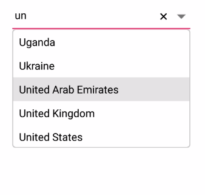
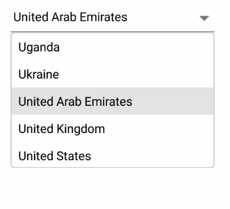

# ComboBox modes

The combo box control supports both editable and non-editable text box to choose selected items in given data source. Users can select one item from the suggestion list. 

`IsEditableMode` property is used to enable the user input in SfComboBox control. The default value is false.

## Editable combo box

In editable mode, the combo box allows users to edit in the text box that shows the suggestions in drop-down list based on the input.





<StackLayout VerticalOptions="Start" HorizontalOptions="Start" Padding="30">
    <combobox:SfComboBox HeightRequest="40" x:Name="comboBox" IsEditableMode="true"> 
        <combobox:SfComboBox.DataSource>
            <ListCollection:List x:TypeArguments="x:String">
                <x:String> Uganda </x:String>
                <x:String> Ukraine </x:String>
                <x:String> United Arab Emirates </x:String>
                <x:String> United Kingdom </x:String>
                <x:String> United States </x:String>
            </ListCollection:List>
        </combobox:SfComboBox.DataSource>
    </combobox:SfComboBox>                     
</StackLayout> 
		  



	
StackLayout layout = new StackLayout() 
{ 
    VerticalOptions = LayoutOptions.Start, 
    HorizontalOptions = LayoutOptions.Start, 
    Padding = new Thickness(30) 
};	
List<String> countryNames = new List<String>();
countryNames.Add("Uganda");
countryNames.Add("Ukraine");
countryNames.Add("United Arab Emirates");
countryNames.Add("United Kingdom");
countryNames.Add("United States");

SfComboBox comboBox = new SfComboBox();
comboBox.HeightRequest = 40;
comboBox.DataSource = countryNames;
comboBox.IsEditableMode = true;
layout.Children.Add(comboBox); 
Content = layout;
	 




## Non-Editable combo box

Non-editable mode prevents users from typing and allows them to select from drop-down list.





<StackLayout VerticalOptions="Start" HorizontalOptions="Start" Padding="30">
    <combobox:SfComboBox HeightRequest="40" x:Name="comboBox" IsEditableMode="false">
        <combobox:SfComboBox.DataSource>
            <ListCollection:List x:TypeArguments="x:String">
                 <x:String> Uganda </x:String>
                 <x:String> Ukraine </x:String>
                 <x:String> United Arab Emirates </x:String>
                 <x:String> United Kingdom </x:String>
                 <x:String> United States </x:String>
             </ListCollection:List>
        </combobox:SfComboBox.DataSource>
    </combobox:SfComboBox>                        
</StackLayout> 
		  



	
StackLayout layout = new StackLayout() 
{ 
    VerticalOptions = LayoutOptions.Start, 
    HorizontalOptions = LayoutOptions.Start, 
    Padding = new Thickness(30) 
};	

List<String> countryNames = new List<String>();
countryNames.Add("Uganda");
countryNames.Add("Ukraine");
countryNames.Add("United Arab Emirates");
countryNames.Add("United Kingdom");
countryNames.Add("United States");

SfComboBox comboBox = new SfComboBox();
comboBox.HeightRequest = 40;
comboBox.DataSource = countryNames;
comboBox.IsEditableMode = false;
layout.Children.Add(comboBox); 
Content = layout;
	 




