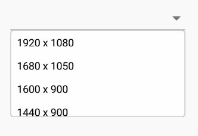
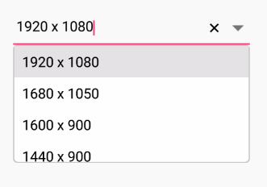
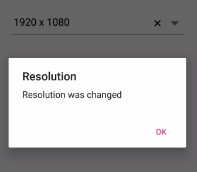

# Getting Started with Xamarin ComboBox (SfComboBox)

This section explains the steps required to create the [Xamarin ComboBox](https://www.syncfusion.com/xamarin-ui-controls/xamarin-combobox) control, populate it with data and filter the suggestions. This section covers only the minimal features that are needed to get started with the control.

## Assembly deployment

After installing [Essential Studio for Xamarin](https://www.syncfusion.com/downloads/xamarin/confirm), you can find all the required assemblies in the installation folders, {Syncfusion Essential Studio Installed location} \Essential Studio\\{Version #}\Xamarin\lib.

E.g.: C:\Program Files (x86) \Syncfusion\Essential Studio\19.1.0.54\Xamarin\lib

N> Assemblies can be found in unzipped package location(Documents/Syncfusion/{Version #}/Xamarin/lib) in Mac.

## Adding SfComboBox reference

You can add [`SfComboBox`](https://help.syncfusion.com/cr/xamarin/Syncfusion.XForms.ComboBox.SfComboBox.html) reference using one of the following methods:

**Method 1: Adding SfComboBox reference from nuget.org**

Syncfusion Xamarin components are available in [nuget.org](https://www.nuget.org/). To add [`SfComboBox`](https://help.syncfusion.com/cr/xamarin/Syncfusion.XForms.ComboBox.SfComboBox.html) to your project, open the NuGet package manager in Visual Studio, search for [Syncfusion.Xamarin.SfComboBox](https://www.nuget.org/packages/Syncfusion.Xamarin.SfComboBox), and then install it.

N> Install the same version of [`SfComboBox`](https://help.syncfusion.com/cr/xamarin/Syncfusion.XForms.ComboBox.SfComboBox.html) NuGet in all the projects.

**Method 2: Adding SfComboBox reference from toolbox**

Syncfusion also provides Xamarin Toolbox. Using this toolbox, you can drag the [`SfComboBox`](https://help.syncfusion.com/cr/xamarin/Syncfusion.XForms.ComboBox.SfComboBox.html) control to the XAML page. It will automatically install the required NuGet packages and add the namespace to the page. To install Syncfusion Xamarin Toolbox, refer to [Toolbox](https://help.syncfusion.com/xamarin/utility#toolbox).

**Method 3: Adding SfComboBox assemblies manually from the installed location**

If you prefer to manually reference the assemblies instead referencing from NuGet, add the following assemblies in respective projects.

Location: {Installed location}/{version}/Xamarin/lib

<table>
<tr>
<td>PCL</td>
<td>Syncfusion.SfComboBox.XForms.dll Syncfusion.Core.XForms.dll Syncfusion.Licensing.dll </td>
</tr>
<tr>
<td>Android</td>
<td>Syncfusion.SfComboBox.XForms.dll Syncfusion.SfComboBox.XForms.Android.dll Syncfusion.Core.XForms.dll Syncfusion.Core.XForms.Android.dll Syncfusion.Licensing.dll </td>
</tr>
<tr>
<td>iOS</td>
<td>Syncfusion.SfComboBox.XForms.dll Syncfusion.SfComboBox.XForms.iOS.dll Syncfusion.Core.XForms.dll Syncfusion.Core.XForms.iOS.dll Syncfusion.Licensing.dll </td>
</tr>
<tr>
<td>UWP</td>
<td>Syncfusion.SfComboBox.XForms.dll Syncfusion.SfComboBox.XForms.UWP.dll Syncfusion.Core.XForms.dll Syncfusion.Core.XForms.UWP.dll Syncfusion.Licensing.dll </td>
</tr>
</table>

N> To know more about obtaining our components, refer to these links for [Mac](https://help.syncfusion.com/xamarin/introduction/download-and-installation/mac/) and [Windows](https://help.syncfusion.com/xamarin/introduction/download-and-installation/windows/).

I> Starting with v16.2.0.x, if you reference Syncfusion assemblies from the trial setup or from the NuGet feed, you also have to include a license key in your projects. Please refer to [Syncfusion license key](https://help.syncfusion.com/common/essential-studio/licensing/license-key/) to know about registering Syncfusion license key in your Xamarin application to use our components.

N> If you are adding the references from toolbox, this step is not needed.

### Additional Step for iOS

To launch the [`SfComboBox`](https://help.syncfusion.com/cr/xamarin/Syncfusion.XForms.ComboBox.SfComboBox.html) in iOS, call the `SfComboBoxRenderer.Init()` in the `FinishedLaunching` overridden method of the AppDelegate class after the Xamarin.Forms Framework has been initialized and before the LoadApplication is called, as demonstrated in the following code example.


public override bool FinishedLaunching(UIApplication app, NSDictionary options)
{
    …
    global::Xamarin.Forms.Forms.Init ();
    Syncfusion.XForms.iOS.ComboBox.SfComboBoxRenderer.Init();
    LoadApplication (new App ());
    …
}


### Additional step for UWP

This step is required only if the application is deployed in release mode with .NET native tool chain enabled. This is for resolving the known Framework issue “Custom controls not rendering in Release mode” in UWP platform. Initializing the [`SfComboBox`](https://help.syncfusion.com/cr/xamarin/Syncfusion.XForms.ComboBox.SfComboBox.html) assembly at OnLaunched overridden method of the App class in UWP project is the suggested workaround. The following code example show to resolve this issue.



protected override void OnLaunched(LaunchActivatedEventArgs e)
{
#if DEBUG
if (System.Diagnostics.Debugger.IsAttached)
{
	this.DebugSettings.EnableFrameRateCounter = true;
}
#endif

Frame rootFrame = Window.Current.Content as Frame; 
if (rootFrame == null)
{
	rootFrame = new Frame();
	rootFrame.NavigationFailed += OnNavigationFailed;                
	List<System.Reflection.Assembly> assembliesToInclude = new List<System.Reflection.Assembly>();
	// Add all the renderer assemblies your app uses 
	assembliesToInclude.Add(typeof(Syncfusion.XForms.UWP.ComboBox.SfComboBoxRenderer).GetTypeInfo().Assembly);
	// Replace the Xamarin.Forms.Forms.Init(e);        
	Xamarin.Forms.Forms.Init(e, assembliesToInclude);
	if (e.PreviousExecutionState == ApplicationExecutionState.Terminated)
	{
		//TODO: Load state from previously suspended application
	}
	// Place the frame in the current Window
	Window.Current.Content = rootFrame;
}
if (rootFrame.Content == null)
{
	// When the navigation stack isn't restored navigate to the first page,
	// configuring the new page by passing required information as a navigation
	// parameter
	rootFrame.Navigate(typeof(MainPage), e.Arguments);
}
// Ensure the current window is active
Window.Current.Activate();
}



## Initializing ComboBox 

Import the [`SfComboBox`](https://help.syncfusion.com/cr/xamarin/Syncfusion.XForms.ComboBox.SfComboBox.html) namespace in respective page as shown in the following code.





xmlns:combobox="clr-namespace:Syncfusion.XForms.ComboBox;assembly=Syncfusion.SfComboBox.XForms"





using Syncfusion.XForms.ComboBox;





Then initialize an empty combobox as shown in the following code,





<ContentPage xmlns="http://xamarin.com/schemas/2014/forms" 
             xmlns:x="http://schemas.microsoft.com/winfx/2009/xaml" 
             xmlns:combobox="clr-namespace:Syncfusion.XForms.ComboBox;assembly=Syncfusion.SfComboBox.XForms"
             xmlns:local="clr-namespace:NamespaceName"            
             x:Class="NamespaceName.ClassName">
	<StackLayout VerticalOptions="Start" HorizontalOptions="Start" Padding="30">
		<combobox:SfComboBox HeightRequest="40" x:Name="comboBox"/>
	</StackLayout> 
</ContentPage>
	




StackLayout layout = new StackLayout()
{ 
    VerticalOptions = LayoutOptions.Start, 
    HorizontalOptions = LayoutOptions.Start,
    Padding = new Thickness(30) 
};
SfComboBox comboBox = new SfComboBox();
comboBox.HeightRequest = 40;

layout.Children.Add(comboBox);
Content = layout;





## Populating ComboBox with data

Now, a list of string with resolution list is created and added to the [`SfComboBox`](https://help.syncfusion.com/cr/xamarin/Syncfusion.XForms.ComboBox.SfComboBox.html) data source property. This list is populated as suggestion list by setting the [   [`'DataSource'`](https://help.syncfusion.com/cr/xamarin/Syncfusion.XForms.ComboBox.SfComboBox.html#Syncfusion_XForms_ComboBox_SfComboBox_DataSource) property based on text entry. You can customize the drop-down height using the [`MaximumDropDownHeight`](https://help.syncfusion.com/cr/xamarin/Syncfusion.XForms.ComboBox.SfComboBox.html#Syncfusion_XForms_ComboBox_SfComboBox_MaximumDropDownHeight) property. Add the [`DataSource`](https://help.syncfusion.com/cr/xamarin/Syncfusion.XForms.ComboBox.SfComboBox.html#Syncfusion_XForms_ComboBox_SfComboBox_DataSource) for the [`SfComboBox`](https://help.syncfusion.com/cr/xamarin/Syncfusion.XForms.ComboBox.SfComboBox.html) as shown in the following code.





<ContentPage xmlns="http://xamarin.com/schemas/2014/forms" 
             xmlns:x="http://schemas.microsoft.com/winfx/2009/xaml" 
             xmlns:ListCollection="clr-namespace:System.Collections.Generic;assembly=netstandard"
             xmlns:combobox="clr-namespace:Syncfusion.XForms.ComboBox;assembly=Syncfusion.SfComboBox.XForms"
             xmlns:local="clr-namespace:NamespaceName"            
             x:Class="NamespaceName.ClassName">
	<StackLayout VerticalOptions="Start" HorizontalOptions="Start" Padding="30">
            <combobox:SfComboBox HeightRequest="40" x:Name="comboBox">
                <combobox:SfComboBox.ComboBoxSource>
                    <ListCollection:List x:TypeArguments="x:String">
                	<x:String> 1920 x 1080 </x:String>
                	<x:String> 1680 x 1050 </x:String>
                	<x:String> 1600 x 900 </x:String>
                	<x:String> 1440 x 900 </x:String>
                	<x:String> 1400 x 1050 </x:String>
                       <x:String> 1366 x 768 </x:String>
                	<x:String> 1360 x 768 </x:String>
                	<x:String> 1280 x 1024 </x:String>
                       <x:String> 1280 x 960 </x:String>
                	<x:String> 1280 x 720 </x:String>
                	<x:String> 854 x 480 </x:String>
                       <x:String> 800 x 480 </x:String>
                	<x:String> 480 X 640 </x:String>
                	<x:String> 480 x 320 </x:String>
                       <x:String> 432 x 240 </x:String>
                       <x:String> 360 X 640 </x:String>
                       <x:String> 320 x 240 </x:String>
            	</ListCollection:List>
            </combobox:SfComboBox.ComboBoxSource>
        </combobox:SfComboBox>              
    </StackLayout> 
</ContentPage>
	




StackLayout layout = new StackLayout() 
{ 
    VerticalOptions = LayoutOptions.Start, 
    HorizontalOptions = LayoutOptions.Start, 
    Padding = new Thickness(30) 
};	    
List<String> resolutionList = new List<String>();
resolutionList.Add("1920 x 1080");
resolutionList.Add("1680 x 1050");
resolutionList.Add("1600 x 900");
resolutionList.Add("1440 x 900");
resolutionList.Add("1400 x 1050");
resolutionList.Add("1366 x 768");
resolutionList.Add("1360 x 768");
resolutionList.Add("1280 x 1024");
resolutionList.Add("1280 x 960");
resolutionList.Add("1280 x 720");
resolutionList.Add("854 x 480");
resolutionList.Add("800 x 480");
resolutionList.Add("480 X 640");
resolutionList.Add("480 x 320");
resolutionList.Add("432 x 240");
resolutionList.Add("360 X 640");
resolutionList.Add("320 x 240");

SfComboBox comboBox = new SfComboBox();
comboBox.HeightRequest = 40;
comboBox.ComboBoxSource = resolutionList;

layout.Children.Add(comboBox); 
Content = layout;





Refer [this](https://help.syncfusion.com/xamarin/combobox/populating-data) link to learn more about the options available in SfComboBox to populate data.

## ComboBox modes

The Xamarin ComboBox control supports both editable and non-editable text boxes to choose selected items in given data source. You can select an item from the suggestion list.

N > The default value of the [`IsEditableMode`](https://help.syncfusion.com/cr/xamarin/Syncfusion.XForms.ComboBox.SfComboBox.html#Syncfusion_XForms_ComboBox_SfComboBox_IsEditableMode) property is false. 

### Non-editable combo box

Non-editable mode prevents users from typing and allows them to select items from the drop-down list. In non-editable mode, the suggestion box can be displayed by clicking the control or drop-down button.





	<StackLayout VerticalOptions="Start" HorizontalOptions="Start" Padding="30">
        <combobox:SfComboBox HeightRequest="40" x:Name="comboBox" MaximumDropDownHeight="200" IsEditableMode="false">
            <combobox:SfComboBox.ComboBoxSource>
                <ListCollection:List x:TypeArguments="x:String">
                    <x:String> 1920 x 1080 </x:String>
                    <x:String> 1680 x 1050 </x:String>
                    <x:String> 1600 x 900 </x:String>
                    <x:String> 1440 x 900 </x:String>
                    <x:String> 1400 x 1050 </x:String>
                    <x:String> 1366 x 768 </x:String>
                    <x:String> 1360 x 768 </x:String>
                    <x:String> 1280 x 1024 </x:String>
                    <x:String> 1280 x 960 </x:String>
                    <x:String> 1280 x 720 </x:String>
                    <x:String> 854 x 480 </x:String>
                    <x:String> 800 x 480 </x:String>
                    <x:String> 480 X 640 </x:String>
                    <x:String> 480 x 320 </x:String>
                    <x:String> 432 x 240 </x:String>
                    <x:String> 360 X 640 </x:String>
                    <x:String> 320 x 240 </x:String>
                </ListCollection:List>
            </combobox:SfComboBox.ComboBoxSource>
	 	</combobox:SfComboBox>              
	</StackLayout> 
	




StackLayout layout = new StackLayout() 
{ 
    VerticalOptions = LayoutOptions.Start, 
    HorizontalOptions = LayoutOptions.Start, 
    Padding = new Thickness(30) 
};	    
List<String> resolutionList = new List<String>();
resolutionList.Add("1920 x 1080");
resolutionList.Add("1680 x 1050");
resolutionList.Add("1600 x 900");
resolutionList.Add("1440 x 900");
resolutionList.Add("1400 x 1050");
resolutionList.Add("1366 x 768");
resolutionList.Add("1360 x 768");
resolutionList.Add("1280 x 1024");
resolutionList.Add("1280 x 960");
resolutionList.Add("1280 x 720");
resolutionList.Add("854 x 480");
resolutionList.Add("800 x 480");
resolutionList.Add("480 X 640");
resolutionList.Add("480 x 320");
resolutionList.Add("432 x 240");
resolutionList.Add("360 X 640");
resolutionList.Add("320 x 240");

SfComboBox comboBox = new SfComboBox();
comboBox.HeightRequest = 40;
comboBox.MaximumDropDownHeight = 200;
comboBox.IsEditableMode = false;
comboBox.ComboBoxSource = resolutionList;

layout.Children.Add(comboBox); 
Content = layout;





### Editable combo box

In editable mode, the combo box allows users to edit in the text box that shows suggestions in drop-down list based on the input. With the previous codes, the [`‘IsEditableMode’`](https://help.syncfusion.com/cr/xamarin/Syncfusion.XForms.ComboBox.SfComboBox.html#Syncfusion_XForms_ComboBox_SfComboBox_IsEditableMode) property can be set to true. This helps users to edit the combo box control.





	<StackLayout VerticalOptions="Start" HorizontalOptions="Start" Padding="30">
        <combobox:SfComboBox HeightRequest="40" x:Name="comboBox" MaximumDropDownHeight="200" IsEditableMode="true">
            <combobox:SfComboBox.ComboBoxSource>
                <ListCollection:List x:TypeArguments="x:String">
                    <x:String> 1920 x 1080 </x:String>
                    <x:String> 1680 x 1050 </x:String>
                    <x:String> 1600 x 900 </x:String>
                    <x:String> 1440 x 900 </x:String>
                    <x:String> 1400 x 1050 </x:String>
                    <x:String> 1366 x 768 </x:String>
                    <x:String> 1360 x 768 </x:String>
                    <x:String> 1280 x 1024 </x:String>
                    <x:String> 1280 x 960 </x:String>
                    <x:String> 1280 x 720 </x:String>
                    <x:String> 854 x 480 </x:String>
                    <x:String> 800 x 480 </x:String>
                    <x:String> 480 X 640 </x:String>
                    <x:String> 480 x 320 </x:String>
                    <x:String> 432 x 240 </x:String>
                    <x:String> 360 X 640 </x:String>
                    <x:String> 320 x 240 </x:String>
                </ListCollection:List>
            </combobox:SfComboBox.ComboBoxSource>
        </combobox:SfComboBox>              
	</StackLayout> 
	




StackLayout layout = new StackLayout() 
{ 
    VerticalOptions = LayoutOptions.Start, 
    HorizontalOptions = LayoutOptions.Start, 
    Padding = new Thickness(30) 
};	    
List<String> resolutionList = new List<String>();
resolutionList.Add("1920 x 1080");
resolutionList.Add("1680 x 1050");
resolutionList.Add("1600 x 900");
resolutionList.Add("1440 x 900");
resolutionList.Add("1400 x 1050");
resolutionList.Add("1366 x 768");
resolutionList.Add("1360 x 768");
resolutionList.Add("1280 x 1024");
resolutionList.Add("1280 x 960");
resolutionList.Add("1280 x 720");
resolutionList.Add("854 x 480");
resolutionList.Add("800 x 480");
resolutionList.Add("480 X 640");
resolutionList.Add("480 x 320");
resolutionList.Add("432 x 240");
resolutionList.Add("360 X 640");
resolutionList.Add("320 x 240");

SfComboBox comboBox = new SfComboBox();
comboBox.HeightRequest = 40;
comboBox.MaximumDropDownHeight = 200;
comboBox.IsEditableMode = true;
comboBox.ComboBoxSource = resolutionList;

layout.Children.Add(comboBox); 
Content = layout;





## Retrieving selected values

When selecting an item from the drop-down list, the selection changed event will be called. Using the following code snippet, a dialogue box will be displayed when a new item is selected from the suggestion box.





	<StackLayout VerticalOptions="Start" HorizontalOptions="Start" Padding="30">
        <combobox:SfComboBox HeightRequest="40" x:Name="comboBox" MaximumDropDownHeight="200" IsEditableMode="true" SelectionChanged="ComboBox_SelectionChanged">
            <combobox:SfComboBox.ComboBoxSource>
                <ListCollection:List x:TypeArguments="x:String">
                    <x:String> 1920 x 1080 </x:String>
                    <x:String> 1680 x 1050 </x:String>
                    <x:String> 1600 x 900 </x:String>
                    <x:String> 1440 x 900 </x:String>
                    <x:String> 1400 x 1050 </x:String>
                    <x:String> 1366 x 768 </x:String>
                    <x:String> 1360 x 768 </x:String>
                    <x:String> 1280 x 1024 </x:String>
                    <x:String> 1280 x 960 </x:String>
                    <x:String> 1280 x 720 </x:String>
                    <x:String> 854 x 480 </x:String>
                    <x:String> 800 x 480 </x:String>
                    <x:String> 480 X 640 </x:String>
                    <x:String> 480 x 320 </x:String>
                    <x:String> 432 x 240 </x:String>
                    <x:String> 360 X 640 </x:String>
                    <x:String> 320 x 240 </x:String>
                </ListCollection:List>
            </combobox:SfComboBox.ComboBoxSource>
        </combobox:SfComboBox>              
	</StackLayout> 
	




StackLayout layout = new StackLayout() 
{ 
    VerticalOptions = LayoutOptions.Start, 
    HorizontalOptions = LayoutOptions.Start, 
    Padding = new Thickness(30) 
};	    

List<String> resolutionList = new List<String>();
resolutionList.Add("1920 x 1080");
resolutionList.Add("1680 x 1050");
resolutionList.Add("1600 x 900");
resolutionList.Add("1440 x 900");
resolutionList.Add("1400 x 1050");
resolutionList.Add("1366 x 768");
resolutionList.Add("1360 x 768");
resolutionList.Add("1280 x 1024");
resolutionList.Add("1280 x 960");
resolutionList.Add("1280 x 720");
resolutionList.Add("854 x 480");
resolutionList.Add("800 x 480");
resolutionList.Add("480 X 640");
resolutionList.Add("480 x 320");
resolutionList.Add("432 x 240");
resolutionList.Add("360 X 640");
resolutionList.Add("320 x 240");

SfComboBox comboBox = new SfComboBox();
comboBox.HeightRequest = 40;
comboBox.MaximumDropDownHeight = 200;
comboBox.IsEditableMode = true;
comboBox.ComboBoxSource = resolutionList;
comboBox.SelectionChanged += ComboBox_SelectionChanged; 
layout.Children.Add(comboBox); 
Content = layout;
}

private void ComboBox_SelectionChanged(object sender, Syncfusion.XForms.ComboBox.SelectionChangedEventArgs e)
{
    Xamarin.Forms.Application.Current.MainPage.DisplayAlert("Resolution", "Resolution was changed", "OK");  
}





The complete Getting Started sample is available in this [link](https://github.com/SyncfusionExamples/xamarin-forms-sfcombobox).
