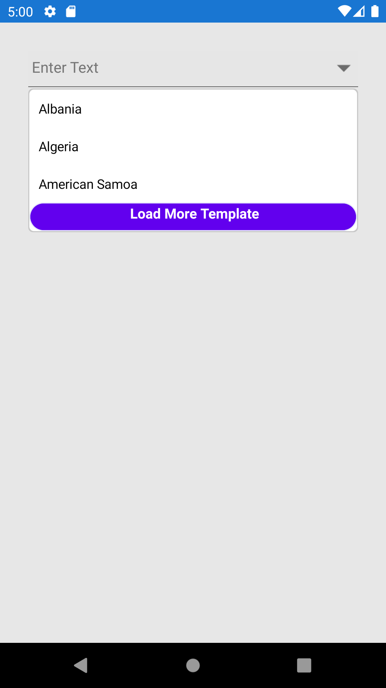

# Maximum Display Item with Expander in Xamarin ComboBox (SfComboBox)

## Maximum Display Item with Expander in Xamarin SfComboBox

Restrict the number of suggestions displayed, and load remaining items by selecting "Load More." You can control the maximum suggestions displayed using the [`MaximumSuggestion`](https://help.syncfusion.com/cr/xamarin/Syncfusion.XForms.ComboBox.SfComboBox.html#Syncfusion_XForms_ComboBox_SfComboBox_MaximumSuggestion) property, and set custom text for loading more items using the [`LoadMoreText`](https://help.syncfusion.com/cr/xamarin/Syncfusion.XForms.ComboBox.SfComboBox.html#Syncfusion_XForms_ComboBox_SfComboBox_LoadMoreText) property.





<?xml version="1.0" encoding="utf-8" ?>
<ContentPage xmlns="http://xamarin.com/schemas/2014/forms"
             xmlns:x="http://schemas.microsoft.com/winfx/2009/xaml"
             xmlns:comboBox="clr-namespace:Syncfusion.SfComboBox.XForms;assembly=Syncfusion.SfComboBox.XForms"
             xmlns:ListCollection="clr-namespace:System.Collections.Generic;assembly=netstandard"
             xmlns:local="clr-namespace:ComboBoxSample"
             x:Class="ComboBoxSample.MainPage">
    <StackLayout VerticalOptions="Start" 
                 HorizontalOptions="Start" 
                 Padding="30">
        <comboBox:SfComboBox HeightRequest="40"
                             MultiSelectMode="Delimiter"
                             Delimiter=","
                             LoadMoreText="LOAD MORE"
                             MaximumSuggestion="2">
            <comboBox:SfComboBox.ComboBoxSource>
               <ListCollection:List x:TypeArguments="x:String">
                    <x:String>Albania</x:String>
                    <x:String>Algeria</x:String>
                    <x:String>American Samoa</x:String>
                    <x:String>Andorra</x:String>
                    <x:String>Aruba</x:String>
                    <x:String>Angola</x:String>
                    <x:String>Argentina</x:String>
                    <x:String>Armenia</x:String>
                    <x:String>America</x:String>
                </ListCollection:List>
            </comboBox:SfComboBox.ComboBoxSource>
        </comboBox:SfComboBox>
    </StackLayout>
</ContentPage>





using Syncfusion.SfComboBox.XForms;
using System.Collections.Generic;
using Xamarin.Forms;

namespace ComboBoxSample
{
    public partial class MainPage : ContentPage
    {
        public MainPage()
        {
            InitializeComponent();
            StackLayout stackLayout = new StackLayout()
            {
                VerticalOptions = LayoutOptions.Start,
                HorizontalOptions = LayoutOptions.Start,
                Padding = new Thickness(30)
            };

            SfComboBox comboBox = new SfComboBox()
            {
                HeightRequest = 40,
                MultiSelectMode = MultiSelectMode.Delimiter,
                Delimiter = ",",
                LoadMoreText = "LOAD MORE",
                MaximumSuggestion = 2,
                ComboBoxSource = new List<string>()
                {
                   "Albania",
                   "Algeria",
                   "American Samoa",
                   "Andorra",
                   "Aruba",
                   "Angola",
                   "Argentina",
                   "Armenia",
                   "America"
                }
            };

            stackLayout.Children.Add(comboBox);
            this.Content = stackLayout;
        }
    }
}





## Restricting the Maximum Display of Items Dynamically

You can restrict the maximum display of items dynamically by calling the `LoadMore` method. The user can dynamically change the maximum suggestion count by calling the `LoadMore` method with the desired maximum suggestion count as the argument.

> **Note:** The `LoadMore` method is enhanced only on iOS and Android platforms.




// without passing argument
comboBox.LoadMore();

// with passing argument
comboBox.LoadMore(5);




## Load More View Customization

[`SfComboBox`](https://help.syncfusion.com/cr/xamarin/Syncfusion.XForms.ComboBox.SfComboBox.html) allows customization of the User Interface (UI) for the Load More view. Customize the load more text by adding a custom UI using the [`LoadMoreTemplate`](https://help.syncfusion.com/cr/xamarin/Syncfusion.XForms.ComboBox.SfComboBox.html#Syncfusion_XForms_ComboBox_SfComboBox_LoadMoreTemplate) API in `SfComboBox`, as shown in the following example:




     <ContentPage xmlns="http://xamarin.com/schemas/2014/forms"
             xmlns:x="http://schemas.microsoft.com/winfx/2009/xaml"
             xmlns:border="clr-namespace:Syncfusion.XForms.Border;assembly=Syncfusion.Core.XForms"
			 xmlns:ListCollection="clr-namespace:System.Collections.Generic;assembly=netstandard"
             xmlns:comboBox="clr-namespace:Syncfusion.XForms.ComboBox;assembly=Syncfusion.SfComboBox.XForms"
             x:Class="ComboBox.MainPage">
    
    <StackLayout VerticalOptions="Start" HorizontalOptions="Start" Padding="30">
        <comboBox:SfComboBox MaximumSuggestion="3"  HeightRequest="40" x:Name="combobox" Watermark="Enter Text">
            <comboBox:SfComboBox.LoadMoreTemplate>
                <border:SfBorder BackgroundColor="#6200EE" BorderWidth="1" BorderColor="Lavender" CornerRadius="20,20,20,20">
                    <Label  TextColor="White"  HorizontalTextAlignment="Center" FontSize="15" FontAttributes="Bold" Text="Load More Template"></Label>
                </border:SfBorder>
            </comboBox:SfComboBox.LoadMoreTemplate>
            <comboBox:SfComboBox.ComboBoxSource>
                <ListCollection:List x:TypeArguments="x:String">
                    <x:String>Albania</x:String>
                    <x:String>Algeria</x:String>
                    <x:String>American Samoa</x:String>
                    <x:String>Andorra</x:String>
                    <x:String>Aruba</x:String>
                    <x:String>Angola</x:String>
                    <x:String>Argentina</x:String>
                    <x:String>Armenia</x:String>
                    <x:String>America</x:String>
                </ListCollection:List>
            </comboBox:SfComboBox.ComboBoxSource>
        </comboBox:SfComboBox>
    </StackLayout>
    </ContentPage>

 



 
            StackLayout stackLayout = new StackLayout()
            {
                VerticalOptions = LayoutOptions.Start,
                HorizontalOptions = LayoutOptions.Start,
                Padding = new Thickness(30)
            };
            Syncfusion.XForms.Border.SfBorder border = new Syncfusion.XForms.Border.SfBorder();
            border.BorderWidth = 1;
            border.BackgroundColor = Color.FromHex("#6200EE");
            border.BorderColor = Color.Lavender;
            border.CornerRadius = new Thickness(20, 20, 20, 20);
            var nameLabel = new Label { FontAttributes = FontAttributes.Bold, TextColor = Color.White, HorizontalTextAlignment = TextAlignment.Center, FontSize = 15, Text = "Load More Template" };
            border.Content = nameLabel;

            Syncfusion.XForms.ComboBox.SfComboBox comboBox = new Syncfusion.XForms.ComboBox.SfComboBox()
            {
                HeightRequest = 40,
                MaximumSuggestion = 3,
                Watermark = "Enter Text",
                ComboBoxSource = new List<string>()
                {
                   "Albania",
                   "Algeria",
                   "American Samoa",
                   "Andorra",
                   "Aruba",
                   "Angola",
                   "Argentina",
                   "Armenia",
                   "America"
                },

                LoadMoreTemplate = border

            };

            stackLayout.Children.Add(comboBox);
            this.Content = stackLayout;





## Load More Button Tapped Event

The [`LoadMoreButtonTapped`](https://help.syncfusion.com/cr/xamarin/Syncfusion.XForms.ComboBox.SfComboBox.html#Syncfusion_XForms_ComboBox_SfComboBox_LoadMoreButtonTapped) can be triggered only when you tap on the load more button.





 <comboBox:SfComboBox HeightRequest="40"
                      LoadMoreButtonTapped="ComboBox_LoadMoreButtonTapped"
                      LoadMoreText="LOAD MORE"
                      MaximumSuggestion="3">




namespace ComboBoxSample
{
    public partial class MainPage : ContentPage
    {
        SfComboBox comboBox;
        public MainPage()
        {
          comboBox = new SfComboBox();
          comboBox.LoadMoreButtonTapped += ComboBox_LoadMoreButtonTapped;
          comboBox.HeightRequest = 40;
          comboBox.LoadMoreText = "Load More";
        }

        private void ComboBox_LoadMoreButtonTapped(object sender, EventArgs e)
        {
            // Trigger when tap the load more button
        }
    }
}




