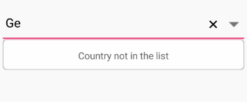

# No Results Found

When the entered item is not in the suggestion list, SfComboBox displays a text that indicates no search results found. You can set the desire text to be displayed for indicating no results found using the [`NoResultsFoundText`](https://help.syncfusion.com/cr/xamarin/Syncfusion.XForms.ComboBox.SfComboBox.html#Syncfusion_XForms_ComboBox_SfComboBox_NoResultsFoundText) property.





<ContentPage xmlns="http://xamarin.com/schemas/2014/forms"  
              xmlns:x="http://schemas.microsoft.com/winfx/2009/xaml"  
              xmlns:ListCollection="clr-namespace:System.Collections.Generic;assembly=netstandard" 
              xmlns:combobox="clr-namespace:Syncfusion.XForms.ComboBox;assembly=Syncfusion.SfComboBox.XForms" 
              xmlns:local="clr-namespace:ComboBox_Sample"             
              x:Class="ComboBox_Sample.MainPage"> 
               
     <StackLayout Padding="0, 30, 0, 0"> 
     <combobox:SfComboBox AllowFiltering="true"  
                          IsEditableMode="true" 
                          x:Name="comboBox" 
                          HeightRequest="40" 
                          NoResultsFoundText="Country not in the list" 
                          MultiSelectMode="None"> 
             <combobox:SfComboBox.ComboBoxSource> 
                 <ListCollection:List x:TypeArguments="x:String"> 
                    <x:String> Great Britain </x:String> 
                           <x:String> Uganda </x:String> 
                           <x:String> Ukraine </x:String> 
                           <x:String> Canada </x:String> 
                           <x:String> France </x:String> 
                           <x:String> Italy </x:String> 
                           <x:String> United Kingdom </x:String> 
                           <x:String> China </x:String> 
                           <x:String> Japan </x:String> 
                 </ListCollection:List> 
             </combobox:SfComboBox.ComboBoxSource> 
           </combobox:SfComboBox> 
     </StackLayout> 
</ContentPage> 





using System;								
using System.Collections.Generic; 
using Xamarin.Forms; 
using Syncfusion.XForms.ComboBox; 
  
namespace ComboBox_Sample 
{ 
     public partial class MainPage : ContentPage 
     { 
         public MainPage() 
         { 
             InitializeComponent(); 
             StackLayout mainLayout = new StackLayout() { Padding=new Thickness(0,30,0,0)}; 
             SfComboBox comboBox = new SfComboBox(); 
             comboBox.ComboBoxSource = new List<string>() { "Uganda", "Great Britain", "Ukraine", "Canada", "France", "Italy", "United Kingdom", "China", "Japan" }; 
             comboBox.IsEditableMode = true; 
             comboBox.AllowFiltering = true; 
             comboBox.HeightRequest = 40; 
             comboBox.NoResultsFoundText = "Country not in the list"; 
             mainLayout.Children.Add(comboBox); 
             this.Content = mainLayout; 
         } 
     } 
} 




## Customizing NoResultsFoundText

The `NoResultsFoundTextColor`, `NoResultsFoundFontSize`, `NoResultsFoundFontAttributes`, and `NoResultsFoundFontFamily` properties are used to customize the foreground color, font size, font attribute, and font family of NoResultsFoundText.




<StackLayout VerticalOptions="Start" HorizontalOptions="Start" Padding="30">
	<combobox:SfComboBox HeightRequest="40" x:Name="comboBox" IsEditableMode="true"  NoResultsFoundText="Country not in the list" NoResultsFoundTextColor="DarkGreen" NoResultsFoundFontSize="20" NoResultsFoundFontAttributes="Bold" NoResultsFoundFontFamily="Pacifico.ttf" />                    
</StackLayout> 





comboBox.NoResultsFoundText="Country not in the list";
comboBox.NoResultsFoundTextColor = Color.Blue;
comboBox.NoResultsFoundFontSize = 20;
comboBox.NoResultsFoundFontAttributes = FontAttributes.Bold;
comboBox.NoResultsFoundFontFamily = "Pacifico.ttf"
comboBox.ComboBoxSource = new List<string>() { "Uganda", "Great Britain", "Ukraine", "Canada", "France", "Italy", "United Kingdom", "China", "Japan" }; 





