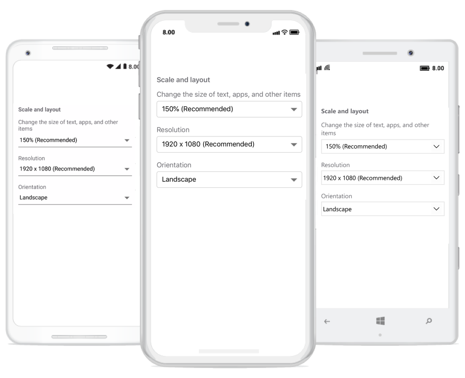

# Xamarin ComboBox (SfComboBox) Overview

The combo box is a textbox component that allows users to type a value or choose an option from the list of predefined options. This control has several out of box features such as data binding, filtering, UI customization, and more.

## Key features

* Editable mode – Supports both editable and non-editable text box to choose selected item from given data source.

* Filtering mode – Provides options to support both filtering and non-filtering suggestion lists. Provides three ways to display filtered suggestions. These include displaying suggestions using the drop-down list, which appends the first suggestion to text, and a combination of both.

* Suggestion modes – Suggestions can be filtered in different modes, such us StartsWith, EndWith, Contains, Equals, Custom and more. ComboBox provides both case-sensitive and case-insensitive modes. The items only filter the Allow Filtering property has enabled.

* MultiSelection – Provides two different ways to select multiple items from the suggestion list. They are using Token representation and Delimiter. In Token mode, the text can be wrapped in two ways. They are Wrap and None. In Wrap mode text will be wrapped to next line. When using None, the text will be wrapped horizontally. 

* Customization Support – Provide options to customize both the Entry and Suggestion drop down.

* Header and Footer – Header and Footer content can be given in the top and bottom of the Suggestion list in SfComboBox

* Highlighting Text – Highlights the matching text in the suggestion list based on the input given in it.

* Watermark – Supports explanatory text inside the combo box control until the user inputs text. Watermark is restored again if user clears the text in control.
