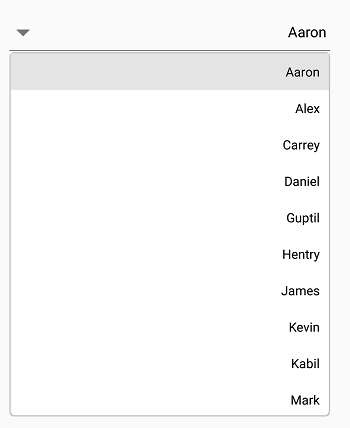

# Right-to-Left (RTL) in Xamarin ComboBox (SfComboBox)

The [`SfComboBox`](https://help.syncfusion.com/cr/xamarin/Syncfusion.XForms.ComboBox.SfComboBox.html) supports changing the layout direction to right-to-left by setting the [`FlowDirection`](https://docs.microsoft.com/en-us/dotnet/api/xamarin.forms.visualelement.flowdirection?view=xamarin-forms#Xamarin_Forms_VisualElement_FlowDirection) to [`RightToLeft`](https://devblogs.microsoft.com/xamarin/right-to-left-localization-xamarin-forms) or by changing the device language.



<combobox:SfComboBox FlowDirection="RightToLeft">
</combobox:SfComboBox>


combobox.FlowDirection = FlowDirection.RightToLeft;



> **Note:** To implement the [`FlowDirection`](https://docs.microsoft.com/en-us/dotnet/api/xamarin.forms.visualelement.flowdirection?view=xamarin-forms#Xamarin_Forms_VisualElement_FlowDirection) in the control, the Xamarin.Forms package version must be 3.0 or above. Please refer to [RightToLeft](https://devblogs.microsoft.com/xamarin/right-to-left-localization-xamarin-forms) for more details about the right-to-left flow direction in Xamarin.Forms.

### Android
For Android, add `android:supportsRtl="true"` to your application tag in the `AndroidManifest.xml` file, and ensure your `MinSDKVersion` is 17 or higher. Changing the device language/enabling the device's `Force RTL layout` can achieve the [`RightToLeft`](https://devblogs.microsoft.com/xamarin/right-to-left-localization-xamarin-forms) layout direction in Calendar.



<manifest ... >
<uses-sdk android:minSdkVersion="17" ... />
<application ... android:supportsRtl="true">
</application>
</manifest>



### iOS
For iOS, add the [`RightToLeft`](https://devblogs.microsoft.com/xamarin/right-to-left-localization-xamarin-forms) language to the `CFBundleLocalizations` section of your `Info.plist` file, ensuring you target iOS 9 or higher.



<resources>
<key>CFBundleDevelopmentRegion</key>
<string>en</string>
<key>CFBundleLocalizations</key>
<array>
<string>en</string>
<string>ar</string>
</array>
</resources>



### UWP
For UWP, set [`FlowDirection`](https://docs.microsoft.com/en-us/dotnet/api/xamarin.forms.visualelement.flowdirection?view=xamarin-forms#Xamarin_Forms_VisualElement_FlowDirection) to [`RightToLeft`](https://devblogs.microsoft.com/xamarin/right-to-left-localization-xamarin-forms) in the `MainPage.cs` file of the `UWP` project.



public MainPage()
{
…
this.FlowDirection = FlowDirection.RightToLeft;
LoadApplication (new App ());
…
}



The complete RTL sample is available in this [link](https://github.com/SyncfusionExamples/rtl-sample-combobox).
