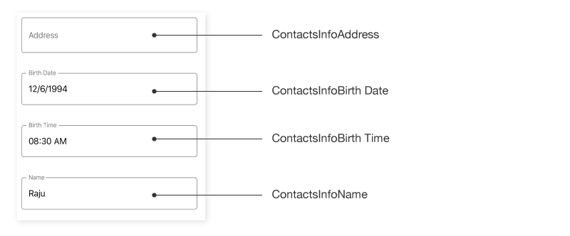

## AutomationId

The `SfDataForm`control has built-in `AutomationId` support for inner elements. Please find the following table of Automation IDs for inner elements. To keep unique `AutomationId`, these inner elements’ AutomationIds are updated based on the control’s `AutomationId`.  For example, if you set `SfDataForm` `AutomationId` as `SfDataForm.AutomationId = ContactsInfo`, then the Automation framework will interact with the text editor as `ContactsInfoEnter  FirstName`. The following screenshots denote the AutomationIds for inner elements.

### Floating label layout

<table>
<tr>
<th align="center" >Editor</th>
<th align="center" >AutomationId Format</th>
<th align="center" >Example</th>
</tr>

<tr>
<td>Text editor</td>
<td>LabelText</td>
<td>FirstName</td>
</tr>

<tr>
<td>Multiline text editor</td>
<td>LabelText</td>
<td>Address</td>
</tr>

<tr>
<td>Password Editor</td>
<td>LabelText</td>
<td>Password</td>
</tr>

<tr>
<td>Date Editor</td>
<td>LabelText</td>
<td>Birth Date</td>
</tr>

<tr>
<td>Time editor</td>
<td>LabelText</td>
<td>Birth Time</td>
</tr>

<tr>
<td>Dropdown Editor</td>
<td>LabelText</td>
<td>ItemName</td>
</tr>

<tr>
<td>AutoComplete Editor</td>
<td>LabelText</td>
<td>Country  Input Field</td>
</tr>

<tr>
<td>Numeric Editor</td>
<td>LabelText</td>
<td>Value</td>
</tr>

<tr>
<td>NumericUpDown Editor</td>
<td>LabelText</td>
<td>Amount</td>
</tr>

<tr>
<td>Masked Editor</td>
<td>LabelText</td>
<td>Contact</td>
</tr>

<tr>
<td>Picker</td>
<td>LabelText</td>
<td>Name</td>
</tr>

</table>

### Default Layout

<table>
<tr>
<th align="center" >Editor</th>
<th align="center" >AutomationId Format</th>
<th align="center" >Example</th>
</tr>

<tr>
<td>Text editor</td>
<td>“Enter ” + LabelText</td>
<td>Enter FirstName</td>
</tr>

<tr>
<td>Multiline text editor</td>
<td>“Enter ” + LabelText</td>
<td>Enter Address</td>
</tr>

<tr>
<td>Password Editor</td>
<td>“Enter ” + LabelText</td>
<td>Enter Password</td>
</tr>

<tr>
<td>Switch Editor</td>
<td>"Toggle ” + LabelText</td>
<td>Toggle TrackHours</td>
</tr>

<tr>
<td>Picker</td>
<td>"Select ” + LabelText</td>
<td>Select Name</td>
</tr>

<tr>
<td>Date Editor</td>
<td>"Select ” + LabelText</td>
<td>Select Birth Date</td>
</tr>

<tr>
<td>Time editor</td>
<td>"Select ” + LabelText</td>
<td>Select Birth Time</td>
</tr>

<tr>
<td>Dropdown Editor</td>
<td>"Select ” + LabelText</td>
<td>Select  Team</td>
</tr>

<tr>
<td>AutoComplete Editor</td>
<td>“Enter ” + LabelText</td>
<td>Enter Country Input Field</td>
</tr>

<tr>
<td>Numeric Editor</td>
<td>“Enter ” + LabelText</td>
<td>Enter Value</td>
</tr>

<tr>
<td>NumericUpDown Editor</td>
<td>“Enter ” + LabelText</td>
<td>Enter Amount</td>
</tr>

<tr>
<td>Checkbox Editor</td>
<td>"Checkbox ” + LabelText</td>
<td>Checkbox Registered</td>
</tr>

<tr>
<td>Masked Editor</td>
<td>“Enter ” + LabelText</td>
<td>Enter Contact</td>
</tr>

</table>

## Keyboard
`SfDataForm` provides support to move focus to editors using keyboard interaction.

>**NOTE**
Keyboard interaction is applicable only for UWP platform.

<table>
<tr>
<th>
Key or Key combinations
</th>
<th>
Description
</th>
</tr>
<tr>
<td>
Tab
</td>
<td>
Moves focus to the next editor from currently focused editor.
</td>
</tr>
<tr>
<td>
Shift + Tab
</td>
<td>
Moves focus to the previous editor from currently focused editor.
</td>
</tr>
</table>

### Customize key functionalities
To perform custom actions apart from the functions listed in the above table for keyboard keypress actions, implement your custom actions in the `MoveToNextFocusableEditor` and `MoveToPreviousFocusableEditor` overrides of custom layout manager class derived from the [DataFormLayoutManager](https://help.syncfusion.com/cr/xamarin/Syncfusion.XForms.DataForm.DataFormLayoutManager.html) class and assign it to the [SfDataForm.LayoutManager](https://help.syncfusion.com/cr/xamarin/Syncfusion.XForms.DataForm.SfDataForm.html#Syncfusion_XForms_DataForm_SfDataForm_LayoutManager) property.

The `Tab`, `DownArrow`, and `RightArrow` key pressed actions will call `MoveToNextFocusableEditor`. For `Shift + Tab`, `LeftArrow`, and `UpArrow` key pressed actions, `MoveToPreviousFocusableEditor` will be called. Keyboard behaviors can be restricted in override methods by returning false.



dataForm.LayoutManager = new DataFormLayoutManagerExt(dataForm);
public class DataFormLayoutManagerExt : DataFormLayoutManager
{
    public DataFormLayoutManagerExt(SfDataForm dataForm) : base(dataForm)
    {

    }
    public override bool MoveToNextFocusableEditor(DataFormItem dataFormItem)
    {
        //Your logics here
        return true;
    }
    public override bool MoveToPreviousFocusableEditor(DataFormItem dataFormItem)
    {
        //You can restrict keyboard interactions by returning false
        return false;
    }
}



>**NOTE**
The `MoveToNextFocusableEditor` can be applied to Android, iOS, and UWP platforms and will be called to Android and iOS platforms when pressing the tab key on the mobile keyboard. The `MoveToPreviousFocusableEditor` can be applied only to the UWP platform.
