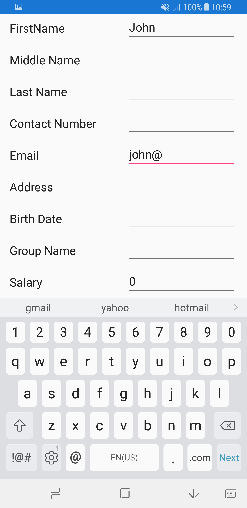

# Editing in Xamarin DataForm (SfDataForm)

The data form supports several built-in editors. 

## Supported editors and associated DataFormItem

<table>
<tr>
<th>Editor name</th>
<th>Editor class</th>
<th>Data Type/Attribute</th>
<th>Input control loaded</th>
</tr>
<tr>
<td>
Text
</td>
<td>
{{'[DataFormTextEditor](https://help.syncfusion.com/cr/xamarin/Syncfusion.XForms.DataForm.Editors.DataFormTextEditor.html)'| markdownify }}
</td>
<td>
The String type property and any other type apart from the following specified cases.
</td>
<td>
{{'[Entry](https://docs.microsoft.com/en-us/dotnet/api/xamarin.forms.entry?view=xamarin-forms)'| markdownify }}
</td>
</tr>
<tr>
<td>
MultilineText
</td>
<td>
{{'[DataFormMultiLineTextEditor](https://help.syncfusion.com/cr/xamarin/Syncfusion.XForms.DataForm.Editors.DataFormMultiLineTextEditor.html)'| markdownify }}
</td>
<td>
The String type property with multi line text.
[DataType(DataType.MultilineText)] 
</td>
<td>
{{'[Editor](https://docs.microsoft.com/en-us/dotnet/api/xamarin.forms.editor?view=xamarin-forms)'| markdownify }}
</td>
</tr>
<tr>
<td>
Numeric
</td>
<td>
{{'[DataFormNumericEditor](https://help.syncfusion.com/cr/xamarin/Syncfusion.XForms.DataForm.Editors.DataFormNumericEditor.html)'| markdownify }}
</td>
<td>
The property of Int, Double, Float, Decimal, Long types and also its nullable property.
</td>
<td>
{{'[SfNumericTextBox](https://help.syncfusion.com/xamarin/sfnumerictextbox/overview)'| markdownify }}
</td>
</tr>
<tr>
<td>
Percent
</td>
<td>
{{'[DataFormNumericEditor](https://help.syncfusion.com/cr/xamarin-android/Syncfusion.Android.DataForm.Editors.DataFormNumericEditor.html)'| markdownify }}
</td>
<td>
The property of Int, Double, Float, Decimal, Long types and also its nullable property with [DataType(“Percent”)] attribute.
</td>
<td>
{{'[SfNumericTextBox](https://help.syncfusion.com/xamarin/sfnumerictextbox/overview)'| markdownify }}
</td>
</tr>
<tr>
<td>
Currency
</td>
<td>
{{'[DataFormNumericEditor](https://help.syncfusion.com/cr/xamarin/Syncfusion.XForms.DataForm.Editors.DataFormNumericEditor.html)'| markdownify }}
</td>
<td>
The property of Int, Double, Float, Decimal, Long types and also its nullable property with [DataType(DataType.Currency)] attribute.
</td>
<td>
{{'[SfNumericTextBox](https://help.syncfusion.com/xamarin/sfnumerictextbox/overview)'| markdownify }}
</td>
</tr>
<tr>
<td>
Date
</td>
<td>
{{'[DataFormDateEditor](https://help.syncfusion.com/cr/xamarin/Syncfusion.XForms.DataForm.Editors.DataFormDateEditor.html)'| markdownify }}
</td>
<td>
The DateTime type property and the property with [DataType(DataType.Date)] and [DataType(DataType.DateTime)] attributes.
</td>
<td>
{{'[DatePicker](https://docs.microsoft.com/en-us/dotnet/api/xamarin.forms.datepicker?view=xamarin-forms)'| markdownify }}
</td>
</tr>
<tr>
<td>
Time
</td>
<td>
{{'[DataFormTimeEditor](https://help.syncfusion.com/cr/xamarin/Syncfusion.XForms.DataForm.Editors.DataFormTimeEditor.html)'| markdownify }}
</td>
<td>
The property with [DataType(DataType.Time)] attribute.
</td>
<td>
{{'[TimePicker](https://docs.microsoft.com/en-us/dotnet/api/xamarin.forms.timepicker?view=xamarin-forms)'| markdownify }}
</td>
</tr>
<tr>
<td>
NumericUpDown
</td>
<td>
{{'[DataFormNumericUpDownEditor](https://help.syncfusion.com/cr/xamarin/Syncfusion.XForms.DataForm.Editors.DataFormNumericUpDownEditor.html)'| markdownify }}
</td>
<td>
Int or Double type property.
</td>
<td>
{{'[SfNumericUpDown](https://help.syncfusion.com/xamarin/sfnumericupdown/overview)'| markdownify }}
</td>
</tr>
<tr>
<td>
Segment
</td>
<td>
{{'[DataFormSegmentedEditor](https://help.syncfusion.com/cr/xamarin/Syncfusion.XForms.DataForm.Editors.DataFormSegmentedEditor.html)'| markdownify }}
</td>
<td>
Enum type property.
</td>
<td>
{{'[SfSegmentedControl](https://help.syncfusion.com/xamarin/sfsegmentedcontrol/overview)'| markdownify }}
</td>
</tr>
<tr>
<td>
Bool
</td>
<td>
{{'[DataFormCheckBoxEditor](https://help.syncfusion.com/cr/xamarin/Syncfusion.XForms.DataForm.Editors.DataFormCheckBoxEditor.html)'| markdownify }}
</td>
<td>
Bool type property.
</td>
<td>
{{'[SfCheckBox](https://help.syncfusion.com/xamarin/sfcheckbox/overview)'| markdownify }}
</td>
</tr>
<tr>
<td>
Switch
</td>
<td>
{{'[DataFormSwitchEditor](https://help.syncfusion.com/cr/xamarin/Syncfusion.XForms.DataForm.Editors.DataFormSwitchEditor.html)'| markdownify }}
</td>
<td>
Bool type property.
</td>
<td>
{{'[Switch](https://docs.microsoft.com/en-us/dotnet/api/xamarin.forms.switch?view=xamarin-forms)'| markdownify }}
</td>
</tr>
<tr>
<td>
Picker
</td>
<td>
{{'[DataFormPickerEditor](https://help.syncfusion.com/cr/xamarin/Syncfusion.XForms.DataForm.Editors.DataFormPickerEditor.html)'| markdownify }}
</td>
<td>
Enum and List type property. 
[EnumDataTypeAttribute]
</td>
<td>
{{'[Picker](https://docs.microsoft.com/en-us/dotnet/api/xamarin.forms.picker?view=xamarin-forms)'| markdownify }}
</td>
</tr>
<tr>
<td>
DropDown
</td>
<td>
{{'[DataFormDropDownEditor](https://help.syncfusion.com/cr/xamarin/Syncfusion.XForms.DataForm.Editors.DataFormDropDownEditor.html)'| markdownify }}
</td>
<td>
Enum and List type property.
[EnumDataTypeAttribute]
</td>
<td>
{{'[SfComboBox](https://help.syncfusion.com/xamarin/sfcombobox/overview)'| markdownify }}
</td>
</tr>
<tr>
<td>
AutoComplete
</td>
<td>
{{'[DataFormAutoCompleteEditor](https://help.syncfusion.com/cr/xamarin/Syncfusion.XForms.DataForm.Editors.DataFormAutoCompleteEditor.html)'| markdownify }}
</td>
<td>
Enum and List type property.
[EnumDataTypeAttribute]
</td>
<td>
{{'[SfAutoComplete](https://help.syncfusion.com/xamarin/sfautocomplete/overview)'| markdownify }}
</td>
</tr>
<tr>
<td>
Password
</td>
<td>
{{'[DataFormPasswordEditor](https://help.syncfusion.com/cr/xamarin/Syncfusion.XForms.DataForm.Editors.DataFormPasswordEditor.html)'| markdownify }}
</td>
<td>
The String type property and property with 
[DataType(DataType.Password)] attribute.
</td>
<td>
{{'[Entry](https://docs.microsoft.com/en-us/dotnet/api/xamarin.forms.entry?view=xamarin-forms)'| markdownify }}
</td>
</tr>
<tr>
<td>
RadioGroup
</td>
<td>
{{'[DataFormRadioGroupEditor](https://help.syncfusion.com/cr/xamarin/Syncfusion.XForms.DataForm.Editors.DataFormRadioGroupEditor.html)'| markdownify }}
</td>
<td>
Enum and List type property. 
[EnumDataTypeAttribute]
</td>
<td>
{{'[SfRadioGroup](https://help.syncfusion.com/cr/xamarin/Syncfusion.XForms.Buttons.SfRadioGroup.html)'| markdownify }}
</td>
</tr>
<tr>
<td>
MaskedEditText
</td>
<td>
{{'[DataFormMaskedEditTextEditor](https://help.syncfusion.com/cr/xamarin/Syncfusion.XForms.DataForm.Editors.DataFormMaskedEditTextEditor.html)'| markdownify }}
</td>
<td>
The property with [DataType(DataType.PhoneNumber)] attribute.
</td>
<td>
{{'[SfMaskedEdit](https://help.syncfusion.com/cr/xamarin/Syncfusion.XForms.MaskedEdit.html)'| markdownify }}
</td>
</tr>
</table>

## Changing editor for type

By default, the editors will be loaded based on the previous table. To change the editor for any type, use the [RegisterEditor](https://helpstaging.syncfusion.com/cr/xamarin/Syncfusion.XForms.DataForm.SfDataForm.html#Syncfusion_XForms_DataForm_SfDataForm_RegisterEditor_System_Type_System_String_) method and specify the type and editor.




dataForm.RegisterEditor(typeof(int), "NumericUpDown");




Here, the `NumericUpDown` editor will be loaded for the integer type instead of numeric editor.

## Changing editor for property

To change the editor for any property, use the [RegisterEditor](https://help.syncfusion.com/cr/xamarin/Syncfusion.XForms.DataForm.SfDataForm.html#Syncfusion_XForms_DataForm_SfDataForm_RegisterEditor_System_String_System_String_) method and specify the property name and editor.




dataForm.RegisterEditor("IsAvailable", "Switch");




Here, the Switch editor will be loaded for the `IsAvailable` property (bool type) instead of `CheckBox` editor.

## Customizing existing editor

The existing editors defined in the previous table can be customized by overriding the default editors. 

Here, the [DataFormTextEditor](https://help.syncfusion.com/cr/xamarin/Syncfusion.XForms.DataForm.Editors.DataFormTextEditor.html) is customized to set different foreground for the FirstName property text editor.



public class CustomTextEditor : DataFormTextEditor
{
    public CustomTextEditor(SfDataForm dataForm) : base(dataForm)
    {
    }

    protected override void OnInitializeView(DataFormItem dataFormItem, Entry view)
    {
        if (dataFormItem.Name == "FirstName")
            view.TextColor = Color.Green;
        base.OnInitializeView(dataFormItem, view);
    }
}

dataForm.RegisterEditor("Text", new CustomTextEditor(dataForm));            



## Creating new custom editor

Create the custom editor by overriding the [DataFormEditor](https://help.syncfusion.com/cr/xamarin/Syncfusion.XForms.DataForm.Editors.DataFormEditor-1.html) class.

Property settings, commit, data validation can be handled by overriding the required methods. Here, the `Entry` is loaded for `Age` editor.




public class CustomTextEditor : DataFormEditor<Entry>
{
	public CustomTextEditor(SfDataForm dataForm) : base(dataForm)
	{
	}

	protected override Entry OnCreateEditorView(DataFormItem dataFormItem)
	{
		return new Entry();
	}
	protected override void OnInitializeView(DataFormItem dataFormItem, Entry view)
	{
		base.OnInitializeView(dataFormItem, view);
		view.Keyboard = Keyboard.Numeric;
		this.OnUpdateValue(dataFormItem, view);
        this.OnUpdateReadOnly(dataFormItem, view);
	}

	protected override void OnWireEvents(Entry view)
	{
		view.TextChanged += OnViewTextChanged;
		view.Focused += OnViewFocused;
		view.Unfocused += OnViewUnfocused;
	}

	private void OnViewPropertyChanged(object sender, PropertyChangedEventArgs e)
	{
		OnValidateValue(sender as Entry);
	}

	private void OnViewFocused(object sender, FocusEventArgs e)
	{
		var view = (sender as Entry);
		view.TextColor = Color.Green;
	}

	protected override bool OnValidateValue(Entry view)
	{
		return this.DataForm.Validate("Age");
	}
	private void OnViewUnfocused(object sender, FocusEventArgs e)
	{
		var view = sender as Entry;
		view.TextColor = Color.Red;

		if (this.DataForm.CommitMode == Syncfusion.XForms.DataForm.CommitMode.LostFocus || this.DataForm.ValidationMode == ValidationMode.LostFocus)
			this.OnValidateValue(view);
		if (this.DataForm.CommitMode != Syncfusion.XForms.DataForm.CommitMode.LostFocus) return;
		this.OnCommitValue(view);
		OnValidateValue(sender as Entry);
	}
	private void OnViewTextChanged(object sender, TextChangedEventArgs e)
	{
		var view = sender as Entry;
		if (DataForm.CommitMode == Syncfusion.XForms.DataForm.CommitMode.PropertyChanged || DataForm.ValidationMode == ValidationMode.PropertyChanged)
			this.OnValidateValue(view);
		if (this.DataForm.CommitMode != Syncfusion.XForms.DataForm.CommitMode.PropertyChanged) return;
		this.OnCommitValue(view);
	}

	protected override void OnCommitValue(Entry view)
	{
		var dataFormItemView = view.Parent as DataFormItemView;
		this.DataForm.ItemManager.SetValue(dataFormItemView.DataFormItem, view.Text);
	}

	 protected override void OnUpdateValue(DataFormItem dataFormItem, Entry view)
    {
        var cellValue = this.DataForm.ItemManager.GetValue(dataFormItem);
        if (cellValue != null && view.Text == cellValue.ToString())
            return;
        view.Text = cellValue == null ? string.Empty : cellValue.ToString();
    }

    protected override void OnUpdateReadOnly(DataFormItem dataFormItem, Entry view)
    {
		base.OnUpdateReadOnly(dataFormItem, view);
    }
	
	protected override void OnUnWireEvents(Entry view)
	{
		view.TextChanged -= OnViewTextChanged;
		view.Focused -= OnViewFocused;
		view.Unfocused -= OnViewUnfocused;
	}
}

dataForm.RegisterEditor("numeric", new CustomTextEditor(dataForm));
dataForm.RegisterEditor("Age", "numeric");
dataForm.ValidationMode = ValidationMode.LostFocus;




You should manually commit the custom DataFormItem editor value by using [OnCommitValue](https://help.syncfusion.com/cr/xamarin/Syncfusion.XForms.DataForm.Editors.DataFormEditor-1.html#Syncfusion_XForms_DataForm_Editors_DataFormEditor_1_OnCommitValue__0_) override method of [DataFormEditor](https://help.syncfusion.com/cr/xamarin/Syncfusion.XForms.DataForm.Editors.DataFormEditor-1.html) class on custom editor `Value` or `Focus changed` event which is used to update the custom editor value in respective property in [DataObject](https://help.syncfusion.com/xamarin/sfdataform/getting-started#setting-data-object) based on dataform [commit mode](https://help.syncfusion.com/xamarin/sfdataform/editing#commit-mode) set. 

Also , you should manually validate the custom editor value in by using [OnValidateValue](https://help.syncfusion.com/cr/xamarin/Syncfusion.XForms.DataForm.Editors.DataFormEditor-1.html#Syncfusion_XForms_DataForm_Editors_DataFormEditor_1_OnValidateValue__0_) override method of `DataFormEditor` class on custom editor `Value` or `Focus changed` event which is used to validate the custom editor value based on data form [validation mode](https://help.syncfusion.com/xamarin/sfdataform/validation?cs-save-lang=1&cs-lang=xaml#validation-mode) set . In the override method for OnValidateValue, you need to return [DataForm.Validate(string)](https://help.syncfusion.com/cr/xamarin/Syncfusion.XForms.DataForm.SfDataForm.html#Syncfusion_XForms_DataForm_SfDataForm_Validate) method in order to validate the particular data item.

Also, you should manually update the value to the custom editor by using [OnUpdateValue](https://help.syncfusion.com/cr/xamarin/Syncfusion.XForms.DataForm.Editors.DataFormEditor-1.html#Syncfusion_XForms_DataForm_Editors_DataFormEditor_1_OnUpdateValue_Syncfusion_XForms_DataForm_DataFormItem__0_) override method of `DataFormEditor` class on custom editor while bound the value from the Model class.

## Support for Email editor

You can load the Email editor by changing `KeyBoard` type in the [AutoGeneratingDataFormItem](https://help.syncfusion.com/cr/xamarin/Syncfusion.XForms.DataForm.SfDataForm.html) event.



dataForm.AutoGeneratingDataFormItem += DataForm_AutoGeneratingDataFormItem;
private void DataForm_AutoGeneratingDataFormItem(object sender, AutoGeneratingDataFormItemEventArgs e)
{
    if (e.DataFormItem != null && e.DataFormItem.Name == "Email")
       (e.DataFormItem as DataFormTextItem).KeyBoard = Keyboard.Email;
}



## Commit mode

The [CommitMode](https://help.syncfusion.com/cr/xamarin/Syncfusion.XForms.DataForm.SfDataForm.html#Syncfusion_XForms_DataForm_SfDataForm_Commit) determines when the value should be committed to the data object.

The supported commit modes are as follows:

* LostFocus
* PropertyChanged
* Explicit



<?xml version="1.0" encoding="utf-8" ?>
<?xml version="1.0" encoding="utf-8" ?>
<ContentPage xmlns="http://xamarin.com/schemas/2014/forms"
             xmlns:x="http://schemas.microsoft.com/winfx/2009/xaml"
             xmlns:local="clr-namespace:GettingStarted"
             xmlns:dataForm ="clr-namespace:Syncfusion.XForms.DataForm;assembly=Syncfusion.SfDataForm.XForms"
             x:Class="GettingStarted.MainPage">
    <ContentPage.Content>        
            <dataForm:SfDataForm x:Name="dataForm" CommitMode="LostFocus"/>                    
    </ContentPage.Content>
</ContentPage>


dataForm.CommitMode = CommitMode.LostFocus;



### LostFocus

If the commit mode is LostFocus, the value is committed when the editor lost its focus.

### PropertyChanged

The value will be committed immediately when it is changed.

### Explicit

The value should be committed manually by calling the [SfDataForm.Commit](https://help.syncfusion.com/cr/xamarin/Syncfusion.XForms.DataForm.SfDataForm.html#Syncfusion_XForms_DataForm_SfDataForm_Commit().html) or [SfDataForm.Commit(propertyName)](https://help.syncfusion.com/cr/xamarin/Syncfusion.XForms.DataForm.SfDataForm.html#Syncfusion_XForms_DataForm_SfDataForm_Commit(String).html) method.

The following code commits the value of all the properties in the data object:



dataForm.Commit();



To commit the specific property value, pass the property name as argument.



dataForm.Commit("Name");



## Update editor value based on another editor

You can the update the editor value by using the [SfDataForm.UpdateEditor](https://help.syncfusion.com/cr/xamarin/Syncfusion.XForms.DataForm.SfDataForm.html#Syncfusion_XForms_DataForm_SfDataForm_UpdateEditor_System_String_) method at runtime.




<?xml version="1.0" encoding="utf-8" ?>
<?xml version="1.0" encoding="utf-8" ?>
<ContentPage xmlns="http://xamarin.com/schemas/2014/forms"
             xmlns:x="http://schemas.microsoft.com/winfx/2009/xaml"
             xmlns:local="clr-namespace:GettingStarted"
             xmlns:dataForm ="clr-namespace:Syncfusion.XForms.DataForm;assembly=Syncfusion.SfDataForm.XForms"
             x:Class="GettingStarted.MainPage">
    <ContentPage.Content>        
            <dataForm:SfDataForm x:Name="dataForm"/>                    
    </ContentPage.Content>
</ContentPage>



var expenseInfo = new ExpenseInfo();
expenseInfo.PropertyChanged += ExpenseInfo_PropertyChanged;
dataForm.DataObject = expenseInfo;

private void ExpenseInfo_PropertyChanged(object sender, PropertyChangedEventArgs e)
{
    if (e.PropertyName == "Budget" || e.PropertyName == "Expense")
    {
        var item = sender as ExpenseInfo;
        item.Balance = item.Budget - item.Expense;
        dataForm.UpdateEditor("Balance");               
    }
}



Here, the Balance property value is updated based on Budget and Expense properties. For updating value in editor, the `UpdateEditor` method is called.

You can download the sample from [here](http://www.syncfusion.com/downloads/support/directtrac/general/ze/UpdateEditors671251340.zip).

## Converter

To show the original value in different format or as different value, use the [Converter](https://help.syncfusion.com/cr/xamarin/Syncfusion.XForms.DataForm.ConverterAttribute.html) attribute.

### Changing original value of the DataForm property value using converter

Here, the original value is multiplied by 10 and shown in editor. While committing, it is divided by 10 and stored in the data object.



public class ValueConverterExt : IPropertyValueConverter
{
    public object Convert(object value)
    {            
        var amount = double.Parse(value.ToString());
        return amount * 10;
    }

    public object ConvertBack(object value)
    {
        var amount = double.Parse(value.ToString());
        return amount / 10;
    }
}

private double? amount = 1000;

[Converter(typeof(ValueConverterExt))]
public double? Amount
{
    get
    {
        return amount;
    }
    set
    {
        amount = value;
        RaisePropertyChanged("Amount");
    }
}



### Using date editor for DateTimeOffset DataForm property data type

In SfDataForm, you cannot use date editor for `DateTimeOffset` property data type. To overcome this, you need to use `Converter` attribute to convert `DateTimeOffset` to `DateTime` value and vice-versa.




private DateTimeOffset displayDate;

[Converter(typeof(ValueConverterExt))]
public DateTimeOffset DisplayDate
{
    get
    {
        return displayDate;
    }
    set
    {
        displayDate = value;
    }
}
public class ValueConverterExt : IPropertyValueConverter
{
    public object Convert(object value)
    {
        DateTime baseTime = new DateTime(2008, 6, 19, 7, 0, 0);
        DateTime targetTime;

        var dateTimeOffset = (DateTimeOffset)value;
        dateTimeOffset = new DateTimeOffset(baseTime,
                                            TimeZoneInfo.Local.GetUtcOffset(baseTime));
        targetTime = dateTimeOffset.DateTime;
        return targetTime;
    }
    public object ConvertBack(object value)
    {
        var dateTime = (DateTime)value;
        dateTime = new DateTime(2008, 6, 19, 7, 0, 0);
        dateTime = DateTime.SpecifyKind(dateTime, DateTimeKind.Local);
        DateTimeOffset dateTimeOffset = dateTime;
        return dateTimeOffset;
    }
}



You can download the source code of this demo from here [DateTimeOffsetConverter](https://github.com/SyncfusionExamples/Convert-DateTimeOffset-into-DateTime-and-back-in-Xamarin-DataForm)

## Disable editing
You can disable editing by setting the [IsReadOnly](https://help.syncfusion.com/cr/xamarin/Syncfusion.XForms.DataForm.SfDataForm.html#Syncfusion_XForms_DataForm_SfDataForm_IsReadOnly) property of the data form.



<?xml version="1.0" encoding="utf-8" ?>
<?xml version="1.0" encoding="utf-8" ?>
<ContentPage xmlns="http://xamarin.com/schemas/2014/forms"
             xmlns:x="http://schemas.microsoft.com/winfx/2009/xaml"
             xmlns:local="clr-namespace:GettingStarted"
             xmlns:dataForm ="clr-namespace:Syncfusion.XForms.DataForm;assembly=Syncfusion.SfDataForm.XForms"
             x:Class="GettingStarted.MainPage">
    <ContentPage.Content>        
            <dataForm:SfDataForm x:Name="dataForm" IsReadOnly="True"/>                    
    </ContentPage.Content>
</ContentPage>


dataForm.IsReadOnly = true;



You can also change the editing behavior by setting the [IsReadOnly](https://help.syncfusion.com/cr/xamarin/Syncfusion.XForms.DataForm.SfDataForm.html#Syncfusion_XForms_DataForm_SfDataForm_IsReadOnly) property of the [DataFormItem](https://help.syncfusion.com/cr/xamarin/Syncfusion.XForms.DataForm.DataFormItem.html).



dataForm.AutoGeneratingDataFormItem += DataForm_AutoGeneratingDataFormItem;

private void DataForm_AutoGeneratingDataFormItem(object sender, AutoGeneratingDataFormItemEventArgs e)
{
    if (e.DataFormItem != null)
    {
        if (e.DataFormItem.Name == "Salary")
            e.DataFormItem.IsReadOnly = true;
    }
}



You can also change the editing behavior at runtime.



private void Button_Click(object sender, System.EventArgs e)
{
    var dataFormItem = dataForm.ItemManager.DataFormItems["FirstName"];
    dataFormItem.IsReadOnly = true;
}



N> [DataFormItem.IsReadOnly](https://help.syncfusion.com/cr/xamarin/Syncfusion.XForms.DataForm.DataFormItem.html#Syncfusion_XForms_DataForm_DataFormItem_IsReadOnly) takes higher priority than [SfDataForm.IsReadOnly](https://help.syncfusion.com/cr/xamarin/Syncfusion.XForms.DataForm.SfDataForm.html#Syncfusion_XForms_DataForm_SfDataForm_IsReadOnly).

## Two-way data binding
When the DataForm business object properties are updated with two-way data binding support, the value will sync with underlying DataForm editors.

To enable two-way data binding support, set the value of [NotifyPropertyChanges](https://help.syncfusion.com/cr/xamarin/Syncfusion.XForms.DataForm.SfDataForm.html#Syncfusion_XForms_DataForm_SfDataForm_NotifyPropertyChanges) property to true in DataForm.


<?xml version="1.0" encoding="utf-8" ?>
<?xml version="1.0" encoding="utf-8" ?>
<ContentPage xmlns="http://xamarin.com/schemas/2014/forms"
             xmlns:x="http://schemas.microsoft.com/winfx/2009/xaml"
             xmlns:local="clr-namespace:GettingStarted"
             xmlns:dataForm ="clr-namespace:Syncfusion.XForms.DataForm;assembly=Syncfusion.SfDataForm.XForms"
             x:Class="GettingStarted.MainPage">
    <ContentPage.Content>        
            <dataForm:SfDataForm x:Name="dataForm" NotifyPropertyChanges="True"/>                    
    </ContentPage.Content>
</ContentPage>


dataForm.NotifyPropertyChanges = true;



You can download the entire source code of this demo from here [Two-wayDataBinding](https://github.com/SyncfusionExamples/two-way-data-binding-support-in-xamarin.forms-dataform)

## See also

[How to save or cancel the edited DataForm data in Xamarin.Forms (SfDataForm)](https://www.syncfusion.com/kb/11312/)                                                                                                                                                                                                                                                                    
[How to programmatically implement converter to Xamarin.Forms DataForm (SfDataForm)](https://www.syncfusion.com/kb/11541/)                                                                                                                                                                                          
[How to register common editor for same data type properties in Xamarin.Forms DataForm business object](https://www.syncfusion.com/kb/10322/)                                                                                                                                                                                   
[How to change the editor visibility based on another editor in Xamarin.Forms DataForm (SfDataForm)](https://www.syncfusion.com/kb/11189/)                                                                                                                                                                  
[How to update editor value based on another editor in Xamarin.Forms DataForm (SfDataForm)](https://www.syncfusion.com/kb/11192/)