# Editors in Xamarin DataForm (SfDataForm)

The data form supports several built-in editors as follows:

<table>
<tr>
<th>Editor name</th>
<th>Editor class</th>
<th>Supported Data Type/Attribute</th>
<th>Input control loaded</th>
</tr>
<tr>
<td>
Text
</td>
<td>
{{'[DataFormTextEditor](https://help.syncfusion.com/cr/xamarin/Syncfusion.XForms.DataForm.Editors.DataFormTextEditor.html)'| markdownify }}
</td>
<td>
The String type property and any other type apart from the below specified cases.
</td>
<td>
{{'[Entry](https://docs.microsoft.com/en-us/dotnet/api/xamarin.forms.entry?view=xamarin-forms)'| markdownify }}
</td>
</tr>
<tr>
<td>
MultilineText
</td>
<td>
{{'[DataFormMultiLineTextEditor](https://help.syncfusion.com/cr/xamarin/Syncfusion.XForms.DataForm.Editors.DataFormMultiLineTextEditor.html)'| markdownify }}
</td>
<td>
The String type property with multi line text.
[DataType(DataType.MultilineText)]
</td>
<td>
{{'[Editor](https://docs.microsoft.com/en-us/dotnet/api/xamarin.forms.editor?view=xamarin-forms)'| markdownify }}
</td>
</tr>
<tr>
<td>
Numeric
</td>
<td>
{{'[DataFormNumericEditor](https://help.syncfusion.com/cr/xamarin/Syncfusion.XForms.DataForm.Editors.DataFormNumericEditor.html)'| markdownify }}
</td>
<td>
The property of Int, Double, Float, Decimal, Long types and also its nullable property.
</td>
<td>
{{'[SfNumericTextBox](https://help.syncfusion.com/xamarin/sfnumerictextbox/overview)'| markdownify }}
</td>
</tr>
<tr>
<td>
Percent
</td>
<td>
{{'[DataFormNumericEditor](https://help.syncfusion.com/cr/xamarin/Syncfusion.XForms.DataForm.Editors.DataFormNumericEditor.html)'| markdownify }}
</td>
<td>
The property of Int, Double, Float, Decimal, Long types and also its nullable property with [DataType(“Percent”)] attribute.
</td>
<td>
{{'[SfNumericTextBox](https://help.syncfusion.com/xamarin/sfnumerictextbox/overview)'| markdownify }}
</td>
</tr>
<tr>
<td>
Currency
</td>
<td>
{{'[DataFormNumericEditor](https://help.syncfusion.com/cr/xamarin/Syncfusion.XForms.DataForm.Editors.DataFormNumericEditor.html)'| markdownify }}
</td>
<td>
The property of Int, Double, Float, Decimal, Long types and also its nullable property with [DataType(DataType.Currency)] attribute.
</td>
<td>
{{'[SfNumericTextBox](https://help.syncfusion.com/xamarin/sfnumerictextbox/overview)'| markdownify }}
</td>
</tr>
<tr>
<td>
Date
</td>
<td>
{{'[DataFormDateEditor](https://help.syncfusion.com/cr/xamarin/Syncfusion.XForms.DataForm.Editors.DataFormDateEditor.html)'| markdownify }}
</td>
<td>
DateTime type property and the property with [DataType(DataType.Date)] and [DataType(DataType.DateTime)] attributes.
</td>
<td>
{{'[DatePicker](https://docs.microsoft.com/en-us/dotnet/api/xamarin.forms.datepicker?view=xamarin-forms)'| markdownify }}
</td>
</tr>
<tr>
<td>
Time
</td>
<td>
{{'[DataFormTimeEditor](https://help.syncfusion.com/cr/xamarin/Syncfusion.XForms.DataForm.Editors.DataFormTimeEditor.html)'| markdownify }}
</td>
<td>
The property with [DataType(DataType.Time)] attribute.
</td>
<td>
{{'[TimePicker](https://docs.microsoft.com/en-us/dotnet/api/xamarin.forms.timepicker?view=xamarin-forms)'| markdownify }}
</td>
</tr>
<tr>
<td>
NumericUpDown
</td>
<td>
{{'[DataFormNumericUpDownEditor](https://help.syncfusion.com/cr/xamarin/Syncfusion.XForms.DataForm.Editors.DataFormNumericUpDownEditor.html)'| markdownify }}
</td>
<td>
Int or Double type property.
</td>
<td>
{{'[SfNumericUpDown](https://help.syncfusion.com/xamarin/sfnumericupdown/overview)'| markdownify }}
</td>
</tr>
<tr>
<td>
Segment
</td>
<td>
{{'[DataFormSegmentedEditor](https://help.syncfusion.com/cr/xamarin/Syncfusion.XForms.DataForm.Editors.DataFormSegmentedEditor.html)'| markdownify }}
</td>
<td>
Enum type property.
</td>
<td>
{{'[SfSegmentedControl](https://help.syncfusion.com/xamarin/sfsegmentedcontrol/overview)'| markdownify }}
</td>
</tr>
<tr>
<td>
Bool
</td>
<td>
{{'[DataFormCheckBoxEditor](https://help.syncfusion.com/cr/xamarin/Syncfusion.XForms.DataForm.Editors.DataFormCheckBoxEditor.html)'| markdownify }}
</td>
<td>
Bool type property.
</td>
<td>
{{'[SfCheckBox](https://help.syncfusion.com/xamarin/sfcheckbox/overview)'| markdownify }}
</td>
</tr>
<tr>
<td>
Switch
</td>
<td>
{{'[DataFormSwitchEditor](https://help.syncfusion.com/cr/xamarin/Syncfusion.XForms.DataForm.Editors.DataFormSwitchEditor.html)'| markdownify }}
</td>
<td>
Bool type property.
</td>
<td>
{{'[Switch](https://docs.microsoft.com/en-us/dotnet/api/xamarin.forms.switch?view=xamarin-forms)'| markdownify }}
</td>
</tr>
<tr>
<td>
Picker
</td>
<td>
{{'[DataFormPickerEditor](https://help.syncfusion.com/cr/xamarin/Syncfusion.XForms.DataForm.Editors.DataFormPickerEditor.html)'| markdownify }}
</td>
<td>
Enum and List type property. 
[EnumDataTypeAttribute]
</td>
<td>
{{'[Picker](https://docs.microsoft.com/en-us/dotnet/api/xamarin.forms.picker?view=xamarin-forms)'| markdownify }}
</td>
</tr>
<tr>
<td>
DropDown
</td>
<td>
{{'[DataFormDropDownEditor](https://help.syncfusion.com/cr/xamarin-android/Syncfusion.Android.DataForm.Editors.DataFormDropDownEditor.html)'| markdownify }}
</td>
<td>
Enum and List type property.
[EnumDataTypeAttribute]
</td>
<td>
{{'[SfComboBox](https://help.syncfusion.com/xamarin/sfcombobox/overview)'| markdownify }}
</td>
</tr>
<tr>
<td>
Password
</td>
<td>
{{'[DataFormPasswordEditor](https://help.syncfusion.com/cr/xamarin/Syncfusion.XForms.DataForm.Editors.DataFormPasswordEditor.html)'| markdownify }}
</td>
<td>
The String type property and property with 
[DataType(DataType.Password)] attribute.
</td>
<td>
{{'[Entry](https://docs.microsoft.com/en-us/dotnet/api/xamarin.forms.entry?view=xamarin-forms)'| markdownify }}
</td>
</tr>
<tr>
<td>
RadioGroup
</td>
<td>
{{'[DataFormRadioGroupEditor](https://help.syncfusion.com/cr/xamarin/Syncfusion.XForms.DataForm.Editors.DataFormRadioGroupEditor.html)'| markdownify }}
</td>
<td>
Enum and List type property.
[EnumDataTypeAttribute]
</td>
<td>
{{'[SfRadioGroup](https://help.syncfusion.com/cr/xamarin/Syncfusion.XForms.Buttons.SfRadioGroup.html)'| markdownify }}
</td>
</tr>
<tr>
<td>
MaskedEditText
</td>
<td>
{{'[DataFormMaskedEditTextEditor](https://help.syncfusion.com/cr/xamarin/Syncfusion.XForms.DataForm.Editors.DataFormMaskedEditTextEditor.html)'| markdownify }}
</td>
<td>
The property with [DataType(DataType.PhoneNumber)] attribute.
</td>
<td>
{{'[SfMaskedEdit](https://help.syncfusion.com/cr/xamarin/Syncfusion.XForms.MaskedEdit.html)'| markdownify }}
</td>
</tr>
<tr>
<td>
AutoComplete
</td>
<td>
{{'[DataFormAutoCompleteEditor](https://help.syncfusion.com/cr/xamarin/Syncfusion.XForms.DataForm.Editors.DataFormAutoCompleteEditor.html)'| markdownify }}
</td>
<td>
Enum and List type property.
[EnumDataTypeAttribute]
</td>
<td>
{{'[SfAutoComplete](https://help.syncfusion.com/cr/xamarin/Syncfusion.SfAutoComplete.XForms.html)'| markdownify }}
</td>
</tr>
</table>

## Text editor

In the text editor, the [Entry](https://developer.xamarin.com/guides/xamarin-forms/user-interface/text/entry/) is loaded.

### See also

[How to change the text color of the editor in Xamarin.Forms DataForm (SfDataForm)](https://www.syncfusion.com/kb/11264/)                                                                                                                                                                           
[How to programmatically set focus to editor in Xamarin.Forms DataForm (SfDataForm)](https://www.syncfusion.com/kb/11311/)

## Multiline Text editor

In the `MultilineText` editor, the [Editor](https://docs.microsoft.com/en-us/dotnet/api/xamarin.forms.editor?view=xamarin-forms) is loaded.

And `MultilineText` editor height will auto expand/reduce based on the line wraps in editor , which allowing text to be readable without scrolling the editor.




[DataType(DataType.MultilineText)]
public String Address { get; set; }




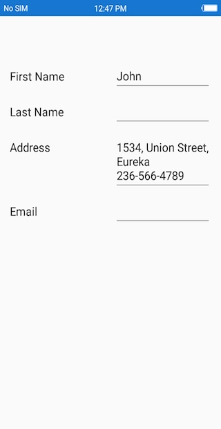

## Numeric editor

In the numeric editor, the [SfNumericTextBox](https://help.syncfusion.com/xamarin/sfnumerictextbox/overview) is loaded.

### Change maximum NumberDecimalDigits in the numeric editor

In the `SfNumericTextBox`, two decimal digits will be displayed by default. You can change the number of decimal digits being displayed by setting the [MaximumNumberDecimalDigits](https://help.syncfusion.com/cr/xamarin/Syncfusion.XForms.DataForm.DataFormNumericItemBase.html#Syncfusion_XForms_DataForm_DataFormNumericItemBase_MaximumNumberDecimalDigits) property in the [DataFormNumericItem](https://help.syncfusion.com/cr/xamarin/Syncfusion.XForms.DataForm.DataFormNumericItem.html).



dataForm.AutoGeneratingDataFormItem += DataForm_AutoGeneratingDataFormItem;
private void DataForm_AutoGeneratingDataFormItem(object sender, AutoGeneratingDataFormItemEventArgs e)
{
    if (e.DataFormItem != null && e.DataFormItem.Name == "Amount")
    {
        (e.DataFormItem as DataFormNumericItem).MaximumNumberDecimalDigits = 3;
    }
}



### See also

[How to remove a thousand separators in the numeric text field in Xamarin.Forms DataForm (SfDataForm)](https://www.syncfusion.com/kb/11527/)                                                                                                                                                                                                
[How to resolve missing decimal point issue on Samsung Devices (S6, S8) numeric keyboard in DataForm ?](https://www.syncfusion.com/kb/10068/)

## Date editor

In the date editor, the [DatePicker](https://developer.xamarin.com/api/type/Xamarin.Forms.DatePicker/) will be loaded.

### Setting null value in date editor

In `DatePicker`, the default date value (1/01/0001) is displayed by default. You can also set the null value by adding nullable `DateTime` data type for the date picker property in data form, which allows you to set the null value and display the empty value in date editor. 




[DataType(DataType.Date)]
[Display(Name ="Birth Date")]
public DateTime? BirthDate { get; set; }




### Customizing format in date editor

In the `DatePicker`, short date will be shown by default. You can change the applied format by setting the [Format](https://help.syncfusion.com/cr/xamarin/Syncfusion.XForms.DataForm.DataFormDateItem.html#Syncfusion_XForms_DataForm_DataFormDateItem_Format) property in [DataFormDateItem](https://help.syncfusion.com/cr/xamarin/Syncfusion.XForms.DataForm.DataFormDateItem.html).



dataForm.AutoGeneratingDataFormItem += DataForm_AutoGeneratingDataFormItem;

private void DataForm_AutoGeneratingDataFormItem(object sender, AutoGeneratingDataFormItemEventArgs e)
{   

    if (e.DataFormItem != null && e.DataFormItem.Name == "Date")
    {
        (e.DataFormItem as DataFormDateItem).Format = "ddd, MMM d, yyyy";
    }
}



### Setting title for date editor

You can set title to the date editor by handling the [Title](https://help.syncfusion.com/cr/xamarin/Syncfusion.XForms.DataForm.DataFormDateItem.html#Syncfusion_XForms_DataForm_DataFormDateItem_Title) property in [DataFormDateItem](https://help.syncfusion.com/cr/xamarin/Syncfusion.XForms.DataForm.DataFormDateItem.html). The default value of the property is `Choose Date`.



dataForm.AutoGeneratingDataFormItem += DataForm_AutoGeneratingDataFormItem;

private void DataForm_AutoGeneratingDataFormItem(object sender, AutoGeneratingDataFormItemEventArgs e)
{   

    if (e.DataFormItem != null && e.DataFormItem.Name == "BirthDate")
    {       
         if(Device.RuntimePlatform == Device.UWP)
        {
            (e.DataFormItem as DataFormDateItem).Title = "Select a date";
        }
    }
}



>N `Title` property is applicable only for XForms UWP platform.

### Setting MaximumDate and MinimumDate in date editor

You can customize the maximum and minimum allowable dates in the `DatePicker` by setting [MaximumDate](https://help.syncfusion.com/cr/xamarin/Syncfusion.XForms.DataForm.DataFormDateItem.html#Syncfusion_XForms_DataForm_DataFormDateItem_MaximumDate) and [MinimumDate](https://help.syncfusion.com/cr/xamarin/Syncfusion.XForms.DataForm.DataFormDateItem.html#Syncfusion_XForms_DataForm_DataFormDateItem_MinimumDate) in the [DataFormDateItem](https://help.syncfusion.com/cr/xamarin/Syncfusion.XForms.DataForm.DataFormDateItem.html) respectively.



dataForm.AutoGeneratingDataFormItem += DataForm_AutoGeneratingDataFormItem;

private void DataForm_AutoGeneratingDataFormItem(object sender, AutoGeneratingDataFormItemEventArgs e)
{
    if (e.DataFormItem != null && e.DataFormItem.Name == "Date")
    {
        (e.DataFormItem as DataFormDateItem).MinimumDate = new DateTime(2017, 5, 5);
        (e.DataFormItem as DataFormDateItem).MaximumDate = new DateTime(2017, 9, 2);
    }
}




## Time editor

In the time editor, the [TimePicker](https://docs.microsoft.com/en-us/dotnet/api/xamarin.forms.timepicker?view=xamarin-forms) will be loaded.

**Setting null value in time editor**

In `TimePicker`, the default time value (12:00 AM) is displayed by default. You can also set the null value by adding nullable `DateTime` data type for the time picker property in data form, which allows you to set the null value and display the empty value in time editor. 




[DataType(DataType.Time)]
[Display(Name = "Birth Time")]
public DateTime? BirthTime { get; set; }




**Customizing format in time editor**

In the `TimePicker`, short time will be shown by default. You can change the applied format by setting the [Format](https://help.syncfusion.com/cr/xamarin/Syncfusion.XForms.DataForm.DataFormTimeItem.html#Syncfusion_XForms_DataForm_DataFormTimeItem_Format) property in [DataFormTimeItem](https://help.syncfusion.com/cr/xamarin/Syncfusion.XForms.DataForm.DataFormTimeItem.html).




dataForm.AutoGeneratingDataFormItem += DataForm_AutoGeneratingDataFormItem;

private void DataForm_AutoGeneratingDataFormItem(object sender, AutoGeneratingDataFormItemEventArgs e)
{
    if (e.DataFormItem != null && e.DataFormItem.Name == "BirthTime")
        (e.DataFormItem as DataFormTimeItem).Format = "HH:mm";
} 




### Setting title for time editor

You can set title to the time editor by handling the [Title](https://help.syncfusion.com/cr/xamarin/Syncfusion.XForms.DataForm.DataFormTimeItem.html#Syncfusion_XForms_DataForm_DataFormTimeItem_Title) property in [DataFormTimeItem](https://help.syncfusion.com/cr/xamarin/Syncfusion.XForms.DataForm.DataFormTimeItem.html). The default value of this property is `Choose Time`.



dataForm.AutoGeneratingDataFormItem += DataForm_AutoGeneratingDataFormItem;

private void DataForm_AutoGeneratingDataFormItem(object sender, AutoGeneratingDataFormItemEventArgs e)
{   

    if (e.DataFormItem != null && e.DataFormItem.Name == "BirthTime")
    {
        if(Device.RuntimePlatform == Device.UWP)
        {
            (e.DataFormItem as DataFormTimeItem).Title = "Select time of birth";
        }
    }
}



>N `Title` property is applicable only for XForms UWP platform.

## Segment editor

In segment editor, the [SfSegmentedControl](https://help.syncfusion.com/xamarin/sfsegmentedcontrol/overview) is loaded, and DataForm `Segment` editor supports to `enum` and `List` data type properties.

To add `Segment` editor in DataForm, register the editor as `Segment` for the required property using the [RegisterEditor](https://help.syncfusion.com/cr/xamarin/Syncfusion.XForms.DataForm.SfDataForm.html#Syncfusion_XForms_DataForm_SfDataForm_RegisterEditor_System_String_System_String_) method.

**Support for enum data type**

By default, the `ItemsSource` for `SfSegmentedControl` is auto-generated for `enum` data types, if the property has been registered for `Segment` editor.




dataForm.RegisterEditor("SaveTo", "Segment");

private Location saveTo;

[Display(Name = "Save To")]
public Location SaveTo
{
    get { return saveTo; }
    set { this.saveTo = value; }
}
public enum Location
{
    Sim,
    Phone
}




**Customizing ItemsSource of SfSegmentedControl**

For `List` data types, you can set the `ItemsSource` for `SfSegmentedControl` by using the SourceProvider or using ItemsSource property of [DataFormSegmentItem](https://help.syncfusion.com/cr/xamarin/Syncfusion.XForms.DataForm.DataFormSegmentItem.html).

**Using SourceProvider**




private string saveTo;
[Display(Name ="Save To")]
public string SaveTo
{
    get { return saveTo; }
	set { this. saveTo = value; }
}

public class SourceProviderExt : SourceProvider
{
    public override IList GetSource(string sourceName)
    {
		var list = new List<string>();
		if(sourceName == "SaveTo")
		{
			list.Add("Sim");
			list.Add("Phone");
		}
		return list;
	}
}

dataForm.RegisterEditor("SaveTo", "Segment");
dataForm.SourceProvider = new SourceProviderExt();




**Using ItemsSource property of DataFormSegmentItem**

You can also set `ItemsSource` for segment editor by using the [ItemsSource](https://help.syncfusion.com/cr/xamarin/Syncfusion.XForms.DataForm.DataFormSegmentItem.html#Syncfusion_XForms_DataForm_DataFormSegmentItem_ItemsSource) property in the [DataFormSegmentItem](https://help.syncfusion.com/cr/xamarin/Syncfusion.XForms.DataForm.DataFormSegmentItem.html).




dataForm.RegisterEditor("SaveTo", "Segment");
dataForm.AutoGeneratingDataFormItem += DataForm_AutoGeneratingDataFormItem;

private void DataForm_AutoGeneratingDataFormItem(object sender, AutoGeneratingDataFormItemEventArgs e)
{
    if (e.DataFormItem != null && e.DataFormItem.Name == "SaveTo")
    {
		var list = new List<string>();
		list.Add("Sim");
		list.Add("Phone");
		(e.DataFormItem as DataFormSegmentItem).ItemsSource = list;
    }
}




## CheckBox editor

In `CheckBox` editor, the [SfCheckBox](https://help.syncfusion.com/xamarin/sfcheckbox/overview ) control is loaded. By default, for `bool` data type property, the `CheckBox` editor will be loaded in data form.




[Display(Name = "Is Billable")]
public bool IsBillable { get; set; } = true;

[Display(Name = "Registered Member")]
public bool RegisteredMember { get; set; }




**Visual states of SfCheckBox**

SfCheckBox support three visual states.
  - Checked
  - UnChecked
  - Intermediate




[Display(Name = "Is Billable")]
public bool IsBillable { get; set; } = true;

[Display(Name = "Registered Member")]
public bool RegisteredMember { get; set; } = false;

[Display( Name = "Is Refundable")]
public bool? IsRefundable { get; set; } = null;



		

  
**Customizing the SfCheckBox state color**

You can change the  color of the checked/indeterminate state of SfCheckBox using the [CheckedColor](https://help.syncfusion.com/cr/xamarin/Syncfusion.XForms.DataForm.DataFormCheckBoxItem.html#Syncfusion_XForms_DataForm_DataFormCheckBoxItem_CheckedColor) property and  change the  color of unchecked state  using the [UnCheckedColor](https://help.syncfusion.com/cr/xamarin/Syncfusion.XForms.DataForm.DataFormCheckBoxItem.html#Syncfusion_XForms_DataForm_DataFormCheckBoxItem_UnCheckedColor) property in [DataFormCheckBoxItem](https://help.syncfusion.com/cr/xamarin/Syncfusion.XForms.DataForm.DataFormCheckBoxItem.html) in the `AutoGeneratingDataFormItem` event of data form.




dataForm.AutoGeneratingDataFormItem += DataForm_AutoGeneratingDataFormItem;

private void DataForm_AutoGeneratingDataFormItem(object sender, AutoGeneratingDataFormItemEventArgs e)
{
    if (e.DataFormItem != null)
    {
        if (e.DataFormItem.Name == "IsBillable")
        {
            (e.DataFormItem as DataFormCheckBoxItem).CheckedColor = Color.Green;
        }
        if (e.DataFormItem.Name == "RegisteredMember")
        {
            (e.DataFormItem as DataFormCheckBoxItem).UnCheckedColor = Color.Blue;
        }
    }
}
 



**Setting SfCheckBox caption text**

You can customize the appearance of display text in `SfCheckBox` using the `Text` property of the `DataFormCheckBoxItem`.




[DisplayOptions(ShowLabel = false)]
public bool Agree { get; set; }
		
dataForm.AutoGeneratingDataFormItem += DataForm_AutoGeneratingDataFormItem;

private void DataForm_AutoGeneratingDataFormItem(object sender, AutoGeneratingDataFormItemEventArgs e)
{
    if (e.DataFormItem != null)
    {
        if (e.DataFormItem.Name.Equals("Agree"))
        {
            (e.DataFormItem as DataFormCheckBoxItem).IsThreeState = false;
            (e.DataFormItem as DataFormCheckBoxItem).Text = "I agree to the Terms & Conditions";
        }
    }
}




## Switch Editor

In switch editor, [Switch](https://docs.microsoft.com/en-us/dotnet/api/xamarin.forms.switch?view=xamarin-forms) is loaded, and DataForm `Switch` editor supports bool data type property.

To add `Switch` editor in DataForm, register the editor as `Switch` for the required property using the [RegisterEditor](https://help.syncfusion.com/cr/xamarin/Syncfusion.XForms.DataForm.SfDataForm.html#Syncfusion_XForms_DataForm_SfDataForm_RegisterEditor_System_String_System_String_) method.




       dataForm.RegisterEditor("CellularData", "Switch");
       dataForm.RegisterEditor("AirplaneMode", "Switch");

        [Display(Name ="Cellular Data")]
        public bool CellularData { get; set; } = true;

        [Display(Name = "Airplane Mode")]
        public bool AirplaneMode { get; set; }
 




## Drop down editor

In the drop down editor, the [SfComboBox](https://help.syncfusion.com/xamarin/sfcombobox/overview) will be loaded.

### Customizing ItemsSource of SfComboBox

By default, the `ItemsSource` for SfComboBox is auto-generated for enum types and collection type properties. For other types, you can set the `ItemsSource` by using the [SourceProvider](https://help.syncfusion.com/cr/xamarin/Syncfusion.XForms.DataForm.SourceProvider.html).

#### Using SourceProvider



private string _ItemName;
public string ItemName
{
    get
    {
        return _ItemName;
    }
    set
    {
        _ItemName = value;
    }
}
public class SourceProviderExt : SourceProvider
{
    public override IList GetSource(string sourceName)
    {
        var list = new List<string>();
        if (sourceName == "ItemName")
        {
            list.Add("Item1");
            list.Add("Item2");
            list.Add("Item3");
        }
        return list;
    }
}
dataForm.SourceProvider = new SourceProviderExt();
dataForm.RegisterEditor("ItemName", "DropDown");



#### Using ItemsSource property

You can also set the ItemsSource for drop down editor by using the [ItemsSource](https://help.syncfusion.com/cr/xamarin/Syncfusion.XForms.DataForm.DataFormDropDownItem.html#Syncfusion_XForms_DataForm_DataFormDropDownItem_ItemsSource) property in the `DataFormDropDownItem`.



dataForm.AutoGeneratingDataFormItem += DataForm_AutoGeneratingDataFormItem;

private void DataForm_AutoGeneratingDataFormItem(object sender, AutoGeneratingDataFormItemEventArgs e)
{
    if (e.DataFormItem != null && e.DataFormItem.Name == "Name")
    {
        var list = new List<string>();
        list.Add("Home");
        list.Add("Food");
        list.Add("Utilities");
        list.Add("Education");
        (e.DataFormItem as DataFormDropDownItem).ItemsSource = list;
    }
}



### Changing ItemsSource of SfComboBox at run time

You can also change the `ItemsSource` at runtime.



private void Button_Click(object sender, EventArgs e)
{
    var dataFormItem = dataForm.ItemManager.DataFormItems["Name"];
    if (dataFormItem.Name == "Name")
    {
        var list = new List<string>();
        list.Add("Home");
        list.Add("Food");
        list.Add("Utilities");
        list.Add("Education");
        (dataFormItem as DataFormDropDownItem).ItemsSource = list;
    }
}



### Loading complex type property values in drop down editor

You can display the complex type property values in drop down editor by using the [GetSource](https://help.syncfusion.com/cr/xamarin/Syncfusion.XForms.DataForm.SourceProvider.html#Syncfusion_XForms_DataForm_SourceProvider_GetSource_System_String_) override method of SourceProvider class, which is used to get source list as complex property values for drop down editor and set it to `SourceProvider` property of SfDataForm. You need to use `AutoGeneratingDataFormItem `event to set [DisplayMemberPath](https://help.syncfusion.com/cr/xamarin/Syncfusion.XForms.DataForm.DataFormDropDownItem.html#Syncfusion_XForms_DataForm_DataFormDropDownItem_DisplayMemberPath) and [SelectedValuePath](https://help.syncfusion.com/cr/xamarin/Syncfusion.XForms.DataForm.DataFormDropDownItem.html#Syncfusion_XForms_DataForm_DataFormDropDownItem_SelectedValuePath) property value of DataFormDropDownItem for complex type property.

N> Class cannot be directly set as data type for drop down editor in this complex type scenario.



dataForm.SourceProvider = new SourceProviderExt();
dataForm.DataObject = new ContactInfo();
dataForm.AutoGeneratingDataFormItem += DataForm_AutoGeneratingDataFormItem;
dataForm.RegisterEditor("City", "DropDown");
 
private void DataForm_AutoGeneratingDataFormItem(object sender, AutoGeneratingDataFormItemEventArgs e)
{
    if (e.DataFormItem != null && e.DataFormItem.Name == "City")
    {
        if (Device.RuntimePlatform != Device.UWP)
        {
            (e.DataFormItem as DataFormDropDownItem).DisplayMemberPath = "City";
            (e.DataFormItem as DataFormDropDownItem).SelectedValuePath = "PostalCode";
        }
    }
} 
 
public class SourceProviderExt : SourceProvider
{
    public override IList GetSource(string sourceName)
    {
        if (sourceName == "City")
        {
            List<Address> details = new List<Address>();
            details.Add(new Address() { City = "Chennai", PostalCode = 1 });
            details.Add(new Address() { City = "Paris", PostalCode = 2 });
            details.Add(new Address() { City = "Vatican", PostalCode = 3 });

            return details;
        }
       return new List<string>();
    }
}

public class ContactInfo
{
    [Display(Name ="First Name")]
    public String FirstName { get; set; } 
    public string City { get; set; }
}

public class Address
{
    public int PostalCode { get; set; }
    public string City { get; set; }
}



### See also

[How to make editable drop down in Xamarin.Forms DataForm (SfDataForm)](https://www.syncfusion.com/kb/11272/)                                                                                                                                                                                                                                                                                                                                                                           
[How to add entered text to the dropdown collection in Xamarin.Forms DataForm (SfDataForm)](https://www.syncfusion.com/kb/11402/)

## Picker editor

In the picker editor, the [Picker](https://developer.xamarin.com/api/type/Xamarin.Forms.Picker/) will be loaded.

### Changing title in the Picker

You can show some text in the `Picker` popup by using the [Title](https://help.syncfusion.com/cr/xamarin/Syncfusion.XForms.DataForm.DataFormPickerItem.html#Syncfusion_XForms_DataForm_DataFormPickerItem_Title) property in the [DataFormPickerItem](https://help.syncfusion.com/cr/xamarin/Syncfusion.XForms.DataForm.DataFormPickerItem.html).



dataForm.AutoGeneratingDataFormItem += DataForm_AutoGeneratingDataFormItem;

private void DataForm_AutoGeneratingDataFormItem(object sender, AutoGeneratingDataFormItemEventArgs e)
{
    if (e.DataFormItem != null && e.DataFormItem.Name == "Name")
    {
        (e.DataFormItem as DataFormPickerItem).Title = "Expense Category";
    }
}



### Customizing ItemsSource of Picker

By default, the `ItemsSource` for picker is auto-generated for enum type and collection type properties. For other types, you can set the `ItemsSource` by using [SourceProvider](https://help.syncfusion.com/cr/xamarin/Syncfusion.XForms.DataForm.SfDataForm.html#Syncfusion_XForms_DataForm_SfDataForm_SourceProvider).

### Using SourceProvider



private string _ItemName;
public string ItemName
{
    get
    {
        return _ItemName;
    }
    set
    {
        _ItemName = value;
    }
}
public class SourceProviderExt : SourceProvider
{
    public override IList GetSource(string sourceName)
    {
        var list = new List<string>();
        if (sourceName == "ItemName")
        {
            list.Add("Item1");
            list.Add("Item2");
            list.Add("Item3");
        }
        return list;
    }
}
dataForm.SourceProvider = new SourceProviderExt();
dataForm.RegisterEditor("ItemName", "Picker");



### Using event

You can also set `ItemsSource` for picker editor by using the [ItemsSource](https://help.syncfusion.com/cr/xamarin/Syncfusion.XForms.DataForm.DataFormPickerItem.html#Syncfusion_XForms_DataForm_DataFormPickerItem_ItemsSource) property in the [DataFormPickerItem](https://help.syncfusion.com/cr/xamarin/Syncfusion.XForms.DataForm.DataFormPickerItem.html).



dataForm.AutoGeneratingDataFormItem += DataForm_AutoGeneratingDataFormItem;

private void DataForm_AutoGeneratingDataFormItem(object sender, AutoGeneratingDataFormItemEventArgs e)
{
    if (e.DataFormItem != null && e.DataFormItem.Name == "Name")
    {
        var list = new List<string>();
        list.Add("Home");
        list.Add("Food");
        list.Add("Utilities");
        list.Add("Education");
        (e.DataFormItem as DataFormPickerItem).ItemsSource = list;
    }
}



### Changing ItemsSource of picker at run time

You can also change the `ItemsSource` at runtime.



private void Button_Click(object sender, EventArgs e)
{
    var dataFormItem = dataForm.ItemManager.DataFormItems["Name"];
    if (dataFormItem.Name == "Name")
    {
        var list = new List<string>();
        list.Add("Home");
        list.Add("Food");
        list.Add("Utilities");
        list.Add("Education");
        (dataFormItem as DataFormPickerItem).ItemsSource = list;
    }
}



### Loading complex type property values in picker

You can display the complex type property values in picker editor by using the [GetSource](https://help.syncfusion.com/cr/xamarin/Syncfusion.XForms.DataForm.SourceProvider.html#Syncfusion_XForms_DataForm_SourceProvider_GetSource_System_String_) override method of SourceProvider class, which is used to get source list as complex property values for picker editor and set it to `SourceProvider` property of SfDataForm. You need to use `AutoGeneratingDataFormItem `event to set [DisplayMemberPath](https://help.syncfusion.com/cr/xamarin/Syncfusion.XForms.DataForm.DataFormPickerItem.html#Syncfusion_XForms_DataForm_DataFormPickerItem_DisplayMemberPath) and [ValueMemberPath](https://help.syncfusion.com/cr/xamarin/Syncfusion.XForms.DataForm.DataFormPickerItem.html#Syncfusion_XForms_DataForm_DataFormPickerItem_ValueMemberPath) property value DataFormPickerItem for complex type property.

N> Class cannot be directly set as data type for picker editor in this complex type scenario.



dataForm.SourceProvider = new SourceProviderExt();
dataForm.RegisterEditor("City", "Picker");
dataForm.DataObject = new ContactInfo();
dataForm.AutoGeneratingDataFormItem += DataForm_AutoGeneratingDataFormItem;
 
private void DataForm_AutoGeneratingDataFormItem(object sender, AutoGeneratingDataFormItemEventArgs e)
{
    if (e.DataFormItem != null && e.DataFormItem.Name == "City")
    {
        if (Device.RuntimePlatform != Device.UWP)
        {
            (e.DataFormItem as DataFormPickerItem).DisplayMemberPath = "City";
            (e.DataFormItem as DataFormPickerItem).ValueMemberPath = "PostalCode";
        }
    }
} 
 
public class SourceProviderExt : SourceProvider
{
    public override IList GetSource(string sourceName)
    {
        if (sourceName == "City")
        {
            List<Address> details = new List<Address>();
            details.Add(new Address() { City = "Chennai", PostalCode = 1 });
            details.Add(new Address() { City = "Paris", PostalCode = 2 });
            details.Add(new Address() { City = "Vatican", PostalCode = 3 });

            return details;
        }
       return new List<string>();
    }
}

public class ContactInfo
{
    public String FirstName { get; set; } 
    public string City { get; set; }
}

public class Address
{
    public int PostalCode { get; set; }
    public string City { get; set; }
}



You can download the entire source code of this demo for Xamarin.Forms from here [DataFormPickerEditor](http://www.syncfusion.com/downloads/support/directtrac/general/ze/SfDataForm_Picker-2009667790.zip)

N> `PickerEditor` not supported in `Xamarin.Forms.UWP`.

### See also

[How to load the picker editor ItemsSource asynchronously in Xamarin DataForm ?](https://www.syncfusion.com/kb/9748/)                                                                                                                                                                                           
[How to load the picker editor ItemsSource from SQLite offline database in Xamarin.Forms DataForm?](https://www.syncfusion.com/kb/9771/)                                                                                                                        
[How to add SfDatePicker to Xamarin.Forms DataForm (SfDataForm)](https://www.syncfusion.com/kb/11199/)                                                                                                                                                                                                                                                                                                                                                                                                                                                                                                                                                                                                                                                                      
[How to set a blank value to a picker editor in Xamarin.Forms DataForm](https://www.syncfusion.com/kb/10349/)                                                                                                                                                                                                                                                                                                                                                                                                                               
[How to add custom picker editor using SfPicker in Xamarin.Forms DataForm?](https://www.syncfusion.com/kb/10347/)

## NumericUpDown editor

In the numeric editor, the [SfNumericUpDown](https://help.syncfusion.com/xamarin/sfnumericupdown/overview) will be loaded.

### Changing SpinButtonAlignment in NumericUpDown

By default, up down button will be displayed in right side. You can change its alignment by using the [SpinButtonAlignment](https://help.syncfusion.com/cr/xamarin/Syncfusion.XForms.DataForm.DataFormNumericUpDownItem.html#Syncfusion_XForms_DataForm_DataFormNumericUpDownItem_SpinButtonAlignment) property in the [DataFormNumericUpDownItem](https://help.syncfusion.com/cr/xamarin/Syncfusion.XForms.DataForm.DataFormNumericUpDownItem.html).



dataForm.AutoGeneratingDataFormItem += DataForm_AutoGeneratingDataFormItem;
private void DataForm_AutoGeneratingDataFormItem(object sender, AutoGeneratingDataFormItemEventArgs e)
{
    if (e.DataFormItem != null && e.DataFormItem.Name == "Quantity")
        (e.DataFormItem as DataFormNumericUpDownItem).SpinButtonAlignment = SpinButtonAlignment.Both;
}



### Changing step value in numeric up down

You can change the next increment and decrement values by using the [StepValue](https://help.syncfusion.com/cr/xamarin/Syncfusion.XForms.DataForm.DataFormNumericUpDownItem.html#Syncfusion_XForms_DataForm_DataFormNumericUpDownItem_StepValue) property in the [DataFormNumericUpDownItem](https://help.syncfusion.com/cr/xamarin/Syncfusion.XForms.DataForm.DataFormNumericUpDownItem.html). The default value of step value is 1.



dataForm.AutoGeneratingDataFormItem += DataForm_AutoGeneratingDataFormItem;

private void DataForm_AutoGeneratingDataFormItem(object sender, AutoGeneratingDataFormItemEventArgs e)
{
    if (e.DataFormItem != null && e.DataFormItem.Name == "Quantity")
        (e.DataFormItem as DataFormNumericUpDownItem).StepValue = 2;
}



N> `StepValue` property not supported in Xamarin.FormsUWP.

### Setting Maximum and Minimum value in numeric up down

You can set minimum and maximum values for numeric up down by using [Minimum](https://help.syncfusion.com/cr/xamarin/Syncfusion.XForms.DataForm.DataFormNumericUpDownItem.html#Syncfusion_XForms_DataForm_DataFormNumericUpDownItem_Minimum) and [Maximum](https://help.syncfusion.com/cr/xamarin/Syncfusion.XForms.DataForm.DataFormNumericUpDownItem.html#Syncfusion_XForms_DataForm_DataFormNumericUpDownItem_Maximum) properties values respectively.



dataForm.AutoGeneratingDataFormItem += DataForm_AutoGeneratingDataFormItem;

private void DataForm_AutoGeneratingDataFormItem(object sender, AutoGeneratingDataFormItemEventArgs e)
{
    if (e.DataFormItem != null && e.DataFormItem.Name == "Quantity")
    {
        (e.DataFormItem as DataFormNumericUpDownItem).Maximum = 100;
        (e.DataFormItem as DataFormNumericUpDownItem).Minimum = 0;
    }
}



### Enabling auto reverse in numeric up down

In the `SfNumericUpDown`, once maximum and minimum values reached, the value will be unchanged. You can enable the cyclic behavior by setting the [AutoReverse](https://help.syncfusion.com/cr/xamarin/Syncfusion.XForms.DataForm.DataFormNumericUpDownItem.html#Syncfusion_XForms_DataForm_DataFormNumericUpDownItem_AutoReverse) to `true` in the [DataFormNumericUpDownItem](https://help.syncfusion.com/cr/xamarin/Syncfusion.XForms.DataForm.DataFormNumericUpDownItem.html).



dataForm.AutoGeneratingDataFormItem += DataForm_AutoGeneratingDataFormItem;

private void DataForm_AutoGeneratingDataFormItem(object sender, AutoGeneratingDataFormItemEventArgs e)
{
    if (e.DataFormItem != null && e.DataFormItem.Name == "Quantity")
    {
        (e.DataFormItem as DataFormNumericUpDownItem).AutoReverse = true;
    }
}



### Changing CultureInfo in numeric up down and numeric text box

You can change the culture in `SfNumericTextBox` and `SfNumericUpDown` by using the [CultureInfo](https://help.syncfusion.com/cr/xamarin/Syncfusion.XForms.DataForm.DataFormNumericItemBase.html#Syncfusion_XForms_DataForm_DataFormNumericItemBase_CultureInfo) property in the [DataFormNumericItemBase](https://help.syncfusion.com/cr/xamarin/Syncfusion.XForms.DataForm.DataFormNumericItemBase.html).

#### SfNumericTextBox



private double _discount = 10;
        
[DataType(DataType.Currency)]
public double Discount
{
    get
    {
        return _discount;
    }
    set
    {
        _discount = value;
        RaisePropertyChanged("Discount");
    }
}
dataForm.AutoGeneratingDataFormItem += DataForm_AutoGeneratingDataFormItem;

private void DataForm_AutoGeneratingDataFormItem(object sender, AutoGeneratingDataFormItemEventArgs e)
{
    if (e.DataFormItem != null && e.DataFormItem.Name == "Discount")
    {
        (e.DataFormItem as DataFormNumericUpDownItem).CultureInfo = new System.Globalization.CultureInfo("fr-FR");
    }
}



#### SfNumericUpDown



dataForm.RegisterEditor("Discount", "NumericUpDown");
dataForm.AutoGeneratingDataFormItem += DataForm_AutoGeneratingDataFormItem;
private void DataForm_AutoGeneratingDataFormItem(object sender, AutoGeneratingDataFormItemEventArgs e)
{
    if (e.DataFormItem != null && e.DataFormItem.Name == "Discount")
    {
        (e.DataFormItem as DataFormNumericUpDownItem).FormatString = "c";
        (e.DataFormItem as DataFormNumericUpDownItem).CultureInfo = new System.Globalization.CultureInfo("fr-FR");
    }
}



## Password editor

In the password editor, the [Entry](https://developer.xamarin.com/guides/xamarin-forms/user-interface/text/entry/) is loaded.



private string password;

[Display(ShortName = "Transaction password", Prompt = "Enter password")]
[DataType(DataType.Password)]
public string Password
{
    get { return this.password; }
    set
    {
        this.password = value;
        RaisePropertyChanged("Password");
        this.RaiseErrorChanged("Password");
    }
}



### See also

[How to add custom Password editor in SfDataForm?](https://www.syncfusion.com/kb/9649/)

## RadioGroup editor

In the `RadioGroup` editor, the [SfRadioGroup](https://help.syncfusion.com/cr/xamarin/Syncfusion.XForms.Buttons.SfRadioGroup.html) control is loaded.

The [items](https://help.syncfusion.com/xamarin/sfradiobutton/overview) for `SfRadioGroup` is generated for `enum` and `List` data type properties. In order to add `RadioGroup` editor in the DataForm, you need to register editor as `RadioGroup` for the required property by using the [RegisterEditor](https://help.syncfusion.com/cr/xamarin/Syncfusion.XForms.DataForm.SfDataForm.html#Syncfusion_XForms_DataForm_SfDataForm_RegisterEditor_System_String_System_String_) method.

**Support for enum data type**

For `enum` data type property, `SfRadioGroup` [items](https://help.syncfusion.com/xamarin/sfradiobutton/overview) will be added based on specified property enum values.




dataForm.RegisterEditor("Phone", "RadioGroup");

private Numbers phone;
public Numbers Phone
{
	get { return phone; }
	set { this.phone = value; }
}

public enum Numbers
{
	Home,
	Work,
	Other
}



**Support for List data type**

For `List` data type property, you have to set the `ItemsSource` by using the [SourceProvider](https://help.syncfusion.com/cr/xamarin/Syncfusion.XForms.DataForm.SourceProvider.html), based on that `SfRadioGroup` [items](https://help.syncfusion.com/xamarin/sfradiobutton/overview) will be added.




dataForm.RegisterEditor("Phone", "RadioGroup");
dataForm.SourceProvider = new SourceProviderExt();

private string phone;
public string Phone
{
    get { return phone; }
    set { this.phone = value; }
}

public class SourceProviderExt : SourceProvider
{
    public override IList GetSource(string sourceName)
    {
		var list = new List<string>();
		if(sourceName == "Phone")
		{
			list.Add("Home");
			list.Add("Work");
			list.Add("Other");
		}
		return list;
    }
}




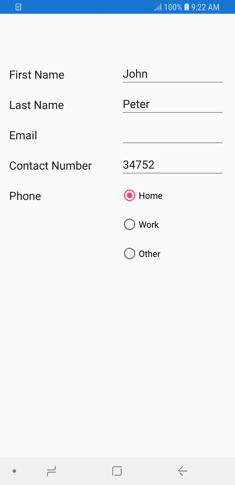

## MaskedEditText editor 

In the MaskedEditText editor, the [SfMaskedEdit](https://help.syncfusion.com/xamarin/sfmaskededit/overview) control is loaded.



[Display(Name = "Contact Number")] 
[DataType(DataType.PhoneNumber)] 
public string ContactNumber { get; set; }



### Setting the masked editor as int and double type 

By default, the SfMaskedEdit includes prompt and literals along with your input value. The special characters are not allowed in int and double type, so you need to exclude prompt and literals using the [ValueMaskFormat](https://help.syncfusion.com/cr/xamarin/Syncfusion.XForms.DataForm.DataFormMaskedEditTextItem.html#Syncfusion_XForms_DataForm_DataFormMaskedEditTextItem_ValueMaskFormat) property in DataFormMaskedEditTextItem.



dataForm.AutoGeneratingDataFormItem += DataForm_AutoGeneratingDataFormItem; 
…  

private void DataForm_AutoGeneratingDataFormItem(object sender, AutoGeneratingDataFormItemEventArgs e) 
{ 
    if (e.DataFormItem != null && e.DataFormItem.Name == "ContactNumber") 
    { 
        (e.DataFormItem as DataFormMaskedEditTextItem).ValueMaskFormat = Syncfusion.XForms.MaskedEdit.MaskFormat.ExcludePromptAndLiterals; 
        } 
} 



### Localizing special characters 

The special symbols such as currency, date separator, decimal separator, and other symbols can be localized using the [CultureInfo](https://help.syncfusion.com/cr/xamarin/Syncfusion.XForms.DataForm.DataFormMaskedEditTextItem.html#Syncfusion_XForms_DataForm_DataFormMaskedEditTextItem_CultureInfo) property of DataFormMaskedEditTextItem. 



(e.DataFormItem as DataFormMaskedEditTextItem).CultureInfo = new CultureInfo("fr-FR");  



### Customizing the clipboard text

By default, when you perform cut or copy operation, the clipboard text will be included with prompt and literals along with your input value. You can modify this and allow the clipboard to hold the value with or without prompt and literals by setting the [CutCopyMaskFormat](https://help.syncfusion.com/cr/xamarin/Syncfusion.XForms.DataForm.DataFormMaskedEditTextItem.html#Syncfusion_XForms_DataForm_DataFormMaskedEditTextItem_CutCopyMaskFormat) property of the DataFormMaskedEditTextItem. 



(e.DataFormItem as DataFormMaskedEditTextItem).CutCopyMaskFormat = Syncfusion.XForms.MaskedEdit.MaskFormat.ExcludePromptAndLiterals; 



### Mask and mask types 

The mask and mask type of input can be customized using the [Mask](https://help.syncfusion.com/cr/xamarin/Syncfusion.XForms.DataForm.DataFormMaskedEditTextItem.html#Syncfusion_XForms_DataForm_DataFormMaskedEditTextItem_Mask) and [MaskType](https://help.syncfusion.com/cr/xamarin/Syncfusion.XForms.DataForm.DataFormMaskedEditTextItem.html#Syncfusion_XForms_DataForm_DataFormMaskedEditTextItem_MaskType) properties of DataFormMaskedEditTextItem. Refer to this [link](https://help.syncfusion.com/xamarin/sfmaskededit/masktype.html) to know more about the mask characters and mask types available in the masked editor. 



(e.DataFormItem as DataFormMaskedEditTextItem).Mask = @"+1\(\d{3}\)\d{6}"; 
(e.DataFormItem as DataFormMaskedEditTextItem).MaskType = Syncfusion.XForms.MaskedEdit.MaskType.RegEx; 



###  Customizing prompt character

The custom prompt character can be set using the [PromptChar](https://help.syncfusion.com/cr/xamarin/Syncfusion.XForms.DataForm.DataFormMaskedEditTextItem.html#Syncfusion_XForms_DataForm_DataFormMaskedEditTextItem_PromptChar) property of DataFormMaskedEditTextItem.  



(e.DataFormItem as DataFormMaskedEditTextItem).PromptChar = '#'; 



### Show password character
The [MaskedTextEditor](https://help.syncfusion.com/cr/xamarin/Syncfusion.XForms.DataForm.Editors.DataFormMaskedEditTextEditor.html) supports to work as a password text box when setting a character to the [PasswordChar](https://help.syncfusion.com/cr/xamarin/Syncfusion.XForms.DataForm.DataFormMaskedEditTextItem.html#Syncfusion_XForms_DataForm_DataFormMaskedEditTextItem_PasswordChar) property of [DataFormMaskedEditTextItem](https://help.syncfusion.com/cr/xamarin/Syncfusion.XForms.DataForm.DataFormMaskedEditTextItem.html).



(e.DataFormItem as DataFormMaskedEditTextItem).PasswordChar = '*'; 



### Password Delay
When providing password character, you can show the typed character with some delay using the [EnablePasswordDelay](https://help.syncfusion.com/cr/xamarin/Syncfusion.XForms.DataForm.DataFormMaskedEditTextItem.html#Syncfusion_XForms_DataForm_DataFormMaskedEditTextItem_EnablePasswordDelay) property in [DataFormMaskedEditTextItem](https://help.syncfusion.com/cr/xamarin/Syncfusion.XForms.DataForm.DataFormMaskedEditTextItem.html). When enabling the EnablePasswordDelay property, the typed character will be displayed for a few seconds before it is converted to the password character.



(e.DataFormItem as DataFormMaskedEditTextItem).PasswordChar = '*'; 
(e.DataFormItem as DataFormMaskedEditTextItem).EnablePasswordDelay = true; 



### Password delay duration
When `PasswordDelay` is enabled, you can handle the duration of the displaying typed character using the [PasswordDelayDuration](https://help.syncfusion.com/cr/xamarin/Syncfusion.XForms.DataForm.DataFormMaskedEditTextItem.html#Syncfusion_XForms_DataForm_DataFormMaskedEditTextItem_PasswordDelayDuration) property in [DataFormMaskedEditTextItem](https://help.syncfusion.com/cr/xamarin/Syncfusion.XForms.DataForm.DataFormMaskedEditTextItem.html).



(e.DataFormItem as DataFormMaskedEditTextItem).PasswordChar = '*'; 
(e.DataFormItem as DataFormMaskedEditTextItem).EnablePasswordDelay = true; 
(e.DataFormItem as DataFormMaskedEditTextItem).PasswordDelayDuration  = 2; 



### See also

[How to mask credit card number in Xamarin.Forms DataForm (SfDataForm)](https://www.syncfusion.com/kb/11542/)

## AutoComplete editor

In the autocomplete editor, the [SfAutoComplete](https://help.syncfusion.com/xamarin/sfautocomplete/overview) is loaded.

### Customizing ItemsSource of autocomplete editor

By default, the [ItemsSource](https://help.syncfusion.com/cr/xamarin/Syncfusion.XForms.DataForm.DataFormAutoCompleteItem.html#Syncfusion_XForms_DataForm_DataFormAutoCompleteItem_ItemsSource) for `AutoComplete` editor is auto-generated for enum types. For other types, you can set [ItemsSource](https://help.syncfusion.com/cr/xamarin/Syncfusion.XForms.DataForm.DataFormAutoCompleteItem.html#Syncfusion_XForms_DataForm_DataFormAutoCompleteItem_ItemsSource) using [SourceProvider](https://help.syncfusion.com/cr/xamarin/Syncfusion.XForms.DataForm.SourceProvider.html).

#### Using SourceProvider



private string country;
public string Country
{
    get
    {
        return country;
    }
    set
    {
        country = value;
    }
}
public class SourceProviderExt : SourceProvider
{
    public override IList GetSource(string sourceName)
    {
        var list = new List<string>();
        if (sourceName == "Country")
        {
                list.Add("Indonesia");
                list.Add("Italy");
                list.Add("India");
                list.Add("Iran");
                list.Add("Iraq");
                list.Add("Uganda");
                list.Add("Ukraine");
                list.Add("Canada");
                list.Add("Australia");
                list.Add("Uzbekistan");
                list.Add("France");
                list.Add("United Kingdom");
                list.Add("United States");

        }
        return list;
    }
}
dataForm.SourceProvider = new SourceProviderExt();
dataForm.RegisterEditor("Country", "AutoComplete");



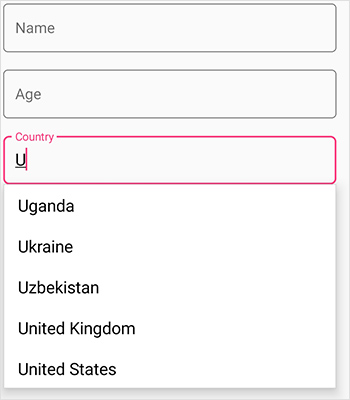

#### Using AutoGeneratingItem event

You can also set `ItemsSource` for autocomplete editor by using [ItemsSource](https://help.syncfusion.com/cr/xamarin/Syncfusion.XForms.DataForm.DataFormAutoCompleteItem.html#Syncfusion_XForms_DataForm_DataFormAutoCompleteItem_ItemsSource) property in the [DataFormAutoCompleteItem](https://help.syncfusion.com/cr/xamarin/Syncfusion.XForms.DataForm.DataFormAutoCompleteItem.html).



dataForm.RegisterEditor("Country", "AutoComplete");
dataForm.AutoGeneratingDataFormItem += DataForm_AutoGeneratingDataFormItem;

private void DataForm_AutoGeneratingDataFormItem(object sender, AutoGeneratingDataFormItemEventArgs e)
{
    if (e.DataFormItem != null && e.DataFormItem.Name == "Country")
    {
        var list = new List<string>();
                list.Add("Indonesia");
                list.Add("Italy");
                list.Add("India");
                list.Add("Iran");
                list.Add("Iraq");
                list.Add("Uganda");
                list.Add("Ukraine");
                list.Add("Canada");
                list.Add("Australia");
                list.Add("Uzbekistan");
                list.Add("France");
                list.Add("United Kingdom");
                list.Add("United States");
        (e.DataFormItem as DataFormAutoCompleteItem).ItemsSource = list;
    }
}



#### Dynamically changing the ItemsSource of autocomplete editor

You can also change the [ItemsSource](https://help.syncfusion.com/cr/xamarin/Syncfusion.XForms.DataForm.DataFormAutoCompleteItem.html#Syncfusion_XForms_DataForm_DataFormAutoCompleteItem_ItemsSource) at runtime.



private void Button_Click(object sender, EventArgs e)
{
    var dataFormItem = dataForm.ItemManager.DataFormItems["Country"];
    if (dataFormItem.Name == "Country")
    {
        var list = new List<string>();
            list.Add("Ukraine");
            list.Add("Canada");
            list.Add("Australia");
            list.Add("Uzbekistan");
            list.Add("France");
            list.Add("United Kingdom");
            list.Add("United States");
        (dataFormItem as DataFormAutoCompleteItem).ItemsSource = list;
    }
}



#### Loading complex type property values in autocomplete editor

You can display the complex type property values in autocomplete editor by using [GetSource](https://help.syncfusion.com/cr/xamarin/Syncfusion.XForms.DataForm.SourceProvider.html#Syncfusion_XForms_DataForm_SourceProvider_GetSource_System_String_) override method of the SourceProvider class, which is used to get source list as complex property values for autocomplete editor and set it to the `SourceProvider` property of SfDataForm.Use the `AutoGeneratingDataFormItem `event to set [DisplayMemberPath] and [SelectedValuePath] property values of AutoComplete for complex type property.

N> Class cannot be directly set as data type for autocomplete editor in this complex type scenario.



dataForm.SourceProvider = new SourceProviderExt();
dataForm.DataObject = new ContactInfo();
dataForm.RegisterEditor("City", "AutoComplete");
dataForm.AutoGeneratingDataFormItem += DataForm_AutoGeneratingDataFormItem;
 
private void DataForm_AutoGeneratingDataFormItem(object sender, AutoGeneratingDataFormItemEventArgs e)
{
    if (e.DataFormItem != null && e.DataFormItem.Name == "City")
    {
       (e.DataFormItem as DataFormAutoCompleteItem).DisplayMemberPath = "City";
       (e.DataFormItem as DataFormAutoCompleteItem).SelectedValuePath = "PostalCode";
    }
} 
 
public class SourceProviderExt : SourceProvider
{
    public override IList GetSource(string sourceName)
    {
        if (sourceName == "City")
        {
            List<Address> details = new List<Address>();
            details.Add(new Address() { City = "Colorado Springs", PostalCode = 1 });
            details.Add(new Address() { City = "Chicago", PostalCode = 2 });
            details.Add(new Address() { City = "Columbus", PostalCode = 3 });
            details.Add(new Address() { City = "Portland", PostalCode = 4 });
            details.Add(new Address() { City = "Paris", PostalCode = 5 });
            details.Add(new Address() { City = "Las Vegas", PostalCode = 6 });         
            details.Add(new Address() { City = "New York", PostalCode = 7 });
            details.Add(new Address() { City = "Cincinnati", PostalCode = 8 });
            details.Add(new Address() { City = "San Diego", PostalCode = 9 });

            return details;
        }
       return new List<string>();
    }
}

public class ContactInfo
{
    [Display(Name ="First Name")]
    public String FirstName { get; set; } 
    public string City { get; set; }
}

public class Address
{
    public int PostalCode { get; set; }
    public string City { get; set; }
}



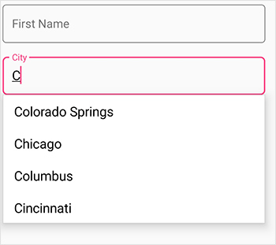

### Customizing the appearance of autocomplete editor

#### AutoComplete editor modes

The [DataFormAutoCompleteEditor](https://help.syncfusion.com/cr/xamarin/Syncfusion.XForms.DataForm.Editors.DataFormAutoCompleteEditor.html) provides the following three different ways to display the filtered suggestions.

* Suggest - Displays suggestions in drop-down list

* Append - Appends the first suggestion to text

* SuggestAppend - Performs both suggest and append.

The [AutoCompleteMode](https://help.syncfusion.com/cr/xamarin/Syncfusion.XForms.DataForm.DataFormAutoCompleteItem.html#Syncfusion_XForms_DataForm_DataFormAutoCompleteItem_AutoCompleteMode) property is used to choose the suggestion display mode in the [DataFormAutoCompleteItem](https://help.syncfusion.com/cr/xamarin/Syncfusion.XForms.DataForm.DataFormAutoCompleteItem.html) class. The default value is Suggest.

#### Suggestion choices in list

The filtered suggestions are displayed in a drop-down list. Users can pick an item from the list.



dataForm.DataObject = new ContactInfo();
dataForm.SourceProvider = new SourceProviderExt();
dataForm.RegisterEditor("Country", "AutoComplete");
dataForm.AutoGeneratingDataFormItem += DataForm_AutoGeneratingDataFormItem;

private void DataForm_AutoGeneratingDataFormItem(object sender, AutoGeneratingDataFormItemEventArgs e)
{
    if (e.DataFormItem != null && e.DataFormItem.Name == "Country")
    {
        var autoCompleteItem = (e.DataFormItem as DataFormAutoCompleteItem);
        autoCompleteItem.AutoCompleteMode = AutoCompleteMode.Suggest;
    }
}
public class SourceProviderExt : SourceProvider
{
    public override IList GetSource(string sourceName)
    {
        var list = new List<string>();
        if (sourceName == "Country")
        {
                list.Add("Indonesia");
                list.Add("Italy");
                list.Add("India");
                list.Add("Iran");
                list.Add("Iraq");
                list.Add("Uganda");
                list.Add("Ukraine");
                list.Add("Canada");
                list.Add("Australia");
                list.Add("Uzbekistan");
                list.Add("France");
                list.Add("United Kingdom");
                list.Add("United States");

        }
        return list;
    }
}




#### Appending suggestion to text

The first item in the filtered suggestions is appended to autocomplete editor text. In this mode,the drop down remains closed.



dataForm.DataObject = new ContactInfo();
dataForm.RegisterEditor("Country", "AutoComplete");
dataForm.AutoGeneratingDataFormItem += DataForm_AutoGeneratingDataFormItem;

private void DataForm_AutoGeneratingDataFormItem(object sender, AutoGeneratingDataFormItemEventArgs e)
{
    if (e.DataFormItem != null && e.DataFormItem.Name == "Country")
    {
        var autoCompleteItem = (e.DataFormItem as DataFormAutoCompleteItem);
        autoCompleteItem.AutoCompleteMode = AutoCompleteMode.Append;
    }
}



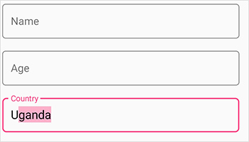

#### Suggesting choices and appending suggestions to Text

The text is appended to the first matched item in the suggestions collection, and the filtered suggestions are displayed in a drop-down list. The users can pick an item from a list directly or use the up and down keys for browsing the list.
	


dataForm.DataObject = new ContactInfo();
dataForm.RegisterEditor("Country", "AutoComplete");
dataForm.AutoGeneratingDataFormItem += DataForm_AutoGeneratingDataFormItem;

private void DataForm_AutoGeneratingDataFormItem(object sender, AutoGeneratingDataFormItemEventArgs e)
{
    if (e.DataFormItem != null && e.DataFormItem.Name == "Country")
    {
        var autoCompleteItem = (e.DataFormItem as DataFormAutoCompleteItem);
        autoCompleteItem.AutoCompleteMode = AutoCompleteMode.SuggestAppend;
    }
}



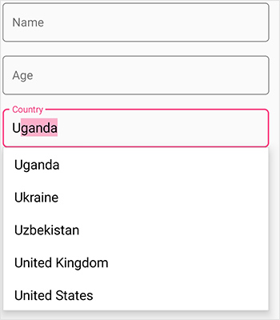

#### AutoComplete editor suggestion options

The phenomenon of string comparison for filtering suggestions can be changed using the [SuggestionMode](https://help.syncfusion.com/cr/xamarin/Syncfusion.XForms.DataForm.DataFormAutoCompleteItem.html#Syncfusion_XForms_DataForm_DataFormAutoCompleteItem_SuggestionMode) property. The default filtering strategy is “StartsWith”, and it is case insensitive. The available filtering modes are,

* StartsWith

* StartsWithCaseSensitive

* Contains

* ContainsWithCaseSensitive

* Equals

* EqualsWithCaseSensitive

* EndsWith

* EndsWithCaseSensitive

#### Filtering words that starts with input text

Displays all the matches that start with the typed characters in items source of autocomplete editor. This strategy is case in sensitive.



dataForm.DataObject = new ContactInfo();
dataForm.RegisterEditor("Country", "AutoComplete");
dataForm.AutoGeneratingDataFormItem += DataForm_AutoGeneratingDataFormItem;

private void DataForm_AutoGeneratingDataFormItem(object sender, AutoGeneratingDataFormItemEventArgs e)
{
    if (e.DataFormItem != null && e.DataFormItem.Name == "Country")
    {
        var autoCompleteItem = (e.DataFormItem as DataFormAutoCompleteItem);
        autoCompleteItem.SuggestionMode = Syncfusion.XForms.DataForm.SuggestionMode.StartsWith;
    }
}



#### Filtering words that starts with input text - CaseSensitive

Displays all the matches that start with the typed characters in items source of autocomplete editor. This strategy is case sensitive.



dataForm.DataObject = new ContactInfo();
dataForm.RegisterEditor("Country", "AutoComplete");
dataForm.AutoGeneratingDataFormItem += DataForm_AutoGeneratingDataFormItem;

private void DataForm_AutoGeneratingDataFormItem(object sender, AutoGeneratingDataFormItemEventArgs e)
{
    if (e.DataFormItem != null && e.DataFormItem.Name == "Country")
    {
        var autoCompleteItem = (e.DataFormItem as DataFormAutoCompleteItem);
        autoCompleteItem.SuggestionMode = Syncfusion.XForms.DataForm.SuggestionMode.StartsWithCaseSensitive;
    }
}



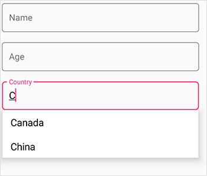

#### Filtering words that contains the input text

Displays all the matches that contain the typed characters in items source of autocomplete editor. This strategy is case in-sensitive.
	
#### Filtering words that contains the input text - CaseSensitive

Displays all the matches that contain the typed characters in items source of autocomplete editor. This strategy is case sensitive.

#### Filtering words that equals the input text

Displays all the words that completely matches with the typed characters in items source of autocomplete editor. This strategy is case in-sensitive.

#### Filtering words that equal the input text - CaseSensitive

Displays all the words that completely match with the typed characters in items source of autocomplete editor. This strategy is case sensitive.

#### Filtering words that end with the input text

Displays all the matches that end with the typed characters in items source of autocomplete editor. This strategy is case in-sensitive.

#### Filtering words that end with the input text - CaseSensitive 

Displays all the matches that end with the typed characters in items source of autocomplete editor. This strategy is case sensitive.

#### No results found text

When the entered item is not in the suggestion list, SfAutoComplete displays a text that indicates there is no search results found. You can set the desire text to be displayed for indicating no results found with the [NoResultsFoundText]((https://help.syncfusion.com/cr/xamarin/Syncfusion.XForms.DataForm.DataFormAutoCompleteItem.html#Syncfusion_XForms_DataForm_DataFormAutoCompleteItem_NoResultsFoundText)) property.



dataForm.DataObject = new ContactInfo();
dataForm.RegisterEditor("Country", "AutoComplete");
dataForm.AutoGeneratingDataFormItem += DataForm_AutoGeneratingDataFormItem;

private void DataForm_AutoGeneratingDataFormItem(object sender, AutoGeneratingDataFormItemEventArgs e)
{
    if (e.DataFormItem != null && e.DataFormItem.Name == "Country")
    {
        var autoCompleteItem = (e.DataFormItem as DataFormAutoCompleteItem);
        autoCompleteItem.NoResultsFoundText = "No result found";
    }
}



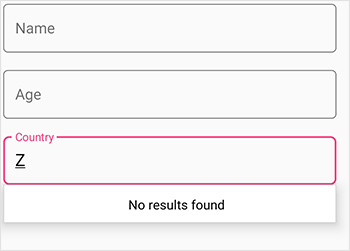

N> The [NoResultsFoundText](https://help.syncfusion.com/cr/xamarin/Syncfusion.XForms.DataForm.DataFormAutoCompleteItem.html#Syncfusion_XForms_DataForm_DataFormAutoCompleteItem_NoResultsFoundText) works by default in the UWP platform without setting any property by showing the text "No result found".

#### Highlighting match text

Highlights matching characters in a suggestion list to pick an item with more clarity. The text highlight can be indicated with various customizing colors by enabling the following property.

* [HighlightedTextColor](https://help.syncfusion.com/cr/xamarin/Syncfusion.XForms.DataForm.DataFormAutoCompleteItem.html#Syncfusion_XForms_DataForm_DataFormAutoCompleteItem_HighlightedTextColor) -  Sets the color of the highlighted text for differentiating the highlighted characters.

#### TextHighlightMode
 There are two ways to highlight the matching text:

* First occurrence



dataForm.DataObject = new ContactInfo();
dataForm.RegisterEditor("Country", "AutoComplete");
dataForm.AutoGeneratingDataFormItem += DataForm_AutoGeneratingDataFormItem;

private void DataForm_AutoGeneratingDataFormItem(object sender, AutoGeneratingDataFormItemEventArgs e)
{
    if (e.DataFormItem != null && e.DataFormItem.Name == "Country")
    {
        var autoCompleteItem = (e.DataFormItem as DataFormAutoCompleteItem);
        autoCompleteItem.SuggestionMode = SuggestionMode.StartsWith;
        autoCompleteItem.HighlightedTextColor = Color.Red;
        autoCompleteItem.TextHighlightMode = OccurrenceMode.FirstOccurrence;
        autoCompleteItem.ItemsSource = new List<string>
        {
            "Albania",
            "Algeria",
            "American Samoa",
            "Andorra"
        };
    }
}



* Multiple occurrence



dataForm.DataObject = new ContactInfo();
dataForm.RegisterEditor("Country", "AutoComplete");
dataForm.AutoGeneratingDataFormItem += DataForm_AutoGeneratingDataFormItem;

private void DataForm_AutoGeneratingDataFormItem(object sender, AutoGeneratingDataFormItemEventArgs e)
{
    if (e.DataFormItem != null && e.DataFormItem.Name == "Country")
    {
        var autoCompleteItem = (e.DataFormItem as DataFormAutoCompleteItem);
        autoCompleteItem.SuggestionMode = SuggestionMode.Contains;
        autoCompleteItem.HighlightedTextColor = Color.Red;
        autoCompleteItem.TextHighlightMode = OccurrenceMode.MultipleOccurrence;
        autoCompleteItem.ItemsSource = new List<string>
        {
            "Albania",
            "Algeria",
            "American Samoa",
            "Andorra"
        };
    }
}



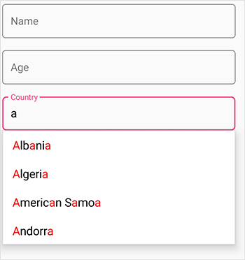

#### Maximum display item in dropdown column

Restrict the number of suggestions displayed and get the remaining items loaded by selecting LoadMore.You can restrict maximum suggestion to be displayed with the [MaximumSuggestion](https://help.syncfusion.com/cr/xamarin/Syncfusion.XForms.DataForm.DataFormAutoCompleteItem.html#Syncfusion_XForms_DataForm_DataFormAutoCompleteItem_MaximumSuggestion) property. You can set the desired text for displaying the Load more text using the [LoadMoreText](https://help.syncfusion.com/cr/xamarin/Syncfusion.XForms.DataForm.DataFormAutoCompleteItem.html#Syncfusion_XForms_DataForm_DataFormAutoCompleteItem_LoadMoreText) property.



dataForm.DataObject = new ContactInfo();
dataForm.RegisterEditor("Country", "AutoComplete");
dataForm.AutoGeneratingDataFormItem += DataForm_AutoGeneratingDataFormItem;

private void DataForm_AutoGeneratingDataFormItem(object sender, AutoGeneratingDataFormItemEventArgs e)
{
    if (e.DataFormItem != null && e.DataFormItem.Name == "Country")
    {
        var autoCompleteItem = (e.DataFormItem as DataFormAutoCompleteItem);
            autoCompleteItem.MaximumSuggestion = 3;
            autoCompleteItem.LoadMoreText = "Load more";
    }
}




#### Minimum prefix character

Instead of displaying suggestion list on every character entry, matches can be filtered and displayed after a few character entries using the [MinimumPrefixCharacters](https://help.syncfusion.com/cr/xamarin/Syncfusion.XForms.DataForm.DataFormAutoCompleteItem.html#Syncfusion_XForms_DataForm_DataFormAutoCompleteItem_MaximumSuggestion) property. The default value is 1.



dataForm.DataObject = new ContactInfo();
dataForm.RegisterEditor("Country", "AutoComplete");
dataForm.AutoGeneratingDataFormItem += DataForm_AutoGeneratingDataFormItem;

private void DataForm_AutoGeneratingDataFormItem(object sender, AutoGeneratingDataFormItemEventArgs e)
{
    if (e.DataFormItem != null && e.DataFormItem.Name == "Country")
    {
        var autoCompleteItem = (e.DataFormItem as DataFormAutoCompleteItem);
            autoCompleteItem.MinimumPrefixCharacters = 3;
    }
}



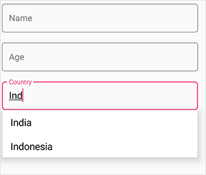

#### Diacritic sensitivity
The control does not stick with one type of keyboard, so you can populate items from a language with letters containing diacritics, and search for them with the English characters from an en-US keyboard. Users can enable or disable the diacritic sensitivity using [IgnoreDiacritic](https://help.syncfusion.com/cr/xamarin/Syncfusion.XForms.DataForm.DataFormAutoCompleteItem.html#Syncfusion_XForms_DataForm_DataFormAutoCompleteItem_IgnoreDiacritic) property. The following code example illustrates how to enable the diacritic sensitivity, so that items in the suggestion list can be populated by entering any diacritic character of that alphabet.



dataForm.DataObject = new Queries();
dataForm.RegisterEditor("RelatedQuestions", "AutoComplete");
dataForm.AutoGeneratingDataFormItem += DataForm_AutoGeneratingDataFormItem;

private void DataForm_AutoGeneratingDataFormItem(object sender, AutoGeneratingDataFormItemEventArgs e)
{
    if (e.DataFormItem != null && e.DataFormItem.Name == "RelatedQuestions")
    {
        var autoCompleteItem = (e.DataFormItem as DataFormAutoCompleteItem);
            autoCompleteItem.IgnoreDiacritic = false;
            autoCompleteItem.ItemsSource = new List<string>
                    {
                   "Hów tó gâin wéight?",
                   "Hów tó drâw ân éléphânt?",
                   "Whéré cân I buy â câmérâ?",
                   "Guidé mé âll thé wây",
                    };
    }
}
public class Queries
{
    [Display(ShortName = "Product Name")]
    public string ProductName { get; set; }
    public string Cost { get; set; }
    [Display(ShortName = "Related questions asked")]
    public string RelatedQuestions { get;set;}
}



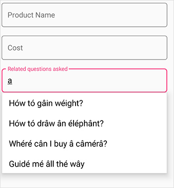

## Custom editor

The custom editor can be added to DataForm by overriding the `DataFormEditor` class for business models. You can create custom editor using [Views](https://docs.microsoft.com/en-us/xamarin/xamarin-forms/user-interface/controls/views) and [Layouts](https://docs.microsoft.com/en-us/xamarin/xamarin-forms/user-interface/controls/layouts). 

To add custom editor in DataForm, register the editor with custom registered type for the required property using `RegisterEditor` method. You can also customize editor settings by using specific override methods available in `DataFormEditor`. 

* Creating custom editor using views. 
* Creating custom editor using layouts.

### Creating custom editor using views 

Views such as labels, buttons, and sliders can be loaded to custom editor. Here, entry is loaded as custom editor for `ContactName` property. 



public class CustomTextEditor : DataFormEditor<Entry> 
{ 
    public CustomTextEditor(SfDataForm dataForm) : base(dataForm) 
    { 
    } 

    protected override Entry OnCreateEditorView(DataFormItem dataFormItem) 
    { 
        return new Entry(); 
    } 
} 
… 

dataForm.RegisterEditor("CustomTextEditor", new CustomTextEditor(dataForm)); 
dataForm.RegisterEditor("ContactName", "CustomTextEditor"); 



### Creating custom editor using layouts 

Layouts such as Grid, StackLayout, ContentView, and ScrollView can be added as custom editor. Here, the label and image view in Grid are loaded as custom editors for `ContactName` property. 



<?xml version="1.0" encoding="utf-8" ?> 
<ContentView xmlns="http://xamarin.com/schemas/2014/forms" 
                        xmlns:x="http://schemas.microsoft.com/winfx/2009/xaml" 
                        x:Class="DataForm_Forms.TextEditor"> 
    <ContentPage.Content> 
        <Grid> 
            <Grid.ColumnDefinitions> 
                <ColumnDefinition Width="0.05*"/> 
                <ColumnDefinition Width="Auto"/> 
            </Grid.ColumnDefinitions> 
            <Image Source="LabelContactName.png" /> 
            <Editor Grid.Column="1"/> 
        </Grid> 
    </ContentPage.Content> 
</ContentView> 





public class CustomTextEditor : DataFormEditor<TextEditor> 
{ 
    public CustomTextEditor(SfDataForm dataForm) : base(dataForm) 
    { 
    } 

    protected override TextEditor OnCreateEditorView(DataFormItem dataFormItem) 
    { 
        return new TextEditor(); 
    } 
} 
… 

dataForm.RegisterEditor("CustomTextEditor", new CustomTextEditor(dataForm)); 
dataForm.RegisterEditor("ContactName", "CustomTextEditor"); 



You should manually commit and validate the editor value of custom DataFormItem. Refer to this [link](https://help.syncfusion.com/xamarin/sfdataform/editing#creating-new-custom-editor) to know more about custom editor. 

### See also

[How to commit and validate the custom editor value to corresponding DataObject property in Xamarin.Forms SfDataForm](https://www.syncfusion.com/kb/10224/)                                                                                                                                                                                                                                                                                                                                    
[How to add custom image editor in Xamarin.Forms DataForm](https://www.syncfusion.com/kb/10104/)                                                                                                                                                                                                                                                                                                                                                                                                                                                                                                    
[How to add floating label text editor in DataForm Xamarin.Forms](https://www.syncfusion.com/kb/10051/)                                                                                                                                                                                                                                                     
[How to raise dataform editor Touch event in Xamarin.Forms SfDataForm](https://www.syncfusion.com/kb/10227/)                                                                                                                                                                                                                                                                                                            
[How to add custom text editor in Xamarin.Forms DataForm and customize the default appearance in platform renderer](https://www.syncfusion.com/kb/9756/)
