# Floating label layout in Xamarin DataForm (SfDataForm)

The Dataform supports floating label layout with support for assistive labels, leading and trailing icons, and a password toggle icon to show or hide a password. It provides three type of containers such as filled, outlined and none. Floating label layout can be enabled by setting `DataForm.LayoutOptions` to `TextInputLayout`.

## Layout options
By default, the dataform arranges the editors and their labels corresponding to the fields in stack layout. However, to enable the floating label layout set [LayoutOptions](https://help.syncfusion.com/cr/xamarin/Syncfusion.XForms.DataForm.SfDataForm.html#Syncfusion_XForms_DataForm_SfDataForm_LayoutOptions) property of `DataForm` or [DataFormItem](https://help.syncfusion.com/cr/xamarin/Syncfusion.XForms.DataForm.DataFormItem.html) to `TextInputLayout`.


       
 <dataForm:SfDataForm x:Name="dataForm" LayoutOptions="TextInputLayout">
 <dataForm:SfDataForm/>


dataForm.LayoutOptions = LayoutType.TextInputLayout;



### Changing layout options of the DataFormItem
You can change layout option by using the [LayoutOptions](https://help.syncfusion.com/cr/xamarin/Syncfusion.XForms.DataForm.DataFormItem.html#Syncfusion_XForms_DataForm_DataFormItem_LayoutOptions) property in the `DataFormItem` and it will be handled in the `AutoGeneratingDataFormItem` event.


      
<dataForm:SfDataForm x:Name="dataForm" DataObject="{Binding ContactsInfo}" AutoGeneratingDataFormItem="DataForm_AutoGeneratingDataFormItem">
</dataForm:SfDataForm>


dataForm.AutoGeneratingDataFormItem += DataForm_AutoGeneratingDataFormItem;

private void DataForm_AutoGeneratingDataFormItem(object sender, AutoGeneratingDataFormItemEventArgs e)
{
    if (e.DataFormItem != null)
    {
        if (e.DataFormItem.Name == "Name" || e.DataFormItem.Name == "PhoneNumber" || (e.DataFormItem.Name == "Address" || e.DataFormItem.Name == "City")
        {
            e.DataFormItem.LayoutOptions = LayoutType.TextInputLayout;
        }
    }
}




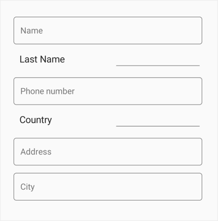

N> TextInputLayout does not support item height customization when using the DataFormItem Height

## Supported editors
Dataform supports the floating label layout for the following editors.
* Text editor
* Password editor
* MaskedEditText editor
* Numeric editor 
* MultilineText editor
* Date editor
* Time editor
* Picker editor
* DropDown editor
* AutoComplete editor.

## Container types
Containers enhance the perspective of dataform editor views and provide some contrast between editor view and assistive labels. Their border and assistive label color will be changed based on the dataform field validation.

By default, the container type is `Outlined`. By using the [ContainerType](https://help.syncfusion.com/cr/xamarin/Syncfusion.XForms.DataForm.SfDataForm.html#Syncfusion_XForms_DataForm_SfDataForm_ContainerType) property in `DataForm` or in `DataFormItem`, you can modify the container type to `Filled` or `None`.

### Filled
The background color of dataform editor view will be filled with container color and it can be enabled by setting the [ContainerType](https://help.syncfusion.com/cr/xamarin/Syncfusion.XForms.DataForm.SfDataForm.html#Syncfusion_XForms_DataForm_SfDataForm_ContainerType)  property to `Filled` in `DataForm` or in `DataFormItem`.


      
<dataForm:SfDataForm x:Name="dataForm" ContainerType="Filled">
</dataForm:SfDataForm>                    


dataForm.LayoutOptions = ContainerType.Filled;



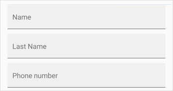

### Outlined
To enable the outlined container type, you can set [ContainerType](https://help.syncfusion.com/cr/xamarin/Syncfusion.XForms.DataForm.SfDataForm.html#Syncfusion_XForms_DataForm_SfDataForm_ContainerType) property to `Outlined` in `DataForm` or in `DataFormItem` which covers the editor view with rounded-corner.


      
<dataForm:SfDataForm x:Name="dataForm" ContainerType="Outlined">
</dataForm:SfDataForm>                    


dataForm.LayoutOptions = ContainerType.Outlined;



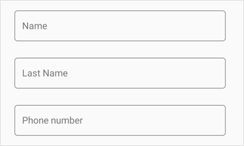

### None
When setting the [ContainerType](https://help.syncfusion.com/cr/xamarin/Syncfusion.XForms.DataForm.SfDataForm.html#Syncfusion_XForms_DataForm_SfDataForm_ContainerType) property to `None` in `DataForm` or in `DataFormItem` container, it will have empty background and enough spacing.


      
<dataForm:SfDataForm x:Name="dataForm" ContainerType="None">
</dataForm:SfDataForm>                    


dataForm.LayoutOptions = ContainerType.None;



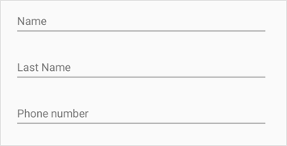

### Changing container type of the DataFormItem

You can change the container type of the [DataFormItem](https://help.syncfusion.com/cr/xamarin/Syncfusion.XForms.DataForm.DataFormItem.html) by using the [ContainerType](https://help.syncfusion.com/cr/xamarin/Syncfusion.XForms.DataForm.TextInputLayoutSettings.html#Syncfusion_XForms_DataForm_TextInputLayoutSettings_ContainerType) property in the [TextInputLayoutSettings](https://help.syncfusion.com/cr/xamarin/Syncfusion.XForms.DataForm.DataFormItem.html#Syncfusion_XForms_DataForm_DataFormItem_TextInputLayoutSettings) of `DataFormItem` and it will be handled by the `AutoGeneratingDataFormItem` event.


  
<dataForm:SfDataForm x:Name="dataForm" DataObject="{Binding ContactsInfo}" AutoGeneratingDataFormItem="DataForm_AutoGeneratingDataFormItem">
</dataForm:SfDataForm>


dataForm.AutoGeneratingDataFormItem += DataForm_AutoGeneratingDataFormItem;

private void DataForm_AutoGeneratingDataFormItem(object sender, AutoGeneratingDataFormItemEventArgs e)
{
    if (e.DataFormItem != null)
    {
        if (e.DataFormItem.Name == "PhoneNumber")
        {
            e.DataFormItem.ContainerType = ContainerType.Filled;
        }
        if (e.DataFormItem.Name == "LastName")
        {
            e.DataFormItem.ContainerType = ContainerType.None;
        }
    }
}




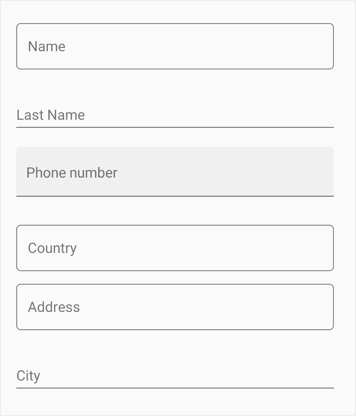

## Leading view
Floating label layout supports leading view, which shows an icon view to the left of editor.

Unicode or font icons for the labels can be displayed as icons. By setting the [LeadingView](https://help.syncfusion.com/cr/xamarin/Syncfusion.XForms.DataForm.TextInputLayoutSettings.html#Syncfusion_XForms_DataForm_TextInputLayoutSettings_LeadingView) property in `TextInputLayoutSettings` of `DataFormItem`, a label can be added as a leading icon for editor view. By setting the [LeadingViewPosition](https://help.syncfusion.com/cr/xamarin/Syncfusion.XForms.DataForm.TextInputLayoutSettings.html#Syncfusion_XForms_DataForm_TextInputLayoutSettings_LeadingViewPosition) property, it can be placed either inside or outside the container. It is positioned outside by default. 

N> Refer to the following links to learn more about font icons:
* [How to create font icons using our metro studio and export as ttf?](https://help.syncfusion.com/metro-studio/export-icon-font)
* [How to set font family for the custom fonts in labels?](https://docs.microsoft.com/en-us/xamarin/xamarin-forms/user-interface/text/fonts#using-a-custom-font)


  
<dataForm:SfDataForm x:Name="dataForm" DataObject="{Binding ContactsInfo}" AutoGeneratingDataFormItem="DataForm_AutoGeneratingDataFormItem">
</dataForm:SfDataForm>


dataForm.AutoGeneratingDataFormItem += DataForm_AutoGeneratingDataFormItem;

private void DataForm_AutoGeneratingDataFormItem1(object sender, AutoGeneratingDataFormItemEventArgs e)
{
    if (e.DataFormItem != null)
    {
        if (e.DataFormItem.Name == "Name")
        {
            e.DataFormItem.TextInputLayoutSettings = new Syncfusion.SfDataForm.XForms.TextInputLayoutSettings()
            {
                LeadingView = new Label()
                {
                    VerticalTextAlignment = Device.RuntimePlatform == Device.iOS ? TextAlignment.Center : TextAlignment.Start,
                    FontSize = Device.RuntimePlatform == Device.iOS ? 18 : 24,
                    Text = "A",
                    FontFamily = Device.RuntimePlatform == Device.iOS ? "ContactsIcons" : Device.RuntimePlatform == Device.Android ? "ContactsIcons.ttf#ContactsIcons" : "Assets/Fonts/ContactsIcons.ttf#ContactsIcons"
                }
            };
        }
    }
}




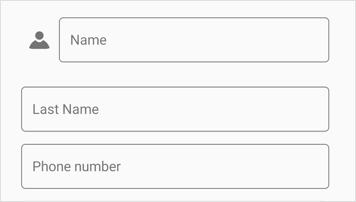

## Trailing view
Floating label layout supports trailing view, which shows an icon view to the right of editor.

Unicode or font icons for the labels can be displayed as icons.By setting the [TrailingView](https://help.syncfusion.com/cr/xamarin/Syncfusion.XForms.DataForm.TextInputLayoutSettings.html#Syncfusion_XForms_DataForm_TextInputLayoutSettings_TrailingView) property in `TextInputLayoutSettings` of `DataFormItem`, a label can be added as a trailing icon for editor view. By setting the [TrailingViewPosition](https://help.syncfusion.com/cr/xamarin/Syncfusion.XForms.DataForm.TextInputLayoutSettings.html#Syncfusion_XForms_DataForm_TextInputLayoutSettings_TrailingViewPosition) property, it can be placed either inside or outside the container. It is positioned outside by default. 

N> Refer to the following links to learn more about font icons:
* [How to create font icons using our metro studio and export as ttf?](https://help.syncfusion.com/metro-studio/export-icon-font)
* [How to set font family for the custom fonts in labels?](https://docs.microsoft.com/en-us/xamarin/xamarin-forms/user-interface/text/fonts#using-a-custom-font)


  
<dataForm:SfDataForm x:Name="dataForm" DataObject="{Binding ContactsInfo}" AutoGeneratingDataFormItem="DataForm_AutoGeneratingDataFormItem">
</dataForm:SfDataForm>


dataForm.AutoGeneratingDataFormItem += DataForm_AutoGeneratingDataFormItem;

private void DataForm_AutoGeneratingDataFormItem1(object sender, AutoGeneratingDataFormItemEventArgs e)
{
    if (e.DataFormItem != null)
    {
        if (e.DataFormItem.Name == "PhoneNumber")
        {
            e.DataFormItem.TextInputLayoutSettings = new Syncfusion.SfDataForm.XForms.TextInputLayoutSettings()
            {
                TrailingView = new Label()
                {
                    VerticalTextAlignment = Device.RuntimePlatform == Device.iOS ? TextAlignment.Center : TextAlignment.Start,
                    FontSize = Device.RuntimePlatform == Device.iOS ? 18 : 24,
                    Text = "I",
                    FontFamily = Device.RuntimePlatform == Device.iOS ? "ContactsIcons" : Device.RuntimePlatform == Device.Android ? "ContactsIcons.ttf#ContactsIcons" : "Assets/Fonts/ContactsIcons.ttf#ContactsIcons"
                }
            };
        }
    }
}



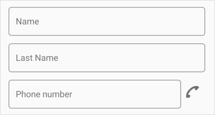

## Enable password visibility toggle for password editor

Password toggle visibility in floating label layout is used to show or hide the visibility of characters in the dataform password editor. You can enable this toggle by setting the [EnablePasswordVisibilityToggle](https://help.syncfusion.com/cr/xamarin/Syncfusion.XForms.DataForm.DataFormTextItem.html) property to true in [DataFormTextItem](https://help.syncfusion.com/cr/xamarin/Syncfusion.XForms.DataForm.DataFormTextItem.html).


      
<dataForm:SfDataForm x:Name="dataForm" DataObject="{Binding ContactsInfo}"/>


dataForm.AutoGeneratingDataFormItem += DataForm_AutoGeneratingDataFormItem;

private void DataForm_AutoGeneratingDataFormItem(object sender, AutoGeneratingDataFormItemEventArgs e)
{
    if (e.DataFormItem != null && e.DataFormItem.Name == "Password")
    {
        (e.DataFormItem as DataFormTextItem).EnablePasswordVisibilityToggle = true;
    }
}



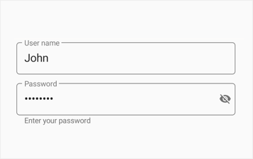

## Assistive label

Assistive labels comprise of floating label or hint label, helper label, counter label and validation label.

### Reserve space for assistive labels

The reserved spaces for assistive labels can be removed by setting the [ReserveSpaceForAssistiveLabels](https://help.syncfusion.com/cr/xamarin/Syncfusion.XForms.DataForm.TextInputLayoutSettings.html#Syncfusion_XForms_DataForm_TextInputLayoutSettings_ReserveSpaceForAssistiveLabels) property to false or it can be set to false automatically if there is no prompt value or water mark provider for `DataformItem` and/or no counter label added.


  
<dataForm:SfDataForm x:Name="dataForm" DataObject="{Binding ContactsInfo}" AutoGeneratingDataFormItem="DataForm_AutoGeneratingDataFormItem">
</dataForm:SfDataForm>


dataForm.AutoGeneratingDataFormItem += DataForm_AutoGeneratingDataFormItem;

private void DataForm_AutoGeneratingDataFormItem1(object sender, AutoGeneratingDataFormItemEventArgs e)
{
    if (e.DataFormItem != null)
    {
        e.DataFormItem.TextInputLayoutSettings = new Syncfusion.SfDataForm.XForms.TextInputLayoutSettings()
        {
            ReserveSpaceForAssistiveLabels= true
        };
    }
}



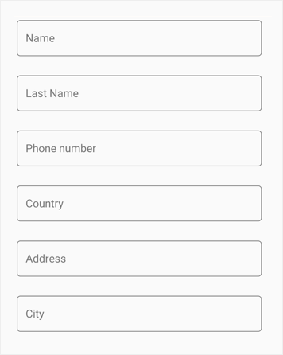

### Hint label

The data field caption will be displayed as floating or hint label for the editor, and it will be enabled by using the `Name` or [LabelText](https://help.syncfusion.com/cr/xamarin/Syncfusion.XForms.DataForm.DataFormItem.html#Syncfusion_XForms_DataForm_DataFormItem_LabelText)  property.

### Helper label

The helper label is used to display the water mark for the editor to provide hint for users and it can be set using [Prompt](https://help.syncfusion.com/xamarin/sfdataform/working-with-dataform#setting-watermark).

The visibility of helper text in DataForm floating label layout can be collapsed by setting [ShowHelperText](https://help.syncfusion.com/cr/xamarin/Syncfusion.XForms.DataForm.SfDataForm.html#Syncfusion_XForms_DataForm_SfDataForm_ShowHelperText) to false in `DataForm` or [TextInputLayoutSettings](https://help.syncfusion.com/cr/xamarin/Syncfusion.XForms.DataForm.TextInputLayoutSettings.html). In this case, DataForm `Prompt` text will be displayed as editor view hint text if the hint label visibility is collapsed using the `ShowLabel` property of [DisplayOption](https://help.syncfusion.com/cr/xamarin/Syncfusion.XForms.DataForm.DisplayOptionsAttribute.html) or `DataFormItem`.


       
  <dataForm:SfDataForm x:Name="dataForm" LayoutOptions="TextInputLayout" ShowHelperText="False">
  <dataForm:SfDataForm/>


dataForm.ShowHelperText = false;



### Changing helper text visibility of DataFormItem
You can remove the helper label of [DataFormItem](https://help.syncfusion.com/cr/xamarin/Syncfusion.XForms.DataForm.DataFormItem.html) by setting the [ShowHelperText](https://help.syncfusion.com/cr/xamarin/Syncfusion.XForms.DataForm.TextInputLayoutSettings.html#Syncfusion_XForms_DataForm_TextInputLayoutSettings_ShowHelperText) property to false in [TextInputLayoutSettings](https://help.syncfusion.com/cr/xamarin/Syncfusion.XForms.DataForm.TextInputLayoutSettings.html), and it will be handled using the `AutoGeneratingDataFormItem` event.


  
<dataForm:SfDataForm x:Name="dataForm" DataObject="{Binding ContactsInfo}" AutoGeneratingDataFormItem="DataForm_AutoGeneratingDataFormItem">
</dataForm:SfDataForm>


dataForm.AutoGeneratingDataFormItem += DataForm_AutoGeneratingDataFormItem;

private void DataForm_AutoGeneratingDataFormItem(object sender, AutoGeneratingDataFormItemEventArgs e)
{
    if (e.DataFormItem != null)
    {
        if (e.DataFormItem.Name == "PhoneNumber")
        {
            e.DataFormItem.TextInputLayoutSettings = new Syncfusion.SfDataForm.XForms.TextInputLayoutSettings()
            {
                ShowHelperText = false
            };
        }
    }
}



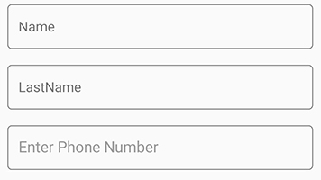

### Validation label

The validation label used to display the dataform validation messages such as valid or invalid data. Refer [validation](https://help.syncfusion.com/xamarin/sfdataform/validation) to learn more about dataform validation.

### Counter label

The counter label is can be used to notify the character count limitation in given validation. It can be enabled by setting the [ShowCharCount](https://help.syncfusion.com/cr/xamarin/Syncfusion.XForms.DataForm.DataFormItem.html#Syncfusion_XForms_DataForm_DataFormItem_ShowCharCount) property to `true`. Character limit can be set using the `StringLength` attribute.



<dataForm:SfDataForm x:Name="dataForm" DataObject="{Binding ContactsInfo}" AutoGeneratingDataFormItem="DataForm_AutoGeneratingDataFormItem">
</dataForm:SfDataForm>


dataForm.AutoGeneratingDataFormItem += DataForm_AutoGeneratingDataFormItem;

private void DataForm_AutoGeneratingDataFormItem(object sender, AutoGeneratingDataFormItemEventArgs e)
{
    if (e.DataFormItem != null && e.DataFormItem.Name == "Password")
    {
        e.DataFormItem.ShowCharCount = true;
    }
}

private string _Password;

[Required(AllowEmptyStrings = false, ErrorMessage = "Password should not be empty")]
[StringLength(10, ErrorMessage = "Password should not exceed 10 characters")]
public string Password
{
    get { return this._Password; }
    set
    {
        this._Password = value;
        this.RaisePropertyChanged("Password");
    }
}



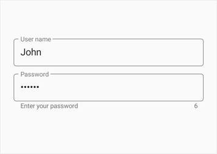

## Appearance customization
The assistive labels and border color can be customized based on the editor view states and data validation.

### Changing outline corner radius
When setting the [OutlineCornerRadius](https://help.syncfusion.com/cr/xamarin/Syncfusion.XForms.DataForm.TextInputLayoutSettings.html#Syncfusion_XForms_DataForm_TextInputLayoutSettings_OutlineCornerRadius) property to double value, the corner radius of the container will be changed.


  
<dataForm:SfDataForm x:Name="dataForm" DataObject="{Binding ContactsInfo}" AutoGeneratingDataFormItem="DataForm_AutoGeneratingDataFormItem">
</dataForm:SfDataForm>


dataForm.AutoGeneratingDataFormItem += DataForm_AutoGeneratingDataFormItem;

private void DataForm_AutoGeneratingDataFormItem1(object sender, AutoGeneratingDataFormItemEventArgs e)
{
    if (e.DataFormItem != null)
    {
        e.DataFormItem.TextInputLayoutSettings = new Syncfusion.SfDataForm.XForms.TextInputLayoutSettings()
        {
            OutlineCornerRadius = 30
        };
    }
}



### Focused color
When the given editor view is focused, the [FocusedColor](https://help.syncfusion.com/cr/xamarin/Syncfusion.XForms.DataForm.DataFormItem.html#Syncfusion_XForms_DataForm_DataFormItem_FocusedColor) property value will be applied to the label text and border.



<dataForm:SfDataForm x:Name="dataForm" DataObject="{Binding ContactsInfo}" AutoGeneratingDataFormItem="DataForm_AutoGeneratingDataFormItem">
</dataForm:SfDataForm>


dataForm.AutoGeneratingDataFormItem += DataForm_AutoGeneratingDataFormItem;

private void DataForm_AutoGeneratingDataFormItem1(object sender, AutoGeneratingDataFormItemEventArgs e)
{
    if (e.DataFormItem != null)
    {
        if (e.DataFormItem.Name == "Name")
        {
            e.DataFormItem.FocusedColor = Color.Violet;
        }
    }
}



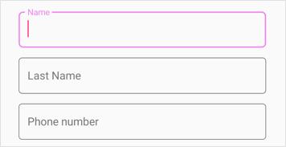

### Unfocused color
When the given editor view is unfocused, the [UnfocusedColor](https://help.syncfusion.com/cr/xamarin/Syncfusion.XForms.DataForm.DataFormItem.html#Syncfusion_XForms_DataForm_DataFormItem_UnfocusedColor) property value will be applied to the label text and border.



<dataForm:SfDataForm x:Name="dataForm" DataObject="{Binding ContactsInfo}" AutoGeneratingDataFormItem="DataForm_AutoGeneratingDataFormItem">
</dataForm:SfDataForm>


dataForm.AutoGeneratingDataFormItem += DataForm_AutoGeneratingDataFormItem;

private void DataForm_AutoGeneratingDataFormItem1(object sender, AutoGeneratingDataFormItemEventArgs e)
{
    if (e.DataFormItem != null)
    {
        if (e.DataFormItem.Name == "Name")
        {
            e.DataFormItem.UnfocusedColor = Color.Silver;
        }
    }
}



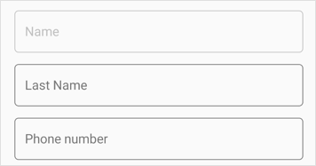

### Error message color
In case of invalid data, the [ErrorMessageColor](https://help.syncfusion.com/cr/xamarin/Syncfusion.XForms.DataForm.DataFormItem.html#Syncfusion_XForms_DataForm_DataFormItem_ErrorMessageColor) will be applied to the error label, hint label and border.



<dataForm:SfDataForm x:Name="dataForm" DataObject="{Binding ContactsInfo}" AutoGeneratingDataFormItem="DataForm_AutoGeneratingDataFormItem">
</dataForm:SfDataForm>


dataForm.AutoGeneratingDataFormItem += DataForm_AutoGeneratingDataFormItem;

private void DataForm_AutoGeneratingDataFormItem1(object sender, AutoGeneratingDataFormItemEventArgs e)
{
    if (e.DataFormItem != null)
    {
        if (e.DataFormItem.Name == "Name")
        {
            e.DataFormItem.ErrorMessageColor = Color.DarkRed;
        }
    }
}



### Valid message color
In case of valid data,the [ValidMessageColor](https://help.syncfusion.com/cr/xamarin/Syncfusion.XForms.DataForm.DataFormItem.html#Syncfusion_XForms_DataForm_DataFormItem_ValidMessageColor)  will be applied to the valid message label , hint label and border.



<dataForm:SfDataForm x:Name="dataForm" DataObject="{Binding ContactsInfo}" AutoGeneratingDataFormItem="DataForm_AutoGeneratingDataFormItem">
</dataForm:SfDataForm>


dataForm.AutoGeneratingDataFormItem += DataForm_AutoGeneratingDataFormItem;

private void DataForm_AutoGeneratingDataFormItem1(object sender, AutoGeneratingDataFormItemEventArgs e)
{
    if (e.DataFormItem != null)
    {
        if (e.DataFormItem.Name == "Name")
        {
            e.DataFormItem.ValidMessageColor = Color.BlueViolet;
        }
    }
}



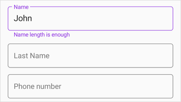

## Customize the background color of editor view
The floating label layout editor view background color can be customized by setting the [ContainerBackgroundColor](https://help.syncfusion.com/cr/xamarin/Syncfusion.XForms.DataForm.SfDataForm.html#Syncfusion_XForms_DataForm_SfDataForm_ContainerBackgroundColor) property of `DataForm` or [TextInputLayoutSettings](https://help.syncfusion.com/cr/xamarin/Syncfusion.XForms.DataForm.TextInputLayoutSettings.html). It is applicable when the [ContainerType](https://help.syncfusion.com/cr/xamarin/Syncfusion.XForms.DataForm.SfDataForm.html#Syncfusion_XForms_DataForm_SfDataForm_ContainerType) is set to `Filled` or `Outlined`.


       
  <dataForm:SfDataForm x:Name="dataForm" LayoutOptions="TextInputLayout" ContainerBackgroundColor="Silver">
 <dataForm:SfDataForm/>


dataForm.ContainerBackgroundColor = Color.Silver;



### Customize the editor view background color of DataFormItem
You can change the editor view background color of [DataFormItem](https://help.syncfusion.com/cr/xamarin/Syncfusion.XForms.DataForm.DataFormItem.html) using the [ContainerBackgroundColor](https://help.syncfusion.com/cr/xamarin/Syncfusion.XForms.DataForm.TextInputLayoutSettings.html#Syncfusion_XForms_DataForm_TextInputLayoutSettings_ContainerBackgroundColor) property in [TextInputLayoutSettings](https://help.syncfusion.com/cr/xamarin/Syncfusion.XForms.DataForm.TextInputLayoutSettings.html), and it will be handled using the `AutoGeneratingDataFormItem` event.


  
<dataForm:SfDataForm x:Name="dataForm" DataObject="{Binding ContactsInfo}" AutoGeneratingDataFormItem="DataForm_AutoGeneratingDataFormItem">
</dataForm:SfDataForm>


dataForm.AutoGeneratingDataFormItem += DataForm_AutoGeneratingDataFormItem;

private void DataForm_AutoGeneratingDataFormItem(object sender, AutoGeneratingDataFormItemEventArgs e)
{
    if (e.DataFormItem != null)
    {
        if (e.DataFormItem.Name == "PhoneNumber")
        {
            e.DataFormItem.TextInputLayoutSettings = new Syncfusion.SfDataForm.XForms.TextInputLayoutSettings()
            {
                ContainerBackgroundColor = Color.FromHex("#E6EEF9")
            };
        }
    }
}



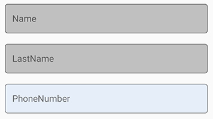

## Font customization
You can customize the font of assistive labels by setting the FontFamily, FontSize, and FontAttributes properties of the LabelStyle  property.

### Hint label style
You can customize the text of hint label by setting the FontFamily, FontSize, and FontAttributes properties of [HintLabelStyle](https://help.syncfusion.com/cr/xamarin/Syncfusion.XForms.DataForm.DataFormItem.html#Syncfusion_XForms_DataForm_DataFormItem_HintLabelStyle) in DataFormItem.

### Helper label style
You can customize the text of helper label by setting the FontFamily, FontSize, and FontAttributes properties of [HelperLabelStyle](https://help.syncfusion.com/cr/xamarin/Syncfusion.XForms.DataForm.DataFormItem.html#Syncfusion_XForms_DataForm_DataFormItem_HelperLabelStyle) in DataFormItem.

### Validation label style
You can customize the text of validation label by setting the FontFamily, FontSize, and FontAttributes properties of [ValidationLabelStyle](https://help.syncfusion.com/cr/xamarin/Syncfusion.XForms.DataForm.DataFormItem.html#Syncfusion_XForms_DataForm_DataFormItem_ValidationLabelStyle) in DataFormItem.


      
<dataForm:SfDataForm x:Name="dataForm" DataObject="{Binding ContactsInfo}"/>


dataForm.AutoGeneratingDataFormItem += DataForm_AutoGeneratingDataFormItem;

private void DataForm_AutoGeneratingDataFormItem(object sender, AutoGeneratingDataFormItemEventArgs e)
{
    if (e.DataFormItem != null && e.DataFormItem.Name == "Name")
    {
        e.DataFormItem.HintLabelStyle  = new LabelStyle() { FontFamily = Device.OnPlatform("Lobster-Regular", "Lobster-Regular.ttf#Lobster-Regular", "Assets/Fonts/Lobster-Regular.ttf#Lobster"), FontSize = 16};
    }
}



## Limitations

* It is recommended not to provide background color for editor view while customizing existing editor inside floating label layout.
* It is recommended not to use non-editable custom editor views inside floating label layout such as range slider,etc.
* It is recommended not to use the [LayoutOptions](https://help.syncfusion.com/cr/xamarin/Syncfusion.XForms.DataForm.DisplayOptionsAttribute.html#Syncfusion_XForms_DataForm_DisplayOptionsAttribute_LayoutOptions) attribute for setting default layout for data fields.
* It is recommended not to use null values in [Date Editor](https://help.syncfusion.com/xamarin/sfdataform/editors#date-editor) and [Time Editor](https://help.syncfusion.com/xamarin/sfdataform/editors#time-editor)  with text input layout in initial loading time and runtime in iOS platform.

## Unsupported editors
Floating label layout do not support for the following non-editable editors.

* RadioGroup editor
* Segment editor
* CheckBox editor
* Switch editor

N> While using unsupported editors with `DataForm` layout option as `TextInputLayout` we can set layout options for unsupported editors' data fields using this [link](https://help.syncfusion.com/xamarin/sfdataform/floating-label-layout#changing-layout-options-of-the-dataformitem)

You can download the [DataForm with floating labels](https://github.com/SyncfusionExamples/Floating-label-editors-in-xamarin.forms-dataform) sample in GitHub.