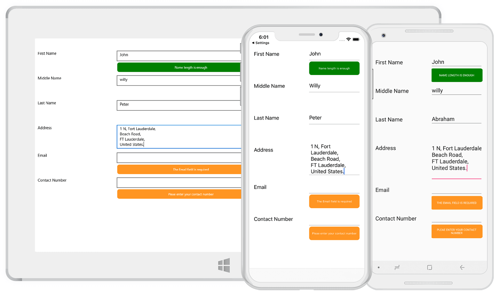

# Validation in Xamarin DataForm (SfDataForm)

The data form validates the data and displays hints in the case of validation is not passed. In case of invalid data, the error message is shown at the bottom of the editor.

## Built in validations

The supported built in validations are as follows:

* INotifyDataErrorInfo
* Data annotation

### Using INotifyDataErrorInfo

You can validate the data by implementing the [INotifyDataErrorInfo](https://msdn.microsoft.com/en-us/library/system.componentmodel.inotifydataerrorinfo.aspx) interface in the data object class.



public class EmployeeInfo : INotifyDataErrorInfo, INotifyPropertyChanged
{
    private int _EmployeeID;
    private string _Name;
    private string _Title;

    public event PropertyChangedEventHandler PropertyChanged;
    public event EventHandler<DataErrorsChangedEventArgs> ErrorsChanged;

    public EmployeeInfo()
    {

    }

    public int EmployeeID
    {
        get { return this._EmployeeID; }
        set
        {
            this._EmployeeID = value;
            this.RaisePropertyChanged("EmployeeID");
        }
    }

    public string Name
    {
        get { return this._Name; }
        set
        {
            this._Name = value;
            this.RaisePropertyChanged("Name");
        }
    }

    public string Title
    {
        get { return this._Title; }
        set
        {
            this._Title = value;
            this.RaisePropertyChanged("Title");
        }
    }

    [Display(AutoGenerateField = false)]
    public bool HasErrors
    {
        get
        {
            return false;
        }
    }

    private void RaisePropertyChanged(string propertyName)
    {
        if (PropertyChanged != null)
            PropertyChanged(this, new PropertyChangedEventArgs(propertyName));
    }

    public IEnumerable GetErrors(string propertyName)
    {
        var list = new List<string>();
        if (!propertyName.Equals("Title"))
            return list;

        if (this.Title.Contains("Marketing"))
            list.Add("Marketing is not allowed");
        return list;
    }
}




### Data annotations

You can validate the data using data annotation attributes.

The numeric type like Int, Double, Decimal properties can be validated using the [Range](https://docs.microsoft.com/en-us/dotnet/api/system.componentmodel.dataannotations.rangeattribute?view=netframework-4.8) attribute.



private int _EmployeeID;
[Range(1000, 1500, ErrorMessage = "EmployeeID should be between 1000 and 1500")]
public int EmployeeID
{
    get { return this._EmployeeID; }
    set
    {
        this._EmployeeID = value;
        this.RaisePropertyChanged("EmployeeID");
    }
}



The String type property can be validated using [Required](https://docs.microsoft.com/en-us/dotnet/api/system.componentmodel.dataannotations.requiredattribute?view=netframework-4.8) and [StringLength](https://docs.microsoft.com/en-us/dotnet/api/system.componentmodel.dataannotations.stringlengthattribute?view=netframework-4.8) attributes.



private string _Name;

[Required(AllowEmptyStrings = false, ErrorMessage = "Name should not be empty")]
[StringLength(10, ErrorMessage = "Name should not exceed 10 characters")]
public string Name
{
    get { return this._Name; }
    set
    {
        this._Name = value;
        this.RaisePropertyChanged("Name");
    }
}




#### Date range attribute

You can validate the date time value using date range attribute.



private DateTime joinDate;
[DateRange(MinYear = 2010, MaxYear = 2017, ErrorMessage = "Join date is invalid")]
public DateTime JoinDate
{
    get
    {
        return joinDate;
    }
    set
    {
        joinDate = value;
    }
}



## Validation mode

The [ValidationMode](https://help.syncfusion.com/cr/xamarin/Syncfusion.XForms.DataForm.SfDataForm.html#Syncfusion_XForms_DataForm_SfDataForm_ValidationMode) determines when the value should be validated.

The supported validation modes are as follows:

* LostFocus
* PropertyChanged
* Explicit



<?xml version="1.0" encoding="utf-8" ?>
<ContentPage xmlns="http://xamarin.com/schemas/2014/forms"
             xmlns:x="http://schemas.microsoft.com/winfx/2009/xaml"
             xmlns:local="clr-namespace:GettingStarted"
             xmlns:dataForm ="clr-namespace:Syncfusion.XForms.DataForm;assembly=Syncfusion.SfDataForm.XForms"
             x:Class="GettingStarted.MainPage">
    <ContentPage.Content>     
            <dataForm:SfDataForm x:Name="dataForm" ValidationMode="LostFocus"/>            
        </Grid>
    </ContentPage.Content>
</ContentPage>


dataForm.ValidationMode = ValidationMode.LostFocus;



### LostFocus

If the commit mode is LostFocus, the value will be validated when the editor lost its focus.

### PropertyChanged

The value will be validated immediately when it is changed.

### Explicit

The value should be validated manually by calling the [SfDataForm.Validate](https://help.syncfusion.com/cr/xamarin/Syncfusion.XForms.DataForm.SfDataForm.html#Syncfusion_XForms_DataForm_SfDataForm_Validate().html) or [SfDataForm.Validate (propertyName)](https://help.syncfusion.com/cr/xamarin/Syncfusion.XForms.DataForm.SfDataForm.html#Syncfusion_XForms_DataForm_SfDataForm_Validate(String).html) method.

The following code validates the value of all the properties in the data object:



dataForm.Validate();



To validate the specific property value, pass the property name as argument.



dataForm.Validate("Name");



You can determine whether the data form or property is valid or not by using the `Validate` method.



bool isValid = dataForm.Validate();
bool isPropertyValid = dataForm.Validate("Property");



If the data form or property is valid, `true` will be returned. Or else `false` will be returned.

N> For validating value, the new value should be committed in data object. So, `ValidationMode` takes higher priority than `CommitMode`.

#### Custom validation through events

You can validate the data using the [Validating](https://help.syncfusion.com/cr/xamarin/Syncfusion.XForms.DataForm.SfDataForm.html#Syncfusion_XForms_DataForm_SfDataForm_Validating) event of the data form.



<?xml version="1.0" encoding="utf-8" ?>
<ContentPage xmlns="http://xamarin.com/schemas/2014/forms"
             xmlns:x="http://schemas.microsoft.com/winfx/2009/xaml"
             xmlns:local="clr-namespace:GettingStarted"
             xmlns:dataForm ="clr-namespace:Syncfusion.XForms.DataForm;assembly=Syncfusion.SfDataForm.XForms"
             x:Class="GettingStarted.MainPage">
    <ContentPage.Content>     
            <dataForm:SfDataForm x:Name="dataForm" Validating="DataForm_Validating" />            
        </Grid>
    </ContentPage.Content>
</ContentPage>


dataForm.Validating += DataForm_Validating;
private void DataForm_Validating(object sender, ValidatingEventArgs e)
{
    if (e.PropertyName == "Name")
    {
        if (e.Value != null && e.Value.ToString().Length > 8)
        {
            e.IsValid = false;
            e.ErrorMessage = "Name should not exceed 8 characters";
        }
    }            
}



You can get the notification after completing validation using the [Validated](https://help.syncfusion.com/cr/xamarin/Syncfusion.XForms.DataForm.SfDataForm.html#Syncfusion_XForms_DataForm_SfDataForm_Validated) event of the data form.



<?xml version="1.0" encoding="utf-8" ?>
<ContentPage xmlns="http://xamarin.com/schemas/2014/forms"
             xmlns:x="http://schemas.microsoft.com/winfx/2009/xaml"
             xmlns:local="clr-namespace:GettingStarted"
             xmlns:dataForm ="clr-namespace:Syncfusion.XForms.DataForm;assembly=Syncfusion.SfDataForm.XForms"
             x:Class="GettingStarted.MainPage">
    <ContentPage.Content>     
            <dataForm:SfDataForm x:Name="dataForm" Validated="DataForm_Validated" />            
        </Grid>
    </ContentPage.Content>
</ContentPage>


dataForm.Validated += DataForm_Validated;
private void DataForm_Validated(object sender, ValidatedEventArgs e)
{
    var isValid = e.IsValid;
    var propertyName = e.PropertyName;
}



You can get the details of invalid DataFormItems when validating the data form as `Explicit` validation mode using [ValidationCompleted](https://help.syncfusion.com/cr/xamarin/Syncfusion.XForms.DataForm.SfDataForm.html#Syncfusion_XForms_DataForm_SfDataForm_ValidationCompleted) event. This event contains [ValidationCompletedEventArgs](https://help.syncfusion.com/cr/xamarin/Syncfusion.XForms.DataForm.ValidationCompletedEventArgs.html) argument, which holds a list of DataFormItem as errors. 



<?xml version="1.0" encoding="utf-8" ?>
<ContentPage xmlns="http://xamarin.com/schemas/2014/forms"
                xmlns:x="http://schemas.microsoft.com/winfx/2009/xaml"
                xmlns:local="clr-namespace:GettingStarted"
                xmlns:dataForm ="clr-namespace:Syncfusion.XForms.DataForm;assembly=Syncfusion.SfDataForm.XForms"
                x:Class="GettingStarted.MainPage">
    <ContentPage.Content>     
        <dataForm:SfDataForm x:Name="dataForm" ValidationCompleted="DataForm_ValidationCompleted" />            
    </ContentPage.Content>
</ContentPage>


dataForm.ValidationCompleted += DataForm_ValidationCompleted; 
… 

private void DataForm_ValidationCompleted(object sender, ValidationCompletedEventArgs e) 
{ 
    var invalidItems = e.Errors; 
} 



## Valid or positive message

If the value meets the desired criteria, you can show the [valid or positive message](https://help.syncfusion.com/cr/xamarin/Syncfusion.XForms.DataForm.DisplayOptionsAttribute.html#Syncfusion_XForms_DataForm_DisplayOptionsAttribute_ValidMessage). As error message, the valid message will also be displayed at the bottom of the editor.



private string _Name;
[DisplayOptions(ValidMessage = "Name length is enough")]
[StringLength(10, ErrorMessage = "Name should not exceed 10 characters")]
public string Name
{
    get { return this._Name; }
    set
    {
        this._Name = value;
        this.RaisePropertyChanged("Name");
    }
}



## How to validate the property value based on another value

To validate one property value based on another property value, use the [property changed event](https://msdn.microsoft.com/en-us/library/system.componentmodel.inotifypropertychanged.propertychanged.aspx) and [Validate](https://help.syncfusion.com/cr/xamarin/Syncfusion.XForms.DataForm.SfDataForm.html#Syncfusion_XForms_DataForm_SfDataForm_Validate(String).html) methods.

Here, AccountNumber and AccountNumber1 fields are validated.



dataForm.DataObject = new RecipientInfo();
(dataForm.DataObject as INotifyPropertyChanged).PropertyChanged += DataFormGettingStarted_PropertyChanged;

private void DataFormGettingStarted_PropertyChanged(object sender, PropertyChangedEventArgs e)
{
    if (e.PropertyName.Equals("AccountNumber"))
    {
        var value = (string)sender.GetType().GetProperty("AccountNumber1").GetValue(sender);
        if (!string.IsNullOrEmpty(value))
            dataForm.Validate("AccountNumber1");
    }
    else if (e.PropertyName.Equals("AccountNumber1"))
    {
        var value = (string)sender.GetType().GetProperty("AccountNumber").GetValue(sender);
        if (!string.IsNullOrEmpty(value))
            dataForm.Validate("AccountNumber");
    }
}



## Customize validation message using DataTemplate

The default appearance of the validation message can be customized by using the [ValidationTemplate](https://help.syncfusion.com/cr/xamarin/Syncfusion.XForms.DataForm.SfDataForm.html#Syncfusion_XForms_DataForm_SfDataForm_ValidationTemplate) property of the `DataForm`.




<dataForm:SfDataForm 
            x:Name="dataForm"  
            ValidationTemplate="{Binding ValidationTemplate}">
            <dataForm:SfDataForm.BindingContext>
                <local:ValidationDataTemplate/>
            </dataForm:SfDataForm.BindingContext>
</dataForm:SfDataForm>




### Creating a DataTemplate




public class ValidationDataTemplate :DataTemplate
{
    public DataTemplate ValidationTemplate { get; set; }

    public ValidationDataTemplate()
    {
        ValidationTemplate = new DataTemplate(() =>
        {
            return new Button
            {
                Text = "Field should not be empty",
                TextColor = Color.White,
                BackgroundColor = Color.LightGreen
            };
        });
    }
}




## Customize validation message using DataTemplateSelector

You can use `DataTemplateSelector` to choose a `DataTemplate` at runtime based on the value of a data-bound to [ValidationTemplate](https://help.syncfusion.com/cr/xamarin/Syncfusion.XForms.DataForm.SfDataForm.html#Syncfusion_XForms_DataForm_SfDataForm_ValidationTemplate) property of DataForm. It lets you choose a different data template for each validation message, customizing the appearance of a particular validation message based on certain conditions.




<ContentPage.Resources>
    <ResourceDictionary>
        <local:TemplateSelector x:Key="validationDataTemplateSelector" />
    </ResourceDictionary>
</ContentPage.Resources>

<dataForm:SfDataForm Grid.Row="1" x:Name="dataForm" ValidationTemplate="{StaticResource validationDataTemplateSelector}" />




### Creating a DataTemplateSelector




public class TemplateSelector : DataTemplateSelector
{
    public DataTemplate ValidMessageTemplate { get; set; }
    public DataTemplate InvalidMessageTemplate { get; set; }     
    public DataTemplate LastNameTemplate { get; set; }
    public DataTemplate EmailTemplate { get; set; }
    public DataTemplate ContactNumberTemplate { get; set; }

    public TemplateSelector()
    {
        ValidMessageTemplate = new DataTemplate(typeof(ValidMessageTemplate));
        InvalidMessageTemplate = new DataTemplate(typeof(InValidMessageTemplate));
        LastNameTemplate = new DataTemplate(typeof(LastNameTemplate));
        EmailTemplate = new DataTemplate(typeof(EmailTemplate));
        ContactNumberTemplate = new DataTemplate(typeof(ContactNumberTemplate));
    }

    protected override DataTemplate OnSelectTemplate(object item, BindableObject container)
    {
        var dataform = (container as SfDataForm);
        if (dataform == null) return null;
        if (dataform != null)
        {
            if ((item as DataFormItem).LabelText == "First Name")
            {
                if (!(item as DataFormItem).IsValid)
                {
                    return InvalidMessageTemplate;
                }
                else
                {
                    return ValidMessageTemplate;
                }
            }
            else if ((item as DataFormItem).LabelText == "Last Name")
            {
                if (!(item as DataFormItem).IsValid)
                {
                    return LastNameTemplate;
                }
            }
            else if ((item as DataFormItem).LabelText == "Email")
            {
                if (!(item as DataFormItem).IsValid)
                {
                    return EmailTemplate;
                }
            }
            else if ((item as DataFormItem).LabelText == "Contact Number")
            {
                if (!(item as DataFormItem).IsValid)
                {
                    return ContactNumberTemplate;
                }
            }
            return null;
        }
        else
            return null;   
    }   
}




Used **Button** inside a **Grid** to display the valid and invalid message in the view.




<Grid xmlns="http://xamarin.com/schemas/2014/forms"
             xmlns:x="http://schemas.microsoft.com/winfx/2009/xaml"
             x:Class="DataForm_Validation.ValidMessageTemplate"  
    VerticalOptions="FillAndExpand" HorizontalOptions="FillAndExpand">
    <Grid BackgroundColor="Transparent">
        <Button x:Name="maingrid"  CornerRadius="8"  Text="Name length is enough" FontSize="9" TextColor="Green" VerticalOptions="FillAndExpand" HorizontalOptions="FillAndExpand"/>
   </Grid>
</Grid>

…..

<Grid xmlns="http://xamarin.com/schemas/2014/forms"
             xmlns:x="http://schemas.microsoft.com/winfx/2009/xaml"
             x:Class="DataForm_Validation.InValidMessageTemplate"
    VerticalOptions="FillAndExpand" HorizontalOptions="FillAndExpand">
    <Grid BackgroundColor="Transparent">
        <Button x:Name="maingrid"  CornerRadius="8" Text="Pleae enter your first name" FontSize="9" TextColor="White" VerticalOptions="FillAndExpand" HorizontalOptions="FillAndExpand"/>
  </Grid>
</Grid>




## See also

[How to validate SfDataForm on page loading](https://www.syncfusion.com/kb/9058/)                                                                                                                                                                                                                       
[How to commit and validate the custom editor value to corresponding DataObject property in Xamarin.Forms SfDataForm](https://www.syncfusion.com/kb/10224/)
