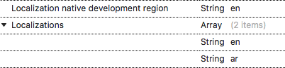
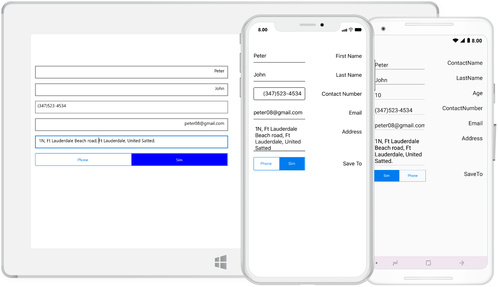

# Right to left (RTL) in Xamarin DataForm (SfDataForm)

SfDataForm supports to change the layout direction of the control in the right-to-left direction by setting the [FlowDirection](https://docs.microsoft.com/en-us/dotnet/api/xamarin.forms.visualelement.flowdirection?view=xamarin-forms#Xamarin_Forms_VisualElement_FlowDirection) to `RightToLeft` or by changing the device language.



<dataForm:SfDataForm FlowDirection="RightToLeft">
</dataForm:SfDataForm>


dataForm.FlowDirection = FlowDirection.RightToLeft;



>**Note**
For implementing the `FlowDirection` in the control, Xamarin.Forms package version must be 3.0 and above. Please refer [RightToLeft](https://blog.xamarin.com/right-to-left-localization-xamarin-forms) to get more details about `RightToLeft` flow direction in Xamarin.Forms.

### Android
For Android, add `android:supportsRtl="true"` in your application tag of `AndroidManifest.xml` file, and make sure your `MinSDKVersion` is 17+. By changing the device language / enabling the device's `Force RTL layout` can achieve the `RightToLeft` layout direction in DataForm.



<manifest ... >
<uses-sdk android:minSdkVersion="17" ... />
<application ... android:supportsRtl="true">
</application>
</manifest>



### iOS
For iOS, add the `RightToLeft` language in the `CFBundleLocalizations` section of your `Info.plist` file, and make sure you’re targeting iOS 9+.



<resources>
<key>CFBundleDevelopmentRegion</key>
<string>en</string>
<key>CFBundleLocalizations</key>
<array>
<string>en</string>
<string>ar</string>
</array>
</resources>



### UWP
For UWP, you need to set `FlowDirection` to `RightToLeft` in the `MainPage.cs` file of the `UWP` project.



public MainPage()
{
…
this.FlowDirection = FlowDirection.RightToLeft;
LoadApplication (new App ());
…
}



## See also

[How to customize the input direction of custom text editor in platform renderer](https://www.syncfusion.com/kb/9043/)                                                                                                                                                                                                                                                                                                                                                                                                                                                                                                                                                  
