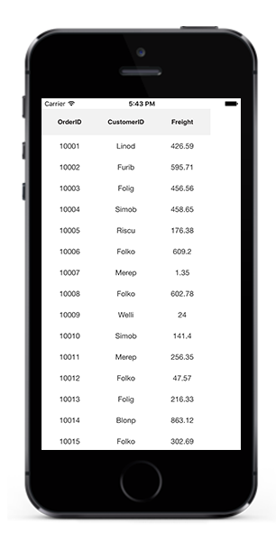
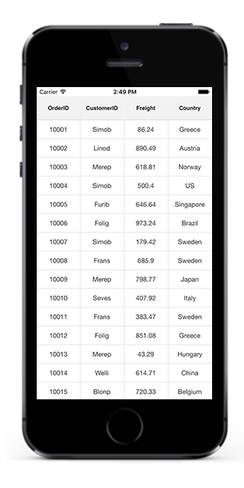
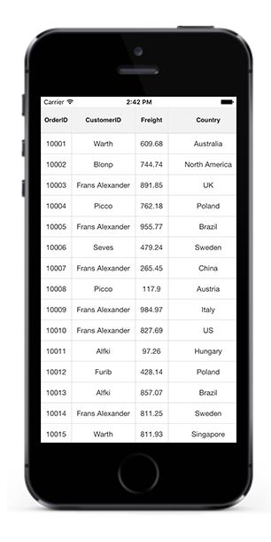
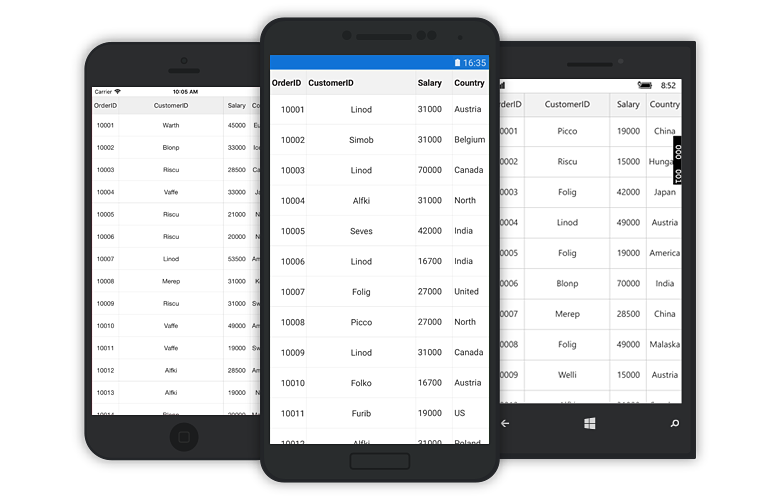
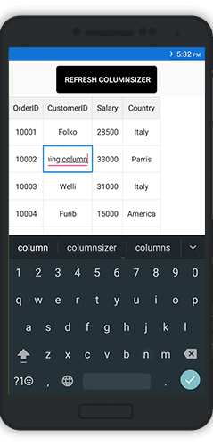

# ColumnSizer

The SfDataGrid allows to apply `ColumnSizer` for the [GridColumn](http://help.syncfusion.com/cr/xamarin/Syncfusion.SfDataGrid.XForms.GridColumn.html) by setting the [SfDataGrid.ColumnSizer](https://help.syncfusion.com/cr/xamarin/Syncfusion.SfDataGrid.XForms.SfDataGrid.html#Syncfusion_SfDataGrid_XForms_SfDataGrid_ColumnSizer) property. 

To apply `ColumnSizer` in the SfDataGrid, follow the code example:



<sfgrid:SfDataGrid x:Name="dataGrid"
                   AutoGenerateColumns="True"
                   ColumnSizer="None">


dataGrid.ColumnSizer = ColumnSizer.None;



The SfDataGrid applies width for all the `GridColumns` in the [SfDataGrid.Columns](https://help.syncfusion.com/cr/xamarin/Syncfusion.SfDataGrid.XForms.SfDataGrid.html#Syncfusion_SfDataGrid_XForms_SfDataGrid_Columns) collection based on the `SfDataGrid.ColumnSizer` property. Following lists of options are available to set width of the column:

 * None
 * LastColumnFill
 * Star
 * Auto

## ColumnSizer.None

No column sizing is applied when the [SfDataGrid.ColumnSizer](https://help.syncfusion.com/cr/xamarin/Syncfusion.SfDataGrid.XForms.SfDataGrid.html#Syncfusion_SfDataGrid_XForms_SfDataGrid_ColumnSizer) set to [None](http://help.syncfusion.com/cr/xamarin/Syncfusion.SfDataGrid.XForms.ColumnSizer.html). Columns are arranged in view based on the [SfDataGrid.DefaultColumnWidth](https://help.syncfusion.com/cr/xamarin/Syncfusion.SfDataGrid.XForms.SfDataGrid.html#Syncfusion_SfDataGrid_XForms_SfDataGrid_DefaultColumnWidth) property. This is the default value of the `SfDataGrid.ColumnSizer` property.

## ColumnSizer.LastColumnFill

When the [SfDataGrid.ColumnSizer](https://help.syncfusion.com/cr/xamarin/Syncfusion.SfDataGrid.XForms.SfDataGrid.html#Syncfusion_SfDataGrid_XForms_SfDataGrid_ColumnSizer) is [LastColumnFill](http://help.syncfusion.com/cr/xamarin/Syncfusion.SfDataGrid.XForms.ColumnSizer.html), the column width of the `GridColumns` are adjusted with respect to `SfDataGrid.DefaultColumnWidth` property. In case the columns does not fill the entire view space, width of the last column fills the unoccupied space in the view.



<sfgrid:SfDataGrid x:Name="dataGrid"
                   AutoGenerateColumns="True"
                   ColumnSizer="LastColumnFill">


dataGrid.ColumnSizer = ColumnSizer.LastColumnFill;



## ColumnSizer.Star

When the [SfDataGrid.ColumnSizer](https://help.syncfusion.com/cr/xamarin/Syncfusion.SfDataGrid.XForms.SfDataGrid.html#Syncfusion_SfDataGrid_XForms_SfDataGrid_ColumnSizer) is [Star](http://help.syncfusion.com/cr/xamarin/Syncfusion.SfDataGrid.XForms.ColumnSizer.html), all the `GridColumns` are adjusted to an equal column width to fit within the view. Setting `ColumnSizer` to `Star` will disable the `HorizontalScrolling` in the SfDataGrid.



<sfgrid:SfDataGrid x:Name="dataGrid"
                   AutoGenerateColumns="True"
                   ColumnSizer="Star">


dataGrid.ColumnSizer = ColumnSizer.Star;



## ColumnSizer.Auto

When the [SfDataGrid.ColumnSizer](https://help.syncfusion.com/cr/xamarin/Syncfusion.SfDataGrid.XForms.SfDataGrid.html#Syncfusion_SfDataGrid_XForms_SfDataGrid_ColumnSizer) is [Auto](http://help.syncfusion.com/cr/xamarin/Syncfusion.SfDataGrid.XForms.ColumnSizer.html), the width of the `GridColumns` are adjusted based on the header text or cell contents.



<sfgrid:SfDataGrid x:Name="dataGrid"
                   AutoGenerateColumns="True"
                   ColumnSizer="Auto">


dataGrid.ColumnSizer = ColumnSizer.Auto;



N> If any column explicitly specified a width using the [GridColumn.Width](https://help.syncfusion.com/cr/xamarin/Syncfusion.SfDataGrid.XForms.GridColumn.html#Syncfusion_SfDataGrid_XForms_GridColumn_Width) property, that column is not considered ColumnSizing width and skipped while applying the ColumnSizer for the grid columns.

## How to 

### Apply ColumnSizer for a particular column

To apply column sizing to individual column, use the [GridColumn.ColumnSizer](https://help.syncfusion.com/cr/xamarin/Syncfusion.SfDataGrid.XForms.GridColumn.html#Syncfusion_SfDataGrid_XForms_GridColumn_ColumnSizer) property. The `GridColumn.ColumnSizer` property is also a type of the [ColumnSizer](http://help.syncfusion.com/cr/xamarin/Syncfusion.SfDataGrid.XForms.ColumnSizer.html). If the `GridColumn.ColumnSizer` is not explicitly set to a value, then it takes the value of the [SfDataGrid.ColumnSizer](https://help.syncfusion.com/cr/xamarin/Syncfusion.SfDataGrid.XForms.SfDataGrid.html#Syncfusion_SfDataGrid_XForms_SfDataGrid_ColumnSizer) and applies width to the columns accordingly.

To apply `ColumnSizer` for a particular column, follow the code example:



<sfgrid:SfDataGrid x:Name="dataGrid"
                   AutoGenerateColumns="True"
                   ColumnSizer="None">

<syncfusion:GridTextColumn MappingName="OrderID"
                           ColumnSizer = "Auto" />


GridTextColumn textColumn = new GridTextColumn();
textColumn.MappingName = "CustomerID";
textColumn.HeaderText = "Full Name";
textColumn.ColumnSizer = ColumnSizer.Auto;  



### Fill remaining width for any column

The `SfDataGrid` allows to fill the remaining width in view for any column using [GridColumn.ColumnSizer](https://help.syncfusion.com/cr/xamarin/Syncfusion.SfDataGrid.XForms.GridColumn.html#Syncfusion_SfDataGrid_XForms_GridColumn_ColumnSizer) property.

The `GridColumn.ColumnSizer` has higher priority than the [SfDataGrid.ColumnSizer](http://help.syncfusion.com/cr/xamarin/Syncfusion.SfDataGrid.XForms.ColumnSizer.html) property. Hence, individual columns having the `GridColumn.ColumnSizer` property set will not be included in the column sizer calculations of the `SfDataGrid`. To fill the column with remaining width in view, set the `GridColumn.ColumnSizer` property as [ColumnSizer.LastColumnFill](http://help.syncfusion.com/cr/xamarin/Syncfusion.SfDataGrid.XForms.ColumnSizer.html#). Refer to the following code example to achieve the same:

In the below code snippet, the SfDataGrid is applied with `ColumnSizer.Star` and the second column is applied with `ColumnSizer.LastColumnFill`. Hence the second column will take up the remaining space after other columns are rendered with star size.



<sfgrid:SfDataGrid x:Name="dataGrid"
                   AutoGenerateColumns="False"
                   ItemsSource="{Binding OrdersInfo}">

<sfgrid:SfDataGrid.Columns>
    <sfgrid:GridTextColumn MappingName="OrderID"/>
    <sfgrid:GridTextColumn MappingName="CustomerID" ColumnSizer="LastColumnFill"/>
    <sfgrid:GridTextColumn MappingName="Salary"/>
    <sfgrid:GridTextColumn MappingName="Country"/>
</sfgrid:SfDataGrid.Columns>
</sfgrid:SfDataGrid>

 
SfDataGrid dataGrid;
ViewModel viewModel;
public MainPage()
{
    InitializeComponent();
    dataGrid = new SfDataGrid();
    viewModel = new ViewModel();
    dataGrid.AutoGenerateColumns = false;
    dataGrid.ItemsSource = viewModel.OrdersInfo;

    GridTextColumn orderIDColumn = new GridTextColumn();
    orderIDColumn.MappingName = "OrderID";

    GridTextColumn customerIDColumn = new GridTextColumn();
    customerIDColumn.MappingName = "CustomerID";
    customerIDColumn.ColumnSizer = ColumnSizer.LastColumnFill;

    GridTextColumn salaryColumn = new GridTextColumn();
    salaryColumn.MappingName = "Salary";

    GridTextColumn countryColumn = new GridTextColumn();
    countryColumn.MappingName = "Country";

    dataGrid.Columns.Add(orderIDColumn);
    dataGrid.Columns.Add(customerIDColumn);
    dataGrid.Columns.Add(salaryColumn);
    dataGrid.Columns.Add(countryColumn);
}

   

### Refreshing ColumnSizer at runtime

To refresh the column sizing for `SfDataGrid.Columns` at runtime, use the [SfDataGrid.GridColumnSizer.Refresh](https://help.syncfusion.com/cr/xamarin/Syncfusion.SfDataGrid.XForms.GridColumnSizer.html#Syncfusion_SfDataGrid_XForms_GridColumnSizer_Refresh_System_Boolean_)() method.

Consider that `ColumnSizer.Auto` is applied to the SfDataGrid. If the underlying values are changed at run time, refresh the column sizer as follows:


    
<StackLayout HorizontalOptions="Center" 
             Orientation="Vertical">
    <Button x:Name="button"
            Text="Refresh ColumnSizer"
            HeightRequest="100"
            HorizontalOptions="Center"
            Clicked="ColumnSizerChanged"/>
<sfgrid:SfDataGrid x:Name="dataGrid"
                   AutoGenerateColumns="True"
                   AllowEditing="True"
                   ColumnSizer="Auto"
                   ItemsSource="{Binding OrdersInfo}">
</sfgrid:SfDataGrid>
</StackLayout>

  
private void ColumnSizerChanged(object sender, EventArgs e)
{
    //Refreshes the column sizer of the SfDataGrid
    dataGrid.GridColumnSizer.Refresh(true);
}    

 

 

### Resetting column width to apply ColumnSizer   

By default, columns having the [GridColumn.Width](https://help.syncfusion.com/cr/xamarin/Syncfusion.SfDataGrid.XForms.GridColumn.html#Syncfusion_SfDataGrid_XForms_GridColumn_Width) property set will not be included for column sizer calculations of the SfDataGrid. To include the width columns and reset the column sizer at runtime, set the `GridColumn.Width` property to double.NaN before calling the [SfDataGrid.GridColumnSizer.Refresh()](https://help.syncfusion.com/cr/xamarin/Syncfusion.SfDataGrid.XForms.GridColumnSizer.html#Syncfusion_SfDataGrid_XForms_GridColumnSizer_Refresh_System_Boolean_) method. Refer to the following code example to achieve the same:



<StackLayout
    Orientation="Vertical">
    <Button x:Name="button"
        Text=" Reset ColumnWidth"
        TextColor="White"
        HeightRequest="50"
        BackgroundColor="Black"
        HorizontalOptions="Center"
        Clicked="ColumnSizerChanged"/>
    <sfgrid:SfDataGrid x:Name="dataGrid"
                    AllowEditing="True"
                    AutoGenerateColumns="False"
                    ItemsSource="{Binding OrdersInfo}">
        <sfgrid:SfDataGrid.Columns>
            <sfgrid:GridTextColumn MappingName="OrderID" Width="20"/>
            <sfgrid:GridTextColumn MappingName="CustomerID"/>
            <sfgrid:GridTextColumn MappingName="Salary"/>
            <sfgrid:GridTextColumn MappingName="Country"/>
        </sfgrid:SfDataGrid.Columns>
    </sfgrid:SfDataGrid>
</StackLayout>


private void ColumnSizerChanged(object sender, EventArgs e)
{
    //Resets the widths for the columns having GridColumn.Width property set
    ResetColumnsWidth(); 
    dataGrid.GridColumnSizer.Refresh(true);
}
private void ResetColumnsWidth()
{
    foreach (var column in dataGrid.Columns)
    {
        // Setting NaN values to columns for which width is applied
        if (!double.IsNaN(column.Width))
        {
            column.Width = double.NaN;
        }
    }
}



### Customize auto width calculation for a column

For cases, where a column might require more width than the applied auto width or if you want to apply your own custom logic to calculate the auto width of a column, return a desired width in the [GetColumnAutoSizeWidth()](https://help.syncfusion.com/cr/xamarin/Syncfusion.SfDataGrid.XForms.GridColumnSizer.html#Syncfusion_SfDataGrid_XForms_GridColumnSizer_GetColumnAutoSizeWidth_Syncfusion_SfDataGrid_XForms_GridColumn_) override of the custom written column-sizer class derived from [GridColumnSizer](https://help.syncfusion.com/cr/xamarin/Syncfusion.SfDataGrid.XForms.GridColumnSizer.html#) and assign it to the [SfDataGrid.GridColumnSizer](https://help.syncfusion.com/cr/xamarin/Syncfusion.SfDataGrid.XForms.SfDataGrid.html#Syncfusion_SfDataGrid_XForms_SfDataGrid_GridColumnSizer) property.
If in case you want to modify the auto calculations of a column's header cell alone, return a desired width in the [GetHeaderCellWidth()](https://help.syncfusion.com/cr/xamarin/Syncfusion.SfDataGrid.XForms.GridColumnSizer.html#Syncfusion_SfDataGrid_XForms_GridColumnSizer_GetHeaderCellWidth_Syncfusion_SfDataGrid_XForms_GridColumn_) override of your custom column-sizer class.



public class CustomColumnSizer : GridColumnSizer
    {
        protected override double GetColumnAutoSizeWidth(GridColumn column)
        {
            if (column.MappingName == "OrderID")
            {
                // return width based on your logic
            }
            else
            {
                return base.GetColumnAutoSizeWidth(column);
            }
        }

        protected override double GetHeaderCellWidth(GridColumn column)
        {
            if (column.MappingName == "CustomerID")
            {
                // return width based on your logic
            }
            else
            {
                return base.GetHeaderCellWidth(column);
            }
        }
    }





<ContentPage.Resources>
    <local:CustomColumnSizer x:Key="CustomColumnSizer"/>
</ContentPage.Resources>

<syncfusion:SfDataGrid x:Name="dataGrid"
                        ItemsSource="{Binding OrdersInfo,Mode=TwoWay}"
                        ColumnSizer="Auto"
                        GridColumnSizer="{x:StaticResource CustomColumnSizer}">
</syncfusion:SfDataGrid>



dataGrid.GridColumnSizer  = new CustomColumnSizer();



## Star column sizer ratio support

To customize the `ColumnSizer.Star` width calculation, write a custom GridColumnSizer class derived from [GridColumnSizer](http://help.syncfusion.com/cr/xamarin/Syncfusion.SfDataGrid.XForms.GridColumnSizer.html) and assign it to the `SfDataGrid.ColumnSizer` property. To implement your own logic to divide column width in different ratios, override the [SetStarWidthForColumns](https://help.syncfusion.com/cr/xamarin/Syncfusion.SfDataGrid.XForms.GridColumnSizer.html#Syncfusion_SfDataGrid_XForms_GridColumnSizer_SetStarWidthForColumns_System_Double_System_Collections_Generic_IEnumerable_Syncfusion_SfDataGrid_XForms_GridColumn__) method in your custom GridColumnSizer class.

To set star sizer ratio for individual column, follow the code example:



<sfgrid:SfDataGrid.Columns >
<sfgrid:GridTextColumn HeaderText="OrderID"  MappingName="OrderID" local:StarSizerRatioHelpers.ColumnRatio="2"/>
<sfgrid:GridTextColumn HeaderText="CustomerID" MappingName="CustomerID" local:StarSizerRatioHelpers.ColumnRatio="3"/>
<sfgrid:GridTextColumn HeaderText="Salary" MappingName="Salary"/>
<sfgrid:GridTextColumn HeaderText="Country" MappingName="Country"/>
</sfgrid:SfDataGrid.Columns>



The following code example demonstrates how the width is calculated for column using the `SetStarWidthForColumns` method based on the `ColumnRatio` property of the `StarSizerRatioHelpers` class:

   
// Assign custom GridColumnSizer to datagrid GridColumnSizer
dataGrid.GridColumnSizer = new CustomColumnSizer(this.dataGrid);
public class CustomColumnSizer : GridColumnSizer
{
    public CustomColumnSizer(SfDataGrid grid) : base(grid)
    {
    }
    protected override void SetStarWidthForColumns(double columnsWidth, IEnumerable<GridColumn> columns)
    {
        var removedColumn = new List<GridColumn>();
        var column = columns.ToList();
        var totalRemainingStarValue = columnsWidth;
        double removedWidth = 0;
        bool isRemoved;
        while (column.Count > 0)
        {
            isRemoved = false;
            removedWidth = 0;
            var columnsCount = 0;
            foreach (var data in column)
            {
                columnsCount += StarSizerRatioHelpers.GetColumnRatio(data);
            }
            double starWidth = Math.Floor((totalRemainingStarValue / columnsCount));
            var getColumn = column.First();
            
            //Calculate the ColumnSizer ratio for every column 
            starWidth *= StarSizerRatioHelpers.GetColumnRatio(getColumn);
            var columnSizer = DataGrid.GridColumnSizer;
            var method = columnSizer.GetType().GetRuntimeMethods().FirstOrDefault(x => x.Name == "SetColumnWidth");
            var width = method.Invoke(columnSizer, new object[] { getColumn, starWidth });
            double computeWidth = (double)width;

            if (starWidth != computeWidth && starWidth > 0)
            {
                isRemoved = true;
                column.Remove(getColumn);
                foreach (var remColumn in removedColumn)
                {
                    if (!column.Contains(remColumn))
                    {
                        removedWidth += remColumn.ActualWidth;
                        column.Add(remColumn);
                    }
                }
                removedColumn.Clear();
                totalRemainingStarValue += removedWidth;
            }
            totalRemainingStarValue = totalRemainingStarValue - computeWidth;
            if (!isRemoved)
            {
                column.Remove(getColumn);
                if (!removedColumn.Contains(getColumn))
                    removedColumn.Add(getColumn);
            }
        }
    }
}
   

The following code example explains the `StarSizerRatioHelpers` class:

 
public static class StarSizerRatioHelpers
{
    public static int GetColumnRatio(BindableObject obj)
    {
        return (int)obj.GetValue(ColumnRatioProperty);
    }
    public static void SetColumnRatio(BindableObject obj, int value)
    {
        obj.SetValue(ColumnRatioProperty, value);
    }

    public static readonly BindableProperty ColumnRatioProperty =
        BindableProperty.Create("ColumnRatio", typeof(int), typeof(StarSizerRatioHelpers), 1, BindingMode.TwoWay);
    public static void OnColumnSizerChanged(BindableObject bindable, object oldValue, object newValue)
    {

    }
}  
   

