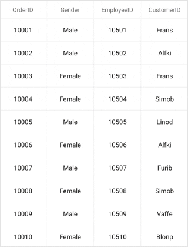
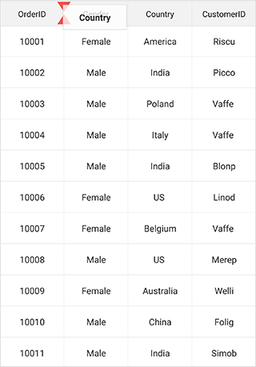

# Column Drag And Drop

The SfDataGrid allows dragging and dropping a column header by setting the [SfDataGrid.AllowDraggingColumn](https://help.syncfusion.com/cr/xamarin/Syncfusion.SfDataGrid.XForms.SfDataGrid.html#Syncfusion_SfDataGrid_XForms_SfDataGrid_AllowDraggingColumn) property to `true`. The Drag view is displayed while dragging a column header. Based on the requirements, drag and drop operations can be handled by using the [SfDataGrid.QueryColumnDragging](https://help.syncfusion.com/cr/xamarin/Syncfusion.SfDataGrid.XForms.SfDataGrid.html) event. 

To enable column drag and drop, follow the code example:



<syncfusion:SfDataGrid AllowDraggingColumn="True" />


dataGrid.AllowDraggingColumn = true;



## Column drag and drop events

The `QueryColumnDragging` event is fired while dragging a column. It will be continuously fired till the dragging ends. By handling the `SfDataGrid.QueryColumnDragging ` event, dragging of a particular column header can be canceled.

`QueryColumnDragging` event provides the following properties in the [QueryColumnDraggingEventArgs](http://help.syncfusion.com/cr/xamarin/Syncfusion.SfDataGrid.XForms.QueryColumnDraggingEventArgs.html):

 * [From](https://help.syncfusion.com/cr/xamarin/Syncfusion.SfDataGrid.XForms.QueryColumnDraggingEventArgs.html#Syncfusion_SfDataGrid_XForms_QueryColumnDraggingEventArgs_From): Returns index of the currently dragging column.
 * [To](https://help.syncfusion.com/cr/xamarin/Syncfusion.SfDataGrid.XForms.QueryColumnDraggingEventArgs.html#Syncfusion_SfDataGrid_XForms_QueryColumnDraggingEventArgs_To): Returns dragging index where you try to drop the column.
 * [Reason](https://help.syncfusion.com/cr/xamarin/Syncfusion.SfDataGrid.XForms.QueryColumnDraggingEventArgs.html#Syncfusion_SfDataGrid_XForms_QueryColumnDraggingEventArgs_Reason): Returns the column dragging details as the [QueryColumnDraggingReason](http://help.syncfusion.com/cr/xamarin/Syncfusion.SfDataGrid.XForms.QueryColumnDraggingReason.html).
 * [DraggingPosition](https://help.syncfusion.com/cr/xamarin/Syncfusion.SfDataGrid.XForms.QueryColumnDraggingEventArgs.html#Syncfusion_SfDataGrid_XForms_QueryColumnDraggingEventArgs_DraggingPosition): Returns positions of the drag view during column drag and drop operations.
 * [CanAutoScroll](https://help.syncfusion.com/cr/xamarin/Syncfusion.SfDataGrid.XForms.QueryColumnDraggingEventArgs.html#Syncfusion_SfDataGrid_XForms_QueryColumnDraggingEventArgs_CanAutoScroll): Returns whether auto-scrolling should happen when column drag view reaches the left or right ends of the `SfDataGrid`.
 * [Cancel](https://msdn.microsoft.com/en-us/library/system.componentmodel.canceleventargs_properties(v=vs.110).aspx): Returns the boolean property to cancel the event.

## Cancel dragging of a particular column

Dragging of a particular column can be canceled using `QueryColumnDraggingReason` argument of the `QueryColumnDragging` event handler.




this.SfGrid.QueryColumnDragging += SfGrid_QueryColumnDragging;

private void SfGrid_QueryColumnDragging(object sender, QueryColumnDraggingEventArgs e)
{
    //e.From returns the index of the dragged column.
    //e.Reason returns the dragging status of the column.
    if (e.From == 1 && e.Reason == QueryColumnDraggingReason.DragStarted)
        e.Cancel = true;
}




## Cancel dropping when dragging for a particular column

Dropping when dragging a particular column can be canceled using `QueryColumnDraggingReason` argument of the `QueryColumnDragging` event handler.




this.SfGrid.QueryColumnDragging += SfGrid_QueryColumnDragging;

private void SfGrid_QueryColumnDragging(object sender, QueryColumnDraggingEventArgs e)
{
    //e.To returns the index of the current column.
    //e.Reason returns the dragging status of the column.
    if ((e.To > 5 || e.To < 10) &&
    (e.Reason == QueryColumnDraggingReason.DragEnded || e.Reason == QueryColumnDraggingReason.Dragging))
        e.Cancel = true;
} 




## Cancel dropping for a particular column

Dropping of a particular column can be canceled using `QueryColumnDraggingReason` argument of the `QueryColumnDragging` event handler.




this.SfGrid.QueryColumnDragging += SfGrid_QueryColumnDragging;

private void SfGrid_QueryColumnDragging(object sender, QueryColumnDraggingEventArgs e)
{
    //e.From returns the index of the dragged column.
    //e.Reason returns the dragging status of the column.
    if (e.From == 1 && e.Reason == QueryColumnDraggingReason.DragEnded)
        e.Cancel = true;
}




## Cancel dropping at a particular position 

Dropping at a particular position can be canceled using `QueryColumnDraggingReason` argument of the `QueryColumnDragging` event handler.




this.SfGrid.QueryColumnDragging += SfGrid_QueryColumnDragging;

private void SfGrid_QueryColumnDragging(object sender, QueryColumnDraggingEventArgs e)
{
    //e.To returns the index of the current column.
    //e.Reason returns the dragging status of the column.
    if ((e.To == 5 || e.To == 7) && e.Reason == QueryColumnDraggingReason.DragEnded)
        e.Cancel = true;
}




## Cancel dropping of a particular column in a position

Dropping of a particular column in a position can be canceled using `QueryColumnDraggingReason` and `Position` arguments of the `QueryColumnDragging` event handler. 




this.SfGrid.QueryColumnDragging += SfGrid_QueryColumnDragging;

private void SfGrid_QueryColumnDragging(object sender, QueryColumnDraggingEventArgs e)
{
    //e.To returns the index of the current column.
    //e.DraggingPosition returns the x and y position of the current column
     if (e.DraggingPosition == new Point(100,100) && e.Reason == QueryColumnDraggingReason.DragEnded)
                e.Cancel = true;
}




## Cancel drag and drop between frozen and non-frozen columns

### Cancel dragging between frozen and non-frozen columns

Dragging between frozen and non-frozen columns can be canceled using `QueryColumnDraggingReason` and `From` arguments of the `QueryColumnDragging` event handler by checking whether the value of `From` argument is a frozen column index. 




SfGrid.FrozenColumnsCount = 2;

this.SfGrid.QueryColumnDragging += SfGrid_QueryColumnDragging;

private void SfGrid_QueryColumnDragging(object sender, QueryColumnDraggingEventArgs e)
{
    //e.From returns the index of the dragged column.
    //e.To returns the index of the current column.
      if (e.From < 2 && e.Reason == QueryColumnDraggingReason.DragStarted)
        e.Cancel = true;
}




### Cancel dropping between frozen and non-frozen columns

Dropping between frozen and non-frozen columns can be canceled using `QueryColumnDraggingReason` and `From`argument of the `QueryColumnDragging` event handler by checking whether the `e.From` value is a frozen column index. 




SfGrid.FrozenColumnsCount = 2;

this.SfGrid.QueryColumnDragging += SfGrid_QueryColumnDragging;

private void SfGrid_QueryColumnDragging(object sender, QueryColumnDraggingEventArgs e)
{
    //e.From returns the index of the dragged column.
    //e.To returns the index of the current column.
      if (e.From < 2 && e.Reason == QueryColumnDraggingReason.DragEnded)
        e.Cancel = true;
}




## Customize column drag and drop indicators

The SfDataGrid allows customizing the column drag and drop indicators by writing the custom grid style, deriving from the [DataGridStyle](http://help.syncfusion.com/cr/xamarin/sfdatagrid/Syncfusion.SfDataGrid.XForms.DataGridStyle.html) and assigning it to the [SfDataGrid.GridStyle](https://help.syncfusion.com/cr/xamarin/Syncfusion.SfDataGrid.XForms.SfDataGrid.html#Syncfusion_SfDataGrid_XForms_SfDataGrid_GridStyle) property.




dataGrid.GridStyle = new CustomGridStyle();






// Custom style class
public class CustomGridStyle : DataGridStyle
{
    public CustomGridStyle()
    {
            
    }
    public override ImageSource GetColumnDragUpIndicator()
    {
        return ImageSource.FromResource("DataGridDemo.icons.GreenUp.png");
    }
             
    public override ImageSource GetColumnDragDownIndicator()
    {
        return ImageSource.FromResource("DataGridDemo.icons.GreenDown.png");
    }
}



## Cancel auto scrolling 

Horizontal auto-scrolling of the `SfDataGrid` during column drag and drop can be canceled using `CanAutoScroll` argument of the `QueryColumnDragging` event handler.




this.SfGrid.QueryColumnDragging += SfGrid_QueryColumnDragging;

private void SfGrid_QueryColumnDragging(object sender, QueryColumnDraggingEventArgs e)
{  
    // Disable scroll while dragging the columns.   
    e.CanAutoScroll = false;
}


