# Export To Excel in Xamarin DataGrid (SfDataGrid)

The SfDataGrid supports exporting the data to Excel with several customization options like custom appearance, excluding specific columns, excluding headers, setting custom row height, setting custom column width, etc.

The following assemblies should be added for exporting the SfDataGrid to Excel file.

<table>
<tr>
<th>Project</th>
<th>Required assemblies</th>
</tr>
<tr>
<td>PCL</td>
<td>pcl\Syncfusion.SfGridConverter.XForms.dll pcl\Syncfusion.Compression.Portable.dll pcl\Syncfusion.Pdf.Portable.dll pcl\Syncfusion.XlsIO.Portable.dll </td>
</tr>
</table>

If you are using nuget package in the package, the following NuGet package should be installed to export the SfDataGrid to Excel file.

<table>
<tr>
<th> Project </th>
<th> Required package </th>
</tr>
<tr>
<td> Xamarin.Forms </td>
<td> Syncfusion.Xamarin.DataGridExport</td>
</tr>
</table>

The following code sample demonstrates how to create and display a SfDataGrid in view.



<Grid>
    <Grid.RowDefinitions>
        <RowDefinition Height="Auto"/>
        <RowDefinition />
    </Grid.RowDefinitions>

    <StackLayout Grid.Row="0" Orientation="Vertical">
        <Button x:Name="Excel" Text="ExportExcel" Clicked ="ExportToExcel_Clicked" HeightRequest="50" />
    </StackLayout>

    <sfgrid:SfDataGrid x:Name="dataGrid"  
                    AllowGroupExpandCollapse="True"
                    AllowSorting="True" 
                    Grid.Row="1"  
                    SelectionMode="Multiple"
                    ColumnSizer="None" 
                    ItemsSource="{Binding OrdersInfo}"
                    AutoGenerateColumns="False" >

        <sfgrid:SfDataGrid.Columns>
            <sfgrid:GridTextColumn HeaderText="Order ID"  MappingName="OrderID"/>
            <sfgrid:GridTextColumn HeaderText="First Name" MappingName="FirstName"/>
            <sfgrid:GridTextColumn HeaderText="Employee ID" MappingName="EmployeeID"/>
            <sfgrid:GridNumericColumn HeaderText="Freight" MappingName="Freight"/>
            <sfgrid:GridTextColumn HeaderText="Is Closed" MappingName="IsClosed"/>
            <sfgrid:GridTextColumn HeaderText="Ship City" MappingName="ShipCity"/>
            <sfgrid:GridDateTimeColumn HeaderText="Shipping Date" MappingName="ShippingDate" />
        </sfgrid:SfDataGrid.Columns>
    </sfgrid:SfDataGrid>
</Grid>


private void ExportToExcel_Clicked(object sender, EventArgs e)
{
    // Perform exporting to Excel sheet operations here.
}



You can export the data to Excel by using the [DataGridExcelExportingController.ExportToExcel](https://help.syncfusion.com/cr/xamarin/Syncfusion.SfDataGrid.XForms.Exporting.DataGridExcelExportingController.html#Syncfusion_SfDataGrid_XForms_Exporting_DataGridExcelExportingController_ExportToExcel_Syncfusion_SfDataGrid_XForms_SfDataGrid_) method by passing the SfDataGrid as an argument. 



private void ExportToExcel_Clicked(object sender, EventArgs e)
{
    DataGridExcelExportingController excelExport = new DataGridExcelExportingController();
    var excelEngine = excelExport.ExportToExcel(this.dataGrid);
    var workbook = excelEngine.Excel.Workbooks[0];
    MemoryStream stream = new MemoryStream();
    workbook.SaveAs(stream);
    workbook.Close();
    excelEngine.Dispose();

    Xamarin.Forms.DependencyService.Get<ISave>().Save("DataGrid.xlsx", "application/msexcel", stream);
}



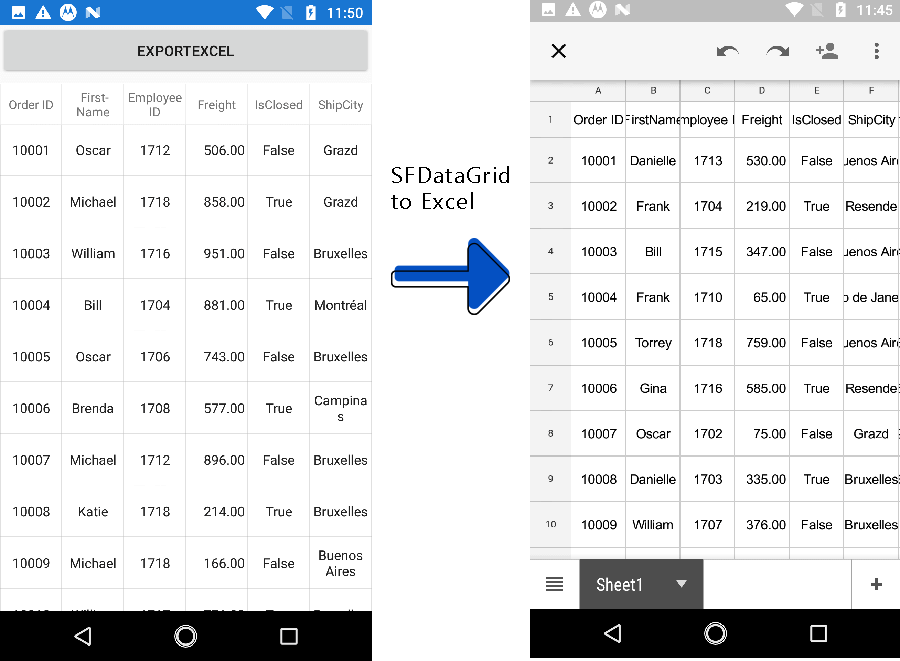

N> SfDataGrid cannot export the GridTemplateColumn to PDF or Excel,  since we cannot get the loaded views and draw them with the particular range, values etc from GridTemplateColumn.

## Exporting Options

You can also export the data to Excel with various customizing options by passing the grid and [DataGridExcelExportingOption](http://help.syncfusion.com/cr/xamarin/sfgridconverter/Syncfusion.SfDataGrid.XForms.Exporting.DataGridExcelExportingOption.html) as arguments to the `ExportToExcel` method.



DataGridExcelExportingController excelExport = new DataGridExcelExportingController ();
DataGridExcelExportingOption exportOption = new DataGridExcelExportingOption ();
exportOption.ExportColumnWidth = false;
exportOption.DefaultColumnWidth = 150;
var excelEngine = excelExport.ExportToExcel (this.dataGrid, exportOption);



The SfDataGrid provides several properties in `DataGridExcelExportingOption` class to customize the grid while exporting it to Excel.

### Exporting formatted text and actual value

By default, the actual value will only be exported to Excel. To export the display text, set the ExportMode property as Text.



DataGridExcelExportingController excelExport = new DataGridExcelExportingController ();
DataGridExcelExportingOption options = new DataGridExcelExportingOption ();
options.ExportMode = ExportMode.Text;
var excelEngine = excelExport.ExportToExcel(dataGrid, options);
var workBook = excelEngine.Excel.Workbooks[0];



### Getting RowIndex, ColumnIndex and GridColumns for customization

#### ExcelColumnIndex

The [ExcelColumnIndex Property](https://help.syncfusion.com/cr/xamarin/Syncfusion.SfDataGrid.XForms.Exporting.DataGridExcelExportingOption.html#Syncfusion_SfDataGrid_XForms_Exporting_DataGridExcelExportingOption_ExcelColumnIndex) gets or internally sets the column index being exported to the Excel. Each column is exported based on this index to identify the current exporting column index.

#### ExcelRowIndex

The [ExcelRowIndex Property](https://help.syncfusion.com/cr/xamarin/Syncfusion.SfDataGrid.XForms.Exporting.DataGridExcelExportingOption.html#Syncfusion_SfDataGrid_XForms_Exporting_DataGridExcelExportingOption_ExcelRowIndex) gets the row index being exported to the Excel. Each row is exported based on this index to identify the current exporting row index.

#### GridColumns

Using the property [System.Collections.IEnumerable columns](https://help.syncfusion.com/cr/xamarin/Syncfusion.SfDataGrid.XForms.Exporting.DataGridExcelExportingOption.html#Syncfusion_SfDataGrid_XForms_Exporting_DataGridExcelExportingOption_GridColumns) you can get or set the [ExcludedColumns](https://help.syncfusion.com/cr/xamarin/Syncfusion.SfDataGrid.XForms.Exporting.DataGridExcelExportingOption.html#Syncfusion_SfDataGrid_XForms_Exporting_DataGridExcelExportingOption_ExcludedColumns) columns collection which contains all the columns that are to be exported. The columns in the ExcludedColumns List will not be a member of the GridColumns collection.

### Customize header, groups and table summary when exporting

#### Export groups

By default, all the groups in the data grid will be exported to Excel sheet. To export the data grid without groups, set the [DataGridExcelExportingOption.ExportGroups](https://help.syncfusion.com/cr/xamarin/Syncfusion.SfDataGrid.XForms.Exporting.DataGridExcelExportingOption.html#Syncfusion_SfDataGrid_XForms_Exporting_DataGridExcelExportingOption_ExportGroups) property to `false`.



DataGridExcelExportingOption option = new DataGridExcelExportingOption();
option.ExportGroups = true;



* ExportGroups = true; 

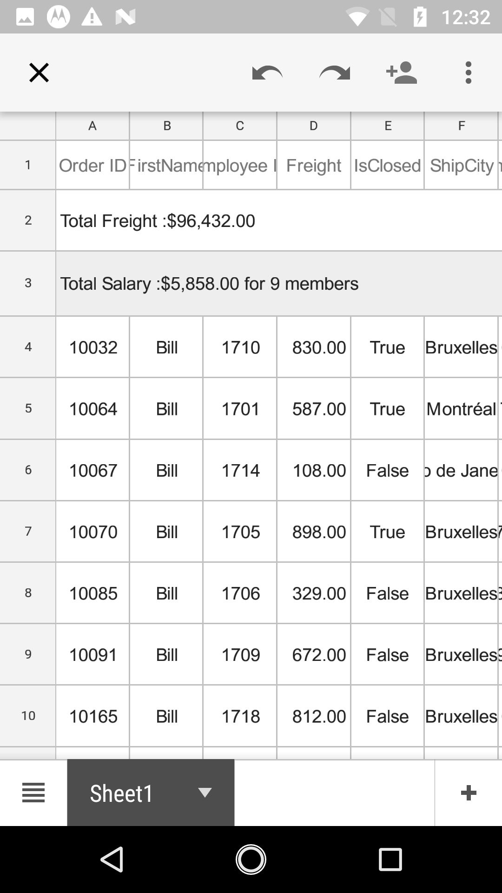

* ExportGroups = false;

 

### Export header

By default, the column headers will be exported to Excel sheet. To export the SfDataGrid without column headers, set the [DataGridExcelExportingOption.ExportHeader](https://help.syncfusion.com/cr/xamarin/Syncfusion.SfDataGrid.XForms.Exporting.DataGridExcelExportingOption.html#Syncfusion_SfDataGrid_XForms_Exporting_DataGridExcelExportingOption_ExportHeader) property to `false`.



DataGridExcelExportingOption option = new DataGridExcelExportingOption();
option.ExportHeader = false;



#### Export table summary

By default, table summaries in the data grid will be exported to Excel. To export the SfDataGrid without table summaries, set the [DataGridExcelExportingOption.ExportTableSummary](https://help.syncfusion.com/cr/xamarin/Syncfusion.SfDataGrid.XForms.Exporting.DataGridExcelExportingOption.html#Syncfusion_SfDataGrid_XForms_Exporting_DataGridExcelExportingOption_ExportTableSummary) property to `false`.



DataGridExcelExportingOption option = new DataGridExcelExportingOption();
option.ExportTableSummary = true;



* ExportTableSummary = true;

* ExportTableSummary = false;

 

### Export groups with outlines

To export the data grid with applied grouping, enable the group expand or collapse option in the Excel sheet by setting the [DataGridExcelExportingOption.AllowOutlining](https://help.syncfusion.com/cr/xamarin/Syncfusion.SfDataGrid.XForms.Exporting.DataGridExcelExportingOption.html#Syncfusion_SfDataGrid_XForms_Exporting_DataGridExcelExportingOption_AllowOutlining) to `true`. The default value of this property is false so, you cannot expand or collapse the group in the Excel sheet.



DataGridExcelExportingOption option = new DataGridExcelExportingOption();
option.AllowOutlining = true; 



### Exclude columns when exporting

By default, all the columns (including hidden columns) in the SfDataGrid will be exported to Excel. To exclude some particular columns when exporting to Excel, add those columns to the [DataGridExcelExportingOption.ExcludeColumns](https://help.syncfusion.com/cr/xamarin/Syncfusion.SfDataGrid.XForms.Exporting.DataGridExcelExportingOption.html#Syncfusion_SfDataGrid_XForms_Exporting_DataGridExcelExportingOption_ExcludedColumns) property in [DataGridExcelExportingOption](http://help.syncfusion.com/cr/xamarin/sfgridconverter/Syncfusion.SfDataGrid.XForms.Exporting.DataGridExcelExportingOption.html) list.



DataGridExcelExportingOption option = new DataGridExcelExportingOption();
var list = new List<string>();
list.Add("OrderID");
list.Add("LastName");
option.ExcludedColumns = list;



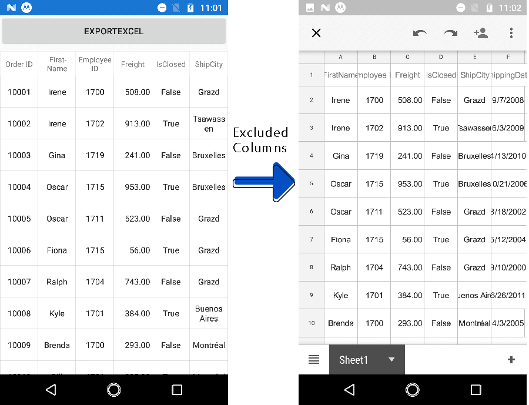

## Customize Exporting Excel Version

The SfDataGrid allows exporting the data to Excel in specific versions by using the [DataGridExcelExportingOption.ExcelVersion](https://help.syncfusion.com/cr/xamarin/Syncfusion.SfDataGrid.XForms.Exporting.DataGridExcelExportingOption.html#Syncfusion_SfDataGrid_XForms_Exporting_DataGridExcelExportingOption_ExcelVersion) property.



DataGridExcelExportingOption option = new DataGridExcelExportingOption();
option.ExcelVersion = Syncfusion.XlsIO.ExcelVersion.Excel2013;



### Exporting the grid from a specified row and column index 

#### StartColumnIndex

By default, the exported SfDataGrid will start from the 0th column in the Excel sheet. You can specify the starting column by using the [DataGridExcelExportingOption.StartColumnIndex](https://help.syncfusion.com/cr/xamarin/Syncfusion.SfDataGrid.XForms.Exporting.DataGridExcelExportingOption.html#Syncfusion_SfDataGrid_XForms_Exporting_DataGridExcelExportingOption_StartColumnIndex) property.



DataGridExcelExportingOption option = new DataGridExcelExportingOption();
option.StartColumnIndex = 4;



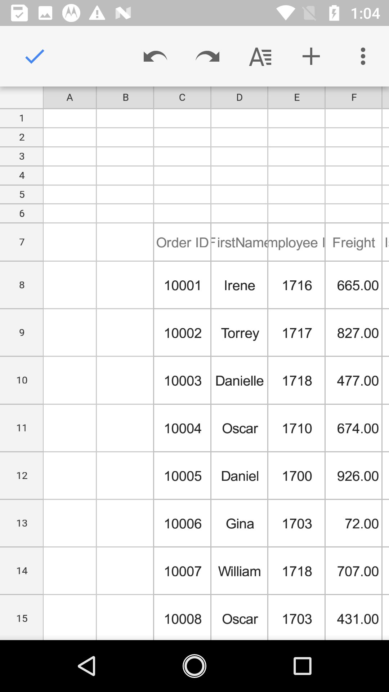 

#### StartRowIndex

By default, the exported SfDataGrid will start from the 0th row in the Excel sheet. You can specify the starting row by using the [DataGridExcelExportingOption.StartRowIndex](https://help.syncfusion.com/cr/xamarin/Syncfusion.SfDataGrid.XForms.Exporting.DataGridExcelExportingOption.html#Syncfusion_SfDataGrid_XForms_Exporting_DataGridExcelExportingOption_StartRowIndex) property.



DataGridExcelExportingOption option = new DataGridExcelExportingOption();
option.StartRowIndex = 10;



 

### Exporting with sorting and filtering

The SfDataGrid allows exporting the data grid to Excel with sorting and filtering options enabled on the column header in Excel sheet by setting the [DataGridExcelExportingOption.AllowSortingAndFiltering](https://help.syncfusion.com/cr/xamarin/Syncfusion.SfDataGrid.XForms.Exporting.DataGridExcelExportingOption.html#Syncfusion_SfDataGrid_XForms_Exporting_DataGridExcelExportingOption_AllowSortingAndFiltering) to `true`. The default value of this property is false.



DataGridExcelExportingOption option = new DataGridExcelExportingOption();
option.AllowSortingAndFiltering = true; 



### Applying styles while exporting

The SfDataGrid allows exporting the data with the applied GridStyle by setting the [DataGridExcelExportingOption.ApplyGridStyle](https://help.syncfusion.com/cr/xamarin/Syncfusion.SfDataGrid.XForms.Exporting.DataGridExcelExportingOption.html#Syncfusion_SfDataGrid_XForms_Exporting_DataGridExcelExportingOption_ApplyGridStyle) to `true`. By default, the data will be exported without the GridStyle.



DataGridExcelExportingOption option = new DataGridExcelExportingOption();
option.ApplyGridStyle = true; 



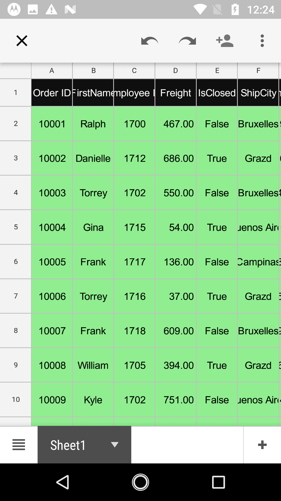

#### BottomTableSummaryStyle

The SfDataGrid supports exporting the bottom table summary with custom style by using the [DataGridExcelExportingOption.BottomTableSummaryStyle](https://help.syncfusion.com/cr/xamarin/Syncfusion.SfDataGrid.XForms.Exporting.DataGridExcelExportingOption.html#Syncfusion_SfDataGrid_XForms_Exporting_DataGridExcelExportingOption_BottomTableSummaryStyle) property.



DataGridExcelExportingOption option = new DataGridExcelExportingOption();
option.BottomTableSummaryStyle = new ExportCellStyle()
{
    BackgroundColor = Xamarin.Forms.Color.Yellow,
    BorderColor = Xamarin.Forms.Color.Red,
    ForegroundColor = Xamarin.Forms.Color.Green,
};



  

#### GroupCaptionStyle

The SfDataGrid supports exporting the GroupCaptionSummaries with custom style by using the [DataGridExcelExportingOption.GroupCaptionStyle](https://help.syncfusion.com/cr/xamarin/Syncfusion.SfDataGrid.XForms.Exporting.DataGridExcelExportingOption.html#Syncfusion_SfDataGrid_XForms_Exporting_DataGridExcelExportingOption_GroupCaptionStyle) property.



DataGridExcelExportingOption option = new DataGridExcelExportingOption();
option.GroupCaptionStyle = new ExportCellStyle()
{
    BackgroundColor = Xamarin.Forms.Color.Yellow,
    BorderColor = Xamarin.Forms.Color.Red,
    ForegroundColor = Xamarin.Forms.Color.Green,
};



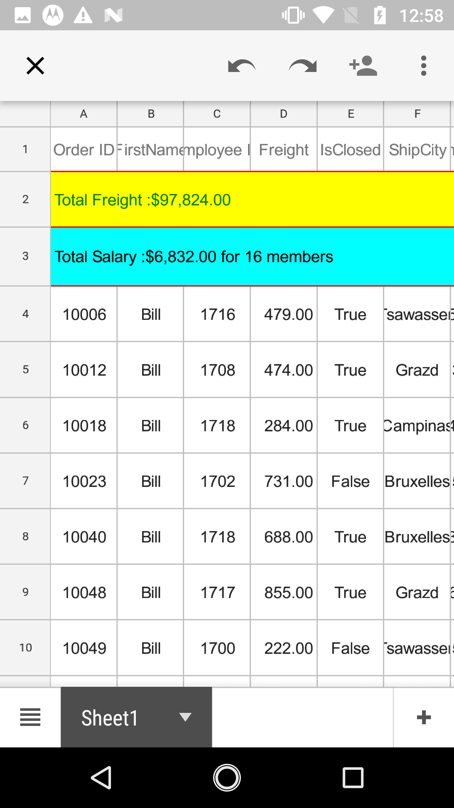 

#### HeaderStyle

The SfDataGrid allows exporting the column headers with custom style by using the [DataGridExcelExportingOption.HeaderStyle](https://help.syncfusion.com/cr/xamarin/Syncfusion.SfDataGrid.XForms.Exporting.DataGridExcelExportingOption.html#Syncfusion_SfDataGrid_XForms_Exporting_DataGridExcelExportingOption_HeaderStyle) property.



DataGridExcelExportingOption option = new DataGridExcelExportingOption();
option.HeaderStyle = new ExportCellStyle()
{
    BackgroundColor = Xamarin.Forms.Color.Yellow,
    BorderColor = Xamarin.Forms.Color.Red,
    ForegroundColor = Xamarin.Forms.Color.Green,
};



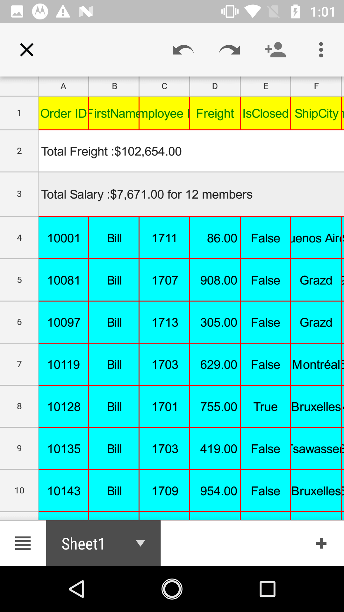 

#### RecordStyle

The SfDataGrid allows exporting the records with custom style by using the [DataGridExcelExportingOption.RecordStyle](https://help.syncfusion.com/cr/xamarin/Syncfusion.SfDataGrid.XForms.Exporting.DataGridExcelExportingOption.html#Syncfusion_SfDataGrid_XForms_Exporting_DataGridExcelExportingOption_RecordStyle) property.



DataGridExcelExportingOption option = new DataGridExcelExportingOption();
option.RecordStyle = new ExportCellStyle()
{
    BackgroundColor = Xamarin.Forms.Color.Yellow,
    BorderColor = Xamarin.Forms.Color.Red,
    ForegroundColor = Xamarin.Forms.Color.Green,
};



 

### TopTableSummaryStyle

The SfDataGrid supports exporting the top table summary with custom style by using the [DataGridExcelExportingOption.TopTableSummaryStyle](https://help.syncfusion.com/cr/xamarin/Syncfusion.SfDataGrid.XForms.Exporting.DataGridExcelExportingOption.html#Syncfusion_SfDataGrid_XForms_Exporting_DataGridExcelExportingOption_TopTableSummaryStyle) property.



DataGridExcelExportingOption option = new DataGridExcelExportingOption();
option.TopTableSummaryStyle = new ExportCellStyle()
{
    BackgroundColor = Xamarin.Forms.Color.Yellow,
    BorderColor = Xamarin.Forms.Color.Red,
    ForegroundColor = Xamarin.Forms.Color.Green,
};



## Exporting Unbound rows

By default, the Unbound rows will not be exported to the excel document. However, you can export the unbound rows to excel by setting the [DataGridExcelExportingOption.ExportUnboundRows](https://help.syncfusion.com/cr/xamarin/Syncfusion.SfDataGrid.XForms.Exporting.DataGridExcelExportingOption.html#Syncfusion_SfDataGrid_XForms_Exporting_DataGridExcelExportingOption_ExportUnboundRows) property as `true`.



DataGridExcelExportingOption option = new DataGridExcelExportingOption();
option.ExportUnboundRows = true;



## Exporting unbound columns

The `SfDataGrid.GridUnboundColumns` will be exported as [SfDataGrid.GridTextColumns](http://help.syncfusion.com/cr/xamarin/sfdatagrid/Syncfusion.SfDataGrid.XForms.GridTextColumn.html) without specifying any code. You can customize the `SfDataGrid.GridUnboundColumns` as `SfDataGrid.GridTextColumns` by using the `CellExporting` and `RowExporting` events.



<sfgrid:GridUnboundColumn Expression="OrderID * 12"
                          HeaderFontAttribute="Bold"
                          HeaderText="Unbound"
                          HeaderTextAlignment="Start"
                          MappingName="Unbound"
                          Padding="5, 0, 0, 0"
                          TextAlignment="Start">
</sfgrid:GridUnboundColumn>



The following screenshot shows that the unbound column is exported to excel sheet along with text columns.

### ExportGroupSummary

By default, the `GroupSummary` rows in the data grid will be exported to Excel. To export the `SfDataGrid` without group summaries, set the [DataGridExcelExportingOption.ExportGroupSummary](https://help.syncfusion.com/cr/xamarin/Syncfusion.SfDataGrid.XForms.Exporting.DataGridExcelExportingOption.html#Syncfusion_SfDataGrid_XForms_Exporting_DataGridExcelExportingOption_ExportGroupSummary) property to `false`.



DataGridExcelExportingOption option = new DataGridExcelExportingOption();
// Set false here to export the DataGrid without GroupSummary rows. The default value is true.
// option.ExportGroupSummary = false;



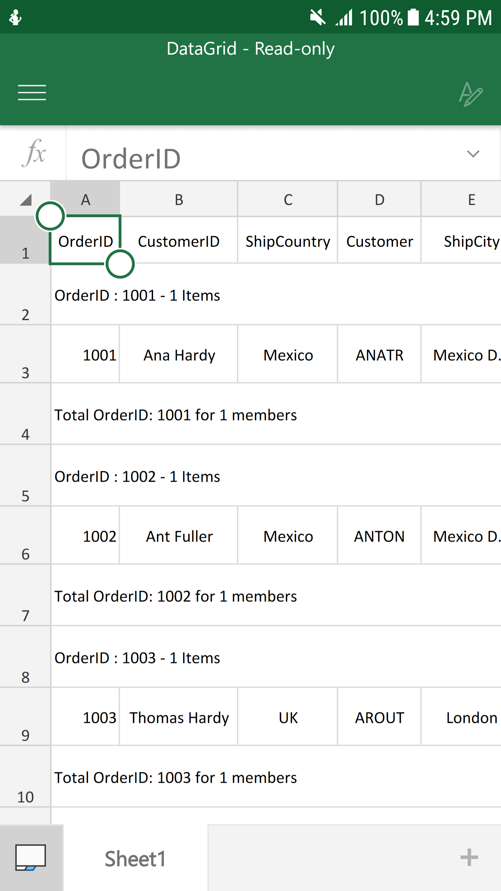

### GroupSummaryStyle 

`SfDataGrid` supports exporting the `GroupSummary` rows with custom style by using the [DataGridExcelExportingOption.GroupSummaryStyle](https://help.syncfusion.com/cr/xamarin/Syncfusion.SfDataGrid.XForms.Exporting.DataGridExcelExportingOption.html#Syncfusion_SfDataGrid_XForms_Exporting_DataGridExcelExportingOption_GroupSummaryStyle) property.



DataGridExcelExportingOption option = new DataGridExcelExportingOption();
option.GroupSummaryStyle = new ExportCellStyle()
{
    BackgroundColor = Xamarin.Forms.Color.Red,
    BorderColor = Xamarin.Forms.Color.Yellow,
    ForegroundColor = Xamarin.Forms.Color.White,
};



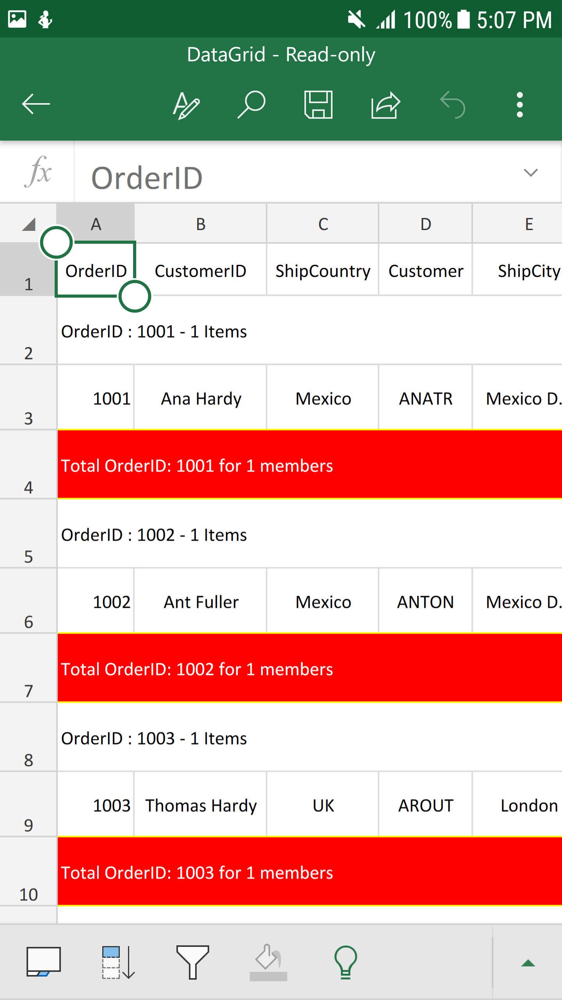

##Saving options

###Save as stream



var excelExport = new DataGridExcelExportingController();
var options = new DataGridExcelExportingOption();  
var excelEngine = excelExport.ExportToExcel(dataGrid, options);
var workBook = excelEngine.Excel.Workbooks[0];
MemoryStream stream = new MemoryStream();
workBook.SaveAs(stream);



## Export AllPages in datagrid

When exporting to Excel using SfDataPager inside the SfDataGrid, it will only export the current page by default. However, you can export all the pages by setting the [DataGridExcelExportingOption.ExportAllPages](https://help.syncfusion.com/cr/xamarin/Syncfusion.SfDataGrid.XForms.Exporting.DataGridExcelExportingOption.html#Syncfusion_SfDataGrid_XForms_Exporting_DataGridExcelExportingOption_ExportAllPages) property to `true`. 



DataGridExcelExportingOption option = new DataGridExcelExportingOption();
option.ExportAllPages = true;



* ExportAllPages = true;

 

* ExportAllPages = false;

 

## Row Height and Column Width customization

### DefaultColumnWidth

The SfDataGrid allows customizing the column width in Excel file by using the [DataGridExcelExportingOption.DefaultColumnWidth](https://help.syncfusion.com/cr/xamarin/Syncfusion.SfDataGrid.XForms.Exporting.DataGridExcelExportingOption.html#Syncfusion_SfDataGrid_XForms_Exporting_DataGridExcelExportingOption_DefaultColumnWidth) property. The `DefaultColumnWidth` value will be applied to all the columns in the Excel sheet.



DataGridExcelExportingOption option = new DataGridExcelExportingOption();
option.DefaultColumnWidth = 100; 



### DefaultRowHeight

The SfDataGrid allows customizing the row height in Excel file by using the [DataGridExcelExportingOption.DefaultRowHeight](https://help.syncfusion.com/cr/xamarin/Syncfusion.SfDataGrid.XForms.Exporting.DataGridExcelExportingOption.html#Syncfusion_SfDataGrid_XForms_Exporting_DataGridExcelExportingOption_DefaultRowHeight) property. The `DefaultRowHeight` value will be applied to all the rows in the Excel sheet.



DataGridExcelExportingOption option = new DataGridExcelExportingOption();
option.DefaultRowHeight = 50; 



### ExportColumnWidth

By default, the data grid columns will be exported to Excel with `DataGridExcelExportingOption.DefaultColumnWidth` value. You can also export the data grid to Excel with exact column widths by setting the [DataGridExcelExportingOption.ExportColumnWidth](https://help.syncfusion.com/cr/xamarin/Syncfusion.SfDataGrid.XForms.Exporting.DataGridExcelExportingOption.html#Syncfusion_SfDataGrid_XForms_Exporting_DataGridExcelExportingOption_ExportColumnWidth) property to `true`. 



DataGridExcelExportingOption option = new DataGridExcelExportingOption();
option.ExportColumnWidth = true;



### ExportRowHeight

By default, the data grid rows will be exported to Excel with `DataGridExcelExportingOption.DefaultRowHeight` value. You can also export the data grid to Excel with exact row heights by setting the [DataGridExcelExportingOption.ExportRowHeight](https://help.syncfusion.com/cr/xamarin/Syncfusion.SfDataGrid.XForms.Exporting.DataGridExcelExportingOption.html#Syncfusion_SfDataGrid_XForms_Exporting_DataGridExcelExportingOption_ExportRowHeight) property to `true`.



DataGridExcelExportingOption option = new DataGridExcelExportingOption();
option.ExportRowHeight = true;



## Events

### Styling cells based on cell type.

You can customize the row style based on the cell type when exporting to Excel by handling the `RowExporting` event.



DataGridExcelExportingController excelExport = new DataGridExcelExportingController();
excelExport.RowExporting += ExcelExport_RowExporting;
  private void ExcelExport_RowExporting(object sender, DataGridRowExcelExportingEventArgs e)
        {
    if (!(e.Record.Data is OrderInfo))
        return;

    if (e.RowType == ExportRowType.Record)
    {
        e.Range.CellStyle.ColorIndex = Syncfusion.XlsIO.ExcelKnownColors.Red;
    }
}



## Cell customization in Excel while exporting

### Customize cell value while exporting

You can customize the cell values when exporting to Excel by handling the `CellExporting` event.



    DataGridExcelExportingController excelExport = new DataGridExcelExportingController();
 excelExport.CellExporting += ExcelExport_CellExporting;
  private void ExcelExport_CellExporting(object sender, DataGridCellExcelExportingEventArgs e)
        {
            if (e.CellType == ExportCellType.RecordCell && e.ColumnName == "IsClosed")
            {
                if ((bool)e.CellValue)
                    e.CellValue = "Y";
                else
                    e.CellValue = "N";
            }
        }



### Changing row style in Excel based on data

You can customize the row style based on the row data when exporting to Excel by handling the `RowExporting` event.



DataGridExcelExportingController excelExport = new DataGridExcelExportingController();
excelExport.RowExporting += ExcelExport_RowExporting;
  private void ExcelExport_RowExporting(object sender, DataGridRowExcelExportingEventArgs e)
        {
    if (!(e.Record.Data is OrderInfo))
        return;

    if (e.RowType == ExportRowType.Record)
    {
         if ((e.Record.Data as OrderInfo).IsClosed)
       e.Range.CellStyle.ColorIndex = Syncfusion.XlsIO.ExcelKnownColors.Yellow;
       else
        e.Range.CellStyle.ColorIndex = Syncfusion.XlsIO.ExcelKnownColors.Red;
    }
}



### Customize the cells based on column name

You can customize the column style based on the row data when exporting to Excel by handling the `CellExporting` event.



DataGridExcelExportingController excelExport = new DataGridExcelExportingController();
excelExport.RowExporting += ExcelExport_RowExporting;
  private void ExcelExport_RowExporting(object sender, DataGridRowExcelExportingEventArgs e)
        {
    if (!(e.Record.Data is OrderInfo))
        return;

   if (e.CellType == ExportCellType.RecordCell && e.ColumnName == "FirstName")
    {
        e.Range.CellStyle.ColorIndex = Syncfusion.XlsIO.ExcelKnownColors.Red;
    }
}



The SfDataGrid provides the following events when exporting to Excel:

* [RowExporting](https://help.syncfusion.com/cr/xamarin/Syncfusion.SfDataGrid.XForms.Exporting.DataGridExcelExportingController.html): Raised when exporting a row at the execution time.
* [CellExporting](https://help.syncfusion.com/cr/xamarin/Syncfusion.SfDataGrid.XForms.Exporting.DataGridExcelExportingController.html): Raised when exporting a cell at the execution time.

### Row exporting

The [DataGridRowExcelExportingEventHandler](http://help.syncfusion.com/cr/xamarin/sfgridconverter/Syncfusion.SfDataGrid.XForms.Exporting.DataGridRowExcelExportingEventHandler.html) delegate allows customizing the styles for record rows and group caption rows. The `RowExporting` event is triggered with [DataGridRowExcelExportingEventArgs](http://help.syncfusion.com/cr/xamarin/sfgridconverter/Syncfusion.SfDataGrid.XForms.Exporting.DataGridRowExcelExportingEventArgs.html) that contains the following properties:

* [Range](https://help.syncfusion.com/cr/xamarin/Syncfusion.SfDataGrid.XForms.Exporting.DataGridRowExcelExportingEventArgs.html#Syncfusion_SfDataGrid_XForms_Exporting_DataGridRowExcelExportingEventArgs_Range): Specifies the Excel range to be exported. It provides full access to the exporting cell in Excel.
* [Record](https://help.syncfusion.com/cr/xamarin/Syncfusion.SfDataGrid.XForms.Exporting.DataGridRowExcelExportingEventArgs.html#Syncfusion_SfDataGrid_XForms_Exporting_DataGridRowExcelExportingEventArgs_Record): Gets the collection of the exported underlying data objects.
* [RowType](https://help.syncfusion.com/cr/xamarin/Syncfusion.SfDataGrid.XForms.Exporting.DataGridRowExcelExportingEventArgs.html#Syncfusion_SfDataGrid_XForms_Exporting_DataGridRowExcelExportingEventArgs_RowType): Specifies the row type by using `ExportRowType` enum. You can use this property to check the row type and apply different styles based on the row type.
* [Worksheet](https://help.syncfusion.com/cr/xamarin/Syncfusion.SfDataGrid.XForms.Exporting.DataGridRowExcelExportingEventArgs.html#Syncfusion_SfDataGrid_XForms_Exporting_DataGridRowExcelExportingEventArgs_Worksheet): Sets the `Worksheet` properties such as sheet protection, gridlines, and so on. 

You can use these events to customize the properties of exported grid rows. The following code example illustrates how to change the background color of the record rows and caption summary rows when exporting.



//HandlingRowExportingEvent for exporting to excel
DataGridExcelExportingController excelExport = new DataGridExcelExportingController ();
excelExport.RowExporting += excelExport_RowExporting; 

void excelExport_RowExporting (object sender, DataGridRowExcelExportingEventArgs e)
{
    if (e.RowType == ExportRowType.Record) {
        if ((e.Record.Data as OrderInfo).IsClosed)
            e.Range.CellStyle.ColorIndex = Syncfusion.XlsIO.ExcelKnownColors.Yellow;
        else
            e.Range.CellStyle.ColorIndex = Syncfusion.XlsIO.ExcelKnownColors.LightGreen;
    }

    if (e.RowType == ExportRowType.CaptionSummary) {
        e.Range.CellStyle.ColorIndex = Syncfusion.XlsIO.ExcelKnownColors.Grey_25_percent;
    }
}



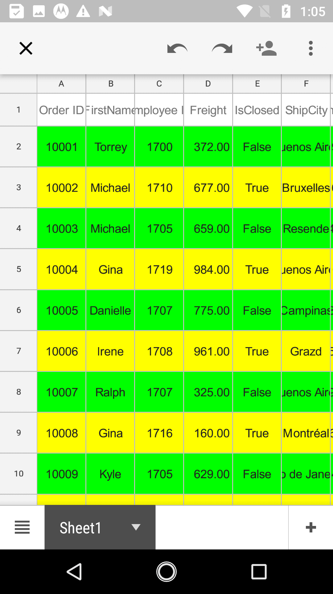

### CellExporting

The [DataGridCellExcelExportingEventHandler](http://help.syncfusion.com/cr/xamarin/sfgridconverter/Syncfusion.SfDataGrid.XForms.Exporting.DataGridCellExcelExportingEventHandler.html) delegate allows customizing the styles for header cells, record cells, and group caption cells. The `CellExporting` event is triggered with [DataGridCellExcelExportingEventArgs](http://help.syncfusion.com/cr/xamarin/sfgridconverter/Syncfusion.SfDataGrid.XForms.Exporting.DataGridCellExcelExportingEventArgs.html) that contains the following properties:

* [CellType](https://help.syncfusion.com/cr/xamarin/Syncfusion.SfDataGrid.XForms.Exporting.DataGridCellExcelExportingEventArgs.html#Syncfusion_SfDataGrid_XForms_Exporting_DataGridCellExcelExportingEventArgs_CellType): Specifies the cell type by using `ExportCellType` enum. Checks the cell type and apply different cell styles based on the cell type.
* [CellValue](https://help.syncfusion.com/cr/xamarin/Syncfusion.SfDataGrid.XForms.Exporting.DataGridCellExcelExportingEventArgs.html#Syncfusion_SfDataGrid_XForms_Exporting_DataGridCellExcelExportingEventArgs_CellValue): Contains the exported actual value. Applies formatting in Excel by using the `Range` property.
* [ColumnName](https://help.syncfusion.com/cr/xamarin/Syncfusion.SfDataGrid.XForms.Exporting.DataGridCellExcelExportingEventArgs.html#Syncfusion_SfDataGrid_XForms_Exporting_DataGridCellExcelExportingEventArgs_ColumnName): Specifies the column name (MappingName) of the exporting cell. You can apply formatting for a particular column by checking the `column name`.
* [Handled](https://help.syncfusion.com/cr/xamarin/Syncfusion.SfDataGrid.XForms.Exporting.DataGridCellExcelExportingEventArgs.html#Syncfusion_SfDataGrid_XForms_Exporting_DataGridCellExcelExportingEventArgs_Handled): Determines whether the cell is exported to Excel or not.
* [Range](https://help.syncfusion.com/cr/xamarin/Syncfusion.SfDataGrid.XForms.Exporting.DataGridCellExcelExportingEventArgs.html#Syncfusion_SfDataGrid_XForms_Exporting_DataGridCellExcelExportingEventArgs_Range): Specifies the Excel range to be exported. It provides full access to the exporting cell in Excel.
* [Record](https://help.syncfusion.com/cr/xamarin/Syncfusion.SfDataGrid.XForms.Exporting.DataGridCellExcelExportingEventArgs.html#Syncfusion_SfDataGrid_XForms_Exporting_DataGridCellExcelExportingEventArgs_Record): Gets the collection of the exported underlying data objects. 

You can use these events to customize the properties of the grid cells exported to excel. The following code example illustrates how to customize the background color, foreground color, and cell value of the header cells, record cells, and caption summary cells when exporting.



//HandlingCellExportingEvent for exporting to Excel
DataGridExcelExportingController excelExport = new DataGridExcelExportingController ();
excelExport.CellExporting += excelExport_CellExporting;  

void excelExport_CellExporting(object sender, DataGridCellExcelExportingEventArgs e)
{
    if (e.CellType == ExportCellType.HeaderCell) {
        e.Range.CellStyle.ColorIndex = Syncfusion.XlsIO.ExcelKnownColors.Blue;
        e.Range.CellStyle.PatternColorIndex = Syncfusion.XlsIO.ExcelKnownColors.White;
        e.Range.CellStyle.BeginUpdate();
        e.Range.CellStyle.Borders.LineStyle = Syncfusion.XlsIO.ExcelLineStyle.Dash_dot;
        e.Range.CellStyle.Borders[ExcelBordersIndex.DiagonalDown].LineStyle = ExcelLineStyle.Dash_dot;
        e.Range.CellStyle.Borders[ExcelBordersIndex.DiagonalUp].LineStyle = ExcelLineStyle.Dash_dot_dot;
        e.Range.CellStyle.Borders.Color = ExcelKnownColors.Black;
        e.Range.CellStyle.EndUpdate();
    }

    if (e.CellType == ExportCellType.RecordCell) {
        e.Range.CellStyle.ColorIndex = Syncfusion.XlsIO.ExcelKnownColors.Yellow;
        e.Range.CellStyle.PatternColorIndex = Syncfusion.XlsIO.ExcelKnownColors.Black;
        e.Range.CellStyle.BeginUpdate();
        e.Range.CellStyle.Borders.LineStyle = Syncfusion.XlsIO.ExcelLineStyle.Dash_dot;
        e.Range.CellStyle.Borders[ExcelBordersIndex.DiagonalDown].LineStyle = ExcelLineStyle.Dash_dot;
        e.Range.CellStyle.Borders[ExcelBordersIndex.DiagonalUp].LineStyle = ExcelLineStyle.Dash_dot_dot;
        e.Range.CellStyle.Borders.Color = ExcelKnownColors.Black;
        e.Range.CellStyle.EndUpdate();
    }

    if (e.CellType == ExportCellType.GroupCaptionCell) {
        e.Range.CellStyle.ColorIndex = Syncfusion.XlsIO.ExcelKnownColors.Grey_25_percent;
        e.Range.CellStyle.PatternColorIndex = Syncfusion.XlsIO.ExcelKnownColors.Blue;
        e.Range.CellStyle.BeginUpdate();
        e.Range.CellStyle.Borders.LineStyle = Syncfusion.XlsIO.ExcelLineStyle.Dash_dot;
        e.Range.CellStyle.Borders[ExcelBordersIndex.DiagonalDown].LineStyle = ExcelLineStyle.Dash_dot;
        e.Range.CellStyle.Borders[ExcelBordersIndex.DiagonalUp].LineStyle = ExcelLineStyle.Dash_dot_dot;
        e.Range.CellStyle.Borders.Color = ExcelKnownColors.Black;
        e.Range.CellStyle.EndUpdate();
    }

    // You can also set the desired values for the CaptionSummary rows and GroupSummary rows as shown below
    //if (e.CellType == ExportCellType.GroupCaptionCell) {
    //    e.Range.CellStyle.ColorIndex = Syncfusion.XlsIO.ExcelKnownColors.Grey_25_percent;
    //    e.Range.CellStyle.PatternColorIndex = Syncfusion.XlsIO.ExcelKnownColors.Blue;
    //    e.Range.CellStyle.BeginUpdate();
    //    e.Range.CellStyle.Borders.LineStyle = Syncfusion.XlsIO.ExcelLineStyle.Dash_dot;
    //    e.Range.CellStyle.Borders[ExcelBordersIndex.DiagonalDown].LineStyle = ExcelLineStyle.Dash_dot;
    //    e.Range.CellStyle.Borders[ExcelBordersIndex.DiagonalUp].LineStyle = ExcelLineStyle.Dash_dot_dot;
    //    e.Range.CellStyle.Borders.Color = ExcelKnownColors.Black;
    //    e.Range.CellStyle.EndUpdate();
    //}

     //if (e.CellType == ExportCellType.GroupSummaryCell){
     //   e.Range.CellStyle.ColorIndex = Syncfusion.XlsIO.ExcelKnownColors.Light_yellow;
     //   e.Range.CellStyle.PatternColorIndex = Syncfusion.XlsIO.ExcelKnownColors.Black;
     //   e.Range.CellStyle.BeginUpdate();
     //   e.Range.CellStyle.Borders.LineStyle = Syncfusion.XlsIO.ExcelLineStyle.Dashed;
     //   e.Range.CellStyle.Borders[ExcelBordersIndex.DiagonalDown].LineStyle = ExcelLineStyle.Dashed;
     //   e.Range.CellStyle.Borders[ExcelBordersIndex.DiagonalUp].LineStyle = ExcelLineStyle.Dashed;
     //   e.Range.CellStyle.Borders.Color = ExcelKnownColors.Red;
     //   e.Range.CellStyle.EndUpdate();
    //}

}



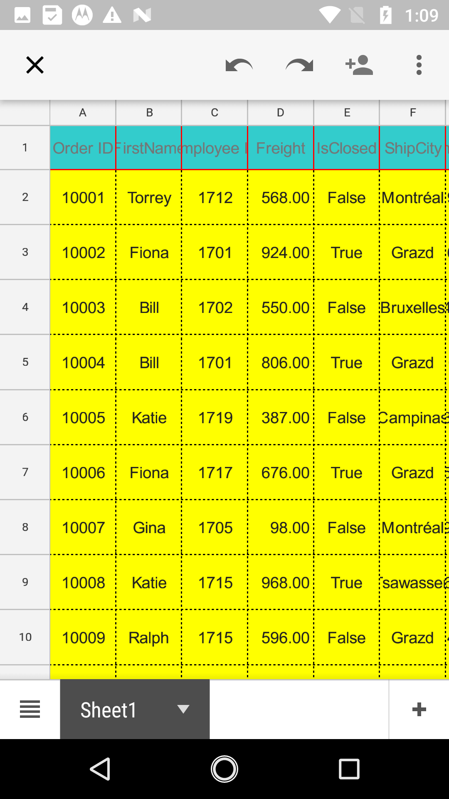

## Customize exported workbook and worksheet

### Saving a workbook

The following code snippet explains how to save the converted Excel sheet in our local device.



// Need to define the Interfaces in-order to use it in platform wise using Dependency Service
public interface ISave
{
    void Save(string filename, string contentType, MemoryStream stream);
}
public interface ISaveWindows
{
    Task Save(string filename, string contentType, MemoryStream stream);
}

// In Android renderer project
public class SaveAndroid : ISave
{
    public void Save(string filename, string contentType, MemoryStream stream)
    {
        string exception = string.Empty;
        string root = null;
        if (Android.OS.Environment.IsExternalStorageEmulated)
        {
            root = Android.OS.Environment.ExternalStorageDirectory.ToString();
        }
        else
            root = Environment.GetFolderPath(Environment.SpecialFolder.MyDocuments);

        Java.IO.File myDir = new Java.IO.File(root + "/Syncfusion");
        myDir.Mkdir();
        Java.IO.File file = new Java.IO.File(myDir, filename);
        
        if (file.Exists()) file.Delete();
        
        try
        {
            FileOutputStream outs = new FileOutputStream(file);
            outs.Write(stream.ToArray());
            outs.Flush();
            outs.Close();
        }
        catch (Exception e)
        {
            exception = e.ToString();
        }
        if (file.Exists() && contentType != "application/html")
        {
            Android.Net.Uri path = Android.Net.Uri.FromFile(file);
            string extension = Android.Webkit.MimeTypeMap.GetFileExtensionFromUrl(Android.Net.Uri.FromFile(file).ToString());
            string mimeType = Android.Webkit.MimeTypeMap.Singleton.GetMimeTypeFromExtension(extension);
            Intent intent = new Intent(Intent.ActionView);
            intent.SetDataAndType(path, mimeType);
            Forms.Context.StartActivity(Intent.CreateChooser(intent, "Choose App"));
        }
    }
}

// In iOS renderer project
public class SaveIOS : ISave
{
    void ISave.Save(string filename, string contentType, MemoryStream stream)
    {
        string exception = string.Empty;
        string path = Environment.GetFolderPath(Environment.SpecialFolder.Personal);
        string filePath = Path.Combine(path, filename);
        try
        {
            FileStream fileStream = File.Open(filePath, FileMode.Create);
            stream.Position = 0;
            stream.CopyTo(fileStream);
            fileStream.Flush();
            fileStream.Close();
        }
        catch (Exception e)
        {
            exception = e.ToString();
        }
        
        if (contentType == "application/html" || exception != string.Empty)
            return;
        
        UIViewController currentController = UIApplication.SharedApplication.KeyWindow.RootViewController;
        while (currentController.PresentedViewController != null)
            currentController = currentController.PresentedViewController;
        UIView currentView = currentController.View;

        QLPreviewController previewController = new QLPreviewController();
        QLPreviewItem item = new QLPreviewItemBundle(filename, filePath);
        previewController.DataSource = new PreviewControllerDS(item);

        currentController.PresentViewController((UIViewController)previewController, true, (Action)null);
    }
}

public class PreviewControllerDS : QLPreviewControllerDataSource
{
    private QLPreviewItem _item;

    public PreviewControllerDS(QLPreviewItem item)
    {
        _item = item;
    }

    public override nint PreviewItemCount (QLPreviewController controller)
    {
        return (nint)1;
    }

    public override IQLPreviewItem GetPreviewItem (QLPreviewController controller, nint index)
    {
        return _item;
    }
}

public class QLPreviewItemFileSystem : QLPreviewItem
{
    string _fileName, _filePath;

    public QLPreviewItemFileSystem(string fileName, string filePath)
    {
        _fileName = fileName;
        _filePath = filePath;
    }

    public override string ItemTitle
    {
        get
        {
            return _fileName;
        }
    }
    public override NSUrl ItemUrl
    {
        get
        {
            return NSUrl.FromFilename(_filePath);
        }
    }
}

public class QLPreviewItemBundle : QLPreviewItem
{
    string _fileName, _filePath;
    public QLPreviewItemBundle(string fileName, string filePath)
    {
        _fileName = fileName;
        _filePath = filePath;
    }

    public override string ItemTitle
    {
        get
        {
            return _fileName;
        }
    }
    public override NSUrl ItemUrl
    {
        get
        {
            var documents = NSBundle.MainBundle.BundlePath;
            var lib = Path.Combine(documents, _filePath);
            var url = NSUrl.FromFilename(lib);
            return url;
        }
    }
}

// In UWP renderer project
public class SaveWindows : ISaveWindows
{
    public async Task Save(string filename, string contentType, MemoryStream stream)
    {
        if (Device.Idiom != TargetIdiom.Desktop)
        {
            StorageFolder local = Windows.Storage.ApplicationData.Current.LocalFolder;
            StorageFile outFile = await local.CreateFileAsync(filename, CreationCollisionOption.ReplaceExisting);
            using (Stream outStream = await outFile.OpenStreamForWriteAsync())
            {
                outStream.Write(stream.ToArray(), 0, (int)stream.Length);
            }
            if (contentType != "application/html")
                await Windows.System.Launcher.LaunchFileAsync(outFile);
        }
        else
        {
            StorageFile storageFile = null;
            FileSavePicker savePicker = new FileSavePicker();
            savePicker.SuggestedStartLocation = PickerLocationId.Desktop;
            savePicker.SuggestedFileName = filename;
            switch (contentType)
            {
                case "application/vnd.openxmlformats-officedocument.presentationml.presentation":
                    savePicker.FileTypeChoices.Add("PowerPoint Presentation", new List<string>() { ".pptx", });
                    break;

                case "application/msexcel":
                    savePicker.FileTypeChoices.Add("Excel Files", new List<string>() { ".xlsx", });
                    break;

                case "application/msword":
                    savePicker.FileTypeChoices.Add("Word Document", new List<string>() { ".docx" });
                    break;

                case "application/pdf":
                    savePicker.FileTypeChoices.Add("Adobe PDF Document", new List<string>() { ".pdf" });
                    break;
                
                case "application/html":
                    savePicker.FileTypeChoices.Add("HTML Files", new List<string>() { ".html" });
                    break;
            }
            storageFile = await savePicker.PickSaveFileAsync();

            using (Stream outStream = await storageFile.OpenStreamForWriteAsync())
            {
                outStream.Write(stream.ToArray(), 0, (int)stream.Length);
                outStream.Flush();
                outStream.Dispose();
            }
            stream.Flush();
            stream.Dispose();
            await Windows.System.Launcher.LaunchFileAsync(storageFile);
        }
    }
}



### Worksheet customization

#### Setting borders

The SfDataGrid allows exporting the data to Excel with custom borders style in Excel sheet by handling the `CellExporting` event. 



private void ExcelExport_CellExporting(object sender, DataGridCellExcelExportingEventArgs e)
{
    if (e.CellType == ExportCellType.RecordCell)
    {
        e.Range.CellStyle.BeginUpdate();
        e.Range.CellStyle.Borders.LineStyle = Syncfusion.XlsIO.ExcelLineStyle.Dash_dot;
        e.Range.CellStyle.Borders[ExcelBordersIndex.DiagonalDown].LineStyle = ExcelLineStyle.Dash_dot;
        e.Range.CellStyle.Borders[ExcelBordersIndex.DiagonalUp].LineStyle = ExcelLineStyle.Dash_dot_dot;
        e.Range.CellStyle.Borders.Color = ExcelKnownColors.Black;
        e.Range.CellStyle.EndUpdate();
    }
}



#### Enabling filters

You can show filters in exported worksheet by enabling filter for the exported range in the worksheet.



var excelExport = new DataGridExcelExportingController();
var options = new DataGridExcelExportingOption();  
var excelEngine = excelExport.ExportToExcel(dataGrid, options);
var workBook = excelEngine.Excel.Workbooks[0];
workBook.Worksheets[0].AutoFilters.FilterRange = workBook.Worksheets[0].UsedRange;
MemoryStream stream = new MemoryStream();
workBook.SaveAs(stream);


While using stacked headers, you can specify the range based on Stacked headers count.


var excelExport = new DataGridExcelExportingController();
var options = new DataGridExcelExportingOption();  
options.ExportStackedHeaders = true;
var excelEngine = excelExport.ExportToExcel(dataGrid, options);
var workBook = excelEngine.Excel.Workbooks[0];
var range = "A" + (dataGrid.StackedHeaderRows.Count + 1).ToString() + ":" + workBook.Worksheets[0].UsedRange.End.AddressLocal;
excelEngine.Excel.Workbooks[0].Worksheets[0].AutoFilters.FilterRange = workBook.Worksheets[0].Range[range];
workBook.SaveAs("Sample.xlsx");
MemoryStream stream = new MemoryStream();
workBook.SaveAs(stream);



#### Customize the range of cells

You can customize the range of cells after exporting to Excel by directly manipulating worksheet.



var excelExport = new DataGridExcelExportingController();
var options = new DataGridExcelExportingOption();  
options.ExportStackedHeaders = true;
var excelEngine = excelExport.ExportToExcel(dataGrid, options);
var workBook = excelEngine.Excel.Workbooks[0];
workBook.Worksheets[0].Range["A2:A6"].CellStyle.Color = System.Drawing.Color.LightSlateGray;
workBook.Worksheets[0].Range["A2:A6"].CellStyle.Font.Color = ExcelKnownColors.White;
MemoryStream stream = new MemoryStream();
workBook.SaveAs(stream);

 

### Performance improvement

Using [ExcelExportingOptions.CellsExportingEventHandler](http://help.syncfusion.com/cr/xamarin/sfgridconverter/Syncfusion.SfDataGrid.XForms.Exporting.DataGridCellExcelExportingEventHandler.html) to customize settings of each cell will consume more memory and time. So, avoid using `CellsExportingEventHandler` when customizing large number of cells and instead of you can do the required customizations in the exported sheet. 

### Formatting column without using CellsExportingEventHandler

You can perform cell level customization such as row-level styling and formatting a particular column in the exported worksheet.

In the following code snippet, NumberFormat for GridNumericColumn column is changed in the exported sheet after exporting without using `CellsExportingEventHandler`.

Reference: http://help.syncfusion.com/file-formats/xlsio/working-with-cell-or-range-formatting



var excelExport = new DataGridExcelExportingController();
var options = new DataGridExcelExportingOption();                   
options.ExportMode = ExportMode.Value;                         
var excelEngine = excelExport.ExportToExcel(dataGrid, options);
var workBook = excelEngine.Excel.Workbooks[0];
workBook.ActiveSheet.Columns[4].NumberFormat = "0.0";



### Alternate row styling without using CellsExportingEventHandler

In the following code snippet, the background color of the rows in Excel is changed based on the row index using conditional formatting for better performance.

Reference: http://help.syncfusion.com/file-formats/xlsio/working-with-conditional-formatting



var excelExport = new DataGridExcelExportingController();
var options = new DataGridExcelExportingOption();                   
options.ExportMode = ExportMode.Value;                         
var excelEngine = excelExport.ExportToExcel(dataGrid, options);
var workBook = excelEngine.Excel.Workbooks[0];

IConditionalFormats condition = workBook.ActiveSheet.Range[2,1,this.dataGrid.View.Records.Count+1,this.dataGrid.Columns.Count].ConditionalFormats;
IConditionalFormat condition1 = condition.AddCondition();
condition1.FormatType = ExcelCFType.Formula;
condition1.FirstFormula = "MOD(ROW(),2)=0";
condition1.BackColorRGB = System.Drawing.Color.Pink;
IConditionalFormat condition2 = condition.AddCondition();
condition2.FormatType = ExcelCFType.Formula;
condition2.FirstFormula = "MOD(ROW(),2)=1";
condition2.BackColorRGB = System.Drawing.Color.LightGray;



## Exporting the selected rows of SfDataGrid

SfDataGrid allows you to export only the currently selected rows in the grid to the worksheet using the [DataGridExcelExportingController.ExportToExcel](https://help.syncfusion.com/cr/xamarin/Syncfusion.SfDataGrid.XForms.Exporting.DataGridExcelExportingController.html#Syncfusion_SfDataGrid_XForms_Exporting_DataGridExcelExportingController_ExportToExcel_Syncfusion_SfDataGrid_XForms_SfDataGrid_) method by passing the instance of the SfDataGrid and [SfDataGrid.SelectedItems](https://help.syncfusion.com/cr/xamarin/Syncfusion.SfDataGrid.XForms.SfDataGrid.html#Syncfusion_SfDataGrid_XForms_SfDataGrid_SelectedItems) collection as an argument.

Refer the below code to export the selected rows alone to Excel.



    private void ExPortToExcel(object sender, EventArgs e)
        {
            DataGridExcelExportingController excelExport = new DataGridExcelExportingController();
            ObservableCollection<object> selectedItems = dataGrid.SelectedItems;
            var excelEngine = excelExport.ExportToExcel(this.dataGrid, selectedItems);
            var workbook = excelEngine.Excel.Workbooks[0];
            MemoryStream stream = new MemoryStream();
            workbook.SaveAs(stream);
            workbook.Close();
            excelEngine.Dispose();

            if (Device.RuntimePlatform == Device.UWP)
                Xamarin.Forms.DependencyService.Get<ISaveWindowsPhone>().Save("DataGrid.xlsx", "application/msexcel", stream);
            else
                Xamarin.Forms.DependencyService.Get<ISave>().Save("DataGrid.xlsx", "application/msexcel", stream);
        }



## See also

[How to export a SfDataGrid to excel or PDF using ToolBarItems of a Page](https://www.syncfusion.com/kb/7395)
