# Export To PDF in Xamarin DataGrid (SfDataGrid)

The SfDataGrid supports exporting the data to PDF with several customization options like custom appearance, excluding specific columns, excluding headers, setting custom row height, setting custom column width, and so on.

The following assemblies should be added for exporting to PDF file.

<table>
<tr>
<th>Project</th>
<th>Required assemblies</th>
</tr>
<tr>
<td>PCL</td>
<td>pcl\Syncfusion.SfGridConverter.XForms.dll pcl\Syncfusion.Compression.Portable.dll pcl\Syncfusion.Pdf.Portable.dll pcl\Syncfusion.XlsIO.Portable.dll </td>
</tr>
</table>

If you are using nuget package in the package, the following NuGet package should be installed to export the SfDataGrid to PDF file.

<table>
<tr>
<th> Project </th>
<th> Required package </th>
</tr>
<tr>
<td> Xamarin.Forms </td>
<td> Syncfusion.Xamarin.DataGridExport</td>
</tr>
</table>

You can export the SfDataGrid to PDF by using the following extension methods present in the Syncfusion.SfDataGrid.XForms.Exporting namespace.

* [ExportToPdf](https://help.syncfusion.com/xamarin/sfdatagrid/export-to-pdf#exporttopdf)
* [ExportToPdfGrid](https://help.syncfusion.com/xamarin/sfdatagrid/export-to-pdf#exporttopdfgrid)

The following code illustrates how to create and display a SfDataGrid in view.



<Grid>
    <Grid.RowDefinitions>
        <RowDefinition Height="Auto"/>
        <RowDefinition />
    </Grid.RowDefinitions>

    <StackLayout Grid.Row="0" Orientation="Vertical">
        <Button x:Name="Export" Text="ExportPDF" Clicked ="PDFExport_Clicked" HeightRequest="50" />
    </StackLayout>

    <sfgrid:SfDataGrid x:Name="dataGrid"  
                    AllowGroupExpandCollapse="True"
                    AllowSorting="True" 
                    Grid.Row="1"  
                    SelectionMode="Multiple"
                    ColumnSizer="None" 
                    ItemsSource="{Binding OrdersInfo}"
                    AutoGenerateColumns="False" >

        <sfgrid:SfDataGrid.Columns>
            <sfgrid:GridTextColumn HeaderText="Order ID"  MappingName="OrderID"/>
            <sfgrid:GridTextColumn HeaderText="FirstName" MappingName="FirstName"/>
            <sfgrid:GridTextColumn HeaderText="Employee ID" MappingName="EmployeeID"/>
            <sfgrid:GridNumericColumn HeaderText="Freight" MappingName="Freight"/>
            <sfgrid:GridTextColumn HeaderText="IsClosed" MappingName="IsClosed"/>
            <sfgrid:GridTextColumn HeaderText="ShipCity" MappingName="ShipCity"/>
            <sfgrid:GridDateTimeColumn HeaderText="ShippingDate" MappingName="ShippingDate" />
        </sfgrid:SfDataGrid.Columns>
    </sfgrid:SfDataGrid>
</Grid>



## ExportToPdf

You can export the data to PDF by using the [DataGridPdfExportingController.ExportToPdf](https://help.syncfusion.com/cr/xamarin/Syncfusion.SfDataGrid.XForms.Exporting.DataGridPdfExportingController.html#Syncfusion_SfDataGrid_XForms_Exporting_DataGridPdfExportingController_ExportToPdf_Syncfusion_SfDataGrid_XForms_SfDataGrid_) method by passing the SfDataGrid as an argument. 



private void PDFExport_Clicked(object sender, EventArgs e)
{
    DataGridPdfExportingController pdfExport = new DataGridPdfExportingController();
    MemoryStream stream = new MemoryStream();
    var exportToPdf = pdfExport.ExportToPdf(this.dataGrid, new DataGridPdfExportOption()
    {
        FitAllColumnsInOnePage = true,
    });
    exportToPdf.Save(stream);
    exportToPdf.Close(true);
    if (Device.OS == TargetPlatform.WinPhone || Device.OS == TargetPlatform.Windows)
        Xamarin.Forms.DependencyService.Get<ISaveWindowsPhone>().Save("DataGrid.pdf", "application/pdf", stream);
    else
        Xamarin.Forms.DependencyService.Get<ISave>().Save("DataGrid.pdf", "application/pdf", stream);
}



## ExportToPdfGrid

You can also export the data to PDF by using the [DataGridPdfExportingController.ExportToPdfGrid](https://help.syncfusion.com/cr/xamarin/Syncfusion.SfDataGrid.XForms.Exporting.DataGridPdfExportingController.html#Syncfusion_SfDataGrid_XForms_Exporting_DataGridPdfExportingController_ExportToPdfGrid_Syncfusion_SfDataGrid_XForms_SfDataGrid_Syncfusion_Data_ICollectionViewAdv_Syncfusion_SfDataGrid_XForms_Exporting_DataGridPdfExportOption_Syncfusion_Pdf_PdfDocument_) method by passing the SfDataGrid as an argument. 



private void PDFExport_Clicked(object sender, EventArgs e)
{
    DataGridPdfExportingController pdfExport = new DataGridPdfExportingController();
    MemoryStream stream = new MemoryStream();
    var pdfDoc = new PdfDocument();
    PdfPage page = pdfDoc.Pages.Add();
    var exportToPdfGrid = pdfExport.ExportToPdfGrid(this.dataGrid, this.dataGrid.View, new DataGridPdfExportOption()
    {
        FitAllColumnsInOnePage = true,

    }, pdfDoc);
    exportToPdfGrid.Draw(page, new PointF(10, 10));
    pdfDoc.Save(stream);
    pdfDoc.Close(true);
    if (Device.OS == TargetPlatform.WinPhone || Device.OS == TargetPlatform.Windows)
        Xamarin.Forms.DependencyService.Get<ISaveWindowsPhone>().Save("DataGrid.pdf", "application/pdf", stream);
    else
        Xamarin.Forms.DependencyService.Get<ISave>().Save("DataGrid.pdf", "application/pdf", stream);
}



N> SfDataGrid cannot export the GridTemplateColumn to PDF or Excel,  since we cannot get the loaded views and draw them with the particular range, values etc from GridTemplateColumn.

## Exporting options

### Exclude columns when exporting

By default, all the columns (including hidden columns) in the SfDataGrid will be exported to PDF. To exclude some particular columns when exporting to PDF, add those columns to [DataGridPdfExportOption.ExcludeColumns](https://help.syncfusion.com/cr/xamarin/Syncfusion.SfDataGrid.XForms.Exporting.DataGridPdfExportOption.html#Syncfusion_SfDataGrid_XForms_Exporting_DataGridPdfExportOption_ExcludeColumns) list.



DataGridPdfExportingController pdfExport = new DataGridPdfExportingController ();
DataGridPdfExportOption exportOption = new DataGridPdfExportOption ();
exportOption.FitAllColumnsInOnePage = true;
var list = new List<string>();
list.Add("OrderID");
list.Add("LastName");
exportOption.ExcludedColumns = list;
var doc = pdfExport.ExportToPdf (this.dataGrid, exportOption); 



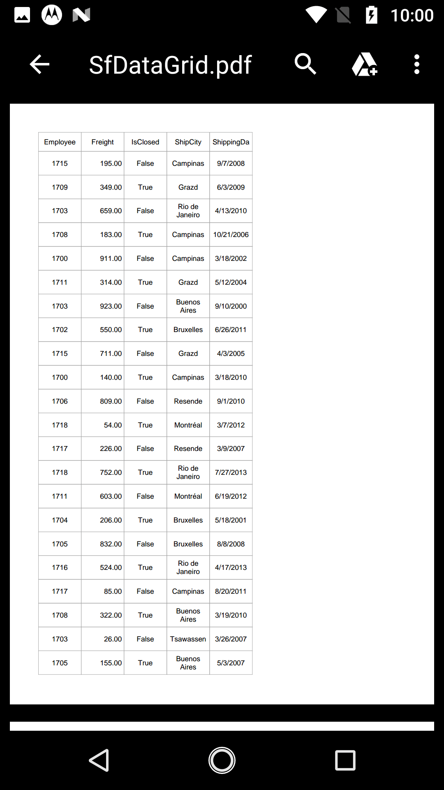

### Getting PDF document 

The [DataGridPdfExportOption.PdfDocument](https://help.syncfusion.com/cr/xamarin/Syncfusion.SfDataGrid.XForms.Exporting.DataGridPdfExportOption.html#Syncfusion_SfDataGrid_XForms_Exporting_DataGridPdfExportOption_PdfDocument) allows exporting the SfDataGrid to an existing or a new PDF document. 



DataGridPdfExportOption option = new DataGridPdfExportOption();
PdfDocument pdfDocument = new PdfDocument();
pdfDocument.Pages.Add();
pdfDocument.Pages.Add();
pdfDocument.Pages.Add();
option.StartPageIndex = 1;
option.PdfDocument = pdfDocument;



### Getting GridColumns for customization

Using the property [GridColumns](https://help.syncfusion.com/cr/xamarin/Syncfusion.SfDataGrid.XForms.Exporting.DataGridPdfExportOption.html#Syncfusion_SfDataGrid_XForms_Exporting_DataGridPdfExportOption_GridColumns) you can get or set the [System.Collections.IEnumerable](https://help.syncfusion.com/cr/xamarin/Syncfusion.SfDataGrid.XForms.Exporting.DataGridPdfExportOption.html#Syncfusion_SfDataGrid_XForms_Exporting_DataGridPdfExportOption_GridColumns) columns collection which contains all the columns that are to be exported. The columns in the ExcludedColumns List will not be a member of the GridColumns collection.

### Column header on each page

You can show or hide the column headers on each page of the exported PDF document by using the [DataGridPdfExportOption.RepeatHeaders](https://help.syncfusion.com/cr/xamarin/Syncfusion.SfDataGrid.XForms.Exporting.DataGridPdfExportOption.html#Syncfusion_SfDataGrid_XForms_Exporting_DataGridPdfExportOption_RepeatHeaders) property. The default value is true.



private void PDFExport_Clicked(object sender, EventArgs e)
{
    DataGridPdfExportingController pdfExport = new DataGridPdfExportingController();
    MemoryStream stream = new MemoryStream();
    DataGridPdfExportOption option = new DataGridPdfExportOption();
    option.RepeatHeaders = true;
    var exportToPdf = pdfExport.ExportToPdf(this.dataGrid, option);
    exportToPdf.Save(stream);
    exportToPdf.Close(true);
    Xamarin.Forms.DependencyService.Get<ISave>().Save("DataGrid.pdf", "application/pdf", stream);
}



### Customize header, groups and table summary when exporting

#### Exclude groups while exporting

By default, all the groups in the data grid will be exported to PDF document. To export the data grid without groups, set the [DataGridPdfExportOption.ExportGroups](https://help.syncfusion.com/cr/xamarin/Syncfusion.SfDataGrid.XForms.Exporting.DataGridPdfExportOption.html#Syncfusion_SfDataGrid_XForms_Exporting_DataGridPdfExportOption_ExportGroups) property to `false`.



private void PDFExport_Clicked(object sender, EventArgs e)
{
    DataGridPdfExportingController pdfExport = new DataGridPdfExportingController();
    MemoryStream stream = new MemoryStream();
    DataGridPdfExportOption option = new DataGridPdfExportOption();
    option.ExportGroups = true;
    var exportToPdf = pdfExport.ExportToPdf(this.dataGrid, option);
    exportToPdf.Save(stream);
    exportToPdf.Close(true);
    Xamarin.Forms.DependencyService.Get<ISave>().Save("DataGrid.pdf", "application/pdf", stream);
}



#### Exclude Column header while exporting

By default, the column headers will be exported to PDF document. To export the SfDataGrid without the column headers, set the [DataGridPdfExportOption.ExportHeader](https://help.syncfusion.com/cr/xamarin/Syncfusion.SfDataGrid.XForms.Exporting.DataGridPdfExportOption.html#Syncfusion_SfDataGrid_XForms_Exporting_DataGridPdfExportOption_ExportHeader) property to `false`.



private void PDFExport_Clicked(object sender, EventArgs e)
{
    DataGridPdfExportingController pdfExport = new DataGridPdfExportingController();
    MemoryStream stream = new MemoryStream();
    DataGridPdfExportOption option = new DataGridPdfExportOption();
    option.ExportHeader = false;
    var exportToPdf = pdfExport.ExportToPdf(this.dataGrid, option);
    exportToPdf.Save(stream);
    exportToPdf.Close(true);
    Xamarin.Forms.DependencyService.Get<ISave>().Save("DataGrid.pdf", "application/pdf", stream);
}



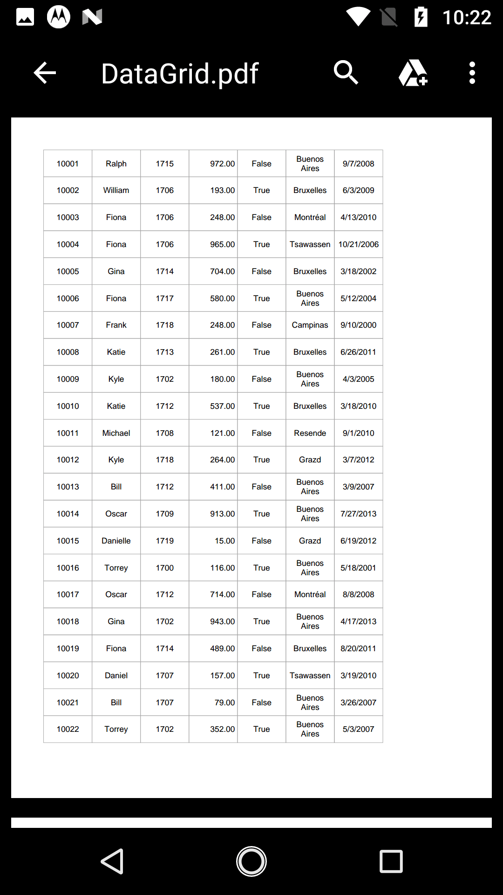

#### Exclude table summaries while exporting

By default, table summaries in the data grid will be exported to PDF. To export the SfDataGrid without table summaries, set the [DataGridPdfExportOption.ExportTableSummary](https://help.syncfusion.com/cr/xamarin/Syncfusion.SfDataGrid.XForms.Exporting.DataGridPdfExportOption.html#Syncfusion_SfDataGrid_XForms_Exporting_DataGridPdfExportOption_ExportTableSummary) property to `false`.



private void PDFExport_Clicked(object sender, EventArgs e)
{
    DataGridPdfExportingController pdfExport = new DataGridPdfExportingController();
    MemoryStream stream = new MemoryStream();
    DataGridPdfExportOption option = new DataGridPdfExportOption();
    option.ExportTableSummary = false;
    var exportToPdf = pdfExport.ExportToPdf(this.dataGrid, option);
    exportToPdf.Save(stream);
    exportToPdf.Close(true);
    Xamarin.Forms.DependencyService.Get<ISave>().Save("DataGrid.pdf", "application/pdf", stream);
}



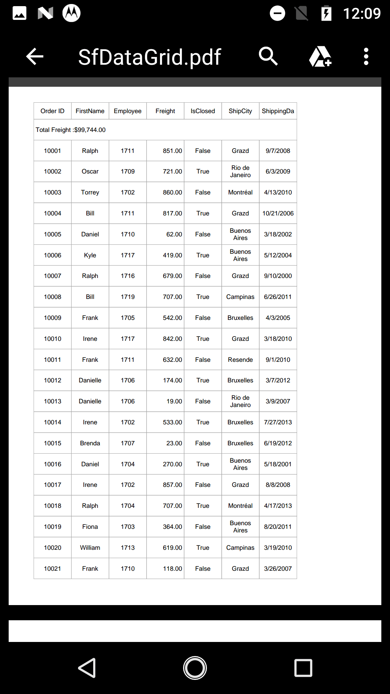

### Export all columns in one page

Gets or sets a value indicating whether all the columns should be fitted on a page or not. To export all the columns in one page, set the[DataGridPdfExportOption.FitAllColumnsInOnePage](https://help.syncfusion.com/cr/xamarin/Syncfusion.SfDataGrid.XForms.Exporting.DataGridPdfExportOption.html#Syncfusion_SfDataGrid_XForms_Exporting_DataGridPdfExportOption_FitAllColumnsInOnePage) property to `true`.

### Exporting the grid from a specified page and point

The SfDataGrid allows exporting the data to a particular staring position on a particular PDF page using the following options:

* StartPageIndex
* StartPoint 

#### StartPageIndex 

The SfDataGrid allows exporting the data to a particular page in the PDF document by using the [DataGridPdfExportOption.StartPageIndex](https://help.syncfusion.com/cr/xamarin/Syncfusion.SfDataGrid.XForms.Exporting.DataGridPdfExportOption.html#Syncfusion_SfDataGrid_XForms_Exporting_DataGridPdfExportOption_StartPageIndex) property.



private void PDFExport_Clicked(object sender, EventArgs e)
{
    DataGridPdfExportingController pdfExport = new DataGridPdfExportingController();
    MemoryStream stream = new MemoryStream();
    PdfDocument pdfDocument = new PdfDocument();
    pdfDocument.Pages.Add();
    pdfDocument.Pages.Add();
    pdfDocument.Pages.Add();
    DataGridPdfExportOption option = new DataGridPdfExportOption();
    option.PdfDocument = pdfDocument;
    option.StartPageIndex = 1;
    var exportToPdf = pdfExport.ExportToPdf(this.dataGrid, option);
    exportToPdf.Save(stream);
    exportToPdf.Close(true);
    Xamarin.Forms.DependencyService.Get<ISave>().Save("DataGrid.pdf", "application/pdf", stream);
}



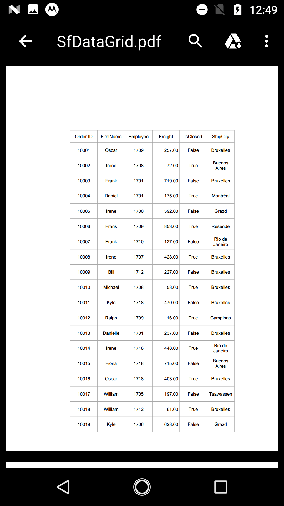

#### StartPoint

The SfDataGrid allows exporting the data to a particular x,y starting point in the PDF page by using the [DataGridPdfExportOption.StartPoint](https://help.syncfusion.com/cr/xamarin/Syncfusion.SfDataGrid.XForms.Exporting.DataGridPdfExportOption.html#Syncfusion_SfDataGrid_XForms_Exporting_DataGridPdfExportOption_StartPoint) property.



private void PDFExport_Clicked(object sender, EventArgs e)
{
    DataGridPdfExportingController pdfExport = new DataGridPdfExportingController();
    MemoryStream stream = new MemoryStream();
    DataGridPdfExportOption option = new DataGridPdfExportOption();
    option.StartPoint = new PointF(0, 500);
    var exportToPdf = pdfExport.ExportToPdf(this.dataGrid, option);
    exportToPdf.Save(stream);
    exportToPdf.Close(true);
    Xamarin.Forms.DependencyService.Get<ISave>().Save("DataGrid1.pdf", "application/pdf", stream);
}



### Applying styles while exporting

The SfDataGrid allows exporting the data with the applied GridStyle by setting the [DataGridPdfExportOption.ApplyGridStyle](https://help.syncfusion.com/cr/xamarin/Syncfusion.SfDataGrid.XForms.Exporting.DataGridPdfExportOption.html#Syncfusion_SfDataGrid_XForms_Exporting_DataGridPdfExportOption_ApplyGridStyle) property to `true`. By default, data will be exported without the GridStyle.



private void PDFExport_Clicked(object sender, EventArgs e)
{
    DataGridPdfExportingController pdfExport = new DataGridPdfExportingController();
    MemoryStream stream = new MemoryStream();
    DataGridPdfExportOption option = new DataGridPdfExportOption();
    option.ApplyGridStyle = true;
    var exportToPdf = pdfExport.ExportToPdf(this.dataGrid, option);
    exportToPdf.Save(stream);
    exportToPdf.Close(true);
    Xamarin.Forms.DependencyService.Get<ISave>().Save("DataGrid1.pdf", "application/pdf", stream);
}



You can also customize the following styles while exporting to PDF:

* BottomTableSummaryStyle 
* GroupCaptionStyle
* HeaderStyle
* RecordStyle 
* TopTableSummaryStyle

#### BottomTableSummaryStyle

The SfDataGrid supports exporting the bottom table summary with custom style by using the [DataGridPdfExportOption.BottomTableSummaryStyle](https://help.syncfusion.com/cr/xamarin/Syncfusion.SfDataGrid.XForms.Exporting.DataGridPdfExportOption.html#Syncfusion_SfDataGrid_XForms_Exporting_DataGridPdfExportOption_BottomTableSummaryStyle) property.



DataGridPdfExportOption option = new DataGridPdfExportOption();
option.BottomTableSummaryStyle = new PdfGridCellStyle()
{
    BackgroundBrush = PdfBrushes.Gray,
    Borders = new PdfBorders() { Bottom = PdfPens.Aqua, Left = PdfPens.AliceBlue, Right = PdfPens.Red, Top = PdfPens.RoyalBlue },
    CellPadding = new PdfPaddings(2, 2, 2, 2),
    TextBrush = PdfBrushes.Yellow,
    TextPen = PdfPens.Green,
    StringFormat = new PdfStringFormat() { Alignment = PdfTextAlignment.Right, CharacterSpacing = 3f, WordSpacing = 10f }
};



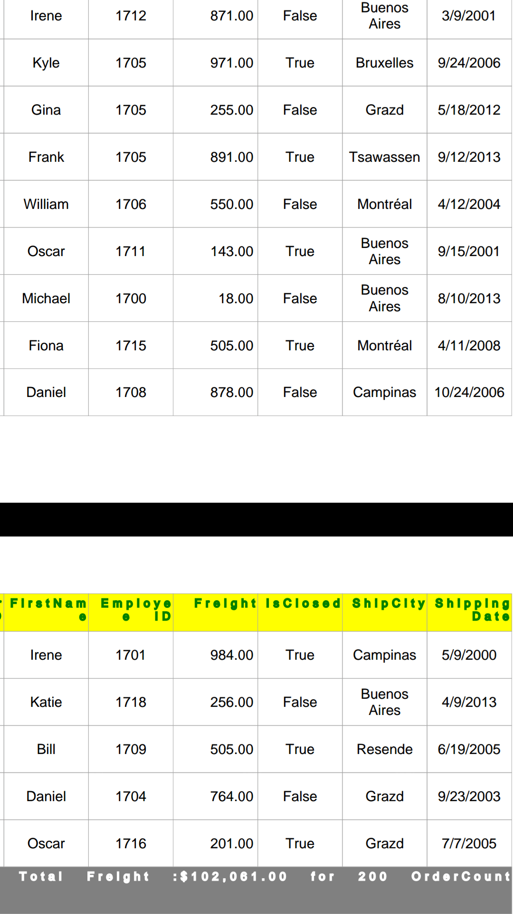

#### GroupCaptionStyle

The SfDataGrid supports exporting the group caption summaries with custom style by using the [DataGridPdfExportOption.GroupCaptionStyle](https://help.syncfusion.com/cr/xamarin/Syncfusion.SfDataGrid.XForms.Exporting.DataGridPdfExportOption.html#Syncfusion_SfDataGrid_XForms_Exporting_DataGridPdfExportOption_GroupCaptionStyle) property.



DataGridPdfExportOption option = new DataGridPdfExportOption();
option.GroupCaptionStyle = new PdfGridCellStyle
{
    BackgroundBrush = PdfBrushes.White,
    Borders = new PdfBorders() { Bottom = PdfPens.Aqua, Left = PdfPens.AliceBlue, Right = PdfPens.Red, Top = PdfPens.RoyalBlue },
    CellPadding = new PdfPaddings(3, 3, 3, 3),
    TextBrush = PdfBrushes.Red,
    TextPen = PdfPens.Green,
    StringFormat = new PdfStringFormat() { Alignment = PdfTextAlignment.Right, CharacterSpacing = 3f, WordSpacing = 10f }
};



#### HeaderStyle

The SfDataGrid allows exporting the column headers with custom style by using the [DataGridPdfExportOption.HeaderStyle](https://help.syncfusion.com/cr/xamarin/Syncfusion.SfDataGrid.XForms.Exporting.DataGridPdfExportOption.html#Syncfusion_SfDataGrid_XForms_Exporting_DataGridPdfExportOption_HeaderStyle) property.



DataGridPdfExportOption option = new DataGridPdfExportOption();
option.HeaderStyle = new PdfGridCellStyle()
{
    BackgroundBrush = PdfBrushes.Yellow,
    Borders = new PdfBorders() { Bottom = PdfPens.Aqua, Left = PdfPens.AliceBlue, Right = PdfPens.Red, Top = PdfPens.RoyalBlue },
    CellPadding = new PdfPaddings(2, 2, 2, 2),
    TextBrush = PdfBrushes.Red,
    TextPen = PdfPens.Green,
    StringFormat = new PdfStringFormat() { Alignment = PdfTextAlignment.Right, CharacterSpacing = 3f, WordSpacing = 10f }
};



#### RecordStyle 

The SfDataGrid allows exporting the records with custom style by using the [DataGridPdfExportOption.RecordStyle](https://help.syncfusion.com/cr/xamarin/Syncfusion.SfDataGrid.XForms.Exporting.DataGridPdfExportOption.html#Syncfusion_SfDataGrid_XForms_Exporting_DataGridPdfExportOption_RecordStyle) property.



DataGridPdfExportOption option = new DataGridPdfExportOption();
option.RecordStyle = new PdfGridCellStyle()
{
    BackgroundBrush = PdfBrushes.Red,
    Borders = new PdfBorders() { Bottom = PdfPens.Aqua, Left = PdfPens.AliceBlue, Right = PdfPens.Red, Top = PdfPens.RoyalBlue },
    CellPadding = new PdfPaddings(2, 2, 2, 2),
    TextBrush = PdfBrushes.White,
    TextPen = PdfPens.Green,
    StringFormat = new PdfStringFormat() { Alignment = PdfTextAlignment.Right, CharacterSpacing = 3f, WordSpacing = 10f }
};



#### TopTableSummaryStyle

The SfDataGrid supports exporting the top table summary with custom style by using the [DataGridPdfExportOption.TopTableSummaryStyle](https://help.syncfusion.com/cr/xamarin/Syncfusion.SfDataGrid.XForms.Exporting.DataGridPdfExportOption.html#Syncfusion_SfDataGrid_XForms_Exporting_DataGridPdfExportOption_TopTableSummaryStyle) property.



DataGridPdfExportOption option = new DataGridPdfExportOption();
option.TopTableSummaryStyle = new PdfGridCellStyle()
{
    BackgroundBrush = PdfBrushes.Gray,
    Borders = new PdfBorders() { Bottom = PdfPens.Aqua, Left = PdfPens.AliceBlue, Right = PdfPens.Red, Top = PdfPens.RoyalBlue },
    CellPadding = new PdfPaddings(2, 2, 2, 2),
    TextBrush = PdfBrushes.Yellow,
    TextPen = PdfPens.Green,
    StringFormat = new PdfStringFormat() { Alignment = PdfTextAlignment.Right, CharacterSpacing = 3f, WordSpacing = 10f }
};



### GroupSummaryStyle 

`SfDataGrid` supports exporting the `GroupSummary` rows with custom style by using the [DataGridPdfExportOption.GroupSummaryStyle](https://help.syncfusion.com/cr/xamarin/Syncfusion.SfDataGrid.XForms.Exporting.DataGridPdfExportOption.html#Syncfusion_SfDataGrid_XForms_Exporting_DataGridPdfExportOption_GroupSummaryStyle) property.



DataGridPdfExportOption pdfOption = new DataGridPdfExportOption();
pdfOption.GroupSummaryStyle = new PdfGridCellStyle()
{
BackgroundBrush = PdfBrushes.Green,
TextBrush = PdfBrushes.Yellow,
TextPen = PdfPens.White,
StringFormat = new PdfStringFormat() { Alignment = PdfTextAlignment.Right, CharacterSpacing = 3f, WordSpacing = 10f }
};



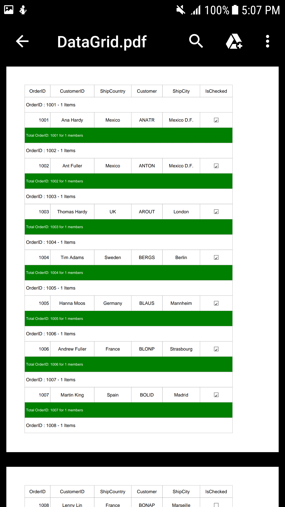

### Customizing borders

The SfDataGrid allows customizing the grid borders as follows using the [DataGridPdfExportOption.GridLineType] (https://help.syncfusion.com/cr/xamarin/Syncfusion.SfDataGrid.XForms.Exporting.DataGridPdfExportOption.html#Syncfusion_SfDataGrid_XForms_Exporting_DataGridPdfExportOption_GridLineType)        property:

* Both
* Horizontal
* Vertical
* None

#### Both

Set the [DataGridPdfExportOption.GridLineType](https://help.syncfusion.com/cr/xamarin/Syncfusion.SfDataGrid.XForms.Exporting.DataGridPdfExportOption.html#Syncfusion_SfDataGrid_XForms_Exporting_DataGridPdfExportOption_GridLineType) as `GridLineType.Both` to export the data grid with both horizontal and vertical borders.



DataGridPdfExportOption option = new DataGridPdfExportOption();
option.GridLineType = GridLineType.Both;



#### Horizontal

Set the [DataGridPdfExportOption.GridLineType](https://help.syncfusion.com/cr/xamarin/Syncfusion.SfDataGrid.XForms.Exporting.DataGridPdfExportOption.html#Syncfusion_SfDataGrid_XForms_Exporting_DataGridPdfExportOption_GridLineType) as `GridLineType.Horizontal` to export the data grid with horizontal border.



DataGridPdfExportOption option = new DataGridPdfExportOption();
option.GridLineType = GridLineType.Horizontal;



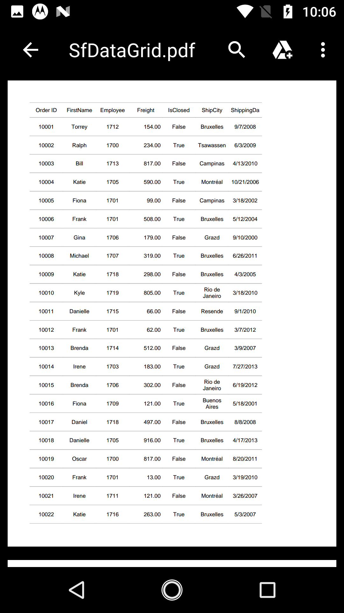

#### Vertical

Set the [DataGridPdfExportOption.GridLineType](https://help.syncfusion.com/cr/xamarin/Syncfusion.SfDataGrid.XForms.Exporting.DataGridPdfExportOption.html#Syncfusion_SfDataGrid_XForms_Exporting_DataGridPdfExportOption_GridLineType) to `GridLineType.Vertical` to export the data grid with vertical border.



DataGridPdfExportOption option = new DataGridPdfExportOption();
option.GridLineType = GridLineType.Vertical;



#### None

Set the [DataGridPdfExportOption.GridLineType](https://help.syncfusion.com/cr/xamarin/Syncfusion.SfDataGrid.XForms.Exporting.DataGridPdfExportOption.html#Syncfusion_SfDataGrid_XForms_Exporting_DataGridPdfExportOption_GridLineType) to `GridLineType.None` to export the data grid without borders.



DataGridPdfExportOption option = new DataGridPdfExportOption();
option.GridLineType = GridLineType.None;



## Export paging

When exporting to PDF in the SfDataGrid using SfDataPager, by default it will export only the current page. You can export all the pages by setting the [DataGridPdfExportOption.ExportAllPages](https://help.syncfusion.com/cr/xamarin/Syncfusion.SfDataGrid.XForms.Exporting.DataGridPdfExportOption.html#Syncfusion_SfDataGrid_XForms_Exporting_DataGridPdfExportOption_ExportAllPages) to `true`. 



DataGridPdfExportOption option = new DataGridPdfExportOption();
option.ExportAllPages = true;



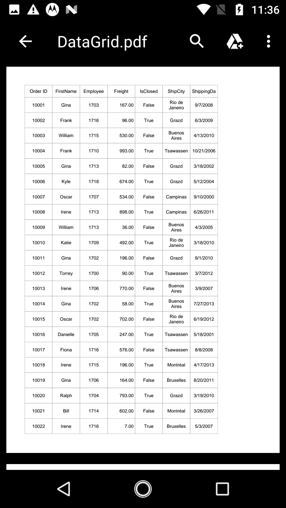

* ExportAllPages = true;

## Setting header and footer

The SfDataGrid provides a way to display additional content at the top (header) or bottom (footer) of the page when exporting to PDF by handling the `DataGridPdfExportingController.HeaderAndFooterExporting` event.

You can insert string in the header and footer in PdfHeaderFooterEventHandler. Setting `PdfPageTemplateElement` as `PdfHeaderFooterEventArgs.PdfDocumentTemplate.Top` loads the content at the top of the page. Setting the `PdfPageTemplateElement` as `PdfHeaderFooterEventArgs.PdfDocumentTemplate.Bottom` loads the content at the bottom of the page.



DataGridPdfExportingController pdfExport = new DataGridPdfExportingController();
pdfExport.HeaderAndFooterExporting += PdfExport_HeaderAndFooterExporting;

private void PdfExport_HeaderAndFooterExporting(object sender, PdfHeaderFooterEventArgs e)
{
    PdfFont font = new PdfStandardFont(PdfFontFamily.TimesRoman, 20f, PdfFontStyle.Bold);
    var width = e.PdfPage.GetClientSize().Width;
    PdfPageTemplateElement header = new PdfPageTemplateElement(width, 38);
    header.Graphics.DrawString("Order Details", font, PdfPens.Black, 70, 3);
    e.PdfDocumentTemplate.Top = header;

    PdfPageTemplateElement footer = new PdfPageTemplateElement(width, 38);
    footer.Graphics.DrawString("Order Details", font, PdfPens.Black, 70, 3);
    e.PdfDocumentTemplate.Bottom = footer;
}



## Change PDF page orientation

You can change the page orientation of the PDF document when exporting. Default page orientation is portrait.

To change the page orientation, export PDF grid value by using the ExportToPdfGrid method. Then, draw that PDF grid into a PDF document by changing the `PageSettings.Orientation` property of PDF document.



DataGridPdfExportOption option = new DataGridPdfExportOption();
PdfDocument pdfDocument = new PdfDocument();
pdfDocument.PageSettings.Orientation = PdfPageOrientation.Landscape;
//pdfDocument.PageSettings.Orientation = PdfPageOrientation.Portrait;
option.PdfDocument = pdfDocument;



## Saving options

### Save directly as file

### Save directly as file

The following code snippet explains how to save the converted PDF document in our local device.



// Need to define the Interfaces in-order to use it in platform wise using Dependency Service
public interface ISave
{
    void Save(string filename, string contentType, MemoryStream stream);
}
public interface ISaveWindows
{
    Task Save(string filename, string contentType, MemoryStream stream);
}

// In Android renderer project
public class SaveAndroid : ISave
{
    public void Save(string filename, string contentType, MemoryStream stream)
    {
        string exception = string.Empty;
        string root = null;
        if (Android.OS.Environment.IsExternalStorageEmulated)
        {
            root = Android.OS.Environment.ExternalStorageDirectory.ToString();
        }
        else
            root = Environment.GetFolderPath(Environment.SpecialFolder.MyDocuments);

        Java.IO.File myDir = new Java.IO.File(root + "/Syncfusion");
        myDir.Mkdir();
        Java.IO.File file = new Java.IO.File(myDir, filename);
        
        if (file.Exists()) file.Delete();
        
        try
        {
            FileOutputStream outs = new FileOutputStream(file);
            outs.Write(stream.ToArray());
            outs.Flush();
            outs.Close();
        }
        catch (Exception e)
        {
            exception = e.ToString();
        }
        if (file.Exists() && contentType != "application/html")
        {
            Android.Net.Uri path = Android.Net.Uri.FromFile(file);
            string extension = Android.Webkit.MimeTypeMap.GetFileExtensionFromUrl(Android.Net.Uri.FromFile(file).ToString());
            string mimeType = Android.Webkit.MimeTypeMap.Singleton.GetMimeTypeFromExtension(extension);
            Intent intent = new Intent(Intent.ActionView);
            intent.SetDataAndType(path, mimeType);
            Forms.Context.StartActivity(Intent.CreateChooser(intent, "Choose App"));
        }
    }
}

// In iOS renderer project
public class SaveIOS : ISave
{
    void ISave.Save(string filename, string contentType, MemoryStream stream)
    {
        string exception = string.Empty;
        string path = Environment.GetFolderPath(Environment.SpecialFolder.Personal);
        string filePath = Path.Combine(path, filename);
        try
        {
            FileStream fileStream = File.Open(filePath, FileMode.Create);
            stream.Position = 0;
            stream.CopyTo(fileStream);
            fileStream.Flush();
            fileStream.Close();
        }
        catch (Exception e)
        {
            exception = e.ToString();
        }
        
        if (contentType == "application/html" || exception != string.Empty)
            return;
        
        UIViewController currentController = UIApplication.SharedApplication.KeyWindow.RootViewController;
        while (currentController.PresentedViewController != null)
            currentController = currentController.PresentedViewController;
        UIView currentView = currentController.View;

        QLPreviewController previewController = new QLPreviewController();
        QLPreviewItem item = new QLPreviewItemBundle(filename, filePath);
        previewController.DataSource = new PreviewControllerDS(item);

        currentController.PresentViewController((UIViewController)previewController, true, (Action)null);
    }
}

public class PreviewControllerDS : QLPreviewControllerDataSource
{
    private QLPreviewItem _item;

    public PreviewControllerDS(QLPreviewItem item)
    {
        _item = item;
    }

    public override nint PreviewItemCount (QLPreviewController controller)
    {
        return (nint)1;
    }

    public override IQLPreviewItem GetPreviewItem (QLPreviewController controller, nint index)
    {
        return _item;
    }
}

public class QLPreviewItemFileSystem : QLPreviewItem
{
    string _fileName, _filePath;

    public QLPreviewItemFileSystem(string fileName, string filePath)
    {
        _fileName = fileName;
        _filePath = filePath;
    }

    public override string ItemTitle
    {
        get
        {
            return _fileName;
        }
    }
    public override NSUrl ItemUrl
    {
        get
        {
            return NSUrl.FromFilename(_filePath);
        }
    }
}

public class QLPreviewItemBundle : QLPreviewItem
{
    string _fileName, _filePath;
    public QLPreviewItemBundle(string fileName, string filePath)
    {
        _fileName = fileName;
        _filePath = filePath;
    }

    public override string ItemTitle
    {
        get
        {
            return _fileName;
        }
    }
    public override NSUrl ItemUrl
    {
        get
        {
            var documents = NSBundle.MainBundle.BundlePath;
            var lib = Path.Combine(documents, _filePath);
            var url = NSUrl.FromFilename(lib);
            return url;
        }
    }
}

// In UWP renderer project
public class SaveWindows : ISaveWindows
{
    public async Task Save(string filename, string contentType, MemoryStream stream)
    {
        if (Device.Idiom != TargetIdiom.Desktop)
        {
            StorageFolder local = Windows.Storage.ApplicationData.Current.LocalFolder;
            StorageFile outFile = await local.CreateFileAsync(filename, CreationCollisionOption.ReplaceExisting);
            using (Stream outStream = await outFile.OpenStreamForWriteAsync())
            {
                outStream.Write(stream.ToArray(), 0, (int)stream.Length);
            }
            if (contentType != "application/html")
                await Windows.System.Launcher.LaunchFileAsync(outFile);
        }
        else
        {
            StorageFile storageFile = null;
            FileSavePicker savePicker = new FileSavePicker();
            savePicker.SuggestedStartLocation = PickerLocationId.Desktop;
            savePicker.SuggestedFileName = filename;
            switch (contentType)
            {
                case "application/vnd.openxmlformats-officedocument.presentationml.presentation":
                    savePicker.FileTypeChoices.Add("PowerPoint Presentation", new List<string>() { ".pptx", });
                    break;

                case "application/msexcel":
                    savePicker.FileTypeChoices.Add("Excel Files", new List<string>() { ".xlsx", });
                    break;

                case "application/msword":
                    savePicker.FileTypeChoices.Add("Word Document", new List<string>() { ".docx" });
                    break;

                case "application/pdf":
                    savePicker.FileTypeChoices.Add("Adobe PDF Document", new List<string>() { ".pdf" });
                    break;
                
                case "application/html":
                    savePicker.FileTypeChoices.Add("HTML Files", new List<string>() { ".html" });
                    break;
            }
            storageFile = await savePicker.PickSaveFileAsync();

            using (Stream outStream = await storageFile.OpenStreamForWriteAsync())
            {
                outStream.Write(stream.ToArray(), 0, (int)stream.Length);
                outStream.Flush();
                outStream.Dispose();
            }
            stream.Flush();
            stream.Dispose();
            await Windows.System.Launcher.LaunchFileAsync(storageFile);
        }
    }
}



### Save as stream

You can also save the manipulated PDF document to stream by using overloads of the Save method.



//Load an existing PDF document
PdfLoadedDocument loadedDocument = new PdfLoadedDocument("Input.pdf");
//To-Do some manipulation
//To-Do some manipulation
//Creates an instance of memory stream
MemoryStream stream = new MemoryStream();
//Save the document stream
loadedDocument.Save(stream) ;



## Row height and column width customization

### ExportColumnWidth

By default, the data grid columns will be exported to PDF with `DataGridPdfExportOption.DefaultColumnWidth` value. To export the data grid to PDF with exact column widths, set the [DataGridPdfExportOption.ExportColumnWidth](https://help.syncfusion.com/cr/xamarin/Syncfusion.SfDataGrid.XForms.Exporting.DataGridPdfExportOption.html#Syncfusion_SfDataGrid_XForms_Exporting_DataGridPdfExportOption_ExportColumnWidth) to `true`.



DataGridPdfExportOption option = new DataGridPdfExportOption();
option.ExportColumnWidth = true;



### ExportRowHeight

By default, the data grid rows will be exported to PDF with `DataGridPdfExportOption.DefaultRowHeight` value. To export the data grid to PDF with exact row heights, set the [DataGridPdfExportOption.ExportRowHeight](https://help.syncfusion.com/cr/xamarin/Syncfusion.SfDataGrid.XForms.Exporting.DataGridPdfExportOption.html#Syncfusion_SfDataGrid_XForms_Exporting_DataGridPdfExportOption_ExportRowHeight) to `true`. 



DataGridPdfExportOption option = new DataGridPdfExportOption();
option.ExportRowHeight = true;



### DefaultColumnWidth

The SfDataGrid allows customizing column width in the PDF document using the [DataGridPdfExportOption.DefaultColumnWidth](https://help.syncfusion.com/cr/xamarin/Syncfusion.SfDataGrid.XForms.Exporting.DataGridPdfExportOption.html#Syncfusion_SfDataGrid_XForms_Exporting_DataGridPdfExportOption_DefaultColumnWidth) property. The `DefaultColumnWidth` value will be applied to all the columns in the document.



DataGridPdfExportOption option = new DataGridPdfExportOption();
option.DefaultColumnWidth = 100;



### DefaultRowHeight

The SfDataGrid allows customizing row height in the PDF document using the [DataGridPdfExportOption.DefaultRowHeight](https://help.syncfusion.com/cr/xamarin/Syncfusion.SfDataGrid.XForms.Exporting.DataGridPdfExportOption.html#Syncfusion_SfDataGrid_XForms_Exporting_DataGridPdfExportOption_DefaultRowHeight) property. The `DefaultRowHeight` value will be applied to all the rows in the document.



DataGridPdfExportOption option = new DataGridPdfExportOption();
option.DefaultRowHeight = 50;



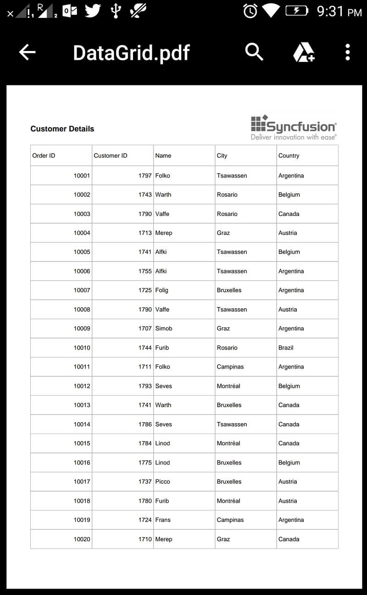

## Events

## Exporting customization

### Styling cells based on CellType in PDF

The SfDataGrid provides you the following events for exporting:

* [RowExporting](https://help.syncfusion.com/cr/xamarin/Syncfusion.SfDataGrid.XForms.Exporting.DataGridPdfExportingController.html): Raised when exporting a row at the execution time.
* [CellExporting](https://help.syncfusion.com/cr/xamarin/Syncfusion.SfDataGrid.XForms.Exporting.DataGridPdfExportingController.html): Raised when exporting a cell at the execution time.

### RowExporting

The [DataGridRowPdfExportingEventHandler](http://help.syncfusion.com/cr/xamarin/sfgridconverter/Syncfusion.SfDataGrid.XForms.Exporting.DataGridRowPdfExportingEventhandler.html) delegate allows customizing the styles of record rows and group caption rows. The `RowExporting` event is triggered with [DataGridRowPdfExportingEventArgs](http://help.syncfusion.com/cr/xamarin/sfgridconverter/Syncfusion.SfDataGrid.XForms.Exporting.DataGridRowPdfExportingEventArgs.html) that contains the following properties:

* [PdfGrid](https://help.syncfusion.com/cr/xamarin/Syncfusion.SfDataGrid.XForms.Exporting.DataGridRowPdfExportingEventArgs.html#Syncfusion_SfDataGrid_XForms_Exporting_DataGridRowPdfExportingEventArgs__ctor_Syncfusion_Data_RecordEntry_Syncfusion_Pdf_Grid_PdfGridRow_Syncfusion_Pdf_Grid_PdfGrid_Syncfusion_SfDataGrid_XForms_Exporting_ExportRowType_Syncfusion_Pdf_Grid_PdfGridCellStyle_System_Object_): Customizes the pdfGrid properties such as `Background`, `CellPadding`, `CellSpacing`, and so on.
* [PdfRow](https://help.syncfusion.com/cr/xamarin/Syncfusion.SfDataGrid.XForms.Exporting.DataGridRowPdfExportingEventArgs.html#Syncfusion_SfDataGrid_XForms_Exporting_DataGridRowPdfExportingEventArgs_PdfRow): Specifies the `PDFGridRow` to be exported. Customizes the properties of a particular row. 
* [Record](https://help.syncfusion.com/cr/xamarin/Syncfusion.SfDataGrid.XForms.Exporting.DataGridRowPdfExportingEventArgs.html#Syncfusion_SfDataGrid_XForms_Exporting_DataGridRowPdfExportingEventArgs_PdfRow): Gets the collection of exported underlying data objects.
* [RowType](https://help.syncfusion.com/cr/xamarin/Syncfusion.SfDataGrid.XForms.Exporting.DataGridRowPdfExportingEventArgs.html#Syncfusion_SfDataGrid_XForms_Exporting_DataGridRowPdfExportingEventArgs_RowType): Specifies the row type using `ExportRowType` enum. Checks the row type and applies different styles based on the row type.

You can use this event to customize the properties of the grid rows exported to PDF. The following code example illustrates how to change the background color of the record rows and caption summary rows when exporting.



//HandlingRowExportingEvent for exporting to PDF
DataGridPdfExportingController pdfExport = new DataGridPdfExportingController ();
pdfExport.RowExporting += pdfExport_RowExporting; 

void pdfExport_RowExporting (object sender, DataGridRowPdfExportingEventArgs e)
{
    if (e.RowType == ExportRowType.Record) {
        if ((e.Record.Data as OrderInfo).IsClosed)
            e.PdfRow.Style.BackgroundBrush = PdfBrushes.Yellow;
        else
        e.PdfRow.Style.BackgroundBrush = PdfBrushes.LightGreen;
    }

    // You can also set the desired background colors for the CaptionSummary row and GroupSummary row as shown below
    // if (e.RowType == ExportRowType.CaptionSummary) {
    //    e.PdfRow.Style.BackgroundBrush = PdfBrushes.LightGray;
    // }

    // if (e.RowType == ExportRowType.GroupSummary){
    //     e.PdfRow.Style.BackgroundBrush = PdfBrushes.Red;
    // }
} 



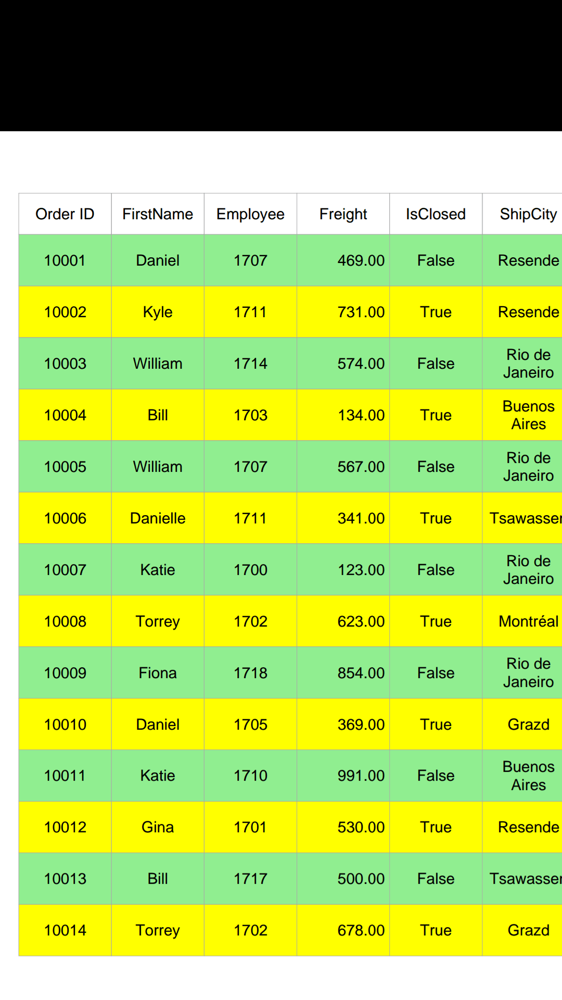

### CellExporting

The [DataGridCellPdfExportingEventHandler](http://help.syncfusion.com/cr/xamarin/Syncfusion.SfDataGrid.XForms.Exporting.DataGridCellPdfExportingEventhandler.html) delegate allows customizing the styles for the header cells, record cells, group caption cells, and group summary cells. The `CellExporting` event is triggered with [DataGridCellPdfExportingEventArgs](http://help.syncfusion.com/cr/xamarin/Syncfusion.SfDataGrid.XForms.Exporting.DataGridCellPdfExportingEventArgs.html) that contains the following properties:

The [DataGridCellPdfExportingEventHandler](http://help.syncfusion.com/cr/xamarin/sfgridconverter/Syncfusion.SfDataGrid.XForms.Exporting.DataGridCellPdfExportingEventhandler.html) delegate allows customizing the styles for header cells, record cells, and group caption cells. The `CellExporting` event is triggered with [DataGridCellPdfExportingEventArgs](http://help.syncfusion.com/cr/xamarin/sfgridconverter/Syncfusion.SfDataGrid.XForms.Exporting.DataGridCellPdfExportingEventArgs.html) that contains the following properties:

* [CellType](https://help.syncfusion.com/cr/xamarin/Syncfusion.SfDataGrid.XForms.Exporting.DataGridCellPdfExportingEventArgs.html#Syncfusion_SfDataGrid_XForms_Exporting_DataGridCellPdfExportingEventArgs_CellType): Specifies the cell type using `ExportCellType` enum. Checks the cell type and applies different cell styles based on the cell type.
* [CellValue](https://help.syncfusion.com/cr/xamarin/Syncfusion.SfDataGrid.XForms.Exporting.DataGridCellPdfExportingEventArgs.html#Syncfusion_SfDataGrid_XForms_Exporting_DataGridCellPdfExportingEventArgs_CellValue): Contains the exported actual value to format the PDF using the `Range` property.
* [ColumnName](https://help.syncfusion.com/cr/xamarin/Syncfusion.SfDataGrid.XForms.Exporting.DataGridCellPdfExportingEventArgs.html#Syncfusion_SfDataGrid_XForms_Exporting_DataGridCellPdfExportingEventArgs_CellValue ): Specifies the column name (MappingName) of the exporting cell. Applies formatting for a particular column by checking the `ColumnName`.
* [Handled](https://help.syncfusion.com/cr/xamarin/Syncfusion.SfDataGrid.XForms.Exporting.DataGridCellPdfExportingEventArgs.html#Syncfusion_SfDataGrid_XForms_Exporting_DataGridCellPdfExportingEventArgs_Handled): Determines whether the cell is exported to PDF or not.
* [PdfGrid](https://help.syncfusion.com/cr/xamarin/Syncfusion.SfDataGrid.XForms.Exporting.DataGridCellPdfExportingEventArgs.html#Syncfusion_SfDataGrid_XForms_Exporting_DataGridCellPdfExportingEventArgs_Handled): Specifies the `PDFGridCell` to be exported. Customizes Background, Foreground, Font, Alignment, etc., properties of a particular cell.
* [Record](https://help.syncfusion.com/cr/xamarin/Syncfusion.SfDataGrid.XForms.Exporting.DataGridCellPdfExportingEventArgs.html#Syncfusion_SfDataGrid_XForms_Exporting_DataGridCellPdfExportingEventArgs_Record): Gets the collection of exported underlying data objects.

You can use this event to customize the properties of the grid cells exported to PDF. The following code example illustrates how to customize the background color, foreground color, and cell value of the header cells, record cells, and caption summary cells when exporting.



//HandlingCellExportingEvent for exporting to PDF
DataGridPdfExportingController pdfExport = new DataGridPdfExportingController ();
pdfExport.CellExporting += pdfExport_CellExporting;  

void pdfExport_CellExporting(object sender, DataGridCellPdfExportingEventArgs e)
{
    if (e.CellType == ExportCellType.HeaderCell)
    {
        e.PdfGridCell.Style.BackgroundBrush = PdfBrushes.LightPink;
        e.PdfGridCell.Style.TextBrush = PdfBrushes.Blue;
    }

    if (e.CellType == ExportCellType.RecordCell)
    {
        e.PdfGridCell.Style.BackgroundBrush = PdfBrushes.LightGreen;
        e.PdfGridCell.Style.TextBrush = PdfBrushes.Red;
    }

    // You can also set the desired values for the CaptionSummary rows and GroupSummary rows as shown below
    // if (e.CellType == ExportCellType.GroupCaptionCell)
    // {
    //    e.PdfGridCell.Style.BackgroundBrush = PdfBrushes.Gray;
    //    e.PdfGridCell.Style.TextBrush = PdfBrushes.White;
    // }

    // if (e.CellType == ExportCellType.GroupSummaryCell)
    // {
    //    e.PdfGridCell.Style.BackgroundBrush = PdfBrushes.Blue;
    //    e.PdfGridCell.Style.TextBrush = PdfBrushes.Orange;
    // }
}



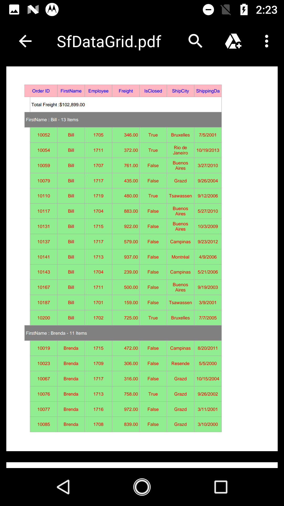

## Exporting Unbound rows

By default the unbound rows will not be exported to pdf document. However, You can export the unbound rows to PDF by setting the [DataGridPdfExportOption.ExportUnboundRows](https://help.syncfusion.com/cr/xamarin/Syncfusion.SfDataGrid.XForms.Exporting.DataGridPdfExportOption.html#Syncfusion_SfDataGrid_XForms_Exporting_DataGridPdfExportOption_ExportUnboundRows) property as `true`.



DataGridPdfExportOption option = new DataGridPdfExportOption();
option.ExportUnboundRows = true;



### Exporting unbound columns

The `SfDataGrid.GridUnboundColumns` will be exported as [SfDataGrid.GridTextColumns](http://help.syncfusion.com/cr/xamarin/sfdatagrid/Syncfusion.SfDataGrid.XForms.GridTextColumn.html) without any specific code. You can customize the `SfDataGrid.GridUnboundColumns` as `SfDataGrid.GridTextColumns` by using the `CellExporting` and `RowExporting` events.



<sfgrid:GridUnboundColumn Expression="OrderID * 12"
                          HeaderFontAttribute="Bold"
                          HeaderText="Unbound"
                          HeaderTextAlignment="Start"
                          MappingName="Unbound"
                          Padding="5, 0, 0, 0"
                          TextAlignment="Start">
</sfgrid:GridUnboundColumn>



The following screenshot shows that the unbound column is exported to PDF document with text columns.

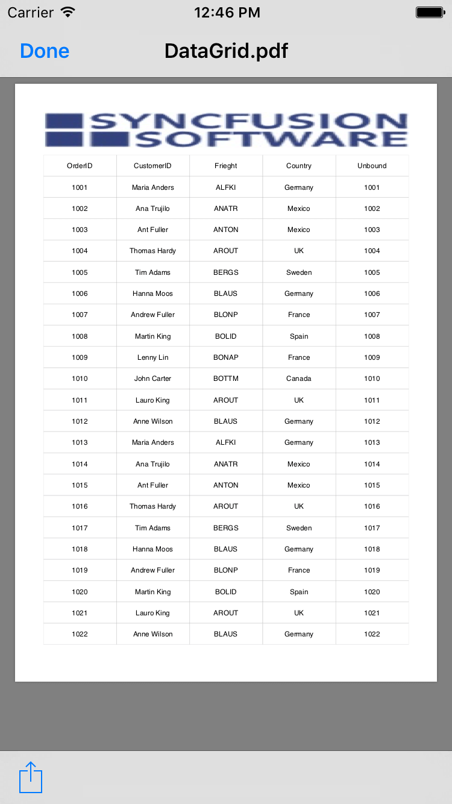

### ExportGroupSummary

By default, the `GroupSummary` rows in the data grid will be exported to PDF. To export the `SfDataGrid` without group summaries, set the [DataGridPdfExportingOption.ExportGroupSummary](https://help.syncfusion.com/cr/xamarin/Syncfusion.SfDataGrid.XForms.Exporting.DataGridPdfExportOption.html#Syncfusion_SfDataGrid_XForms_Exporting_DataGridPdfExportOption_ExportGroupSummary) property to `false`.



DataGridPdfExportOption option = new DataGridPdfExportOption();
// Set false here to export the DataGrid without GroupSummary rows. The default value is true.
// option.ExportGroupSummary = false;



### Embedding fonts in PDF file

By default, some fonts (such as Unicode font) are not supported in PDF. In this case, embed the font in the PDF document with the help of PdfTrueTypeFont. 



Stream fontStream = typeof(App).GetTypeInfo().Assembly.GetManifestResourceStream("SfDataGridSample.Pacifico.ttf");
private void PdfExport_CellExporting(object sender, DataGridCellPdfExportingEventArgs e)
{
    if (e.CellValue != null)
    {
        PdfFont font = e.PdfGridCell.Style.Font;
        if (font != null)
        {
            PdfTrueTypeFont unicodeFont = new PdfTrueTypeFont(fontStream, font.Size, font.Style);
            e.PdfGridCell.Style.Font = unicodeFont;
        }
    }
}



## Cell customization in PDF while exporting

### Customize cell values while exporting

You can customize the cell values when exporting to PDF by handling the `CellExporting` event.



DataGridPdfExportingController pdfExport = new DataGridPdfExportingController();
pdfExport.CellExporting += PdfExport_CellExporting;
private void PdfExport_CellExporting(object sender, DataGridCellPdfExportingEventArgs e)
{
    if (e.CellType == ExportCellType.RecordCell && e.ColumnName == "IsClosed")
    {
        if ((bool)e.CellValue)
            e.CellValue = "Y";
        else
            e.CellValue = "N";
    }
}



In the following screenshot, IsClosed column value has been changed based on the condition.

### Changing row style in PDF based on data

You can customize the row style based on the row data when exporting to PDF by handling the `RowExporting` event.



DataGridPdfExportingController pdfExport = new DataGridPdfExportingController();
pdfExport.RowExporting += PdfExport_RowExporting;
private void PdfExport_RowExporting(object sender, DataGridRowPdfExportingEventArgs e)
{
    if (!(e.Record.Data is OrderInfo))
        return;

    if (e.RowType == ExportRowType.Record)
    {
        if ((e.Record.Data as OrderInfo).IsClosed)
            e.PdfRow.Style.BackgroundBrush = PdfBrushes.Yellow;
        else
            e.PdfRow.Style.BackgroundBrush = PdfBrushes.LightGreen;
    }
}



### Customize the cells based on column name

You can customize the column style based on the row data when exporting to PDF by handling the `CellExporting` event.



DataGridPdfExportingController pdfExport = new DataGridPdfExportingController();
pdfExport.CellExporting += PdfExport_CellExporting;
private void PdfExport_CellExporting(object sender, DataGridCellPdfExportingEventArgs e)
{
    if (e.CellType == ExportCellType.RecordCell && e.ColumnName == "FirstName")
    {
        e.PdfGridCell.Style.TextBrush = PdfBrushes.Red;
    }
}



### Exporting middle Eastern languages (Arabic and Hebrew) from SfDataGrid to PDF

By default, [Middle Eastern languages](https://en.wikipedia.org/wiki/Middle_East) (Arabic and Hebrew) in the SfDataGrid are exported as left to right in PDF. You can export them as displayed (export from right to left) by enabling the `RightToLeft` property in PdfStringFormat class and apply the format to the PdfGridCell by using `CellsExportingEventHandler`.



PdfExportingOptions options = new PdfExportingOptions();
options.CellsExportingEventHandler = CellsExportingEventHandler;
var document = dataGrid.ExportToPdf(options);
document.Save("Sample.pdf");

private void CellsExportingEventHandler(object sender, GridCellPdfExportingEventArgs e)
{    

    if (e.CellType != ExportCellType.RecordCell)
        return;

    PdfStringFormat format = new PdfStringFormat();

    //format the string from right to left.
    format.RightToLeft = true;
    e.PdfGridCell.StringFormat = format;
}



### Exporting images to PDF document

By default, images loaded in the GridTemplateColumn will not be exported to PDF. You can export it by handling the CellExporting event. In `DataGridCellPdfExportingEventHandler`, the required image is loaded in the PdfGridCell.



private void PdfExport_CellExporting(object sender, DataGridCellPdfExportingEventArgs e)
{
    if (e.CellType == ExportCellType.RecordCell && e.ColumnName == "IsClosed")
    {
        var style = new PdfGridCellStyle();
        PdfPen normalBorder = new PdfPen(PdfBrushes.DarkGray, 0.2f);
        Xamarin.Forms.Image trueImage = new Xamarin.Forms.Image();
        Xamarin.Forms.Image falseImage = new Xamarin.Forms.Image();

        if ((bool)e.CellValue)
            trueImage.Source = ImageSource.FromResource("SfDataGridSample.True.jpg");
        else
            falseImage.Source = ImageSource.FromResource("SfDataGridSample.False.jpg");

        Assembly assembly = null;
        assembly = e.Record.Data.GetType().GetTypeInfo().Assembly;
        var streamImageSource = trueImage.Source as StreamImageSource;
        if (streamImageSource != null)
        {
            var imageStream = assembly.GetManifestResourceStream(ExportingHelper.GetImagePath(streamImageSource));
            if (imageStream != null)
            {
                PdfImage pdfImage = PdfImage.FromStream(imageStream);
                style.BackgroundImage = pdfImage;
                e.PdfGridCell.ImagePosition = PdfGridImagePosition.Fit;
                e.PdfGridCell.Style = style;
                imageStream.Flush();
                e.CellValue = null;
            }
        }
    }
}



## Exporting the selected rows of SfDataGrid

SfDataGrid allows you to export only the currently selected rows in the grid to the document using the [DataGridPdfExportingController.ExportToPdf](https://help.syncfusion.com/cr/xamarin/Syncfusion.SfDataGrid.XForms.Exporting.DataGridPdfExportingController.html#Syncfusion_SfDataGrid_XForms_Exporting_DataGridPdfExportingController_ExportToPdf_Syncfusion_SfDataGrid_XForms_SfDataGrid_) method by passing the instance of the SfDataGrid and [SfDataGrid.SelectedItems](https://help.syncfusion.com/cr/xamarin/Syncfusion.SfDataGrid.XForms.SfDataGrid.html#Syncfusion_SfDataGrid_XForms_SfDataGrid_SelectedItems) collection as an argument.

Refer the below code to export the selected rows alone to the PDF document.



      private void ExportToPDF(object sender, EventArgs e)
        {
            DataGridPdfExportingController pdfExport = new DataGridPdfExportingController();
            MemoryStream stream = new MemoryStream();
            ObservableCollection<object> selectedItems = dataGrid.SelectedItems;
            var doc = pdfExport.ExportToPdf(this.dataGrid, selectedItems);
            doc.Save(stream);
            doc.Close(true);
            if (Device.RuntimePlatform == Device.UWP)
                Xamarin.Forms.DependencyService.Get<ISaveWindowsPhone>().Save("DataGrid.pdf", "application/pdf", stream);
            else
                Xamarin.Forms.DependencyService.Get<ISave>().Save("DataGrid.pdf", "application/pdf", stream);
        }   



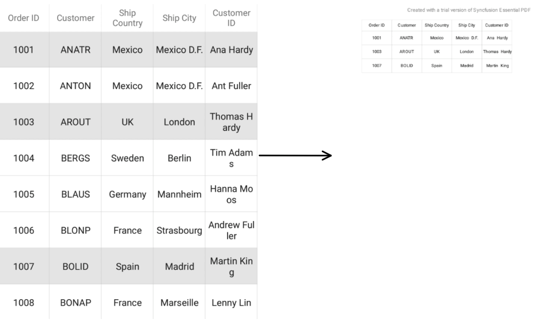

## See also

[How to export Middle Eastern Languages (Arabic, Hebrew) from Xamarin.Forms DataGrid (SfDataGrid) to PDF](https://www.syncfusion.com/kb/11198)

[How to create Header and Footer in PDF document](https://www.syncfusion.com/kb/7386)

[How to export a SfDataGrid to excel or PDF using ToolBarItems of a Page](https://www.syncfusion.com/kb/7395)
