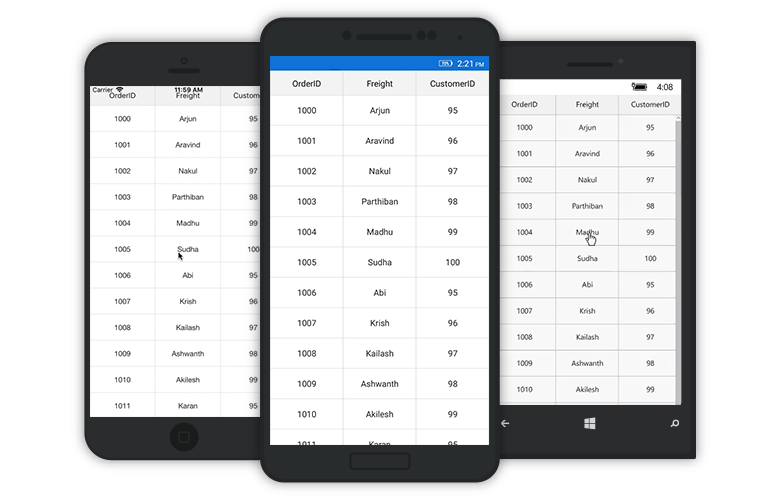

# Events and Commands in SfDataGrid

## GridTapped event

This event will be triggered while tapping the SfDataGrid with [GridTappedEventsArgs](https://help.syncfusion.com/cr/xamarin/Syncfusion.SfDataGrid.XForms.GridTappedEventsArgs.html) properties as follows:

 * [RowIndex](https://help.syncfusion.com/cr/xamarin/Syncfusion.SfDataGrid.XForms.GridTappedEventsArgs.html#Syncfusion_SfDataGrid_XForms_GridTappedEventsArgs__ctor_Syncfusion_GridCommon_ScrollAxis_RowColumnIndex_System_Object_): Gets row index of the tapped row.
 * [ColumnIndex](https://help.syncfusion.com/cr/xamarin/Syncfusion.SfDataGrid.XForms.GridTappedEventsArgs.html#Syncfusion_SfDataGrid_XForms_GridTappedEventsArgs__ctor_Syncfusion_GridCommon_ScrollAxis_RowColumnIndex_System_Object_): Gets column index of the tapped column.
 * [RowData](https://help.syncfusion.com/cr/xamarin/Syncfusion.SfDataGrid.XForms.GridTappedEventsArgs.html#Syncfusion_SfDataGrid_XForms_GridTappedEventsArgs_RowData): Gets row data of the tapped row.

To hook the `GridTapped` event, and to get the tapped row and column details, follow the code example:



<sfgrid:SfDataGrid x:Name="dataGrid"
                   AutoGenerateColumns="True"
                   GridTapped="DataGrid_GridTapped"
                   ItemsSource="{Binding OrdersInfo}" />


private void DataGrid_GridTapped(object sender, GridTappedEventsArgs e)
{
    var rowIndex = e.RowColumnIndex.RowIndex;
    var rowData = e.RowData;
    var columnIndex = e.RowColumnIndex.ColumnIndex;
}



## GridDoubleTapped event

This event will be triggered while double tapping the SfDataGrid with [GridDoubleTappedEventsArgs](https://help.syncfusion.com/cr/xamarin/Syncfusion.SfDataGrid.XForms.GridDoubleTappedEventsArgs.html) properties as follows:

 * [RowIndex](https://help.syncfusion.com/cr/xamarin/Syncfusion.SfDataGrid.XForms.GridDoubleTappedEventsArgs.html#Syncfusion_SfDataGrid_XForms_GridDoubleTappedEventsArgs__ctor_Syncfusion_GridCommon_ScrollAxis_RowColumnIndex_System_Object_): Gets row index of the double tapped row.
 * [ColumnIndex](https://help.syncfusion.com/cr/xamarin/Syncfusion.SfDataGrid.XForms.GridDoubleTappedEventsArgs.html#Syncfusion_SfDataGrid_XForms_GridDoubleTappedEventsArgs__ctor_Syncfusion_GridCommon_ScrollAxis_RowColumnIndex_System_Object_): Gets column index of the double tapped column.
 * [RowData](https://help.syncfusion.com/cr/xamarin/Syncfusion.SfDataGrid.XForms.GridDoubleTappedEventsArgs.html#Syncfusion_SfDataGrid_XForms_GridDoubleTappedEventsArgs_RowData): Gets row data of the double tapped row.

To hook the `GridDoubleTapped` event, and to get the double tapped row and column details, follow the code example:  



<sfgrid:SfDataGrid x:Name="dataGrid"
                   AutoGenerateColumns="True"
                   GridDoubleTapped="DataGrid_GridDoubleTapped"
                   ItemsSource="{Binding OrdersInfo}" />


private void DataGrid_GridDoubleTapped(object sender, GridDoubleTappedEventsArgs e)
{
    var rowIndex = e.RowColumnIndex.RowIndex;
    var rowData = e.RowData;
    var columnIndex = e.RowColumnIndex.ColumnIndex;
}



## GridLongPressed event

This event will be triggered while long pressing the SfDataGrid with [GridLongPressedEventsArgs](https://help.syncfusion.com/cr/xamarin/Syncfusion.SfDataGrid.XForms.GridLongPressedEventsArgs.html) properties as follows:

 * [RowIndex](https://help.syncfusion.com/cr/xamarin/Syncfusion.SfDataGrid.XForms.GridLongPressedEventsArgs.html#Syncfusion_SfDataGrid_XForms_GridLongPressedEventsArgs__ctor_Syncfusion_GridCommon_ScrollAxis_RowColumnIndex_System_Object_): Gets row index of the long pressed row.
 * [ColumnIndex](https://help.syncfusion.com/cr/xamarin/Syncfusion.SfDataGrid.XForms.GridLongPressedEventsArgs.html#Syncfusion_SfDataGrid_XForms_GridLongPressedEventsArgs__ctor_Syncfusion_GridCommon_ScrollAxis_RowColumnIndex_System_Object_): Gets column index of the long pressed column.
 * [RowData](https://help.syncfusion.com/cr/xamarin/Syncfusion.SfDataGrid.XForms.GridLongPressedEventsArgs.html#Syncfusion_SfDataGrid_XForms_GridLongPressedEventsArgs_RowData): Gets row data of the long pressed row.

To hook the `GridLongPressed` event, and to get the long pressed row and column details, follow the code example: 



<sfgrid:SfDataGrid x:Name="dataGrid"
                   AutoGenerateColumns="True"
                   GridLongPressed="DataGrid_GridLongPressed"
                   ItemsSource="{Binding OrdersInfo}" />


private void DataGrid_GridLongPressed(object sender, GridLongPressedEventsArgs e)
{
    var rowIndex = e.RowColumnIndex.RowIndex;
    var rowData = e.RowData;
    var columnIndex = e.RowColumnIndex.ColumnIndex;
}



## GridViewCreated event

This event will be triggered once the [SfDataGrid.View](https://help.syncfusion.com/cr/xamarin/Syncfusion.SfDataGrid.XForms.SfDataGrid.html#Syncfusion_SfDataGrid_XForms_SfDataGrid_View) is created. This event gives any operation only after the creation of `SfDataGrid.View` by handling the [GridViewCreatedEventArgs](https://help.syncfusion.com/cr/xamarin/Syncfusion.SfDataGrid.XForms.GridViewCreatedEventArgs.html).

To hook the `GridViewCreated` event, and to set alternate row colors, follow the code example:



<sfgrid:SfDataGrid x:Name="dataGrid"
                   AutoGenerateColumns="True"
                   GridViewCreated="DataGrid_GridViewCreated"
                   ItemsSource="{Binding OrdersInfo}" />


private void DataGrid_GridViewCreated(object sender, GridViewCreatedEventArgs e)
{
    (sender as SfDataGrid).GridStyle = new CustomGridStyle();     
}

internal class CustomGridStyle : DataGridStyle
{
    public override Color GetAlternatingRowBackgroundColor()
    {
        return Color.Aqua;
    }
}



## GridLoaded event

This event will be triggered once components in the SfDataGrid initialized and rendered. This event gives any operation only after loading the grid by handling the [GridLoadedEventArgs](https://help.syncfusion.com/cr/xamarin/Syncfusion.SfDataGrid.XForms.GridLoadedEventArgs.html).

To hook the `GridLoaded` event, and to show the `ActivityIndicator` until the grid comes to view, follow the code example:



<Grid x:Name="grid"
      HorizontalOptions="FillAndExpand"
      VerticalOptions="FillAndExpand">
    <sfgrid:SfDataGrid x:Name="dataGrid"
                       AutoGenerateColumns="True"
                       GridLoaded="DataGrid_GridLoaded"
                       HorizontalOptions="FillAndExpand"
                       ItemsSource="{Binding OrdersInfo}"
                       VerticalOptions="FillAndExpand" />


private void DataGrid_GridLoaded(object sender, GridLoadedEventArgs e)
{
    ActivityIndicator indicator = new ActivityIndicator();
    indicator.IsRunning = true;
    indicator.IsVisible = true;
    indicator.BackgroundColor = Color.Gray;
    grid.Children.Add(indicator);
    await Task.Delay(2000);
    indicator.IsRunning = false;
    indicator.IsVisible = false;
}



## ValueChanged event

The [SfDataGrid.ValueChanged](https://help.syncfusion.com/cr/xamarin/Syncfusion.SfDataGrid.XForms.SfDataGrid.html) event will be triggered whenever the current cell's value has been changed in the GridTextColumn, GridNumericColumn or GridSwitchColumn. This event handler contains the parameter of type [ValueChangedEventArgs](https://help.syncfusion.com/cr/xamarin/Syncfusion.SfDataGrid.XForms.ValueChangedEventArgs.html) that contains the following properties.

* [Column](https://help.syncfusion.com/cr/xamarin/Syncfusion.SfDataGrid.XForms.ValueChangedEventArgs.html#Syncfusion_SfDataGrid_XForms_ValueChangedEventArgs_Column)        : Gets the current `GridColumn` that contains the grid cell for which value is edited or changed.
* [NewValue](https://help.syncfusion.com/cr/xamarin/Syncfusion.SfDataGrid.XForms.ValueChangedEventArgs.html#Syncfusion_SfDataGrid_XForms_ValueChangedEventArgs_NewValue)      : The newly edited value to be committed.
* [RowColumnIndex](https://help.syncfusion.com/cr/xamarin/Syncfusion.SfDataGrid.XForms.ValueChangedEventArgs.html#Syncfusion_SfDataGrid_XForms_ValueChangedEventArgs__ctor_Syncfusion_GridCommon_ScrollAxis_RowColumnIndex_System_Object_System_Object_Syncfusion_SfDataGrid_XForms_GridColumn_System_Object_)   : The current `RowColumnIndex` of the grid cell undergoing the value change.
* [RowData](https://help.syncfusion.com/cr/xamarin/Syncfusion.SfDataGrid.XForms.ValueChangedEventArgs.html#Syncfusion_SfDataGrid_XForms_ValueChangedEventArgs_RowData)       : The `RowData` of the row that contains the grid cell undergoing the value change.
* [CellValue](https://help.syncfusion.com/cr/xamarin/Syncfusion.SfDataGrid.XForms.ValueChangedEventArgs.html#Syncfusion_SfDataGrid_XForms_ValueChangedEventArgs_CellValue)       : The initial value when current cell entered edit mode.





        dataGrid.ValueChanged += DataGrid_ValueChanged;

        private void DataGrid_ValueChanged(object sender, ValueChangedEventArgs e)
        {
            var column = e.Column;
            var newValue = e.NewValue;
            var rowColIndex = e.RowColIndex;
            var rowData = e.RowData;
        }





## ItemsSource changed event

The [SfDataGrid.ItemsSourceChanged](https://help.syncfusion.com/cr/xamarin/Syncfusion.SfDataGrid.XForms.SfDataGrid.html) event will be triggered whenever the [SfDataGrid.ItemsSource](https://help.syncfusion.com/cr/xamarin/Syncfusion.SfDataGrid.XForms.SfDataGrid.html#Syncfusion_SfDataGrid_XForms_SfDataGrid_ItemsSource) property is changed in the grid during both the runtime changes and initial loading of the DataGrid. This event handler contains the parameter of type [GridItemsSourceChangedEventArgs](https://help.syncfusion.com/cr/xamarin/Syncfusion.SfDataGrid.XForms.GridItemsSourceChangedEventArgs.html) that contains the following properties:

* [OldItemSource](https://help.syncfusion.com/cr/xamarin/Syncfusion.SfDataGrid.XForms.GridItemsSourceChangedEventArgs.html#Syncfusion_SfDataGrid_XForms_GridItemsSourceChangedEventArgs_OldItemSource): Gets the previous ItemsSource collection as object. Always null when the grid is initially loaded.
* [NewItemSource](https://help.syncfusion.com/cr/xamarin/Syncfusion.SfDataGrid.XForms.GridItemsSourceChangedEventArgs.html#Syncfusion_SfDataGrid_XForms_GridItemsSourceChangedEventArgs_NewItemSource): Gets the current ItemsSource collection as object.
* [OldView](https://help.syncfusion.com/cr/xamarin/Syncfusion.SfDataGrid.XForms.GridItemsSourceChangedEventArgs.html#Syncfusion_SfDataGrid_XForms_GridItemsSourceChangedEventArgs_OldView): Gets the old [SfDataGrid.View](https://help.syncfusion.com/cr/xamarin/Syncfusion.SfDataGrid.XForms.SfDataGrid.html#Syncfusion_SfDataGrid_XForms_SfDataGrid_View) associated with the `OldItemSource`. Always null when the grid is initially loaded.
* [NewView](https://help.syncfusion.com/cr/xamarin/Syncfusion.SfDataGrid.XForms.GridItemsSourceChangedEventArgs.html#Syncfusion_SfDataGrid_XForms_GridItemsSourceChangedEventArgs_NewView): Gets the new [SfDataGrid.View](https://help.syncfusion.com/cr/xamarin/Syncfusion.SfDataGrid.XForms.SfDataGrid.html#Syncfusion_SfDataGrid_XForms_SfDataGrid_View) associated with the `NewItemSource`.

The following code example shows how to hook the `SfDataGrid.ItemsSourceChanged` event and get the `ItemsSource` collection details.



<sfgrid:SfDataGrid x:Name="dataGrid"
                   AutoGenerateColumns="True"                  
                   ItemsSource="{Binding OrdersInfo}" 
                   ItemsSourceChanged="DataGrid_ItemsSourceChanged"/>





 private void DataGrid_ItemsSourceChanged(object sender, GridItemsSourceChangedEventArgs e)
 {
    var newItemSource = e.NewItemSource;
    var oldItemSource = e.OldItemSource;
    var newView = e.NewView;
    var oldView = e.OldView;
 }



## Create custom context menu using grid events

The SfDataGrid allows you to display any custom view, like context menu. This menu acts similar to pop-up by using the `GridLongPressed` and `GridTapped` events.

To create custom context menu using grid events, follow the code example:


<ContentPage xmlns="http://xamarin.com/schemas/2014/forms"
             xmlns:x="http://schemas.microsoft.com/winfx/2009/xaml"
             xmlns:local="clr-namespace:ContextMenuSupport"
             x:Class="ContextMenuSupport.MainPage"
             xmlns:sfgrid="clr-namespace:Syncfusion.SfDataGrid.XForms;assembly=Syncfusion.SfDataGrid.XForms">

    <ContentPage.BindingContext>
        <local:ViewModel />
    </ContentPage.BindingContext>
    
    <RelativeLayout x:Name="relativeLayout">
      <sfgrid:SfDataGrid x:Name="dataGrid"
                         ItemsSource="{Binding Collection}"
                         ColumnSizer="Star"
                         RelativeLayout.WidthConstraint="{ConstraintExpression
                                                      Type=RelativeToParent,Property=Width,Factor=1,Constant=0}"
                         RelativeLayout.HeightConstraint="{ConstraintExpression
                                                      Type=RelativeToParent,Property=Height,Factor=1,Constant=0}"
                         GridLongPressed="DataGrid_GridLongPressed"
                       />     
    </RelativeLayout>
  
</ContentPage>



public partial class MainPage : ContentPage
{
    StackLayout contextMenu;
    Button sortButton;
    Button clearSortButton;
    private bool isContextMenuDisplayed = false;
    private string currentColumnName;
    public MainPage()
    {
        InitializeComponent();
        // Creates the view for the ContextMenu
        CreateContextMenu();
        dataGrid.AllowSorting = true;
        dataGrid.GridTapped += DataGrid_GridTapped;           
    }

    private void DataGrid_GridTapped(object sender, GridTappedEventsArgs e)
    {
        // Hides the context menu when SfDataGrid is tapped anywhere outside the context menu view
        relativeLayout.Children.Remove(contextMenu);
        isContextMenuDisplayed = false;
    }

    public void CreateContextMenu()
    {
        contextMenu = new StackLayout(); 
    
        sortButton = new Button();
        sortButton.Text = "Sort";           
        sortButton.BackgroundColor = Color.Black;
        sortButton.TextColor = Color.White;
        sortButton.Clicked += SortButton_Clicked;
            
        clearSortButton = new Button();
        clearSortButton.Text = "Clear sort";           
        clearSortButton.BackgroundColor = Color.Black;
        clearSortButton.TextColor = Color.White;
        clearSortButton.Clicked += ClearSortButton_Clicked;
        
        // A custom view hosting two buttons are now created
        contextMenu.Children.Add(sortButton);
        contextMenu.Children.Add(clearSortButton);            
    }

    // Removes the sorting applied to the SfDataGrid
    private void ClearSortButton_Clicked(object sender, EventArgs e)
    {
        relativeLayout.Children.Remove(contextMenu);
        isContextMenuDisplayed = false;
        dataGrid.SortColumnDescriptions.Clear();
    }

    // Sorts the SfDataGrid data based on the column selected in the context menu
    private void SortButton_Clicked(object sender, EventArgs e)
    {
        relativeLayout.Children.Remove(contextMenu);
        isContextMenuDisplayed = false;
        dataGrid.SortColumnDescriptions.Clear();
        dataGrid.SortColumnDescriptions.Add(new SortColumnDescription()
        {
            ColumnName = currentColumnName
        });
    }

    public void DataGrid_GridLongPressed(object sender, GridLongPressedEventsArgs e)
    {
        if (!isContextMenuDisplayed)
        {
            currentColumnName = dataGrid.Columns[e.RowColumnIndex.ColumnIndex].MappingName;
            var point = dataGrid.RowColumnIndexToPoint(e.RowColumnIndex);
            // Display the ContextMenu when the SfDataGrid is long pressed
            relativeLayout.Children.Add(contextMenu, Constraint.Constant(point.X), Constraint.Constant(point.Y));
            isContextMenuDisplayed = true;
        }
        else
        {
            // Hides the context menu when SfDataGrid is long pressed when the context menu is already visible in screen
            relativeLayout.Children.Remove(contextMenu);
            isContextMenuDisplayed = false;
        }
    }
}


Refer to the following GIF for final rendering on execution of above code example:

## Commands

### GridTapped command

The [SfDataGrid.GridTappedCommand](https://help.syncfusion.com/cr/xamarin/Syncfusion.SfDataGrid.XForms.SfDataGrid.html#Syncfusion_SfDataGrid_XForms_SfDataGrid_GridTappedCommand) will be executed when tapping the SfDataGrid. You can directly assign any [ICommand](https://docs.microsoft.com/en-us/dotnet/api/system.windows.input.icommand?view=netframework-4.7.2) type property to the `SfDataGrid.GridTappedCommand` or write a class derived from `ICommand` interface, and assign your CustomClass type property to the `SfDataGrid.GridTappedCommand` property. By configuring this, the data grid comes handy if you have your own logics determining whether to execute the command or not.

The parameter of command holds the value of [SfDataGrid.GridTappedEventArgs](https://help.syncfusion.com/cr/xamarin/Syncfusion.SfDataGrid.XForms.GridTappedEventArgs.html) through which you can get the value of tapped RowData and RowColumnIndex. 




 <ContentPage.BindingContext>
        <local:ViewModel x:Name="viewModel" />
</ContentPage.BindingContext>

 <sfgrid:SfDataGrid x:Name="dataGrid"
                   ItemsSource="{Binding OrdersInfo}"
                   GridTappedCommand="{Binding TappedCommandAction}"/>







  // viewModel.cs
 public ViewModel()
        {
            // assigning command action to ICommand type property
            TappedCommandAction = new Command(add);

            // assigning command action to your custom command type property
            TappedCommandAction1 = new DerivedTappedCommand();          
        }

  // ICommand type property for binding with DataGrid.TappedCommandAction
 public ICommand TappedCommandAction
        {
            get;
            set;
        }

  // Custom command type property for binding with DataGrid.TappedCommandAction
 public DerivedTappedCommand TappedCommandAction1
        {
            get;
            set;
        }

 public void add()
        {
          //your logics here
        }

  // below codes for writing custom command derived from ICommand.
 public class DerivedTappedCommand : ICommand
    {
        public event EventHandler CanExecuteChanged;
     
        public DerivedTappedCommand( )
        {         
        }

        public bool CanExecute(object parameter)
        {
            return true;
        }

        public void Execute(object parameter)
        {
            var eventArgs = parameter as GridTappedEventArgs;
            var rowData = eventArgs.RowData;
            var rowColumnIndex = eventArgs.RowColumnIndex;
        }
    }




You can download the sample demo [here](http://www.syncfusion.com/downloads/support/directtrac/general/ze/TappedCommand1824531900).

### GridDoubleTapped command

The [SfDataGrid.GridDoubleTappedCommand](https://help.syncfusion.com/cr/xamarin/Syncfusion.SfDataGrid.XForms.SfDataGrid.html#Syncfusion_SfDataGrid_XForms_SfDataGrid_GridDoubleTappedCommand) will be executed when double tapping the SfDataGrid. You can directly assign any [ICommand](https://docs.microsoft.com/en-us/dotnet/api/system.windows.input.icommand?view=netframework-4.7.2) type property to the `SfDataGrid.GridTappedCommand` or write a class derived from `ICommand` interface, and assign your CustomClass type property to the `SfDataGrid.GridTappedCommand` property. By configuring this, the data gird comes handy if you have your own logics determining whether to execute the command or not.




<ContentPage.BindingContext>
        <local:ViewModel x:Name="viewModel" />
</ContentPage.BindingContext>

<sfgrid:SfDataGrid x:Name="dataGrid"
                   ItemsSource="{Binding OrdersInfo}"
                    GridDoubleTappedCommand="{Binding DoubleTappedCommandAction}" />







  // viewModel.cs
 public ViewModel()
        {
            // assigning command action to ICommand type property
            DoubleTappedCommandAction = new  Command(add);

            // assigning command action to your custom command type property
            DoubleTappedCommandAction1 = new DerivedDoubleTappedCommand();
        }

  // ICommand type property for binding with DataGrid.DoubleTappedCommand
 public ICommand DoubleTappedCommandAction
        {
            get;
            set;
        }

  // Custom command type property for binding with DataGrid.DoubleTappedCommand
 public DerivedDoubleTappedCommand DoubleTappedCommandAction1
        {
            get;
            set;
        }

 public void add()
        {
          //your logics here
        }

  // below codes for writing custom command derived from ICommand.
 public class DerivedDoubleTappedCommand : ICommand
    {
        public event EventHandler CanExecuteChanged;
     
        public DerivedDoubleTappedCommand( )
        {         
        }

        public bool CanExecute(object parameter)
        {
            return true;
        }

        public void Execute(object parameter)
        {
            // your logics here.
        }
    }




You can download the sample demo [here](http://www.syncfusion.com/downloads/support/directtrac/general/ze/DoubleTappedSample2052249746).

### GridLongPressed command

The [SfDataGrid.GridLongPressedCommand](https://help.syncfusion.com/cr/xamarin/Syncfusion.SfDataGrid.XForms.SfDataGrid.html#Syncfusion_SfDataGrid_XForms_SfDataGrid_GridLongPressedCommand) will be executed when long pressing the SfDataGrid. You can directly assign any [ICommand](https://docs.microsoft.com/en-us/dotnet/api/system.windows.input.icommand?view=netframework-4.7.2) type property to the `SfDataGrid.GridTappedCommand` or write a class derived from `ICommand` interface, and assign your CustomClass type property to the `SfDataGrid.GridTappedCommand` property. By configuring this, the data gird comes handy if you have your own logics determining whether to execute the command or not.




<ContentPage.BindingContext>
        <local:ViewModel x:Name="viewModel" />
</ContentPage.BindingContext>

<sfgrid:SfDataGrid x:Name="dataGrid"
                   ItemsSource="{Binding OrdersInfo}"
                   GridLongPressedCommand="{Binding LongPressedCommandAction}">







  // viewModel.cs
 public ViewModel()
        {
            // assigning command action to ICommand type property
            LongPressedCommandAction  = new Command(add);

            // assigning command action to your custom command type property
            LongPressedCommandAction1 = new DerivedLongPressedCommand();
        }

  // ICommand type property for binding with DataGrid.GridLongPressedCommand
 public ICommand LongPressedCommandAction
        {
            get;
            set;
        }
  // Custom command type property for binding with DataGrid.GridLongPressedCommand
 public DerivedLongPressedCommand LongPressedCommandAction1
        {
            get;
            set;
        }

 public void add()
        {
           // your logics here
        }

  // below codes for writing custom command derived from ICommand.
 public class DerivedLongPressedCommand : ICommand
    {
        public event EventHandler CanExecuteChanged;
     
        public DerivedLongPressedCommand( )
        {         
        }

        public bool CanExecute(object parameter)
        {
            return true;
        }

        public void Execute(object parameter)
        {
            // your logics here.
        }
    }







<sfgrid:SfDataGrid x:Name="dataGrid"
                   ItemsSource="{Binding OrdersInfo}"
                   GridLongPressedCommand="{Binding LongPressedCommandAction}">




You can download the sample demo [here](http://www.syncfusion.com/downloads/support/directtrac/general/ze/LongPressedCommand1698940749).

## See also

[How to navigate to an URL when tapping on a cell in SfDataGrid](https://www.syncfusion.com/kb/7443)

[How to get the column name on tapping a row in SfDataGrid](https://www.syncfusion.com/kb/7432)
