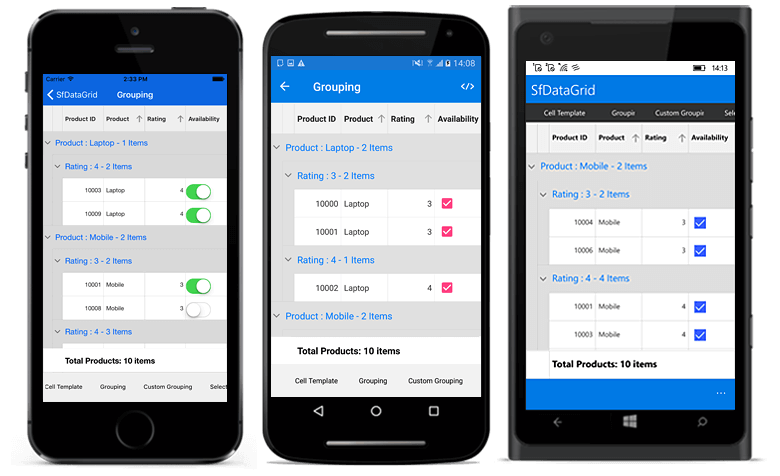
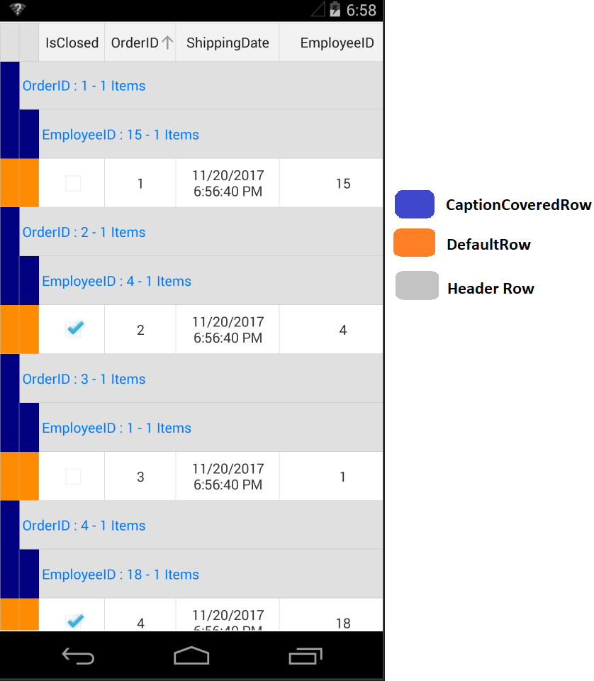
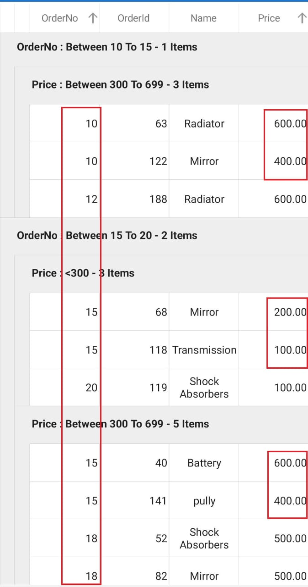
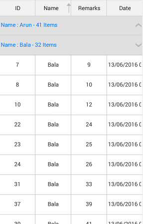

# Grouping in Xamarin.Forms DataGrid (SfDataGrid)

A group represents a collection of records that belongs to a particular category. When grouping, the data is organized into hierarchical structure based on matching field values. The records having identical values in the grouped column are combined to form a group. Each group is identified by its [CaptionSummaryRow](https://help.syncfusion.com/cr/xamarin/Syncfusion.SfDataGrid.XForms.SfDataGrid.html#Syncfusion_SfDataGrid_XForms_SfDataGrid_CaptionSummaryRowProperty) to get the underlying records in view.

N> To update grouping for the newly added row or column, set the `SfDataGrid.View.LiveDataUpdateMode` to `LiveDataUpdateMode.AllowDataShaping`.

N> When `BeginInit` method is called, it suspends all the updates until `EndInit` method is called.  

## Programmatic grouping

The SfDataGrid also allows to perform grouping from the code by defining the [GroupColumnDescription](http://help.syncfusion.com/cr/xamarin/Syncfusion.SfDataGrid.XForms.GroupColumnDescription.html) object and adding it in the [SfDataGrid.GroupColumnDescriptions](https://help.syncfusion.com/cr/xamarin/Syncfusion.SfDataGrid.XForms.SfDataGrid.html#Syncfusion_SfDataGrid_XForms_SfDataGrid_GroupColumnDescriptions) collection. It groups the data based on the `GroupColumnDescription` object added to this collection.

`GroupColumnDescription` object holds following two properties:

 * ColumnName: Name of the grouped column.
 * Converter: Get the `IValueConverter` as input that helps to apply the custom grouping.

To apply column grouping, follow the code example:



<syncfusion:SfDataGrid x:Name="dataGrid"
            ItemsSource="{Binding OrdersInfo}">

    <syncfusion:SfDataGrid.GroupColumnDescriptions>
        <syncfusion:GroupColumnDescription ColumnName="CustomerID" />
    </syncfusion:SfDataGrid.GroupColumnDescriptions>
</syncfusion:SfDataGrid> 


    dataGrid.GroupColumnDescriptions.Add (new GroupColumnDescription () {
    ColumnName = "CustomerID",
}); 



The following screenshot shows the output rendered when grouping is applied:

## MultiGrouping

The SfDataGrid also allows to group the data against one or more columns using the [SfDataGrid.GroupingMode](https://help.syncfusion.com/cr/xamarin/Syncfusion.SfDataGrid.XForms.SfDataGrid.html#Syncfusion_SfDataGrid_XForms_SfDataGrid_GroupingMode) property. When `GroupingMode` is set as `GroupingMode.Multiple`, the data is organized into hierarchical tree structure based on identical values of that column. MultiGrouping feature works similarly as MultiSorting feature. Initially the data is grouped according to the first column added in the `GroupColumnDescriptions` collection. When more columns are added to the `GroupColumnDescriptions`, the newly added column will be grouped in consideration to the previous group(s). This results in a tree like hierarchy. Refer to the following code snippet to enable `MultiGrouping`:



<syncfusion:SfDataGrid  x:Name="dataGrid"
                        AutoGenerateColumns="True"
                        ItemsSource="{Binding Orders}"
                        GroupingMode = "Multiple"/>




this.dataGrid.GroupingMode = GroupingMode.Multiple;




The following screenshot shows the output rendered when above code is executed:

## Indent column customizations

Indent columns are the columns present to the left of the `CaptionSummaryRows` when `GroupingMode` is set as multiple. The number of indent cells in each `CaptionSummaryRow` will be determined by the level of that `Group`. For example, the first group will have only one indent cell and the next immediate group will have an extra indent cell. It keeps on adding by one for each lower level groups to maintain the tree structure. Each data row will have indent cells count equal to the level of the last sub group in view. The following customizations can be done for indent cells:

### Customize indent column width

By default, the width of the indent column is 20. To customize the width of indent column, use the [IndentColumnWidth](https://help.syncfusion.com/cr/xamarin/Syncfusion.SfDataGrid.XForms.SfDataGrid.html#Syncfusion_SfDataGrid_XForms_SfDataGrid_IndentColumnWidth) property as follows: 




<syncfusion:SfDataGrid  x:Name="dataGrid"
                        AutoGenerateColumns="True"
                        ItemsSource="{Binding Orders}"
                        IndentColumnWidth="60"/>




this.dataGrid.IndentColumnWidth = 60;




### Customize indent column background color 

Set background colors to indent cells based on the row where indent cells present. To set the desired background color, use the `GetIndentBackgroundColor()` override in the custom `DataGridStyle` class. Refer to this [link](https://help.syncfusion.com/xamarin/sfdatagrid/styles) to know how to apply custom style to the SfDataGrid. Refer to the following code snippet to apply background color to indent cells based on the row type:




this.dataGrid.GridStyle = new CustomStyle();

public class CustomStyle : DataGridStyle
{
    public override Color GetIndentBackgroundColor(RowType rowType)
    {
        if (rowType == RowType.DefaultRow)
            return Color.DarkOrange;
        if (rowType == RowType.CaptionCoveredRow)
            return Color.Navy;
        else return Color.FromRgb(224, 224, 224);
    }
}




## Custom grouping

The SfDataGrid allows to group a column based on custom logic when the standard grouping techniques do not meet the requirements. To achieve this, write a converter that implements `IValueConverter` with custom grouping logic. Assign that converter to the [GroupColumnDescription.Converter](https://help.syncfusion.com/cr/xamarin/Syncfusion.SfDataGrid.XForms.GroupColumnDescription.html#Syncfusion_SfDataGrid_XForms_GroupColumnDescription_Converter) property.

To set custom grouping converter for the group description that is added to group the freight column, follow the code example:



<ContentPage xmlns="http://xamarin.com/schemas/2014/forms"
             xmlns:x="http://schemas.microsoft.com/winfx/2009/xaml"
             xmlns:syncfusion="clr-namespace:Syncfusion.SfDataGrid.XForms;assembly=Syncfusion.SfDataGrid.XForms"
             xmlns:local ="clr-namespace:DataGridSample;assembly=DataGridSample"
             x:Class="DataGridSample.Sample">

    <ContentPage.Resources>
        <ResourceDictionary>
            <local:GroupConverter x:Key="groupConverter" />
        </ResourceDictionary>
    </ContentPage.Resources>

    <ContentPage.BindingContext>
        <local:ViewModel x:Name="viewModel" />
    </ContentPage.BindingContext>

    <syncfusion:SfDataGrid x:Name="dataGrid"
                           ItemsSource="{Binding OrdersInfo}">

        <syncfusion:SfDataGrid.GroupColumnDescriptions>
            <syncfusion:GroupColumnDescription ColumnName="Freight"
                                               Converter="{StaticResource groupConverter}" />
        </syncfusion:SfDataGrid.GroupColumnDescriptions>
    </syncfusion:SfDataGrid>
</ContentPage> 


dataGrid.GroupColumnDescriptions.Add (new GroupColumnDescription () {
    ColumnName = "Freight",
    Converter = new GroupConverter()
}); 



The following code example illustrates the converter used for applying custom grouping logic.


public class GroupConverter : IValueConverter
{
    public GroupConverter()
    {
        
    }

    public object Convert(object value, Type targetType, object parameter, CultureInfo culture)
    {
        var orderInfo = value as OrderInfo;
        if (orderInfo.Freight > 0 && orderInfo.Freight <= 250)
            return "<=250";
        else if (orderInfo.Freight > 250 && orderInfo.Freight <= 500)
            return ">250 & <=500";
        else if (orderInfo.Freight > 500 && orderInfo.Freight <= 750)
            return ">500 & <=750";
        else
            return ">1000";
    }

    public object ConvertBack(object value, Type targetType, object parameter, CultureInfo culture)
    {
        return null;
    }
}


### Sorting the grouped column records
In custom grouping, you can sort all the inner records of each group by setting [GroupColumnDescription.SortGroupRecords](https://help.syncfusion.com/cr/xamarin/Syncfusion.SfDataGrid.XForms.GroupColumnDescription.html#Syncfusion_SfDataGrid_XForms_GroupColumnDescription_SortGroupRecords) property as `true` to sort the records based on the `GroupColumnDescription.ColumnName` property.



<ContentPage xmlns="http://xamarin.com/schemas/2014/forms"
             xmlns:x="http://schemas.microsoft.com/winfx/2009/xaml"
             xmlns:syncfusion="clr-namespace:Syncfusion.SfDataGrid.XForms;assembly=Syncfusion.SfDataGrid.XForms"
             xmlns:local ="clr-namespace:DataGridSample;assembly=DataGridSample"
             x:Class="DataGridSample.Sample">
    <ContentPage.Resources>
        <ResourceDictionary>
            <local:GroupOrderNoConverter x:Key="groupOrderNoConverter" />
            <local:PriceConverter x:key="priceConverter"/>
        </ResourceDictionary>
    </ContentPage.Resources>

    <ContentPage.BindingContext>
        <local:ViewModel x:Name="viewModel" />
    </ContentPage.BindingContext>

    <syncfusion:SfDataGrid x:Name="dataGrid"
                           ItemsSource="{Binding OrdersInfo}">
        <Syncfusion:SfDataGrid.GroupColumnDescriptions>
            <Syncfusion:GroupColumnDescription ColumnName="OrderNo" Converter="{StaticResource groupOrderNoConverter}" SortGroupRecords="True" />
            <Syncfusion:GroupColumnDescription ColumnName="Price" Converter="{StaticResource priceConverter}" SortGroupRecords="False"/>
        </Syncfusion:SfDataGrid.GroupColumnDescriptions>
    </syncfusion:SfDataGrid>
</ContentPage>





datagrid.GroupColumnDescriptions.Add(new GroupColumnDescription()
{
    ColumnName = "OrderNo",
    Converter = new GroupOrderNoConverter(),
    SortGroupRecords = true
}) ;
datagrid.GroupColumnDescriptions.Add(new GroupColumnDescription()
{
    ColumnName = "Price",
    Converter = new PriceConverter(),
    SortGroupRecords = false
}) ;  
			
public class GroupOrderNoConvertor : IValueConverter
{
	public object Convert(object value, Type targetType, object parameter, CultureInfo culture)
    {
		var orderInfo = value as OrderInfo;
        if (orderInfo.OrderNo < 10)
            return "<10";
        if (orderInfo.OrderNo >= 10 && orderInfo.OrderNo < 15)
            return "Between 10 To 15";
        if (orderInfo.OrderNo >= 15 && orderInfo.OrderNo <= 20)
            return "Between 15 To 20";
        else
            return ">20";
    }

    public object ConvertBack(object value, Type targetType, object parameter, CultureInfo culture)
    {
        return null;
    }
}

public class PriceConverter : IValueConverter
{
	public object Convert(object value, Type targetType, object parameter, CultureInfo culture)
    {
        var orderInfo = value as OrderInfo;
        if (orderInfo.Price < 300)
            return "<300";
        if (orderInfo.Price >= 300 && orderInfo.Price < 700)
            return "Between 300 To 699";
        if (orderInfo.Price >= 700 && orderInfo.Price <= 1000)
            return "Between 700 To 1000";
        return ">1000";
    }

    public object ConvertBack(object value, Type targetType, object parameter, CultureInfo culture)
    {
        return null;
    }
}





As you can see in the below screenshot, the records are sorted based on the `OrderNo` column, since `SortGroupRecords` is set as `true` and it is not sorted further based on `Price` column since `SortGroupRecords` is set as `false`.

## Expand groups while grouping
 
To expand all groups while grouping, set the [SfDataGrid.AutoExpandGroups](https://help.syncfusion.com/cr/xamarin/Syncfusion.SfDataGrid.XForms.SfDataGrid.html#Syncfusion_SfDataGrid_XForms_SfDataGrid_AutoExpandGroups) to `true`. While grouping any column, all groups will be in expanded state. 



<syncfusion:SfDataGrid  x:Name="dataGrid"
                        AutoExpandGroups="True"
                        AllowGroupExpandCollapse="True"
                        ItemsSource="{Binding Orders}"/>


this.dataGrid.AutoExpandGroups = true;
this.dataGrid.AllowGroupExpandCollapse = true;



## Expand or collapse the groups

By default, the groups will be in expanded state. However expand or collapse a group in runtime by setting the [SfDataGrid.AllowGroupExpandCollapse](https://help.syncfusion.com/cr/xamarin/Syncfusion.SfDataGrid.XForms.SfDataGrid.html#Syncfusion_SfDataGrid_XForms_SfDataGrid_AllowGroupExpandCollapse) to `true`.




<syncfusion:SfDataGrid  x:Name="dataGrid"
                        AllowGroupExpandCollapse="True"
                        ItemsSource="{Binding Orders}"/>
                       


this.dataGrid.AllowGroupExpandCollapse = true;



### Expand or collapse all the groups

Programmatically expand or collapse all the groups at runtime using the [SfDataGrid.ExpandAllGroup](https://help.syncfusion.com/cr/xamarin/Syncfusion.SfDataGrid.XForms.SfDataGrid.html#Syncfusion_SfDataGrid_XForms_SfDataGrid_ExpandAllGroup) and [SfDataGrid.CollapseAllGroup](https://help.syncfusion.com/cr/xamarin/Syncfusion.SfDataGrid.XForms.SfDataGrid.html#Syncfusion_SfDataGrid_XForms_SfDataGrid_CollapseAllGroup) methods.



this.dataGrid.ExpandAllGroup();
this.dataGrid.CollapseAllGroup();



### Expand or collapse a specific group

Expand or collapse specific group by using the [SfDataGrid.ExpandGroup](https://help.syncfusion.com/cr/xamarin/Syncfusion.SfDataGrid.XForms.SfDataGrid.html#Syncfusion_SfDataGrid_XForms_SfDataGrid_ExpandGroup_Syncfusion_Data_Group_) and [SfDataGrid.CollapseGroup](https://help.syncfusion.com/cr/xamarin/Syncfusion.SfDataGrid.XForms.SfDataGrid.html#Syncfusion_SfDataGrid_XForms_SfDataGrid_CollapseGroup_Syncfusion_Data_Group_) methods.



var group = (dataGrid.View.Groups[0] as Group);
this.dataGrid.ExpandGroup(group);
this.dataGrid.CollapseGroup(group);



## Display based grouping using GroupMode property

By default, column grouping occurs based on the value in the underlying collection thereby creating a new group for each new value of that column. However, a column can also be grouped based on the Display value by setting the [GridColumn.GroupMode](https://help.syncfusion.com/cr/xamarin/Syncfusion.SfDataGrid.XForms.GridColumn.html#Syncfusion_SfDataGrid_XForms_GridColumn_GroupMode) property as `Display`. In the following code example, set the [GridColumn.Format](https://help.syncfusion.com/cr/xamarin/Syncfusion.SfDataGrid.XForms.GridColumn.html#Syncfusion_SfDataGrid_XForms_GridColumn_Format) property as "#" which displays only the rounded off value in the [GridCell](http://help.syncfusion.com/cr/xamarin/Syncfusion.SfDataGrid.XForms.GridCell.html): 



<syncfusion:GridTextColumn HeaderText="Shipment Weight" 
                           MappingName="ShipmentWeight"
                           GroupMode="Display"
                           Format="#" />


GridNumericColumn cargoWeight = new GridTextColumn();
cargoWeight.MappingName = "ShipmentWeight";
cargoWeight.GroupMode = Syncfusion.Data.DataReflectionMode.Display;
cargoWeight.Format = "#";
 


Following screenshot shows the comparison between two Group modes. GroupMode.Value on the left and GroupMode.Display on the right:

## Clearing or removing a group

To clear applied grouping, remove the items from the `SfDataGrid.GroupColumnDescriptions` collection or clear the collection. 

Refer to the following code snippets to remove grouping:



<ContentPage xmlns="http://xamarin.com/schemas/2014/forms"
             xmlns:x="http://schemas.microsoft.com/winfx/2009/xaml"
             xmlns:local="clr-namespace:GridInForms"
             x:Class="GridInForms.MainPage"
             xmlns:sfgrid="clr-namespace:Syncfusion.SfDataGrid.XForms;assembly=Syncfusion.SfDataGrid.XForms" >            

    <ContentPage.BindingContext>
        <local:ViewModel x:Name="viewModel"/>
    </ContentPage.BindingContext>
    
    <StackLayout VerticalOptions="FillAndExpand">
    
        <Button Text="Remove Grouping"
             TextColor="Black"
             BackgroundColor="White"
             Clicked="ClearGroupingButton_Click"/>

        <sfgrid:SfDataGrid x:Name="dataGrid"
                           ItemsSource="{Binding OrdersInfo}"
                           >
            <syncfusion:SfDataGrid.GroupColumnDescriptions>
                <syncfusion:GroupColumnDescription ColumnName="Freight" />
            </syncfusion:SfDataGrid.GroupColumnDescriptions>
            <syncfusion:SfDataGrid.GroupColumnDescriptions>
                <syncfusion:GroupColumnDescription ColumnName="CustomerID" />
            </syncfusion:SfDataGrid.GroupColumnDescriptions>           
        </sfgrid:SfDataGrid>
    
    </StackLayout>

</ContentPage>
 

public partial class MainPage : ContentPage
{
    StackLayout stackLayout;
    SfDataGrid dataGrid;
    ViewModel viewModel;
    Button clearGroupingButton;
    public MainPage()
    {
        InitializeComponent();
        viewModel = new ViewModel();
        dataGrid = new SfDataGrid();
        clearGroupingButton = new Button();
        stackLayout = new StackLayout();
        dataGrid.ItemsSource = viewModel.OrdersInfo;
        dataGrid.GroupingMode = GroupingMode.Multiple;
        dataGrid.GroupColumnDescriptions.Add(new GroupColumnDescription()
        {
            ColumnName = "Freight",
        });
        dataGrid.GroupColumnDescriptions.Add(new GroupColumnDescription()
        {
            ColumnName = "CustomerID",
        });
        clearGroupingButton.Text = "Remove Grouping";
        clearGroupingButton.TextColor = Color.Black;
        clearGroupingButton.BackgroundColor = Color.White;
        clearGroupingButton.Clicked += ClearGroupingButton_Click;
        stackLayout.Children.Add(clearGroupingButton);
        stackLayout.Children.Add(dataGrid);
        this.Content = stackLayout;       
    }
}
 



private void ClearGroupingButton_Click(object sender, System.EventArgs e)
{
    //Clearing the Group
    dataGrid.GroupColumnDescriptions.Clear();

    //Removing the Group based on group item
    //var groupColumn = dataGrid.GroupColumnDescriptions[0];
    //dataGrid.GroupColumnDescriptions.Remove(groupColumn);
        
    //Removing the Group based on group index
    //dataGrid.GroupColumnDescriptions.RemoveAt(0);
}
 

Run the application to render the following output: 

N> Clear or remove grouping on [GridTapped event](https://help.syncfusion.com/cr/xamarin/Syncfusion.SfDataGrid.XForms.SfDataGrid.html), [GridDoubleTapped event](https://help.syncfusion.com/cr/xamarin/Syncfusion.SfDataGrid.XForms.SfDataGrid.html), or [GridLongPressed event](https://help.syncfusion.com/cr/xamarin/Syncfusion.SfDataGrid.XForms.SfDataGrid.html).

## Events

### GroupExpanding event

The [SfDataGrid.GroupExpanding](https://help.syncfusion.com/cr/xamarin/Syncfusion.SfDataGrid.XForms.SfDataGrid.html) event occurs when group is being expanded.
 
The [GroupChangingEventArgs](http://help.syncfusion.com/cr/xamarin/Syncfusion.SfDataGrid.XForms.GroupChangingEventArgs.html) of the `GroupExpanding` event provides the information about the expanding group and it has the following members:

 `Syncfusion.Data.Group`: Gets expanded group.

 `Cancel`: Decides to cancel group expansion.
 
Cancel group expansion by setting [GroupChangingEventArgs.Cancel](http://msdn.microsoft.com/query/dev10.query?appId=Dev10IDEF1&l=EN-US&k=k(System.ComponentModel.CancelEventArgs.Cancel)&rd=true) to `true`.



this.dataGrid.GroupExpanding += dataGrid_GroupExpanding;

void dataGrid_GroupExpanding(object sender, Syncfusion.SfDataGrid.XForms.GroupChangingEventArgs e)
{
    if (e.Group.Key.Equals(1001))    
        e.Cancel = true;    
}       



### GroupExpanded event

The [SfDataGrid.GroupExpanded](https://help.syncfusion.com/cr/xamarin/Syncfusion.SfDataGrid.XForms.SfDataGrid.html) event occurs after group is expanded.

The [GroupChangedEventArgs](http://help.syncfusion.com/cr/xamarin/Syncfusion.SfDataGrid.XForms.GroupChangedEventArgs.html) of the `GroupExpanded` event provides the information about the expanded group and it has the following member:

 `Syncfusion.Data.Group`: Gets the expanded group.

### GroupCollapsing event 

The [SfDataGrid.GroupCollapsing](https://help.syncfusion.com/cr/xamarin/Syncfusion.SfDataGrid.XForms.SfDataGrid.html) event occurs when group is being collapsed.

The [GroupChangingEventArgs](http://help.syncfusion.com/cr/xamarin/Syncfusion.SfDataGrid.XForms.GroupChangingEventArgs.html)  of the `GroupCollapsing` event provides the information about the collapsing group and it contains the following member:

 `Syncfusion.Data.Group`: Gets collapsed group.

 `Cancel`: Decides to cancel the group collapsing.

Cancel the group is being collapsed by using the [GroupChangingEventArgs.Cancel](http://msdn.microsoft.com/query/dev10.query?appId=Dev10IDEF1&l=EN-US&k=k(System.ComponentModel.CancelEventArgs.Cancel)&rd=true) of `GroupCollapsing` event.



this.dataGrid.GroupCollapsing += dataGrid_GroupCollapsing;

void dataGrid_GroupCollapsing(object sender, Syncfusion.SfDataGrid.XForms.GroupChangingEventArgs e)
{
    if (e.Group.Key.Equals(1001))    
        e.Cancel = true;    
}



### GroupCollapsed event
 
The [SfDataGrid.GroupCollapsed](https://help.syncfusion.com/cr/xamarin/Syncfusion.SfDataGrid.XForms.SfDataGrid.html) event occurs after group collapsed.
 
The [GroupChangedEventArgs](http://help.syncfusion.com/cr/xamarin/Syncfusion.SfDataGrid.XForms.GroupChangedEventArgs.html) of the `GroupCollapsed` event provides the information about collapsed group and it contains the following member:

 `Syncfusion.Data.Group`: Gets the collapsed group.

## Animate group expand/collapse icon

The SfDatagrid loads two different icons for denoting the group expanded and collapsed state. However rotate the expander icon animatedly for denoting the collapsed status by overriding the `DataGridStyle.GetGroupCollapseIcon` method and returning `null`.

To enable group expand/collapse icons animation by writing a custom style, follow the code example:




//Apply custom style to SfDataGrid from code 

dataGrid.GridStyle = new CustomStyle ();

//Custom Style class

public class CustomStyle : DataGridStyle
{ 
   public CustomStyle ()
   {
       
   }
   public override ImageSource GetGroupCollapseIcon()
   {
       return null;
   }
}




## How to hide the grouped column in SfDataGrid

To hide/show a particular column gets grouped, set the [SfDataGrid.ShowColumnWhenGrouped](https://help.syncfusion.com/cr/xamarin/Syncfusion.SfDataGrid.XForms.SfDataGrid.html#Syncfusion_SfDataGrid_XForms_SfDataGrid_ShowColumnWhenGrouped) property to `false`/`true`. Any column(s) added in the `GroupColumnDescriptions` collection will be shown or hidden based on the value of the [SfDataGrid.ShowColumnWhenGrouped](https://help.syncfusion.com/cr/xamarin/Syncfusion.SfDataGrid.XForms.SfDataGrid.html#Syncfusion_SfDataGrid_XForms_SfDataGrid_ShowColumnWhenGrouped) property. Refer to the following code snippet:




<syncfusion:SfDataGrid  x:Name="dataGrid"
                        AutoGenerateColumns="True"
                        ItemsSource="{Binding Orders}"
                        ShowColumnWhenGrouped="False"/>




this.dataGrid.ShowColumnWhenGrouped = false;




## See also

[How to customize the expander icon for each level of group in Xamarin.Forms DataGrid(SfDataGrid)](https://www.syncfusion.com/kb/11014)

[How to group a column in the actual order without sorting the data in SfDataGrid](https://www.syncfusion.com/kb/7852)

[How to group by a column that is not in Columns collection](https://www.syncfusion.com/kb/7396)