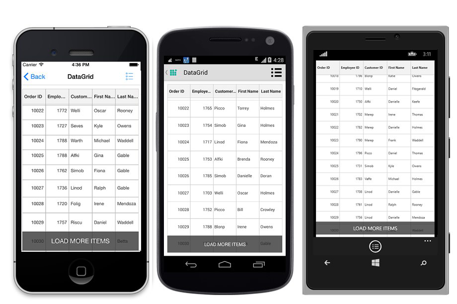
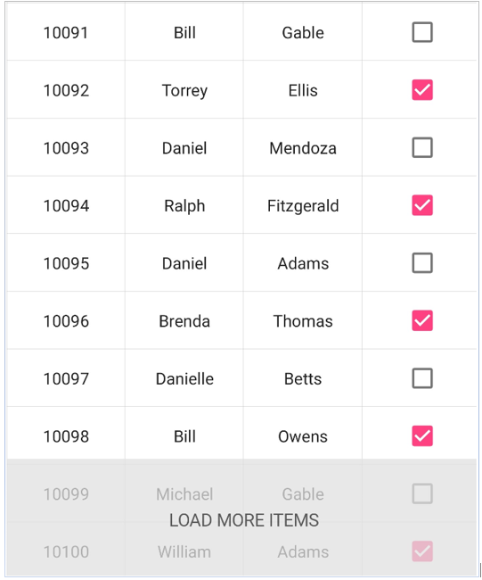
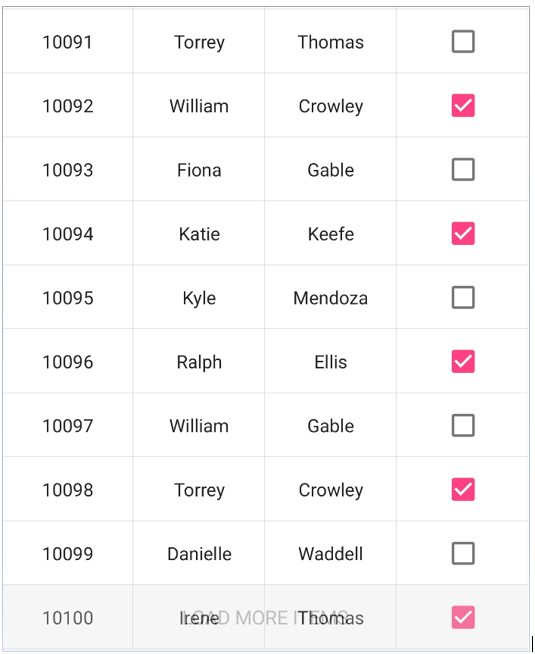

# Load More

The data grid enables `LoadMore` option when the [SfDataGrid.AllowLoadMore](https://help.syncfusion.com/cr/xamarin/Syncfusion.SfDataGrid.XForms.SfDataGrid.html#Syncfusion_SfDataGrid_XForms_SfDataGrid_AllowLoadMore) property is set to `true`, and also by setting the [SfDataGrid.LoadMoreCommand](https://help.syncfusion.com/cr/xamarin/Syncfusion.SfDataGrid.XForms.SfDataGrid.html#Syncfusion_SfDataGrid_XForms_SfDataGrid_LoadMoreCommand) property. When `LoadMore` is enabled, the control loads a subset of data to its data source at runtime using [LoadMoreView](http://help.syncfusion.com/cr/xamarin/Syncfusion.SfDataGrid.XForms.LoadMoreView.html). 

When the grid reaches maximum offset while scrolling down, an interactive load more view is displayed. Tapping the load more view triggers a command to add more data to the data source of the grid at runtime.

## Load more command

The data grid load records to its data source at runtime by triggering an `ICommand` bound to the `SfDataGrid.LoadMoreCommand` property. When the load more view is tapped, the `CanExecute` of the `ICommand` returns `true`, and this command is triggered to load the records at runtime.
 
Set the [SfDataGrid.IsBusy](https://help.syncfusion.com/cr/xamarin/Syncfusion.SfDataGrid.XForms.SfDataGrid.html#Syncfusion_SfDataGrid_XForms_SfDataGrid_IsBusy) property to `true` before loading items to notify the grid that more items are to be loaded. Set the property to `false` after loading items to the grid. When loading items, alter the time for the `LoadMore` animation from the sample by setting a delay based on the requirement.

To enable and load items at runtime, follow the code example:


//Enable load more in SfDataGrid
dataGrid.AllowLoadMore = true;
dataGrid.LoadMoreCommand = new Command(ExecuteLoadMoreCommand);
 
private async void ExecuteLoadMoreCommand()
{
    this.dataGrid.IsBusy = true;
    await Task.Delay(new TimeSpan(0, 0, 5));
    viewModel.LoadMoreItems ();
    this.dataGrid.IsBusy = false;
} 

//ViewModel.cs
private OrderInfoRepository order;
public ViewModel()
{
    SetRowsToGenerate(50);
}

//ItemsSource
private ObservableCollection<OrderInfo> ordersInfo;

public ObservableCollection<OrderInfo> OrdersInfo
{
    get { return ordersInfo; }
    set { this.ordersInfo = value; }
}

//ItemsSource Generator
public void SetRowsToGenerate(int count)
{
    order = new OrderInfoRepository();
    ordersInfo = order.GetOrderDetails(count);
}

public void LoadMoreItems()
{
    for (int i = 0; i < 20; i++)
        this.OrdersInfo.Add(order.GenerateOrder(OrdersInfo.Count + 1));
}

//OrderInfoRepository.cs
public ObservableCollection<OrderInfo> GetOrderDetails (int count)
{
    ObservableCollection<OrderInfo> orderDetails = new ObservableCollection<OrderInfo> ();

    for (int i = 10001; i <= count + 10000; i++) {
        var order = new OrderInfo () {
            OrderID = i,
            CustomerID = CustomerID [random.Next (7)],
            EmployeeID = random.Next (1700, 1800).ToString (),
            FirstName = FirstNames [random.Next (7)],
            LastName = LastNames [random.Next (7)]
        };
        orderDetails.Add (order);
    }
    return orderDetails;
} 

public OrderInfo GenerateOrder(int id)
{
    var order = new OrderInfo(){
        OrderID = (id + 10000),
        CustomerID = CustomerID [random.Next (15)],
        EmployeeID = random.Next (1700, 1800).ToString (),
        FirstName = FirstNames [random.Next (15)],
        LastName = LastNames [random.Next (15)],
    };
    return order;
}

//Main DataSources
string[] FirstNames = new string[] {
    "Kyle"
    "Gina",
    "Irene",
    "Katie",
    "Michael",
    "Oscar",
    "Ralph"
};

string[] LastNames = new string[] {
    "Adams",
    "Crowley",
    "Ellis",
    "Gable",
    "Irvine",
    "Keefe",
    "Mendoza"
};

string[] CustomerID = new string[] {
    "Adams",
    "Frans",
    "Katie",
    "Laura",
    "Wilson",
    "Andrew",
    "Lenny"
};


## Customize load more display text

Customize the text displayed in the `LoadMoreView` by setting the [SfDataGrid.LoadMoreText](https://help.syncfusion.com/cr/xamarin/Syncfusion.SfDataGrid.XForms.SfDataGrid.html#Syncfusion_SfDataGrid_XForms_SfDataGrid_LoadMoreText) property as follows:


//setting load more text in SfDataGrid
dataGrid.LoadMoreText = "Load More Items"; 


## Customize load more view position

Customize the displayed `LoadMoreView` to either `top` or `bottom` based on the requirement.
 

//Enable load more in SfDataGrid
dataGrid.LoadMorePosition = LoadMoreViewPosition.Bottom;  


## Customize LoadMoreView

### Custom LoadMore View

The data grid also customizes `LoadMoreView` based on the requirements. To do this, write custom `LoadMoreView` class inheriting from `LoadMoreView`, and perform the `LoadMoreOperation`.

To customize `LoadMoreView`, follow the code example:
 

public class CustomLoadMoreView : LoadMoreView
{
    private Button loadMoreView;

    public CustomLoadMoreView()
    {
        this.BackgroundColor = Color.Red;
        loadMoreView = new Button ();
        loadMoreView.Text = "LoadItems";
        this.Children.Add(loadMoreView);
        loadMoreView.Clicked += loadMoreView_Tapped;
    }

    void loadMoreView_Tapped (object sender, EventArgs e)
    {
        if (this.LoadMoreCommand != null)
        {
            this.LoadMoreCommand.Execute(null);
        }
    }

    protected override void LayoutChildren(double x, double y, double width, double height)
    {
        loadMoreView.Layout(new Rectangle(x, y, width, height));
    }
}


Running application renders the following output:

You can download a readily runnable sample that illustrates enabling and using the load more functionality, [here](http://www.syncfusion.com/downloads/support/directtrac/general/ze/SfDataGridSample733433326).

### Customize size

The data grid allows to customize the size of the [LoadMoreView](https://help.syncfusion.com/cr/xamarin/Syncfusion.SfDataGrid.XForms.LoadMoreView.html) by setting the [LoadMoreView.HeightRequest](https://docs.microsoft.com/en-us/dotnet/api/xamarin.forms.visualelement.heightrequest?view=xamarin-forms) and [LoadMoreView.WidthRequest](https://docs.microsoft.com/en-us/dotnet/api/xamarin.forms.visualelement.widthrequest?view=xamarin-forms) properties. Refer the below code example to customize the width and height of the `LoadMoreView`. 



 dataGrid.LoadMoreView.HeightRequest = 105;
 // Below code changes the width of the LoadMoreView
 // dataGrid.LoadMoreView.WidthRequest = 150;



The following screenshot shows the customized LoadMoreView size

### Customize opacity

The data grid also allows to customize the opacity of the [LoadMoreView](https://help.syncfusion.com/cr/xamarin/Syncfusion.SfDataGrid.XForms.LoadMoreView.html) by setting the [LoadMoreView.Opacity](https://docs.microsoft.com/en-us/dotnet/api/xamarin.forms.visualelement.opacity?view=xamarin-forms) property. Refer the below code example to customize the opacity of the `LoadMoreView`.



 dataGrid.LoadMoreView.Opacity = 0.9;



The following screenshot shows the customized LoadMoreView opacity

