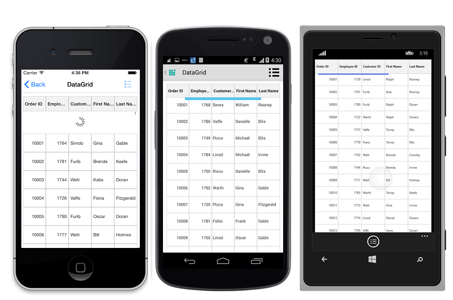
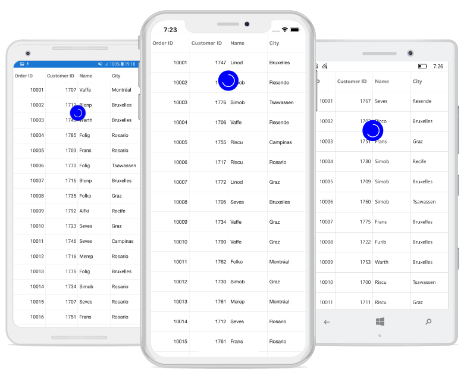

# Pull To Refresh

The data grid enables the `PullToRefresh` option by setting the [SfDataGrid.AllowPullToRefresh](https://help.syncfusion.com/cr/xamarin/Syncfusion.SfDataGrid.XForms.SfDataGrid.html#Syncfusion_SfDataGrid_XForms_SfDataGrid_AllowPullToRefresh) property to `true` and by setting the [SfDataGrid.PullToRefreshCommand](https://help.syncfusion.com/cr/xamarin/Syncfusion.SfDataGrid.XForms.SfDataGrid.html#Syncfusion_SfDataGrid_XForms_SfDataGrid_PullToRefreshCommand) property. When the `PullToRefresh` is enabled, the control supports for refreshing the data source at runtime while doing the pull to refresh action. 

## Pull to refresh command

The data grid refreshes the data in view at runtime by triggering an `ICommand` bound to the `SfDataGrid.PullToRefreshCommand` property. While you perform pull to refresh action, if the progress bar meets 100 %, then this command is triggered to refresh the records in view. 

Set the [SfDataGrid.IsBusy](https://help.syncfusion.com/cr/xamarin/Syncfusion.SfDataGrid.XForms.SfDataGrid.html#Syncfusion_SfDataGrid_XForms_SfDataGrid_IsBusy) property to `true` before refreshing the records to notify the grid that pull to refresh action is being performed and set the property to `false` after the view is refreshed. You can also alter the pull to refresh animation time from the sample by setting a delay.

To enable and perform pull to refresh operation, follow the code example:




//Enable PullToRefresh in SfDataGrid
dataGrid.AllowPullToRefresh = true;
dataGrid.PullToRefreshCommand = new Command(ExecutePullToRefreshCommand);
 
private async void ExecutePullToRefreshCommand()
{
    this.dataGrid.IsBusy = true;
    await Task.Delay(new TimeSpan(0, 0, 5));
    viewModel.ItemsSourceRefresh ();
    this.dataGrid.IsBusy = false;
} 

//ViewModel.cs
private OrderInfoRepository order;
public ViewModel()
{
    SetRowsToGenerate(50);
}

//ItemsSource
private ObservableCollection<OrderInfo> ordersInfo;

public ObservableCollection<OrderInfo> OrdersInfo
{
    get { return ordersInfo; }
    set { this.ordersInfo = value; }
}

//ItemsSource Generator
public void SetRowsToGenerate(int count)
{
    order = new OrderInfoRepository();
    ordersInfo = order.GetOrderDetails(count);
}

public void ItemsSourceRefresh()
{
    int count = random.Next (1, 6);

    for (int i = 11000; i < 11000 + count; i++) 
    {
        int value = i + random.Next (100, 150);
        this.OrdersInfo.Insert (0, order.RefreshItemsSource (value));
    }
} 

//OrderInfoRepository.cs
public ObservableCollection<OrderInfo> GetOrderDetails (int count)
{
    ObservableCollection<OrderInfo> orderDetails = new ObservableCollection<OrderInfo> ();

    for (int i = 10001; i <= count + 10000; i++) {
        var order = new OrderInfo () {
            OrderID = i,
            CustomerID = CustomerID [random.Next (7)],
            EmployeeID = random.Next (1700, 1800).ToString (),
            FirstName = FirstNames [random.Next (7)],
            LastName = LastNames [random.Next (7)]
        };
        orderDetails.Add (order);
    }
    return orderDetails;
}

public OrderInfo RefreshItemsource(int i)
{
    var order = new OrderInfo(){
        OrderID = i,
        CustomerID = CustomerID[random.Next(7)],
        EmployeeID = random.Next(1700, 1800).ToString(),
        FirstName = FirstNames[random.Next(7)],
        LastName = LastNames[random.Next(7)]
    };
    return order;
}

//Main DataSources
string[] FirstNames = new string[] {
    "Kyle",
    "Gina",
    "Irene",
    "Katie",
    "Michael",
    "Oscar",
    "Ralph"
};

string[] LastNames = new string[] {
    "Adams",
    "Crowley",
    "Ellis",
    "Gable",
    "Irvine",
    "Keefe",
    "Mendoza"
};

string[] CustomerID = new string[] {
    "Hanna",
    "Frans",
    "Maria",
    "John",
    "Andrew",
    "Fuller",
    "Carter"
};




Running application renders the following output:

## Host the data grid inside pull-to-refresh

The pull-to-refresh is a refreshing control allows you to interact and refresh the view loaded in it. When the control is hosted inside the pull-to-refresh, it is used to refresh the item while performing the pull to refresh action. 

For more details and code example for hosting the SfDataGrid inside SfPullToRefresh, refer [here](https://help.syncfusion.com/xamarin/sfpulltorefresh/customization#host-sfdatagrid-as-pullable-content).

The output will look like on iOS, Android, and Windows Phone devices as follows:

