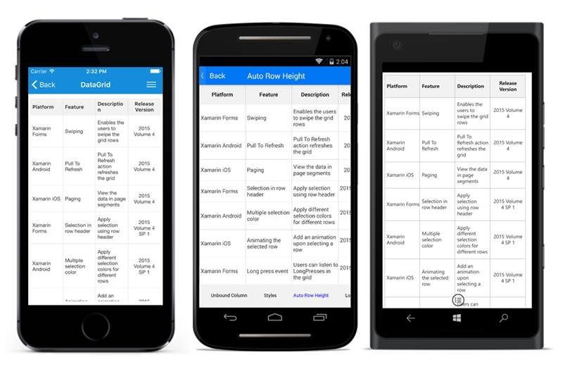
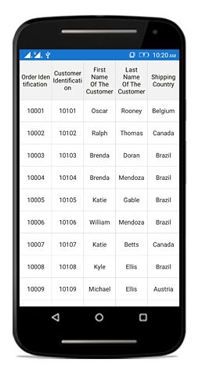
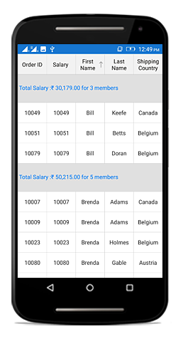
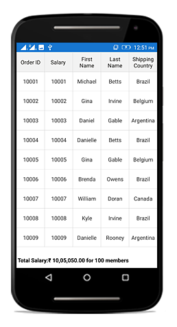

# Row Height Customization in Xamarin DataGrid (SfDataGrid)

The data grid provides an option to customize the header row height and the row height of all the grid rows or a particular row. To achieve this customization, see the following sections:

## Customize HeaderRowHeight 

The data grid allows you to customize the height of the header row by setting the [SfDataGrid.HeaderRowHeight](https://help.syncfusion.com/cr/xamarin/Syncfusion.SfDataGrid.XForms.SfDataGrid.html#Syncfusion_SfDataGrid_XForms_SfDataGrid_HeaderRowHeight) property. The default value of this property is 40. This property responds to runtime changes, so it can be customized. Setting `SfDatagrid.HeaderRowHeight` to zero will collapse the header row in the view.

To customize the header row height, follow the code example:



//Customizing header row height in SfDataGrid
dataGrid.HeaderRowHeight = 50;  


## Customize RowHeight for all rows

The data grid allows you to customize the height of grid rows in the scrolling region by setting the [SfDataGrid.RowHeight](https://help.syncfusion.com/cr/xamarin/Syncfusion.SfDataGrid.XForms.SfDataGrid.html#Syncfusion_SfDataGrid_XForms_SfDataGrid_RowHeight) property. The default value of this property is 50. This property responds to runtime changes, so it can be customized. Setting this property will change the height of all the rows in a body region with a common value. Setting `SfDataGrid.RowHeight` to zero will collapse all rows in the grid.

To customize header row height, follow the code example:


//Customizing row height in SfDataGrid
dataGrid.RowHeight = 60;


### QueryRowHeight

The `SfDatagrid.QueryRowHeight` event returns row heights on demand. This event receives two arguments, namely the sender handles the data grid, and the [QueryRowHeightEventArgs](http://help.syncfusion.com/cr/xamarin/Syncfusion.SfDataGrid.XForms.QueryRowHeightEventArgs.html). The `QueryRowHeightEventArgs` has the following properties:

 * [RowIndex](https://help.syncfusion.com/cr/xamarin/Syncfusion.SfDataGrid.XForms.QueryRowHeightEventArgs.html#Syncfusion_SfDataGrid_XForms_QueryRowHeightEventArgs_RowIndex): This property helps to identify a particular row in the grid.
 * [Height](https://help.syncfusion.com/cr/xamarin/Syncfusion.SfDataGrid.XForms.QueryRowHeightEventArgs.html#Syncfusion_SfDataGrid_XForms_QueryRowHeightEventArgs_RowIndex): This property sets and returns the height of a grid row on demand. Default line size of the rows is 50.
 * [Handled](https://help.syncfusion.com/cr/xamarin/Syncfusion.SfDataGrid.XForms.QueryRowHeightEventArgs.html#Syncfusion_SfDataGrid_XForms_QueryRowHeightEventArgs_RowIndex): This property decides whether the specified height can be set to the row or not. The default value is `false`. When this property is not set, the decided height is not set to the row.

To hook the `SfDatagrid.QueryRowHeight` event, and customize height of a row, follow the code example:


//Hooks QueryRowHeight event in SfDataGrid
dataGrid.QueryRowHeight += DataGrid_QueryRowHeight;  

//Event to set the row height on demand
void DataGrid_QueryRowHeight (object sender, QueryRowHeightEventArgs e)
{
    //Sets height of the fifth row
    if (e.RowIndex == 5) {
        e.Height = 100;
        e.Handled = true;
    }
} 


### QueryRowHeights customization

The data grid allows you to query a range of rows programmatically by using the `SfDataGrid.QueryRowHeights` method. 

QueryRowHeights has two arguments: start index and end index.

* Start index: Indicates from which row index the `SfDataGrid.QueryRowHeight` event has to fire.
* End index: Indicates the end row index for the `SfDataGrid.QueryRowHeight` event to fire.

To customize the row height for a range of rows, follow the code example:



//Customizing the QueryRowHeights in data grid
dataGrid.QueryRowHeights(2,5);
//Its starts to query the rows from the second row to the fifth row.


## GridRowSizingOptions

The data grid allows you to customize the height of grid rows with various customizing options while auto calculating the row height based on the content using the `GridRowSizingOptions`.

### Calculate height based on certain columns

The data grid allows you to calculate the row height excluding certain columns using the `ExcludeColumns` property.

The following code example illustrates calculating the height of grid rows based on certain columns:


 
 private void DataGrid_QueryRowHeight(object sender, QueryRowHeightEventArgs e)
{
    GridRowSizingOptions options = new GridRowSizingOptions();
    options.ExcludeColumns.Add("Description");
    options.ExcludeColumns.Add("CustomerID");
    if (e.RowIndex == 0)
    {
        e.Height = 50;
    }
    else
    {
        e.Height = dataGrid.GetRowHeight(e.RowIndex, options);
    }
    e.Handled = true;
}


### Calculate height including hidden columns 

Data grid allows you to calculate the row height based on content including or excluding hidden columns using the `CanIncludeHiddenColumns` property.

To calculate the height including hidden columns, follow the code example:


 
 private void DataGrid_QueryRowHeight(object sender, QueryRowHeightEventArgs e)
{
    GridRowSizingOptions options = new GridRowSizingOptions();
    options.CanIncludeHiddenColumns = true;
    if (e.RowIndex == 0)
    {
        e.Height = 50;
    }
    else
    {
        e.Height = dataGrid.GetRowHeight(e.RowIndex, options);
    }
    e.Handled = true;
}


## Reset row height at runtime

The data grid allows you to customize the height of a grid row on demand by handling the [SfDataGrid.QueryRowHeight](https://help.syncfusion.com/cr/xamarin/Syncfusion.SfDataGrid.XForms.SfDataGrid.html) event. This event is raised for the grid rows whenever they come into view. So the height of a particular row can be customized on demand using the row index. Setting the height to zero will collapse all rows in the grid. 
  
## Auto fit the grid rows based on content

The data grid supports the AutoRowHeight feature. The height of a row can be customized based on the content. This can be achieved using the `SfDatagrid.QueryRowHeight` event and the [SfDatagrid.GetRowHeight](http://help.syncfusion.com/cr/xamarin/) method. The `SfDatagrid.QueryRowHeight` event returns the row height on demand. The `SfDatagrid.GetRowHeight` method returns the height of the row based on the content.

N> The row drag and drop operation is not supported while customizing the row height based on content.

To hook the `SfDatagrid.QueryRowHeight` event and auto fit the height of a row based on content, follow the code example:


//Hooks QueryRowHeight event in SfDataGrid to set the row height on demand
dataGrid.QueryRowHeight += DataGrid_QueryRowHeight;

private void DataGrid_QueryRowHeight (object sender, QueryRowHeightEventArgs e)
{
    if (e.RowIndex != 0) 
    {
        //Calculates and sets the height of the row based on its content.
        e.Height = dataGrid.GetRowHeight(e.RowIndex);
        e.Handled = true;
    }
} 


## Customize header row height based on header content

The data grid allows you to customize the height of the header row based on its content using the `SfDatagrid.QueryRowHeight` event and [SfDatagrid.GetRowHeight](http://help.syncfusion.com/cr/xamarin) method.

To hook the `SfDatagrid.QueryRowHeight` event and change the header row height based on the content, follow the code example:


//Hooks QueryRowHeight event in SfDataGrid to set the header row height on demand
dataGrid.QueryRowHeight += DataGrid_QueryRowHeight;

private void DataGrid_QueryRowHeight(object sender, QueryRowHeightEventArgs e)
{
    if (e.RowIndex == dataGrid.GetHeaderIndex())
    {
        e.Height = dataGrid.GetRowHeight(e.RowIndex);
        e.Handled = true;
    }
}


## Customize caption summary row height

The data grid allows you to customize the height of the `CaptionSummaryRow` by setting the height of the caption rows in the `SfDataGrid.QueryRowHeight` event. By default, the `CaptionSummaryRow` renders with the height of the [SfDataGrid.RowHeight](https://help.syncfusion.com/cr/xamarin/Syncfusion.SfDataGrid.XForms.SfDataGrid.html#Syncfusion_SfDataGrid_XForms_SfDataGrid_RowHeight), which is `50`. 

To customize the CaptionSummaryRow height, follow the code example:


//Hooks QueryRowHeight event in SfDataGrid to set the CaptionSummaryRow height on demand
dataGrid.QueryRowHeight += DataGrid_QueryRowHeight;

private void DataGrid_QueryRowHeight(object sender, QueryRowHeightEventArgs e)
{
    if (dataGrid.IsCaptionSummaryRow(e.RowIndex))
    {
        e.Height = 70;
        e.Handled = true;
    }
}


## Change TableSummaryRow height

The data grid allows you to customize the height of the `TableSummaryRow` by setting the height of the table summary rows in the `SfDataGrid.QueryRowHeight` event. By default, the `TableSummaryRow` renders with the height of the [SfDataGrid.RowHeight](https://help.syncfusion.com/cr/xamarin/Syncfusion.SfDataGrid.XForms.SfDataGrid.html#Syncfusion_SfDataGrid_XForms_SfDataGrid_RowHeight), which is `50`. 

To customize header row height, follow the code example:


//Hooks QueryRowHeight event in DataGrid to set the CaptionSummaryRow height on demand
dataGrid.QueryRowHeight += DataGrid_QueryRowHeight;

private void DataGrid_QueryRowHeight(object sender, QueryRowHeightEventArgs e)
{
    if (dataGrid.IsTableSummaryRow(e.RowIndex))
    {
        e.Height = 70;
        e.Handled = true;
    }
}


## How to optimize performance when using QueryRowHeight event

By default, the `SfDataGrid.QueryRowHeight` event will be fired each time a row comes into view. If you want to prevent the same row from being queried again, you can check if the `Height` property in the `QueryRowHeightEventArgs` is not equal to the `SfDataGrid.RowHeight` property, which prevents the same row from being queried again. To enhance performance by preventing the same row from being queried again, follow the code example:


//Hooks QueryRowHeight event in DataGrid to set the row height on demand
dataGrid.QueryRowHeight += DataGrid_QueryRowHeight;

private void DataGrid_QueryRowHeight (object sender, QueryRowHeightEventArgs e)
{
    // Code to skip querying of a row if already queried
    if (e.Height != dataGrid.RowHeight)
        return;
    if (e.RowIndex != 0) 
    {
        //Calculates and sets the height of the row based on its content.
        e.Height = dataGrid.GetRowHeight(e.RowIndex);
        e.Handled = true;
    }
} 


## Limitations

When setting `SfDataGrid.ScrollingMode` to `ScrollingMode.Line`, the `SfDataGrid.QueryRowHeight` event is not supported.

## See also

[How to adjust row heights of each row based on their content](https://www.syncfusion.com/kb/7446)
