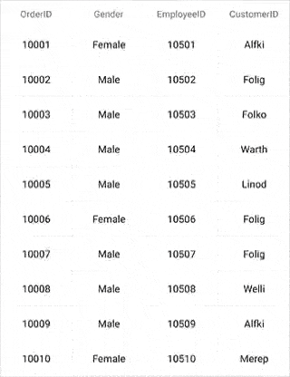
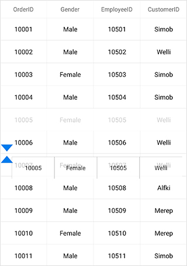

# Row Drag and Drop in Xamarin DataGrid (SfDataGrid)

The data grid allows you to drag and drop a row by setting the [SfDataGrid.AllowDraggingRow](https://help.syncfusion.com/cr/xamarin/Syncfusion.SfDataGrid.XForms.SfDataGrid.html#Syncfusion_SfDataGrid_XForms_SfDataGrid_AllowDraggingRow) property to `true`. A customizable row drag-and-drop template is displayed while dragging a row. Drag-and-drop operations can be handled using the [SfDataGrid.QueryRowDragging](https://help.syncfusion.com/cr/xamarin/Syncfusion.SfDataGrid.XForms.SfDataGrid.html) event. 

To enable row drag and drop, follow the code example:



<syncfusion:SfDataGrid AllowDraggingRow="True" />


dataGrid.AllowDraggingRow = true;



## Dragging scenarios

The data grid performs drag-and-drop operations with both data rows and groups as in the following scenarios:

 * Records can be reordered to any position with auto scrolling.
 * Group position can be reordered using drag and drop. But no groups can be added inside other groups. 
 * Data rows can be reordered within the same group or into other groups, as well. 

N> Reordering changes are made only in the [SfDataGrid.View](https://help.syncfusion.com/cr/xamarin/Syncfusion.SfDataGrid.XForms.SfDataGrid.html#Syncfusion_SfDataGrid_XForms_SfDataGrid_View), and not in the underlying data. Thus, the changes will be reverted when performing sorting, grouping, or any other operation refreshing the view. Reordering changes in the underlying data can be achieved by handling a `QueryRowDragging` event in the sample side as explained below in [Reordering underlying data](# Reordering underlying data ).

N> Now you can drag and drop the grid rows using your mouse in the UWP (Desktop) platform.

## Row drag-and-drop template

The data grid allows you to load desired content when performing row drag-and-drop operations using the [SfDataGrid.RowDragDropTemplate](https://help.syncfusion.com/cr/xamarin/Syncfusion.SfDataGrid.XForms.SfDataGrid.html#Syncfusion_SfDataGrid_XForms_SfDataGrid_RowDragDropTemplate). The template can be defined either in code or XAML. 

## Default template

The default template will be loaded if another template is not explicitly assigned for row drag-and-drop operations. 

## Customizing row drag-and-drop template

Any type of custom view can be loaded inside the [SfDataGrid.RowDragDropTemplate](https://help.syncfusion.com/cr/xamarin/Syncfusion.SfDataGrid.XForms.SfDataGrid.html#Syncfusion_SfDataGrid_XForms_SfDataGrid_RowDragDropTemplate).

Refer to the following code example that shows how to load a view in a template:



<sfgrid:SfDataGrid.RowDragDropTemplate>
    <DataTemplate>
        <sfgrid:BorderView BackgroundColor="White" BorderColor="Black">
            <sfgrid:BorderView.Content>
                <local:RowTemplate />
            </sfgrid:BorderView.Content>
        </sfgrid:BorderView>
    </DataTemplate>
</sfgrid:SfDataGrid.RowDragDropTemplate>





//Row template with a custom view representing rows.

public class RowTemplate : Grid
{        
    #region Constructor

    public RowTemplate()
    {
        this.BackgroundColor = Color.White;
        this.Children.Add(CreateLabel("OrderID"));
        this.Children.Add(new BoxView() { Color = Color.Gray, WidthRequest = 1 });
        this.Children.Add(CreateLabel("EmployeeID"));
        this.Children.Add(new BoxView() { Color = Color.Gray, WidthRequest = 1 });
        this.Children.Add(CreateLabel("CustomerID"));
        this.Children.Add(new BoxView() { Color = Color.Gray, WidthRequest = 1 });
        this.Children.Add(CreateLabel("FirstName"));
        this.Children.Add(new BoxView() { Color = Color.Gray, WidthRequest = 1 });
        this.Children.Add(CreateLabel("LastName"));
    }

    #endregion

    #region Private Method

    private ContentView CreateLabel(string Property)
    {
        var label = new Label();
        label.TextColor = Color.Black;
        label.LineBreakMode = LineBreakMode.NoWrap;
        label.FontSize = 12;
        label.HorizontalTextAlignment = TextAlignment.Center;
        label.VerticalTextAlignment = TextAlignment.Center;
        label.SetBinding(Label.TextProperty, Property);
        return new ContentView() { Content = label };
    }

    #endregion

    #region Override Method

    protected override void LayoutChildren(double x, double y, double width, double height)
    {
        foreach (var child in Children)
        {
            if (Device.OS == TargetPlatform.Android || Device.OS == TargetPlatform.iOS)
            {
                if (child is ContentView)
                    child.Layout(new Rectangle(x, y, (width / ((Children.Count + 1) / 2)) - 0.5, height));
                else
                    child.Layout(new Rectangle(x, y, 0.5, height));
            }
            else
            {
                if (child is ContentView)
                    child.Layout(new Rectangle(x, y, (width / ((Children.Count + 1) / 2)) - 1, height));
                else
                    child.Layout(new Rectangle(x, y, 1, height));

            }
            x += child.Width;
        }
    }

    #endregion
}




N> Currently, the row drag-and-drop features cannot be used if different rows sets with different heights using the [QueryRowHeight](https://help.syncfusion.com/cr/xamarin/Syncfusion.SfDataGrid.XForms.SfDataGrid.html) event. 

You can download the customizing row drag-and-drop template sample [here](http://www.syncfusion.com/downloads/support/directtrac/general/ze/RowDragandDrop865318434).

## Events in row drag-and-drop

The `QueryRowDragging` event is fired upon starting to drag a row and will be continuously fired until the dragging ends. By handling the [SfDataGrid.QueryRowDragging](https://help.syncfusion.com/cr/xamarin/Syncfusion.SfDataGrid.XForms.SfDataGrid.html) event, you can also cancel the dragging of a particular row.

The `QueryRowDragging` event provides the following properties in [QueryRowDraggingEventArgs](http://help.syncfusion.com/cr/xamarin/Syncfusion.SfDataGrid.XForms.QueryRowDraggingEventArgs.html):

 * [From](https://help.syncfusion.com/cr/xamarin/Syncfusion.SfDataGrid.XForms.QueryRowDraggingEventArgs.html#Syncfusion_SfDataGrid_XForms_QueryRowDraggingEventArgs_From): Returns index of the currently being dragged row.
 * [To](https://help.syncfusion.com/cr/xamarin/Syncfusion.SfDataGrid.XForms.QueryRowDraggingEventArgs.html#Syncfusion_SfDataGrid_XForms_QueryRowDraggingEventArgs_To): Returns the dragging index where you try to drop the row.
 * [Position](https://help.syncfusion.com/cr/xamarin/Syncfusion.SfDataGrid.XForms.QueryRowDraggingEventArgs.html#Syncfusion_SfDataGrid_XForms_QueryRowDraggingEventArgs_Position): Returns current x and y coordinates of the RowDragView.
 * [Reason](https://help.syncfusion.com/cr/xamarin/Syncfusion.SfDataGrid.XForms.QueryRowDraggingEventArgs.html#Syncfusion_SfDataGrid_XForms_QueryRowDraggingEventArgs_Reason): Returns row dragging details as [QueryRowDraggingReason](http://help.syncfusion.com/cr/xamarin/Syncfusion.SfDataGrid.XForms.QueryRowDraggingReason.html).
 * [RowData](https://help.syncfusion.com/cr/xamarin/Syncfusion.SfDataGrid.XForms.QueryRowDraggingEventArgs.html#Syncfusion_SfDataGrid_XForms_QueryRowDraggingEventArgs_RowData): Returns the underlying data associated with the dragged row.
 * [CurrentRowData](https://help.syncfusion.com/cr/xamarin/Syncfusion.SfDataGrid.XForms.QueryRowDraggingEventArgs.html#Syncfusion_SfDataGrid_XForms_QueryRowDraggingEventArgs_CurrentRowData): Returns the corresponding row data over which the row drag view is currently placed.
  * [CanAutoScroll](https://help.syncfusion.com/cr/xamarin/Syncfusion.SfDataGrid.XForms.QueryRowDraggingEventArgs.html#Syncfusion_SfDataGrid_XForms_QueryRowDraggingEventArgs_CanAutoScroll): Returns whether auto-scrolling should happen when row drag view reaches the top or bottom of the `SfDataGrid`.
 * [Cancel](https://msdn.microsoft.com/en-us/library/system.componentmodel.canceleventargs_properties(v=vs.110).aspx): Returns the Boolean property to cancel the event.

## Cancel dragging of a particular row

Dragging of a particular row can be canceled using `QueryRowDraggingReason` argument of the `QueryRowDragging` event handler.




this.SfGrid.QueryRowDragging += SfGrid_QueryRowDragging;

private void SfGrid_QueryRowDragging(object sender, QueryRowDraggingEventArgs e)
{
    //e.From returns the index of the dragged row.
    //e.Reason returns the dragging status of the row.
    if (e.From == 1 && e.Reason == QueryRowDraggingReason.DragStarted)
        e.Cancel = true;
}




## Cancel dropping when dragging over particular rows

Dropping when dragging over particular rows can be canceled using `QueryRowDraggingReason` argument of the `QueryRowDragging` event handler.




this.SfGrid.QueryRowDragging += SfGrid_QueryRowDragging;

private void SfGrid_QueryRowDragging(object sender, QueryRowDraggingEventArgs e)
{
    //e.To returns the index of the current row.
    //e.Reason returns the dragging status of the row.
    if ((e.To > 5 || e.To < 10) &&
    (e.Reason == QueryRowDraggingReason.DragEnded || e.Reason == QueryRowDraggingReason.Dragging))
        e.Cancel = true;
}




## Cancel dropping of a particular row

Dropping of a particular row can be canceled using `QueryRowDraggingReason` argument of the `QueryRowDragging` event handler.




this.SfGrid.QueryRowDragging += SfGrid_QueryRowDragging;

private void SfGrid_QueryRowDragging(object sender, QueryRowDraggingEventArgs e)
{
    //e.From returns the index of the dragged row.
    //e.Reason returns the dragging status of the row.
    if (e.From == 1 && e.Reason == QueryRowDraggingReason.DragEnded)
        e.Cancel = true;
}




## Cancel dropping at a particular position

Dropping at a particular position can be canceled using `QueryRowDraggingReason` argument of the `QueryRowDragging` event handler.




this.SfGrid.QueryRowDragging += SfGrid_QueryRowDragging;

private void SfGrid_QueryRowDragging(object sender, QueryRowDraggingEventArgs e)
{
    //e.To returns the index of the current row.
    //e.Reason returns the dragging status of the row.
    if ((e.To == 5 || e.To == 7) && e.Reason == QueryRowDraggingReason.DragEnded)
        e.Cancel = true;
}




## Cancel dropping of a particular row in a position

Dropping of a particular row in a position can be canceled using `QueryRowDraggingReason` and `Position` arguments of the `QueryRowDragging` event handler. 




this.SfGrid.QueryRowDragging += SfGrid_QueryRowDragging;

private void SfGrid_QueryRowDragging(object sender, QueryRowDraggingEventArgs e)
{
     //e.To returns the index of the current row.
     //e.Position returns the x and y position of the current row
      if ((e.To == 3) && e.Position == new Point(927,1167) && e.Reason == QueryRowDraggingReason.DragEnded)
        e.Cancel = true;
}


   

## Cancel drag and drop between frozen and non-frozen rows

### Cancel dragging between frozen and non-frozen rows

Dragging between frozen and non-frozen rows can be canceled using `QueryRowDraggingReason` and `From` arguments of the `QueryRowDragging` event handler by checking whether the value of `From` argument is a frozen row index. 




SfGrid.FrozenRowsCount = 4;

this.SfGrid.QueryRowDragging += SfGrid_QueryRowDragging;

private void SfGrid_QueryRowDragging(object sender, QueryRowDraggingEventArgs e)
{
     //e.From returns the index of the dragged frozen row.
     //e.To returns the index of the current row.
      if    (e.From > sfGrid.GetHeaderIndex() && e.From <= sfGrid.FrozenRowsCount && e.Reason == QueryRowDraggingReason.DragStarted)
        e.Cancel = true;
}




### Cancel dropping between frozen and non-frozen rows

Dropping between frozen and non-frozen rows can be canceled using `QueryRowDraggingReason` and `From` arguments of the `QueryRowDragging` event handler by checking whether the value of `From` argument is a frozen row index. 




SfGrid.FrozenRowsCount = 4;

this.SfGrid.QueryRowDragging += SfGrid_QueryRowDragging;

private void SfGrid_QueryRowDragging(object sender, QueryRowDraggingEventArgs e)
{
      //e.From returns the index of the dragged frozen row.
      //e.To returns the index of the current row.
      if (e.From > sfGrid.GetHeaderIndex() && e.From <= sfGrid.FrozenRowsCount && e.Reason == QueryRowDraggingReason.DragEnded)
        e.Cancel = true;
}




N> FrozenRowsCount must be less than rows in view.

## Reorder the underlying data

Reordering changes directly on the underlying data can be done using `QueryRowDraggingReason` argument of the `QueryRowDragging` event handler. Refer to the following code sample to make permanent reordering changes:




this.SfGrid.QueryRowDragging += SfGrid_QueryRowDragging;

private void SfGrid_QueryRowDragging(object sender, QueryRowDraggingEventArgs e)
{
    //e.To returns the index of the current row.
    //e.From returns the index of the dragged row.
    if (e.Reason == QueryRowDraggingReason.DragEnded)
    {
        var collection = (sender as SfDataGrid).ItemsSource as IList;
        collection.RemoveAt(e.From - 1);
        collection.Insert(e.To - 1, e.RowData);
	    //To skip default collection change inside the SfDataGrid source for a successful drag and drop operation.
        e.Cancel = true;
    }
}




## Drop a grid row in the last position

The `To` property of the `QueryRowDraggingEventArgs` denotes the current drop index of the dragged row when dragging over the grid rows. It returns the same index when dragging a row over the rows in last position or last but one. In order to programmatically track whether the dragged row is dropped at the last position or last but one, the data grid provides the `Position` property in `QueryRowDraggingEventArgs`, which denotes the position of the RowDragView.

Refer to the following code example in which the `Position` property is used to determine whether the row is dropped in the last position or not:




this.SfGrid.QueryRowDragging += SfGrid_QueryRowDragging;

private void SfGrid_QueryRowDragging(object sender, QueryRowDraggingEventArgs e)
{
    var totalHeight = dataGrid.RowColumnIndexToPoint(new RowColumnIndex(viewModel.OrdersInfo.Count, 0)).Y + this.dataGrid.RowHeight;
    if (e.Reason == QueryRowDraggingReason.DragEnded)
    {
        if (Math.Ceiling(e.Position.Y + (dataGrid.RowHeight / 2)) > totalHeight && e.To == viewModel.OrdersInfo.Count)
        {
            //Will hit if the row is dropped at the last position                 
            DisplayAlert("RowDragAndDrop info", "The row is dropped at the last position", "OK");
        }
    }
}




## Customizing row drag-and-drop indicators

Data grid allows you to customize the row drag-and-drop indicators by writing a custom grid style, deriving from the [DataGridStyle](http://help.syncfusion.com/cr/xamarin/sfdatagrid/Syncfusion.SfDataGrid.XForms.DataGridStyle.html) and assigning it to the [SfDataGrid.GridStyle](https://help.syncfusion.com/cr/xamarin/Syncfusion.SfDataGrid.XForms.SfDataGrid.html#Syncfusion_SfDataGrid_XForms_SfDataGrid_GridStyle) property.




dataGrid.GridStyle = new CustomGridStyle();







// Custom style class
public class CustomGridStyle : DataGridStyle
{
    public CustomGridStyle()
    {

    }

    public override ImageSource GetRowDragUpIndicator()
    {
        return ImageSource.FromResource("DataGridDemo.icons.RedUp.png");
    }

    public override ImageSource GetRowDragDownIndicator()
    {
        return ImageSource.FromResource("DataGridDemo.icons.RedDown.png");
    }
}




## Updating summaries when dragging and dropping a row between groups

Grouping and summarization of items in the data grid are manipulated based on group key. When dragging an item from one group to another group, the group key of the dragged item will differ from the group key of the items in the dropped group. Thus, by default, the summaries will not be updated. This is the actual behavior of this control.

Hence, in order to update the summaries when a row is dragged and dropped between groups, call the `UpdateCaptionSummaries` and the `Refresh` methods in the `QueryRowDragging` event.



public partial class MainPage : ContentPage
{
    private SfDataGrid dataGrid;
    private ViewModel viewModel;
    public MainPage()
    {
         InitializeComponent();
         dataGrid = new SfDataGrid();
         viewModel = new ViewModel();
         dataGrid.ItemsSource = viewModel.OrdersInfo;
         dataGrid.QueryRowDragging += DataGrid_QueryRowDragging;
         this.Content = dataGrid;
    }
    private async void DataGrid_QueryRowDragging(object sender, QueryRowDraggingEventArgs e)
    {
         if (e.Reason == QueryRowDraggingReason.DragEnded)
         {
             // Delay is given for refreshing the view.
             await Task.Delay(100);                
             this.dataGrid.View.TopLevelGroup.UpdateCaptionSummaries();
             this.dataGrid.View.Refresh();
          }
    }
}



The following screenshot shows the output rendered when executing the above code example.

## Cancel auto scrolling 

Vertical auto-scrolling of the `SfDataGrid` during row drag and drop can be canceled using `CanAutoScroll` argument of the `QueryRowDragging` event handler.




this.SfGrid.QueryRowDragging += SfGrid_QueryRowDragging;

private void SfGrid_QueryRowDragging(object sender, QueryRowDraggingEventArgs e)
{  
    // Disable scroll while dragging the Rows.    
    e.CanAutoScroll = false;
}




## See also

[How to update the summaries when a row is dragged and dropped between groups](https://www.syncfusion.com/kb/7806)

