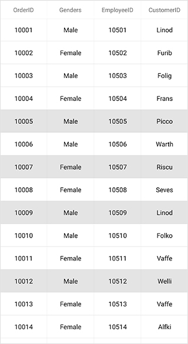
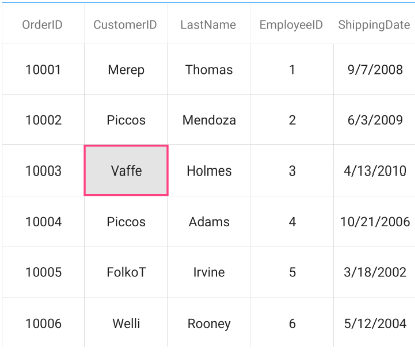
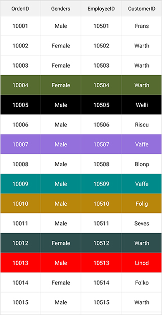
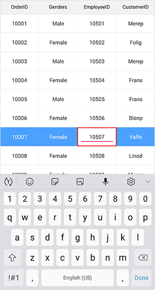

# Selection in Xamarin.Forms.DataGrid (SfDataGrid)

This section explains how to enable selection in the data grid; modes, properties, and events involved in selection; and customizations available for selection.

The data grid allows you to select one or more rows or cells. The [SfDataGrid.SelectionUnit](https://help.syncfusion.com/cr/xamarin/Syncfusion.SfDataGrid.XForms.SfDataGrid.html#Syncfusion_SfDataGrid_XForms_SfDataGrid_SelectionUnit) and [SfDataGrid.SelectionMode](https://help.syncfusion.com/cr/xamarin/Syncfusion.SfDataGrid.XForms.SfDataGrid.html#Syncfusion_SfDataGrid_XForms_SfDataGrid_SelectionMode) properties together defines the behavior of selection in data grid.

## Selection unit

<table>
<tr>
<th> Unit </th>
<th> Description </th>
</tr>
<tr>
<td> {{'[Row](https://help.syncfusion.com/cr/xamarin/Syncfusion.SfDataGrid.XForms.SelectionUnit.html)'| markdownify }} </td>
<td> Allows selection of a specific row or group of rows either programmatically or by touch interactions. Tapping on a cell selects the entire row. This is the default value. </td>
</tr>
<tr>
<td> {{'[Cell](https://help.syncfusion.com/cr/xamarin/Syncfusion.SfDataGrid.XForms.SelectionUnit.html)'| markdownify }} </td>
<td> Allows selection of a specific cell or group of cells either programmatically or by touch interactions. Tapping on a cell selects only that particular cell and not the entire row. </td>
</tr>
<tr>
<td> {{'[Any](https://help.syncfusion.com/cr/xamarin/Syncfusion.SfDataGrid.XForms.SelectionUnit.html)'| markdownify }} </td>
<td> Allows selection of both rows and cells. Tapping on the row header selects the entire row. Tapping on a cell selects only that particular cell. </td>
</tr>
</table>



<syncfusion:SfDataGrid x:Name="dataGrid"
                       ColumnSizer="Star"
                       AutoGenerateColumns="True"
                       SelectionUnit="Cell" 
                       ItemsSource="{Binding OrdersInfo}"/>


dataGrid.SelectionUnit = SelectionUnit.Cell; 



N> It is not possible to set `NavigationMode.Row` when cell selection is enabled (SelectionUnit is Cell or Any).

## Selection modes 

<table>
<tr>
<th> Modes </th>
<th> Description </th>
</tr>
<tr>
<td> {{'[None](http://help.syncfusion.com/cr/xamarin/Syncfusion.SfDataGrid.XForms.SelectionMode.html)'| markdownify }} </td>
<td>Disables selection, and no rows or cells can be selected. This is the default value.</td>
</tr>
<tr>
<td> {{'[Single](http://help.syncfusion.com/cr/xamarin/Syncfusion.SfDataGrid.XForms.SelectionMode.html)'| markdownify }} </td>
<td> Allows selection of a single row or cell only. Upon selecting the next row or cell, the selection in the previous row or cell is cleared. </td>
</tr>
<tr>
<td> {{'[Multiple](http://help.syncfusion.com/cr/xamarin/Syncfusion.SfDataGrid.XForms.SelectionMode.html)'| markdownify }}  </td>
<td> Allows selection of more than one row or cell. Selection is not cleared when selecting more than one row or cell. When you click on an already selected row or cell for the second time, the selection is cleared. </td>
</tr>
<tr>
<td>  {{'[SingleDeselect](http://help.syncfusion.com/cr/xamarin/Syncfusion.SfDataGrid.XForms.SelectionMode.html)'| markdownify }}  </td>
<td> Allows selection of a single row or cell only. However, upon tapping the row or cell again, the selection is cleared. Similar to single mode, upon selecting the next row or cell, the selection in the previous row or cell is cleared. </td>
</tr>
</table>



<syncfusion:SfDataGrid x:Name="dataGrid"
                       ColumnSizer="Star"
                       AutoGenerateColumns="True"
                       SelectionMode="Multiple" 
                       ItemsSource="{Binding OrdersInfo}"/>


dataGrid.SelectionMode = SelectionMode.Multiple; 



### Disable selection for rows and columns

You can disable selection and navigation for an entire column using the [GridColumn.AllowFocus](https://help.syncfusion.com/cr/xamarin/Syncfusion.SfDataGrid.XForms.GridColumn.html#Syncfusion_SfDataGrid_XForms_GridColumn_AllowFocus) property. You can disable selection in a particular row or cell or column by handling the [CurrentCellActivating](https://help.syncfusion.com/cr/xamarin/Syncfusion.SfDataGrid.XForms.SfDataGrid.html)  event. 

N> It is not possible to select caption summary rows, group summary rows, table summary rows, and unbound rows that are above the table summary row when they are placed at the top and the unbound rows that are below table summary rows when they placed at the bottom of SfDataGrid.

## Getting selected rows and cells

The SfDataGrid provides `SelectedIndex`, `SelectedItem`, and `CurrentItem` properties to get details of the selected rows or cells when the selection mode is `Single`, `Multiple`, and `SingleDeselect`.

* [SfDataGrid.SelectedItem](https://help.syncfusion.com/cr/xamarin/Syncfusion.SfDataGrid.XForms.SfDataGrid.html#Syncfusion_SfDataGrid_XForms_SfDataGrid_SelectedItem): Provides the underlying data object of the selected row or cell. Denotes the underlying data object of the first selected row or cell in multiple selection.
* [SfDataGrid.SelectedIndex](https://help.syncfusion.com/cr/xamarin/Syncfusion.SfDataGrid.XForms.SfDataGrid.html#Syncfusion_SfDataGrid_XForms_SfDataGrid_SelectedIndex): Provides the row index of `SfDataGrid.SelectedItem`. Denotes the index of first selected row or cell in multiple selection.
* [SfDataGrid.CurrentItem](https://help.syncfusion.com/cr/xamarin/Syncfusion.SfDataGrid.XForms.SfDataGrid.html#Syncfusion_SfDataGrid_XForms_SfDataGrid_CurrentItem): Provides the underlying data object of the currently selected row or cell in the data grid. Denotes the underlying data object of lastly selected row or cell in multiple selection.

### Row selection

When multiple rows are selected, the `SelectedItems` and `SelectionController.SelectedRows` properties provide information of all the selected rows.

* [SfDataGrid.SelectedItems](https://help.syncfusion.com/cr/xamarin/Syncfusion.SfDataGrid.XForms.SfDataGrid.html#Syncfusion_SfDataGrid_XForms_SfDataGrid_SelectedItems): Provides all the selected records of the selected items when multiple selection is enabled.
* [SfDataGrid.SelectionController.SelectedRows](https://help.syncfusion.com/cr/xamarin/Syncfusion.SfDataGrid.XForms.SfDataGrid.html#Syncfusion_SfDataGrid_XForms_SfDataGrid_SelectionController): Provides collection of the underlying model object(row data) of all the selected items.

### Cell selection

When multiple cells are selected, call the [SfDataGrid.GetSelectedCells()](https://help.syncfusion.com/cr/xamarin/Syncfusion.SfDataGrid.XForms.SfDataGrid.html#Syncfusion_SfDataGrid_XForms_SfDataGrid_GetSelectedCells) method to get information of all the selected cells.



var selectedCells = this.dataGrid.GetSelectedCells();



### CurrentItem vs SelectedItem

Both the [SelectedItem](https://help.syncfusion.com/cr/xamarin/Syncfusion.SfDataGrid.XForms.SfDataGrid.html#Syncfusion_SfDataGrid_XForms_SfDataGrid_SelectedItem) and [CurrentItem](https://help.syncfusion.com/cr/xamarin/Syncfusion.SfDataGrid.XForms.SfDataGrid.html#Syncfusion_SfDataGrid_XForms_SfDataGrid_CurrentItem) returns the same data object when the selection mode is single. When multiple selection is enabled, the initially selected record will be maintained in the `SelectedItem` and the currently selected record will be maintained in the `CurrentItem`.

## Programmatic selection

### Process selection using properties

When the selection mode is set a value other than `None`, programmatically select a row or cell in two ways either by setting the row index to the [SfDataGrid.SelectedIndex](https://help.syncfusion.com/cr/xamarin/Syncfusion.SfDataGrid.XForms.SfDataGrid.html#Syncfusion_SfDataGrid_XForms_SfDataGrid_SelectedIndex) property or by setting the underlying object to be selected to the [SfDataGrid.SelectedItem](https://help.syncfusion.com/cr/xamarin/Syncfusion.SfDataGrid.XForms.SfDataGrid.html#Syncfusion_SfDataGrid_XForms_SfDataGrid_SelectedItem) property.

If `SfDataGrid.SelectionUnit` is `Cell` or `Any` setting `SelectedIndex` or `SelectedItem` selects the first cell in the provided row index or row data respectively. If a cell is already selected, setting `SelectedIndex` or `SelectedItem` selects the same column in the newly provided row index or row data.

When `SelectionMode` is set as `Multiple`, select more than one row by setting the [SfDataGrid.SelectedItems](https://help.syncfusion.com/cr/xamarin/Syncfusion.SfDataGrid.XForms.SfDataGrid.html#Syncfusion_SfDataGrid_XForms_SfDataGrid_SelectedItems) property. The `SfDataGrid.SelectedItems` property cannot be used to select multiple cells.

To programmatically select a row from the code, follow the code example:


//Perform selection using selected index
dataGrid.SelectedIndex = 3;
 
//Perform selection using selected item
dataGrid.SelectedItem = viewModel.OrdersInfo [5];



When the selection mode is multiple, programmatically select more than one row by adding the underlying object to be selected to the `SfDataGrid.SelectedItems` property. 

To programmatically select more than one row from the code, follow the code example:


 
//Perform multiple selection using selected item
dataGrid.SelectedItems.Add (viewModel.OrdersInfo [4]);
dataGrid.SelectedItems.Add (viewModel.OrdersInfo [6]);
dataGrid.SelectedItems.Add (viewModel.OrdersInfo [9]);
dataGrid.SelectedItems.Add (viewModel.OrdersInfo [11]);



The following screenshot shows the selection functionality in the data grid:

### Process selection using methods

You can select a particular cell using the [SfDataGrid.SelectCell(rowData, gridColumn)](https://help.syncfusion.com/cr/xamarin/Syncfusion.SfDataGrid.XForms.SfDataGrid.html#Syncfusion_SfDataGrid_XForms_SfDataGrid_SelectCell_System_Object_Syncfusion_SfDataGrid_XForms_GridColumn_) method.


 
// Selects the cell at the given row and column.
this.sfDataGrid.SelectCell(this.dataGrid.GetRecordAtRowIndex(3), this.dataGrid.Columns[1]);



When the selection mode is multiple you can select a range of cells using the [SfDataGrid.SelectCells(startRowData, startColumn, endRowData, endColumn)](https://help.syncfusion.com/cr/xamarin/Syncfusion.SfDataGrid.XForms.SfDataGrid.html#Syncfusion_SfDataGrid_XForms_SfDataGrid_SelectCells_System_Object_Syncfusion_SfDataGrid_XForms_GridColumn_System_Object_Syncfusion_SfDataGrid_XForms_GridColumn_) method.


 
// Selects the range of cells that falls between the specified start/end row data and start/end column.
this.sfDataGrid.SelectCells(this.dataGrid.GetRecordAtRowIndex(3), this.dataGrid.Columns[1], this.dataGrid.GetRecordAtRowIndex(7), this.dataGrid.Columns[1]);



You can select all the cells and rows in the datagrid using [SfDataGrid.SelectAll()](https://help.syncfusion.com/cr/xamarin/Syncfusion.SfDataGrid.XForms.SfDataGrid.html#Syncfusion_SfDataGrid_XForms_SfDataGrid_SelectAll) method.

 
this.sfDataGrid.SelectAll();



## Keyboard behavior

`SfDataGrid` supports selection via keyboard interaction for the Xamarin.Forms.macOS and Xamarin.Forms.UWP platforms. Keyboard interaction will not have any effect when the `SfDataGrid.SelectionMode` is set as `SelectionMode.None`.

<table>
<tr>
<th>
Key or key combinations
</th>
<th>
Description
</th>
</tr>
<tr>
<td>
<kbd>DownArrow</kbd>
</td>
<td>
Moves selection to the next row directly below the currently selected row when the SelectionMode is Single. Upon reaching the bottom of screen, pressing down arrow scrolls and applies selection to the next row if grid has scrollable content. If the selected row is the last row of grid, pressing down arrow does nothing. In `Multiple` and `SingleDeselect` selection modes, if the next row has already been selected, pressing down arrow key will deselect the row.
</td>
</tr>
<tr>
<td>
<kbd>UpArrow</kbd>
</td>
<td>
Moves selection to the previous row directly above the currently selected row when the SelectionMode is Single. Upon reaching the top of screen, pressing up arrow scrolls and applies selection to the previous row if grid has scrollable content. If the selected row is the first row of grid, pressing up arrow does nothing. In `Multiple` and `SingleDeselect` selection modes, if the previous row has already been selected, pressing up arrow key will deselect the row.
</td>
</tr>
<tr>
<td>
<kbd>PageDown</kbd>
</td>
<td>
SfDataGrid will be scrolled to the next set of rows that are not displayed in view including the partially displayed row. If selection is applied to any row, pressing PageDown arrow will move selection to the last row of the next set of rows when the SelectionMode is Single.
</td>
</tr>
<tr>
<td>
<kbd>PageUp</kbd>
</td>
<td>
SfDataGrid will be scrolled to the previous set of rows that are not displayed in view including the partially displayed row. If the selection is applied to any row, pressing PageUp will move selection to the first row of the next set of rows when the SelectionMode is Single.
</td>
</tr>
<tr>
<td>
<kbd>Tab</kbd>
</td>
<td>
Moves selection to the next row directly below the currently selected row when the SelectionMode is Single. Upon reaching the bottom of screen, pressing Tab key scrolls and applies selection to the next row if grid has scrollable content. If the selected row is the last row of grid, pressing Tab key does nothing. In `Multiple` and `SingleDeselect` selection modes, if the next row has already been selected, pressing Tab key will deselect the row.
</td>
</tr>
<tr>
<td>
<kbd>Ctrl</kbd> + <kbd>Home</kbd> or <kbd>Ctrl</kbd> + <kbd>UpArrow</kbd> or <kbd>Home</kbd>
</td>
<td>
Scrolls grid to the first row of the collection.
</td>
</tr>
<tr>
<td>
<kbd>Ctrl</kbd> + <kbd>End</kbd> or <kbd>Ctrl</kbd> + <kbd>DownArrow</kbd> or <kbd>End</kbd>
</td>
<td>
Scrolls grid to the last row of the collection.
</td>
</tr>
<tr>
<td>
<kbd>Enter</kbd> or <kbd>Ctrl</kbd> + <kbd>Enter</kbd>
</td>
<td>
If the active current cell is in edit mode, changes will be committed and selection will be moved to the row below the active current cell. If the active current cell is in last row, commits changes and only editing is ended.
</td>
</tr>
<tr>
<td>
<kbd>Esc</kbd>
</td>
<td>
If the current cell is in edit mode, reverts the changes done in the current cell. If the underlying source implements the {{'[IEditableObject](https://msdn.microsoft.com/en-us/library/system.componentmodel.ieditableobject#"")'| markdownify }}, pressing Esc key for the second time will cancel the edit mode for the entire row.
</td>
</tr>
<tr>
<td>
<kbd>Delete</kbd>
</td>
<td>
Deletes all the rows that are currently in selection. To prevent rows from being deleted set the [SfDataGrid.AllowDeleting](https://help.syncfusion.com/cr/xamarin/Syncfusion.SfDataGrid.XForms.SfDataGrid.html#Syncfusion_SfDataGrid_XForms_SfDataGrid_AllowDeleting) as `False`.
</td>
</tr>
</table>

### Shift key combinations

<table>
<tr>
<th>
Key combinations
</th>
<th>
Description
</th>
</tr>
<tr>
<td>
<kbd>Shift</kbd> + <kbd>DownArrow</kbd>
</td>
<td>
If the Selection Mode is multiple, the next multiple rows will be continuously selected below the currently selected row. If the Selection Mode is Single or SingleDeselect, selection will be moved to the next row.
</td>
</tr>
<tr>
<td>
<kbd>Shift</kbd> + <kbd>UpArrow</kbd> 
</td>
<td>
If the Selection Mode is multiple, the previous multiple rows will be continuously selected above the currently selected row. If the Selection Mode is Single or SingleDeselect, selection will be moved to the previous row.
</td>
</tr>
<tr>
<td>
<kbd>Shift</kbd> + <kbd>Tab</kbd>
</td>
<td>
Moves selection to the previous row from the currently selected row when the SelectionMode is Single or SingleDeselect. If the selected row is in first row, pressing Shift +Tab does nothing.
</td>   
</tr>
</table>

### Customize key functionalities

To perform custom actions apart from the functionalities mentioned in the above tables for key press actions of the keyboard, implement your custom actions in the [ProcessKeyDown()](https://help.syncfusion.com/cr/xamarin/Syncfusion.SfDataGrid.XForms.GridSelectionController.html) override of the custom written selection controller class derived from [GridSelectionController](https://help.syncfusion.com/cr/xamarin/Syncfusion.SfDataGrid.XForms.GridSelectionController.html#) and assign it to the [SfDataGrid.GridSelectionController](https://help.syncfusion.com/cr/xamarin/Syncfusion.SfDataGrid.XForms.SfDataGrid.html#Syncfusion_SfDataGrid_XForms_SfDataGrid_SelectionController) property.



<ContentPage.Resources>
        <local:CustomSelectionController x:Key="CustomSelectionController" />
</ContentPage.Resources>

  <syncfusion:SfDataGrid x:Name="dataGrid"
                          ItemsSource="{Binding OrdersInfo,Mode=TwoWay}"
                          AllowEditing="True"
                          NavigationMode="Cell"
                          SelectionMode="Single"
                          SelectionController="{x:StaticResource CustomSelectionController}">
    </syncfusion:SfDataGrid>



dataGrid.SelectionController = new CustomSelectionController();





public class CustomSelectionController : GridSelectionController
    {
        public CustomSelectionController()
        {
           this.SelectedRows = new GridSelectedRowsCollection();
        }

        protected override void ProcessKeyDown(string keyCode, bool isCtrlKeyPressed, bool isShiftKeyPressed)
        {
            if(keyCode == "Down")
            {
                // your logics here
            }
            else
            {
                // default key action
                base.ProcessKeyDown(keyCode, isCtrlKeyPressed, isShiftKeyPressed);
            }
        }
    }



### Move Current Cell

The `CurrentCell` can be moved to a particular `RowColumnIndex` by using the [SfDataGrid.MoveCurrentCellTo()](https://help.syncfusion.com/cr/xamarin/Syncfusion.SfDataGrid.XForms.SfDataGrid.html#Syncfusion_SfDataGrid_XForms_SfDataGrid_MoveCurrentCellTo_Syncfusion_GridCommon_ScrollAxis_RowColumnIndex_System_Boolean_) method. This method is not applicable when the `SfDataGrid.SelectionMode` is `None` or `NavigationMode` is `Row`.



dataGrid.MoveCurrentCellTo(new RowColumnIndex(3, 3),false);



When the `SfDataGrid.SelectionMode` is `Multiple`, when moving the current cell, if you want to clear the selection of the currently selected items , pass true to the `needToClearSelection` parameter in the `MoveCurrentCellTo()` method.
 
 

dataGrid.MoveCurrentCellTo(new RowColumnIndex(4, 3),true);



### Scroll to selected item

You can scroll programmatically to the selected item by passing the `SelectedIndex` to the [SfDataGrid.ScrollToRowIndex](https://help.syncfusion.com/cr/xamarin/Syncfusion.SfDataGrid.XForms.SfDataGrid.html#Syncfusion_SfDataGrid_XForms_SfDataGrid_ScrollToRowIndex_System_Int32_System_Boolean_Xamarin_Forms_ScrollToPosition_) method.



dataGrid.ScrollToRowIndex((int)dataGrid.SelectedIndex);



## Clear selection

Data grid allows you to clear the selection applied in the grid rows and columns either by setting the `SfDataGrid.SelectionMode` to `None` or by calling the [SfDataGrid.SelectionController.ClearSelection()](https://help.syncfusion.com/cr/xamarin/Syncfusion.SfDataGrid.XForms.GridSelectionController.html#Syncfusion_SfDataGrid_XForms_GridSelectionController_ClearSelection) method.



//Clear selection using selection mode
dataGrid.SelectionMode = SelectionMode.None;

//Clear selection using selection controller
dataGrid.SelectionController.ClearSelection (); 



N> Selected items and selections will be cleared whenever the ItemsSource is changed at runtime.

You can un-select a particular cell using the [SfDataGrid.UnselectCell(rowData, gridColumn)](https://help.syncfusion.com/cr/xamarin/Syncfusion.SfDataGrid.XForms.SfDataGrid.html#Syncfusion_SfDataGrid_XForms_SfDataGrid_UnselectCell_System_Object_Syncfusion_SfDataGrid_XForms_GridColumn_) method.


 
// Un-selects the cell at the given row and column.
this.sfDataGrid.UnselectCell(this.dataGrid.GetRecordAtRowIndex(3), this.dataGrid.Columns[1]);



Similarly, you can un-select a range of cells using the [SfDataGrid.UnselectCells(startRowData, startColumn, endRowData, endColumn)](https://help.syncfusion.com/cr/xamarin/Syncfusion.SfDataGrid.XForms.SfDataGrid.html#Syncfusion_SfDataGrid_XForms_SfDataGrid_UnselectCells_System_Object_Syncfusion_SfDataGrid_XForms_GridColumn_System_Object_Syncfusion_SfDataGrid_XForms_GridColumn_) method.


 
// Un-selects the range of cells that falls between the specified start/end row data and start/end column.
this.sfDataGrid.UnselectCells(this.dataGrid.GetRecordAtRowIndex(3), this.dataGrid.Columns[1], this.dataGrid.GetRecordAtRowIndex(7), this.dataGrid.Columns[1]);



## Row header selection

By default, data grid allows you to select the grid row(s) upon tapping the row header if `SfDataGrid.SelectionUnit` is `Any`. You can  also follow the below solution to select the grid rows when you tap the row header cells if [SfDataGrid.SelectionMode](https://help.syncfusion.com/cr/xamarin/Syncfusion.SfDataGrid.XForms.SfDataGrid.html#Syncfusion_SfDataGrid_XForms_SfDataGrid_SelectionMode) is a value other than `None`.

### Select records in the data grid when tapping only on the row header cells

Use the [SfDataGrid.SelectionChanging](https://help.syncfusion.com/cr/xamarin/Syncfusion.SfDataGrid.XForms.SfDataGrid.html) event as shown below to achieve this behavior. 




dataGrid.SelectionMode = SelectionMode.Single;

private void DataGrid_SelectionChanging(object sender, GridSelectionChangingEventArgs e)
{
    e.Cancel = true;
}

private void DataGrid_GridTapped(object sender, GridTappedEventsArgs e)
{
    if(e.RowColumnIndex.ColumnIndex == 0)
    {
        dataGrid.SelectedIndex = e.RowColumnIndex.RowIndex;
    }
}
 



N> To enable the row header in the data grid, set the `SfDataGrid.ShowRowHeader` to `true`.

## Selection animation

The data grid provides extensibility to animate the selected rows or cells upon selection. It can be done by extending the [GridSelectionController](http://help.syncfusion.com/cr/xamarin/Syncfusion.SfDataGrid.XForms.GridSelectionController.html#) or [GridCellSelectionController](https://help.syncfusion.com/cr/xamarin/Syncfusion.SfDataGrid.XForms.GridCellSelectionController.html) if `SelectionUnit` is `Row` or `Cell` respectively.

Refer to the following example in which a CustomSelectionController is derived from `GridSelectionController` and an instance of it is assigned to the [SfDataGrid.SelectionController](https://help.syncfusion.com/cr/xamarin/Syncfusion.SfDataGrid.XForms.SfDataGrid.html#Syncfusion_SfDataGrid_XForms_SfDataGrid_SelectionController) property to perform selection animation when a row is selected.



<ContentPage.Resources>
    <ResourceDictionary>
        <local:CustomSelectionController x:Key="CustomSelectionController" DataGrid="{x:Reference dataGrid}">
        </local:CustomSelectionController>
    </ResourceDictionary>
</ContentPage.Resources>

<ContentPage.Content>
    <sfgrid:SfDataGrid x:Name="dataGrid"
            ColumnSizer="Star"
            SelectedIndex="1"
            SelectionMode="Multiple"
            VerticalOverScrollMode="None"
            SelectionController="{StaticResource CustomSelectionController}" />
</ContentPage.Content>


this.dataGrid.ItemsSource = viewModel.OrdersInfo;
this.dataGrid.SelectionController = new CustomSelectionController(dataGrid);
this.dataGrid.SelectionMode = SelectionMode.Multiple;
SelectionPicker.SelectedIndex = 1;





public class CustomSelectionController : GridSelectionController
{
    public CustomSelectionController(SfDataGrid dataGrid) : base(dataGrid)
    {
        this.SelectedRows = new GridSelectedRowsCollection();
    }
    protected override async void SetSelectionAnimation(VirtualizingCellsControl rowElement)
    {
        rowElement.Opacity = 0.50;
        await rowElement.FadeTo(1, 400, Easing.CubicInOut);
    }
}



## Events in selection

The data grid provides the following events for selection:

 * [SelectionChanging](https://help.syncfusion.com/cr/xamarin/Syncfusion.SfDataGrid.XForms.SfDataGrid.html): This event is raised while selecting a row or cell at the execution time before the row or cell is selected. So it allows canceling the selection action by setting the `Cancel` property of `GridSelectionChangingEventArgs`.
 * [SelectionChanged](https://help.syncfusion.com/cr/xamarin/Syncfusion.SfDataGrid.XForms.SfDataGrid.html): This event is raised after a row or cell is selected.

These two events are triggered with `GridSelectionChangingEventArgs` and [GridSelectionChangedEventArgs](http://help.syncfusion.com/cr/xamarin/Syncfusion.SfDataGrid.XForms.GridSelectionChangedEventArgs.html) that contain the following properties:

 * AddedItems: Gets collection of the underlying data objects added for selection.
 * RemovedItems: Gets collection of the underlying data objects removed from selection.

To hook the `SelectionChanging` event and cancel the selection of a column, follow the code example:



dataGrid.SelectionChanging += DataGrid_SelectionChanging;  

void DataGrid_SelectionChanging (object sender, GridSelectionChangingEventArgs e)
{
    e.Cancel = true;
}



To get the selected item in code-behind using the `SelectionChanged` event, follow the code example:



dataGrid.SelectionChanged += DataGrid_SelectionChanged;

private void DataGrid_SelectionChanged (object sender, GridSelectionChangedEventArgs e)
{
    // Gets the selected item 
    var selectedItem = e.AddedItems[0];
}



### CurrentItem

The [SfDataGrid.CurrentItem](https://help.syncfusion.com/cr/xamarin/Syncfusion.SfDataGrid.XForms.SfDataGrid.html#Syncfusion_SfDataGrid_XForms_SfDataGrid_CurrentItem) property holds the underlying data of the last selected row in data grid. 

Get the current item in the `SfDataGrid.SelectionChanged` event by setting the `SfDataGrid.SelectionMode` as `Multiple` or `SingleDeselect`. If the `SelectionMode` is `Single`, the current item and selected item are same.



dataGrid.SelectionMode = SelectionMode.Multiple; 
 
dataGrid.SelectionChanged += DataGrid_SelectionChanged; 
 
void DataGrid_SelectionChanged (object sender, GridSelectionChangedEventArgs e) 
{ 
 var currentItem = dataGrid.CurrentItem; 

 //your codes
}   



## Customizing Selection Appearance

### Adding multiple selection color

The data grid supports selecting one or more rows or cells either programmatically or by touch interactions. By default, the control applies a common background color for the selected rows or cells based on the current theme. However, it also provides extensibility to have multiple selection colors when touching the rows or cells by writing a custom SelectionController derived from [GridSelectionController](http://help.syncfusion.com/cr/xamarin/Syncfusion.SfDataGrid.XForms.GridSelectionController.html#) or [GridCellSelectionController](https://help.syncfusion.com/cr/xamarin/Syncfusion.SfDataGrid.XForms.GridCellSelectionController.html) if `SelectionUnit` is `Row` and `Cell` respectively and assigning it to the [SfDataGrid.SelectionController](https://help.syncfusion.com/cr/xamarin/Syncfusion.SfDataGrid.XForms.SfDataGrid.html#Syncfusion_SfDataGrid_XForms_SfDataGrid_SelectionController# "") property. Override the [GetSelectionColor()](https://help.syncfusion.com/cr/xamarin/Syncfusion.SfDataGrid.XForms.GridSelectionController.html#Syncfusion_SfDataGrid_XForms_GridSelectionController_GetSelectionColor_System_Int32_System_Object_) method to apply different colors for selection at runtime.

To set different colors for the selected rows in the data grid, follow the code example:



sfGrid.SelectionController = new CustomSelectionController(sfGrid);
sfGrid.SelectionMode = SelectionMode.Multiple;





public class CustomSelectionController : GridSelectionController
{
    public Color[] SelectionColors { get; set; }

    public CustomSelectionController(SfDataGrid datagrid) : base(datagrid)
    {
        this.DataGrid = datagrid;
        SelectionColors = new Color[11] 
        { 
            Color.DarkSalmon,
            Color.DarkSlateGray,
            Color.Red, 
            Color.Blue,
            Color.DarkOliveGreen, 
            Color.Black, 
            Color.Gray, 
            Color.MediumPurple,
            Color.BurlyWood,
            Color.DarkCyan,
            Color.DarkGoldenrod 
        };   
    }
    //Code to set multiple selection colors
    public override Color GetSelectionColor(int rowIndex, object rowData)
    {
        if (SelectionColors != null)
            return SelectionColors[rowIndex % 11];
        else
            return Color.Blue;
    }
}



The following screenshot shows the final outcome upon execution of the above code:

### Changing selection background and foreground color

The SfDataGrid allows you to change the selection background and foreground colors by returning the required color in the `GetSelectionBackgroundColor` and `GetSelectionForegroundColor` properties overrides in the custom style class overriding from [DataGridStyle](http://help.syncfusion.com/cr/xamarin/Syncfusion.SfDataGrid.XForms.DataGridStyle.html) and assign it to the [SfDataGrid.GridStyle](https://help.syncfusion.com/cr/xamarin/Syncfusion.SfDataGrid.XForms.SfDataGrid.html#Syncfusion_SfDataGrid_XForms_SfDataGrid_GridStyle) property.



<ContentPage xmlns="http://xamarin.com/schemas/2014/forms"
             xmlns:x="http://schemas.microsoft.com/winfx/2009/xaml"
             xmlns:sfgrid="clr-namespace:Syncfusion.SfDataGrid.XForms;assembly=Syncfusion.SfDataGrid.XForms"
             xmlns:local="clr-namespace:SummaryDemo"
             x:Class="SummaryDemo.Summary">

   <ContentPage.Resources>
        <ResourceDictionary>
            <local:SelectionStyle x:Key="selectionStyle"/>
        </ResourceDictionary>
    </ContentPage.Resources>

    <sfgrid:SfDataGrid x:Name="dataGrid"
                GridStyle="{StaticResource selectionStyle}"
                ItemsSource="{Binding OrdersInfo}" />
</ContentPage>               


//Apply selection background and foreground color to SfDataGrid from code.
SfDataGrid dataGrid = new SfDataGrid();
dataGrid.GridStyle = new SelectionStyle();





//Custom style class
public class SelectionStyle : DataGridStyle
    {
        public SelectionStyle()
        {         
        } 

        public override Color GetSelectionBackgroundColor()
        {
            return Color.Blue;
        }

        public override Color GetSelectionForegroundColor()
        {
            return Color.White;
        }
    }



### Changing current cell border color

The SfDataGrid allows you to change the current cell border color applied to the grid cells when entering the edit mode by returning the required color in the `GetCurrentCellBorderColor` override of your custom style class derived from [DataGridStyle](http://help.syncfusion.com/cr/xamarin/Syncfusion.SfDataGrid.XForms.DataGridStyle.html) and assign it to the [SfDataGrid.GridStyle](https://help.syncfusion.com/cr/xamarin/Syncfusion.SfDataGrid.XForms.SfDataGrid.html#Syncfusion_SfDataGrid_XForms_SfDataGrid_GridStyle) property.



<ContentPage xmlns="http://xamarin.com/schemas/2014/forms"
             xmlns:x="http://schemas.microsoft.com/winfx/2009/xaml"
             xmlns:sfgrid="clr-namespace:Syncfusion.SfDataGrid.XForms;assembly=Syncfusion.SfDataGrid.XForms"
             xmlns:local="clr-namespace:SummaryDemo"
             x:Class="SummaryDemo.Summary">

   <ContentPage.Resources>
        <ResourceDictionary>
            <local:SelectionStyle x:Key="selectionStyle"/>
        </ResourceDictionary>
    </ContentPage.Resources>

    <sfgrid:SfDataGrid x:Name="dataGrid"
                GridStyle="{StaticResource selectionStyle}"
                ItemsSource="{Binding OrdersInfo}" />
</ContentPage>               


//Apply selection background and foreground color to SfDataGrid from code.
SfDataGrid dataGrid = new SfDataGrid();
dataGrid.GridStyle = new SelectionStyle();





//Custom style class
public class SelectionStyle : DataGridStyle
    {
        public SelectionStyle()
        {         
        } 

        public override Color GetCurrentCellBorderColor()
        {
            return Color.Pink;
        }
    }



## Binding selection properties

The SfDataGrid allows you to bind the selection properties such as [SelectedIndex](https://help.syncfusion.com/cr/xamarin/Syncfusion.SfDataGrid.XForms.SfDataGrid.html#Syncfusion_SfDataGrid_XForms_SfDataGrid_SelectedIndex) and [SelectedItem](https://help.syncfusion.com/cr/xamarin/Syncfusion.SfDataGrid.XForms.SfDataGrid.html#Syncfusion_SfDataGrid_XForms_SfDataGrid_SelectedItem) to the properties in the ViewModel directly.



<ContentPage xmlns="http://xamarin.com/schemas/2014/forms"
             xmlns:x="http://schemas.microsoft.com/winfx/2009/xaml"
             xmlns:sfgrid="clr-namespace:Syncfusion.SfDataGrid.XForms;assembly=Syncfusion.SfDataGrid.XForms"
             xmlns:local="clr-namespace:SummaryDemo"
             x:Class="SummaryDemo.Summary">

    <ContentPage.BindingContext>
        <local:ViewModel x:Name="viewModel" />
    </ContentPage.BindingContext>

 <sfgrid:SfDataGrid x:Name="dataGrid"
                ItemsSource ="{Binding OrdersInfo}" 
                SelectionMode ="Multiple"
                SelectedIndex ="{Binding DataGridSelectedIndex,Mode=TwoWay}"
                SelectedItem ="{Binding DataGridSelectedItem,Mode=TwoWay}"/>





// In ViewModel.cs
          private int dataGridSelectedIndex;

          private object dataGridSelectedItem;

           public int DataGridSelectedIndex
        {
            get
            {
                return dataGridSelectedIndex;
            }
            set
            {
                this.dataGridSelectedIndex = value;
                RaisePropertyChanged("DataGridSelectedIndex");
            }
        }

        public object DataGridSelectedItem
        {
            get
            {
                return dataGridSelectedItem;
            }
            set
            {
                this.dataGridSelectedItem = value;
                RaisePropertyChanged("DataGridSelectedItem");
            }
        }

        public ViewModel()
        {
            DataGridSelectedIndex = 2;
            DataGridSelectedItem = OrdersInfo[5];
        }



## See also

[How to enable the MultiSelection in GridComboBoxColumn of DataGrid (SfDataGrid)](https://www.syncfusion.com/kb/11045)

[How to apply animation for the selected rows in SfDataGrid](https://www.syncfusion.com/kb/7793)

[How to change selected index of one picker in other pickers selection changed event in SfDataGrid](https://www.syncfusion.com/kb/7449)

[How to get the cell value of specific row and column](https://www.syncfusion.com/kb/7435)

[How to pass selected row's data to a command](https://www.syncfusion.com/kb/7388)

[How to apply multiple selection colors in SfDataGrid](https://www.syncfusion.com/kb/7387)