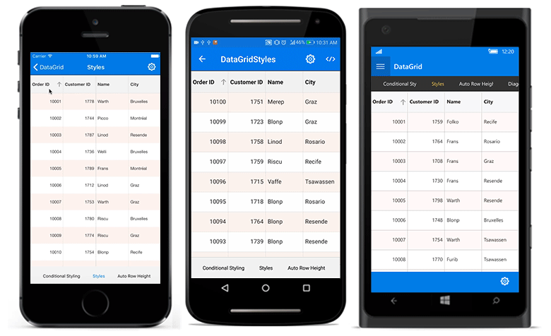

# Sorting in Xamarin DataGrid (SfDataGrid) 

The data grid sorts the data by setting the [SfDataGrid.AllowSorting](https://help.syncfusion.com/cr/xamarin/Syncfusion.SfDataGrid.XForms.SfDataGrid.html#Syncfusion_SfDataGrid_XForms_SfDataGrid_AllowSorting) property to `true`. It allows sorting the data against one or more columns. When sorting is applied, the control automatically rearranges the data to match with the current sort criteria. When `SfDataGrid.AllowSorting` is `true`, you can sort the data simply by tapping the column header. Once sorting is applied, the control shows a sort icon in the respective column header indicating the direction of sorting.

N> To update sorting for the newly added row or column, set the `SfDataGrid.View.LiveDataUpdateMode` to `LiveDataUpdateMode.AllowDataShaping`.

## Programmatic sorting

The data grid also sorts from the code. This requires to manually define the [SortColumnDescription](http://help.syncfusion.com/cr/xamarin/Syncfusion.SfDataGrid.XForms.SortColumnDescription.html) objects, and add it in the [SfDataGrid.SortColumnDescriptions](https://help.syncfusion.com/cr/xamarin/Syncfusion.SfDataGrid.XForms.SfDataGrid.html#Syncfusion_SfDataGrid_XForms_SfDataGrid_SortColumnDescriptions) collection. The control sorts the data based on the `SortColumnDescription` objects added to this collection.

The `SortColumnDescription` object holds the following two properties:

 * ColumnName: Name of the sorted column.
 * SortDirection: An object of type ListSortDirection defines the sorting direction.

The following code example illustrates this:



<syncfusion:SfDataGrid x:Name="dataGrid"
            ItemsSource="{Binding OrdersInfo}">

    <syncfusion:SfDataGrid.SortColumnDescriptions>
        <syncfusion:SortColumnDescription ColumnName="OrderID" 
                                          SortDirection="Descending" />
        </syncfusion:SfDataGrid.SortColumnDescriptions>
    </syncfusion:SfDataGrid> 


dataGrid.AllowSorting = true;

dataGrid.SortColumnDescriptions.Add (new SortColumnDescription () {
    ColumnName = "OrderID",
    SortDirection = ListSortDirection.Descending
}); 



The following screenshot shows the sorting functionality in the data grid:

## Tri-State sorting

In addition to sort the data in ascending/descending order, the SfDataGrid unsort the data in the original order by clicking the header again after sorting to descending order by setting the [SfDataGrid.AllowTriStateSorting](https://help.syncfusion.com/cr/xamarin/Syncfusion.SfDataGrid.XForms.SfDataGrid.html#Syncfusion_SfDataGrid_XForms_SfDataGrid_AllowTriStateSorting) property to `true`. When this property is set, sorting in each column iterates through three sort states: ascending, descending, and unsort.

To enable tri-State sorting in the SfDataGrid, follow the code example:



<syncfusion:SfDataGrid AllowTriStateSorting="True" />


dataGrid.AllowTriStateSorting = true;



## Multi-column sorting

The data grid sorts the data against more than one columns by setting the [SfDataGrid.AllowMultiSorting](https://help.syncfusion.com/cr/xamarin/Syncfusion.SfDataGrid.XForms.SfDataGrid.html#Syncfusion_SfDataGrid_XForms_SfDataGrid_AllowMultiSorting) property to `true`. The number of columns by which the data can be sorted is unlimited. To apply sorting for multiple columns, tap the desired column headers after setting the `SfDataGrid.AllowMultiSorting` property.

To enable multi-sorting, follow the code example:



<syncfusion:SfDataGrid AllowMultiSorting="True" />


dataGrid.AllowMultiSorting = true;



## Sort column in double click

By default, column gets sorted when column header clicked. This behavior can be changed to sort the column in double click action by setting [SfDataGrid.SortTapAction](https://help.syncfusion.com/cr/xamarin/Syncfusion.SfDataGrid.XForms.SfDataGrid.html#Syncfusion_SfDataGrid_XForms_SfDataGrid_SortTapAction) property to `DoubleTap`.

To set `SortTapAction` as `DoubleTap`, follow the code example:



<syncfusion:SfDataGrid x:Name="dataGrid"
            SortTapAction="DoubleTap"
            ItemsSource="{Binding OrdersInfo}">
    </syncfusion:SfDataGrid> 



dataGrid.SortTapAction=SortTapAction.DoubleTap;




## Sorting events

The data grid provides the following events for the sorting functionality:

 * [SortColumnsChanging](https://help.syncfusion.com/cr/xamarin/Syncfusion.SfDataGrid.XForms.SfDataGrid.html): This event is raised while sorting the column at execution time before the column gets sorted. It helps to cancel the sorting action by setting the Cancel property of [DataGridSortColumnsChangingEventArgs](http://help.syncfusion.com/cr/xamarin/Syncfusion.SfDataGrid.XForms.DataGridSortColumnsChangingEventArgs.html).
 * [SortColumnsChanged](https://help.syncfusion.com/cr/xamarin/Syncfusion.SfDataGrid.XForms.SfDataGrid.html): This event is raised after the column is sorted.

These two events are triggered with `DataGridSortColumnsChangingEventArgs` and `DataGridSortColumnsChangedEventArgs` that contains the following properties:

 * AddedItems: Gets the collection of `SortColumnDescription` objects that are added to `SortColumnDescriptions` collection for sorting.
 * RemovedItems: Gets the collection of `SortColumnDescription` objects that are removed from `SortColumnDescriptions` collection.

To hook the `SortColumnsChanging` event, and cancel the sorting of a column, follow the code example:



<syncfusion:SfDataGrid x:Name="dataGrid"
            AllowSorting="True"
            SortColumnsChanging="DataGrid_SortColumnsChanging"
            ItemsSource="{Binding OrdersInfo}">
</syncfusion:SfDataGrid> 


dataGrid.SortColumnsChanging += DataGrid_SortColumnsChanging; 




void DataGrid_SortColumnsChanging (object sender, DataGridSortColumnsChangingEventArgs e)
{
    if(e.AddedItems[0].ColumnName == "OrderID")
    {
        e.Cancel = true;
    }
}


## Custom sorting

The data grid sort columns based on custom logic, when the standard sorting techniques do not meet the requirements. For each column, you can apply different sorting criteria by adding `SortComparer` objects to [SfDataGrid.SortComparers](https://help.syncfusion.com/cr/xamarin/Syncfusion.SfDataGrid.XForms.SfDataGrid.html#Syncfusion_SfDataGrid_XForms_SfDataGrid_SortComparers) collection.

A `SortComparer` object has the following properties:

 * PropertyName: [MappingName](https://help.syncfusion.com/cr/xamarin/Syncfusion.SfDataGrid.XForms.GridColumn.html#Syncfusion_SfDataGrid_XForms_GridColumn_MappingName) of the column that applies custom sorting.
 * Comparer: Gets or sets the custom comparer that implements the `IComparer` and `ISortDirection` interfaces.

To perform custom sorting for the FirstName column based on the string length of the names, follow the code example:



<ContentPage xmlns="http://xamarin.com/schemas/2014/forms"
             xmlns:x="http://schemas.microsoft.com/winfx/2009/xaml"
             xmlns:data="clr-namespace:Syncfusion.Data;assembly=Syncfusion.Data.Portable"
             xmlns:syncfusion="clr-namespace:Syncfusion.SfDataGrid.XForms;assembly=Syncfusion.SfDataGrid.XForms"
             xmlns:local ="clr-namespace:DataGridSample;assembly=DataGridSample"
             x:Class="DataGridSample.Sample">

    <ContentPage.Resources>
        <ResourceDictionary>
            <local:CustomComparer x:Key="Comparer" />
        </ResourceDictionary>
    </ContentPage.Resources>

    <ContentPage.BindingContext>
        <local:ViewModel x:Name="viewModel" />
    </ContentPage.BindingContext>

    <syncfusion:SfDataGrid x:Name="dataGrid"
                           AllowSorting="True"
                           ItemsSource="{Binding OrdersInfo}">

        <syncfusion:SfDataGrid.SortComparers>
            <data:SortComparer Comparer="{StaticResource Comparer}"
                               PropertyName="FirstName" />
        </syncfusion:SfDataGrid.SortComparers>

        <syncfusion:SfDataGrid.SortColumnDescriptions>
            <syncfusion:SortColumnDescription ColumnName="FirstName" 
                                              SortDirection="Descending" />
        </syncfusion:SfDataGrid.SortColumnDescriptions>
    </syncfusion:SfDataGrid>
</ContentPage> 


dataGrid.SortComparers.Add (new SortComparer () {
    PropertyName = "FirstName",
    Comparer = new CustomComparer()
});

dataGrid.SortColumnDescriptions.Add (new SortColumnDescription () {
    ColumnName = "FirstName",
    SortDirection = ListSortDirection.Descending
}); 



To write custom comparer, follow the code example:


public class CustomComparer : IComparer<Object>, ISortDirection
{
    public int Compare(object x, object y)
    {
        int nameX;
        int nameY;

        //For OrderInfo type data
        if (x.GetType () == typeof(OrderInfo)) {
            //Calculating the length of FirstName in OrderInfo objects
            nameX = ((OrderInfo)x).FirstName.Length;
            nameY = ((OrderInfo)y).FirstName.Length;
        }

        //For Group type data                                   
        else if (x.GetType () == typeof(Group)) {
            //Calculating the group key length
            nameX = ((Group)x).Key.ToString ().Length;
            nameY = ((Group)y).Key.ToString ().Length;
        } else {
            nameX = x.ToString ().Length;
            nameY = y.ToString ().Length;
        }

        // Objects are compared and return the SortDirection
        if (nameX.CompareTo (nameY) > 0)
            return SortDirection == ListSortDirection.Ascending ? 1 : -1;
        else if (nameX.CompareTo (nameY) == -1)
            return SortDirection == ListSortDirection.Ascending ? -1 : 1;
        else
            return 0; 
    }

    //Gets or sets the SortDirection value
    public ListSortDirection SortDirection { get; set; }
}


## Animating sorting icon 

The data grid loads two different icons for denoting the `Ascending` and `Descending` sort direction states. However, rotate the [DataGridStyle.GetHeaderSortIndicatorUp](https://help.syncfusion.com/cr/xamarin/Syncfusion.SfDataGrid.XForms.DataGridStyle.html#Syncfusion_SfDataGrid_XForms_DataGridStyle_GetHeaderSortIndicatorUp) icon animatedly for denoting the descending state by overriding the [DataGridStyle.GetHeaderSortIndicatorDown](https://help.syncfusion.com/cr/xamarin/Syncfusion.SfDataGrid.XForms.DataGridStyle.html#Syncfusion_SfDataGrid_XForms_DataGridStyle_GetHeaderSortIndicatorDown) method, and returning `null`.

To animate the sorting icon, follow the code example:



<sfgrid:SfDataGrid x:Name="dataGrid"
                   ItemsSource="{Binding OrdersInfo}"
                   AllowSorting ="true"
                   GridStyle="{local:CustomStyle}">
    </sfgrid:SfDataGrid>


 dataGrid.AllowSorting = true;
 dataGrid.GridStyle = new CustomStyle();




//Custom style class

 public class  CustomStyle :DataGridStyle
    {
        public CustomStyle()
        {
        }

        public override ImageSource GetHeaderSortIndicatorDown()
        {
            return null;
        }
    }


## How to disable sorting 

### for an individual column

The data grid disables sorting for an individual column using the [GridColumn.AllowSorting](https://help.syncfusion.com/cr/xamarin/Syncfusion.SfDataGrid.XForms.GridColumn.html#Syncfusion_SfDataGrid_XForms_GridColumn_AllowSorting) property. The default value of this property is `true`. So all the columns in the [SfDataGrid.Columns](https://help.syncfusion.com/cr/xamarin/Syncfusion.SfDataGrid.XForms.SfDataGrid.html#Syncfusion_SfDataGrid_XForms_SfDataGrid_Columns) collection can be sorted when `SfDataGrid.AllowSorting` is set to `true`.

To disable sorting for an individual column, follow the code example:

### for auto generated column


public MainPage()
{
    InitializeComponent();
    viewModel = new ViewModel();
    dataGrid = new SfDataGrid();
    dataGrid.ItemsSource = viewModel.OrdersInfo;
    dataGrid.AllowSorting = true;
    dataGrid.AutoGeneratingColumn += DataGrid_AutoGeneratingColumn;
    this.Content = dataGrid;          
}
private void DataGrid_AutoGeneratingColumn(object sender, AutoGeneratingColumnEventArgs e)
{
    // Sorting will not be done for the Freight column
    if (e.Column.MappingName == "Freight")
        e.Column.AllowSorting = false;
}


### for manually defined column


public MainPage()
{
    InitializeComponent();
    viewModel = new ViewModel();
    dataGrid = new SfDataGrid();
    dataGrid.ItemsSource = viewModel.OrdersInfo;
    dataGrid.AutoGenerateColumns = false;
    dataGrid.AllowSorting = true;
    dataGrid.Columns.Add(new GridTextColumn() { MappingName = "OrderID" });
    // Sorting will not be done for the Freight column
    dataGrid.Columns.Add(new GridTextColumn() { MappingName = "Freight", AllowSorting = false });
    dataGrid.Columns.Add(new GridTextColumn() { MappingName = "Country" });
    this.Content = dataGrid;          
}


## See also

[How to change the size of the sort icon in Xamarin DataGrid (SfDataGrid)](https://www.syncfusion.com/kb/11216)