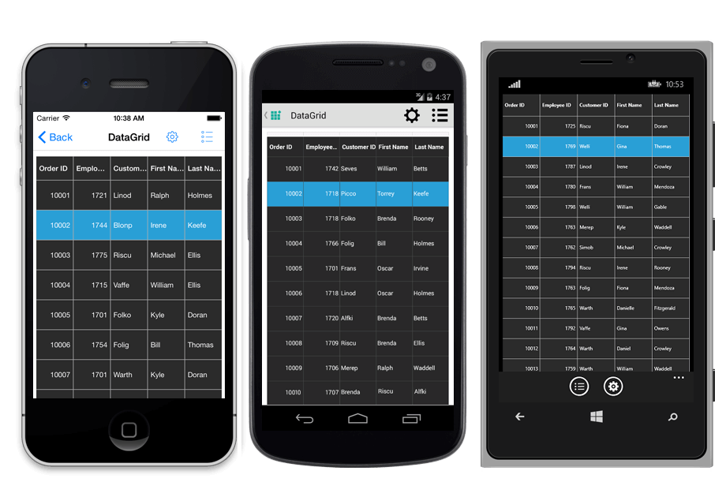
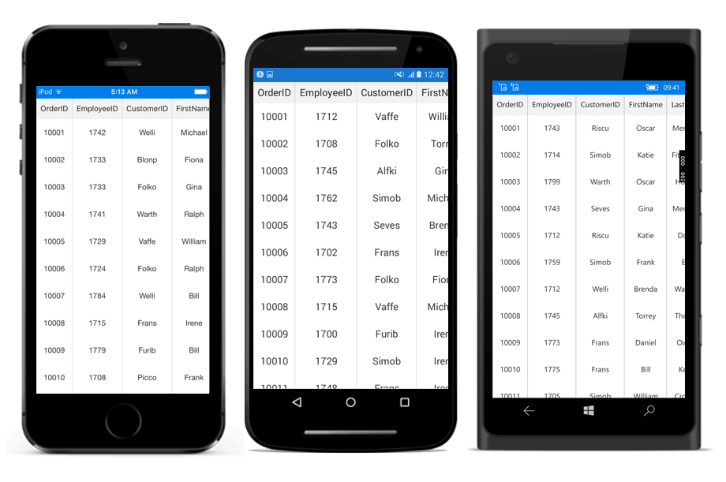
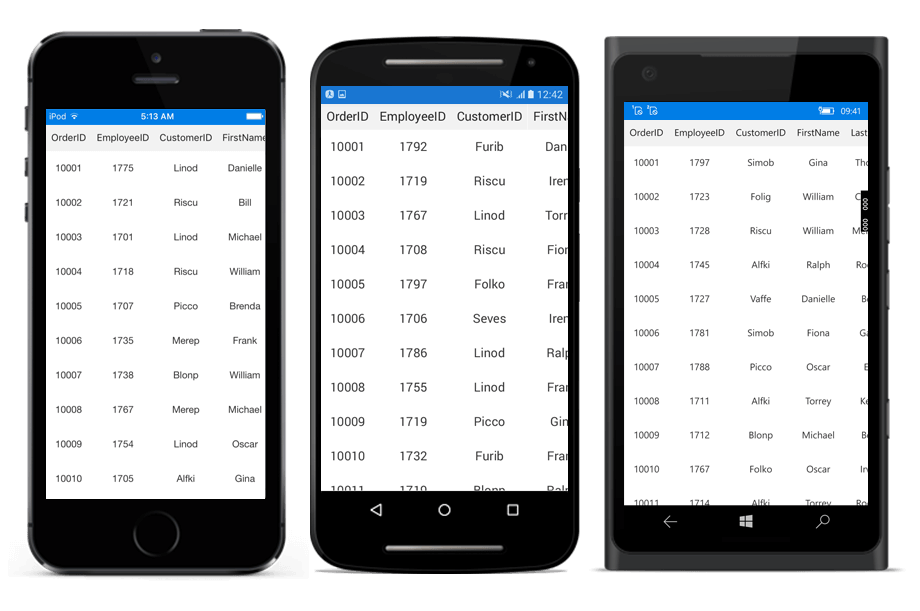
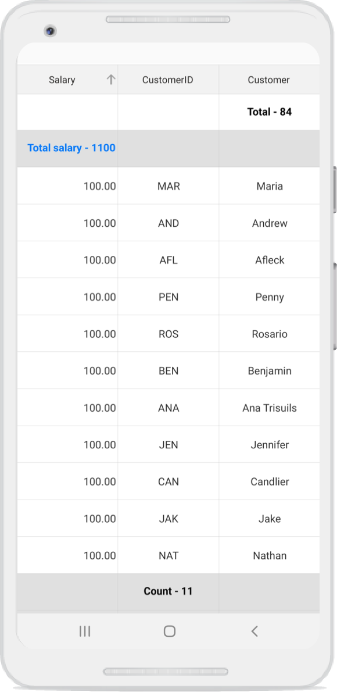

# Styles in Xamarin DataGrid (SfDataGrid)

The data grid applies style for all of its elements by setting desired values to the style properties in `DataGrid.GridStyle` or writing a Style class overriding from [DataGridStyle](http://help.syncfusion.com/cr/xamarin/Syncfusion.SfDataGrid.XForms.DataGridStyle.html), and assigning it to the [SfDataGrid.GridStyle](https://help.syncfusion.com/cr/xamarin/Syncfusion.SfDataGrid.XForms.SfDataGrid.html#Syncfusion_SfDataGrid_XForms_SfDataGrid_GridStyle) property.

To apply style in xaml, follow the code example:



<syncfusion:SfDataGrid x:Name="dataGrid" ItemsSource="{Binding OrdersInfo}" >
    <syncfusion:SfDataGrid.GridStyle>
        <syncfusion:DefaultStyle HeaderBackgroundColor="Black" HeaderForegroundColor="White"
                                 RowBackgroundColor="Black" RowForegroundColor="White"
                                 SelectionBackgroundColor="LightSkyBlue" SelectionForegroundColor="White"
                                 CaptionSummaryRowBackgroundColor="Black" CaptionSummaryRowForegroundColor="White"
                                 GridCellBorderColor="LightGray" LoadMoreViewBackgroundColor="Gray"
                                 LoadMoreViewForegroundColor="Black" AlternatingRowColor="Yellow"/>
    </syncfusion:SfDataGrid.GridStyle>
</syncfusion:SfDataGrid>


public partial class MainPage : ContentPage
{
    public Mainpage()
    {
        InitializeComponent();
        this.dataGrid.GridStyle.HeaderBackgroundColor = Color.FromRgb(15, 15, 15);
        this.dataGrid.GridStyle.HeaderForegroundColor = Color.FromRgb(255, 255, 255);
        this.dataGrid.GridStyle.RowBackgroundColor = Color.FromRgb(43, 43, 43);
        this.dataGrid.GridStyle.RowForegroundColor = Color.FromRgb(255, 255, 255);
        this.dataGrid.GridStyle.SelectionBackgroundColor = Color.FromRgb(42, 159, 214);
        this.dataGrid.GridStyle.SelectionForegroundColor = Color.FromRgb(255, 255, 255);
        this.dataGrid.GridStyle.CaptionSummaryRowBackgroundColor = Color.FromRgb(02, 02, 02);
        this.dataGrid.GridStyle.CaptionSummaryRowForegroundColor = Color.FromRgb(255, 255, 255);
        this.dataGrid.GridStyle.GridCellBorderColor = Color.FromRgb(81, 83, 82);
        this.dataGrid.GridStyle.LoadMoreViewBackgroundColor = Color.FromRgb(242, 242, 242);
        this.dataGrid.GridStyle.LoadMoreViewForegroundColor = Color.FromRgb(34, 31, 31);
        this.dataGrid.GridStyle.AlternatingRowColor = Color.Yellow;
    }
}



To apply custom style, follow the code example:



<ContentPage xmlns="http://xamarin.com/schemas/2014/forms"
             xmlns:x="http://schemas.microsoft.com/winfx/2009/xaml"
             xmlns:syncfusion="clr-namespace:Syncfusion.SfDataGrid.XForms;assembly=Syncfusion.SfDataGrid.XForms"
             xmlns:local ="clr-namespace:DataGridSample;assembly=DataGridSample"
             x:Class="DataGridSample.Sample">

    <ContentPage.Resources>
        <ResourceDictionary>
            <local:Dark x:Key="dark" />
        </ResourceDictionary>
    </ContentPage.Resources>

    <syncfusion:SfDataGrid x:Name="dataGrid"
                GridStyle="{StaticResource dark}"
                ItemsSource="{Binding OrdersInfo}" />
</ContentPage> 


//Apply custom style to SfDataGrid from code
SfDataGrid dataGrid = new SfDataGrid();
dataGrid.GridStyle = new Dark ();




//Custom style class
public class Dark : DataGridStyle
{
    public Dark ()
    {
    }

    public override Color GetHeaderBackgroundColor()
    {
        return Color.FromRgb (15, 15, 15);
    }

    public override Color GetHeaderForegroundColor()
    {
        return Color.FromRgb (255, 255, 255);
    }

    public override Color GetRecordBackgroundColor ()
    {
        return Color.FromRgb (43, 43, 43);
    }

    public override Color GetRecordForegroundColor ()
    {
        return Color.FromRgb (255, 255, 255);
    }

    public override Color GetSelectionBackgroundColor ()
    {
        return Color.FromRgb (42, 159, 214);
    }

    public override Color GetSelectionForegroundColor ()
    {
        return Color.FromRgb (255, 255, 255);
    }

    public override Color GetCaptionSummaryRowBackgroundColor ()
    {
        return Color.FromRgb (02, 02, 02);
    }

    public override Color GetCaptionSummaryRowForeGroundColor ()
    {
        return Color.FromRgb (255, 255, 255);
    }

    public override Color GetBorderColor ()
    {
        return Color.FromRgb (81, 83, 82);
    }

    public override Color GetLoadMoreViewBackgroundColor ()
    {
        return Color.FromRgb(242, 242, 242);
    }

    public override Color GetLoadMoreViewForegroundColor ()
    {
        return Color.FromRgb(34, 31, 31);
    }
    
    public override Color GetAlternatingRowBackgroundColor()
    {
        return Color.Yellow;
    }
} 


The following picture shows the grid loaded in a different style:

N> Xamarin.Forms.Style which has specified target type, that will not be applied to the internal components used in the SfDataGrid.

## Applying alternate row style

The SfDataGrid applies the alternative row style by setting desired color to the `AlternatingRowColor` property in `DataGrid.GridStyle` or by writing a Style class deriving from `DataGridStyle`, and assigning it to the [SfDataGrid.GridStyle](https://help.syncfusion.com/cr/xamarin/Syncfusion.SfDataGrid.XForms.SfDataGrid.html#Syncfusion_SfDataGrid_XForms_SfDataGrid_GridStyle) property.

To customize the alternate row style in xaml, follow the code example:



<syncfusion:SfDataGrid x:Name="dataGrid" ItemsSource="{Binding OrdersInfo}" >
    <syncfusion:SfDataGrid.GridStyle>
        <syncfusion:DefaultStyle AlternatingRowColor="Gray"/>
    </syncfusion:SfDataGrid.GridStyle>
</syncfusion:SfDataGrid>


public partial class MainPage : ContentPage
{
    public Mainpage()
    {
        InitializeComponent();
        this.dataGrid.GridStyle.AlternatingRowColor = Color.Gray;
    }
}



To apply alternate row style, follow the code example:


//Apply alternative row style
dataGrid.GridStyle = new CustomStyle ();

// Custom style class
public class CustomGridStyle : DataGridStyle
{
    public CustomGridStyle()
    {   
    }

    public override Color GetAlternatingRowBackgroundColor()
    {
        return Color.Gray;
    }   
}


## Customizing the alternation count

The data grid customizes the alternate row count for applying the alternate row style using the [SfDataGrid.AlternationCount](https://help.syncfusion.com/cr/xamarin/Syncfusion.SfDataGrid.XForms.SfDataGrid.html#Syncfusion_SfDataGrid_XForms_SfDataGrid_AlternationCountProperty) property.

To set the alternate row count, follow the code example:



//Apply alternative row count
dataGrid.AlternationCount = 3;



## Border customization

The data grid customizes the grid borders to vertical, horizontal, both, or none. Set desired value to `GridLinesVisibility` property in `DataGrid.GridStyle` or override the [DataGridStyle.GetGridLinesVisibility](https://help.syncfusion.com/cr/xamarin/Syncfusion.SfDataGrid.XForms.DataGridStyle.html#Syncfusion_SfDataGrid_XForms_DataGridStyle_GetGridLinesVisibility) method to customize borders in the data grid.


//Apply custom style to SfDataGrid from code
dataGrid.GridStyle = new CustomStyle ();



//Custom Style class
public class CustomStyle : DataGridStyle
{
    public CustomStyle ()
    {
    }
    public override GridLinesVisibility GetGridLinesVisibility()
    {
       return base.GetGridLinesVisibility();
    }
}


Following are the list of options available to customize the grid borders:

 * Both
 * Horizontal
 * Vertical
 * None

### Both

The [GridLinesVisibility.Both](http://help.syncfusion.com/cr/xamarin/Syncfusion.SfDataGrid.XForms.GridLinesVisibility.html) displays the data grid with both horizontal and vertical borders.

To customize the grid lines visibility in xaml, follow the code example:



<syncfusion:SfDataGrid x:Name="dataGrid" ItemsSource="{Binding OrdersInfo}" >
    <syncfusion:SfDataGrid.GridStyle>
        <syncfusion:DefaultStyle GridLinesVisibility="Both"/>
    </syncfusion:SfDataGrid.GridStyle>
</syncfusion:SfDataGrid>


public partial class MainPage : ContentPage
{
    public Mainpage()
    {
        InitializeComponent();
        this.dataGrid.GridStyle.GridLinesVisibility = Syncfusion.SfDataGrid.XForms.GridLinesVisibility.Both;
    }
}



To customize the grid lines visibility by writing a custom style, follow the code example:


public override GridLinesVisibility GetGridLinesVisibility()
{
    return GridLinesVisibility.Both;
} 


The following screenshot shows the outcome upon execution of the above code:

### Horizontal

The [GridLinesVisibility.Horizontal](http://help.syncfusion.com/cr/xamarin/Syncfusion.SfDataGrid.XForms.GridLinesVisibility.html) allows displays the data grid with horizontal border only.

To customize the grid lines visibility in xaml, follow the code example:



<syncfusion:SfDataGrid x:Name="dataGrid" ItemsSource="{Binding OrdersInfo}" >
    <syncfusion:SfDataGrid.GridStyle>
        <syncfusion:DefaultStyle GridLinesVisibility="Horizontal"/>
    </syncfusion:SfDataGrid.GridStyle>
</syncfusion:SfDataGrid>


public partial class MainPage : ContentPage
{
    public Mainpage()
    {
        InitializeComponent();
        this.dataGrid.GridStyle.GridLinesVisibility = Syncfusion.SfDataGrid.XForms.GridLinesVisibility.Horizontal;
    }
}



To customize the grid lines visibility by writing a custom style, follow the code example:


public override GridLinesVisibility GetGridLinesVisibility()
{
    return GridLinesVisibility.Horizontal;
} 


The following screenshot shows the outcome upon execution of the above code:

### Vertical

The [GridLinesVisibility.Vertical](http://help.syncfusion.com/cr/xamarin/Syncfusion.SfDataGrid.XForms.GridLinesVisibility.html) displays the data grid with vertical border only.

To customize the grid lines visibility in xaml, follow the code example:



<syncfusion:SfDataGrid x:Name="dataGrid" ItemsSource="{Binding OrdersInfo}" >
    <syncfusion:SfDataGrid.GridStyle>
        <syncfusion:DefaultStyle GridLinesVisibility="Vertical"/>
    </syncfusion:SfDataGrid.GridStyle>
</syncfusion:SfDataGrid>


public partial class MainPage : ContentPage
{
    public Mainpage()
    {
        InitializeComponent();
        this.dataGrid.GridStyle.GridLinesVisibility = Syncfusion.SfDataGrid.XForms.GridLinesVisibility.Vertical;
    }
}



To customize the grid lines visibility by writing a custom style, follow the code example:


public override GridLinesVisibility GetGridLinesVisibility()
{
    return GridLinesVisibility.Vertical;
} 


The following screenshot shows the outcome upon execution of the above code:

### None

[GridLinesVisibility.None](http://help.syncfusion.com/cr/xamarin/Syncfusion.SfDataGrid.XForms.GridLinesVisibility.html) allows you to display the data grid without borders.

To customize the grid lines visibility in xaml, follow the code example:



<syncfusion:SfDataGrid x:Name="dataGrid" ItemsSource="{Binding OrdersInfo}" >
    <syncfusion:SfDataGrid.GridStyle>
        <syncfusion:DefaultStyle GridLinesVisibility="None"/>
    </syncfusion:SfDataGrid.GridStyle>
</syncfusion:SfDataGrid>


public partial class MainPage : ContentPage
{
    public Mainpage()
    {
        InitializeComponent();
        this.dataGrid.GridStyle.GridLinesVisibility = Syncfusion.SfDataGrid.XForms.GridLinesVisibility.None;
    }
}



To customize the grid lines visibility by writing a custom style, follow the code example:


public override GridLinesVisibility GetGridLinesVisibility()
{
    return GridLinesVisibility.None;
} 


The following screenshot shows the outcome upon execution of the above code:

## Header border color customization

The data grid customizes the header border color for different `DataGridStyle.GridLinesVisibility` by setting desired color to the `HeaderCellBorderColor` property in `DataGrid.GridStyle` or by writing a custom style class deriving from `DataGridStyle`, and assigning it to the [SfDataGrid.GridStyle](https://help.syncfusion.com/cr/xamarin/Syncfusion.SfDataGrid.XForms.SfDataGrid.html#Syncfusion_SfDataGrid_XForms_SfDataGrid_GridStyle) property. Override the `GetHeaderBorderColor` method in the custom style to customize color of the column header and row header.

To customize the header border color in xaml, follow the code example:



<syncfusion:SfDataGrid x:Name="dataGrid" ItemsSource="{Binding OrdersInfo}" >
    <syncfusion:SfDataGrid.GridStyle>
        <syncfusion:DefaultStyle HeaderCellBorderColor="Red"/>
    </syncfusion:SfDataGrid.GridStyle>
</syncfusion:SfDataGrid>


public partial class MainPage : ContentPage
{
    public Mainpage()
    {
        InitializeComponent();
        this.dataGrid.GridStyle.HeaderCellBorderColor = Color.Red;
    }
}



To customize the header border color by writing a custom style, follow the code example:



<ContentPage xmlns="http://xamarin.com/schemas/2014/forms"
             xmlns:x="http://schemas.microsoft.com/winfx/2009/xaml"
             xmlns:syncfusion="clr-namespace:Syncfusion.SfDataGrid.XForms;assembly=Syncfusion.SfDataGrid.XForms"
             xmlns:local ="clr-namespace:DataGridSample;assembly=DataGridSample"
             x:Class="DataGridSample.Sample">

    <ContentPage.Resources>
        <ResourceDictionary>
            <local:CustomStyle x:Key="customStyle" />
        </ResourceDictionary>
    </ContentPage. mResources>

    <syncfusion:SfDataGrid x:Name="dataGrid"
                GridStyle="{StaticResource customStyle}"
                ItemsSource="{Binding OrdersInfo}" />
</ContentPage> 


//Applying custom style to SfDataGrid from code to customize header border color
SfDataGrid dataGrid = new SfDataGrid();
dataGrid.GridStyle = new customStyle ();



 
//Custom style class
public class CustomStyle : DataGridStyle
{
    Public CustomStyle()
    {
        
    }
    
    Public override color GetHeaderBorderColor()
    {
        return Color.Red;
    } 
}


The following screenshot shows the final outcome upon execution of the above code:

## Summary row border customization

SfDataGrid allows you to show or hide the vertical border lines in summary rows when [ShowSummaryInRow](https://help.syncfusion.com/cr/xamarin/Syncfusion.SfDataGrid.XForms.GridSummaryRow.html#Syncfusion_SfDataGrid_XForms_GridSummaryRow_ShowSummaryInRow) is false. Set desired value to `SummaryVerticalLineVisibility` property in `DataGrid.GridStyle` or override the [DataGridStyle.GetSummaryVerticalLineVisibility](https://help.syncfusion.com/cr/xamarin/Syncfusion.SfDataGrid.XForms.DataGridStyle.html#Syncfusion_SfDataGrid_XForms_DataGridStyle_GetSummaryVerticalLineVisibility) method to customize summary row borders in SfDataGrid.

To customize the summary vertical line visibility in xaml, follow the code example:



<syncfusion:SfDataGrid x:Name="dataGrid" ItemsSource="{Binding OrdersInfo}" >
    <syncfusion:SfDataGrid.GridStyle>
        <syncfusion:DefaultStyle SummaryVerticalLineVisibility="True"/>
    </syncfusion:SfDataGrid.GridStyle>
</syncfusion:SfDataGrid>


public partial class MainPage : ContentPage
{
    public Mainpage()
    {
        InitializeComponent();
        this.dataGrid.GridStyle.SummaryVerticalLineVisibility = true;
    }
}



To customize the summary vertical line visibility by writing a custom style, follow the code example:


//Apply custom style to SfDataGrid from code
dataGrid.GridStyle = new CustomStyle ();



//Custom Style class
public class CustomStyle : DataGridStyle
{
    public CustomStyle ()
    {
    }
    public override bool GetSummaryVerticalLineVisibility()
    {
        return true;
    }
}


The following screenshot shows the final outcome upon execution of the above code:

## Customizing sort icons in the header

Any desired image can be loaded as the sort indicator by setting the desired image source value to the `SortDescendingIcon` and `SortAscendingIcon` in `DataGrid.GridStyle` or by using the [GetHeaderSortIndicatorDown](https://help.syncfusion.com/cr/xamarin/Syncfusion.SfDataGrid.XForms.DataGridStyle.html#Syncfusion_SfDataGrid_XForms_DataGridStyle_GetHeaderSortIndicatorDown) and [GetHeaderSortIndicatorUp](https://help.syncfusion.com/cr/xamarin/Syncfusion.SfDataGrid.XForms.DataGridStyle.html#Syncfusion_SfDataGrid_XForms_DataGridStyle_GetHeaderSortIndicatorUp) overriding from the [DataGridStyle](http://help.syncfusion.com/cr/xamarin/Syncfusion.SfDataGrid.XForms.DataGridStyle.html) class. To change the sort indicators, follow the code example:

To customize the sort icons in xaml, follow the code example:



<syncfusion:SfDataGrid x:Name="dataGrid" ItemsSource="{Binding OrdersInfo}" >
    <syncfusion:SfDataGrid.GridStyle>
        <syncfusion:DefaultStyle SortDescendingIcon="SfDataGrid_Sample.SortDown.png"
                                 SortAscendingIcon="SfDataGrid_Sample.SortUp.png"/>
        </syncfusion:SfDataGrid.GridStyle>
</syncfusion:SfDataGrid>


public partial class MainPage : ContentPage
{
    public Mainpage()
    {
        InitializeComponent();
        this.dataGrid.GridStyle.SortDescendingIcon = ImageSource.FromResource("SfDataGrid_Sample.SortDown.png");
        this.dataGrid.GridStyle.SortAscendingIcon = ImageSource.FromResource("SfDataGrid_Sample.SortUp.png");
    }
}



To customize the sort icons by writing a custom style, follow the code example:



//Apply custom style to SfDataGrid from code
dataGrid.GridStyle = new Custom();

public class Custom : DataGridStyle
{

    public override ImageSource GetHeaderSortIndicatorDown()
    {
        return ImageSource.FromResource("SfDataGrid_Sample.SortDown.png");
    }

    public override ImageSource GetHeaderSortIndicatorUp()
    {
        return ImageSource.FromResource("SfDataGrid_Sample.SortUp.png");
    }

}


The following screenshots shows the final outcome of the above code:

N> The BuildAction image must be set to EmbeddedResource in order to access the image as resource as shown in above code.

## Customizing resizing indicator

The color of the resizing indicator can be changed by setting desired color to the `ResizingIndicatorLineColor` property in `DataGrid.GridStyle` or by using the [GetResizingIndicatorColor](https://help.syncfusion.com/cr/xamarin/Syncfusion.SfDataGrid.XForms.DataGridStyle.html#Syncfusion_SfDataGrid_XForms_DataGridStyle_GetResizingIndicatorColor) overriding from the [DataGridStyle](http://help.syncfusion.com/cr/xamarin/Syncfusion.SfDataGrid.XForms.DataGridStyle.html) class. To change the color of the resizing indicator, follow the code example:

To customize the resizing indicator line color in xaml, follow the code example:



<syncfusion:SfDataGrid x:Name="dataGrid" ItemsSource="{Binding OrdersInfo}" >
    <syncfusion:SfDataGrid.GridStyle>
        <syncfusion:DefaultStyle ResizingIndicatorLineColor="Blue"/>
    </syncfusion:SfDataGrid.GridStyle>
</syncfusion:SfDataGrid>


public partial class MainPage : ContentPage
{
    public Mainpage()
    {
        InitializeComponent();
        this.dataGrid.GridStyle.ResizingIndicatorLineColor = Color.Blue;
    }
}



To customize the resizing indicator line color by writing a custom style, follow the code example:



//Apply custom style to SfDataGrid from code
dataGrid.GridStyle = new Custom();

public class Custom : DataGridStyle
{
    public override Color GetResizingIndicatorColor()
    {
        return Color.Blue;
    }
}


## Border width customization

SfDataGrid allows you to customize the border width of the grid cells and the header cells. 
The default border width of the grid cell and the header cell for Forms.iOS and Forms.UWP is 0.5f and 1f for Forms.Android.

Refer the below code snippet to customize the width of the grid cells and header cells in xaml.



<syncfusion:SfDataGrid x:Name="dataGrid" ItemsSource="{Binding OrdersInfo}" >
    <syncfusion:SfDataGrid.GridStyle>
        <syncfusion:DefaultStyle GridCellBorderWidth="5"
                                 HeaderCellBorderWidth="5"/>    
        </syncfusion:SfDataGrid.GridStyle>
</syncfusion:SfDataGrid>


public partial class MainPage : ContentPage
{
    public Mainpage()
    {
        InitializeComponent();
        this.dataGrid.GridStyle.GridCellBorderWidth = 5;
        this.dataGrid.GridStyle.HeaderCellBorderWidth = 5;
    }
}



Refer the below code snippet to customize the width of the grid cells and header cells using custom style.



     //Apply custom style to SfDataGrid from code
      dataGrid.GridStyle = new CustomStyle();

    public class CustomStyle : DataGridStyle
    {
        public CustomStyle()
        {

        }

        // Customize border width for grid cells
        public override float GetBorderWidth()
        {
            return 5;
        }

        // Customize border width for header cells
        public override float GetHeaderBorderWidth()
        {
            return 5;
        }

    }



## Customize border of a particular cell

SfDataGrid allows you to customize the border color and border thickness of a particular cell using the [QueryCellStyleEventArgs](https://help.syncfusion.com/cr/xamarin/Syncfusion.SfDataGrid.XForms.QueryCellStyleEventArgs.html). This event will be fired for each cell. Using the `Style.BorderColor` and `Style.BorderThickness` properties through the [QueryCellStyleEventArgs](https://help.syncfusion.com/cr/xamarin/Syncfusion.SfDataGrid.XForms.QueryCellStyleEventArgs.html) in its `EventHandler` you can customize borders of an individual cell.


this.dataGrid.QueryCellStyle += DataGrid_QueryCellStyle;
private void DataGrid_QueryCellStyle(object sender, QueryCellStyleEventArgs e)
{
    if (e.ColumnIndex == 1 && e.RowIndex == 1)
    {
        e.Style.BorderColor = Color.Red;
        e.Style.BorderThickness = new Thickness(10);
    }
    else if (e.ColumnIndex == 3 && e.RowIndex == 5)
    {
        e.Style.BorderColor = Color.Blue;
        e.Style.BorderThickness = new Thickness(0, 10, 0, 10);
    }
    e.Handled = true;
}


## See also

[How to apply the row background color when mouse hover on SfDataGrid in UWP](https://www.syncfusion.com/kb/11230)

[How to customize the expander icon for each level of group in Xamarin.Forms DataGrid(SfDataGrid)](https://www.syncfusion.com/kb/11014)

[How to change header background dynamically in the SfDataGrid control](https://www.syncfusion.com/kb/9222)

[How to load multiple SfDataGrid's to a layout](https://www.syncfusion.com/kb/8078)

[How to display custom font in GridCell](https://www.syncfusion.com/kb/7826)

[How to modify the cell borders in SfDataGrid](https://www.syncfusion.com/kb/7803)

[How to bind a view model property to header template](https://www.syncfusion.com/kb/7815)

[How to load grid without borders](https://www.syncfusion.com/kb/7451)

[How to load a button in Header using HeaderTemplate in code-behind](https://www.syncfusion.com/kb/7440)

[How to add multiple views in a grid cell in SfDataGrid](https://www.syncfusion.com/kb/7438)

[How to set different background color for each column header in SfDataGrid](https://www.syncfusion.com/kb/7421)

[How to display an animation while loading the data in the SfDataGrid](https://www.syncfusion.com/kb/7393)

[How to apply multiple selection colors in SfDataGrid](https://www.syncfusion.com/kb/7387)