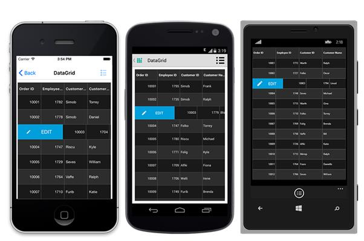
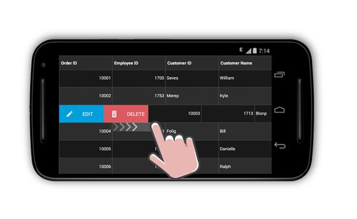
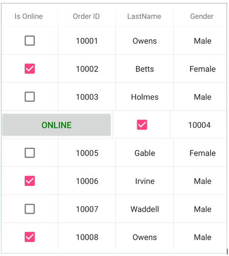
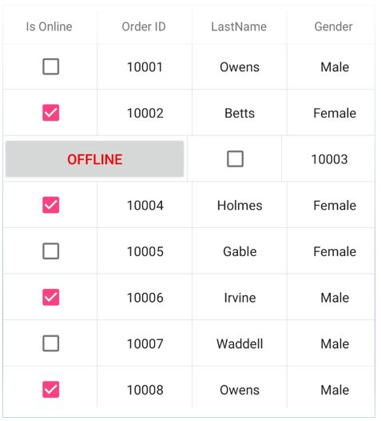

# Swiping in Xamarin DataGrid (SfDataGrid)

The [SfDataGrid](http://help.syncfusion.com/cr/xamarin/Syncfusion.SfDataGrid.XForms.SfDataGrid.html# “”) allows enabling the swiping option by setting the [SfDataGrid.AllowSwiping](https://help.syncfusion.com/cr/xamarin/Syncfusion.SfDataGrid.XForms.SfDataGrid.html#Syncfusion_SfDataGrid_XForms_SfDataGrid_AllowSwiping) property to `true`. Swipe views are displayed when swiping from ‘left to right’ or ‘right to left’ on a data row. The control provides customizable swipe templates for swiping on the left and right side. The swipe gesture can be restricted to a certain point on the row by setting the [SfDataGrid.MaxSwipeOffset](https://help.syncfusion.com/cr/xamarin/Syncfusion.SfDataGrid.XForms.SfDataGrid.html#Syncfusion_SfDataGrid_XForms_SfDataGrid_MaxSwipeOffset) property.

## Swipe template

The data grid enables loading a desired content using the [SfDataGrid.LeftSwipeTemplate](https://help.syncfusion.com/cr/xamarin/Syncfusion.SfDataGrid.XForms.SfDataGrid.html#Syncfusion_SfDataGrid_XForms_SfDataGrid_LeftSwipeTemplate) when swiping towards right. The template can be defined either in code or XAML. The content inside the swipe template is arranged based on the offset values when swiping a data row. 





//Defining left swipe template

<sfgrid:SfDataGrid.LeftSwipeTemplate>

  <DataTemplate>
      <Grid  BackgroundColor="#009EDA" Padding="9">
        <Grid.ColumnDefinitions>
          <ColumnDefinition/>
          <ColumnDefinition/>
        </Grid.ColumnDefinitions>
        
        <Image Grid.Column="0"  
               BackgroundColor="Transparent" 
               HorizontalOptions="CenterAndExpand" 
               Source="EditIcon.png"         
               BindingContextChanged="rightImage_BindingContextChanged" />
        
        <Label Grid.Column="1" 
               Text ="EDIT" 
               HorizontalTextAlignment="Start" 
               VerticalTextAlignment="Center"  
               LineBreakMode ="NoWrap" 
               BackgroundColor="Transparent" 
               TextColor ="White" />
      </Grid>
  </DataTemplate>
</sfgrid:SfDataGrid.LeftSwipeTemplate>




//Defining left swipe template

dataGrid.LeftSwipeTemplate = new DataTemplate(() =>
{
    Grid myGrid = new Grid();

    myGrid.HorizontalOptions = LayoutOptions.FillAndExpand;

    myGrid.BackgroundColor = Color.FromHex("#009EDA");

    myGrid.Padding = 9;

    myGrid.ColumnDefinitions = new ColumnDefinitionCollection
    {
      new ColumnDefinition {},
      new ColumnDefinition {}           
    };

    var image = new Image();
    image.BackgroundColor = Color.Transparent;
    image.BindingContextChanged += MainPage_BindingContextChanged;
    image.HorizontalOptions = LayoutOptions.FillAndExpand;
    image.Source = "EditIcon.png";

    var label = new Label();
    label.Text = "EDIT";
    label.HorizontalTextAlignment = TextAlignment.Start;
    label.VerticalTextAlignment = TextAlignment.Center;
    label.LineBreakMode = LineBreakMode.NoWrap;
    label.BackgroundColor = Color.Transparent;
    label.TextColor = Color.White;

    myGrid.Children.Add(image, 0, 0);
    myGrid.Children.Add(label, 1, 0);
    return myGrid;
});




N> Similarly, desired content can be loaded using the [SfDataGrid.RightSwipeTemplate](https://help.syncfusion.com/cr/xamarin/Syncfusion.SfDataGrid.XForms.SfDataGrid.html#Syncfusion_SfDataGrid_XForms_SfDataGrid_RightSwipeTemplate) when swiping towards left.

N> The `DataTemplateSelector` can also be directly assigned to the `SfDataGrid.RightSwipeTemplate` and `SfDataGrid.LeftSwipeTemplate`. You can load the desired template using the RowData and the row element passed in the arguments.

## Swipe events

[SwipeStarted](https://help.syncfusion.com/cr/xamarin/Syncfusion.SfDataGrid.XForms.SfDataGrid.html): Fired when the swipe offset changes from its initial value. The swipe action can be canceled by setting the [Cancel](https://msdn.microsoft.com/query/dev10.query?appId=Dev10IDEF1&l=EN-US&k=k(System.ComponentModel.CancelEventArgs.Cancel)&rd=true# “”) property of the [SwipeStartedEventArgs](http://help.syncfusion.com/cr/xamarin/Syncfusion.SfDataGrid.XForms.SwipeStartedEventArgs.html# “”) to `true`. 
[SwipeEnded](https://help.syncfusion.com/cr/xamarin/Syncfusion.SfDataGrid.XForms.SfDataGrid.html): Fired when the swipe offset value reaches the `SfDataGrid.MaxSwipeOffset` indicating that the swipe action is completed. This event is triggered with [SwipeEndedEventArgs](http://help.syncfusion.com/cr/xamarin/Syncfusion.SfDataGrid.XForms.SwipeEndedEventArgs.html# “”).
[Swiping](https://help.syncfusion.com/cr/xamarin/Syncfusion.SfDataGrid.XForms.SfDataGrid.html): Raised while swiping a row is in progress. This event is triggered with [SwipingEventArgs](http://help.syncfusion.com/cr/xamarin/Syncfusion.SfDataGrid.XForms.SwipingEventArgs.html# “”). 

The swipe events provides the following properties in their arguments: 

* [RowIndex](https://help.syncfusion.com/cr/xamarin/Syncfusion.SfDataGrid.XForms.SwipingEventArgs.html#Syncfusion_SfDataGrid_XForms_SwipingEventArgs_RowIndex): Defines the swiping row index. 
* [RowData](https://help.syncfusion.com/cr/xamarin/Syncfusion.SfDataGrid.XForms.SwipingEventArgs.html#Syncfusion_SfDataGrid_XForms_SwipingEventArgs_RowData): Defines the underlying data associated with the swiped row as its arguments. 
* [SwipeDirection](https://help.syncfusion.com/cr/xamarin/Syncfusion.SfDataGrid.XForms.SwipingEventArgs.html#Syncfusion_SfDataGrid_XForms_SwipingEventArgs_SwipeDirection): Defines the swipe direction of the swiped row.
* [SwipeOffset](https://help.syncfusion.com/cr/xamarin/Syncfusion.SfDataGrid.XForms.SwipingEventArgs.html#Syncfusion_SfDataGrid_XForms_SwipingEventArgs_SwipeOffset): Defines the current swipe offset of the row being swiped.

By handling the swipe events, you can use these properties value from the arguments to perform any desired action such as deleting the row, editing the data, etc. 

## Loading multiple views as swipe template

The swipe templates can be customized by loading any view in the templates, and assigning custom actions to them such as deleting a row, adding a row, editing the underlying data associated, etc. Multiple views can also be displayed in a template like in the following example, where two views are loaded for editing the cell values in the row and deleting the row respectively.

**Swiping.xaml**



//Defining left swipe template

<sfgrid:SfDataGrid.LeftSwipeTemplate>

   <DataTemplate>

       <Grid BackgroundColor="#009EDA">

           <Grid.ColumnDefinitions>
               <ColumnDefinition Width="50"/>                              
               <ColumnDefinition Width="100"/>                                                     
               <ColumnDefinition Width="130"/>                                                     
           </Grid.ColumnDefinitions>

           <Image Grid.Column="0"
                  BackgroundColor="Transparent"
                  BindingContextChanged="leftImage_BindingContextChanged"
                  HorizontalOptions="CenterAndExpand"
                  Source="EditIcon.png" />

           <Label Grid.Column="1"
                  BackgroundColor="Transparent"
                  LineBreakMode="NoWrap"
                  Text="EDIT"
                  TextColor="White"
                  HorizontalTextAlignment ="Start"
                  VerticalTextAlignment="Center" />
                          
           <Grid Grid.Column="2" BackgroundColor="#DC595F"> 
               <Grid.ColumnDefinitions>
                   <ColumnDefinition Width="50" />                              
                   <ColumnDefinition Width="80" />                                                     
               </Grid.ColumnDefinitions>

               <Image Grid.Column="0"
                      BackgroundColor="Transparent"
                      BindingContextChanged="rightImage_BindingContextChanged"
                      HorizontalOptions="CenterAndExpand"
                      Source="TrashImage.png"  Margin="9"/>

               <Label Grid.Column="1"
                      BackgroundColor="Transparent"
                      LineBreakMode="NoWrap"
                      Text="DELETE"
                      TextColor="White"
                      HorizontalTextAlignment ="Start"
                      VerticalTextAlignment ="Center" />
           </Grid>                                           
      </Grid>                    
   </DataTemplate>
</sfgrid:SfDataGrid.LeftSwipeTemplate>


**Swiping.xaml.cs**



public partial class Swiping : SamplePage

{

    private Image leftImage;

    private Image rightImage;

    private int swipedRowIndex;

    private FormsView formView;

    public Swiping()

    {
        InitializeComponent();
        this.PropertyChanged += Swiping_PropertyChanged;
        formView = new FormsView(dataGrid);
        customLayout.Children.Add(formView);
    }

    private void Swiping_PropertyChanged(object sender, PropertyChangedEventArgs e)
    {
        if (e.PropertyName == "Width" && this.formView != null)
        {
            formView.IsVisible = false;
            dataGrid.Opacity = 1.0;
        }
    }

    private void dataGrid_GridTapped(object sender, GridTappedEventsArgs e)
    {
        this.formView.IsVisible = false;
        dataGrid.Opacity = 1.0;
        dataGrid.IsEnabled = true;
    }

    //Gesture listener to perform edit
    private void leftImage_BindingContextChanged(object sender, EventArgs e)
    {
        if (leftImage == null)
        {
            leftImage = sender as Image;
            (leftImage.Parent as View).GestureRecognizers.Add(new TapGestureRecognizer() { Command = new Command (Edit)});
            leftImage.Source = ImageSource.FromResource("SfDataGridSample.EditIcon.png");
        }
    }

    //Code to edit row
    private void Edit()
    {
        if (Device.RuntimePlatform != Device.UWP || Device.Idiom == TargetIdiom.Phone)
           formView.LayoutTo(new Rectangle(10, (this.Height / 2) - (350 / 2), this.dataGrid.Width - 20, 370), 250, null);

        else
           formView.LayoutTo(new Rectangle(10, (this.dataGrid.Height / 2) - (350 / 2), this.dataGrid.Width - 20, 350), 450, null);
        formView.IsVisible = true;
    }

    //Code to delete row
    private void Delete()
    {
        this.viewModel.OrdersInfo.RemoveAt(swipedRowIndex - 1);
    }

    //Gesture listener to perform delete
    private void rightImage_BindingContextChanged(object sender, EventArgs e)
    {
        if (rightImage == null)
        {
            rightImage = sender as Image;
            (rightImage.Parent as View).GestureRecognizers.Add(new TapGestureRecognizer() { Command = new Command(Delete) });
            rightImage.Source = ImageSource.FromResource("SfDataGridSample.TrashImage.png");
        }
    }

    private void dataGrid_SwipeEnded(object sender, SwipeEndedEventArgs e)
    {
        formView.BindingContext = e.RowData;
        swipedRowIndex = e.RowIndex;
    }

}       



N> Similarly, you can load two views using the `SfDataGrid.RightSwipeTemplate` when swiping towards left will result in the following outcome:

## Customized swipe delete functionality

Operations such as deleting a row when swiping a data row from one extent to other in the view can be performed. 

**Swiping.Xaml**



//Creating view for left swipe

<sfgrid:SfDataGrid.LeftSwipeTemplate>

  <DataTemplate>

    <ContentView BindingContextChanged="leftTemplate_BindingContextChanged"
                 BackgroundColor="#1AAA87">

        <Label FontSize="15"                     
               Text ="Deleted" 
               TextColor ="White"
               HorizontalTextAlignment ="Start"
               VerticalTextAlignment ="Center"  
               LineBreakMode ="NoWrap" />
    </ContentView>
  </DataTemplate>
</sfgrid:SfDataGrid.LeftSwipeTemplate>

//Creating view for right swipe

<sfgrid:SfDataGrid.RightSwipeTemplate>

  <DataTemplate>

    <ContentView BindingContextChanged="rightTemplate_BindingContextChanged" 
                 BackgroundColor="#1AAA87">

        <Label FontSize="15" 
               HorizontalTextAlignment ="Center" 
               Text ="Deleted" 
               TextColor ="White"                  
               VerticalTextAlignment ="Center"  
               LineBreakMode ="NoWrap" />
    </ContentView>
  </DataTemplate>
</sfgrid:SfDataGrid.RightSwipeTemplate>


Swiping.Xaml.cs



//Call to delete() when swipe is ended

private void dataGrid_SwipeEnded(object sender, SwipeEndedEventArgs e)

{

    swipedRowIndex = e.RowIndex;

    if (Math.Abs(e.SwipeOffset) >= dataGrid.Width)

    {

        if (e.SwipeOffset > 0)

            leftTemplateView.Content.IsVisible = true;

        else

            rightTemplateView.Content.IsVisible = true;

        doDeleting();

    }

}

//Code to delete row

private async void doDeleting()

{

    await Task.Delay(2000);

    if (leftTemplateView.Content.IsVisible)

        leftTemplateView.Content.IsVisible = false;

    else if (rightTemplateView.Content.IsVisible)

        rightTemplateView.Content.IsVisible = false;

    if (!IsUndoClicked)

        viewModel.OrdersInfo.RemoveAt(swipedRowIndex - 1);

    else

    {

        var removedData = viewModel.OrdersInfo[swipedRowIndex - 1];

        var isSelected = dataGrid.SelectedItems.Contains(removedData);

        viewModel.OrdersInfo.Remove(removedData);

        viewModel.OrdersInfo.Insert(swipedRowIndex - 1, removedData);

        if (isSelected)

            dataGrid.SelectedItems.Add(removedData);

        IsUndoClicked = false;

    }

}



## Loading complex template for swiping

When a complex layout is loaded in the GridTemplateColumn, swiping may not occur or may not be smooth at times, since the touches will be intercepted by the views loaded in the template. As a result, the data grid may not recognize the touches that might restrict the swiping operation. To resolve this issue, set the `InputTransparent` property of the views loaded in the `DataTemplate` of the `GridTemplateColumn` to `True`.



<sfgrid:GridTemplateColumn MappingName="CustomerID" HeaderText="Customer Details" Width="200">

    <sfgrid:GridTemplateColumn.CellTemplate>

        <DataTemplate>

           <Grid InputTransparent="True" 
                  ColumnSpacing="0" 
                  RowSpacing="0" 
                  HorizontalOptions="FillAndExpand" 
                  Margin="0" >
              <Grid.ColumnDefinitions>
                <ColumnDefinition />
                <ColumnDefinition />
                <ColumnDefinition />
              </Grid.ColumnDefinitions>
              <Grid.RowDefinitions>
                <RowDefinition Height="10" />
                <RowDefinition Height="*" />
                <RowDefinition Height="10"/>
              </Grid.RowDefinitions>
              <StackLayout InputTransparent="True"
                           Margin="2" 
                           BackgroundColor="White" 
                           Orientation="Vertical" 
                           HorizontalOptions="FillAndExpand"
                           VerticalOptions="FillAndExpand"
                           Grid.Column="0"
                           Grid.ColumnSpan="3"
                           Grid.Row="1">
                           
                <StackLayout Orientation="Horizontal" HorizontalOptions="FillAndExpand" >
                    <Label Text="Customer ID: " HorizontalTextAlignment="Start"/>
                    <Label Text="{Binding CustomerID}"  TextColor="Black" HorizontalTextAlignment="Start"/>
                </StackLayout>
                <StackLayout Orientation="Horizontal" HorizontalOptions="FillAndExpand">
                    <Label Text="Country:" HorizontalTextAlignment="Start"/>
                    <Label Text="{Binding ShipCountry}" TextColor="Black" HorizontalTextAlignment="Start"/>
                </StackLayout>
              </StackLayout>
           </Grid>
        </DataTemplate>
    </sfgrid:GridTemplateColumn.CellTemplate>
</sfgrid:GridTemplateColumn>



## How to cancel the swipe programmatically

The data grid allows canceling the swipe programmatically by calling the [SfDataGrid.ResetSwipeOffset](https://help.syncfusion.com/cr/xamarin/Syncfusion.SfDataGrid.XForms.SfDataGrid.html#Syncfusion_SfDataGrid_XForms_SfDataGrid_ResetswipeOffset) method in [SfDataGrid.SwipeEnded](https://help.syncfusion.com/cr/xamarin/Syncfusion.SfDataGrid.XForms.SfDataGrid.html) event.



<syncfusion:SfDataGrid x:Name="datagrid"

                       ColumnSizer="Star"
                       AutoGenerateColumns="True"
                       AllowSwiping="True"
                       ItemsSource="{Binding OrdersInfo}"
                       SwipeEnded="Datagrid_SwipeEnded">

  <syncfusion:SfDataGrid.LeftSwipeTemplate>

    <DataTemplate>

      <Grid BackgroundColor="Blue" Padding="9">
        <Label Text ="EDIT"
               HorizontalTextAlignment="Start"
               VerticalTextAlignment="Center"
               LineBreakMode ="NoWrap"
               BackgroundColor="Transparent"
               TextColor ="White" />
      </Grid>
    </DataTemplate>
  </syncfusion:SfDataGrid.LeftSwipeTemplate>

  <syncfusion:SfDataGrid.RightSwipeTemplate>

    <DataTemplate>

      <Grid BackgroundColor="Red" Padding="9">
        <Label FontSize="15"
               HorizontalTextAlignment ="Center"
               Text ="Deleted"
               TextColor ="White"
               VerticalTextAlignment ="Center"
               LineBreakMode ="NoWrap" />
      </Grid>
      </DataTemplate>
  </syncfusion:SfDataGrid.RightSwipeTemplate>
</syncfusion:SfDataGrid>





private void Datagrid_SwipeEnded(object sender, SwipeEndedEventArgs e)

{

    datagrid.ResetSwipeOffset();

}



You can download the source code of swiping sample [here](http://www.syncfusion.com/downloads/support/directtrac/general/ze/Swiping-661295078).

## How to load custom swipe buttons based on row data?

Using `DataTemplateSelector` you can load specific views based on row data as `SfDataGrid.RightSwipeTemplate` and `SfDataGrid.LeftSwipeTemplate`. Refer the below code example to load the desired template based on the row data.



    // Left swipe template selector
  dataGrid.LeftSwipeTemplate = new LeftTemplateSelector();

     // Right swipe template selector
  dataGrid.RightSwipeTemplate = new RightTemplateSelector();

   public class LeftTemplateSelector : DataTemplateSelector
    {
        protected override DataTemplate OnSelectTemplate(object item, BindableObject container)
        {
            var value = (item as OrderInfo).IsOnline;
            if (value)
            {
                var dataTemplate = new DataTemplate(() =>
                {
                    Button button = new Button()
                    {
                        TextColor = Color.Green,
                        VerticalOptions = LayoutOptions.Center,
                        HorizontalOptions = LayoutOptions.Center,
                        Text = "Online"
                    };
                    return button;
                });
                return dataTemplate;
            }

            else
            {
                var dataTemplate = new DataTemplate(() =>
                {
                    Button button = new Button()
                    {
                        TextColor = Color.Red,
                        VerticalOptions = LayoutOptions.Center,
                        HorizontalOptions = LayoutOptions.Center,
                        Text = "Offline"
                    };
                    return button;
                });
                return dataTemplate;
            }
        }
    }

    public class RightTemplateSelector : DataTemplateSelector
    {
        protected override DataTemplate OnSelectTemplate(object item, BindableObject container)
        {
            var value = (item as OrderInfo).IsOnline;
            if (value)
            {
                var dataTemplate = new DataTemplate(() =>
                {
                    Button button = new Button()
                    {
                        TextColor = Color.Green,
                        VerticalOptions = LayoutOptions.Center,
                        HorizontalOptions = LayoutOptions.Center,
                        Text = "Online"
                    };
                    return button;
                });
                return dataTemplate;
            }

            else
            {
                var dataTemplate = new DataTemplate(() =>
                {
                    Button button = new Button()
                    {
                        TextColor = Color.Red,
                        VerticalOptions = LayoutOptions.Center,
                        HorizontalOptions = LayoutOptions.Center,
                        Text = "Offline"
                    };
                    return button;
                });
                return dataTemplate;
            }
        }
    }



You can download the sample [here](https://www.syncfusion.com/downloads/support/directtrac/general/ze/DataGrid_TemplateSector1402376153.zip) to load custom swipe buttons based on row data

The following screenshot shows the custom swipe buttons loaded based on the cell value of the Is Online switch column.

## How to swipe Summary and Unbound rows in Xamarin.Forms DataGrid(SfDataGrid).

To swipe the `UnboundRow`, `CaptionSummaryRow`, `GroupSummaryRow` and `TableSummaryRow` set `Cancel` of the `SwipeStartedEventArgs` as false in the `SfDataGrid.SwipeStarted` event handler. By default `Cancel` is true for all non data rows.



private void DataGrid_SwipeStarted(object sender, Syncfusion.SfDataGrid.XForms.SwipeStartedEventArgs e)
{   
    if (this.dataGrid.IsUnboundRow(e.RowIndex))
    {
        e.Cancel = false;
    }
    else if (this.dataGrid.IsCaptionSummaryRow(e.RowIndex))
    {
        e.Cancel = false;
    }
    else if(e.RowData.GetType() == typeof(SummaryRecordEntry) )
    {
        if((e.RowData as SummaryRecordEntry).Parent?.GetType() == typeof(Group))
        {
            //// Enable swiping for group summary row.
            e.Cancel = false;
        }
        else
        {
            //// Enable swiping for table summary row.
            e.Cancel = false;
        }
    }
}



## Limitations

When data grid is loaded in MasterDetailPage with `AllowSwiping` as true, it behaves as follows: 

 * In iOS platform, when swiping a data row, touch and hold the row for some fraction of seconds (0.25 - 0.5 seconds) and then swipe. 
 

## See also

[How to cancel swipe programmatically](https://www.syncfusion.com/kb/7813)
