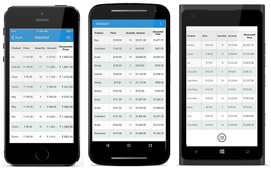

# Unbound Column

The data grid allows adding additional columns which are not bound with data object from the underlying data source. The unbound column can be added using the [SfDataGrid.GridUnboundColumn](http://help.syncfusion.com/cr/xamarin/Syncfusion.SfDataGrid.XForms.GridUnboundColumn.html) class.



<syncfusion:SfDataGrid x:Name="dataGrid" 
                       ItemsSource="{Binding Orders}">
    <syncfusion:SfDataGrid.Columns>
        <syncfusion:GridUnboundColumn MappingName="DiscountPrice"
                                      HeaderText="Discount Price"
                                      Expression="UnitPrice*Discount"
                                      Format="C">
        </syncfusion:GridUnboundColumn>
    </syncfusion:SfDataGrid.Columns>
</syncfusion:SfDataGrid>


SfDataGrid dataGrid = new SfDataGrid();
ViewModel viewModel = new ViewModel();
dataGrid.ItemsSource = viewModel.Orders;

GridUnboundColumn DiscountColumn = new GridUnboundColumn()
{
    MappingName = "DiscountPrice",
    HeaderText = "Discount Price",
    Expression = "UnitPrice*Discount",
    Format = "C"
};
this.dataGrid.Columns.Add(DiscountColumn);



N> It is mandatory to specify the [GridColumn.MappingName](https://help.syncfusion.com/cr/xamarin/Syncfusion.SfDataGrid.XForms.GridColumn.html#Syncfusion_SfDataGrid_XForms_GridColumn_MappingName) for `SfDataGrid.GridUnboundColumn` with some name to identify the column. It is not necessary to define name of the field in the data object.

## Populating data for the unbound column

Data for the unbound column can be populated by setting the [Expression](https://help.syncfusion.com/cr/xamarin/Syncfusion.SfDataGrid.XForms.GridUnboundColumn.html#Syncfusion_SfDataGrid_XForms_GridUnboundColumn_Expression) or [Format](https://help.syncfusion.com/cr/xamarin/Syncfusion.SfDataGrid.XForms.GridColumn.html#Syncfusion_SfDataGrid_XForms_GridColumn_Format) property.

### Using expression

The arithmetic or logic expression can be specified by using the `Expression` property to compute the display value. By default, `GridUnboundColumn` evaluates the expression with casing. The casing will be disabled while evaluating the expression by setting the [CaseSensitive](https://help.syncfusion.com/cr/xamarin/Syncfusion.SfDataGrid.XForms.GridUnboundColumn.html#Syncfusion_SfDataGrid_XForms_GridUnboundColumn_CaseSensitive) property to `false`.

List of supported arithmetic and logical operations are as follows:

<table>
<tr>
<th>
Arithmetic operations
</th>
<th>
Operator
</th>
</tr>
<tr>
<td>
Add
</td>
<td>
+
</td>
</tr>
<tr>
<td>
Subtract
</td>
<td>
-
</td>
</tr>
<tr>
<td>
Multiply
</td>
<td>
*
</td>
</tr>
<tr>
<td>
Divide
</td>
<td>
/
</td>
</tr>
<tr>
<td>
Power
</td>
<td>
^
</td>
</tr>
<tr>
<td>
Mod
</td>
<td>
%
</td>
</tr>
<tr>
<td>
Greater Than
</td>
<td>
>
</td>
</tr>
<tr>
<td>
Less Than
</td>
<td>
<
</td>
</tr>
<tr>
<td>
Equal
</td>
<td>
=
</td>
</tr>
<tr>
<td>
GreaterThanOrEqual
</td>
<td>
>=
</td>
</tr>
<tr>
<td>
LessThanOrEqual
</td>
<td>
<=
</td>
</tr>
</table>

Logical Operations

<table>
<tr>
<th>
Logical operations
</th>
<th>
Operators
</th>
</tr>
<tr>
<td>
AND
</td>
<td>
(char)135
</td>
</tr>
<tr>
<td>
OR
</td>
<td>
(char)136
</td>
</tr>
<tr>
<td>
NOT
</td>
<td>
(char)137
</td>
</tr>
</table>



<syncfusion:SfDataGrid x:Name="dataGrid"                                                                       
                       ItemsSource="{Binding Orders}">
    <syncfusion:SfDataGrid.Columns>
        <syncfusion:GridUnboundColumn MappingName="UnboundColumn"
                                      HeaderText="Unbound Column"
                                      Expression="UnitPrice*Discount" />
    </syncfusion:SfDataGrid.Columns>
</syncfusion:SfDataGrid>


SfDataGrid dataGrid = new SfDataGrid();
ViewModel viewModel = new ViewModel();
dataGrid.ItemsSource = viewModel.Orders;

GridUnboundColumn DiscountColumn = new GridUnboundColumn()
{
    MappingName = "DiscountPrice",
    HeaderText = "Discount Price",
    Expression = "UnitPrice*Discount"
};
this.dataGrid.Columns.Add(DiscountColumn);



### Using format

Value of other columns can be formatted, and the formatted value displayed in the unbound column using the `Format` property.



<syncfusion:SfDataGrid x:Name="dataGrid"
                       ItemsSource="{Binding Orders}">
    <syncfusion:SfDataGrid.Columns>
        <syncfusion:GridUnboundColumn MappingName="DiscountPrice"
                                      HeaderText="Discount Price"
                                      Format="'{Discount}% for {OrderID}'" />
    </syncfusion:SfDataGrid.Columns>
</syncfusion:SfDataGrid>


SfDataGrid dataGrid = new SfDataGrid();
ViewModel viewModel = new ViewModel();
dataGrid.ItemsSource = viewModel.Orders;

GridUnboundColumn DiscountColumn = new GridUnboundColumn()
{
    MappingName = "DiscountPrice",
    HeaderText = "Discount Price",
    Format = "'{Discount}% for {OrderID}'"
};
this.dataGrid.Columns.Add(DiscountColumn);



### Using QueryUnboundColumnValue event

The [QueryUnboundColumnValue](https://help.syncfusion.com/cr/xamarin/Syncfusion.SfDataGrid.XForms.SfDataGrid.html) event is fired when value for the unbound column is queried. It provides the information about the cell that triggered this event. So, you can set the desired value for the grid cells of the unbound column. This event is triggered with the [GridUnboundColumnEventsArgs](http://help.syncfusion.com/cr/xamarin/Syncfusion.SfDataGrid.XForms.GridUnboundColumnEventsArgs.html).

The `GridUnboundColumnEventsArgs` provides the following properties:

 * [Column](https://help.syncfusion.com/cr/xamarin/Syncfusion.SfDataGrid.XForms.GridUnboundColumnEventsArgs.html#Syncfusion_SfDataGrid_XForms_GridUnboundColumnEventsArgs_Column): Gets GridColumn of the cell that triggers this event.  
 * [OriginalSender](https://help.syncfusion.com/cr/xamarin/Syncfusion.SfDataGrid.XForms.GridEventArgs.html#Syncfusion_SfDataGrid_XForms_GridEventArgs_OriginalSender): Gets the data grid raising this event.
 * [Record](https://help.syncfusion.com/cr/xamarin/Syncfusion.SfDataGrid.XForms.GridUnboundColumnEventsArgs.html#Syncfusion_SfDataGrid_XForms_GridUnboundColumnEventsArgs_Record): Gets the underlying row data.  
 * [UnboundAction](https://help.syncfusion.com/cr/xamarin/Syncfusion.SfDataGrid.XForms.GridUnboundColumnEventsArgs.html#Syncfusion_SfDataGrid_XForms_GridUnboundColumnEventsArgs_UnboundAction): Defines the action for triggering this event.
 * [Value](https://help.syncfusion.com/cr/xamarin/Syncfusion.SfDataGrid.XForms.GridUnboundColumnEventsArgs.html#Syncfusion_SfDataGrid_XForms_GridUnboundColumnEventsArgs_Value): Gets or sets the value for GridUnboundColumn cell based on UnboundAction.

N> `UnboundActions.CommitData` and `UnboundActions.PasteData` are currently not supported, and likely to be supported in future.    

Populate the data for the unbound column by handling `QueryUnboundColumnValue` event which allows customizing the value of the `GridUnboundColumn`. `GridUnboundColumnEventsArgs` exposes `Value` property, by which you can set the value for the grid cells of the unbound column based on the `UnboundAction`.

Refer to the following code example in which data for the unbound column is populated by handling the `QueryUnboundColumnValue` event:


dataGrid.QueryUnboundColumnValue += DataGrid_QueryUnboundColumnValue;

private void DataGrid_QueryUnboundColumnValue(object sender, GridUnboundColumnEventsArgs e)
{
    if (e.UnboundAction == UnboundActions.QueryData)
    {
        var quantity = Convert.ToInt16(e.Record.GetType().GetProperty("Quantity").GetValue(e.Record));
        var unitPrice = Convert.ToInt16(e.Record.GetType().GetProperty("UnitPrice").GetValue(e.Record));
        var amount = quantity * unitPrice;
        e.Value = amount;
    }
}

